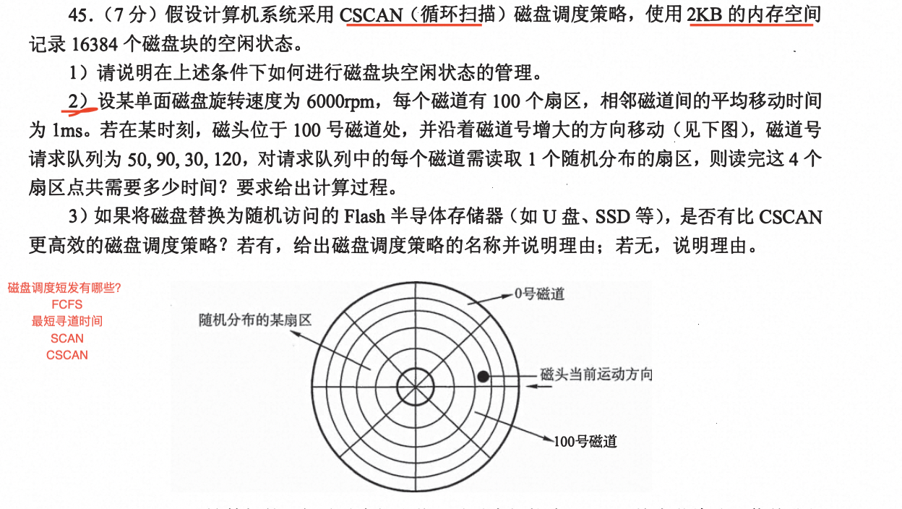

# 2010年408真题

1. 线索二叉树的结构定义和图示

求前中后线索二叉树的步骤：
- 求得前中后序遍历的序列
- 分配左右线索指针，left指向该节点序列的前一个元素，right指向该节点序列的后一个元素，首节点的left指针指向null

2. 树的结点数和叶子结点数计算

结点总数 = 分枝数 + 1（根结点） = 边数 + 1 = `1*度为1的结点个数 + 2*度为2的结点个数 + 3*度为3的结点个数....` + 1= 度为0的个数 + 度为1的个数 + 度为2的个数 + ...

20 * 4 + 10 * 3 + 1*2 + 10 *1 + 1= n0 + 10 + 1 + 10 + 20  => n0 = 82

3. 完全图的边数

- 有向图：n(n-1)/2
- 无向图：n(n-1)

4. 折半查找查找失败的最多比较次数

查找失败的最多比较次数 = 树的高度 （不是树的高度+1 这里是比较次数）
折半查找判定树的特点：
- 平衡性：是一个完全平衡二叉树
- 深度： log2n + 1
- 查找路径的判定


5. 快速排序的递归次数与什么有关？

- 与序列的初始排列有关
- 与分区的处理顺序无关

6. 补码乘法运算溢出判断

共2w位 前w为全0或者全1不溢出，否则溢出

同号相乘得到正数，判断前N位是否为全0 否则溢出

异号相乘得到负数，判断前N位是否位1，否则溢出

也可将补码转换为十进制数 计算乘法 判断该数是否在补码的表示范围内


7. c语言中的类型转换

表示范围：
int < float < double

int->float 存在精度丢失 不会溢出

float->int 存在溢出 不会精度丢失

int—>double 均不会

float->double 均不会

8. RAM和ROM

- RAM是易失性存储器，所以需要刷新，ROM是非易失型存储器，不需要刷新
- RAM和ROM都可采用随机存取方式访问
- RAM速度 > ROM
- RAM可用于高速缓存


9. 程序员可见的寄存器

可见寄存器：通用寄存器组（基址和变址）、程序状态字寄存器PSW、程序计数器PC、累加寄存器ACC、栈指针SP、移位寄存器

不可见：指令寄存器IR、暂存寄存器DR、MAR、MDR

PSW中包含状态标志（CF、ZF、OF、SF）和控制标志（中断允许标志、陷阱），转移指令依赖状态标志，故程序员可见

CPU内部的寄存器有哪些？

运算器：ALU、暂存寄存器、累加寄存器、通用寄存器组、PSW、移位寄存器、

控制器：PC、指令寄存器、指令译码器、MAR、MDR和时序逻辑

10. 造成指令流水线阻塞（冒险）的原因有哪些？

数据冒险（数据相关）、结构冒险（资源冲突）、控制冒险（条件转移）、

解决方案：插入空操作指令、暂停一个时钟周期、采用数据旁路（转发）

## 11. 中断的过程

单中断：

关中断-> 保存断点(PC和PSW) -> 中断服务程序寻址 -> 保存现场 -> 执行中断服务程序 -> 恢复现场 -> 开中断 -> 中断返回

中断隐指令： 关中断-> 保存断点(PC和PSW) -> 中断服务程序寻址

中断服务程序： 保存现场 -> 执行中断服务程序 -> 恢复现场 -> 开中断 -> 中断返回

多重中断：

1️⃣ 关中断。

2️⃣ 保存断点（PC和PSW）。

3️⃣ 中断服务程序寻址。

4️⃣ 保存现场和屏蔽字。进入中断服务程序后首先要保存现场和中断屏蔽字，现场信息是指用户可见的工作寄存器的内容，它存放程序执行到断点处的现行值。

> 现场和断点，这两类信息都不能被中断服务程序破坏。由于现场信息用指令可直接访问， 因此通常在中断服务程序中通过指令把它们保存到栈中，即由软件实现 。而断点信息由 CPU 在中断响应时自动保存到栈或指定的寄存器中，即由硬件实现。

5️⃣ 开中断。允许更高级中断请求得到响应，以实现中断嵌套。

6️⃣ 执行中断服务程序。这是中断请求的目的。

7️⃣ 关中断。保证在恢复现场和屏蔽字时不被中断。

8️⃣ 恢复现场和屏蔽字。将现场和屏蔽字恢复到原来的状态。

9️⃣ 开中断、中断返回。中断服务程序的最后一条指令通常是一条中断返回指令，使其返回到原程序的断点处，以便 继续执行原程序。

1~3 由中断隐指令(硬件自动)完成: 4~ 9 由中断服务程序完成。


11. 操作系统给应用程序提供哪些？

系统调用

12. peterson算法

！！！

单标志法：交替进入临界区 需要由另外一个进程唤醒 若该进程不再进入临界区 则另一个也无法进入 违背空闲让进 

双标志先检查：违背忙则等待 

双标志后检查：违背空闲让进，会出现饥饿现象 违背有限等待

peterson算法：综合1和3的算法思想，使用flag[]解决互斥访问问题，利用turn解决饥饿问题 ，未遵循让权等待

硬件实现：

中断屏蔽方法 使用关中断 临界区 开中断

硬件指令 TestAndSet指令  使用ts给资源上锁 结束后 解锁

硬件指令 Swap

未遵循让权等待，会导致饥饿现象

互斥锁：使用硬件实现，存在忙等现象

信号量：PV操作

整型信号量 未遵循让权等待

记录型信号量 使用链表存储等待资源的进程 解决让权等待

13. 最佳适应&动态分区分配算法

首次适应：按地址递增次序排列，顺序找第一个满足大小（性能最好）

邻近适应（循环首次适应）：从上次结束的位置继续往下查找

最佳适应：按照容量递增 顺序找到第一个满足大小 产生很多外部碎片

最坏适应：按照容量递减排列，找第一个最大

14. 存储转发流水线

流水线传输时延 = k段链路的传输时间 + 前n-1个分组的发送时延 + 最后一个分组在k段链路中的发送时延 
           
           
            =  k段链路的传播时延 + k个流水段 * 单个流水段时间r + （分组个数 - 1） * 单个流水段时间r = kd + kr + (m-1)*r

## 15. ICMP报文的类型

ICMP差错报告报文：终点不可达、源点抑制、时间超过、参数问题、路由重定向

不发送差错报告报文的情况：

ICMP询问报文：:回送请求和回答报文、时间戳请求和回答报文、地址掩码请求 和回答报文、路由器询问和通告报文

ICMP的两个常见应用是分组网间探测PING(用来测试两台主机之间的连通性)和Traceroute(UNIX中的名字，在Windows中是Tracert，可以用来跟踪分组经过的路由)。其中PING使用了ICMP回送请求和回答报文，Traceroute(Tracert)使用了ICMP时间超过报文

16. DNS解析发送请求数分析

主机->本地域名 递归

本地域名-> 其他域名服务器 可采用递归和迭代，递归只需发送DNS请求一次，迭代需要发送多次

17. 索引文件最大文件长度计算

先确定磁盘索引块的大小、磁盘数据块的大小、索引项的大小、再确定索引文件中直接索引项的个数、一级间接索引的个数、二级间接索引的个数

例如：直接索引4个、一级2个、二级1个，索引项占4B，磁盘索引块和磁盘数据块均为256B。

4*256 + 256/4 * 2 *256 +  256/4 *  *256/4 * 256 

18. RIP、OSPF、BGP

内部网关协议：RIP、OSPF

外部网关协议：BGP

RIP
- 距离矢量路由协议，基于跳数，最大跳数为15
- 每隔30S广播路由表中的所有条目，仅与直连的路由器交换信息
- 好消息传的快，坏消息传的慢（慢收敛）
- 因为需要频繁的广播交换信息，故采用UDP协议，端口号为520

OSPF
- 链路状态路由协议。居于洪泛法，交换的是域内全部的路由信息
- 发送的消息是与本路由器相联的所有的链路状态
- 基于IP

BGP
- 基于TCP
- 与本结点相邻的路由器交换信息，首次交换整个路由表，非首次交换有变化的部分

19. 散列表

1️⃣ 确定表长（一般可由装填因子得出或者题目直接给出）

2️⃣ 确定散列函数，常见的散列函数有直接定址法：y=kx+b，除留余数法h = key/p

3️⃣ 确定解决冲突的方法：

开放地址法（在散列函数的基础上增加增量d）：(h(key) + d)/p，d可线性增加，也可平方增加，或者增量由第二个散列函数得到

拉链法：将冲突的同义词使用一个链表存储

4️⃣ 查找成功的平均查找长度计算 = 序列中各元素查找成功的次数之和 / 关键字个数

查找失败 = （0～p-1）查找失败次数之和 / 质数p（要模以的数字）

关键字序列{7,8,30,11,18,9,14}散列存储到散列表中，散列表的存储空间从0开始的一维数组，散列函数H(key)=(key*3)mod7,处理冲突采用线性探测再散列，装填因子为0.7，使用md画出所构造的散列表，计算等概率情况下查找成功和查找失败的平均查找长度


+---+---+---+---+---+---+---+---+---+---+
| 7 |14|   | 8 |   |11|30 |18 | 9 |   |
+---+---+---+---+---+---+---+---+---+---+
 0   1   2   3   4   5   6   7   8   9

查找成功 = （1 + 2 + 1 + 1 + 1 + 3 + 3） / 7 = 12/7

查找失败 = （3 + 2 + 1 + 2 + 1 + 5 + 4）/7 = 18/7

20. 指令格式分析和执行

指令格式：op 寻址特征1 操作数1 寻址特征2 操作数2

指令系统的指令数由操作码OP字段确定2^op

通用寄存器的位数由寄存器寻址操作数的位数确定2^r

MAR的位数：主存地址空间大小M和编制方式字节or字 MB/rB

MDR的位数：等于指令的字长（单字长指令&双字长指令）

转移指令的寻址范围： 
- 相对寻址常规情况下 (PC) + 1 + 偏移量（补码 表示范围-2^n-1 ~ 2^n-1 - 1）

加法指令 是将源操作数和目的操作相加 写回到目的操作数地址中 分清楚(R1) 和 R1的区别

21. cache数组各项物理地址的寻址过程

cache映射方式：

直接映射 标记 行号 块内地址 

全相联：标记 块内

组相联：标记 组号 块内 

cache容量计算：标记位 + 有效位 + 替换位 + 一致位 + 数据

cache访问命中率计算 = 1 - 缺失率 

缺失率计算 = 缺失次数 / 访问总次数（注意读写次数需要x2）

缺失次数分析：设cache行大小为64B，一个int数据占4B，数组`A[256][256]`，故一个cache行可存储16个int数据，每16个缺失一次，共访问2^16次，缺失次数 = 2^16 / 16 

数组首地址320(十进制)分析：
- 每16个一组 320 / 16 = 5，初始行在5行
- 320转为16进制 320 + 31x4

22. 磁盘

管理空闲磁盘盘：
- 空闲表法（顺序存储），空闲盘块表的内容，第一个空闲盘块表，空闲盘块数
- 空闲链表法，盘块链和盘区链，盘区是将多个盘块合并为一个盘区
- 位示图，用二进制的一位表示一个盘块
- 成组链接法，空闲表和空闲链表不是大文件系统，将空闲盘块分组，记录每组的第一个盘块号和盘块数，组成链表

磁盘调度算法

先来先服务算法

最短寻道时间优先算法

SCAN算法（类似于电梯算法）：确定当前磁头的位置，磁头移动的方向，一次访问从磁头的位置到最大磁头位置间的请求，然后调转磁头移动方向，重复上述过程。

C-SCAN算法:类似于SCAN算法，只是在到达最大磁头位置时，会回到起始位置0，继续扫描，消除两端访问

C-LOOK算法：不用到达最大磁头位置，而是当前访问的最大磁头位置后再逆转方向。

注意SCAN和C-SCAN都需要访问到**磁道的最外层，而不是达到最大磁道请求后返回，C-LOOK与之相反，不需要到达最外层而是到达最大磁道请求后返回**

针对最大磁道数请求和最外层问题，真题中若出现了最外层即加入运算，若没出现则不考虑，默认达到最大磁道最大请求后返回

磁盘读数据所花时间 = 寻道时间 + 旋转时间 + 传输时间

寻道时间 = 启动磁头臂t + 常数k*移动磁道数

旋转时间：
- 把扇区移动到磁头的下方（只和硬件有关）
 - 平均旋转延迟 = 1/2 * 转数每秒 


传输时间 = 所需要读写的字节数 / 每秒转数 * 每扇区的字节数
- 如果题目中给出的是读取一个扇区所需要的时间 = 磁盘转一圈的时间 / 一圈的扇区数




```md
(1) 由题可知，可使用2KB内存空间使用位示图管理磁盘块状态，2KB = 2^14b = 16384b 
(2) 使用C-SCAN调度算法，题目为给出最大磁头位置，故到达最大请求位置后返回，以此访问120、30、50、90，共移动170个磁道数。
寻道时间 = 170 * 1ms = 170ms
盘面转一圈的时间为：60S*1000/6000=10ms
平均旋转延迟 = 10 / 2= 5ms
旋转时间 = 平均旋转延迟5ms * 读取4个盘片(旋转4次) = 20ms
读取一个扇区 = 转一圈的时间 / 100个扇区 = 10ms / 100 = 0.1ms
传输时间 = 读取一个扇区 * 4 = 0.4ms

总时间 = 寻道时间 + 旋转时间 + 传输时间 = 170ms + 20ms + 0.4ms = 190.4ms

(3) 采用FCFS调度策略更高效，因为Flash半导体随机存储器的物理结构不需要考虑寻道时间和旋转时间，可直接利用IO请求序列调度
```

23. 页面替换算法

最久不使用算法（最佳置换算法OPT）：换出以后都不会使用的页面或者以后最久不使用的页面，根据集合向后看

先进先出（FIFO）：各个页面置换算法运行过程，按照先进先出策略进行，替换时，淘汰集合的第一个(队列的第一个) 会出现Belady现象 增大集合 缺页次数不减反增

最近最久未使用（LRU）：根据各页使用的集合向前看，

**时钟Clock算法：首次装入或访问 访问位为1，替换时选择0淘汰，并指向淘汰页的下一页**

**改进时钟clocl： 访问位0 修改位1 优先级 00、01、10、11**

先选00 再找01（同时修改访问位为0）

24. CSMA/CD

冲突最长时间 争用期 = 2 * t  = RTT

冲突最短时间 = 单向传播时延

最短帧 = RTT * 数据传输速率

2进制指数规避算法 `[0,...,2^k - 1]， k = min[重传次数，10]`


有效数据传输速率 = 发送数据 / 发送时延+ RTT + 确认时延

