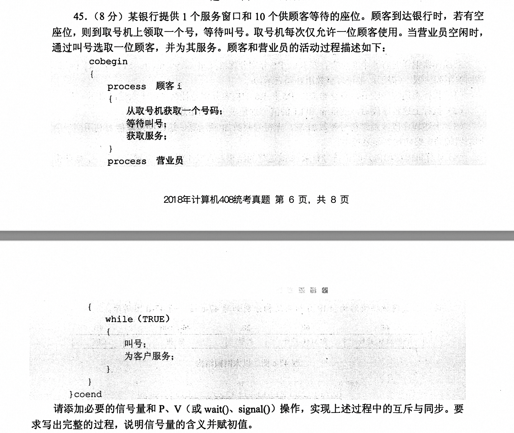
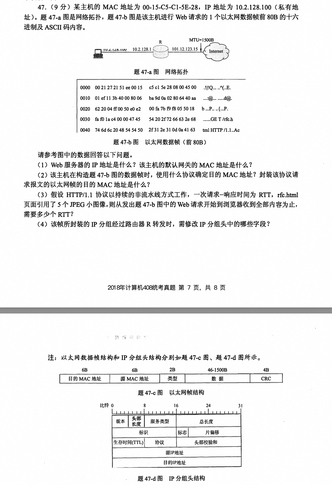

# 2011年真题

## 1. 循环队列

入队：先送值到队尾元素，再将队尾指针加1 rear++

出队：先取队尾元素，再将队头指针++

循环队列（解决假溢出）

循环队列判断队空：`Q.front == Q.rear`

循环队列判断队满的三种方式 `(Q.rear+1)% MaxSize == Q.front`

循环队列入队：`Q.rear  = (Q.rear + 1)% MaxSize`

循环队列出队：`Q.front == (Q.front + 1)% MaxSize`

> 且要求第 1 个进入队列的元素存储在 A[O]处，则初始时 front 和 rear 的值分别是

front = 0, rear = n-1

**区别栈**：入栈先++ 再入栈(因为top指向栈顶元素，故需先将top++再使用top)，出栈先弹出栈顶元素，后--

## 2. 完全二叉树叶子结点个数

IF 总结点数为偶数 -> 叶子结点数 = 总结点数 / 2

ELSE 叶子结点数 = 总结点数 % 2  + 1

## 3. 前序和后序遍历

由于缺乏中序遍历，故不能唯一确定一棵树

因此可利用答案中的选项中序和后序遍历构造一棵树，再求前序是否正确

## 4. 简单路径、图的性质和存储结构

**简单路径**是指图中从一个顶点到另一个顶点的一条路径，该路径不经过任何一个顶点两次。换句话说，在简单路径中，所有经过的顶点都是唯一的，没有重复访问同一个顶点的情况。

**图的存储结构：**

1. **邻接矩阵法**

数据结构定义：边表，顶点表

顶点的度的计算：对矩阵按行遍历非0元素的个数，得到出度，按列遍历，得到入度

优点：查看两个顶点是否相联很容易O(1)`A[i][j]`

缺点：确定边的个数，需要遍历矩阵中1的个数

`A^n[i][j]`的含义：表示顶点i到顶点j的长度为n的路径的数目

适合稠密图

2. **邻接表法**

数据结构定义：数组存储顶点表（数据、指向第一个弧的的指针），边表（链表）

适用于稀疏图

找一个点相邻的边（容易 遍历该点的邻接表）

确定两个顶点间是否存在边（遍历该点的邻接表）

求某个顶点的度 只需计算该点边表结点的个数（无向图）

对于有向图 求某个点的度 出度遍历该点的边表 入度则需要遍历整个邻接表

邻接表不唯一

3. **十字链表**

有向图

解决邻接表存储有向图计算出度需要遍历整个邻接表，因此十字链表很容易求得顶点的出度和入度

数据结构：弧结点包含 弧尾 弧头 弧头相同的下一结点 弧尾相同的下一结点 

弧头相同的结点属于一个链表 弧尾相同的结点属于一个链表

十字链表表示唯一确定一个图

4. **邻接多重表**

无向图

解决邻接表无向图求两个顶点间是否存在边和对边执行删除等操作时，需要分辨在两个顶点的边表中遍历

**拓扑排序和回路问题**

是对**有向无环图**的一种排序，可用于判断是否存在回路

每次选择入度为0的结点，并消去与之相连的边，直到当前图中不存在无前驱的结点为止。

可利用DFS实现拓扑排序，利用结束时间从大到小排列（父结点的结束时间大于孩子结点的结束时间）

> 存在性和唯一性的判断：

各个点仅有唯一的前驱或后继，拓扑排序唯一，否则不唯一

邻接矩阵存储 若为三角矩阵(上三角或狭三角)，则存在拓扑排序，反之不一定

如果图中不存在两个顶点同时满足入度为 0 的条件，则拓扑排序是唯一的。

    A -> B
    |     |
    v     v
    C -> D

    A -> B
         |
         v
    C <- D
邻接矩阵：
```text
  A B C D
A 0 1 1 0
B 0 0 0 1
C 0 0 0 1
D 0 0 0 0

  A B D C
A 0 1 0 0
B 0 0 1 0
D 0 0 0 1
C 0 0 0 0
```

拓扑排序的唯一性取决于图的结构。如果在任一步骤中存在多个入度为 0 的顶点，则拓扑排序就不是唯一的。反之，如果每一步只有一个入度为 0 的顶点，则拓扑排序是唯一的。

判断一个图中是否存在回路：

DFS、BFS、并查集、拓扑排序


## 5. 性能指标

时钟周期：CPU工作的最小时间单元

主频 = 1/时钟周期

CPI：一条指令所需要的时钟周期数

IPS：每秒执行多少条指令 IPS = 主频 / 平均CPI

MIPS：每秒执行多少百万条指令  = 主频/ (CPI x 10^6)

MIPS 百万 10^6 

GIPS 十亿 10^9 （10^8 = 亿）

TIPS 万亿 10^12 

PIPS 千万亿 10^15  亿亿10^16

执行时间 = 指令条数 x CPI / 主频

## 6. 浮点数

单精度浮点数格式（32位）：1一位符号位，8位阶码，23位尾数（最高位隐含1所以拓展到24位）

双精度浮点数格式（64位）：一位符号位，11位阶码，52位尾数

阶码使用移码e表示（真值+偏置值127） 1～254，真值范围-126 ～ 127

> 单精度最小值和最大值(2012 14)
> 
最小值 1.0 x 2^-126    

最大正整数  1.111111... x 2^127 = (2-2^-23) x 2^127  = 2^128 - 2^104 (2012)

阶码全0全1的含义（正零、负零、正无穷、负无穷）

0.23个11如何表示？ 2-2^-23

非规格化数的满足条件：阶码全0 尾数不为0 

非规格化正数和负数：尾数 x 2^-126

## 7. RAM和ROM

- RAM是易失性存储器，所以需要刷新，ROM是非易失型存储器，不需要刷新
- RAM和ROM都可采用随机存取方式访问
- RAM速度 > ROM
- RAM可用于高速缓存

**SRAM和DRAM的原理**

六晶体MOS管，栅极电容（定期充电也就是刷新）

DRAM需要读后再生和定期刷新，集中刷新、分散刷新、异步刷新，行列地址分两次送，

地址线复用技术：行地址和列地址通过相同的引脚分先后两次输入，地址引脚线可减少一半

按行刷新，故行列尽可能相同，行数 <= 列数

SRAM一般用于高速缓存cache和TLB

## 8. 偏移寻址方式

‼️ 相对寻址：pc + 相对偏移量（补码给出）（计算偏移量和目标地址） `pc + “1” + A` 广泛用于转移指令，有利于程序浮动

基址寻址：基址寄存器BR的内容 + A （基址寄存器的内容不变 由os指定 A可变 一般用于多道程序设计）

为什么可用于多道程序？因为程序一般会经过编译、链接、装入，链接过程中形成的逻辑地址，装入到内存中时，需要记录起始物理地址，一般用用一个通用寄存器作为基址寄存器存放该物理地址，进程的PCB中也可记录该寄存器，在多道程序并发中，可改变基址寄存器的值实现并发。

变址寻址：变址寄存器IX的内容 + A （变址寄存器的内容可变 由用户指定 A不变 一般用于循环和数组）

在数组访问中，变址寄存器设为数组的偏移量，形式地址为数组的首地址

## 9. 条件转移的标志位信息

**OF、SF、ZF、CF所表示的含义**

OF：溢出标志，对无符号数无意义，用于**有符号数**的溢出判断 OF = Cn 异或 Cn-1 符号位进位和最高数位进位异或

CF：进位标志，对有符号数无意义，用于**无符号数**的溢出判断 CF = Sub 异或 Cout

ZF：零标志位，均适用。

SF：符号位，对无符号数无意义

**无符整数条件转移指令bgt >= 的转移条件**

无符号数，只需使用CF和ZF判断

a - b

CF = 0 ZF=0 表示大于，CF=0 ZF=1 表示等于

（CF + ZF）取反 -> 大于等于

**无符号数溢出的判断**：CF=1，表示溢出，同号相加，异号相减

**带符号数溢出判断**：OF=1，表示溢出，同号相加，异号相减

## 10. 系统总线&总线
// TODO
需要好好看看总线的逻辑

总线的分类：片内总线、系统总线、IO总线、通信总线

片内总线：芯片内部的总线，用于CPU芯片内部各寄存器之间及寄存器与ALU的连接

系统总线：
- 数据总线用来在各部件之间传输数据、指令和中断类型号等，它是双向传输总线，数据总线的位数反映一次能传送的数据的位数。
- 地址总线用来指出数据总线上源数据或目的数据所在的主存单元或1/0端又的地址，它是单向传输总线，地址总线的位数反映最大的寻址空间。
- 控制总线用来传输各种命令、反馈和定时信号，典型的控制信号包括时钟、复位、总线 请求/允许、中断请求/回答、存储器读/写、1/O读、1/0 写、传输确认等
  
IO总线：主要用于连接中低速的I/ O设备，通过1/ O接又与系统总线相连接，目的是将 低速设备与高速总线分离，以提升总线的系统性能，常见的有USB、PCI 总线。

通信总线：计算机系统之间或计算机系统与其他系统(如远程通信设备、测试设备)之 间传送信息的总线，通信总线也称外部总线，例如传送握手信号

总线仲裁：

- 请求阶段。主设备(CPU 或 DMA)发出总线传输请求，并且获得总线控制权。

- 仲裁阶段。总线仲裁机构决定将下一个传输周期的总线使用权授予某个申请者。

- 寻址阶段。主设备通过总线给出要访问的从设备地址及有关命令，启动从模块。

- 传输阶段。主模块和从模块进行数据交换，可单向或双向进行数据传送。

- 释放阶段。 主模块的有关信息均从系统总线 上撤除，让出总线使用权。

## 11. 进程和线程共享

>同一进程创建的不同线程可共享的内容有哪些？

1. 内存空间

- 全局变量: 所有的线程都能访问进程内的全局变量。
- 堆内存: 动态分配的内存（通过 malloc()、new 等操作符）也是所有线程共享的。
- 栈内存: 每个线程有自己的栈空间，但是可以通过指针传递栈上的数据给其他线程。

2. 文件描述符

- 进程打开的文件描述符可以被所有线程访问和操作。
  
3. 系统资源

- 信号量: 多线程程序可以使用信号量来进行同步。
- 互斥锁: 用于保护临界区，防止多个线程同时修改共享数据导致错误。
- 条件变量: 用于线程间的等待和唤醒操作。

4. 其他资源

- 数据库连接: 如果进程持有数据库连接，所有线程可以共享这个连接。
- 网络连接: 同样，网络连接也可以由多线程共享。

> 不能共享内容：各线程各自独立的内容，如局部变量、栈指针

## 12. 输入/输出软件层次

**用户层、与设备无关的软件层、设备驱动程序和中断处理程序**

当用户使用设备时， 首先在用户程序中发起一次系统调用，操作系统的内核接到该调用请求
后请求调用处理程序进行处理， 再转到相应的设备驱动程序， 当设备准备好或所需数据到达后设 备硬件发出中断， 将数据按上述调用顺序逆向回传到用户程序中。

键盘接收数据的中断过程分析：

1、用户按键，生成对应的键码，放入控制器的数据寄存器中

2、控制器发出中断请求信号

3、CPU在中断周期相应中断

4、数据读取

5、恢复进程执行

## 13. 抖动&工作集&Belady

抖动：刚换下页面，又即将要被访问 （最少使用算法（LRU）、先进先出（FIFO）、以及最不久未使用（LFU））

工作集：集合中分配的页框号（不重复）

Belady是说缺页次数不减反增（FIFO、随机置换）

交换区用于内存管理（存放临时不活跃的内存页面）、文件区用于文件数据的长期访问和存储

交换区的io速度大于文件区

## 14. 逻辑地址和物理地址

编译后的模块需要经过链接才能装载，而链接后形成的地址才是整个程序的完整逻辑地址空
间。

C语言经过预处理(cpp)-编译(eel)-汇编(as) -链接Cld)产生可执 行文件。 其中链接的前一步， 产生了可重定位的二进制的目标文件。C语言采用源文件独立编译 的方法，如程序main.e, filel.efi, le2.efi, lel.hfi, le2.h, 在链接的前 一 步生成了main.ofi, lel.ofi, le2.o, 这些目标模块采用的逻辑地址都从 0开始，但只是相对于该模块的逻辑地址。链接器将这三个 文件，
lbi e和其他的库文件链接成一个可执行 文件。 链接阶段主要完成了重定位， 形成整个程序的完整逻辑地址空间。

例如， filel.o的逻辑地址为o～1023, main.o的逻辑地址为0～1023, 假设链接时将filel.o 链接在main.o之后， 则重定位之后filel.o对应的逻辑地址就应为1024～2047。

认为产生逻辑地址的阶段是链接，下面引入一个线性 地址的概念来解释为什么链接是不对的。 为了区分各种不同的地址， 下面也把逻辑地址和物理地
址一并介绍。

逻辑地址(Lgo ieal Address)是指在程序各个模块中的偏移地址。 它是相对于当前模块首址
的地址。

线性地址(LinearAddress)是指在分页式存储管理中单个程序所有模块集合在一起构成的
地址。

物理地址(PhysiealAddress)是指出现在CPU外部地址总线上的寻址 物理内存的地址信号，
是地址变换的最终结果地址。 它实际上就是物理内存真正的地址。 

## 15. TCP/IP网络层提供的服务

无链接不可靠的数据报服务

OSI 参考模型在网络层支持无连接和面向连接的通信，但在传输层仅有面向连接的通信。

而TCP/IP 模型认为可靠性是端到端的问题，因此它在网际层仅有一种无连接的通信模式， 但传输层支持无连接和面向连接两种模式。

## 16. MAC协议

**CSMA/CA：**
CSMA/CA是无线局域网标准802.11中的协议，它在CSMA的基础上增加了冲突避免的功能。
ACK帧是CSMA/CA避免冲突的机制之一 ， 也就是说， 只有当发送方收到接收方发回的ACK帧 后才确认发出的数据帧已正确到达目的地。

帧间间隔有：SIFS（最短帧）、PIFS、DIFS

预约信道的方法：等待最长帧DIFS、发送RTS请求帧，目的站返回CTS并广播CTS，等待SIFS后，传送数据


## 17. 子网聚合路由表

路由表结构：目的ip 子网掩码 下一跳ip 接口

子网聚合：求各子网的公共前缀


## 18. 图的邻接矩阵


|---|---|---|---|---|---|
|   0  |   4  |  6   |   ∞  |    ∞ |   ∞  |
| --- | --- | --- | --- | --- | --- |
|    ∞  |   0  |  5   |   ∞  |   ∞  |    ∞ |
| --- | --- | --- | --- | --- | --- |
|    ∞  |    ∞  |   0  |  4   |  3   |   ∞  |
| --- | --- | --- | --- | --- | --- |
|    ∞  |    ∞  |    ∞  |  0   |  ∞   |   3  |
| --- | --- | --- | --- | --- | --- |
|   ∞   |    ∞  |    ∞  |    ∞  |   0  |   3  |
| --- | --- | --- | --- | --- | --- |
|    ∞  |    ∞  |     ∞ |    ∞  |    ∞  |   0  |
| --- | --- | --- | --- | --- | --- |

**[求关键路径](/dataStructure/chapter6#关键路径)：**

法一：观察法，找到一条路径的权值之和最大的即为关键路径长度，路径上的各结点即为关键路径 （推荐）

法二：
- 事件 Vk 的最早发生时间 Ve(k)
- 事件 Vk 的最迟发生时间 Vl(K)
- 活动 Ai 的最早开始时间 e(i)=Ve(k)
- 活动 Ai 的最迟开始时间 l(i)= Vl(j)- Weight(Vk,Vj)
- 一个活动 Ai 的最迟开始时间 l(i)和其最早开始时间 e(i)的差额 d(i)=l(i)-e(i)

## 19. 求中位数

> 求两个升序序列A、B的中位数


```c
// 法一 双指针
int SearchMid(int A[],int lenghtA,int B[],int lenghtB){
  int i=0, j=0;
  for(int k=0; k< (lengthA + lenghtB + 1)/2; k++){
    if(A[i]>B[j]) j++;
    else i++
  }
  if(A[i]>B[j])return A[i];
  else return B[j]
}
```
**[法二快速排序](/dataStructure/chapter8#快速排序)**

## 20. 无符号数和符号数运算


 R1寄存器的内容为x=134，二进制1000 0110 ,十六进制**86H**

 R5寄存器的内容为z1= x - y， 无符号数减法运算等x + y的补码，y=246，二进制1111 0110，转为补码 0000 1010 = 10 ，故 x  + 10 = 144  = **90H**

 R6寄存器的内容为z2 = x + y 无符号数加法运算 134 + 246 = 380（溢出截断）256 + 124 =  1 0111 1100 = **7CH**

 `int m = x`表示用带符号数解析x的值，**x的二进制位1000 0110（补码），转换为原码1111 1010 = -122**，

 `int k = m -n`，m的十进制数为-6，`int n = y`与m带符号数解析一致，y的二进制位1111 0110（补码），转化成原码为1000 1010，用带符号数解析成-10，`k = -122 - (-10) = -112`

 带符号数和无符号数的加减运算可使用同一个加法器，理由：n位加法器 实现的是模2^n 无符号整数加法运算 。对于无符号整数 a和b, a + b可以直接用加法器实现， 而a -b可用a 加b的 补数实现，即a-b= a+ [-b]补 (mod2n), 所以n位无符 号整数加/减运算都可在n位加法器中实现。

带符号数判断溢出：同号相加，异号相减，OF位为1溢出

无符号数判断溢出：同号相加，异号相减，CF为1溢出

`int k1 = m + n = -122 + (-10) = -132` 溢出

⚠️：**带符号数用补码表示**

## 21. 信号量



```c
semaphore seat = 10 ;// 座位容量
semaphore service = 1; // 服务窗口
semaphore mutex = 1; // 取号机互斥
semaphore wait = 0; // 等待服务人数
{
  process customeri{
    P(seat);
    P(mutex);
    取号
    V(mutex);
    V(wait); // 等待人数 + 1
    P(service); // 等待被叫号
    // 获取服务
    V(seat); // 离开
  }
  process clerk{
    while(true){
      P(wait); // 此时有顾客
      V(service); // 叫号 为顾客服务
    }
  }
}
```

## 22. 文件系统

**某文件系统为一级目录结构，文件的数据一次性写入磁盘，已写入的文件不可修改，但可多次创建新文件。 请回答如下问题。**

**(1)在连续、 链式、 索引三种文件的数据块组织方式中，哪种更合适?要求说明理由。 为定位文件数据块，需要FCB中设计哪些相关描述字段?**
因为文件的数据一次性写入磁盘，并且不可修改，故可采用连续方式。

FCB中需要增加 起始盘块号 盘块数

链接分配 

目录项的信息：起始盘块号 结束盘块指针

隐式链接链表项的信息：盘块内容和指向下一盘块号的指针

显示链接FAT的信息：FAT在整个磁盘中只有一个，内容包含盘块号以及指向下一盘块的的指针，目录中只有起始盘块号，根据起始盘块号去FAT中查找对应的盘块和下一盘块号

目录项的信息：索引表的磁盘号

索引分配中索引表的信息：所有磁盘块号

**(2)为快速找到文件，对于FCB, 是集中存储好，还是与对应的文件数据块连续存储好?要 求说明理由。**

想要快速找到文件，FCB集中存储较好，查询文件首先查询FCB，再根据文件组织方式查询对应表项。


**FCB的内容**

文件控制块的目的是为了管理文件

包含内容：文件名，文件大小，inode节点，文件访问控制权限，类型，文件状态（打开or关闭），指针

**FAT**

FAT在整个系统中只有一张，在操作系统启动时加入内存中，包含盘块号和下一盘块号，下一盘块号为-1表示该盘块为最后一个盘块，若为-2，表示该盘块为空闲盘块

**文件的查询**

FCB查找：当你需要查询某个文件时，首先会通过文件名或其他标识符找到相应的 FCB。FCB 存储了文件的元数据信息，比如文件名、创建时间、文件大小等。

FCB 通常存储在目录项中，目录项是一种特殊的文件结构，用于存储文件的元数据信息。

FAT使用 ：找到 FCB 后，你可以从中获得文件的一些基本信息，比如文件的第一个簇编号。

然后，通过这个簇编号，可以在 FAT 中查找文件的实际数据位置。FAT 存储了文件数据所在簇的链接信息，从而能够追踪文件的所有数据块。


## 23. MAC和IP地址结构



Oa 02 80 64 =  源IP  = 10.2。128.100，40 aa 62 20 =目的IP = 64.170.98.32

默认网关的MAC = 00-21-27-21-51-ee

使用ARP地址解析协议确定MAC地址 使用广播方式即请求报文的MAC地址为FF-FF-FF-FF-FF-FF-FF


题目发出web请求开始（此时已经建立链接）：请求文档 1RTT + 5 * RTT（JPG图片） （建立TCP链接1RTT ）

由于10是私有地址不能出现在公网上，需要使用NAT转换，需要改变源IP地址，每经过一个路由器TTL-1 ，每经过一个路由器重新校验头部校验和，若Ip分组长度超过最大mtu，则还需要进行分片，则总长度、片偏移、标志字段也要发生改变
