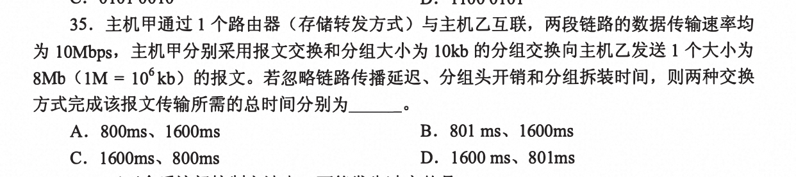

# 2013 

## 1. 合并两个升序链表为m+n的降序链表

利用空间换时间：遍历链表`max{m,n}`，输出到一个空数组当中，再对该数组遍历，输出到新链表中。最大时间复杂度`max{m,n}`

## 2. 带权路径长度(‼️)

各结点权值x路径长度 求和 = 带权路径长度

带权路径长度最小即为哈夫曼树，每次从最小的权值开始构造

三叉树{2,3,4,5,6,7}构造哈夫曼树

（1）构造一个空结点0，分别与2，3相加的新结点权值 = 5 ，集合`{4,5,5,6,7}`

（2）4,5,5构造新结点 = 14，集合`{6，7，14}`

（3）6+7+14 = 27

故带权路径长度 = `(2+3)*3 + (4+5)*2 + (6+7)*1` = 46

## 3. [关键路径缩短工期](/dataStructure/chapter6#关键路径)

关键路径不唯一，故需要缩短所有关键路径上共有的活动才能减少关键路径上的工期

关键路径`{b、d、c、g}、{b、d、e、h}、{b、f、h}`

只有缩短f、d才能缩短工程工期

## 4. [B树和B+树结点数和根结点的区别](/dataStructure/chapter7#b-树的基本概念)

B树的根节点 `1~m-1`，非根节点`（m/2）向上取整-1 <= xxx <= m-1`

B+数的根节点 `2~m`，非根节点`（m/2）向上取整 <= <= m`

**高度为2的5阶b树，关键字最少为**

非根节点数：5/2向上取整 -1 = 2，根节点1，故总数 = 1 + 2 + 2 = 5

## 5. [MIPS](/组成原理/强化)

主频理解为每秒钟有多少个时钟周期，CPI表示每条指令需要多少个时钟周期

IPS(每秒钟执行多少条指令) = 主频 / CPI （将主频按照每条指令所需的时钟周期分割，即可得到每秒执行多少条指令）

MIPS = 主频 / (CPI x 10^6)

## 6. IEEE浮点数格式&补码的表示范围（‼️）

[IEEE单精度浮点数格式](/组成原理/强化#_13-ieee754标准)：1位符号位 + 8位阶码 + 23位尾数

注意偏置值位127，真值 = 阶码 - 偏置值

补码的表示范围：-2^n-1 ~ 2^n-1 -1(例如n为8位，可表示-2^7~2^7 -1 = -128 ~ 127)

## 7. 指令流水线的吞吐率

**CPU主频1.03GHz，采用四级指令流水线，每个流水段的执行需要一个时钟周期，假定CPU执行100条指令，执行过程中没有发生任何阻塞，流水线的吞吐率？**

流水线的吞吐率 = 执行指令数 / 执行时间？

执行时间 = 99 + 4  = 103个时钟周期 

吞吐率 = 100条指令 / （103x(1/主频)） = 100x1.03GHz / 103 = 1x10^9条指令/秒

## 8. 设备和控制器（IO接口）之间互连的接口标准

**USB**是一 种连接外部设备的 I/0 总线标准， 属于设备总线， 是设备和设备控制器之间的接口。

**PCI、AGP、PCI-E**作为计算机系统的局部总线标准，通常用来连接主存 、网卡、视频卡等。

## 9. 海明码

设校验位的位数为k, 数据位的位数为n, 海明码能纠正一位错应满足下述关系: 2^k > n+k+1。 n=8, 当k=4时，2^4 (=16)>8+4+I (=13), 符合要求，故校验位至少是4位。

## 10. 提高[RAID](/组成原理/chapter3#磁盘阵列)可靠性

RAIDO方案是无冗余和无校验的磁盘阵列， 而RAID1～5方案均是加入了**冗余(镜像)或校验（奇偶校验和海明码）**的磁盘阵列。

**条带化技术**就是一种自动地将I/O的负载均衡到多个物理磁盘上的技术， 条带化技术就是将一块连续的数据分成很多小部分并把它们分别存储到不同磁盘上去。 这就能使多个进程同时访问数据的多个不同部分但不会造成磁盘冲突， 而且在需要对这种数据进行顺序访问的时候可以获得最大程度上的1/0并行能力， 从而获得非常好的性能。

chache机制是利用局部性原理减少访存次数，提高运行速率。

故能够提高RAID 可靠性的措施主要是对磁盘进行镜像处理和奇偶校验， 其余选项不符合条件。
 
## 11. [磁盘读取时间](/408/2010#_22-磁盘)（转速‼️）

t = 寻道时间 + 旋转时间 + 读取时间 

**转速和旋转时间的关系：10000rpm = 60 x 1000 / 10000 =  6ms （1s = 1000ms）**

平均旋转时间 = 6ms/2 = 3ms

读取时间 = 4KB / 20MB/s  = 0.2ms

总时间 = 3ms + 6ms + 0.2ms + 0.2ms = 9.4ms

## 12. [IO方式和DMA方式](/组成原理/chapter7#i-o-方式)

IO中断方式请求的是CPU处理时间，在指令周期的中断周期（指令执行结束之后）响应，数据传送通过软件（中断处理程序）完成。

**[IO处理过程层次](/408/2012#_13-io子系统层次)**

**[总线事务](/组成原理/chapter6#总线事务)**:从请求总线到完成总线使用的操作序列称为总线事务，它是在一个总线周期中发生的一系列活动。典型的总线事务包括请求操作、仲裁操作、地址传输、数据传输和总线释放

## 13. [删除文件的过程](/os/强化#_45-文件删除的过程-链接计数器的变化)

删除文件并不会删除所在目录，因为此目录下可能存在别的文件。

## 14. [文件数据块组织方式的优缺点](/os/chapter4#文件的物理结构)

分清楚文件物理结构和逻辑结构的关系

## 15. 计算磁盘的柱面号、磁头号、扇区号的程序

由设备驱动程序完成

[磁盘地址解析](/408/2010#_22-磁盘)

## 16. 操作系统的加载

**[磁盘初始化](/os/chapter5#_1-磁盘初始化)**

**第一阶段：BIOS：**

1. BIOS：开机程序被刷入ROM芯片，计算机通电后，第一件事就是读取它。这块芯片里的程序叫做"基本輸出輸入系統"（Basic Input/Output System），简称为BIOS。

2. 硬件自检：BIOS程序首先检查，计算机硬件能否满足运行的基本条件，这叫做"硬件自检"（Power-On Self-Test）。如果硬件出现问题，主板会发出不同含义的蜂鸣，启动中止。如果没有问题，屏幕就会显示出CPU、内存、硬盘等信息。

3. 启动顺序：硬件自检完成后，BIOS把控制权转交给下一阶段的启动程序。这时，BIOS需要知道，"下一阶段的启动程序"具体存放在哪一个设备。也就是说，BIOS需要有一个外部储存设备的排序，排在前面的设备就是优先转交控制权的设备。这种排序叫做"启动顺序"（Boot Sequence）。

**第二阶段：主引导记录**

  BIOS按照"启动顺序"，把控制权转交给排在第一位的储存设备。这时，计算机读取该设备的第一个扇区，也就是读取最前面的512个字节。

1. 主引导记录的结构："主引导记录"只有512个字节，放不了太多东西。它的主要作用是，告诉计算机到硬盘的哪一个位置去找操作系统。

2. 分区表：硬盘分区有很多好处。考虑到每个区可以安装不同的操作系统，"主引导记录"因此必须知道将控制权转交给哪个区。

**第三阶段：硬盘启动**

计算机的控制权就要转交给硬盘的某个分区了，这里又分成三种情况。

1. 卷引导记录：告诉计算机，操作系统在这个分区里的位置。然后，计算机就会加载操作系统了

2. 扩展分区和逻辑分区

3. 启动管理器：在这种情况下，计算机读取"主引导记录"前面446字节的机器码之后，不再把控制权转交给某一个分区，而是运行事先安装的"启动管理器"（boot loader），由用户选择启动哪一个操作系统。

**第四阶段：操作系统**

控制权转交给操作系统后，操作系统的内核首先被载入内存。

## 17. [死锁](/os/chapter2#死锁)-银行家算法

死锁产生的四个必要条件：
- 互斥条件
- 不可剥夺
- 请求保持 进程至少保持了一个资源 但又请求一个新的资源请求，该资源被其他进程占有
- 循环等待

破坏死锁产生的必要条件是预防死锁的方法。

银行家算法属于避免死锁（事先预防策略），需要事先知道所有资源的请求，处于安全状态时，此时必然没有死锁，若处于不安全状态，可能会出现死锁。

## 18. OSI模型

OSI模型属于七层模型，物理层、数据链路层、网络层、传输层、会话层、表示层、应用层

TCP/IP模型属于四层模型，网络接口层、网际层、传输层、应用层

五层模型：物理层、数据链路层、网络层、传输层、应用层

## 19. 曼彻斯特编码

归零编码：高1 低0 （后半个码元都需要跳变为中间 作为同步时序）

非归零：高1 低0 不跳变

反向非归零：后一个为0跳变 为1不变

曼彻斯特：高低为1 低高为0 重点‼️

差分曼彻斯特：为1 延用前面信号后半个码元 为0 与前面信号后半个码元相反 重点‼️

## 20. 分组交换和报文交换时延计算

报文交换：发送一个报文t=8Mb/10Mb/s = 800ms 经过一个路由器 故t = 1600ms

分组交换采用流水线形式发送：800个分组，两个流水段，一个分组的发送时延 = 1ms，故t= 799x1 + 2x1 = 801ms

## 21. HDLC协议组帧

组帧遇到连续的5个1就插入0，

拆解：遇到连续的5个1就删除后面一个0

## 22. 直通转发时延

直通交换在输入端口检测到 一 个数据帧时，检查帧首部， 获取帧的目的地址，启动内部的动态查找表转换成相应的输出端口， 在输入与输出交叉处接通，把数据帧直通到相应的端口， 实现交换功能。 直通交换方式只检查帧的目的地址， 共6B,

所以最短的传输延迟 = 6Bx8 / 100Mb/s = 0.48us

最短mac帧64B
