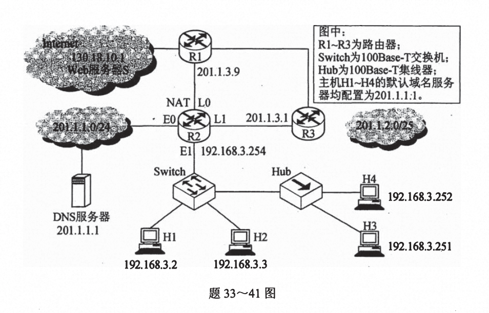
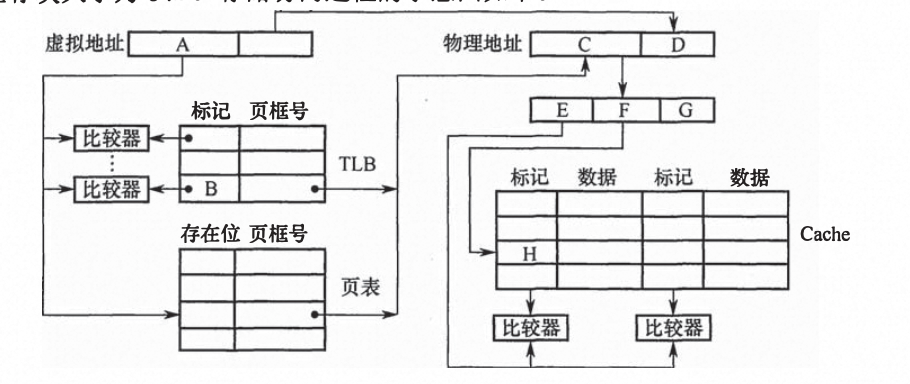
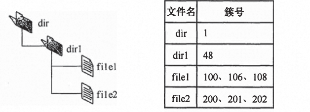

# 2016

## 1. 双向双链表删除结点

```c
p->prev->next = p->next;
p->next->prev = p->prev;
```

## 2.  三对角矩阵存储(⚠️ -1)

**Mij(1<= i、j <= 100)，求M(30、30)**

**2 + 3*28 + 2 = 88 放入数组下标为87**

⚠️：<span class='text-rose-600'>需要-1</span>

## 3. 求森林中树的个数

**若森林F有15条边、25个结点，则F包含树的个数是**

解法一：树有一个很重要的性质：在n个结点的树中有n-1条边，“那么对于每棵树，其结点数比边数多1”。题中的森林中的结点数比边数多10（即25-15=10），显然共有10棵树。

解法二：若考生再仔细分析可发现，此题也是考察图的某些方面的性质：生成树和生成森林。此时对于图的生成树有一个重要的性质：若图中顶点数为 n，则它的生成树含有n-1条边。对比解法一中树的性质，不难发现两种解法都利用到了“树中结点数比边数多1”的性质，接下来的分析如解法一。

## 4. 拓扑排序时间复杂度

- [2012-拓扑排序唯一性问题](/408/2012#_4-拓扑排序唯一性问题)
- [2012-图的相关复杂度分析](/408/2012#_3-图的相关复杂度分析)

**O(n+e)**

## 5. B树和B+树的区别

- [2009-m阶B树和B+树的区别](/408/2009#_3-m阶b树和b-树的区别)
- [2014-B树](/408/2014#_4-b树)
- [2013-B树和B+树结点数和根结点的区别](/408/2013#_4-b树和b-树结点数和根结点的区别)

**由于B+树的所有叶结点中包含了全部的关键字信息，且叶结点本身依关键字从小到大顺序链接，可以进行顺序查找，而B树不支持顺序查找 (只支持多路查找)**


## 6. 带符号数转无符号数（32767）

```c
short si = -32767;
unsigned short usi = si;

// 求usi的值
```
2^16 = 65536、2^15 = 32768

-32767 = 1 111 1111 1111 1111 1111 1111 1111 1111 = 转为补码 = 1 000 0000 0000 0000 0000 0000 0000 0001

usi = 1 000 0000 0000 0000 0000 0000 0000 0001 = 32678 + 1 = 32769

## 7. 小端存储

**某计算机字长为32位，按字节编址，采用小端（Little Endian）方式存放数据。假定有一个 double 型变量，其机器数表示为1122 3344 5566 7788H，存放在00008040H 开始的连续存储单元中，则存储单元 00008046H 中存放的是**


| 40 | 41 | 42 | 43 | 44 | 45 | 46 | 47 |
| ------------ | ------------ | -------------- |------------ | ------------ | -------------- |  -------------- |  -------------- |
| 88 | 77 | 66 | 55 | 44 | 33 | 22 | 11 |


## 8. cache缺失率

有如下C语言程序段：
```c
for (k=0; k<1000; k++)
a [k] = a[k]+32;
```
**若数组a及变量k均为 int 型，int 型数据占4B，数据Cache 采用直接映射方式，数据区大小为1KB、块大小为16B，该程序段执行前 Cache 为空，则该程序段执行过程中访问数组a的Cache 缺失率约为**

分析语句`a [k] = a[k]+32;`：首先读取 `a[k］`需要访问一次`a[k］`，之后将结果赋值给`a[k］`需要访问一次，共访问两次，共访问2000次。

cache块大小为16B，int占4B，每4个缺失一次，1000 / 4 = 250，故该程序段执行过程中访问数组a的 Cache 缺失率约为 250/2000 = 12.5%

第一次访问`a[k］`未命中，并将该字所在的主存块调入 Cache 对应的块中，对于该主存块中的4个整数的两次访问中只在访问第一次的第一个元素时发生缺失，其他的7次访问中全部命中，故该程序段执行过程中访问数组a的 Cache 缺失率约为 1/8即 12.5%）。

## 9. PC和IR位数

**某计算机主存空间为4GB，字长为32位，按字节编址，采用32位字长指令字格式。若指令按字边界对齐存放，则程序计数器（PC）和指令寄存器（IR）的位数至少分别是**

IR = 指令字长 32位

PC = 可寻址范围 = 4GB / 32位 = 2^30 = 30位

## 10. 总线设计

初看可能会觉得A正确，并行总线传输通常比串行总线传输速度快，但这不是绝对的。在实际时钟频率比较低的情况下，并行总线因为可以同时传输若干比特，速率确实比串行总线快。但是，随着技术的发展，时钟频率越来越高，并行导线之间的相互干扰越来越严重，当时钟频率提高到一定程度时，传输的数据已经无法恢复。而串行总线因为导线少，线间干扰容易控制，反而可以通过不断提高时钟频率来提高传输速率，A 错误。

总线复用是指一种信号线在不同的时间传输不同的信息。可以使用较少的线路传输更多的信息，从而节省了空间和成本。故B正确。

突发（猝发）传输是在一个总线周期中，可以传输多个存储地址连续的数据，即一次传输一个地址和一批地址连续的数据，C正确。

分离事务通信即总线复用的一种，相比单一的传输线路可以提高总线的利用率，D正确。

## 11. TSL

 **使用TSL（TestandSetLock）指令实现进程互斥的伪代码如下所示。**
 ```c
do{

   while(TSL(&lock))
   critica lsection;
   lock=FALSE;

}while(TRUE);
```

**下列与该实现机制相关的叙述中，正确的是**

**A.退出临界区的进程负责唤醒阻塞态进程**

当进程退出临界区时置lock为FALSE, 会负责唤醒处于就绪状态的进程

**B.等待进入临界区的进程不会主动放弃CPU**

若等待进入临界区的进程会一直停留在执行while(TSL(&lock))的循环中，不会主动放弃CPU

**C.上述伪代码满足“让权等待”的同步准则**

让权等待：即当进程不能进入临界区时， 应立即释放处理器， 防止进程忙等待

由B可知，不会主动放弃CPU，故不满足“让权等待”的同步准则

**D.while（TSL（&lock））语句应在关中断状态下执行**

若`while(TSL(&lock))`在关中断状态下执行，当`TSL(&lock)`一直为true时，不再开中断，则系统可能会因此终止。


## 12. SPOOLing技术

A.需要外存的支持

B.需要多道程序设计技术的支持

C. 可以让多个作业共享一台独占设备

D. 由用户作业控制设备与输入/输出井之间的数据传送

SPOOLing 是利用专门的外围控制机，将低速1O设备上的数据传送到高速磁盘上，或者相反。SPOOLing 的意思是外部设备同时联机操作，又称为假脱机输入/输出操作，是操作系统中采用的一项将独占设备改造成共享设备的技术。高速磁盘即外存，A正确。

SPOOLing技术需要进行输入/输出操作，单道批处理系统无法满足，B正确。

SPOOLing 技术实现了将独占设备改造成共享设备的技术，C正确。

设备与输入/输出井之间数据的传送是由系统实现的，D错误。


## 13. 相距最远距离

 **若 Hub 再生比特流过程中，会产生1.535us 延时，信号传播速度为200m/us，不考虑以太网帧的前导码，则H3与H4之间理论上可以相距的最远距离是**

 因为要解决“理论上可以相距的最远距离”，所以最远肯定要保证能检测到碰撞，而以太网规定最短帧长为 64B，其中 Hub 为 100Base-T集线器，可知线路的传输速率为 100Mbps，则

发送时延 = RTT

单程传输时延为 64B/100Mbps/2 =2.56us

又Hub 再产生比特流的过程中会导致延时 1.535us，

则单程的传播时延为2.56us-1.535us = 1.025ps

从而H3与H4之间理论上可以相距的最远距离 = 200m/us x 1.025us = 205m.

## 14. RIP协议距离

因为 R3检测到网络201.1.2.0/25不可达，故将到该网络的距离设置16（距离为16表示不可达）。当R2从R3收到路由信息时，因为 R3到该网络的距离为16，则R2 到该网络也不可达，但此时记录 R1 可达（由于RIP 的特点**“坏消息传得慢”**，R1并没有收到 R3发来的路由信息），R1 到该网络的距离为2，再加上从R2到R1的1就是R2 到该网络的距离3。

## 15. TCP



**41.假设题33~41 图中的H3访问 Web 服务器S时，S为新建的TCP 连接分配了20K（K=1024）的接收缓存，最大段长 MSS= 1KB，平均往返时间 RTT = 200ms。H3 建立连接时的初始序号为 100，且持续以 MSS大小的段向S发送数据，拥塞窗口初始阈值为32KB;S对收到的每个段进行确认，并通告新的接收窗口。假定TCP连接建立完成后，S端的TCP 接收缓存仅有数据存入而无数据取出。请回答下列问题。**


**（1）在TCP连接建立过程中，H3收到的S发送过来的第二次握手 TCP 段的SYN 和ACK标志位的值分别是多少？确认序号是多少？**

首次 H3->S SYN=1,ACK=0,seq=100

第二次 S->H3 SYN=1,ACK=1,确认序号=101

**（2）H3 收到的第8个确认段所通告的接收窗口是多少？此时H3的拥塞窗口变为多少？H3的发送窗口变为多少？**

第8个确认段，说明已发送8个MSS，拥塞窗口 = 9，接受窗口 = 12，cwnd = min{拥塞窗口,接收窗口} = 9

故8个确认段所通告的接收窗口是12

H3的拥塞窗口为9

发送窗口变为9


**（3）当H3的发送窗口等于0时，下一个待发送的数据段序号是多少？H3从发送第1个数据段到发送窗口等于0时刻为止，平均数据传输速率是多少（忽略段的传输延时）？**

第1个RTT 拥塞窗口=2，接受窗口=19 cwnd = min{拥塞窗口,接收窗口} = 2

第2个RTT 拥塞窗口=4，接受窗口=17 cwnd = min{拥塞窗口,接收窗口} = 4

第3RTT 拥塞窗口=8，接受窗口=13 cwnd = min{拥塞窗口,接收窗口} = 8

第4RTT 拥塞窗口=16，接受窗口=5 cwnd = min{拥塞窗口,接收窗口} = 5

第5RTT 拥塞窗口=32，接受窗口=0 cwnd = min{拥塞窗口,接收窗口} = 0

TCP 是用字节作为窗口和序号的单位。 当H3的发送窗口等于0KB时，也就是接收窗口等于0KB时，下一个待发送段的 序号是20K+ 101= 20x1024+ 101= 20581;

平均数据传输速率 = 20K / 5RTT = 20.48kbps

**（4）若H3与S之间通信已经结束，在t时刻H3请求断开该连接，则从t时刻起，S释放该连接的最短时间是多少？**

本质上是求TCP释放的最短时间

1.	FIN=1,seq=u
2.	ACK=1,seq=v,ack=u+1
3.	FIN=1,ACK=1,seq=w,ack=u+1
4.	ACK=1,seq=u+1,ack=w+1


H3->S FIN=1,seq=u

S->H3 FIN=1,ACK=1，ack=u+1，seq=q

H3->S AKC=1，seq=u+1，ack=q+1

共需要1.5RTT = 300ms


## 17. 正则K叉树

**42.如果一棵非空k（k≥2）叉树T中每个非叶结点都有k个孩子，则称T为正则叉树。请回答下列问题并给出推导过程。**

**（1）若T有m个非叶结点，则T中的叶结点有多少个？**

结点总数 = 边数 + 1 = 度为m的个数 + 1 = N0 + Nk = mk + 1 = N0 + m => 

N0 = (k-1)m + 1

**（2）若T的高度为h（单结点的树h=1），则T的结点数最多为多少个？最少为多少个？**

最多情况：h层为叶子结点，其余层都含有m个分支，结点数 = 1 + m + m^2 + ... + m^h

最少情况：除根结点外，其余各层仅有一个m个分支，结点数 = 1 + m + m + ... + 。。。。= (h-1)m + 1

## 18. 划分区间最小值(快速排序‼️)

- **[快速排序](/dataStructure/chapter8#快速排序)**

**已知由n（n≥2）个正整数构成的集合`A=｛ak｜0≤k<n｝`，将其划分为两个不相交的子集A1和A2，元素个数分别是n1和n2，A1 和A2 中元素之和分别为S1，和S2。设计一个尽可能效的划分算法，满足|n1-n2| 最小且|S1-S2|最大。要求：**

**（1）给出算法的基本设计思想。**

将集合A使用快速排序算法进行排序，排序后对该集合对半划分为两个子集合A1和A2，集合A1为A的前n个最小值，集合A2为A的后n个最大值，故可使|S1-S2|最大

**（2）根据设计思想，采用C或C++语言描述算法，关键之处给出注释。**

```c

int partition(int A[], int left, int right) {
    int pivot = A[left];
    while (left < right) {
        while (left < right && A[right] >= pivot) {
            right--;
        }
        A[left] = A[right];
        while (left < right && A[left] <= pivot) {
            left++;
        }
        A[right] = A[left];
    }
    A[left] = pivot;
    return left;
}

void quickSort(int A[], int left, int right) {
    if (left < right) {
        int index = partition(A, left, right);
        quickSort(A, left, index - 1);
        quickSort(A, index + 1, right);
    }
}

void main(int A[], int n) {
    int S1,S2 = 0;
    quickSort(A, 0, n - 1);
    for (int i = 0; i < n; i++) {
        if (i < n/2) {
            S1 += A[i];
        } else {
            S2 += A[i];
        }
    }
  
}
```

**（3）说明你所设计算法的平均时间复杂度和空间复杂度。**

时间复杂度：O(nlogn)、空间复杂度：O(1)


## 19. IO

**44.假定 CPU 主频 50MHz，CPI 为4。设备D采用异步串行通信方式向主机传送7位ASCII 字符，通信规程中有1位奇校验位和1位停止位，从D接收启动命令到字符送入I0端口需要0.5ms。请回答下列问题，要求说明理由。**

**（1）每传送一个字符，在异步串行通信线上共需传输多少位？在设备D持续工作过程中，每秒钟最多可向 I/O端口送入多少个字符？**

1位起始位 + 7位ASCII 字符 + 1位奇校验位 + 1位停止位 = 10位

I/0端口每秒钟最多可接收1000/0.5 = 2000个字符。

每秒钟最多可向 I/O端口送入多少个字符 = 50M / (4 * 0.5ms) = 1200个
**（2）设备D采用中断方式进行输入/输出，示意图如下。**

**I/O 端口每收到一个字符申请一次中断，中断响应需10个时钟周期，中断服务程序共有20条指令，其中第15条指令启动D工作。若CPU需从D读取1000个字符，则完成这一任务所需时间大约是多少个时钟周期？CPU用于完成这一任务的时间大约是多少个时钟周期？在中断响应阶段CPU进行了哪些操作？**

一个字符传送时间包括：设备D将字符送I/O端口的时间、中断响应时间和中断服务程序前15条指令的执行时间。

时钟周期为 1/（50MHz）=20ns，设备D将字符送1/0端口的时间为0.5ms/20ns =2.5×10^9个时钟周期。

一个字符的传送时间大约为2.5×10^9 + 10 + 15×4 =25070个时钟周期。

完成1000个字符传送所需时间大约为1000x25070=25070000个时钟周期。（3分）

CPU 用于该任务的时间大约为1000x（10+20×4）=9×10*个时钟周期。（1分）

在中断响应阶段，CPU 主要进行以下操作：关中断、保护断点和程序状态、识别中断源。（2分）

## 20. 虚拟页式&cache

**某计算机采用页式虚拟存储管理方式，按字节编址，虚拟地址为32位，物理地址为24位，页大小为 8KB；TLB采用全相联映射；Cache 数据区大小为64KB，按2路组相联方式组织，主存块大小为64B。存储访问过程的示意图如下。**


**请回答下列问题。**

**（1）图中字段A～G的位数各是多少？TLB 标记字段B 中存放的是什么信息？**

页大小 = 8KB = 13位 A为虚拟页号 = 32 - 13位 = 19位

因为TLB采用全相联映射，故TLB 标记字段B 中存放的是虚拟页号 = 19位

因物理地址24位，D为页内地址 = 13位，C为页框号 = 11位

G为主存块大小64B = 6位

cache数据区大小为64KB，一行主存块为64B，共有1K行，采用二路组相连，故组号为1k/2 = 512，故组号F = 9位

标记位E = 24 - 9 - 6 = 9位

标记字段B存放的是虚页号，表示该TLB项对应哪个虚页的页表项。

**（2）将块号为4099的主存块装入到 Cache 中时，所映射的 Cache 组号是多少？对应的H字段内容是什么？**

4099 = 4096 + 3 = 2^12 + 3 得出 = 00  0001 0000 0000 0011

cache组号为3，标记位H = 0 0000 1000 

**（3） Cache 缺失处理的时间开销大还是缺页处理的时间开销大？为什么？**

缺页处理的时间开销大，缺页处理需要访问磁盘，cache缺失只需要访问内存

**（4）为什么 Cache 可以采用直写（Write Through）策略，而修改页面内容时总是采用回写（Write Back）策略。**

cache采用只写策略写入内存，修改页面内容时需要写回磁盘，写磁盘需要时间大于写内存所需要的时间


## 21. 优先级进程调度

**某进程调度程序采用基于优先数（priority）的调度策略，即选择优先数最小的进程运行，进程创建时由用户指定一个 nice 作为静态优先数。为了动态调整优先数，引入运行时间 cpuTime和等待时间waitTime，初值均为0。进程处于执行态时，cpuTime 定时加1，且waitTime 置0；进程处于就绪态时，cpuTime 置0，waitTime 定时加1。请回答下列问题。**

**（1）若调度程序只将nice 的值作为进程的优先数，即 priority = nice，则可能会出现饥饿现象，为什么？**

nice作为静态优先级，如果某个进程的nice初始为很大的值，那么很可能在运行过程中，它的优先级会一直很低，导致饥饿现象

**（2）使用nice、cpuTime 和waitTime 设计一种动态优先数计算方法，以避免产生饥饿现象，并说明 waitTime 的作用。**

`priority = nice + k1*cpuTime - k2*waitTime` （k1 > k2）

waitTime的作用是让进程在等待过程中，优先级数不断降低，从而提升优先级


## 22. 文件分配

**某磁盘文件系统使用链接分配方式组织文件，簇大小为4KB。目录文件的每个目录项包括文件名和文件的第一个簇号，其他簇号存放在文件分配表FAT中。**

**（1）假定目录树如下图所示，各文件占用的簇号及顺序如下表所示，其中 dir、dirl 是目录，filel、file2 是用户文件。请给出所有目录文件的内容。**



dir的目录：
| 目录文件名 | 蔟号 |
| --------- | ---------- |
| dir1 | 48 |

dir1的目录：
| 目录文件名 | 蔟号 |
| --------- | ---------- |
| file1 | 100 |
| file2 | 200 |


**（2）若FAT 的每个表项仅存放簇号，占2字节，则FAT的最大长度为多少字节？该文件系统支持的文件长度最大是多少？**

- **[FAT的作用](/os/强化#_54-fat的作用-所包含信息有哪些-位于哪个位置)**

由于FAT的簇号为2个字节， 即16 比特， 因此在FAT表中最多允许2^16 (65536)个表项，一个FAT文件最多包含2^16 ( 65536)个簇。

FAT的最大长度为2^16x 2B =128KB。(1分) 文件的最大长度是2^16x4B= 256MB。

**（3）系统通过目录文件和 FAT实现对文件的按名存取，说明 file1 的106、108 两个簇号分别存放在 FAT 的哪个表项中。**

- **[[各分配目录项和表项的信息](/os/强化#_53-各分配目录项和表项的信息)**

file1的簇号为 = 100、106、108

106存放在100号表项中

108存放在106号表项中

FAT的表项 = 起始盘块号 / 下一盘块号 


**（4）假设仅 FAT 和 dir 目录文件已读入内存，若需将文件 dir/ dir1/ file的第5000个字节读入内存，则要访问哪几个簇？**

首先访问dir的目录文件，读取dir1的目录文件，故需要访问dir1的簇号48

访问FAT找file1文件的起始簇号100，因为一个簇的大小为4KB，第5000个字节位于第二个簇中，故还需要访问106.

所以需要访问簇号48、100、106
