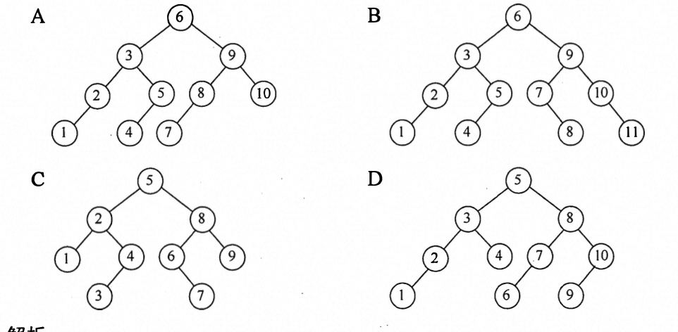
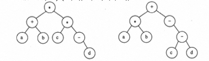
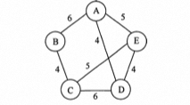

# 2017

## 1. 存储稀疏矩阵

- [稀疏矩阵](/dataStructure/chapter3#稀疏矩阵)

三元组和[十字链表](/dataStructure/chapter6#十字链表)

## 2. 图的顶点数

**已知无向图G含有16条边，其中度为4的顶点个数为3，度为3的项点个数为4，其他顶点的度均小于3。图G所含的顶点个数至少是**

无向图的度 = 边数*2

有向图的度 = 入度 + 出度

`32 = 4*3 + 3*4 + 2*k => k = 4`

顶点个数 = 3 + 4 + 4 = 11


## 3. 折半查找判定树(向下取整)

折半查找判定树实际上是一棵**二叉排序树**，**它的中序序列是一个有序序列**。可以在树结点上依次填上相应的元素，符合折半查找规则的树即是所求。

B 选项4、5相加除2向上取整，7、8相加除2向下取整，矛盾。C选项，3、4相加除2向上取整，6、7相加除2向下取整，矛盾。D选项，1、10相加除2向下取整，6、7相加除2向上取整，矛盾。A 符合折半查找规则，因此正确。

 

## 4. B+树的应用

- [b-树的基本概念](/dataStructure/chapter7#b-树的基本概念)
- [b树和b+树](/dataStructure/chapter7#b-树和-b-树)
- [b树和b+树的区别](/408/2009#_3-m阶b树和b-树的区别)

 B+树是应文件系统所需而产生的B-树的变形，前者比后者更加适用于实际应用中的操作系统的文件索引和数据库索引，因为前者磁盘读写代价更低，查询效率更加稳定。

编译器的词法分析使用有穷自动机和语法树。

网络中的路由表快速查找主要靠高速缓存、路由表压缩技术和快速查找算法。

系统一般使用空闲空间链表管理磁盘空闲块。


## 5. CPU运行时间

- [性能指标](/408/2011#_5-性能指标)
- [CPU执行时间](/408/2014#_6-cpu执行时间)

执行时间 = 指令条数 * CPI / 主频

## 6. 交叉编址

**某计算机主存按字节编址，由4个 64M×8位的DRAM 芯片采用交叉编址方式构成，并与宽度为32位的存储器总线相连，主存每次量多读写32位数据。若 double 型变量x 的主存地址为 804 001AH，则读取x需要的存储周期数是。**

由4个 DRAM 芯片采用交叉编址方式构成主存可知主存地址<span class='text-red-700'>最低二位</span>表示该字节存储的芯片编号。

double 型变量占 64位，8个字节。它的主存地址 804 001 AH 最低二位是10，说明它从编号为2的芯片开始存储（编号从0开始）。一个存储周期可以对所有芯片各读取一个字节，因此斋要3轮.

## 7. 时间和空间局部性

时间局部性是一旦一条指令被执行，则在不久的将来它可能再次被执行。循环指令本身具有时间局部性

空间局部性是一旦一个存储单元被访问，那么它附近的存储单元也很快被访问。它对数组a的访问具有空间局部性。

## 8. 指令字长

**某计算机按字节编址，指令字长固定且只有两种指令格式，其中三地址指令29系，二地址指令107条，每个地址字段为6位，则指令字长至少应该是**

三地址指令有29条，所以它的操作码至少为5位。

以5位进行计算，它剩余32-29=3种操作码给二地址。

而二地址另外多了 6位给操作码，因此它的数量最大达 3x64=192。所以指令字长最少为 23位，因为计算机按字节编址，需要是8的倍数，所以指令字长至应该是24位

## 9. 主存储器和控制存储器(CS)

- [微程序控制器](/组成原理/chapter5#微程序控制器)

A. MM在CPU外，CS 在 CPU内

B. MM 按地址访问，CS 按内容访问

C. MM 存储指令和数据，CS 存储微指令

D. MM用RAM和ROM实现，CS用ROM 实现


主存储器就是我们通常说的主存，在CPU外，存储指令和数据，由RAM 和 ROM实现。控制存储器用来存放实现指令系统的所有微指令，是一种只读型存储器，机器运行时只读写，
在CPU 的控制器内。

CS按照微指令的地址访问，所以B错误。<span class='text-red-600'>按内容访问使用散列表</span>

## 10. 指令流水线数据通路

- [数据通路](/组成原理/chapter5#数据通路的组成)

**区分组合逻辑和时序逻辑**

五阶段流水线可分为取指（IF）、译码/取数（ID）、执行（EXC）、存储器读（MEM）、写回（Write Back）。

数字系统中，各个子系统通过数据总线连接形成的数据传送路径称为数据通路，包括程序计数器、算术逻辑运算部件、通用寄存器组、取指部件等，不包括控制部件，故选A。

## 11. 系统调用的过程

- [系统调用](/os/chapter1#系统调用)

执行系统调用的过程是这样的：正在运行的进程先传通系统调用参数，然后由陷（trap）
指令负责将用户态转化为内核态，并将返回地址压入堆栈以备后用，接下来CPU 执行相的内核态服务程序，最后返回用户态。

## 12. 磁盘逻辑格式化过程

- [新磁盘安装操作系统的过程](/os/chapter5#新磁盘安装操作系统的过程)

一个新的磁盘是一个空白版，必须分成扇区以便磁盘控制器能读和写，这个过程称为**低级格式化（或物理格式化）**。

低级格式化为磁盘的每个扇区采用特别的数据结构，包括校验码。

为了使用磁盘存储文件，操作系统还需要将其数据结构记录在磁盘上。

这分为两步。第一步是将磁盘分为由一个或多个柱面组成的分区，每个分区可以作为一个独立的磁盘。

在分区之后，第二步是**逻辑格式化（创建文件系统）**。在这一步，操作系统将初始的文件系统数据结构存储到磁盘上。这些数据结构包括空闲和已分配的空间和一个初始为空的目录。

## 13. DMA传输过程

1️⃣ 在开始 DMA 传输时，主机向内存写入DMA 命令块，向DMA 控制器写入该命令块的地址，启动 I/O设备。

2️⃣ 然后，CPU继续其他工作，DMA 控制器则继续下去直接操作内存总线，将地址放到总线上开始传输。

3️⃣ 当整个传输完成后，DMA 控制器中断CPU。


## 14. 802.11局域网的MAC帧前三个地址的含义

来自AP 去往AP的区别

| 地址1（接收地址） | 地址2（发送地址 | 地址3 |
| ------------ | ------------ | -------------- |

来自AP

| 地址1（接收地址） | 地址2（发送地址 | 地址3 |
| ----------------- | --------------- | ----- |
| 目的地址 | AP地址 | 源地址 |

发往AP

| 地址1（接收地址） | 地址2（发送地址 | 地址3  |
| ----------------- | --------------- | ------ |
| AP地址          | 源地址          | 目的地址 |

## 15. 中缀表达式(中序遍历)

**41.（15分）请设计一个算法，将给定的表达式树（二叉树）转换为等价的中缀表达式（通过括号反映操作符的计算次序）并输出。例如，当下列两棵表达式树作为算法的输入时，输出的等价中缀表达式分别为`（a+b）*（c*（-d））`和`（a*b）+（-（c-d））`。**


二叉树结点定义如下:
```c
typedef struct node {
  struct node *left,*right;
  char data[10];
}BTree
```

**（1）给出算法的基本设计思想。**

表达式树的中序序列加上必要的括号即为等价的中缀表达式。可以基于二叉树的中序遍历策略得到所需的表达式。（3分）

表达式树中分支结点所对应的子表达式的计算次序，由该分支结点所处的位置决定。为得到正确的中缀表达式，需要在生成遍历序列的同时，在适当位置增加必要的括号。显然，表达式的最外层（对应根结点）及操作数（对应叶结点）不需要添加括号。（2分）

**（2）根据设计思想，采用C或C++语言描述算法，关键之处给出注释。**

```c
void BtreeToE(BTree *root){


}

void BtreeToExp(BTree *root,int deep){
  if(root == NULL) return ; // 空结点返回
  else if(root->left == NULL && roo->right == NULL) print('%s',root-data); // 叶子结点 输出操作数 不加括号
  else{
    if(deep>1) print("("); // 若有子表达式则加一层括号
    BtreeToExp(root->left,deep + 1);
    print('%s',root->data);  // 输出操作符
     BtreeToExp(root->right,deep + 1);
     print(")");  // 若有子表达式则加一层括号
  }
}

```

## 16. 最小生成树MST(Prim)

**42.（8分）使用 Prim（普里姆）算法求带权连通图的最小（代价）生成树（MST）。请回答下列问题。**

**（1）对下列图G，从项点A 开始求G的MST，依次给出按算法选出的边。**

A->D、D->E、E->C、C->B

**（2） 图G的MST是唯一的吗？**

图G的MST是唯一的。第一小题的最小生成树包括了图中权值最小 的四条边，其他边都比这四条边大，所以此图的MST唯一。

**（3）对任意的带权连通图，满足什么条件时，其 MST 是唯一的？**

权值均不相同，MST唯一

## 17. 数的运算(IEEE754‼️)

f(n) = 求和公式2^i = 2^n+1 - 1 = 111...111B，计算f(n)的C语言函数f1如下：
```c
int f1(unsigned n){
  int sum =1,power = 1;
  for(unsigned i=0 ;i<n-1;i++){
    power *= 2
    sum += power;
  }
  return power;
}
```

**将f1中的 int 都改为 float，可得到计算f（n）的另一个函数f2。假设 unsigned 和 int 型数据都占32位，float 采用 IEEE 754单精度标准。请回答下列问题。**

**（1）当n=0时，f1 会出现死循环，为什么？若将f中的变量i和n都定义为int 型，则f是否还会出现死循环？为什么？**

当n=0时，n-1 表示无符号数为 = 32位全1，所以`i<n-1`永为真，所以陷入死循环。

不会出现死循环，因为i和n都为带符号数比较，n-1 = -1，i=0, `i<n-1`不成立。

**（2） f1（23）和 f2（23）的返回值是否相等？机器数各是什么（用十六进制表示）？**

f1(23) = 2^24 -1 => 24个1

int占32位，没有溢出；

float有一位符号位，23位尾数，8位阶码，23位尾数可表示24位底数。可完整表示。

故返回值相等

f1(23) =00FF FFFFH、f2(23) = 4B7F FFFFH

**（3） f1（24）和 f2（24）的返回值分别为 33 554 431 和33 554 432.0，为什么不相等？**

当n=24时，f（24）=11111 1111 1111 1111 1111 1111 B，而 float 型数只有24位有效位，舍入后数值增大，所以 f2（24）比f1（24）大1。

**（4） f（31）= 2^32-1，而f1（31）的返回值却为-1，为什么？若使 f1（m）的返回值与f（m）相等，则最大的n是多少？**

显然f1（31）已超出了 int 型数据的表示范围，用f1（31）实现时得到的机器数为32个1，作为 int 型数解释时其值为 1，即f1（31）的返回值为1。

**（5）f2（127）的机器数为 7F80 0000H，对应的值是什么？若使f2（n）的结果不溢出，则最大的n是多少？若使f2（n）的结果精确（无舍入），则最大的n是多少？**

IEEE754 标准用 “ 阶码全 1 尾数全O" 表示无穷大。

f2返回值为 float 型，机器数 7F80 OOOOH = 0111 1111 1000 0000... 对应的值是+∞


当 =126时，f（126）=2127-1=1.1- 1×2^126，对应阶码为127+126=253，尾数部分舍入后阶码加1，最终阶码为 254，是IEEE 754 单精度格式表示的最大阶码。故使f2结果不溢出的最大n值为126。（1分）


当n=23时，f（23）为24位1，float 型数有24位有效位，所以不需舍入，结果精确。故使获得精确结果的最大n值为23。（1分）

## 18. 指令机器表示

**44.(10分) 在按字十编址的计算机M上,题43中f1的部分源程序(阴影部分)与对应的机器级代码(包括指令的虚拟地址) 如下图所示。**

```bash
    int f1(unsigned n)
1   00401020    55     push ebp 

    for(unsigned i=0;i<n-1:i++)
20  0040105E.   39 4D F4 cmp dword ptr [ebp - 0Ch],ecx

        power *=2;
23  00401066    D1 E2    sh1. edx,1

        return sum;
35  0040107F    C3       ret
```
**其中,机器级代码行包括行号、虚拟地址、机器指令和汇编指令。请回答下列问题。**

**(1)计算机M是RISC还是CISC?为什么?**

M为CISC，因为指令长短不一致，不符合RISC指令系统

**(2)f1的机器指令代码共占多少字节?要求给出计算过程。**

0040107F - 00401020 + 1= 60H = 96字节

**(3)第20条指令cmp通过i减n-1实现对i和n-1的比较。执行f1(0)过程中,当i=0时,cmp指令执行后,进/借位标志CF的内容是什么?要求给出计算过程。**

cmp指令实现i与n-1的比较功能，进行的是减法运算。在执行f1(0)过程中，n=0，当i=0时，i= 0000 0000H，并且 n-1 = FFFF FFFFH.因此，当执行第20条指令时，在补码加/碱运算器中执行 “0 减 FFFF FFFFH” 的操作，即 000 0000H +0000 0000H +1=0000 0001H，此时，进位输出C=0，減法运算时的借位标志CF=C异或1=1。（2分）

**(4) 第23条指令shl通过左移操作实现了power*2运算, 在f2中能否也用shl指令实现，为什么**

f2不能使用shl指令。

因为 shl 指令用来将一个整数的所有有效数位作为一个整体左移：而t2 中的变量power 是float 型，其机器数中不包含最高有效数位，但包含了阶码部分，将其作为一个整体左移时并不能实现“乘2”的功能，因而 t2 中不能用shl 指令实现 power*2。（2分）浮点数运算比整型运算要复杂，耗时也较长。


## 19. 二级分页虚拟存储

**假定题44给出的计算机M采用二级分页虚拟存储管理方式， 虚拟地址格 式如下:**
| 页目录号(10位) | 页表索引(10位) | 页内偏移量(12位) |
| ----------------- | --------------- | ----- |

**请针对题43的函数f1 和题44中的机器指令代码，回答下列问题。**

**（1）函数f1 的机器指令代码占多少页？**

函数 f1 的代码段中所 有指令的虚拟地址的高 20 位相同，因此 f1 的机器指令代码在同一页中，仅占用1页。(I分)页目录号用于寻找页目录的表项，该表项包含页表的位置。 页表 索引用于寻找页表的表项，该表项包含页的位置。

**（2） 取第1条指令（push ebp）时，若在进行地址变换的过程中需要访问内存中的页目录和页表，则会分别访问它们各自的第几个表项（编号从0开始）？**

 00401020  = 0000 0000 0100 0000 0001 0000 0010 0000

 页目录号0000 0000 01

 页表 00 0000 0001

push ebp 指令的虚拟地址 的最高 10 位(页目录号)为 00 0000 0001 , 中间 10 位(页 表索引)为0000000001, 所以，取该指令时访问了页目录的第1个表项，(1分)在对应的页 表中访问了第1个表项。


**（3） M的1O采用中断控制方式。若进程P在调用f1之前通过scanf0获取n 的值，则在执行 scanf0的过程中，进程P的状态会如何变化？CPU 是否会进入内核态？**

在执行 scanf()的过程中，进程 P 因等待输入而从执行态变为阻塞态。(1分)输入结束 时，P 被中断处理程序唤醒，变为就绪态。(I分)P 被调度程序调度 ，变为运行态。(1 分)CPU 状态会从用户态变为内核态。

## 20. GBN协议（细心）

**甲乙双方均采用后退N帧协议（GBN）进行持续的双向数据传输，且双方始终采用捎带确认，帧长均为1000B。Sxy和 Rxy分别表示甲方和乙方发送的数据帧，其中x是发送序号，y是确认序号（表示希望接收对方的下一帧序号）；数据帧的发送序号和确认序号字段均为3比特。信道传输速率为100Mbps,RTT = 0.96ms。下图给出了甲方发送数据帧和接收数据帧的两种场景，其中t为初始时刻，此时甲方的发送和确认序号均为0，1时刻甲方有足够多的数据待发送。**


**请回答下列问题。**

**（1 ）对于图（a），t0时刻到t1时刻期间，甲方可以断定乙方已正确接收的数据帧数是多少？正确接收的是哪几个帧？（请用Sw，形式给出。）**

GBN协议窗口大小：发送窗口 = 1 ~ 2^n -1 ，接受窗口 = 1

GBN协议使用累计确定，对某个数据帧的确认表示它之前所有的帧都以正确接受，

GBN超时重传会重新发送超时帧并且丢弃超时帧之后已发送的帧

选择重传协议：发送窗口 + 接受窗口 <= 2^n 正常情况下 发送窗口 = 接受窗口 = 2^(n-1)

选择重传会对每个发送的帧逐个确认，故重传的时候只重传指定的帧。

在GBN协议中 = 序号个数>发送窗口+1

t1时刻收到R33，表示期望收到序号3，0、1、2已收到，甲方可以断定乙方已正确接收的数据帧数是3

S00、S10、S20

**（2）对于图（a），从t1时刻起，甲方在不出现超时且未收到乙方新的数据帧之前，最多还可以发送多少个数据帧？其中第一个帧和最后一个帧分别是哪个？（请用Sww形式給出。）**

`[0,1,2,3,4,5,6,7,0,1,2,3,4]`

已确认0、1、2，已发送未确认3、4，窗口值为`[3,4,5,6,7,0,1]`

最多还能发送5个帧,第一个帧S52，最后一个S12 确认帧为2是因为未收到2号帧

**（3）对于图（b），从t1时刻起，甲方在不出现新的超时且未收到乙方新的数据帧之前，需要重发多少个数据帧？重发的第一个帧是哪个？（请用Sxy形式给出。）**

S20超时，已确认0、1，重发数据帧S23

**（4）甲方可以达到的最大信道利用率是多少？**

发送一个帧的时间 = 8 * 1000 / 100Mbps  = 确认帧的发送时间 = 

信道利用率 = 连续发送7个帧的时间 / 一个发送帧的时间 + RTT + 确认帧时间 = 50%