# Dify - 开源 LLM 应用开发平台

> [!NOTE]
> **Dify** 是一个开源的 LLM（大语言模型）应用开发平台，旨在简化 AI 应用的构建、部署和管理过程。它提供了可视化的工作流编排、丰富的工具集成和企业级的安全保障。

## 📖 什么是 Dify

**Dify** 是一个面向开发者和企业的 LLM 应用开发平台，它将复杂的 AI 应用开发过程简化为可视化的操作界面。通过 Dify，用户可以快速构建各种 AI 应用，如聊天机器人、知识库问答、工作流自动化等，而无需深入了解底层的机器学习技术。

### 核心理念

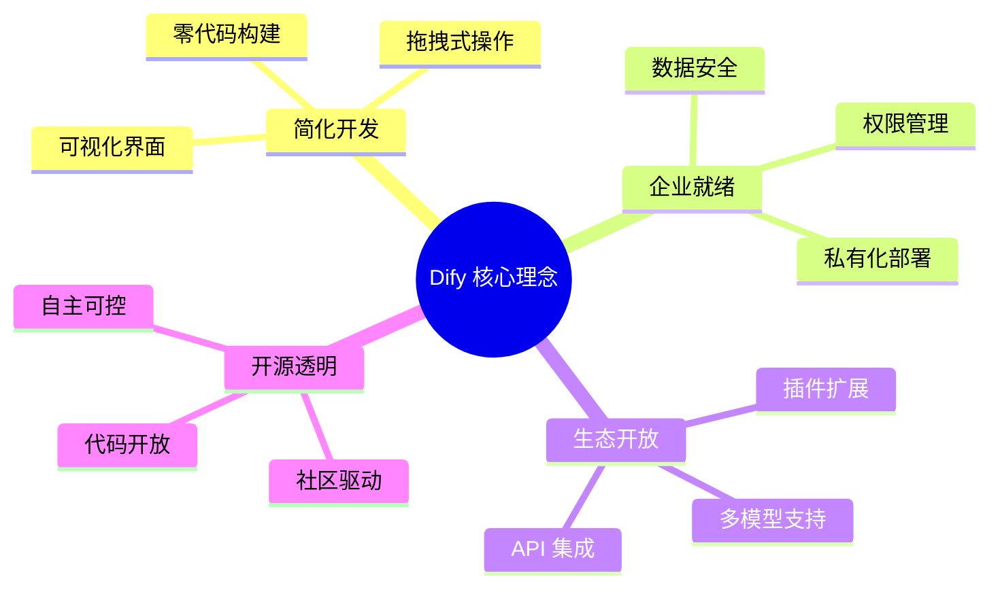
```mermaid
mindmap
  root((Dify 核心理念))
    简化开发
      可视化界面
      拖拽式操作
      零代码构建
    企业就绪
      数据安全
      权限管理
      私有化部署
    生态开放
      多模型支持
      插件扩展
      API 集成
    开源透明
      社区驱动
      代码开放
      自主可控
```

## 🎯 Dify 的核心价值

### 1. **降低 AI 应用开发门槛**
- **可视化工作流**：通过拖拽式界面构建复杂的 AI 应用逻辑
- **零代码开发**：非技术人员也能快速创建 AI 应用
- **模板丰富**：提供多种预设模板，开箱即用

### 2. **企业级安全与管控**
- **数据隐私保护**：支持私有化部署，数据不出企业
- **权限精细化管理**：多层级权限控制，确保数据安全
- **审计日志**：完整的操作记录，满足合规要求

### 3. **生态系统完整**
- **多模型支持**：兼容 OpenAI、Claude、本地模型等
- **工具集成丰富**：内置多种实用工具和第三方服务集成
- **API 友好**：提供完整的 API 接口，支持二次开发

## 🛠️ 核心工具与功能

### 系统架构概览

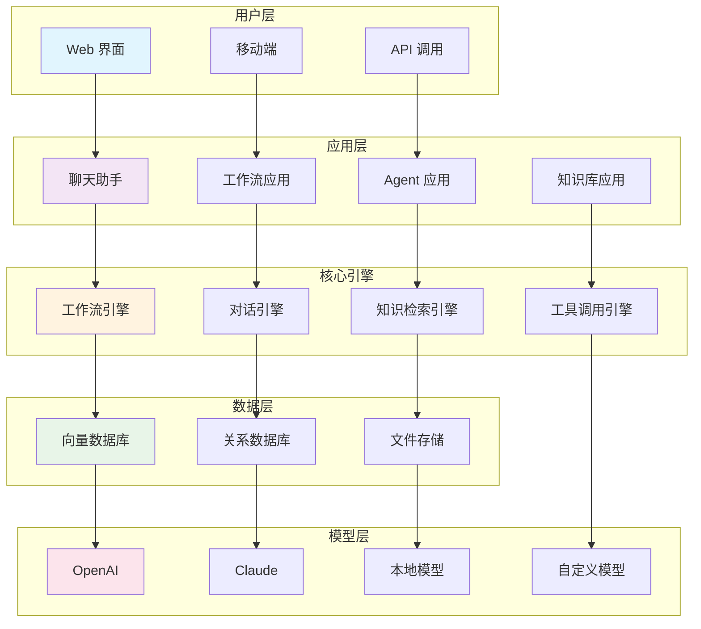
```mermaid
graph TB
    subgraph "用户层"
        A[Web 界面] 
        B[移动端]
        C[API 调用]
    end
    
    subgraph "应用层"
        D[聊天助手]
        E[工作流应用]
        F[Agent 应用]
        G[知识库应用]
    end
    
    subgraph "核心引擎"
        H[工作流引擎]
        I[对话引擎]
        J[知识检索引擎]
        K[工具调用引擎]
    end
    
    subgraph "数据层"
        L[向量数据库]
        M[关系数据库]
        N[文件存储]
    end
    
    subgraph "模型层"
        O[OpenAI]
        P[Claude]
        Q[本地模型]
        R[自定义模型]
    end
    
    A --> D
    B --> E
    C --> F
    D --> H
    E --> I
    F --> J
    G --> K
    
    H --> L
    I --> M
    J --> N
    
    L --> O
    M --> P
    N --> Q
    K --> R
    
    style A fill:#e1f5fe
    style D fill:#f3e5f5
    style H fill:#fff3e0
    style L fill:#e8f5e8
    style O fill:#fce4ec
```

### 1. **应用构建工具**

#### 聊天助手 (Chatbot)
- **功能**：创建智能对话机器人
- **特性**：支持上下文记忆、多轮对话、个性化回复
- **应用场景**：客服机器人、个人助理、教育辅导

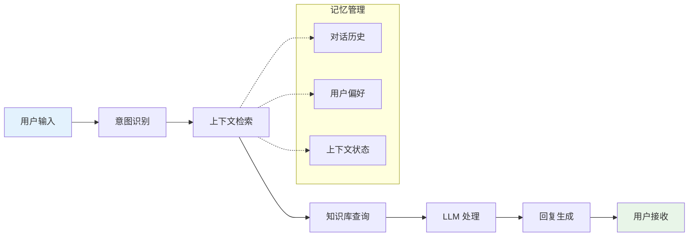
```mermaid
flowchart LR
    A[用户输入] --> B[意图识别]
    B --> C[上下文检索]
    C --> D[知识库查询]
    D --> E[LLM 处理]
    E --> F[回复生成]
    F --> G[用户接收]
    
    subgraph "记忆管理"
        H[对话历史]
        I[用户偏好]
        J[上下文状态]
    end
    
    C -.-> H
    C -.-> I
    C -.-> J
    
    style A fill:#e3f2fd
    style G fill:#e8f5e8
```

#### 工作流应用 (Workflow)
- **功能**：构建复杂的业务流程自动化
- **特性**：条件分支、循环处理、并行执行
- **应用场景**：内容生成、数据处理、业务审批

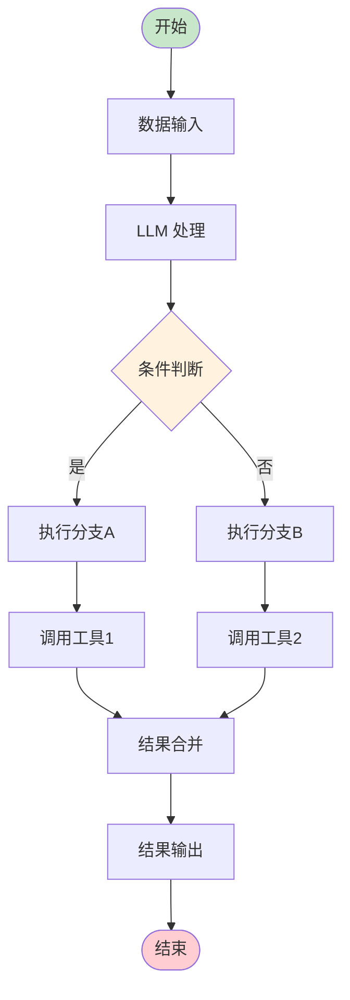
```mermaid
flowchart TD
    Start([开始]) --> Input[数据输入]
    Input --> Process1[LLM 处理]
    Process1 --> Decision{条件判断}
    Decision -->|是| Process2[执行分支A]
    Decision -->|否| Process3[执行分支B]
    Process2 --> Tool1[调用工具1]
    Process3 --> Tool2[调用工具2]
    Tool1 --> Merge[结果合并]
    Tool2 --> Merge
    Merge --> Output[结果输出]
    Output --> End([结束])
    
    style Start fill:#c8e6c9
    style End fill:#ffcdd2
    style Decision fill:#fff3e0
```

#### Agent 应用
- **功能**：创建具有推理和行动能力的智能代理
- **特性**：自主决策、工具调用、复杂任务执行
- **应用场景**：智能助理、自动化运维、数据分析

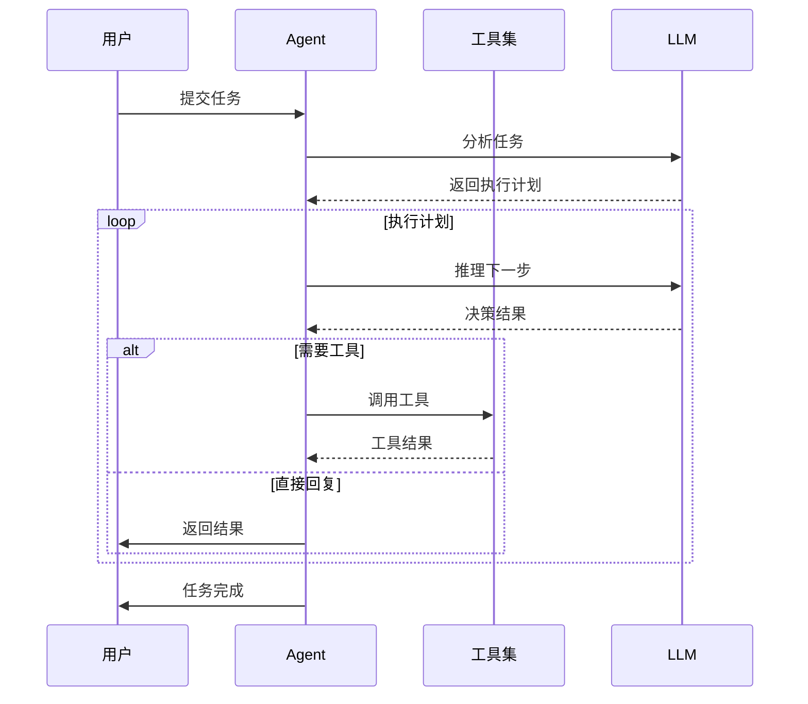
```mermaid
sequenceDiagram
    participant U as 用户
    participant A as Agent
    participant T as 工具集
    participant L as LLM
    
    U->>A: 提交任务
    A->>L: 分析任务
    L-->>A: 返回执行计划
    
    loop 执行计划
        A->>L: 推理下一步
        L-->>A: 决策结果
        alt 需要工具
            A->>T: 调用工具
            T-->>A: 工具结果
        else 直接回复
            A->>U: 返回结果
        end
    end
    
    A->>U: 任务完成
```

### 2. **知识管理工具**

#### 知识库 (Knowledge Base)
- **文档支持**：PDF、Word、Markdown、网页等多种格式
- **向量化处理**：自动将文档转换为向量存储
- **智能检索**：基于语义相似度的精准检索

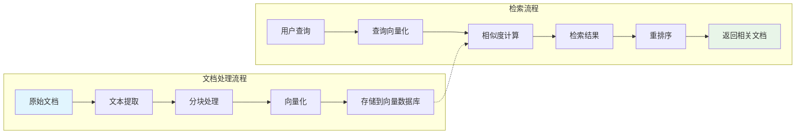
```mermaid
graph LR
    subgraph "文档处理流程"
        A[原始文档] --> B[文本提取]
        B --> C[分块处理]
        C --> D[向量化]
        D --> E[存储到向量数据库]
    end
    
    subgraph "检索流程"
        F[用户查询] --> G[查询向量化]
        G --> H[相似度计算]
        H --> I[检索结果]
        I --> J[重排序]
        J --> K[返回相关文档]
    end
    
    E -.-> H
    
    style A fill:#e1f5fe
    style K fill:#e8f5e8
```

#### RAG (检索增强生成)
- **原理**：结合知识检索和生成模型
- **优势**：减少幻觉、提供准确信息、支持实时更新
- **流程**：检索 → 筛选 → 增强 → 生成

### 3. **工具集成平台**

#### 内置工具
- **HTTP 请求**：调用外部 API 服务
- **数据库查询**：支持 SQL 查询操作
- **文件处理**：文档读取、图片处理
- **邮件发送**：自动化邮件通知
- **时间工具**：日期时间处理

#### 自定义工具
- **工具定义**：通过 OpenAPI 规范定义工具
- **参数配置**：灵活的参数传递机制
- **错误处理**：完善的异常处理机制

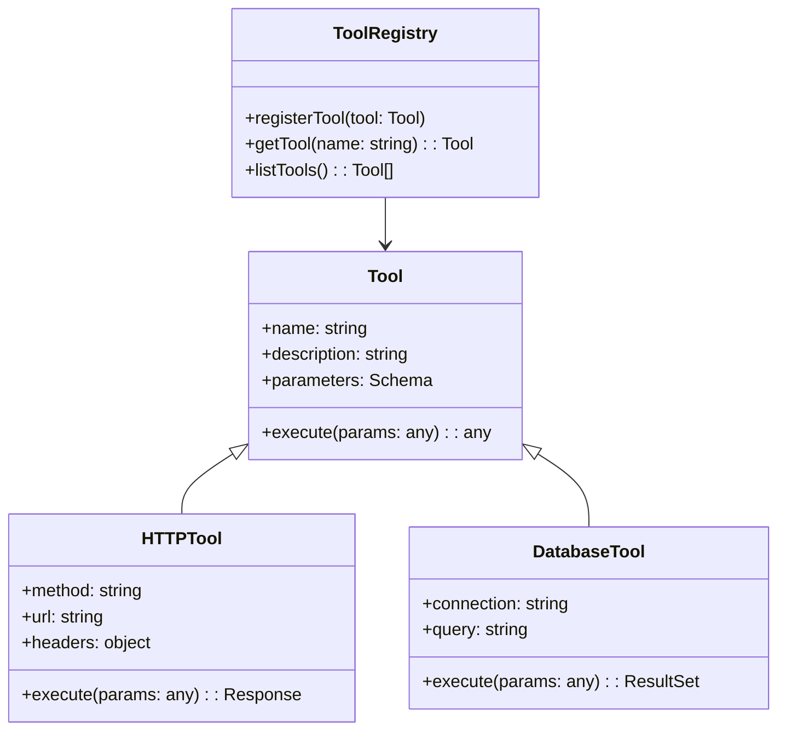
```mermaid
classDiagram
    class ToolRegistry {
        +registerTool(tool: Tool)
        +getTool(name: string): Tool
        +listTools(): Tool[]
    }
    
    class Tool {
        +name: string
        +description: string
        +parameters: Schema
        +execute(params: any): any
    }
    
    class HTTPTool {
        +method: string
        +url: string
        +headers: object
        +execute(params: any): Response
    }
    
    class DatabaseTool {
        +connection: string
        +query: string
        +execute(params: any): ResultSet
    }
    
    ToolRegistry --> Tool
    Tool <|-- HTTPTool
    Tool <|-- DatabaseTool
```

## 🏗️ 技术架构深度解析

### 整体架构图

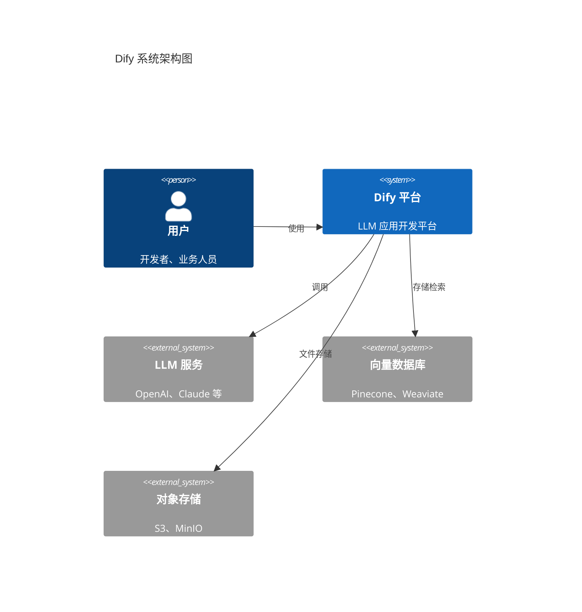
```mermaid
C4Context
    title Dify 系统架构图
    
    Person(user, "用户", "开发者、业务人员")
    System(dify, "Dify 平台", "LLM 应用开发平台")
    
    System_Ext(llm, "LLM 服务", "OpenAI、Claude 等")
    System_Ext(vector, "向量数据库", "Pinecone、Weaviate")
    System_Ext(storage, "对象存储", "S3、MinIO")
    
    Rel(user, dify, "使用")
    Rel(dify, llm, "调用")
    Rel(dify, vector, "存储检索")
    Rel(dify, storage, "文件存储")
```

### 核心组件详解

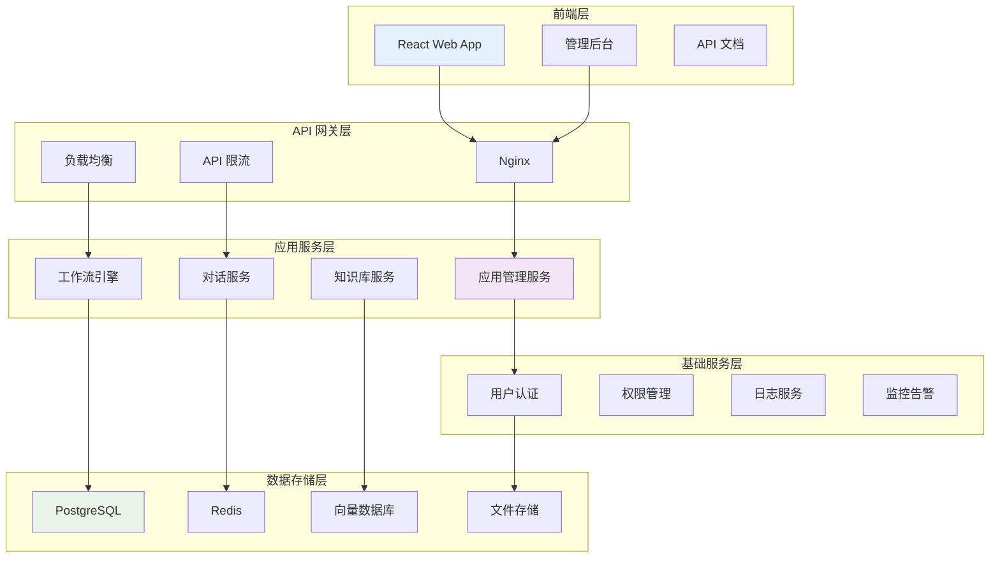
```mermaid
graph TB
    subgraph "前端层"
        A[React Web App]
        B[管理后台]
        C[API 文档]
    end
    
    subgraph "API 网关层"
        D[Nginx]
        E[负载均衡]
        F[API 限流]
    end
    
    subgraph "应用服务层"
        G[应用管理服务]
        H[工作流引擎]
        I[对话服务]
        J[知识库服务]
    end
    
    subgraph "基础服务层"
        K[用户认证]
        L[权限管理]
        M[日志服务]
        N[监控告警]
    end
    
    subgraph "数据存储层"
        O[PostgreSQL]
        P[Redis]
        Q[向量数据库]
        R[文件存储]
    end
    
    A --> D
    B --> D
    D --> G
    E --> H
    F --> I
    G --> K
    H --> O
    I --> P
    J --> Q
    K --> R
    
    style A fill:#e3f2fd
    style G fill:#f3e5f5
    style O fill:#e8f5e8
```

## 🎨 应用场景与用例

### 企业应用场景

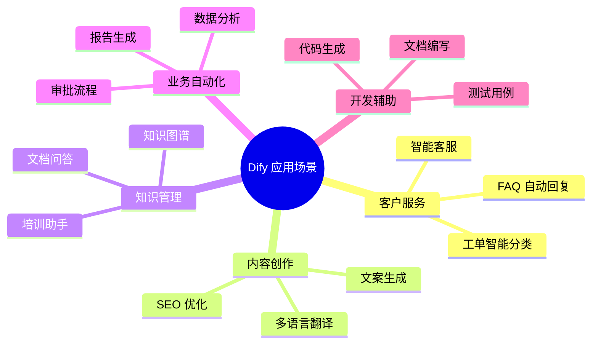
```mermaid
mindmap
  root((Dify 应用场景))
    客户服务
      智能客服
      FAQ 自动回复
      工单智能分类
    内容创作
      文案生成
      SEO 优化
      多语言翻译
    知识管理
      文档问答
      知识图谱
      培训助手
    业务自动化
      数据分析
      报告生成
      审批流程
    开发辅助
      代码生成
      文档编写
      测试用例
```

### 实际应用案例

#### 案例 1：智能客服系统
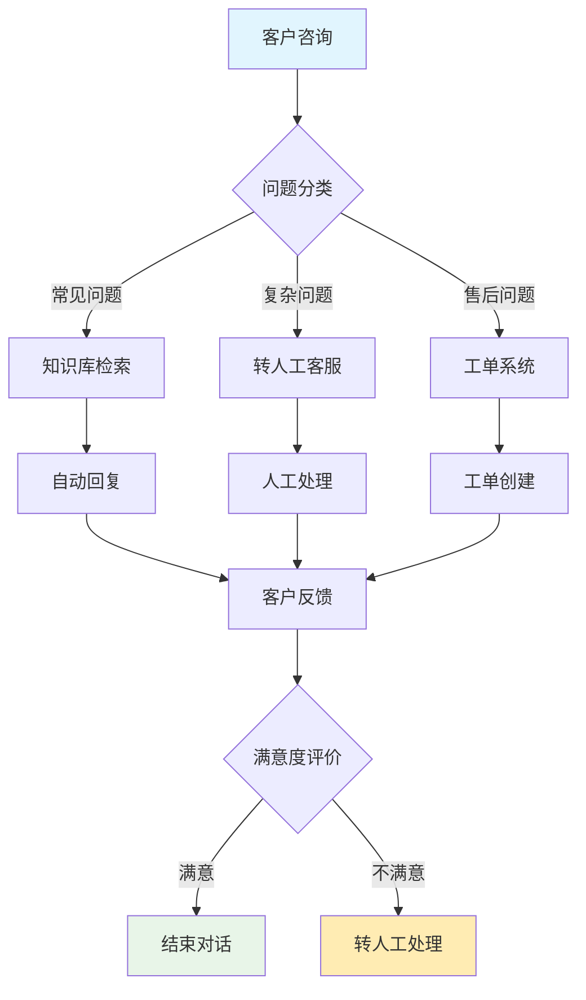
```mermaid
flowchart TD
    A[客户咨询] --> B{问题分类}
    B -->|常见问题| C[知识库检索]
    B -->|复杂问题| D[转人工客服]
    B -->|售后问题| E[工单系统]
    
    C --> F[自动回复]
    D --> G[人工处理]
    E --> H[工单创建]
    
    F --> I[客户反馈]
    G --> I
    H --> I
    
    I --> J{满意度评价}
    J -->|满意| K[结束对话]
    J -->|不满意| L[转人工处理]
    
    style A fill:#e1f5fe
    style K fill:#e8f5e8
    style L fill:#ffecb3
```

#### 案例 2：内容创作工作流
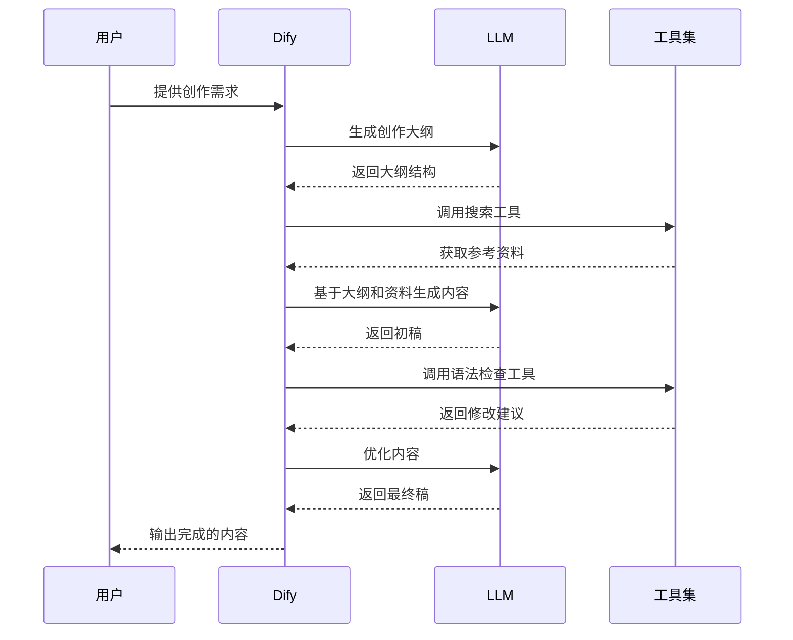
```mermaid
sequenceDiagram
    participant U as 用户
    participant D as Dify
    participant L as LLM
    participant T as 工具集
    
    U->>D: 提供创作需求
    D->>L: 生成创作大纲
    L-->>D: 返回大纲结构
    D->>T: 调用搜索工具
    T-->>D: 获取参考资料
    D->>L: 基于大纲和资料生成内容
    L-->>D: 返回初稿
    D->>T: 调用语法检查工具
    T-->>D: 返回修改建议
    D->>L: 优化内容
    L-->>D: 返回最终稿
    D-->>U: 输出完成的内容
```

## 💡 核心优势对比

### Dify vs 传统开发方式

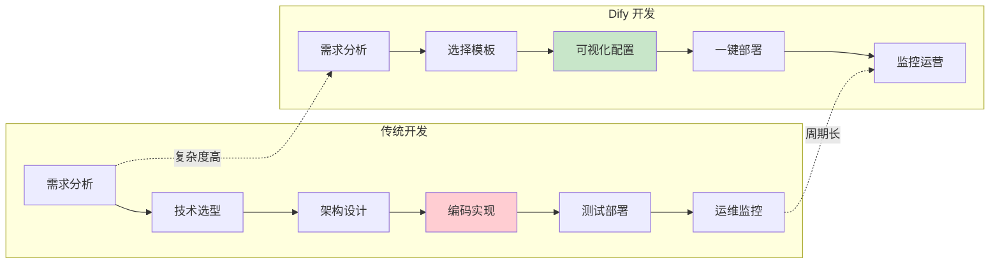
```mermaid
graph LR
    subgraph "传统开发"
        A1[需求分析] --> A2[技术选型]
        A2 --> A3[架构设计]
        A3 --> A4[编码实现]
        A4 --> A5[测试部署]
        A5 --> A6[运维监控]
    end
    
    subgraph "Dify 开发"
        B1[需求分析] --> B2[选择模板]
        B2 --> B3[可视化配置]
        B3 --> B4[一键部署]
        B4 --> B5[监控运营]
    end
    
    A1 -.->|复杂度高| B1
    A6 -.->|周期长| B5
    
    style A4 fill:#ffcdd2
    style B3 fill:#c8e6c9
```

### 功能对比表

| 特性 | 传统开发 | Dify 平台 | 优势 |
|------|----------|-----------|------|
| **开发门槛** | 高（需要编程技能） | 低（可视化操作） | 📈 降低 80% 开发门槛 |
| **开发周期** | 数周到数月 | 数小时到数天 | ⚡ 提升 90% 开发效率 |
| **维护成本** | 高（需要专业团队） | 低（可视化维护） | 💰 减少 70% 维护成本 |
| **模型切换** | 复杂（代码重构） | 简单（配置切换） | 🔄 一键切换模型 |
| **扩展性** | 依赖开发能力 | 插件化扩展 | 🧩 模块化扩展 |

## 🚀 快速开始指南

### 安装部署

#### Docker 部署（推荐）

```bash
# 1. 克隆项目
git clone https://github.com/langgenius/dify.git
cd dify/docker

# 2. 启动服务
docker-compose up -d

# 3. 访问服务
# Web 界面: http://localhost
# API 文档: http://localhost/api-docs
```

#### 源码部署

```bash
# 1. 后端服务
cd api
pip install -r requirements.txt
python app.py

# 2. 前端服务
cd web
npm install
npm run dev

# 3. Worker 服务
cd api
celery -A app.celery worker -P gevent -c 1 --loglevel INFO
```

### 部署架构图

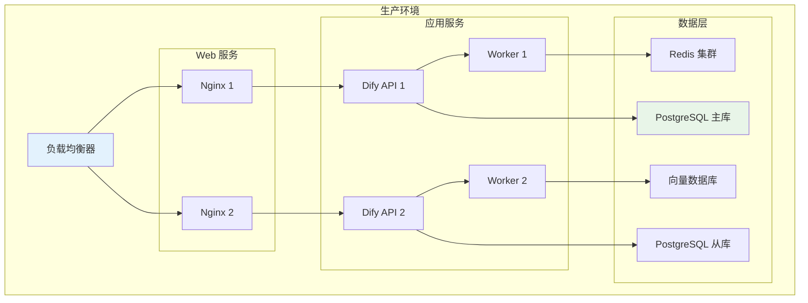
```mermaid
graph TB
    subgraph "生产环境"
        A[负载均衡器]
        
        subgraph "Web 服务"
            B[Nginx 1]
            C[Nginx 2]
        end
        
        subgraph "应用服务"
            D[Dify API 1]
            E[Dify API 2]
            F[Worker 1]
            G[Worker 2]
        end
        
        subgraph "数据层"
            H[PostgreSQL 主库]
            I[PostgreSQL 从库]
            J[Redis 集群]
            K[向量数据库]
        end
    end
    
    A --> B
    A --> C
    B --> D
    C --> E
    D --> F
    E --> G
    
    D --> H
    E --> I
    F --> J
    G --> K
    
    style A fill:#e3f2fd
    style H fill:#e8f5e8
```

### 创建第一个应用

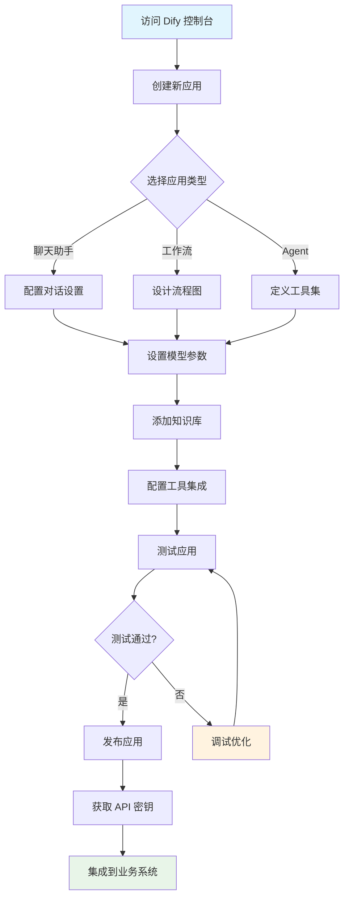
```mermaid
flowchart TD
    A[访问 Dify 控制台] --> B[创建新应用]
    B --> C{选择应用类型}
    
    C -->|聊天助手| D[配置对话设置]
    C -->|工作流| E[设计流程图]
    C -->|Agent| F[定义工具集]
    
    D --> G[设置模型参数]
    E --> G
    F --> G
    
    G --> H[添加知识库]
    H --> I[配置工具集成]
    I --> J[测试应用]
    J --> K{测试通过?}
    
    K -->|是| L[发布应用]
    K -->|否| M[调试优化]
    M --> J
    
    L --> N[获取 API 密钥]
    N --> O[集成到业务系统]
    
    style A fill:#e1f5fe
    style O fill:#e8f5e8
    style M fill:#fff3e0
```

## 🔧 高级配置与优化

### 模型配置策略

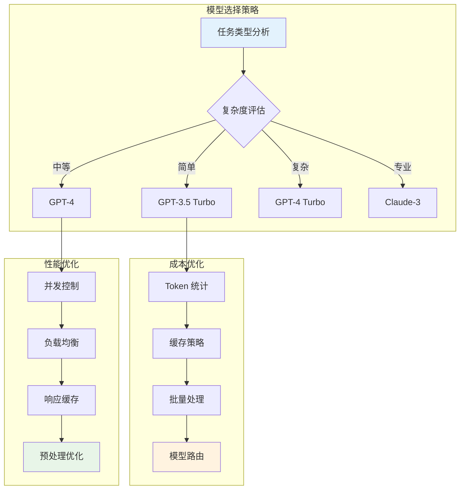
```mermaid
graph TB
    subgraph "模型选择策略"
        A[任务类型分析] --> B{复杂度评估}
        B -->|简单| C[GPT-3.5 Turbo]
        B -->|中等| D[GPT-4]
        B -->|复杂| E[GPT-4 Turbo]
        B -->|专业| F[Claude-3]
    end
    
    subgraph "成本优化"
        G[Token 统计] --> H[缓存策略]
        H --> I[批量处理]
        I --> J[模型路由]
    end
    
    subgraph "性能优化"
        K[并发控制] --> L[负载均衡]
        L --> M[响应缓存]
        M --> N[预处理优化]
    end
    
    C --> G
    D --> K
    
    style A fill:#e3f2fd
    style J fill:#fff3e0
    style N fill:#e8f5e8
```

### 安全配置

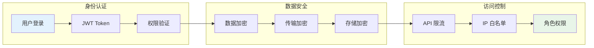
```mermaid
graph LR
    subgraph "身份认证"
        A[用户登录] --> B[JWT Token]
        B --> C[权限验证]
    end
    
    subgraph "数据安全"
        D[数据加密] --> E[传输加密]
        E --> F[存储加密]
    end
    
    subgraph "访问控制"
        G[API 限流] --> H[IP 白名单]
        H --> I[角色权限]
    end
    
    C --> D
    F --> G
    
    style A fill:#e3f2fd
    style I fill:#e8f5e8
```

## 📊 监控与运维

### 系统监控体系

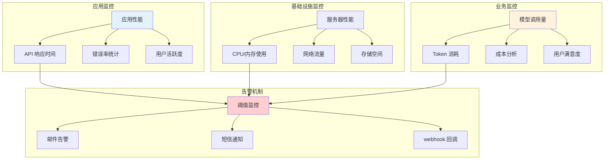
```mermaid
graph TB
    subgraph "应用监控"
        A[应用性能] --> B[API 响应时间]
        A --> C[错误率统计]
        A --> D[用户活跃度]
    end
    
    subgraph "基础设施监控"
        E[服务器性能] --> F[CPU/内存使用]
        E --> G[网络流量]
        E --> H[存储空间]
    end
    
    subgraph "业务监控"
        I[模型调用量] --> J[Token 消耗]
        I --> K[成本分析]
        I --> L[用户满意度]
    end
    
    subgraph "告警机制"
        M[阈值监控] --> N[邮件告警]
        M --> O[短信通知]
        M --> P[webhook 回调]
    end
    
    B --> M
    F --> M
    J --> M
    
    style A fill:#e3f2fd
    style I fill:#fff3e0
    style M fill:#ffcdd2
```

## 🌟 最佳实践

### 应用设计原则

1. **单一职责**：每个应用专注于解决特定问题
2. **模块化设计**：通过工作流组合实现复杂功能
3. **数据驱动**：基于实际数据优化提示词和参数
4. **用户体验**：注重交互设计和响应速度
5. **安全优先**：确保数据安全和隐私保护

### 性能优化建议

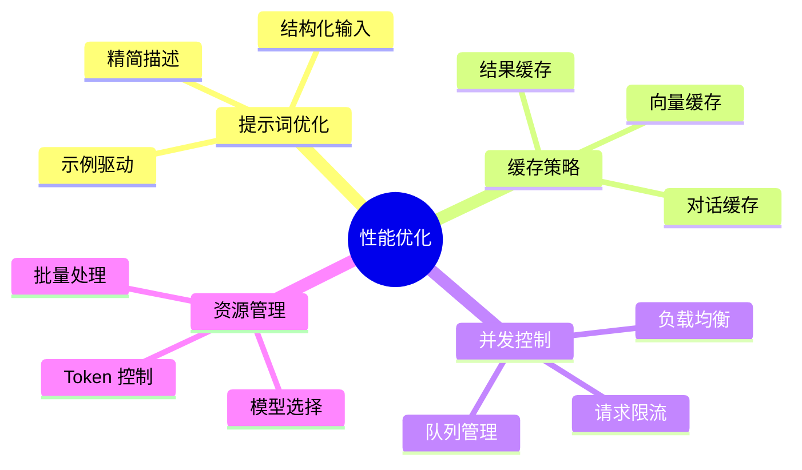
```mermaid
mindmap
  root((性能优化))
    提示词优化
      精简描述
      结构化输入
      示例驱动
    缓存策略
      结果缓存
      向量缓存
      对话缓存
    并发控制
      请求限流
      队列管理
      负载均衡
    资源管理
      模型选择
      Token 控制
      批量处理
```

## 🔮 未来发展方向

### 技术路线图

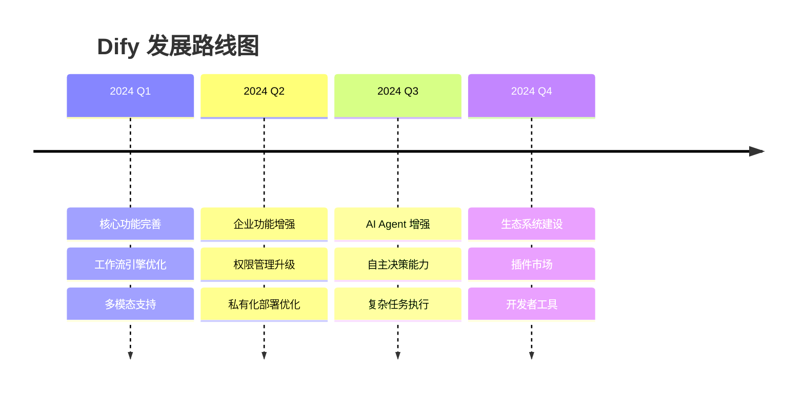
```mermaid
timeline
    title Dify 发展路线图
    
    2024 Q1 : 核心功能完善
           : 工作流引擎优化
           : 多模态支持
           
    2024 Q2 : 企业功能增强
           : 权限管理升级
           : 私有化部署优化
           
    2024 Q3 : AI Agent 增强
           : 自主决策能力
           : 复杂任务执行
           
    2024 Q4 : 生态系统建设
           : 插件市场
           : 开发者工具
```

### 技术趋势

- **多模态 AI**：支持文本、图像、音频、视频的综合处理
- **边缘计算**：支持本地模型部署和边缘推理
- **联邦学习**：在保护隐私的前提下实现模型协同训练
- **自动化 MLOps**：智能的模型管理和优化
- **低代码进化**：向无代码方向发展，进一步降低使用门槛

## 📚 学习资源

### 官方资源
- **官方网站**：[dify.ai](https://dify.ai)
- **GitHub 仓库**：[langgenius/dify](https://github.com/langgenius/dify)
- **API 文档**：[docs.dify.ai](https://docs.dify.ai)
- **社区论坛**：[community.dify.ai](https://community.dify.ai)

### 学习路径
1. **入门阶段**：了解基本概念，完成快速开始教程
2. **实践阶段**：创建简单应用，熟悉各种工具
3. **进阶阶段**：设计复杂工作流，集成外部系统
4. **专家阶段**：优化性能，参与社区贡献

---

**Dify** 作为开源的 LLM 应用开发平台，正在改变 AI 应用的开发方式。通过其强大的可视化工具和丰富的功能集成，开发者可以快速构建高质量的 AI 应用，企业可以安全地部署和管理 AI 服务。随着 AI 技术的不断发展，Dify 将继续演进，为用户提供更加便捷和强大的 AI 应用开发体验。

