# 卷积神经网络基础

> 深度学习理论基础

## 📚 目录

- [卷积神经网络的发展](#卷积神经网络的发展)
- [卷积](#卷积)
- [感受野机制](#感受野机制)
- [图像编码与卷积操作](#图像编码与卷积操作)
- [池化操作（Pooling）](#池化操作pooling)
- [完整卷积神经网络](#完整卷积神经网络)
- [卷积神经网络优化与训练](#卷积神经网络优化与训练)
- [案例：CNNCTC 图像文本识别](#案例cnnctc-图像文本识别)

---

## 卷积神经网络的发展

### 发展历程时间线

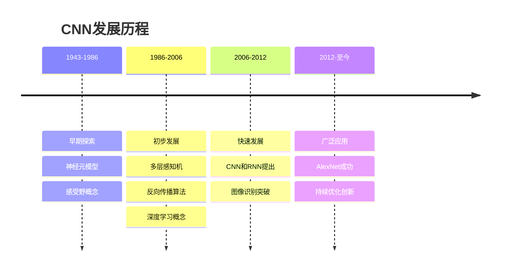

### 详细发展阶段

#### 1943-1986：起源于早期探索

- **1943年**：麦卡洛克和皮茨提出神经元模型，为神经网络奠定基础
- **1980年**：福岛邦彦提出基于感受野的神经网络模型（如神经认知机），模拟视觉皮层机制

#### 1986-2006：初步发展

- **1986年**：多层感知机（MLP）的诞生引入了非线性激活函数和反向传播（BP）算法，使神经网络能够解决非线性问题
- **2006年**：辛顿和鲁斯兰提出深度学习概念及逐层训练算法，开启了深度学习时代

#### 2006-2012：快速发展阶段

- **2006年后**：深度学习在图像识别、语音识别等领域取得突破，CNN和RNN相继被提出并广泛应用

#### 2012-至今：广泛应用阶段

- **2012年**：AlexNet在ImageNet竞赛中取得优异成绩，推动了深度学习在图像识别领域的广泛应用
- **近年来**：CNN在图像分类、目标检测、语义分割等领域取得了显著进展，准确率不断提高

### 发展趋势

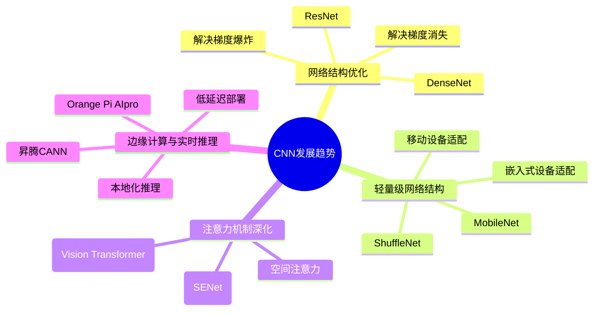

#### 01. 网络结构优化

- **ResNet、DenseNet**等网络结构的出现，解决了深层网络训练中的梯度消失和梯度爆炸问题
- **轻量化与高效化**：
  - 目标：在边缘设备（如 Orange Pi AIpro）实现低功耗推理
  - 技术：知识蒸馏、模型压缩（如剪枝、量化）、参数共享

#### 02. 轻量级网络结构

- **MobileNet、ShuffleNet**等轻量级网络结构适应了移动和嵌入式设备的需求
- **注意力机制深化**：从通道注意力（SENet）扩展到空间注意力、自注意力（如 Vision Transformer 与 CNN 结合）

#### 03. 边缘计算与实时推理

- **昇腾 CANN 与边缘设备**：
  - 通过 ATC 工具将模型转换为.om 格式，在 Orange Pi AIpro（昇腾 310B）实现高效推理（如 GoogLeNet 图像分类、ResNet 性别分类案例）
  - 优势：低延迟、本地化部署，适用于无网络或高实时性场景

#### 04. EfficientNet

- EfficientNet通过同时优化网络的深度、宽度和分辨率，显著提升了模型的性能和效率

---

## 卷积

### 卷积概念

**卷积（Convolution）**是通过两个函数 $f$ 和 $g$ 生成第三个函数的一种数学运算，其本质是一种特殊的积分变换，表征函数 $f$ 与 $g$ 经过翻转和平移的重叠部分函数值乘积对重叠长度的积分。

### 卷积操作

卷积操作是指将一个可移动的小窗口与图像进行逐元素相乘然后相加的操作（这个小窗口其实是一组固定的权重，它可以被看作是卷积核）。这个操作的名称"卷积"，源自于这种元素级相乘和求和的过程。

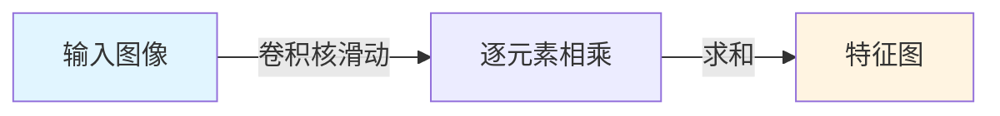

### 卷积计算示例（无填充，步长=1）

假设输入图像为：

```text
1  2  3
4  5  6
7  8  9
```

卷积核为：

```text
0  1
2  3
```

```mermaid
graph TB
    subgraph 输入图像
        A1[1] A2[2] A3[3]
        A4[4] A5[5] A6[6]
        A7[7] A8[8] A9[9]
    end
    
    subgraph 卷积核
        K1[0] K2[1]
        K3[2] K4[3]
    end
    
    subgraph 计算过程
        C1["0×1+1×2+2×4+3×5=25"]
        C2["0×2+1×3+2×5+3×6=31"]
        C3["0×4+1×5+2×7+3×8=43"]
        C4["0×5+1×6+2×8+3×9=49"]
    end
    
    subgraph 输出特征图
        O1[25] O2[31]
        O3[43] O4[49]
    end
    
    A1 & A2 & A4 & A5 --> C1
    A2 & A3 & A5 & A6 --> C2
    A4 & A5 & A7 & A8 --> C3
    A5 & A6 & A8 & A9 --> C4
    C1 --> O1
    C2 --> O2
    C3 --> O3
    C4 --> O4
```

**数学公式**：

$$b[i,j] = \sum_{u,v} a[i+u, j+v] \cdot w[u, v]$$

其中：

- $a$：输入图片
- $b$：特征图
- $w$：卷积核参数

### 填充（Padding）

填充是指在边缘像素点周围填充"0"（即0填充），使得输入图像的边缘像素也可以参与卷积计算。数据填充的主要目的是确保卷积核能够覆盖输入图像的边缘区域，同时保持输出特征图的大小。

```mermaid
graph TB
    subgraph padding=1
        P1["0  0  0  0  0"]
        P2["0  7  8  9  0"]
        P3["0  4  5  6  0"]
        P4["0  1  2  3  0"]
        P5["0  0  0  0  0"]
    end
    
    subgraph padding=2
        P6["0  0  0  0  0  0  0"]
        P7["0  0  0  0  0  0  0"]
        P8["0  0  7  8  9  0  0"]
        P9["0  0  4  5  6  0  0"]
        P10["0  0  1  2  3  0  0"]
        P11["0  0  0  0  0  0  0"]
        P12["0  0  0  0  0  0  0"]
    end
    
    style P1 fill:#ffcccc
    style P5 fill:#ffcccc
    style P6 fill:#ffcccc
    style P7 fill:#ffcccc
    style P11 fill:#ffcccc
    style P12 fill:#ffcccc
```

### 步长（Stride）

在卷积操作时，通常希望输出图像分辨率与输入图像分辨率相比会逐渐减少，即图像被约减。因此，可以通过改变卷积核在输入图像中移动步长大小来跳过一些像素，进行卷积滤波。

当Stride=1时，卷积核滑动跳过1个像素，这是最基本的单步滑动，也是标准的卷积模式。

### 示例：Stride=2

```mermaid
graph LR
    subgraph 输入图像 Stride=2
        I1[1] I2[2] I3[3] I4[4]
        I5[5] I6[6] I7[7] I8[8]
        I9[9] I10[10] I11[11] I12[12]
        I13[13] I14[14] I15[15] I16[16]
    end
    
    subgraph 卷积核
        K1[0] K2[1]
        K3[2] K4[3]
    end
    
    subgraph 输出特征图
        O1[30] O2[42]
    end
    
    I1 & I2 & I5 & I6 --> O1
    I3 & I4 & I7 & I8 --> O2
    
    style I1 fill:#e1f5ff
    style I2 fill:#e1f5ff
    style I5 fill:#e1f5ff
    style I6 fill:#e1f5ff
    style I3 fill:#fff4e1
    style I4 fill:#fff4e1
    style I7 fill:#fff4e1
    style I8 fill:#fff4e1
```

**输出特征图尺寸计算公式**：

当高和宽方向的步长分别为 $S_h$ 和 $S_w$ 时：

- $H_{out} = \lfloor \frac{H + 2p_h - k_h}{S_h} \rfloor + 1$
- $W_{out} = \lfloor \frac{W + 2p_w - k_w}{S_w} \rfloor + 1$

### 特征图大小计算公式

#### 通用公式

- **输出特征图高度**：$H_{out} = \lfloor \frac{H_{in} + 2 \times padding}{stride} \rfloor - kernel_h + 1$
- **输出特征图宽度**：$W_{out} = \lfloor \frac{W_{in} + 2 \times padding}{stride} \rfloor - kernel_w + 1$

#### Valid卷积（padding=0）

- **输出特征图高度**：$H_{out} = \lfloor \frac{H_{in}}{stride} \rfloor - kernel_h + 1$
- **输出特征图宽度**：$W_{out} = \lfloor \frac{W_{in}}{stride} \rfloor - kernel_w + 1$

#### Same卷积

Same卷积的目标是保持输出尺寸与输入尺寸的比例为 $1/stride$。

- **当步长为1**：$padding = \lfloor \frac{kernel}{2} \rfloor - 1$
- **当步长不为1**：使用公式 $H_{out} = \lfloor \frac{H_{in}}{stride} \rfloor$，$W_{out} = \lfloor \frac{W_{in}}{stride} \rfloor$

#### 示例计算

假设输入特征图大小为32×32，卷积核大小为3×3，步长为1，填充为1：

- 输出特征图高度：$H_{out} = \lfloor \frac{32 + 2 \times 1 - 3}{1} \rfloor + 1 = 32$
- 输出特征图宽度：$W_{out} = \lfloor \frac{32 + 2 \times 1 - 3}{1} \rfloor + 1 = 32$

输出的特征图大小为 **32×32**

---

## 感受野机制

### 感受野概念

在卷积所得结果中，每个特征图像素点取值依赖于输入图像中的某个区域，该区域被称为**感受野**。在卷积神经网络中，感受野是特征图上的点对应输入图像上的区域。

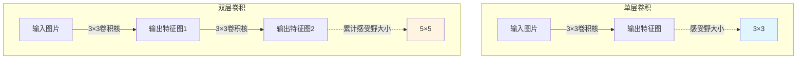

### 不同卷积核的差别（3×3、5×5、7×7）

#### 感受野大小对比

| 卷积核大小 | 感受野特点 | 应用场景 |
|-----------|-----------|---------|
| 3×3 | 感受野小，主要用于捕获局部细节 | 边缘检测、纹理提取 |
| 5×5 | 感受野中等，可以捕获稍大的局部模式和上下文关系 | 中等规模特征提取 |
| 7×7 | 感受野较大，能够感知更大范围的特征 | 全局特征融合、语义分割 |

#### 累计感受野

- 两层 3×3 卷积的有效感受野为 **5×5**
- 三层 3×3 卷积的有效感受野为 **7×7**
- 直接使用 7×7 的卷积核，则一次操作即可获得较大的感受野

#### 计算成本对比

**参数量计算公式**：$参数量 = (k \times k \times C_{in} + 1) \times C_{out}$

假设输入通道 $C_{in} = 64$，输出通道 $C_{out} = 128$：

- **3×3**：参数量 = $(3 \times 3 \times 64 + 1) \times 128 = 73,856$
- **5×5**：参数量 = $(5 \times 5 \times 64 + 1) \times 128 = 204,928$
- **7×7**：参数量 = $(7 \times 7 \times 64 + 1) \times 128 = 401,536$

> ⚠️ **注意**：较大的卷积核会显著增加计算成本和参数量

#### 特征提取能力对比

| 卷积核 | 优点 | 缺点 |
|-------|------|------|
| **3×3** | 能够有效捕获局部细节特征，如边缘、纹理等 | 感受野较小，难以感知更大的全局信息 |
| **5×5** | 可以捕获更大的上下文关系，提取中等规模的模式 | 相比 3×3，计算成本更高 |
| **7×7** | 适合捕获全局特征和更长距离的依赖关系，尤其是处理空间上下文时（如语义分割或注意力机制） | 容易丢失细节信息，计算量大 |

---

## 图像编码与卷积操作

### 图像的编码

#### RGB三通道编码

**原理**：计算机通过红（Red, R）、绿（Green, G）、蓝（Blue, B）三个通道的像素值叠加表示彩色图像，每个通道取值范围为 0~255，对应像素亮度（0 为黑色，255 为纯色）。

- **单像素编码**：用三维向量 (R, G, B) 表示，如白色为 (255, 255, 255)，黑色为 (0, 0, 0)
- **图像矩阵**：一幅 H×W 的彩色图可表示为三维张量 [H, W, 3]，每个通道对应二维矩阵

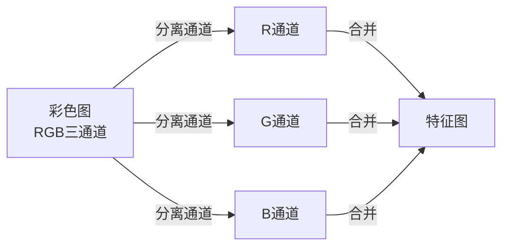

#### 灰度图像编码（单通道）

将彩色图转换为单通道图像，像素值范围为 0~255（0 为黑色，255 为白色），忽略色彩信息，仅保留亮度特征。

**数学定义**：灰度值Gray由RGB三通道值通过加权或平均计算得到。

### 颜色空间

颜色空间是描述颜色的数学模型，用于标准化颜色的定义、存储和显示。不同的颜色空间适用于不同的应用场景。

| 场景 | 推荐颜色空间 |
|------|------------|
| 网页/显示器显示 | sRGB |
| 视频压缩 | YUV/YCrCb |
| 图像编辑（调色） | HSV/HSL |
| 印刷 | CMYK |
| 颜色科学（精确匹配） | Lab/XYZ |
| 计算机视觉（目标检测） | RGB/HSV |

**代码示例**：

```python
import cv2 

# RGB转HSV
rgb_img = cv2.imread("a.jpg")
hsv_img = cv2.cvtColor(rgb_img, cv2.COLOR_RGB2HSV) 

# RGB转灰度
gray_img = cv2.cvtColor(rgb_img, cv2.COLOR_RGB2GRAY)
```

### RGB三通道卷积的融合计算

对于彩色图像，需要对每个通道分别进行卷积操作，然后将结果相加。假设输入图像为 $I(x, y, c)$，卷积核为 $K(k, l, c)$，输出特征图为 $O(i,j)$，则计算公式为：

$$O(i,j) = \sum_{k=0}^{K-1} \sum_{l=0}^{L-1} \sum_{c=0}^{C-1} I(i+k, j+l, c) \cdot K(k, l, c)$$

通过通道融合，可以将不同通道的信息整合在一起，提取更丰富的特征，这种融合方式使得模型能够更好地理解图像中的颜色和纹理信息，从而在各种任务中表现出色。

### 卷积的功能

- **特征提取**：提取图像的边缘、纹理、形状等特征
- **噪声抑制**：通过卷积核的设计，可以平滑图像，抑制噪声
- **图像增强**：通过特定的卷积核，可以增强图像的某些特征，如边缘增强

### 彩色图与灰度图的相互转换

#### 1. 彩色图→灰度图（灰度化）

- **平均值法**：$Gray = \frac{R + G + B}{3}$
- **加权平均法**：$Gray = 0.3R + 0.59G + 0.11B$（人眼对绿色最敏感）

#### 2. 灰度图→彩色图（伪彩色化）

- 通过映射关系为灰度值分配色彩，常用于增强视觉对比度或可视化特征图
- **热图映射**：低温区域（低灰度值）映射为蓝色，高温区域（高灰度值）映射为红色

### 卷积类型

#### 1. 标准卷积

最基本的卷积操作，直接对输入图像进行卷积。标准卷积通过在输入图像上滑动卷积核，计算加权和，得到输出特征图。

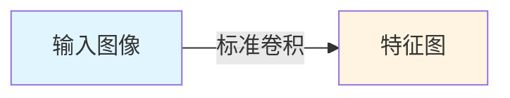

#### 2. 三维卷积

三维卷积用于处理三维数据（如视频、医学影像、时空序列），通过滑动3D Kernel在输入数据的长、宽、深度三个维度上提取特征。

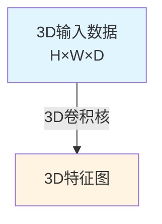

#### 3. 可分卷积

可分卷积是将一个卷积分解为两个单独的运算。节省成本，但并非所有的核都能分成两个更小的核。

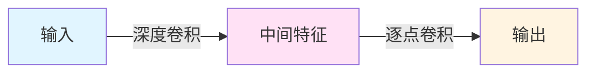

#### 4. 空洞卷积（Dilated Convolution）

通过在卷积核中插入空洞，扩大感受野，不增加计算量。空洞卷积通过在卷积核中插入间隔，使得卷积核能够覆盖更大的输入区域，从而扩大感受野。

> ⚠️ **注意**：空洞卷积是一种上采样，没有参数参与学习，不会学习新的特征。注意与反卷积的差别。

**特点**：

- 获取 long-ranged information，不利于小物体的检测和语义分割
- **Dilation rate**：插入空洞的数量，取值2时在卷积核的元素之间补充一个空洞

```mermaid
graph TB
    subgraph 标准卷积
        A1[特征图] -->|3×3卷积| B1[特征图]
    end
    
    subgraph 空洞卷积 rate=2
        A2[特征图] -->|3×3空洞卷积| B2[特征图<br/>感受野扩大]
    end
    
    style B2 fill:#fff4e1
```

#### 5. 反卷积（Deconvolution / Transposed Convolution）

反卷积与上采样是有区别的：反卷积有一个可训练的卷积核。在低分辨率输入特征图的像素之间插入"0"或进行特定的填充，然后对填充后的图进行一个标准的卷积操作。这个卷积核在训练过程中会被优化。上采样一般是属于无参数的操作。

反卷积又称转置卷积，是卷积的逆操作，核心思想是将低维特征图（如 $H \times W$）映射到高维空间（如 $2H \times 2W$），常用于图像重建、上采样。

**2×2特征图反卷积操作**：2×2的特征图首先通过填充变为6×6的输入图像特征，再通过3×3的卷积核逐步进行卷积计算，最后得到4×4的特征图。

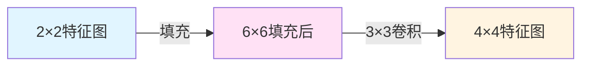

**反卷积计算流程**：

1. **填充**：
   - 在输入特征图边缘补零，扩大尺寸（如输入 2×2，填充 1 层零 → 4×4）
   - 在输入元素间插入（stride-1）个零值，增加空间间隔（如 stride=2 时插入 1 个零）

2. **卷积核旋转180°**

3. **按正向卷积计算**（步长为1，不填充）

**步长为2的反卷积示例**：

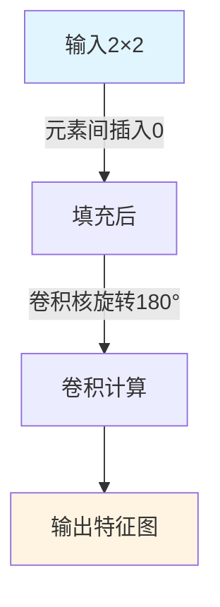

#### 6. PixelShuffle 亚像素卷积

PixelShuffle是一种经典的上采样方法，现已广泛应用在如图像分割等计算机视觉问题上，和反卷积一起成为了神经网络中最常用的两种上采样技术。

相比反卷积，PixelShuffle克服了反卷积的易产生棋盘格的问题。

**超分辨率图像生成过程**：

首先对一个大小为 $H, W, C$ 的低分辨率图像(Input)进行 $l-1$ 次卷积，获得一个特征图 $H, W, C \times r^2$，这里的r为设置的期望上采样倍数。然后对特征图做shuffle变换获得一张大小为 $H \times r, W \times r, C$ 的超分辨率图像(output)。

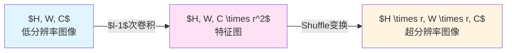

---

## 池化操作（Pooling）

### 池化的作用

池化层的引入是仿照人的视觉系统对视觉输入对象进行降维和抽象，它主要有以下几种作用：

- **平移不变性**：输出结果对输入的平移基本保持不变
- **尺度不变性**：池化操作就相当于图像的resize，图像压缩时去掉的信息只是一些无关紧要的信息，而留下的信息则是具有尺度不变性的特征，是最能表达图像的特征
- **特征降维（下采样）**：把冗余信息去除，把最重要的特征抽取出来
- **控制过拟合**：池化层会不断地减小数据的空间大小，因此参数的数量和计算量也会下降，在一定程度上控制了过拟合
- **实现非线性**：组合ReLU
- **扩大感受野**

### 常见的池化操作

#### 1. 最大池化（Max Pooling）

选择池化区域中的最大值作为输出，能够突出图像中的显著特征。例如，对于一个 2×2 的池化区域，输出该区域中的最大值。

**特点**：

- 能够保留图像中的纹理和边缘特征，对噪声和小的扰动具有一定的鲁棒性
- 例如，在边缘检测任务中，最大池化可以更好地保留边缘信息

**输出尺寸**：假设输入特征图尺寸为 $H \times W$，池化窗口大小为 $k \times k$，步幅为 $s$，则输出特征图的尺寸为：

$$H_{out} = \lfloor \frac{H - k}{s} \rfloor + 1$$
$$W_{out} = \lfloor \frac{W - k}{s} \rfloor + 1$$

#### 2. 平均池化（Mean Pooling）

计算池化区域中的平均值作为输出，能够平滑特征，保留更多的背景信息。

**特点**：

- 能够保留图像的整体结构信息，适合用于提取背景特征
- 例如，在图像分类任务中，平均池化可以更好地保留图像的整体结构信息

#### 3. 随机池化（Stochastic Pooling）

按照池化区域中像素值的概率分布随机选择一个值作为输出。每个像素值被选中的概率与其值成正比，值越大被选中的概率越高。

**特点**：

- 随机池化可以看作一种正则化方式，能够增加模型的泛化能力
- 例如，在训练过程中，随机池化可以防止模型过拟合，提高模型的泛化能力

### 池化操作示例

假设有一输入特征图 $X$，尺寸为4×4，使用2×2的池化窗口且步幅为2：

$$X = \begin{bmatrix}
1 & 3 & 2 & 4 \\
3 & 5 & 6 & 2 \\
8 & 1 & 7 & 4 \\
5 & 3 & 2 & 6
\end{bmatrix}$$

#### 最大池化

```mermaid
graph TB
    subgraph 输入特征图
        X1[1] X2[3] X3[2] X4[4]
        X5[3] X6[5] X7[6] X8[2]
        X9[8] X10[1] X11[7] X12[4]
        X13[5] X14[3] X15[2] X16[6]
    end

    subgraph 窗口1
        W1[1] W2[3]
        W3[3] W4[5]
        W1 & W2 & W3 & W4 -->|max| R1[6]
    end

    subgraph 窗口2
        W5[2] W6[4]
        W7[6] W8[2]
        W5 & W6 & W7 & W8 -->|max| R2[8]
    end

    subgraph 窗口3
        W9[8] W10[1]
        W11[5] W12[3]
        W9 & W10 & W11 & W12 -->|max| R3[8]
    end

    subgraph 窗口4
        W13[7] W14[4]
        W15[2] W16[6]
        W13 & W14 & W15 & W16 -->|max| R4[7]
    end

    subgraph 输出特征图
        O1[6] O2[8]
        O3[8] O4[7]
    end

    R1 --> O1
    R2 --> O2
    R3 --> O3
    R4 --> O4

    style R1 fill:#fff4e1
    style R2 fill:#fff4e1
    style R3 fill:#fff4e1
    style R4 fill:#fff4e1
```

**输出特征图**：$Y_{max} = \begin{bmatrix} 6 & 8 \\ 8 & 7 \end{bmatrix}$

#### 平均池化

**窗口1**：$\frac{1+3+3+5}{4} = 3.75$

**窗口2**：$\frac{2+4+6+2}{4} = 3.5$

**窗口3**：$\frac{8+1+5+3}{4} = 4.25$

**窗口4**：$\frac{7+4+2+6}{4} = 4.75$

**输出特征图**：$Y_{mean} = \begin{bmatrix} 3.75 & 3.5 \\ 4.25 & 4.75 \end{bmatrix}$

---

## 完整卷积神经网络

### CNN架构组成

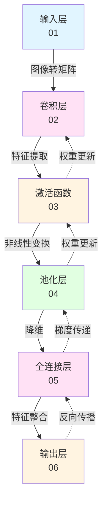

### 各层详细说明

#### 01. 输入层（Input Layer）

输入图像，并将图像转换为其对应的由像素值构成的二维矩阵，并将此二维矩阵存储，等待后面几层的操作。

#### 02. 卷积层（Convolutional Layer）

将输入信号在某一特征上加强，从而实现特征的提取，也可以排除干扰因素，从而降低特征的噪声。

#### 03. 激活函数（Activation Function）

输入特征图经过卷积层后，需要输入给激活函数，进行非线性变换得到激活输出。

**常见激活函数**：
- **ReLU**：$f(x) = \max(0, x)$，缓解梯度消失，默认首选
- **Sigmoid**：$f(x) = \frac{1}{1 + e^{-x}}$，输出范围(0,1)
- **Tanh**：$f(x) = \tanh(x)$，输出范围(-1,1)
- **Swish**：$f(x) = x \cdot \text{sigmoid}(x)$，平滑非线性，适合复杂模型

#### 04. 池化层（Pooling Layer）

池化有以下主要功能：
1. 能够缩小输入特征图的维度，使参数数量和运算量减少，在一定程度上可以避免过拟合
2. 增强网络对输入图像中的微小变化的稳健性

#### 05. 全连接层（Fully Connected Layer）

综合低层的各个卷积层特征，学习特征间的非线性组合，利用全连接层将特征结合到一起。

#### 06. 输出层（Output Layer）

除了输出结果外，还有另一项任务是进行反向传播训练，依次向后进行梯度传递，计算相应的损失函数，并重新更新权重。

---

## 卷积神经网络优化与训练

### 权重初始化（Weight Initialization）

**目标**：打破对称性，避免神经元输出相同值

#### 常见方法

| 初始化方法 | 公式 | 适用场景 |
|----------|------|---------|
| **随机初始化** | 正态分布/均匀分布（如TruncatedNormal） | 通用 |
| **Xavier初始化** | $W \sim N(0, \frac{2}{n_{in} + n_{out}})$ | Sigmoid/Tanh激活 |
| **He初始化** | $W \sim N(0, \frac{2}{n_{in}})$ | ReLU激活 |

其中 $n_{in}, n_{out}$ 表示输入输出层神经元个数。

#### 参数设置建议

- 参数值（张量的通道数、特征图尺寸、批量大小）设为2的幂，如64、128，优化内存管理，提升计算效率

### 前向传播（Forward Propagation）

**流程**：输入数据 → 逐层计算 → 输出预测值

**核心操作**：
- **卷积层**：提取空间特征
- **激活层**：引入非线性
- **池化层**：降维
- **全连接层**：特征整合


### 损失函数计算（Loss Calculation）

**目标**：衡量预测值与真实值的差异

- **分类任务**：交叉熵损失（Cross-Entropy Loss）
- **回归任务**：均方误差（MSE Loss）

### 反向传播与权重更新（Backpropagation & Optimization）

**原理**：通过链式法则计算梯度，使用优化器更新权重

**关键组件**：
- **梯度计算**：MindSpore 自动微分
- **优化器**：
  - 随机梯度下降（SGD）
  - Adam：自适应学习率

**更新公式**：$W_{t+1} = W_t - \eta \cdot \nabla L(W_t)$

其中：
- $\eta$：学习率
- $\nabla L(W_t)$：损失函数关于权重的梯度

### 反向传播训练步骤

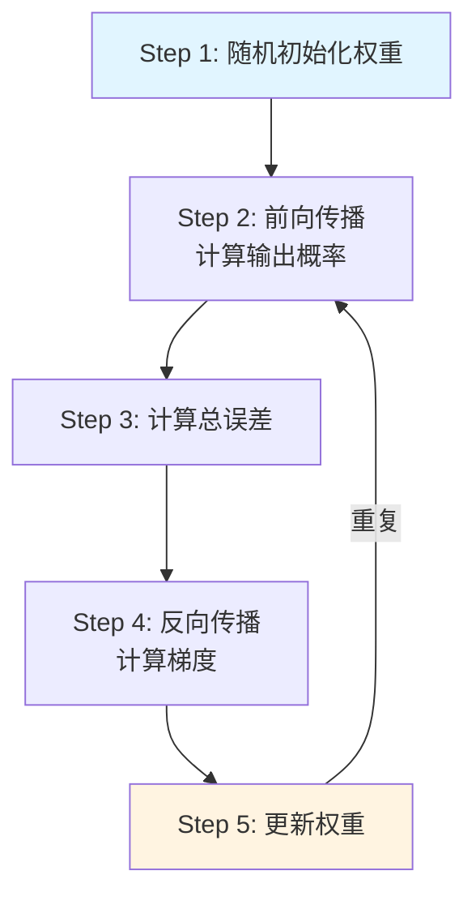

**详细步骤**：

1. **Step 1**：用随机数初始化所有的滤波器和参数/权重

2. **Step 2**：网络将训练图片作为输入，执行前向步骤（卷积，ReLU，池化以及全连接层的前向传播）并计算每个类别的对应输出概率
   - 假设图的输出概率是[0.2, 0.4, 0.1, 0.3]

3. **Step 3**：计算输出层的总误差
   - 总误差 = $\frac{1}{2} \sum (目标概率 - 输出概率)^2$

4. **Step 4**：反向传播算法计算误差相对于所有权重的梯度，并用梯度下降法更新所有的滤波器/权重和参数的值，以使输出误差最小化
   - 权重的调整程度与其对总误差的贡献成正比
   - 当同一图像再次被输入，这次的输出概率可能是[0.1, 0.1, 0.7, 0.1]，与目标[0, 0, 1, 0]更接近了，这说明神经网络已经学习分类特定图片了，学习的方式是调整权重/滤波器以降低输出误差

### 超参数调优策略

#### 01. 学习率（Learning Rate）调优

**核心目标**：平衡收敛速度与最优解搜索

| 策略类型 | 典型方法 | 适用场景 |
|---------|---------|---------|
| 固定学习率 | 恒定值（如 0.01） | 简单模型或小数据集 |
| 衰减学习率 | 指数衰减、余弦衰减、阶梯衰减 | 防止后期震荡，提升精度 |
| 自适应学习率 | Adam、RMSprop、Adagrad | 复杂模型或大规模数据 |

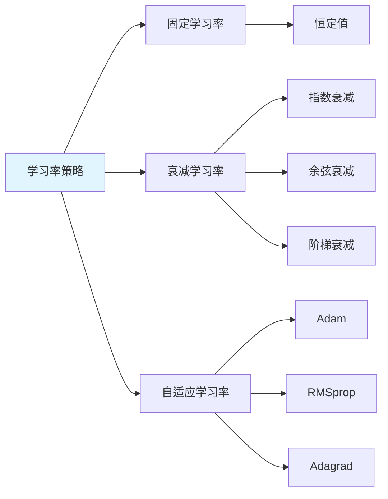

#### 02. 正则化（Regularization）防过拟合

正则化是指在机器学习和统计建模中的一种技术，用于控制模型的复杂度，防止模型在训练数据上过度拟合（overfitting）。正则化通过在模型的损失函数中引入额外的惩罚项，来对模型的参数进行约束，从而降低模型的复杂度，这个额外的惩罚通常与模型参数的大小或者数量相关。

**L1正则化**：
$$L'(\theta) = L(\theta) + \lambda \sum_{i=1}^{n} |\theta_i|$$

**L2正则化**：
$$L'(\theta) = L(\theta) + \lambda \sum_{i=1}^{n} \theta_i^2$$

**防过拟合方法**：

- **Dropout**：
  - DNNs是以概率p舍弃部分神经元，其它神经元以概率q=1-p被保留，舍去的神经元的输出都被设置为零
  - Dropout在实践中能很好工作是因为其在训练阶段阻止神经元的共适应

- **早停机制（Early Stopping）**：
  - 一个epoch结束时（一个epoch即对所有训练数据的一轮遍历）计算validation data的total loss，当loss不再降低时，就停止训练，这样可以防止过拟合

```mermaid
graph LR
    A[正则化方法] --> B[L1正则化]
    A --> C[L2正则化]
    A --> D[Dropout]
    A --> E[早停机制]
    style A fill:#e1f5ff
```

#### 03. 数据增强（Data Augmentation）

**核心作用**：扩大数据集多样性，提升模型泛化能力

| 操作类型 | 示例 | 目标场景 |
|---------|------|---------|
| 几何变换 | 随机裁剪、翻转、旋转 | 增强平移/旋转不变性 |
| 颜色变换 | 亮度、对比度调整 | 适应光照变化 |
| 混合增强 | Mixup、Cutout | 抑制过拟合，提升鲁棒性 |

```mermaid
graph TB
    A[原始图像] --> B[几何变换]
    A --> C[颜色变换]
    A --> D[混合增强]
    B --> E[增强后图像]
    C --> E
    D --> E
    style A fill:#e1f5ff
    style E fill:#fff4e1
```

#### 其他关键超参数

**批量大小（Batch Size）**：
- **小批量**：收敛稳定，适合显存有限场景
- **大批量**：加速训练，但需更大显存

**网络深度与宽度**：
- **深度**：层数增加（如 ResNet-50 vs LeNet），提取更高级特征
- **宽度**：卷积核数量（如从 64→128 通道），提升特征表达能力

**激活函数**：
- **ReLU**：缓解梯度消失，默认首选
- **Swish**：平滑非线性，适合复杂模型

---

## 案例：CNNCTC 图像文本识别

### 任务描述

基于 MindSpore 框架搭建 CNNCTC 模型，实现图像文本识别的训练与离线推理。

### 学习目标

- 掌握 MindSpore 框架搭建
- 学习香橙派 AIpro 开发板的离线模型转换与推理实现

### 实验环境

- **MindSpore**：深度学习框架
- **ModelArts**：云开发平台
- **香橙派AIpro开发板**：边缘计算设备

### 实验流程

```mermaid
flowchart TD
    A[环境准备] --> B[代码下载]
    B --> C[数据准备]
    C --> D[模型训练]
    D --> E[模型导出]
    E --> F[模型转换]
    F --> G[边缘推理]

    style A fill:#e1f5ff
    style D fill:#ffe1f5
    style G fill:#fff4e1
```

#### 1. 训练代码下载

进入MindSpore官网，下载CNNCTC案例的notebook文档：
- 链接：https://www.mindspore.cn/tutorials/application/zh-CN/r2.2/cv/cnnctc.html

#### 2. 实验环境搭建

**ModelArts云环境搭建**：
- 对于平台环境的搭建可以参考《ModelArts云环境搭建指南》
- 实验数据处理所需的存储空间比较大，故在环境搭建时，"云硬盘EVS"这项的设置可稍大些，建议设置为100GB

**MindSpore版本升级**：
- 按上述指南进入ModelArts开发平台后，要将MindSpore版本升级最新版
- 在终端运行指令：
  ```bash
  pip install mindspore
  ```
- 或下载whl包进行安装

#### 3. 模型训练（ModelArts）

**代码修正**：
- 将之前下载好的训练代码文档上传到 ModelArts 开发平台
- 在数据集准备与加载模块添加数据下载权限
- 在模型训练模块修改算力相关参数
- 在训练前先改图模式为静态图（`ms.GRAPH_MODE`）

**训练并导出模型**：
- 导出模型前切换为动态图（`ms.PYNATIVE_MODE`）
- 训练完成后，通过`ms.export`导出 MINDIR 模型

**环境变量设置**：
```python
%env no_proxy='a.test.com,127.0.0.1,2.2.2.2'
```

#### 4. 模型推理过程（香橙派 AIpro）

**开发板环境准备**：
- 登录香橙派，升级 MindSpore 至最新版本
- 参考《手把手教你搭建Orange Pi AI Pro开发环境》实验手册

**推理过程**：
1. 下载项目代码
2. 上传mindir模型文件至指定目录
3. 在`/home/HwHiAiUser/samples/notebooks`目录下运行如下命令，生成om模型文件

**代码下载**：
```bash
cd /home/HwHiAiUser/samples/notebooks/
git clone https://github.com/mindspore-courses/orange-pi-mindspore.git
# 获取bash.sh文件
wget https://mindspore-courses.obs.cn-north-4.myhuaweicloud.com/orange-pi-mindspore/package/bash.sh
```

**模型转换（MINDIR→OM）**：
- `bash.sh`文件执行时需要传入两个参数：
  1. 第一个参数：开发板上存放的MINDIR文件的绝对路径
  2. 第二个参数：生成的om文件的名称

**执行转换**：
```bash
# 执行bash.sh文件
source bash.sh /home/HwHiAiUser/samples/notebooks/cnnctc2.2.14/cnnctc.mindir cnnctc
```

**推理执行**：
- 修改`start_notebook.sh`中的 IP 为`192.168.137.100`，启动 JupyterLab 环境
- 运行`main_cnnctc.ipynb`前，注释 OM 下载代码，执行推理

**模型输出示例**：
```
Predict: ['parking']
```

---

## 总结

卷积神经网络（CNN）作为深度学习的核心架构之一，在图像处理、计算机视觉等领域取得了巨大成功。本文档系统介绍了：

1. **CNN的发展历程**：从早期探索到广泛应用的发展脉络
2. **卷积操作**：包括标准卷积、填充、步长等核心概念
3. **感受野机制**：理解CNN如何逐步扩大感受野提取特征
4. **池化操作**：降维和特征抽象的重要方法
5. **完整CNN架构**：从输入到输出的完整流程
6. **优化与训练**：权重初始化、前向传播、反向传播、超参数调优等
7. **实际案例**：CNNCTC图像文本识别的完整实现流程

通过系统学习这些内容，可以深入理解CNN的工作原理，并能够应用于实际项目中。

---

## 参考资料

- MindSpore官方文档：https://www.mindspore.cn/
- CNNCTC案例：https://www.mindspore.cn/tutorials/application/zh-CN/r2.2/cv/cnnctc.html
- Orange Pi AIpro开发环境搭建指南

---

*文档最后更新时间：2024年*
