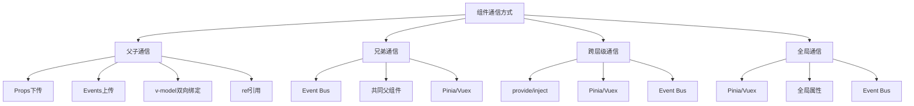
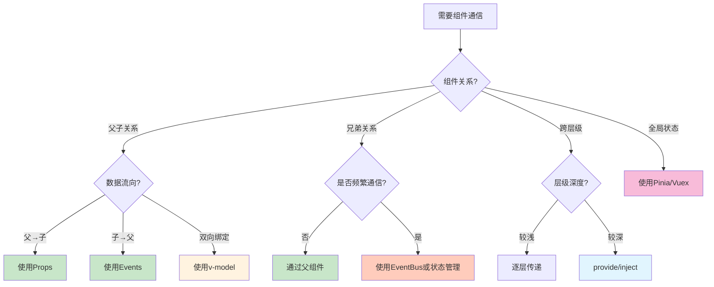

# Vue组件通信完全指南

> 掌握Vue3中父子组件、兄弟组件、跨层级组件的所有通信方式

## 🎯 学习目标

- 理解Vue组件间通信的各种方式
- 掌握Props、Events、provide/inject的使用
- 学会选择合适的通信方式
- 了解与React通信方式的差异

## 📊 组件通信方式概览



## 🔄 父子组件通信

### 1. Props下传数据

#### 基本用法

```vue
<!-- 父组件 -->
<template>
  <div>
    <h2>用户列表</h2>
    <UserCard
      v-for="user in users"
      :key="user.id"
      :user="user"
      :show-details="true"
      @view-profile="handleViewProfile"
      @edit-user="handleEditUser"
    />
  </div>
</template>

<script setup>
import { ref } from 'vue'
import UserCard from './UserCard.vue'

const users = ref([
  { id: 1, name: '张三', email: 'zhangsan@example.com', age: 25 },
  { id: 2, name: '李四', email: 'lisi@example.com', age: 30 },
  { id: 3, name: '王五', email: 'wangwu@example.com', age: 28 }
])

const handleViewProfile = (userId) => {
  console.log('查看用户资料:', userId)
}

const handleEditUser = (userData) => {
  console.log('编辑用户:', userData)
}
</script>
```

```vue
<!-- 子组件 UserCard.vue -->
<template>
  <div class="user-card">
    <div class="user-info">
      <h3>{{ user.name }}</h3>
      <p>{{ user.email }}</p>
      <p v-if="showDetails">年龄: {{ user.age }}</p>
    </div>
    
    <div class="user-actions">
      <button @click="$emit('view-profile', user.id)">
        查看资料
      </button>
      <button @click="handleEdit">
        编辑
      </button>
    </div>
  </div>
</template>

<script setup>
// Props定义
const props = defineProps({
  user: {
    type: Object,
    required: true,
    validator: (value) => {
      return value && typeof value.id === 'number' && value.name
    }
  },
  showDetails: {
    type: Boolean,
    default: false
  }
})

// Events定义
const emit = defineEmits(['view-profile', 'edit-user'])

const handleEdit = () => {
  emit('edit-user', {
    id: props.user.id,
    name: props.user.name,
    email: props.user.email
  })
}
</script>

<style scoped>
.user-card {
  border: 1px solid #ddd;
  border-radius: 8px;
  padding: 16px;
  margin: 8px 0;
  display: flex;
  justify-content: space-between;
  align-items: center;
}

.user-actions button {
  margin-left: 8px;
  padding: 6px 12px;
  border: 1px solid #007bff;
  background: white;
  color: #007bff;
  border-radius: 4px;
  cursor: pointer;
}

.user-actions button:hover {
  background: #007bff;
  color: white;
}
</style>
```

#### TypeScript支持

```vue
<!-- 父组件 TypeScript版本 -->
<script setup lang="ts">
interface User {
  id: number
  name: string
  email: string
  age: number
}

const users = ref<User[]>([
  { id: 1, name: '张三', email: 'zhangsan@example.com', age: 25 }
])

const handleViewProfile = (userId: number) => {
  console.log('查看用户资料:', userId)
}

const handleEditUser = (userData: Partial<User>) => {
  console.log('编辑用户:', userData)
}
</script>
```

```vue
<!-- 子组件 TypeScript版本 -->
<script setup lang="ts">
interface User {
  id: number
  name: string
  email: string
  age: number
}

interface Props {
  user: User
  showDetails?: boolean
}

const props = withDefaults(defineProps<Props>(), {
  showDetails: false
})

const emit = defineEmits<{
  'view-profile': [userId: number]
  'edit-user': [userData: Partial<User>]
}>()
</script>
```

### 2. v-model双向绑定

#### 基础双向绑定

```vue
<!-- 父组件 -->
<template>
  <div>
    <h3>搜索用户</h3>
    <SearchInput v-model="searchQuery" placeholder="输入用户名..." />
    <p>搜索关键词: {{ searchQuery }}</p>
    
    <h3>用户设置</h3>
    <UserSettings v-model:name="userName" v-model:email="userEmail" />
    <p>用户名: {{ userName }}</p>
    <p>邮箱: {{ userEmail }}</p>
  </div>
</template>

<script setup>
import { ref } from 'vue'
import SearchInput from './SearchInput.vue'
import UserSettings from './UserSettings.vue'

const searchQuery = ref('')
const userName = ref('张三')
const userEmail = ref('zhangsan@example.com')
</script>
```

```vue
<!-- SearchInput.vue -->
<template>
  <input
    :value="modelValue"
    @input="$emit('update:modelValue', $event.target.value)"
    v-bind="$attrs"
    class="search-input"
  />
</template>

<script setup>
defineProps(['modelValue'])
defineEmits(['update:modelValue'])
</script>

<style scoped>
.search-input {
  width: 100%;
  padding: 8px 12px;
  border: 1px solid #ddd;
  border-radius: 4px;
  font-size: 14px;
}
</style>
```

```vue
<!-- UserSettings.vue -->
<template>
  <div class="user-settings">
    <div class="form-group">
      <label>用户名:</label>
      <input
        :value="name"
        @input="$emit('update:name', $event.target.value)"
        type="text"
      />
    </div>
    
    <div class="form-group">
      <label>邮箱:</label>
      <input
        :value="email"
        @input="$emit('update:email', $event.target.value)"
        type="email"
      />
    </div>
  </div>
</template>

<script setup>
defineProps(['name', 'email'])
defineEmits(['update:name', 'update:email'])
</script>

<style scoped>
.user-settings {
  border: 1px solid #eee;
  padding: 16px;
  border-radius: 8px;
}

.form-group {
  margin-bottom: 12px;
}

.form-group label {
  display: block;
  margin-bottom: 4px;
  font-weight: bold;
}

.form-group input {
  width: 100%;
  padding: 6px 10px;
  border: 1px solid #ccc;
  border-radius: 4px;
}
</style>
```

#### 自定义v-model修饰符

```vue
<!-- CustomInput.vue -->
<template>
  <input
    :value="modelValue"
    @input="handleInput"
    @blur="handleBlur"
  />
</template>

<script setup>
const props = defineProps({
  modelValue: String,
  modelModifiers: {
    type: Object,
    default: () => ({})
  }
})

const emit = defineEmits(['update:modelValue'])

const handleInput = (event) => {
  let value = event.target.value
  
  // 处理修饰符
  if (props.modelModifiers.capitalize) {
    value = value.charAt(0).toUpperCase() + value.slice(1)
  }
  
  if (props.modelModifiers.trim) {
    value = value.trim()
  }
  
  emit('update:modelValue', value)
}

const handleBlur = (event) => {
  if (props.modelModifiers.lazy) {
    emit('update:modelValue', event.target.value)
  }
}
</script>
```

```vue
<!-- 使用自定义修饰符 -->
<template>
  <div>
    <CustomInput v-model.capitalize.trim="inputValue" />
    <p>输入值: {{ inputValue }}</p>
  </div>
</template>
```

### 3. ref引用

```vue
<!-- 父组件 -->
<template>
  <div>
    <ChildComponent ref="childRef" />
    <button @click="callChildMethod">调用子组件方法</button>
    <button @click="getChildData">获取子组件数据</button>
  </div>
</template>

<script setup>
import { ref } from 'vue'
import ChildComponent from './ChildComponent.vue'

const childRef = ref()

const callChildMethod = () => {
  childRef.value.reset()
}

const getChildData = () => {
  console.log('子组件数据:', childRef.value.getData())
}
</script>
```

```vue
<!-- ChildComponent.vue -->
<template>
  <div>
    <p>计数: {{ count }}</p>
    <button @click="increment">增加</button>
  </div>
</template>

<script setup>
import { ref } from 'vue'

const count = ref(0)

const increment = () => {
  count.value++
}

const reset = () => {
  count.value = 0
}

const getData = () => {
  return {
    count: count.value,
    timestamp: Date.now()
  }
}

// 暴露给父组件的方法和数据
defineExpose({
  reset,
  getData,
  count: readonly(count) // 只读引用
})
</script>
```

## 🔗 兄弟组件通信

### 1. 通过共同父组件

```vue
<!-- 父组件 App.vue -->
<template>
  <div class="app">
    <ProductList @add-to-cart="handleAddToCart" />
    <ShoppingCart 
      :items="cartItems" 
      @remove-item="handleRemoveItem"
      @update-quantity="handleUpdateQuantity"
    />
  </div>
</template>

<script setup>
import { ref } from 'vue'
import ProductList from './ProductList.vue'
import ShoppingCart from './ShoppingCart.vue'

const cartItems = ref([])

const handleAddToCart = (product) => {
  const existingItem = cartItems.value.find(item => item.id === product.id)
  
  if (existingItem) {
    existingItem.quantity++
  } else {
    cartItems.value.push({
      ...product,
      quantity: 1
    })
  }
}

const handleRemoveItem = (productId) => {
  const index = cartItems.value.findIndex(item => item.id === productId)
  if (index > -1) {
    cartItems.value.splice(index, 1)
  }
}

const handleUpdateQuantity = (productId, quantity) => {
  const item = cartItems.value.find(item => item.id === productId)
  if (item) {
    item.quantity = quantity
  }
}
</script>
```

```vue
<!-- ProductList.vue -->
<template>
  <div class="product-list">
    <h2>商品列表</h2>
    <div v-for="product in products" :key="product.id" class="product-item">
      <h3>{{ product.name }}</h3>
      <p>价格: ¥{{ product.price }}</p>
      <button @click="$emit('add-to-cart', product)">
        添加到购物车
      </button>
    </div>
  </div>
</template>

<script setup>
const products = [
  { id: 1, name: 'iPhone 15', price: 5999 },
  { id: 2, name: 'MacBook Pro', price: 12999 },
  { id: 3, name: 'AirPods Pro', price: 1999 }
]

defineEmits(['add-to-cart'])
</script>
```

```vue
<!-- ShoppingCart.vue -->
<template>
  <div class="shopping-cart">
    <h2>购物车</h2>
    <div v-if="items.length === 0" class="empty-cart">
      购物车为空
    </div>
    
    <div v-else>
      <div v-for="item in items" :key="item.id" class="cart-item">
        <h4>{{ item.name }}</h4>
        <p>价格: ¥{{ item.price }}</p>
        <div class="quantity-controls">
          <button @click="updateQuantity(item.id, item.quantity - 1)">-</button>
          <span>{{ item.quantity }}</span>
          <button @click="updateQuantity(item.id, item.quantity + 1)">+</button>
        </div>
        <button @click="$emit('remove-item', item.id)" class="remove-btn">
          删除
        </button>
      </div>
      
      <div class="cart-total">
        总计: ¥{{ totalPrice }}
      </div>
    </div>
  </div>
</template>

<script setup>
import { computed } from 'vue'

const props = defineProps(['items'])
const emit = defineEmits(['remove-item', 'update-quantity'])

const totalPrice = computed(() => {
  return props.items.reduce((total, item) => {
    return total + (item.price * item.quantity)
  }, 0)
})

const updateQuantity = (id, quantity) => {
  if (quantity <= 0) {
    emit('remove-item', id)
  } else {
    emit('update-quantity', id, quantity)
  }
}
</script>
```

### 2. Event Bus模式

```javascript
// eventBus.js
import { ref } from 'vue'

class EventBus {
  constructor() {
    this.events = {}
  }
  
  on(event, callback) {
    if (!this.events[event]) {
      this.events[event] = []
    }
    this.events[event].push(callback)
  }
  
  emit(event, data) {
    if (this.events[event]) {
      this.events[event].forEach(callback => callback(data))
    }
  }
  
  off(event, callback) {
    if (this.events[event]) {
      const index = this.events[event].indexOf(callback)
      if (index > -1) {
        this.events[event].splice(index, 1)
      }
    }
  }
}

export const eventBus = new EventBus()
```

```vue
<!-- MessageSender.vue -->
<template>
  <div class="message-sender">
    <h3>发送消息</h3>
    <input v-model="message" placeholder="输入消息..." />
    <button @click="sendMessage">发送</button>
  </div>
</template>

<script setup>
import { ref } from 'vue'
import { eventBus } from './eventBus.js'

const message = ref('')

const sendMessage = () => {
  if (message.value.trim()) {
    eventBus.emit('message-sent', {
      content: message.value,
      timestamp: new Date().toLocaleTimeString(),
      id: Date.now()
    })
    message.value = ''
  }
}
</script>
```

```vue
<!-- MessageReceiver.vue -->
<template>
  <div class="message-receiver">
    <h3>接收消息</h3>
    <div v-if="messages.length === 0" class="no-messages">
      暂无消息
    </div>
    
    <div v-else>
      <div v-for="msg in messages" :key="msg.id" class="message">
        <span class="content">{{ msg.content }}</span>
        <span class="timestamp">{{ msg.timestamp }}</span>
      </div>
    </div>
  </div>
</template>

<script setup>
import { ref, onMounted, onUnmounted } from 'vue'
import { eventBus } from './eventBus.js'

const messages = ref([])

const handleMessage = (messageData) => {
  messages.value.unshift(messageData)
  
  // 限制消息数量
  if (messages.value.length > 10) {
    messages.value.pop()
  }
}

onMounted(() => {
  eventBus.on('message-sent', handleMessage)
})

onUnmounted(() => {
  eventBus.off('message-sent', handleMessage)
})
</script>
```

## 🌳 跨层级组件通信

### provide/inject依赖注入

```vue
<!-- 祖先组件 App.vue -->
<template>
  <div class="app">
    <h1>主题切换示例</h1>
    <button @click="toggleTheme">
      切换主题 (当前: {{ theme }})
    </button>
    
    <UserProfile />
  </div>
</template>

<script setup>
import { ref, provide, readonly } from 'vue'
import UserProfile from './UserProfile.vue'

const theme = ref('light')
const user = ref({
  name: '张三',
  avatar: '/avatar.jpg',
  preferences: {
    language: 'zh-CN',
    timezone: 'Asia/Shanghai'
  }
})

const toggleTheme = () => {
  theme.value = theme.value === 'light' ? 'dark' : 'light'
}

const updateUser = (newUserData) => {
  Object.assign(user.value, newUserData)
}

// 提供主题
provide('theme', readonly(theme))
provide('toggleTheme', toggleTheme)

// 提供用户数据和方法
provide('user', readonly(user))
provide('updateUser', updateUser)

// 提供配置
provide('config', {
  apiUrl: 'https://api.example.com',
  version: '1.0.0'
})
</script>
```

```vue
<!-- 中间组件 UserProfile.vue -->
<template>
  <div class="user-profile">
    <UserHeader />
    <UserSettings />
  </div>
</template>

<script setup>
import UserHeader from './UserHeader.vue'
import UserSettings from './UserSettings.vue'
</script>
```

```vue
<!-- 深层子组件 UserHeader.vue -->
<template>
  <header :class="['user-header', `theme-${theme}`]">
    
    <h2>{{ user.name }}</h2>
    <button @click="toggleTheme" class="theme-btn">
      {{ theme === 'light' ? '🌙' : '☀️' }}
    </button>
  </header>
</template>

<script setup>
import { inject } from 'vue'

const theme = inject('theme')
const toggleTheme = inject('toggleTheme')
const user = inject('user')
</script>

<style scoped>
.user-header {
  display: flex;
  align-items: center;
  padding: 16px;
  border-radius: 8px;
  margin-bottom: 16px;
}

.theme-light {
  background: #f5f5f5;
  color: #333;
}

.theme-dark {
  background: #333;
  color: #fff;
}

.avatar {
  width: 48px;
  height: 48px;
  border-radius: 50%;
  margin-right: 12px;
}

.theme-btn {
  margin-left: auto;
  background: none;
  border: none;
  font-size: 24px;
  cursor: pointer;
}
</style>
```

```vue
<!-- 深层子组件 UserSettings.vue -->
<template>
  <div :class="['user-settings', `theme-${theme}`]">
    <h3>用户设置</h3>
    
    <div class="setting-item">
      <label>语言:</label>
      <select v-model="localPreferences.language" @change="savePreferences">
        <option value="zh-CN">中文</option>
        <option value="en-US">English</option>
      </select>
    </div>
    
    <div class="setting-item">
      <label>时区:</label>
      <select v-model="localPreferences.timezone" @change="savePreferences">
        <option value="Asia/Shanghai">北京时间</option>
        <option value="America/New_York">纽约时间</option>
        <option value="Europe/London">伦敦时间</option>
      </select>
    </div>
    
    <div class="app-info">
      <p>API地址: {{ config.apiUrl }}</p>
      <p>版本: {{ config.version }}</p>
    </div>
  </div>
</template>

<script setup>
import { inject, ref, watch } from 'vue'

const theme = inject('theme')
const user = inject('user')
const updateUser = inject('updateUser')
const config = inject('config')

// 本地状态，避免直接修改注入的数据
const localPreferences = ref({
  language: user.value.preferences.language,
  timezone: user.value.preferences.timezone
})

const savePreferences = () => {
  updateUser({
    preferences: localPreferences.value
  })
}

// 监听用户数据变化，同步到本地状态
watch(() => user.value.preferences, (newPreferences) => {
  localPreferences.value = { ...newPreferences }
}, { deep: true })
</script>

<style scoped>
.user-settings {
  padding: 16px;
  border-radius: 8px;
}

.theme-light {
  background: #fff;
  border: 1px solid #ddd;
}

.theme-dark {
  background: #444;
  border: 1px solid #666;
}

.setting-item {
  margin-bottom: 12px;
}

.setting-item label {
  display: inline-block;
  width: 60px;
  font-weight: bold;
}

.setting-item select {
  padding: 4px 8px;
  border: 1px solid #ccc;
  border-radius: 4px;
}

.app-info {
  margin-top: 20px;
  padding-top: 12px;
  border-top: 1px solid currentColor;
  opacity: 0.6;
  font-size: 12px;
}
</style>
```

### 组合式函数封装

```javascript
// composables/useTheme.js
import { inject, provide, readonly } from 'vue'

const THEME_KEY = Symbol('theme')

export function provideTheme(initialTheme = 'light') {
  const theme = ref(initialTheme)
  
  const toggleTheme = () => {
    theme.value = theme.value === 'light' ? 'dark' : 'light'
  }
  
  const setTheme = (newTheme) => {
    theme.value = newTheme
  }
  
  provide(THEME_KEY, {
    theme: readonly(theme),
    toggleTheme,
    setTheme
  })
  
  return {
    theme,
    toggleTheme,
    setTheme
  }
}

export function useTheme() {
  const themeContext = inject(THEME_KEY)
  
  if (!themeContext) {
    throw new Error('useTheme must be used within a theme provider')
  }
  
  return themeContext
}
```

```vue
<!-- 使用组合式函数 -->
<script setup>
import { useTheme } from '@/composables/useTheme'

const { theme, toggleTheme } = useTheme()
</script>
```

## 📋 通信方式选择指南

### 决策树



### 性能对比

| 通信方式 | 性能开销 | 维护成本 | 适用场景 | 推荐指数 |
|----------|----------|----------|----------|----------|
| Props/Events | 低 | 低 | 父子组件 | ⭐⭐⭐⭐⭐ |
| v-model | 低 | 低 | 双向绑定 | ⭐⭐⭐⭐⭐ |
| provide/inject | 中 | 中 | 跨层级 | ⭐⭐⭐⭐ |
| Event Bus | 中 | 高 | 兄弟组件 | ⭐⭐⭐ |
| Pinia/Vuex | 中 | 中 | 全局状态 | ⭐⭐⭐⭐ |
| ref引用 | 低 | 高 | 特殊需求 | ⭐⭐ |

## 🚀 最佳实践

### 1. Props验证

```javascript
// 完整的props验证示例
const props = defineProps({
  // 基础类型检查
  id: Number,
  title: String,
  
  // 必需属性
  user: {
    type: Object,
    required: true
  },
  
  // 带默认值
  size: {
    type: String,
    default: 'medium',
    validator: (value) => ['small', 'medium', 'large'].includes(value)
  },
  
  // 数组/对象默认值需要工厂函数
  tags: {
    type: Array,
    default: () => []
  },
  
  // 自定义验证
  email: {
    type: String,
    validator: (value) => {
      return /^[^\s@]+@[^\s@]+\.[^\s@]+$/.test(value)
    }
  },
  
  // 多种类型
  value: [String, Number, Boolean]
})
```

### 2. 事件命名规范

```vue
<script setup>
// ✅ 推荐的事件命名
const emit = defineEmits([
  'update:modelValue',  // v-model更新
  'change',            // 值改变
  'click',             // 点击事件
  'submit',            // 提交事件
  'close',             // 关闭事件
  'open',              // 打开事件
  'success',           // 成功回调
  'error',             // 错误回调
  'user-updated',      // 业务事件，使用kebab-case
  'item-selected'      // 业务事件，使用kebab-case
])

// ❌ 避免的事件命名
// 'userUpdated'  // 驼峰命名在模板中不友好
// 'update'       // 太过通用
// 'doSomething'  // 命名不明确
</script>
```

### 3. 组合式API最佳实践

```javascript
// composables/useCounter.js
import { ref, computed } from 'vue'

export function useCounter(initialValue = 0) {
  const count = ref(initialValue)
  
  const isEven = computed(() => count.value % 2 === 0)
  const isOdd = computed(() => !isEven.value)
  
  const increment = () => count.value++
  const decrement = () => count.value--
  const reset = () => count.value = initialValue
  
  return {
    count: readonly(count),  // 只读引用
    isEven,
    isOdd,
    increment,
    decrement,
    reset
  }
}
```

### 4. provide/inject最佳实践

```javascript
// 使用Symbol作为key，避免命名冲突
const ThemeSymbol = Symbol('theme')
const UserSymbol = Symbol('user')

// 提供类型安全的注入
export function provideUser(user) {
  provide(UserSymbol, user)
}

export function useUser() {
  const user = inject(UserSymbol)
  if (!user) {
    throw new Error('useUser must be used within a user provider')
  }
  return user
}
```

## 📚 延伸阅读

- [Vue 3 组件通信官方指南](https://cn.vuejs.org/guide/components/events.html)
- [深入理解provide/inject](https://cn.vuejs.org/guide/components/provide-inject.html)
- [Vue 3 Composition API最佳实践](https://cn.vuejs.org/guide/reusability/composables.html)

---

**下一篇**: [Composition API详解](./composition-api.md) - 深入学习Vue 3的组合式API 