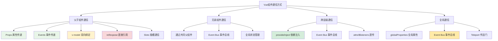
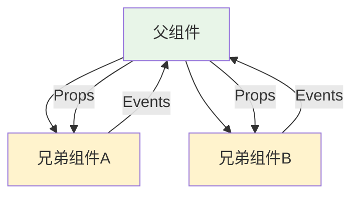
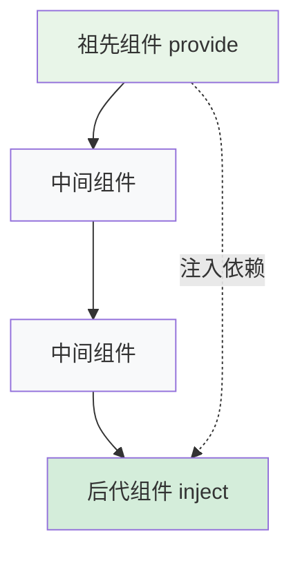
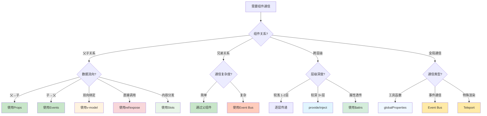

# Vue组件通信深度解析

## 一、概述

Vue组件通信是Vue应用开发中的核心概念之一。在实际开发中，组件间的数据传递和交互是不可避免的需求。Vue提供了多种组件通信方式，每种方式都有其特定的适用场景和使用限制。理解这些通信方式的原理、使用场景和最佳实践，对于构建可维护、高性能的Vue应用至关重要。

Vue的组件通信遵循"单向数据流"的设计理念：数据总是从父组件流向子组件，子组件通过事件向父组件通信。这种设计模式使得数据流向清晰、可预测，便于调试和维护。同时，Vue也提供了一些特殊的通信机制来处理更复杂的场景，如跨层级通信和全局状态管理。

## 二、核心概念

### 2.1 组件通信分类

Vue组件通信可以按照组件关系分为以下几类：
- **父子通信**: 直接的父子组件关系
- **兄弟通信**: 同级组件间的通信
- **跨层级通信**: 祖先与后代组件间的通信
- **全局通信**: 任意组件间的通信

### 2.2 数据流向原则

Vue遵循"Props Down, Events Up"的数据流向原则：
- **向下传递数据**: 通过Props将数据从父组件传递给子组件
- **向上传递事件**: 通过Events将事件从子组件传递给父组件
- **双向绑定**: 通过v-model实现特定场景下的双向数据绑定

### 2.3 组件通信方式全景图



## 三、父子组件通信

父子组件通信是最基础也是最常用的通信方式。Vue提供了多种机制来实现父子组件间的数据传递和交互。

### 3.1 Props属性传递

Props是Vue中最基础的父子组件通信方式。它实现了数据的单向流动：从父组件向子组件传递数据。Props的设计遵循"单向数据流"原则，确保了数据流向的可预测性和组件的可维护性。

#### 3.1.1 Props基础概念

Props（Properties的简写）是组件的自定义属性。当一个值作为prop被传递给子组件时，它就成为了那个组件实例上的一个属性。Props只能由父组件修改，子组件不应该直接修改Props的值，这确保了数据流的单向性。

**Props的特点：**
- **只读性**: 子组件不能直接修改Props值
- **响应性**: Props值的变化会自动触发子组件重新渲染
- **类型检查**: 支持运行时类型验证和开发时警告
- **默认值**: 支持设置默认值和自定义验证器

#### 3.1.2 基本用法

```vue
<!-- 父组件 -->
<template>
  <div>
    <h2>用户列表</h2>
    <UserCard
      v-for="user in users"
      :key="user.id"
      :user="user"
      :show-details="true"
      @view-profile="handleViewProfile"
      @edit-user="handleEditUser"
    />
  </div>
</template>

<script setup>
import { ref } from 'vue'
import UserCard from './UserCard.vue'

const users = ref([
  { id: 1, name: '张三', email: 'zhangsan@example.com', age: 25 },
  { id: 2, name: '李四', email: 'lisi@example.com', age: 30 },
  { id: 3, name: '王五', email: 'wangwu@example.com', age: 28 }
])

const handleViewProfile = (userId) => {
  console.log('查看用户资料:', userId)
}

const handleEditUser = (userData) => {
  console.log('编辑用户:', userData)
}
</script>
```

```vue
<!-- 子组件 UserCard.vue -->
<template>
  <div class="user-card">
    <div class="user-info">
      <h3>{{ user.name }}</h3>
      <p>{{ user.email }}</p>
      <p v-if="showDetails">年龄: {{ user.age }}</p>
    </div>
    
    <div class="user-actions">
      <button @click="$emit('view-profile', user.id)">
        查看资料
      </button>
      <button @click="handleEdit">
        编辑
      </button>
    </div>
  </div>
</template>

<script setup>
// Props定义
const props = defineProps({
  user: {
    type: Object,
    required: true,
    validator: (value) => {
      return value && typeof value.id === 'number' && value.name
    }
  },
  showDetails: {
    type: Boolean,
    default: false
  }
})

// Events定义
const emit = defineEmits(['view-profile', 'edit-user'])

const handleEdit = () => {
  emit('edit-user', {
    id: props.user.id,
    name: props.user.name,
    email: props.user.email
  })
}
</script>

<style scoped>
.user-card {
  border: 1px solid #ddd;
  border-radius: 8px;
  padding: 16px;
  margin: 8px 0;
  display: flex;
  justify-content: space-between;
  align-items: center;
}

.user-actions button {
  margin-left: 8px;
  padding: 6px 12px;
  border: 1px solid #007bff;
  background: white;
  color: #007bff;
  border-radius: 4px;
  cursor: pointer;
}

.user-actions button:hover {
  background: #007bff;
  color: white;
}
</style>
```

#### TypeScript支持

```vue
<!-- 父组件 TypeScript版本 -->
<script setup lang="ts">
interface User {
  id: number
  name: string
  email: string
  age: number
}

const users = ref<User[]>([
  { id: 1, name: '张三', email: 'zhangsan@example.com', age: 25 }
])

const handleViewProfile = (userId: number) => {
  console.log('查看用户资料:', userId)
}

const handleEditUser = (userData: Partial<User>) => {
  console.log('编辑用户:', userData)
}
</script>
```

```vue
<!-- 子组件 TypeScript版本 -->
<script setup lang="ts">
interface User {
  id: number
  name: string
  email: string
  age: number
}

interface Props {
  user: User
  showDetails?: boolean
}

const props = withDefaults(defineProps<Props>(), {
  showDetails: false
})

const emit = defineEmits<{
  'view-profile': [userId: number]
  'edit-user': [userData: Partial<User>]
}>()
</script>
```

### 3.2 Events事件传递

Events是子组件向父组件通信的主要方式。当子组件需要向父组件传递数据或通知父组件某些事件发生时，就需要使用事件机制。Vue的事件系统基于观察者模式，子组件发出（emit）事件，父组件监听（listen）事件。

#### 3.2.1 事件机制原理

Vue的事件系统遵循DOM事件的设计理念，但它是Vue自己的事件系统，不依赖于DOM事件。当子组件调用`$emit`方法时，Vue会查找父组件中是否有对应的事件监听器，如果有，就会执行相应的回调函数。

**事件系统特点：**
- **自定义事件名**: 可以定义任意名称的事件
- **参数传递**: 支持传递多个参数给事件监听器
- **事件验证**: 在开发环境下可以验证事件是否已定义
- **修饰符支持**: 支持.once、.capture等事件修饰符

#### 3.2.2 基础事件传递

```vue
<!-- 父组件 -->
<template>
  <div>
    <h2>计数器应用</h2>
    <p>当前计数: {{ count }}</p>
    <Counter 
      :initial-value="count"
      @increment="handleIncrement"
      @decrement="handleDecrement"
      @reset="handleReset"
      @change="handleChange"
    />
  </div>
</template>

<script setup>
import { ref } from 'vue'
import Counter from './Counter.vue'

const count = ref(0)

const handleIncrement = (value) => {
  count.value = value
  console.log('计数增加到:', value)
}

const handleDecrement = (value) => {
  count.value = value
  console.log('计数减少到:', value)
}

const handleReset = () => {
  count.value = 0
  console.log('计数器已重置')
}

const handleChange = (oldValue, newValue) => {
  console.log('计数从', oldValue, '变为', newValue)
}
</script>
```

```vue
<!-- 子组件 Counter.vue -->
<template>
  <div class="counter">
    <button @click="decrement">-</button>
    <span class="count">{{ currentValue }}</span>
    <button @click="increment">+</button>
    <button @click="reset">重置</button>
  </div>
</template>

<script setup>
import { ref, watch } from 'vue'

const props = defineProps({
  initialValue: {
    type: Number,
    default: 0
  }
})

// 定义组件可以发出的事件
const emit = defineEmits({
  increment: (value) => typeof value === 'number',
  decrement: (value) => typeof value === 'number',
  reset: null, // 不需要参数验证
  change: (oldValue, newValue) => {
    return typeof oldValue === 'number' && typeof newValue === 'number'
  }
})

const currentValue = ref(props.initialValue)

const increment = () => {
  const oldValue = currentValue.value
  currentValue.value++
  emit('increment', currentValue.value)
  emit('change', oldValue, currentValue.value)
}

const decrement = () => {
  const oldValue = currentValue.value
  currentValue.value--
  emit('decrement', currentValue.value)
  emit('change', oldValue, currentValue.value)
}

const reset = () => {
  const oldValue = currentValue.value
  currentValue.value = props.initialValue
  emit('reset')
  emit('change', oldValue, currentValue.value)
}

// 监听props变化，同步到本地状态
watch(() => props.initialValue, (newValue) => {
  currentValue.value = newValue
})
</script>

<style scoped>
.counter {
  display: flex;
  align-items: center;
  gap: 10px;
  padding: 20px;
  border: 1px solid #ddd;
  border-radius: 8px;
}

.count {
  min-width: 40px;
  text-align: center;
  font-size: 18px;
  font-weight: bold;
}

button {
  padding: 8px 16px;
  border: 1px solid #007bff;
  background: white;
  color: #007bff;
  border-radius: 4px;
  cursor: pointer;
}

button:hover {
  background: #007bff;
  color: white;
}
</style>
```

### 3.3 v-model双向绑定

v-model是Vue提供的一个语法糖，用于实现父子组件间的双向数据绑定。它内部实际上是Props和Events的组合：接收一个`modelValue` prop，并在数据变化时发出`update:modelValue`事件。

#### 3.3.1 v-model原理

```javascript
// v-model的本质
<CustomInput v-model="searchValue" />

// 等价于
<CustomInput 
  :model-value="searchValue" 
  @update:model-value="searchValue = $event" 
/>
```

v-model的工作原理：
1. **向下传递**: 将父组件的数据作为`modelValue` prop传递给子组件
2. **向上通知**: 子组件通过`update:modelValue`事件通知父组件数据变化
3. **自动同步**: Vue自动处理数据的双向同步

#### 3.3.2 基础双向绑定

```vue
<!-- 父组件 -->
<template>
  <div>
    <h3>搜索用户</h3>
    <SearchInput v-model="searchQuery" placeholder="输入用户名..." />
    <p>搜索关键词: {{ searchQuery }}</p>
    
    <h3>用户设置</h3>
    <UserSettings v-model:name="userName" v-model:email="userEmail" />
    <p>用户名: {{ userName }}</p>
    <p>邮箱: {{ userEmail }}</p>
  </div>
</template>

<script setup>
import { ref } from 'vue'
import SearchInput from './SearchInput.vue'
import UserSettings from './UserSettings.vue'

const searchQuery = ref('')
const userName = ref('张三')
const userEmail = ref('zhangsan@example.com')
</script>
```

```vue
<!-- SearchInput.vue -->
<template>
  <input
    :value="modelValue"
    @input="$emit('update:modelValue', $event.target.value)"
    v-bind="$attrs"
    class="search-input"
  />
</template>

<script setup>
defineProps(['modelValue'])
defineEmits(['update:modelValue'])
</script>

<style scoped>
.search-input {
  width: 100%;
  padding: 8px 12px;
  border: 1px solid #ddd;
  border-radius: 4px;
  font-size: 14px;
}
</style>
```

```vue
<!-- UserSettings.vue -->
<template>
  <div class="user-settings">
    <div class="form-group">
      <label>用户名:</label>
      <input
        :value="name"
        @input="$emit('update:name', $event.target.value)"
        type="text"
      />
    </div>
    
    <div class="form-group">
      <label>邮箱:</label>
      <input
        :value="email"
        @input="$emit('update:email', $event.target.value)"
        type="email"
      />
    </div>
  </div>
</template>

<script setup>
defineProps(['name', 'email'])
defineEmits(['update:name', 'update:email'])
</script>

<style scoped>
.user-settings {
  border: 1px solid #eee;
  padding: 16px;
  border-radius: 8px;
}

.form-group {
  margin-bottom: 12px;
}

.form-group label {
  display: block;
  margin-bottom: 4px;
  font-weight: bold;
}

.form-group input {
  width: 100%;
  padding: 6px 10px;
  border: 1px solid #ccc;
  border-radius: 4px;
}
</style>
```

#### 自定义v-model修饰符

```vue
<!-- CustomInput.vue -->
<template>
  <input
    :value="modelValue"
    @input="handleInput"
    @blur="handleBlur"
  />
</template>

<script setup>
const props = defineProps({
  modelValue: String,
  modelModifiers: {
    type: Object,
    default: () => ({})
  }
})

const emit = defineEmits(['update:modelValue'])

const handleInput = (event) => {
  let value = event.target.value
  
  // 处理修饰符
  if (props.modelModifiers.capitalize) {
    value = value.charAt(0).toUpperCase() + value.slice(1)
  }
  
  if (props.modelModifiers.trim) {
    value = value.trim()
  }
  
  emit('update:modelValue', value)
}

const handleBlur = (event) => {
  if (props.modelModifiers.lazy) {
    emit('update:modelValue', event.target.value)
  }
}
</script>
```

```vue
<!-- 使用自定义修饰符 -->
<template>
  <div>
    <CustomInput v-model.capitalize.trim="inputValue" />
    <p>输入值: {{ inputValue }}</p>
  </div>
</template>
```

### 3.4 ref/expose直接引用

ref引用提供了一种直接访问子组件实例的方式，允许父组件调用子组件的方法或访问子组件的数据。在Vue 3中，为了更好的封装性，子组件需要通过`defineExpose`显式暴露需要被父组件访问的属性和方法。

#### 3.4.1 ref引用原理

ref引用打破了Vue的单向数据流原则，提供了一种"逃生舱"机制。它应该谨慎使用，主要用于以下场景：
- 聚焦输入框、滚动到指定位置等DOM操作
- 调用子组件的公共方法
- 访问子组件的特定状态（如表单验证状态）

**使用注意事项：**
- 避免在ref回调中直接修改子组件的数据
- 优先考虑使用Props和Events
- ref引用会使组件之间的耦合度增加

#### 3.4.2 基础用法

```vue
<!-- 父组件 -->
<template>
  <div>
    <ChildComponent ref="childRef" />
    <button @click="callChildMethod">调用子组件方法</button>
    <button @click="getChildData">获取子组件数据</button>
  </div>
</template>

<script setup>
import { ref } from 'vue'
import ChildComponent from './ChildComponent.vue'

const childRef = ref()

const callChildMethod = () => {
  childRef.value.reset()
}

const getChildData = () => {
  console.log('子组件数据:', childRef.value.getData())
}
</script>
```

```vue
<!-- ChildComponent.vue -->
<template>
  <div>
    <p>计数: {{ count }}</p>
    <button @click="increment">增加</button>
  </div>
</template>

<script setup>
import { ref } from 'vue'

const count = ref(0)

const increment = () => {
  count.value++
}

const reset = () => {
  count.value = 0
}

const getData = () => {
  return {
    count: count.value,
    timestamp: Date.now()
  }
}

// 暴露给父组件的方法和数据
defineExpose({
  reset,
  getData,
  count: readonly(count) // 只读引用
})
</script>
```

### 3.5 Slots插槽通信

插槽（Slots）是一种特殊的组件通信方式，它允许父组件向子组件传递模板内容。通过作用域插槽，还可以实现子组件向父组件传递数据，形成一种双向的模板通信机制。

#### 3.5.1 插槽通信原理

插槽通信的核心思想是"内容分发"。父组件定义模板内容，子组件决定在何处和如何渲染这些内容。作用域插槽进一步扩展了这个概念，允许子组件在渲染时向父组件传递数据。

**插槽类型：**
- **默认插槽**: 最基础的内容分发
- **具名插槽**: 多个插槽的场景
- **作用域插槽**: 子组件向父组件传递数据

#### 3.5.2 作用域插槽示例

```vue
<!-- 父组件 -->
<template>
  <div>
    <h2>用户列表</h2>
    <UserList>
      <!-- 默认插槽 -->
      <template #default="{ users, loading }">
        <div v-if="loading" class="loading">加载中...</div>
        <div v-else-if="users.length === 0" class="empty">暂无用户</div>
        <div v-else>
          <div v-for="user in users" :key="user.id" class="user-item">
            {{ user.name }} - {{ user.email }}
          </div>
        </div>
      </template>
      
      <!-- 具名插槽 -->
      <template #header="{ total }">
        <h3>共 {{ total }} 个用户</h3>
      </template>
      
      <template #footer="{ page, totalPages }">
        <div class="pagination">
          第 {{ page }} 页，共 {{ totalPages }} 页
        </div>
      </template>
    </UserList>
  </div>
</template>

<script setup>
import UserList from './UserList.vue'
</script>
```

```vue
<!-- 子组件 UserList.vue -->
<template>
  <div class="user-list">
    <!-- 具名插槽：传递统计信息 -->
    <slot name="header" :total="users.length" />
    
    <!-- 默认插槽：传递用户数据和加载状态 -->
    <div class="list-content">
      <slot :users="paginatedUsers" :loading="loading" />
    </div>
    
    <!-- 具名插槽：传递分页信息 -->
    <slot 
      name="footer" 
      :page="currentPage" 
      :total-pages="totalPages"
    />
  </div>
</template>

<script setup>
import { ref, computed, onMounted } from 'vue'

const users = ref([])
const loading = ref(true)
const currentPage = ref(1)
const pageSize = 5

// 模拟API调用
onMounted(async () => {
  loading.value = true
  // 模拟网络延迟
  await new Promise(resolve => setTimeout(resolve, 1000))
  
  users.value = [
    { id: 1, name: '张三', email: 'zhangsan@example.com' },
    { id: 2, name: '李四', email: 'lisi@example.com' },
    { id: 3, name: '王五', email: 'wangwu@example.com' },
    { id: 4, name: '赵六', email: 'zhaoliu@example.com' },
    { id: 5, name: '孙七', email: 'sunqi@example.com' },
    { id: 6, name: '周八', email: 'zhouba@example.com' },
  ]
  loading.value = false
})

const totalPages = computed(() => {
  return Math.ceil(users.value.length / pageSize)
})

const paginatedUsers = computed(() => {
  const start = (currentPage.value - 1) * pageSize
  const end = start + pageSize
  return users.value.slice(start, end)
})
</script>

<style scoped>
.user-list {
  border: 1px solid #ddd;
  border-radius: 8px;
  overflow: hidden;
}

.list-content {
  min-height: 200px;
  padding: 16px;
}
</style>
```

---

## 四、兄弟组件通信

兄弟组件通信是指同级组件之间的数据传递。由于兄弟组件没有直接的父子关系，它们不能直接通过Props和Events进行通信，需要借助其他机制。

兄弟组件通信的常用方式：
1. **通过共同父组件**: 最推荐的方式，保持数据流的清晰性
2. **Event Bus事件总线**: 适用于简单的事件通信
3. **全局状态管理**: 适用于复杂的状态共享

### 4.1 通过共同父组件

这是最推荐的兄弟组件通信方式。数据和状态管理集中在父组件中，兄弟组件通过Props接收数据，通过Events向父组件发送消息，由父组件协调兄弟组件间的通信。

#### 4.1.1 基本原理



这种方式的优点：
- **数据流清晰**: 所有状态变化都经过父组件
- **易于调试**: 状态集中管理，便于追踪数据变化
- **可维护性好**: 符合Vue的设计理念

#### 4.1.2 实践示例

```vue
<!-- 父组件 App.vue -->
<template>
  <div class="app">
    <ProductList @add-to-cart="handleAddToCart" />
    <ShoppingCart 
      :items="cartItems" 
      @remove-item="handleRemoveItem"
      @update-quantity="handleUpdateQuantity"
    />
  </div>
</template>

<script setup>
import { ref } from 'vue'
import ProductList from './ProductList.vue'
import ShoppingCart from './ShoppingCart.vue'

const cartItems = ref([])

const handleAddToCart = (product) => {
  const existingItem = cartItems.value.find(item => item.id === product.id)
  
  if (existingItem) {
    existingItem.quantity++
  } else {
    cartItems.value.push({
      ...product,
      quantity: 1
    })
  }
}

const handleRemoveItem = (productId) => {
  const index = cartItems.value.findIndex(item => item.id === productId)
  if (index > -1) {
    cartItems.value.splice(index, 1)
  }
}

const handleUpdateQuantity = (productId, quantity) => {
  const item = cartItems.value.find(item => item.id === productId)
  if (item) {
    item.quantity = quantity
  }
}
</script>
```

```vue
<!-- ProductList.vue -->
<template>
  <div class="product-list">
    <h2>商品列表</h2>
    <div v-for="product in products" :key="product.id" class="product-item">
      <h3>{{ product.name }}</h3>
      <p>价格: ¥{{ product.price }}</p>
      <button @click="$emit('add-to-cart', product)">
        添加到购物车
      </button>
    </div>
  </div>
</template>

<script setup>
const products = [
  { id: 1, name: 'iPhone 15', price: 5999 },
  { id: 2, name: 'MacBook Pro', price: 12999 },
  { id: 3, name: 'AirPods Pro', price: 1999 }
]

defineEmits(['add-to-cart'])
</script>
```

```vue
<!-- ShoppingCart.vue -->
<template>
  <div class="shopping-cart">
    <h2>购物车</h2>
    <div v-if="items.length === 0" class="empty-cart">
      购物车为空
    </div>
    
    <div v-else>
      <div v-for="item in items" :key="item.id" class="cart-item">
        <h4>{{ item.name }}</h4>
        <p>价格: ¥{{ item.price }}</p>
        <div class="quantity-controls">
          <button @click="updateQuantity(item.id, item.quantity - 1)">-</button>
          <span>{{ item.quantity }}</span>
          <button @click="updateQuantity(item.id, item.quantity + 1)">+</button>
        </div>
        <button @click="$emit('remove-item', item.id)" class="remove-btn">
          删除
        </button>
      </div>
      
      <div class="cart-total">
        总计: ¥{{ totalPrice }}
      </div>
    </div>
  </div>
</template>

<script setup>
import { computed } from 'vue'

const props = defineProps(['items'])
const emit = defineEmits(['remove-item', 'update-quantity'])

const totalPrice = computed(() => {
  return props.items.reduce((total, item) => {
    return total + (item.price * item.quantity)
  }, 0)
})

const updateQuantity = (id, quantity) => {
  if (quantity <= 0) {
    emit('remove-item', id)
  } else {
    emit('update-quantity', id, quantity)
  }
}
</script>
```

### 4.2 Event Bus事件总线

Event Bus是一种基于发布-订阅模式的通信方式。它创建一个全局的事件中心，组件可以向这个中心发布事件，也可以监听来自其他组件的事件。

#### 4.2.1 Event Bus原理

Event Bus的核心是一个事件调度器，它维护着事件名称与回调函数的映射关系。当组件发布事件时，事件调度器会查找所有监听该事件的回调函数并依次执行。

**Event Bus的特点：**
- **解耦组件**: 组件间不需要知道彼此的存在
- **全局通信**: 任意组件间都可以通信
- **灵活性高**: 支持动态的事件订阅和取消订阅

**使用注意事项：**
- 容易造成事件混乱，难以追踪数据流
- 需要手动管理事件监听器的生命周期
- 不适合复杂的状态管理场景

#### 4.2.2 简单实现

```javascript
// eventBus.js
import { ref } from 'vue'

class EventBus {
  constructor() {
    this.events = {}
  }
  
  on(event, callback) {
    if (!this.events[event]) {
      this.events[event] = []
    }
    this.events[event].push(callback)
  }
  
  emit(event, data) {
    if (this.events[event]) {
      this.events[event].forEach(callback => callback(data))
    }
  }
  
  off(event, callback) {
    if (this.events[event]) {
      const index = this.events[event].indexOf(callback)
      if (index > -1) {
        this.events[event].splice(index, 1)
      }
    }
  }
}

export const eventBus = new EventBus()
```

```vue
<!-- MessageSender.vue -->
<template>
  <div class="message-sender">
    <h3>发送消息</h3>
    <input v-model="message" placeholder="输入消息..." />
    <button @click="sendMessage">发送</button>
  </div>
</template>

<script setup>
import { ref } from 'vue'
import { eventBus } from './eventBus.js'

const message = ref('')

const sendMessage = () => {
  if (message.value.trim()) {
    eventBus.emit('message-sent', {
      content: message.value,
      timestamp: new Date().toLocaleTimeString(),
      id: Date.now()
    })
    message.value = ''
  }
}
</script>
```

```vue
<!-- MessageReceiver.vue -->
<template>
  <div class="message-receiver">
    <h3>接收消息</h3>
    <div v-if="messages.length === 0" class="no-messages">
      暂无消息
    </div>
    
    <div v-else>
      <div v-for="msg in messages" :key="msg.id" class="message">
        <span class="content">{{ msg.content }}</span>
        <span class="timestamp">{{ msg.timestamp }}</span>
      </div>
    </div>
  </div>
</template>

<script setup>
import { ref, onMounted, onUnmounted } from 'vue'
import { eventBus } from './eventBus.js'

const messages = ref([])

const handleMessage = (messageData) => {
  messages.value.unshift(messageData)
  
  // 限制消息数量
  if (messages.value.length > 10) {
    messages.value.pop()
  }
}

onMounted(() => {
  eventBus.on('message-sent', handleMessage)
})

onUnmounted(() => {
  eventBus.off('message-sent', handleMessage)
})
</script>
```

---

## 五、跨层级组件通信

跨层级组件通信是指祖先组件与后代组件之间的通信，它们之间可能隔着多个中间层组件。如果使用Props逐层传递，会导致"Props钻取"问题，使得代码变得冗余和难以维护。

Vue提供了多种跨层级通信的解决方案：
1. **provide/inject依赖注入**: Vue官方推荐的跨层级通信方式
2. **$attrs透传**: 适用于属性和事件的透传
3. **Event Bus**: 全局事件通信
4. **全局状态管理**: 复杂应用的状态共享

### 5.1 provide/inject依赖注入

provide/inject是Vue提供的依赖注入系统，允许祖先组件向所有后代组件注入依赖，无论组件层次有多深。这种模式类似于React的Context API。

#### 5.1.1 工作原理



provide/inject的工作流程：
1. **祖先组件**使用`provide`函数注入依赖
2. **后代组件**使用`inject`函数获取依赖
3. **中间组件**无需了解依赖的传递过程

**特点：**
- **非响应式**: 默认情况下注入的值不是响应式的
- **可选注入**: 可以提供默认值，处理注入失败的情况
- **类型安全**: 支持TypeScript类型推导

#### 5.1.2 基础示例

```vue
<!-- 祖先组件 App.vue -->
<template>
  <div class="app">
    <h1>主题切换示例</h1>
    <button @click="toggleTheme">
      切换主题 (当前: {{ theme }})
    </button>
    
    <UserProfile />
  </div>
</template>

<script setup>
import { ref, provide, readonly } from 'vue'
import UserProfile from './UserProfile.vue'

const theme = ref('light')
const user = ref({
  name: '张三',
  avatar: '/avatar.jpg',
  preferences: {
    language: 'zh-CN',
    timezone: 'Asia/Shanghai'
  }
})

const toggleTheme = () => {
  theme.value = theme.value === 'light' ? 'dark' : 'light'
}

const updateUser = (newUserData) => {
  Object.assign(user.value, newUserData)
}

// 提供主题
provide('theme', readonly(theme))
provide('toggleTheme', toggleTheme)

// 提供用户数据和方法
provide('user', readonly(user))
provide('updateUser', updateUser)

// 提供配置
provide('config', {
  apiUrl: 'https://api.example.com',
  version: '1.0.0'
})
</script>
```

```vue
<!-- 中间组件 UserProfile.vue -->
<template>
  <div class="user-profile">
    <UserHeader />
    <UserSettings />
  </div>
</template>

<script setup>
import UserHeader from './UserHeader.vue'
import UserSettings from './UserSettings.vue'
</script>
```

```vue
<!-- 深层子组件 UserHeader.vue -->
<template>
  <header :class="['user-header', `theme-${theme}`]">
    
    <h2>{{ user.name }}</h2>
    <button @click="toggleTheme" class="theme-btn">
      {{ theme === 'light' ? '🌙' : '☀️' }}
    </button>
  </header>
</template>

<script setup>
import { inject } from 'vue'

const theme = inject('theme')
const toggleTheme = inject('toggleTheme')
const user = inject('user')
</script>

<style scoped>
.user-header {
  display: flex;
  align-items: center;
  padding: 16px;
  border-radius: 8px;
  margin-bottom: 16px;
}

.theme-light {
  background: #f5f5f5;
  color: #333;
}

.theme-dark {
  background: #333;
  color: #fff;
}

.avatar {
  width: 48px;
  height: 48px;
  border-radius: 50%;
  margin-right: 12px;
}

.theme-btn {
  margin-left: auto;
  background: none;
  border: none;
  font-size: 24px;
  cursor: pointer;
}
</style>
```

```vue
<!-- 深层子组件 UserSettings.vue -->
<template>
  <div :class="['user-settings', `theme-${theme}`]">
    <h3>用户设置</h3>
    
    <div class="setting-item">
      <label>语言:</label>
      <select v-model="localPreferences.language" @change="savePreferences">
        <option value="zh-CN">中文</option>
        <option value="en-US">English</option>
      </select>
    </div>
    
    <div class="setting-item">
      <label>时区:</label>
      <select v-model="localPreferences.timezone" @change="savePreferences">
        <option value="Asia/Shanghai">北京时间</option>
        <option value="America/New_York">纽约时间</option>
        <option value="Europe/London">伦敦时间</option>
      </select>
    </div>
    
    <div class="app-info">
      <p>API地址: {{ config.apiUrl }}</p>
      <p>版本: {{ config.version }}</p>
    </div>
  </div>
</template>

<script setup>
import { inject, ref, watch } from 'vue'

const theme = inject('theme')
const user = inject('user')
const updateUser = inject('updateUser')
const config = inject('config')

// 本地状态，避免直接修改注入的数据
const localPreferences = ref({
  language: user.value.preferences.language,
  timezone: user.value.preferences.timezone
})

const savePreferences = () => {
  updateUser({
    preferences: localPreferences.value
  })
}

// 监听用户数据变化，同步到本地状态
watch(() => user.value.preferences, (newPreferences) => {
  localPreferences.value = { ...newPreferences }
}, { deep: true })
</script>

<style scoped>
.user-settings {
  padding: 16px;
  border-radius: 8px;
}

.theme-light {
  background: #fff;
  border: 1px solid #ddd;
}

.theme-dark {
  background: #444;
  border: 1px solid #666;
}

.setting-item {
  margin-bottom: 12px;
}

.setting-item label {
  display: inline-block;
  width: 60px;
  font-weight: bold;
}

.setting-item select {
  padding: 4px 8px;
  border: 1px solid #ccc;
  border-radius: 4px;
}

.app-info {
  margin-top: 20px;
  padding-top: 12px;
  border-top: 1px solid currentColor;
  opacity: 0.6;
  font-size: 12px;
}
</style>
```

### 组合式函数封装

```javascript
// composables/useTheme.js
import { inject, provide, readonly } from 'vue'

const THEME_KEY = Symbol('theme')

export function provideTheme(initialTheme = 'light') {
  const theme = ref(initialTheme)
  
  const toggleTheme = () => {
    theme.value = theme.value === 'light' ? 'dark' : 'light'
  }
  
  const setTheme = (newTheme) => {
    theme.value = newTheme
  }
  
  provide(THEME_KEY, {
    theme: readonly(theme),
    toggleTheme,
    setTheme
  })
  
  return {
    theme,
    toggleTheme,
    setTheme
  }
}

export function useTheme() {
  const themeContext = inject(THEME_KEY)
  
  if (!themeContext) {
    throw new Error('useTheme must be used within a theme provider')
  }
  
  return themeContext
}
```

```vue
<!-- 使用组合式函数 -->
<script setup>
import { useTheme } from '@/composables/useTheme'

const { theme, toggleTheme } = useTheme()
</script>
```

### 5.2 $attrs属性透传

$attrs是Vue提供的一种属性透传机制，它可以将父组件传递的所有非prop属性自动传递给子组件。这在创建高阶组件或包装组件时非常有用。

#### 5.2.1 透传原理

```vue
<!-- 祖先组件 -->
<template>
  <MiddleComponent 
    class="container" 
    data-id="123"
    @click="handleClick"
    title="标题"
  />
</template>

<!-- 中间组件（透传所有属性） -->
<template>
  <DeepComponent v-bind="$attrs" />
</template>

<!-- 深层组件（接收透传的属性） -->
<template>
  <div 
    :class="$attrs.class"
    :data-id="$attrs['data-id']"
    @click="$attrs.onClick"
  >
    {{ $attrs.title }}
  </div>
</template>

<script setup>
// 禁用自动属性继承
defineOptions({
  inheritAttrs: false
})
</script>
```

**透传特点：**
- **自动透传**: 非prop属性自动传递给子组件
- **可控透传**: 可以选择性地透传特定属性
- **事件透传**: 支持事件监听器的透传

---

## 六、全局通信方式

全局通信是指应用中任意组件间的通信。Vue提供了多种全局通信的机制，适用于不同的场景。

### 6.1 globalProperties全局属性

Vue 3的app.config.globalProperties允许添加全局属性，这些属性可以在应用的任何组件中访问。

#### 6.1.1 基础用法

```javascript
// main.js
import { createApp } from 'vue'
import App from './App.vue'

const app = createApp(App)

// 添加全局属性
app.config.globalProperties.$http = axios
app.config.globalProperties.$message = {
  success: (msg) => console.log('✅', msg),
  error: (msg) => console.log('❌', msg),
  info: (msg) => console.log('ℹ️', msg)
}

app.config.globalProperties.$utils = {
  formatDate: (date) => new Date(date).toLocaleDateString(),
  formatCurrency: (amount) => `¥${amount.toFixed(2)}`
}

app.mount('#app')
```

```vue
<!-- 任意组件中使用 -->
<template>
  <div>
    <p>{{ $utils.formatDate(user.createdAt) }}</p>
    <p>{{ $utils.formatCurrency(product.price) }}</p>
    <button @click="fetchData">获取数据</button>
  </div>
</template>

<script setup>
import { getCurrentInstance } from 'vue'

// 在Composition API中访问全局属性
const { proxy } = getCurrentInstance()

const fetchData = async () => {
  try {
    const response = await proxy.$http.get('/api/data')
    proxy.$message.success('数据获取成功')
  } catch (error) {
    proxy.$message.error('数据获取失败')
  }
}
</script>
```

### 6.2 Event Bus全局事件总线

全局Event Bus可以实现应用中任意组件间的事件通信，它是一个全局的事件调度中心。

#### 6.2.1 增强版Event Bus实现

```javascript
// eventBus.js
import { ref, onUnmounted } from 'vue'

class EventBus {
  constructor() {
    this.events = new Map()
  }

  // 订阅事件
  on(event, callback) {
    if (!this.events.has(event)) {
      this.events.set(event, new Set())
    }
    this.events.get(event).add(callback)
    
    // 返回取消订阅的函数
    return () => this.off(event, callback)
  }

  // 一次性订阅
  once(event, callback) {
    const onceCallback = (...args) => {
      callback(...args)
      this.off(event, onceCallback)
    }
    return this.on(event, onceCallback)
  }

  // 发布事件
  emit(event, ...args) {
    if (this.events.has(event)) {
      this.events.get(event).forEach(callback => {
        try {
          callback(...args)
        } catch (error) {
          console.error(`Error in event listener for "${event}":`, error)
        }
      })
    }
  }

  // 取消订阅
  off(event, callback) {
    if (this.events.has(event)) {
      this.events.get(event).delete(callback)
      if (this.events.get(event).size === 0) {
        this.events.delete(event)
      }
    }
  }

  // 清除所有事件
  clear() {
    this.events.clear()
  }

  // 获取事件统计信息
  getStats() {
    const stats = {}
    this.events.forEach((callbacks, event) => {
      stats[event] = callbacks.size
    })
    return stats
  }
}

export const eventBus = new EventBus()

// 组合式函数：自动管理事件生命周期
export function useEventBus() {
  const unsubscribers = []

  const on = (event, callback) => {
    const unsubscribe = eventBus.on(event, callback)
    unsubscribers.push(unsubscribe)
    return unsubscribe
  }

  const emit = (event, ...args) => {
    eventBus.emit(event, ...args)
  }

  // 组件卸载时自动清理
  onUnmounted(() => {
    unsubscribers.forEach(unsubscribe => unsubscribe())
  })

  return { on, emit, off: eventBus.off.bind(eventBus) }
}
```

### 6.3 Teleport传送门

Teleport允许我们将组件的模板内容渲染到DOM的任意位置，这对于模态框、提示框等需要渲染在特定位置的组件非常有用。

#### 6.3.1 基础用法

```vue
<!-- Modal组件 -->
<template>
  <Teleport to="body">
    <div v-if="show" class="modal-overlay" @click="close">
      <div class="modal-content" @click.stop>
        <div class="modal-header">
          <h3>{{ title }}</h3>
          <button @click="close">&times;</button>
        </div>
        <div class="modal-body">
          <slot />
        </div>
        <div class="modal-footer">
          <slot name="footer">
            <button @click="close">关闭</button>
          </slot>
        </div>
      </div>
    </div>
  </Teleport>
</template>

<script setup>
const props = defineProps({
  show: Boolean,
  title: String
})

const emit = defineEmits(['close'])

const close = () => {
  emit('close')
}
</script>

<style scoped>
.modal-overlay {
  position: fixed;
  top: 0;
  left: 0;
  width: 100%;
  height: 100%;
  background: rgba(0, 0, 0, 0.5);
  display: flex;
  justify-content: center;
  align-items: center;
  z-index: 1000;
}

.modal-content {
  background: white;
  border-radius: 8px;
  min-width: 400px;
  max-width: 80vw;
  max-height: 80vh;
  overflow: auto;
}
</style>
```

---

## 七、通信方式选择指南

### 7.1 决策树



### 7.2 性能与复杂度对比

| 通信方式 | 性能开销 | 维护成本 | 学习成本 | 适用场景 | 推荐指数 |
|----------|----------|----------|----------|----------|----------|
| Props/Events | 低 | 低 | 低 | 父子组件 | ⭐⭐⭐⭐⭐ |
| v-model | 低 | 低 | 中 | 双向绑定 | ⭐⭐⭐⭐⭐ |
| Slots | 低 | 低 | 中 | 内容分发 | ⭐⭐⭐⭐ |
| provide/inject | 中 | 中 | 中 | 跨层级 | ⭐⭐⭐⭐ |
| $attrs透传 | 低 | 中 | 低 | 属性透传 | ⭐⭐⭐⭐ |
| Event Bus | 中 | 高 | 中 | 全局事件 | ⭐⭐⭐ |
| ref/expose | 低 | 高 | 低 | 直接调用 | ⭐⭐ |
| globalProperties | 低 | 中 | 低 | 全局工具 | ⭐⭐⭐ |
| Teleport | 低 | 低 | 中 | 特殊渲染 | ⭐⭐⭐⭐ |

---

## 八、最佳实践与注意事项

### 8.1 Props验证与规范

```javascript
// 完整的props验证示例
const props = defineProps({
  // 基础类型检查
  id: Number,
  title: String,
  
  // 必需属性
  user: {
    type: Object,
    required: true
  },
  
  // 带默认值
  size: {
    type: String,
    default: 'medium',
    validator: (value) => ['small', 'medium', 'large'].includes(value)
  },
  
  // 数组/对象默认值需要工厂函数
  tags: {
    type: Array,
    default: () => []
  },
  
  // 自定义验证
  email: {
    type: String,
    validator: (value) => {
      return /^[^\s@]+@[^\s@]+\.[^\s@]+$/.test(value)
    }
  },
  
  // 多种类型
  value: [String, Number, Boolean]
})
```

### 8.2 事件命名与使用规范

```vue
<script setup>
// ✅ 推荐的事件命名
const emit = defineEmits([
  'update:modelValue',  // v-model更新
  'change',            // 值改变
  'click',             // 点击事件
  'submit',            // 提交事件
  'close',             // 关闭事件
  'open',              // 打开事件
  'success',           // 成功回调
  'error',             // 错误回调
  'user-updated',      // 业务事件，使用kebab-case
  'item-selected'      // 业务事件，使用kebab-case
])

// ❌ 避免的事件命名
// 'userUpdated'  // 驼峰命名在模板中不友好
// 'update'       // 太过通用
// 'doSomething'  // 命名不明确
</script>
```

### 8.3 组合式API通信最佳实践

```javascript
// composables/useCounter.js
import { ref, computed } from 'vue'

export function useCounter(initialValue = 0) {
  const count = ref(initialValue)
  
  const isEven = computed(() => count.value % 2 === 0)
  const isOdd = computed(() => !isEven.value)
  
  const increment = () => count.value++
  const decrement = () => count.value--
  const reset = () => count.value = initialValue
  
  return {
    count: readonly(count),  // 只读引用
    isEven,
    isOdd,
    increment,
    decrement,
    reset
  }
}
```

### 8.4 provide/inject最佳实践

```javascript
// 使用Symbol作为key，避免命名冲突
const ThemeSymbol = Symbol('theme')
const UserSymbol = Symbol('user')

// 提供类型安全的注入
export function provideUser(user) {
  provide(UserSymbol, user)
}

export function useUser() {
  const user = inject(UserSymbol)
  if (!user) {
    throw new Error('useUser must be used within a user provider')
  }
  return user
}
```

### 8.5 性能优化建议

#### 8.5.1 避免不必要的渲染

```vue
<!-- ❌ 避免：传递整个对象 -->
<ChildComponent :user="user" />

<!-- ✅ 推荐：只传递需要的属性 -->
<ChildComponent 
  :user-name="user.name" 
  :user-id="user.id" 
/>

<!-- ❌ 避免：在模板中直接调用函数 -->
<div>{{ formatDate(date) }}</div>

<!-- ✅ 推荐：使用computed计算属性 -->
<div>{{ formattedDate }}</div>

<script setup>
const formattedDate = computed(() => formatDate(date))
</script>
```

#### 8.5.2 合理使用v-model

```vue
<!-- ✅ 适合使用v-model的场景 -->
<CustomInput v-model="form.username" />
<DatePicker v-model="form.birthday" />

<!-- ❌ 不适合使用v-model的场景 -->
<!-- 复杂对象的部分更新 -->
<UserForm v-model="user" /> <!-- 会导致整个对象重新赋值 -->

<!-- ✅ 更好的方式 -->
<UserForm 
  :user="user"
  @update:name="updateUserName"
  @update:email="updateUserEmail"
/>
```

### 8.6 常见陷阱与解决方案

#### 8.6.1 Props的响应性陷阱

```vue
<script setup>
// ❌ 错误：直接解构props会失去响应性
const { user, settings } = defineProps(['user', 'settings'])

// ✅ 正确：保持props的响应性
const props = defineProps(['user', 'settings'])

// ✅ 正确：使用toRefs解构
const { user, settings } = toRefs(props)

// ✅ 正确：使用computed
const userName = computed(() => props.user.name)
</script>
```

#### 8.6.2 Event Bus内存泄漏

```vue
<script setup>
import { onUnmounted } from 'vue'
import { eventBus } from '@/utils/eventBus'

// ❌ 错误：没有清理事件监听器
eventBus.on('user-updated', handleUserUpdate)

// ✅ 正确：在组件卸载时清理
const handleUserUpdate = (user) => {
  console.log('用户更新:', user)
}

eventBus.on('user-updated', handleUserUpdate)

onUnmounted(() => {
  eventBus.off('user-updated', handleUserUpdate)
})

// ✅ 更好：使用组合式函数自动管理
const { on, emit } = useEventBus()
on('user-updated', handleUserUpdate) // 自动清理
</script>
```

#### 8.6.3 provide/inject的响应性

```vue
<!-- 祖先组件 -->
<script setup>
import { provide, ref, readonly } from 'vue'

const count = ref(0)

// ❌ 错误：提供非响应式的值
provide('count', count.value)

// ✅ 正确：提供响应式的ref
provide('count', readonly(count))

// ✅ 或者提供响应式对象
provide('counter', {
  count: readonly(count),
  increment: () => count.value++
})
</script>
```

### 8.7 调试与开发工具

#### 8.7.1 Vue DevTools使用技巧

1. **组件通信调试**：
   - 查看组件树中的Props传递
   - 监听Events的发出和接收
   - 检查provide/inject的依赖关系

2. **Performance分析**：
   - 使用Performance面板分析组件渲染性能
   - 查看不必要的重新渲染

#### 8.7.2 开发环境调试代码

```vue
<script setup>
// 开发环境下的调试代码
if (process.env.NODE_ENV === 'development') {
  // 监听所有props变化
  watch(() => props, (newProps, oldProps) => {
    console.log('Props变化:', { newProps, oldProps })
  }, { deep: true })
  
  // 监听事件发出
  const originalEmit = emit
  const emit = (event, ...args) => {
    console.log('发出事件:', event, args)
    return originalEmit(event, ...args)
  }
}
</script>
```

### 8.8 TypeScript支持最佳实践

```typescript
// 定义接口
interface User {
  id: number
  name: string
  email: string
}

interface Events {
  'user-updated': [user: User]
  'user-deleted': [id: number]
  'error': [error: Error]
}

// Props类型定义
interface Props {
  user: User
  readonly?: boolean
}

const props = withDefaults(defineProps<Props>(), {
  readonly: false
})

// Events类型定义
const emit = defineEmits<Events>()

// provide/inject类型安全
const UserKey: InjectionKey<Ref<User>> = Symbol('user')

// 提供者
provide(UserKey, readonly(user))

// 注入者
const user = inject(UserKey)
if (!user) {
  throw new Error('User not provided')
}
```

---

## 九、总结

Vue组件通信是构建可维护、可扩展Vue应用的基础。通过本文的深入解析，我们了解了：

1. **父子通信**：Props、Events、v-model、ref/expose、Slots等多种方式
2. **兄弟通信**：共同父组件、Event Bus等解决方案
3. **跨层级通信**：provide/inject、$attrs透传等机制
4. **全局通信**：globalProperties、Event Bus、Teleport等全局解决方案

**选择建议**：
- 优先使用Vue官方推荐的方式（Props/Events、provide/inject）
- 根据应用复杂度选择合适的通信方式
- 注意性能和维护性的平衡
- 保持数据流的清晰和可预测

掌握这些通信方式及其适用场景，能够帮助我们构建出结构清晰、性能优良的Vue应用。

## 📚 延伸阅读

### 官方文档
- [Vue 3 组件通信官方指南](https://cn.vuejs.org/guide/components/events.html)
- [Props详解](https://cn.vuejs.org/guide/components/props.html)
- [深入理解provide/inject](https://cn.vuejs.org/guide/components/provide-inject.html)
- [插槽Slots](https://cn.vuejs.org/guide/components/slots.html)
- [Teleport传送门](https://cn.vuejs.org/guide/built-ins/teleport.html)

### 进阶主题
- [Vue 3 Composition API最佳实践](https://cn.vuejs.org/guide/reusability/composables.html)
- [TypeScript与Vue](https://cn.vuejs.org/guide/typescript/composition-api.html)
- [Vue 3 响应式系统](./reactivity.md)

### 相关文章
- **下一篇**: [Composition API详解](./composition-api.md) - 深入学习Vue 3的组合式API
- **相关**: [Vue响应式系统详解](./reactivity.md) - 理解Vue的响应式原理 