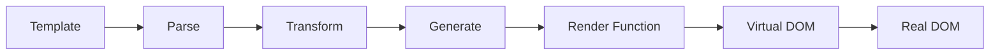

# Vue模板语法与指令系统深度解析

## 一、概述

Vue的模板语法是一套基于HTML的声明式语法，允许开发者将DOM绑定到底层Vue实例的数据。Vue会将模板编译成虚拟DOM渲染函数，结合响应式系统，能够智能地计算出最少需要重新渲染的组件，并把DOM操作次数减到最少。

## 二、核心概念

### 2.1 模板编译原理



Vue模板编译过程：
1. **Parse**: 将模板解析为AST（抽象语法树）
2. **Transform**: 对AST进行转换和优化
3. **Generate**: 生成渲染函数代码
4. **Runtime**: 执行渲染函数生成虚拟DOM

### 2.2 Vue vs React 语法对比

| 特性 | Vue Template | React JSX | 说明 |
|------|-------------|-----------|------|
| 插值 | `{{ data }}` | `{data}` | Vue使用双花括号，React使用单花括号 |
| 属性绑定 | `:prop="value"` | `prop={value}` | Vue需要冒号前缀 |
| 事件绑定 | `@click="handler"` | `onClick={handler}` | Vue使用@符号，React使用驼峰命名 |
| 条件渲染 | `v-if="condition"` | `{condition && <div/>}` | Vue使用指令，React使用JS表达式 |
| 列表渲染 | `v-for="item in list"` | `{list.map(item => <div/>)}` | Vue使用指令，React使用数组方法 |
| 双向绑定 | `v-model="data"` | `value={data} onChange={handler}` | Vue内置双向绑定 |

---

## 三、插值表达式系统

### 3.1 文本插值机制

```vue
<template>
  <!-- 基础插值 -->
  <span>{{ message }}</span>
  
  <!-- 表达式计算 -->
  <span>{{ number + 1 }}</span>
  <span>{{ ok ? 'YES' : 'NO' }}</span>
  <span>{{ message.split('').reverse().join('') }}</span>
  
  <!-- 函数调用 -->
  <span>{{ formatDate(date) }}</span>
  
  <!-- 全局属性访问 -->
  <span>{{ Math.random() }}</span>
</template>
```

**⚠️ 插值限制**：
- 只能包含**单个表达式**
- 不能访问用户定义的全局变量
- 只能访问[全局属性白名单](https://github.com/vuejs/core/blob/main/packages/shared/src/globalsWhitelist.ts)
- 不能使用语句（如 `if`、`for`）

### 3.2 原始HTML渲染

```vue
<template>
  <!-- 安全的文本插值 -->
  <p>{{ rawHtml }}</p>
  
  <!-- 危险的HTML插值 -->
  <p v-html="trustedHtml"></p>
</template>

<script setup>
// 安全实践：HTML内容清理
import DOMPurify from 'dompurify'

const rawHtml = '<script>alert("XSS")</script>'
const trustedHtml = DOMPurify.sanitize(rawHtml)
</script>
```

**🔒 安全考虑**：
- `v-html` 会跳过Vue的安全检查
- 永远不要对用户提供的内容使用 `v-html`
- 使用DOMPurify等库进行HTML清理

---

## 四、v-bind响应式属性绑定

### 4.1 v-bind指令深度解析

```vue
<template>
  <!-- 基础绑定 -->
  
  
  <!-- 动态属性名 -->
  <button :[attributeName]="attributeValue">动态属性</button>
  
  <!-- 绑定对象 -->
  <div v-bind="objectOfAttrs"></div>
  
  <!-- 修饰符 -->
  <div :class.camel="someClass"></div>
</template>

<script setup>
import { ref, reactive } from 'vue'

const imageSrc = ref('/logo.png')
const imageAlt = ref('Logo')
const attributeName = ref('disabled')
const attributeValue = ref(true)

const objectOfAttrs = reactive({
  id: 'container',
  class: 'wrapper'
})
</script>
```

### 4.2 Class绑定策略

```vue
<template>
  <!-- 对象语法：适用于条件类名 -->
  <div :class="{ 
    active: isActive,
    'text-danger': hasError,
    [dynamicClass]: isDynamic
  }"></div>
  
  <!-- 数组语法：适用于多个类名 -->
  <div :class="[activeClass, errorClass]"></div>
  
  <!-- 混合语法：最灵活的方式 -->
  <div :class="[
    { active: isActive },
    errorClass,
    { [dynamicClass]: isDynamic }
  ]"></div>
  
  <!-- 组件上的class会合并 -->
  <my-component class="static-class" :class="dynamicClass" />
</template>
```

### 4.3 Style绑定优化

```vue
<template>
  <!-- 对象语法 -->
  <div :style="{ 
    color: activeColor,
    fontSize: fontSize + 'px',
    '--custom-var': customValue
  }"></div>
  
  <!-- 数组语法 -->
  <div :style="[baseStyles, overridingStyles]"></div>
  
  <!-- CSS变量绑定 -->
  <div :style="{ '--theme-color': themeColor }"></div>
</template>

<script setup>
import { ref, computed } from 'vue'

const activeColor = ref('#42b883')
const fontSize = ref(16)

// 计算属性优化样式对象
const computedStyles = computed(() => ({
  color: activeColor.value,
  fontSize: `${fontSize.value}px`,
  transform: `scale(${scale.value})`
}))
</script>
```

---

## 五、v-on事件处理系统

### 5.1 事件绑定机制

```vue
<template>
  <!-- 方法处理器 -->
  <button @click="handleClick">点击</button>
  
  <!-- 内联处理器 -->
  <button @click="count++">{{ count }}</button>
  
  <!-- 内联调用方法 -->
  <button @click="say('hello')">问候</button>
  
  <!-- 访问事件对象 -->
  <button @click="handleEvent($event)">事件对象</button>
  
  <!-- 多个处理器 -->
  <button @click="one($event), two($event)">多处理器</button>
</template>

<script setup>
const handleClick = (event) => {
  console.log('Button clicked:', event.target)
}

const say = (message) => {
  alert(`Hello ${message}`)
}
</script>
```

### 5.2 事件修饰符详解

```vue
<template>
  <!-- 事件修饰符 -->
  <form @submit.prevent="onSubmit">
    <button @click.stop="doThis">阻止冒泡</button>
    <button @click.prevent="doThat">阻止默认</button>
    <button @click.stop.prevent="doThis">链式修饰符</button>
    <button @click.once="doThis">只触发一次</button>
    <div @scroll.passive="onScroll">被动监听</div>
  </form>
  
  <!-- 按键修饰符 -->
  <input @keyup.enter="submit">
  <input @keyup.page-down="onPageDown">
  
  <!-- 系统修饰符 -->
  <input @keyup.ctrl.67="onCopy">
  <div @click.ctrl="doSomething">Ctrl + 点击</div>
  
  <!-- 精确修饰符 -->
  <button @click.ctrl.exact="onCtrlClick">只有Ctrl</button>
  <button @click.exact="onClick">没有修饰键</button>
  
  <!-- 鼠标按钮修饰符 -->
  <button @click.left="onLeft">左键</button>
  <button @click.right="onRight">右键</button>
  <button @click.middle="onMiddle">中键</button>
</template>
```

**🎯 修饰符使用原则**：
- `.prevent` 和 `.stop` 是最常用的修饰符
- `.passive` 用于提升移动端滚动性能
- `.once` 适用于只需要触发一次的事件
- 系统修饰符可以组合使用

---

## 六、v-if&v-show条件渲染策略

### 6.1 v-if vs v-show 性能分析

```vue
<template>
  <!-- v-if: 条件性渲染 -->
  <expensive-component v-if="showExpensive" />
  
  <!-- v-show: 显示切换 -->
  <simple-component v-show="showSimple" />
  
  <!-- 条件组 -->
  <template v-if="type === 'A'">
    <h1>标题A</h1>
    <p>段落A</p>
  </template>
  <template v-else-if="type === 'B'">
    <h1>标题B</h1>
    <p>段落B</p>
  </template>
  <template v-else>
    <h1>默认标题</h1>
    <p>默认段落</p>
  </template>
</template>
```

**📊 性能对比**：

| 指令 | 初始渲染成本 | 切换成本 | 适用场景 |
|------|-------------|----------|----------|
| `v-if` | 低（惰性） | 高（重新渲染） | 条件很少改变 |
| `v-show` | 高（总是渲染） | 低（CSS切换） | 频繁切换 |

### 6.2 条件渲染最佳实践

```vue
<template>
  <!-- ✅ 使用计算属性简化条件 -->
  <div v-if="shouldShowContent">内容</div>
  
  <!-- ✅ 避免v-if和v-for同时使用 -->
  <template v-for="user in users" :key="user.id">
    <li v-if="user.isActive">{{ user.name }}</li>
  </template>
  
  <!-- ❌ 避免复杂的内联条件 -->
  <!-- <div v-if="user && user.profile && user.profile.settings && user.profile.settings.visible"> -->
</template>

<script setup>
import { computed } from 'vue'

const shouldShowContent = computed(() => {
  return user.value && 
         user.value.profile && 
         user.value.profile.settings?.visible
})
</script>
```

---

## 七、v-for列表渲染优化

### 7.1 v-for指令深度应用

```vue
<template>
  <!-- 数组渲染 -->
  <li v-for="(item, index) in items" :key="item.id">
    {{ index }} - {{ item.name }}
  </li>
  
  <!-- 对象渲染 -->
  <li v-for="(value, name, index) in object" :key="name">
    {{ index }}. {{ name }}: {{ value }}
  </li>
  
  <!-- 数字序列 -->
  <span v-for="n in 10" :key="n">{{ n }}</span>
  
  <!-- 字符串渲染 -->
  <span v-for="char in 'hello'" :key="char">{{ char }}</span>
</template>
```

### 7.2 Key的重要性与选择策略

```vue
<template>
  <!-- ✅ 使用唯一且稳定的key -->
  <div v-for="user in users" :key="user.id">
    <input v-model="user.name">
    {{ user.name }}
  </div>
  
  <!-- ❌ 避免使用index作为key -->
  <!-- <div v-for="(user, index) in users" :key="index"> -->
  
  <!-- ✅ 组合key用于复杂场景 -->
  <div v-for="item in items" :key="`${item.category}-${item.id}`">
    {{ item.name }}
  </div>
</template>
```

**🔑 Key选择原则**：
1. **唯一性**：在同一列表中必须唯一
2. **稳定性**：不应该随渲染而改变
3. **可预测性**：相同数据应该产生相同key
4. **避免index**：除非列表是静态的

### 7.3 列表性能优化技巧

```vue
<template>
  <!-- 虚拟滚动处理大列表 -->
  <virtual-list 
    :items="largeList"
    :item-height="50"
    height="400px"
  >
    <template #default="{ item }">
      <div>{{ item.name }}</div>
    </template>
  </virtual-list>
  
  <!-- 使用v-memo优化重复渲染 -->
  <div v-for="item in list" :key="item.id" v-memo="[item.id, item.selected]">
    {{ item.name }}
  </div>
</template>
```

---

## 八、v-model表单双向绑定

### 8.1 v-model原理与实现

```vue
<!-- v-model语法糖 -->
<input v-model="searchText" />

<!-- 等价于 -->
<input 
  :value="searchText"
  @input="searchText = $event.target.value"
```

### 8.2 不同表单元素的v-model

```vue
<template>
  <!-- 文本输入 -->
  <input v-model="text" type="text" />
  
  <!-- 复选框 -->
  <input v-model="checked" type="checkbox" />
  
  <!-- 单选按钮 -->
  <input v-model="picked" type="radio" value="a" />
  
  <!-- 选择框 -->
  <select v-model="selected">
    <option value="a">A</option>
    <option value="b">B</option>
  </select>
  
  <!-- 多选 -->
  <select v-model="multiSelected" multiple>
    <option value="a">A</option>
    <option value="b">B</option>
  </select>
</template>
```

### 8.3 v-model修饰符

```vue
<template>
  <!-- .lazy: 失焦时同步 -->
  <input v-model.lazy="msg" />
  
  <!-- .number: 自动转数字 -->
  <input v-model.number="age" type="number" />
  
  <!-- .trim: 去除首尾空格 -->
  <input v-model.trim="msg" />
  
  <!-- 组合使用 -->
  <input v-model.lazy.trim="msg" />
</template>
```

### 8.4 自定义组件的v-model

```vue
<!-- 父组件 -->
<custom-input v-model="searchText" />

<!-- 子组件 -->
<script setup>
defineProps(['modelValue'])
defineEmits(['update:modelValue'])
</script>

<template>
  <input 
    :value="modelValue"
    @input="$emit('update:modelValue', $event.target.value)"
  />
</template>
```

---

## 九、指令系统深度解析

### 9.1 内置指令完整列表

| 指令 | 作用 | 语法 | 修饰符 |
|------|------|------|--------|
| `v-text` | 更新元素文本内容 | `v-text="msg"` | 无 |
| `v-html` | 更新元素innerHTML | `v-html="html"` | 无 |
| `v-show` | 切换元素显示 | `v-show="visible"` | 无 |
| `v-if` | 条件渲染 | `v-if="condition"` | 无 |
| `v-else` | else块 | `v-else` | 无 |
| `v-else-if` | else if块 | `v-else-if="condition"` | 无 |
| `v-for` | 列表渲染 | `v-for="item in list"` | 无 |
| `v-on` | 事件监听 | `@click="handler"` | 多种 |
| `v-bind` | 属性绑定 | `:prop="value"` | `.camel`等 |
| `v-model` | 双向绑定 | `v-model="data"` | `.lazy`等 |
| `v-slot` | 插槽 | `#slotName` | 无 |
| `v-pre` | 跳过编译 | `v-pre` | 无 |
| `v-once` | 只渲染一次 | `v-once` | 无 |
| `v-memo` | 缓存渲染结果 | `v-memo="[dep]"` | 无 |


### 9.2 自定义指令

```vue
<script setup>
// 局部指令
const vFocus = {
  mounted: (el) => el.focus()
}

// 带参数的指令
const vColor = {
  mounted(el, binding) {
    el.style.color = binding.value
  },
  updated(el, binding) {
    el.style.color = binding.value
  }
}
</script>

<template>
  <input v-focus />
  <p v-color="'red'">红色文字</p>
</template>
```

---

## 十、 性能优化策略

### 10.1 模板编译优化

```vue
<template>
  <!-- ✅ 静态提升 -->
  <div class="static">静态内容</div>
  
  <!-- ✅ 内联组件props -->
  <child-component :static-prop="'constant'" />
  
  <!-- ✅ 使用v-once缓存昂贵计算 -->
  <expensive-component v-once />
  
  <!-- ✅ 使用v-memo缓存条件渲染 -->
  <div v-memo="[valueA, valueB]">
    {{ expensiveCalculation }}
  </div>
</template>
```

### 10.2 响应式优化

```vue
<script setup>
import { ref, shallowRef, readonly, markRaw } from 'vue'

// ✅ 使用shallowRef减少深度响应
const shallowData = shallowRef({ large: 'object' })

// ✅ 使用readonly防止意外修改
const config = readonly({ api: 'url' })

// ✅ 使用markRaw跳过响应式
const nonReactiveData = markRaw({ 
  chart: new Chart() 
})
</script>
```

---

## 十一、 最佳实践清单

### 11.1 ✅ 推荐做法

1. **使用语义化的指令名称**
2. **合理使用计算属性替代复杂表达式**
3. **为列表项提供稳定的key**
4. **使用事件修饰符简化事件处理**
5. **避免在模板中使用复杂逻辑**
6. **使用v-show进行频繁切换**
7. **使用v-if进行条件性渲染**

### 11.2 ❌ 避免做法

1. **在模板中使用复杂的JavaScript表达式**
2. **使用index作为v-for的key**
3. **在同一元素上同时使用v-if和v-for**
4. **过度使用v-html导致XSS风险**
5. **忽略事件修饰符的性能影响**

---

## 十二、 相关资源

- [Vue 3 模板语法官方文档](https://cn.vuejs.org/guide/essentials/template-syntax.html)
- [Vue 3 响应式原理](https://cn.vuejs.org/guide/extras/reactivity-in-depth.html)
- [Vue 3 编译器优化](https://cn.vuejs.org/guide/extras/rendering-mechanism.html)
- [Vue 3 性能优化指南](https://cn.vuejs.org/guide/best-practices/performance.html)

---

**下一章**: [组件通信机制](./component-communication.md) 