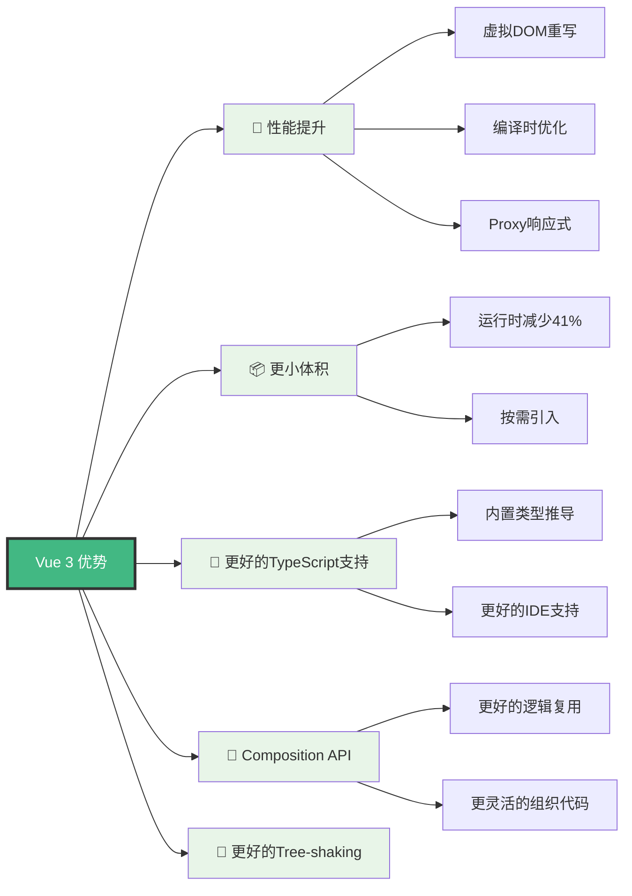
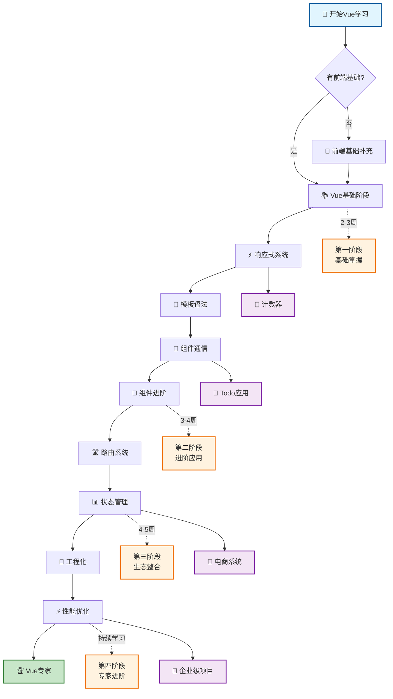
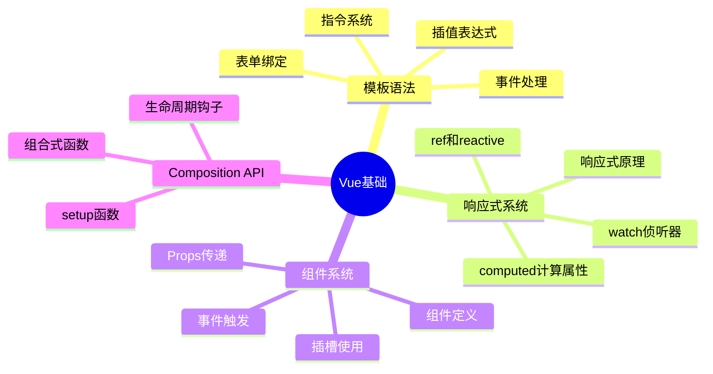
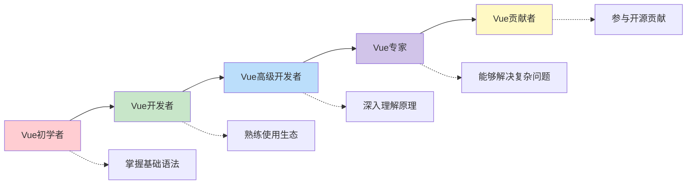

# Vue 3 完整学习指南 🚀

<div align="center">


**现代化、高性能、易上手的渐进式JavaScript框架**

[](https://vuejs.org/)
[](https://www.typescriptlang.org/)
[](https://vitejs.dev/)
[](https://opensource.org/licenses/MIT)

</div>

---

## 📖 目录导航

- [🎯 为什么选择Vue 3](#-为什么选择vue-3)
- [🗺️ 学习路线图](#️-学习路线图)
- [📚 内容结构](#-内容结构)
- [🏗️ 技术栈架构](#️-技术栈架构)
- [🚀 快速开始](#-快速开始)
- [📋 学习进度追踪](#-学习进度追踪)
- [🔗 相关资源](#-相关资源)

---

## 🎯 为什么选择Vue 3

Vue 3 是目前最受欢迎的前端框架之一，它结合了React的组件化思想和Angular的模板语法优势，提供了最佳的开发体验。



### 🌟 核心特性对比

| 特性 | Vue 2 | Vue 3 | 改进说明 |
|------|-------|-------|----------|
| **响应式系统** | Object.defineProperty | Proxy | 更好的性能，支持动态属性 |
| **包大小** | ~34KB | ~20KB | 减少41%，更好的tree-shaking |
| **TypeScript** | 外部支持 | 内置支持 | 完整的类型推导和检查 |
| **Composition API** | ❌ | ✅ | 更好的逻辑组织和复用 |
| **多根节点** | ❌ | ✅ | Fragment支持 |
| **Teleport** | ❌ | ✅ | 跨组件渲染 |
| **Suspense** | ❌ | ✅ | 异步组件处理 |

---

## 🗺️ 学习路线图



---

## 📚 内容结构

我们的Vue学习体系分为四个主要部分，每个部分都有明确的学习目标和实践项目：

### 🎯 [基础篇 - Vue Fundamentals](./basic/index.md)

**学习目标**：掌握Vue的核心概念和基本用法



#### 📖 核心文档

| 文档 | 状态 | 描述 | 学习时长 |
|------|------|------|----------|
| **[模板语法与指令系统](./basic/template.md)** | ✅ 已完成 | 深入理解Vue的模板语法、指令系统和事件处理 | 2-3天 |
| **[响应式系统详解](./basic/reactivity.md)** | ✅ 已完成 | 掌握ref、reactive、computed、watch等核心API | 3-4天 |
| **[组件通信全攻略](./basic/component-communication.md)** | ✅ 已完成 | 全面学习Vue组件间通信的各种方式 | 2-3天 |
| **[Vue基础知识点](./basic.md)** | ✅ 已完成 | Vue基础语法和概念的快速参考 | 1-2天 |

### 🚀 [进阶篇 - Advanced Features](./advanced/index.md)

**学习目标**：掌握Vue的高级特性和最佳实践

#### 📖 进阶内容

| 文档 | 状态 | 描述 | 预计完成 |
|------|------|------|----------|
| **[自定义Hooks](./advanced/hooks.md)** | 🚧 开发中 | 学习创建可复用的组合式函数 | 2024年2月 |
| **[动画与过渡](./advanced/animation.md)** | 🚧 开发中 | 掌握Vue的动画系统和过渡效果 | 2024年2月 |
| **[性能优化](./advanced/performance.md)** | 🚧 开发中 | 学习Vue应用的性能优化技巧 | 2024年3月 |
| **[自定义指令](./advanced/directive.md)** | 📝 规划中 | 创建自定义指令扩展Vue功能 | 2024年3月 |

### 🌐 [生态篇 - Ecosystem](./ecosystem/index.md)

**学习目标**：掌握Vue生态系统的核心工具和库

#### 📖 生态内容

| 文档 | 状态 | 描述 | 预计完成 |
|------|------|------|----------|
| **[Vue Router](./ecosystem/router.md)** | 🚧 开发中 | 掌握Vue官方路由解决方案 | 2024年2月 |
| **[Pinia状态管理](./ecosystem/pinia.md)** | 🚧 开发中 | 学习新一代状态管理库 | 2024年2月 |
| **[构建工具](./ecosystem/build.md)** | 🚧 开发中 | Vite、Webpack等构建工具配置 | 2024年3月 |
| **[开发工具](./ecosystem/devtools.md)** | 🚧 开发中 | Vue DevTools和调试技巧 | 2024年3月 |
| **[UI组件库](./ecosystem/ui.md)** | 🚧 开发中 | Element Plus、Quasar等组件库 | 2024年3月 |
| **[测试](./ecosystem/test.md)** | 🚧 开发中 | Vue应用的单元测试和E2E测试 | 2024年4月 |

### 🔬 [原理篇 - Under the Hood](./principle/index.md)

**学习目标**：深入理解Vue的内部实现原理

#### 📖 原理解析

| 文档 | 状态 | 描述 | 预计完成 |
|------|------|------|----------|
| **[响应式原理](./principle/reactivity.md)** | 🚧 开发中 | 深入理解Proxy响应式实现 | 2024年4月 |
| **[编译原理](./principle/compiler.md)** | 🚧 开发中 | 模板编译和虚拟DOM原理 | 2024年4月 |

---

## 🏗️ 技术栈架构

Vue生态系统提供了完整的解决方案，从开发到部署的每个环节都有对应的工具支持：

```mermaid
graph TB
    subgraph "🎨 表现层"
        Vue[Vue 3.4+]
        Template[模板语法]
        SFC[单文件组件]
        Composition[Composition API]
    end
    
    subgraph "🧠 逻辑层"
        Router[Vue Router 4]
        Pinia[Pinia状态管理]
        Composables[组合式函数]
    end
    
    subgraph "🛠️ 构建层"
        Vite[Vite构建工具]
        TypeScript[TypeScript]
        ESLint[代码检查]
        Prettier[代码格式化]
    end
    
    subgraph "🎭 UI组件层"
        ElementPlus[Element Plus]
        Quasar[Quasar Framework]
        Vuetify[Vuetify]
        AntDesign[Ant Design Vue]
    end
    
    subgraph "🧪 测试层"
        Vitest[Vitest单元测试]
        TestUtils[Vue Test Utils]
        Cypress[Cypress E2E]
        Playwright[Playwright]
    end
    
    subgraph "🚀 部署层"
        Nuxt[Nuxt 3 SSR]
        Netlify[Netlify部署]
        Vercel[Vercel部署]
        Docker[Docker容器化]
    end
    
    Vue --> Template
    Vue --> SFC
    Vue --> Composition
    Vue --> Router
    Vue --> Pinia
    Vue --> Composables
    
    Vite --> Vue
    TypeScript --> Vue
    ElementPlus --> Vue
    Vitest --> Vue
    Nuxt --> Vue
    
    style Vue fill:#42b883,stroke:#333,stroke-width:3px,color:#fff
    style Vite fill:#646cff,stroke:#333,stroke-width:2px,color:#fff
    style TypeScript fill:#3178c6,stroke:#333,stroke-width:2px,color:#fff
    style Pinia fill:#ffd859,stroke:#333,stroke-width:2px
```



---

## 🚀 快速开始

### 💻 环境准备

```bash
# 1. 安装Node.js (推荐16+版本)
node --version
npm --version

# 2. 安装包管理器 (推荐pnpm)
npm install -g pnpm

# 3. 创建Vue项目
npm create vue@latest my-vue-app
cd my-vue-app
pnpm install
pnpm dev
```

### 🎯 第一个Vue应用

```vue
<template>
  <div class="app">
    <h1>{{ title }}</h1>
    <counter />
  </div>
</template>

<script setup lang="ts">
import { ref } from 'vue'
import Counter from './components/Counter.vue'

const title = ref('欢迎学习Vue 3!')
</script>

<style scoped>
.app {
  text-align: center;
  margin-top: 60px;
}
</style>
```

### 📱 推荐开发工具

```json
{
  "recommendations": [
    "Vue.volar",                    // Vue语言支持
    "Vue.vscode-typescript-vue-plugin", // TypeScript支持
    "bradlc.vscode-tailwindcss",   // TailwindCSS支持
    "esbenp.prettier-vscode",      // 代码格式化
    "dbaeumer.vscode-eslint"       // 代码检查
  ]
}
```

---

## 📋 学习进度追踪

### 🎯 基础阶段 (2-3周)

- [ ✅ ] **模板语法** - 掌握插值、指令、事件处理
- [ ] **响应式系统** - 理解ref、reactive、computed、watch
- [ ] **组件基础** - 学会组件定义、Props、Events
- [ ] **组件通信** - 掌握父子、兄弟、跨级通信
- [ ] **生命周期** - 理解组件生命周期钩子
- [ ] **实践项目** - 完成Todo应用

### 🚀 进阶阶段 (3-4周)

- [ ] **Composition API** - 深入学习组合式API
- [ ] **自定义Hooks** - 创建可复用的逻辑
- [ ] **动画过渡** - 掌握Vue动画系统
- [ ] **性能优化** - 学习优化技巧
- [ ] **TypeScript** - 深度整合TypeScript
- [ ] **实践项目** - 完成管理后台

### 🌐 生态阶段 (4-5周)

- [ ] **Vue Router** - 掌握单页应用路由
- [ ] **Pinia** - 学习状态管理
- [ ] **构建工具** - 配置Vite/Webpack
- [ ] **UI组件库** - 使用Element Plus等
- [ ] **测试** - 编写单元测试和E2E测试
- [ ] **实践项目** - 完成电商项目

### 🔬 原理阶段 (持续学习)

- [ ] **响应式原理** - 深入理解Proxy实现
- [ ] **编译原理** - 了解模板编译过程
- [ ] **虚拟DOM** - 理解diff算法
- [ ] **源码阅读** - 阅读Vue核心源码
- [ ] **贡献代码** - 参与开源贡献

---

## 📚 [学习计划详解](./schudle.md)

我们提供了详细的学习计划，包括：

- 📅 **时间安排** - 合理的学习节奏规划
- 🎯 **学习目标** - 每个阶段的具体目标
- 🛠️ **实践项目** - 渐进式的项目练习
- 📖 **学习资源** - 精选的学习材料
- 🤝 **社区支持** - 学习交流和答疑

[查看完整学习计划 →](./schudle.md)

---

## 🔗 相关资源

### 📚 官方资源

- **[Vue 3 官方文档](https://cn.vuejs.org/)** - 最权威的学习资料
- **[Vue 3 API参考](https://cn.vuejs.org/api/)** - 完整的API文档
- **[Vue SFC Playground](https://play.vuejs.org/)** - 在线代码编辑器
- **[Vue DevTools](https://devtools.vuejs.org/)** - 官方调试工具

### 🎥 学习视频

- **[Vue Mastery](https://www.vuemastery.com/)** - Vue核心团队成员授课
- **[Vue School](https://vueschool.io/)** - 系统化视频教程
- **[哔哩哔哩Vue教程](https://search.bilibili.com/all?keyword=Vue3)** - 中文视频资源

### 🛠️ 开发工具

- **[Vite](https://cn.vitejs.dev/)** - 现代化构建工具
- **[Nuxt 3](https://nuxt.com/)** - 全栈Vue框架
- **[Vue CLI](https://cli.vuejs.org/zh/)** - 传统脚手架工具

### 🌟 UI组件库

- **[Element Plus](https://element-plus.org/zh-CN/)** - 桌面端组件库
- **[Quasar](https://quasar.dev/)** - 跨平台组件库
- **[Ant Design Vue](https://antdv.com/)** - 企业级组件库
- **[Vuetify](https://vuetifyjs.com/)** - Material Design组件库

---

## 💡 学习建议

### 🎯 学习方法

1. **理论与实践结合** - 每学一个概念都要动手实践
2. **循序渐进** - 按照学习路线图逐步深入
3. **多做项目** - 通过实际项目巩固知识
4. **参与社区** - 加入Vue社区，与其他开发者交流

### 🔍 遇到问题时

1. **查阅文档** - 首先查看官方文档
2. **搜索社区** - 在Stack Overflow、Vue论坛搜索
3. **查看源码** - 深入理解时可以查看源码
4. **寻求帮助** - 向社区或导师寻求帮助

### 📈 进阶路径



---

## 🤝 贡献指南

我们欢迎任何形式的贡献，包括但不限于：

- 📝 **文档改进** - 修正错误、完善内容
- 💡 **新增内容** - 添加新的学习材料
- 🐛 **问题反馈** - 报告文档中的问题
- 🌟 **功能建议** - 提出改进建议

### 如何贡献

1. Fork本仓库
2. 创建特性分支
3. 提交你的改动
4. 发起Pull Request

---

## 📞 联系我们

- **GitHub Issues**: [提交问题和建议](https://github.com/your-repo/issues)
- **讨论区**: [参与技术讨论](https://github.com/your-repo/discussions)
- **邮箱**: your-email@example.com

---

<div align="center">

**🎉 开始你的Vue学习之旅吧！**

[开始学习基础篇 →](./basic/index.md) | [查看学习计划 →](./schudle.md) | [加入社区讨论 →](https://github.com/vuejs/vue/discussions)

---

*最后更新：2024年1月 | Vue 3.4+ | 持续更新中...*

</div>

