# Vue.js 学习路线图

## 📋 目录

- [学习路线图](#学习路线图)
- [技术栈架构](#技术栈架构)
- [阶段详解](#阶段详解)
- [实践项目](#实践项目)
- [学习资源](#学习资源)
- [社区资源](#社区资源)
- [认证与进阶](#认证与进阶)

## 🗺️ 学习路线图

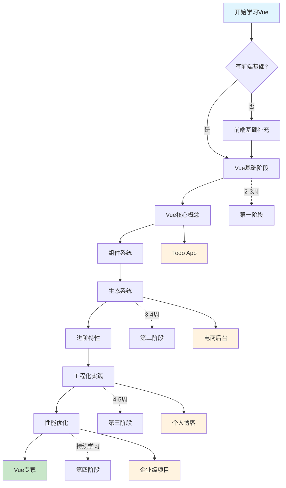

## 🏗️ 技术栈架构

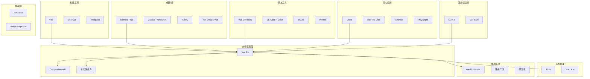

## 📚 阶段详解

### 🎯 第一阶段：Vue基础 (2-3周)

#### 📖 学习目标

- [ ] 理解Vue的核心理念和设计思想
- [ ] 掌握Vue 3的基本语法和API
- [ ] 熟悉单文件组件(SFC)开发模式
- [ ] 理解响应式数据绑定原理

#### 🔑 核心知识点

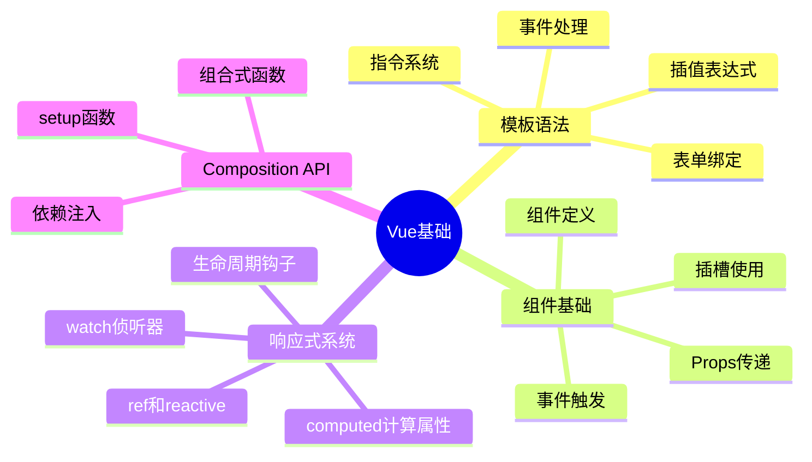

#### 📝 学习计划

| 周次 | 学习内容 | 实践任务 | 完成标准 |
|------|----------|----------|----------|
| 第1周 | 模板语法、指令系统 | 制作表单页面 | 能够熟练使用v-model、v-for、v-if |
| 第2周 | 组件系统、Props/Events | 拆分组件 | 理解父子组件通信 |
| 第3周 | Composition API | 重构为Composition API | 掌握setup、ref、reactive |

#### 🛠️ 里程碑项目：Todo应用

**功能要求：**
- ✅ 添加、删除、编辑待办事项
- ✅ 标记完成状态
- ✅ 筛选功能（全部、已完成、未完成）
- ✅ 本地存储持久化
- ✅ 响应式设计

**技术栈：**
`Vue 3` + `Composition API` + `TypeScript` + `CSS3`

---

### 🚀 第二阶段：生态系统 (3-4周)

#### 📖 学习目标

- [ ] 掌握Vue Router路由管理
- [ ] 学会使用Pinia状态管理
- [ ] 熟悉Vue生态系统工具链
- [ ] 理解组件库的使用和定制

#### 🔑 核心知识点

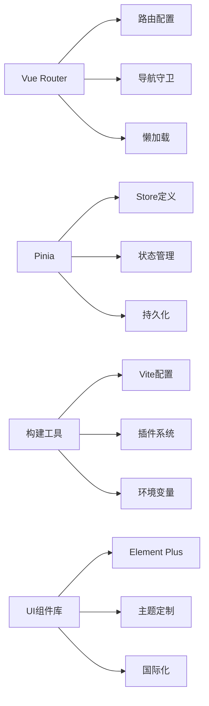

#### 📝 学习计划

| 周次 | 学习内容 | 实践任务 | 完成标准 |
|------|----------|----------|----------|
| 第1周 | Vue Router基础 | 多页面应用 | 掌握路由配置和导航 |
| 第2周 | Pinia状态管理 | 全局状态管理 | 理解状态的组织和共享 |
| 第3周 | 构建工具配置 | 项目工程化 | 会配置开发和生产环境 |
| 第4周 | UI组件库使用 | 界面美化 | 熟练使用组件库开发 |

#### 🛠️ 里程碑项目：电商管理后台

**功能要求：**
- 🔐 用户认证和权限管理
- 📊 数据可视化仪表板
- 📦 商品管理CRUD
- 👥 用户管理系统
- 📱 响应式设计
- 🌐 国际化支持

**技术栈：**
`Vue 3` + `Vue Router 4` + `Pinia` + `Element Plus` + `ECharts` + `Axios`

---

### 🏗️ 第三阶段：工程化实践 (4-5周)

#### 📖 学习目标

- [ ] 掌握大型项目架构设计
- [ ] 学会性能优化技巧
- [ ] 理解测试驱动开发
- [ ] 熟悉CI/CD部署流程

#### 🔑 核心知识点

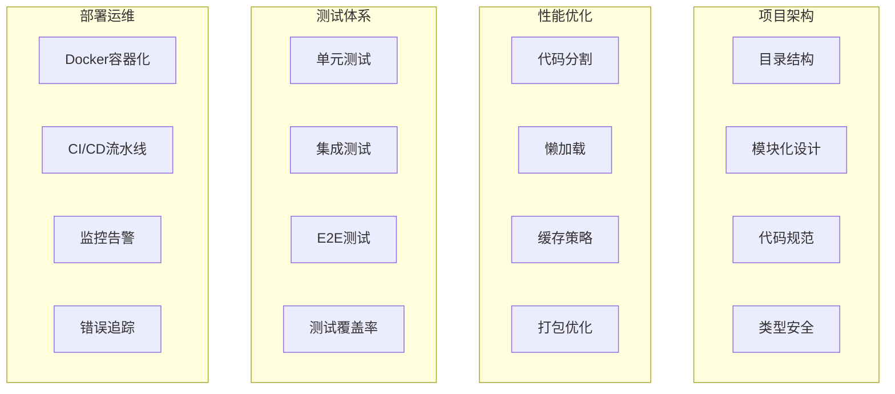

#### 📝 学习计划

| 周次 | 学习内容 | 实践任务 | 完成标准 |
|------|----------|----------|----------|
| 第1周 | 项目架构设计 | 搭建项目脚手架 | 建立可扩展的项目结构 |
| 第2周 | 性能优化实践 | 优化加载性能 | 首屏加载时间<2s |
| 第3周 | 测试驱动开发 | 编写测试用例 | 代码覆盖率>80% |
| 第4周 | 部署和运维 | 自动化部署 | 建立完整的CI/CD流程 |

#### 🛠️ 里程碑项目：个人技术博客

**功能要求：**
- 📝 Markdown编辑器
- 🏷️ 标签和分类系统
- 🔍 全文搜索功能
- 💬 评论系统
- 📈 访问统计
- 🌓 主题切换
- 📱 PWA支持

**技术栈：**
`Vue 3` + `Nuxt 3` + `TypeScript` + `Tailwind CSS` + `Vitest` + `Playwright`

---

### 🎓 第四阶段：高级特性 (持续学习)

#### 📖 学习目标

- [ ] 深入理解Vue源码实现
- [ ] 掌握自定义插件开发
- [ ] 学会跨平台应用开发
- [ ] 成为Vue社区贡献者

#### 🔑 核心知识点

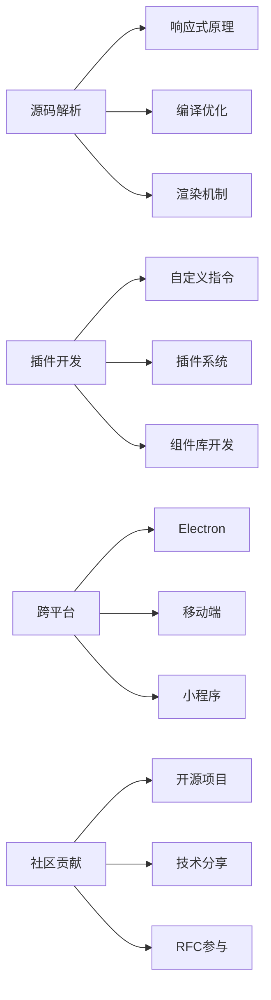

## 🎯 实践项目

### 📱 项目难度分级

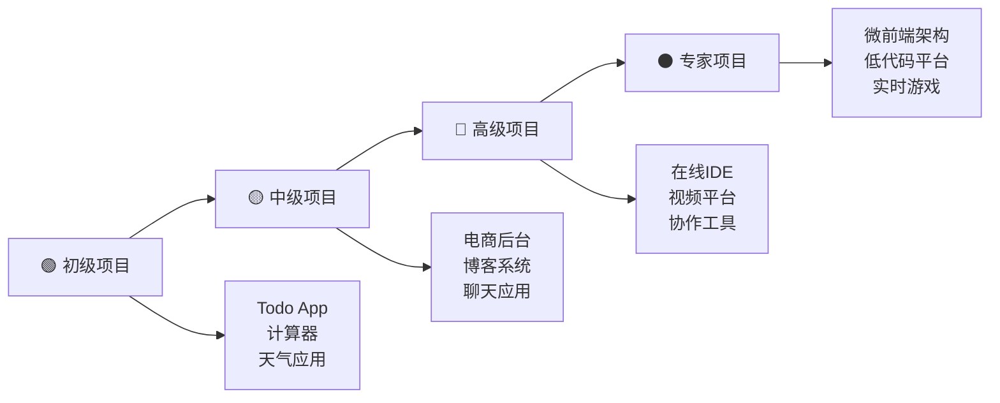

### 📊 项目技能矩阵

| 项目类型 | Vue基础 | 生态系统 | 工程化 | 性能优化 | 推荐时间 |
|----------|---------|----------|--------|----------|----------|
| 🟢 Todo应用 | ⭐⭐⭐ | ⭐ | ⭐ | ⭐ | 1周 |
| 🟡 电商后台 | ⭐⭐⭐ | ⭐⭐⭐ | ⭐⭐ | ⭐⭐ | 3周 |
| 🔴 个人博客 | ⭐⭐⭐ | ⭐⭐⭐ | ⭐⭐⭐ | ⭐⭐⭐ | 4周 |
| ⚫ 企业级应用 | ⭐⭐⭐ | ⭐⭐⭐ | ⭐⭐⭐ | ⭐⭐⭐ | 8周+ |

## 📚 学习资源

### 📖 官方文档

- [Vue 3 官方文档](https://cn.vuejs.org/) - 最权威的学习资源
- [Vue Router 官方文档](https://router.vuejs.org/zh/) - 路由管理
- [Pinia 官方文档](https://pinia.vuejs.org/zh/) - 现代状态管理
- [Vite 官方文档](https://cn.vitejs.dev/) - 下一代构建工具

### 📺 视频教程

- [Vue 3 入门教程](https://www.bilibili.com/video/BV1dS4y1y7vd) - 黑马程序员
- [Vue 3 + TypeScript](https://www.bilibili.com/video/BV14k4y117LL) - 技术胖
- [Vue 3 源码解析](https://www.bilibili.com/video/BV1SZ4y1x7a9) - 崔学社

### 📚 推荐书籍

- **《Vue.js设计与实现》** - 霍春阳 著
- **《深入浅出Vue.js》** - 刘博文 著  
- **《Vue.js实战》** - 梁灏 著

### 🌐 在线课程

- [Vue Mastery](https://www.vuemastery.com/) - 官方认证课程
- [Vue School](https://vueschool.io/) - 专业Vue培训
- [慕课网Vue课程](https://www.imooc.com/course/list?c=vue) - 中文课程

## 🌟 社区资源

### 💬 社区论坛

- [Vue.js 官方论坛](https://forum.vuejs.org/)
- [Vue.js 中文社区](https://vue3js.cn/)
- [掘金 Vue.js 标签](https://juejin.cn/tag/Vue.js)
- [思否 Vue.js 话题](https://segmentfault.com/t/vue.js)

### 🔧 开发工具

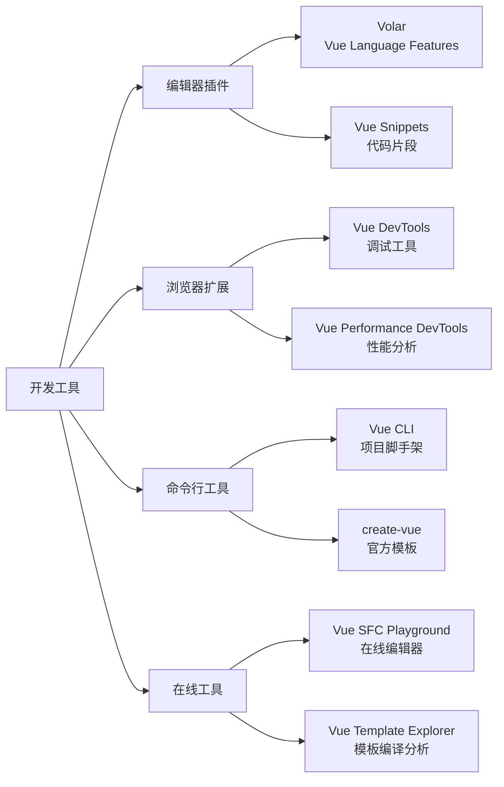

### 👥 核心团队

- **尤雨溪 (Evan You)** - Vue.js 作者 [@yyx990803](https://github.com/yyx990803)
- **Anthony Fu** - Vue/Vite 核心成员 [@antfu](https://github.com/antfu)
- **Eduardo San Martin Morote** - Vue Router 维护者 [@posva](https://github.com/posva)
- **Kia King Ishii** - Vue 核心成员 [@kiaking](https://github.com/kiaking)

### 📦 优秀开源项目

| 项目 | 描述 | Stars | 特点 |
|------|------|-------|------|
| [vue-vben-admin](https://github.com/vbenjs/vue-vben-admin) | 企业级后台管理系统 | ⭐ 20k+ | 功能完整、代码规范 |
| [vue-pure-admin](https://github.com/pure-admin/vue-pure-admin) | 开源后台管理系统 | ⭐ 12k+ | 简洁易用、性能优秀 |
| [naive-ui](https://github.com/tusen-ai/naive-ui) | Vue 3 组件库 | ⭐ 14k+ | TypeScript友好 |
| [varlet](https://github.com/varletjs/varlet) | 移动端组件库 | ⭐ 4k+ | Material Design风格 |

## 🏆 认证与进阶

### 📜 技能认证

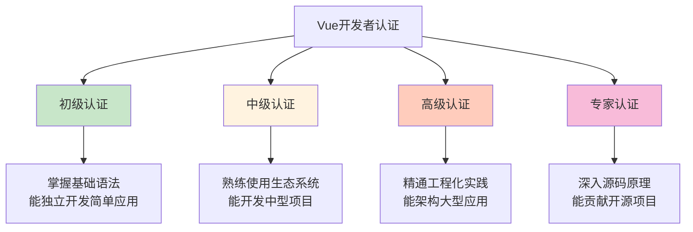

### 🎯 职业发展

| 等级 | 职位 | 技能要求 | 薪资范围* |
|------|------|----------|-----------|
| 🟢 初级 | 前端开发工程师 | Vue基础 + 基本项目经验 | 8-15k |
| 🟡 中级 | 高级前端工程师 | Vue生态系统 + 项目架构能力 | 15-25k |
| 🔴 高级 | 前端架构师 | 工程化实践 + 团队管理 | 25-40k |
| ⚫ 专家 | 技术专家/CTO | 技术深度 + 业务理解 | 40k+ |

*薪资范围仅供参考，实际薪资因地区、公司、个人能力而异

### 🚀 进阶方向

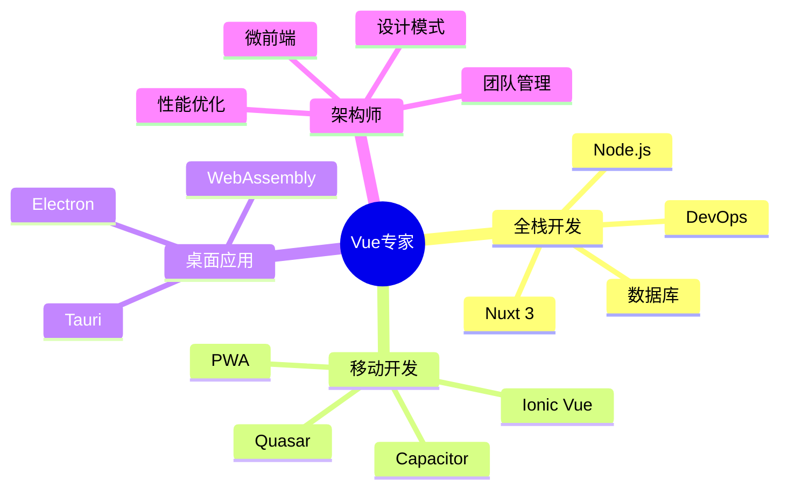

## 📈 学习时间轴

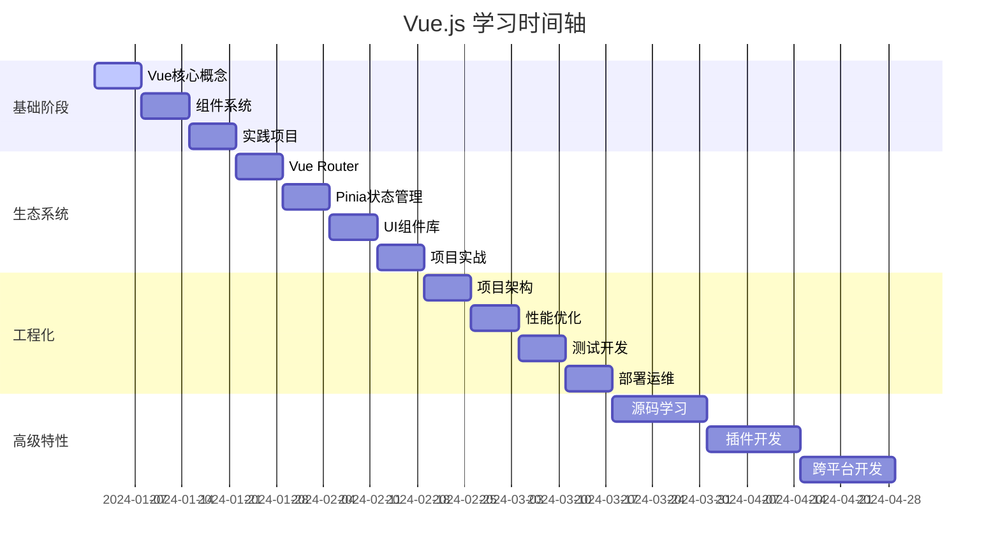

## ⚡ 快速开始

### 🛠️ 环境准备

```bash
# 安装 Node.js (推荐 18+)
node --version

# 安装 Vue CLI
npm install -g @vue/cli

# 或使用 create-vue (推荐)
npm create vue@latest my-vue-app

# 进入项目目录
cd my-vue-app

# 安装依赖
npm install

# 启动开发服务器
npm run dev
```

### 📝 第一个Vue应用

```vue
<template>
  <div class="app">
    <h1>{{ title }}</h1>
    <button @click="count++">
      点击次数: {{ count }}
    </button>
  </div>
</template>

<script setup lang="ts">
import { ref } from 'vue'

const title = ref('我的第一个Vue应用')
const count = ref(0)
</script>

<style scoped>
.app {
  text-align: center;
  padding: 2rem;
}

button {
  background: #42b883;
  color: white;
  border: none;
  padding: 0.5rem 1rem;
  border-radius: 4px;
  cursor: pointer;
}
</style>
```

---

## 📞 联系方式

- 🐛 [提交问题](https://github.com/your-repo/issues)
- 💡 [功能建议](https://github.com/your-repo/discussions)
- 📧 [邮件联系](mailto:your-email@example.com)

---

**⭐ 如果这个学习路线对你有帮助，请给个Star支持！**

**📅 最后更新：2024年**

> 💡 学习建议：保持每日编码习惯，多实践、多思考、多交流。Vue生态系统在不断发展，要持续关注官方动态和社区最佳实践。

