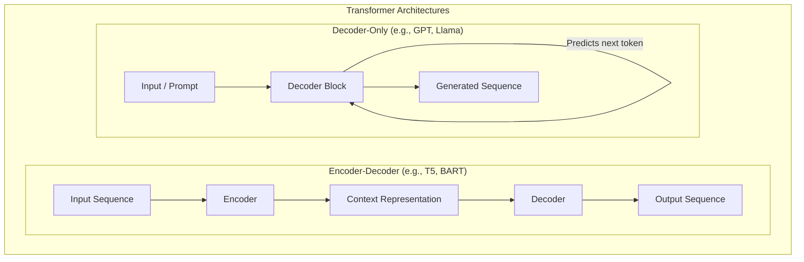
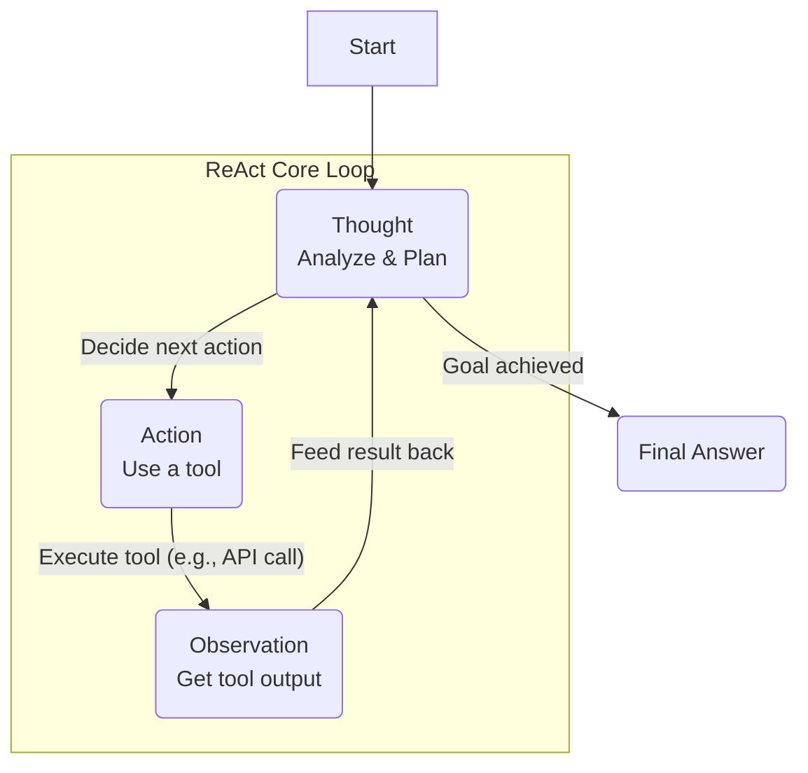
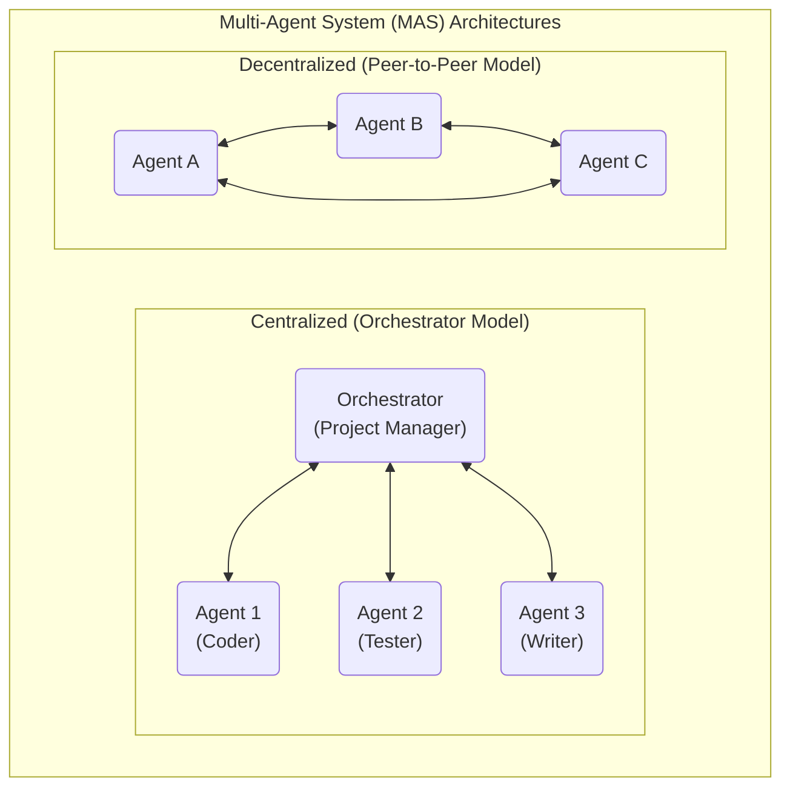
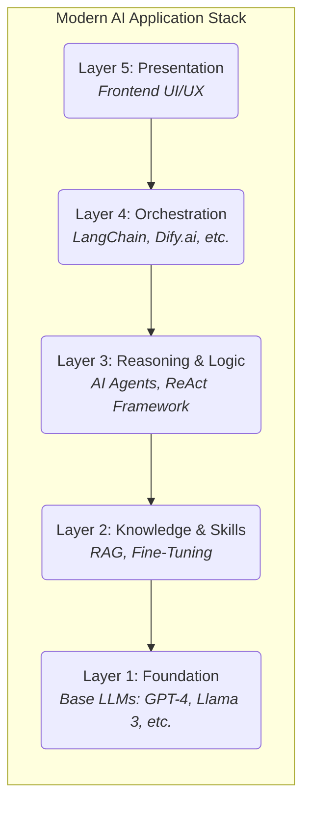

# 面向开发者的现代AI技术栈：从LLM、RAG到智能体（Agent）的全面解析

## 第一部分：奠定基础——理解大语言模型（LLM）

### 第一节：大语言模型（LLM）导论：生成式AI的引擎

在人工智能（AI）的浪潮之巅，大语言模型（Large Language Models, LLM）已成为驱动新一代应用的核心引擎。对于前端开发者而言，理解LLM不仅是拓宽技术视野，更是掌握未来人机交互范式的关键。

#### 定义LLM：新一代的基础模型

大语言模型（LLM）是一种特殊的人工智能，具体来说，它是一种规模极其庞大的深度学习模型 ¹。与传统AI模型不同，LLM属于“基础模型”（Foundation Models）的范畴 ³。这意味着，一个经过海量数据预训练的单一模型，便可以被适配用于执行多种截然不同的任务，例如文本生成、文档摘要、语言翻译乃至代码编写，而无需为每个任务都从头构建一个专门的模型 ⁴。

“大”是LLM最显著的特征。这些模型在包含数十亿网页的Common Crawl数据集和拥有数千万页面的维基百科等TB级文本数据上进行训练 ⁴。其内部结构的复杂性通过“参数”数量来衡量，这些参数是模型在学习过程中调整的权重和偏置，数量可达数十亿甚至数万亿之巨 ⁴。正是这种前所未有的规模，赋予了LLM强大的语言理解和生成能力。

#### 核心技术：剖析Transformer架构

LLM之所以能取得革命性突破，其技术基石是Transformer架构。这一架构的出现，彻底改变了自然语言处理（NLP）领域的游戏规则。

##### 从序列处理到并行计算的飞跃

在Transformer诞生之前，循环神经网络（Recurrent Neural Networks, RNNs）是处理序列数据（如文本）的主流架构。然而，RNN及其变种（如LSTM）必须按顺序逐个处理单词，这种序列化的处理方式不仅限制了计算效率，也使得模型难以捕捉长文本中相距较远的词语之间的依赖关系（即“长程依赖”问题）⁸。

2017年，一篇名为《Attention is All You Need》的论文提出了Transformer架构，它彻底摒弃了循环结构，完全依赖一种名为“注意力”（Attention）的机制进行并行处理 ¹⁰。这种并行化能力极大地缩短了训练时间，使得在互联网规模的数据集上训练超大规模模型成为可能 ⁸。可以说，没有Transformer的并行计算范式，就没有今天我们所知的“大”语言模型。

##### 架构的基本构建块

一个LLM处理文本的流程始于几个关键步骤：

-   **分词（Tokenization）**：首先，输入的文本被分解成更小的单元，称为“词元”（tokens）。这些词元可以是单词，也可以是子词或字符 ³。
-   **嵌入（Embedding）**：接着，每个词元被转换成一个高维的数值向量，即“嵌入向量”。这个向量捕捉了词元的语义信息，使得意义相近的词元在向量空间中的位置也相近 ⁴。
-   **位置编码（Positional Encoding）**：由于Transformer并行处理所有词元，它本身无法感知词语的顺序。为了解决这个问题，需要向嵌入向量中加入“位置编码”信息，这些编码为模型提供了每个词元在原始句子中的位置信息 ⁹。

##### 自注意力机制（Self-Attention Mechanism）

自注意力是Transformer架构的灵魂。它允许模型在处理序列中的每一个词元时，都能同时评估（“关注”）序列中所有其他词元对当前词元的重要性，并据此计算出当前词元的上下文表示 ¹¹。

对于开发者来说，可以将其类比为一个数据库查询过程：

-   **查询（Query）**：假设模型需要理解句子中代词“it”的含义。这个“it”就是查询（Query）。
-   **键（Key）**：为了弄清楚“it”指代什么，模型会用“it”的向量去和句子中所有其他词元（如“the car”、“the dog”）的向量进行比较。这些被比较的词元向量就是键（Keys）。
-   **值（Value）**：每个“键”都关联着一个**值（Value）**向量，它代表了该词元自身的语义内容。

计算过程：模型通过计算查询向量和每个键向量的点积（dot product）来得到一个“注意力分数”，这个分数代表了查询与该键的匹配程度。然后，这些分数经过缩放（scaling）和Softmax函数归一化，形成一组权重。最终，“it”的上下文表示就是所有“值”向量的加权和，权重即为刚刚计算出的注意力分数 ¹¹。

其核心计算公式可以简化为：

```
Attention(Q, K, V) = softmax( (Q * K^T) / sqrt(d_k) ) * V
```

其中，Q、K、V 分别代表查询、键、值的矩阵，d_k 是键向量的维度，用于缩放点积结果 ¹²。

##### 编码器-解码器 vs. 纯解码器架构

最初的Transformer模型包含一个编码器（Encoder）和一个解码器（Decoder）。编码器负责处理输入序列（如一句德语），生成其上下文表示；解码器则利用这个表示并结合已生成的部分，自回归地（auto-regressively）输出目标序列（如翻译成的英语）⁴。这种结构非常适合机器翻译等序列到序列的任务。

然而，许多现代的生成式LLM，如GPT系列，采用的是**纯解码器（Decoder-Only）**架构 ¹³。这种架构是纯粹的自回归模型，即根据所有已经生成的词元来预测下一个最可能的词元。这使得它在执行聊天对话、内容创作等生成性任务时表现得尤为出色 ¹³。



##### 多头注意力与前馈网络

为了让模型能从不同角度理解语言，Transformer在每一层都并行地运行多次自注意力计算，这被称为**多头注意力（Multi-Head Attention）**。每个“头”关注输入序列的不同子空间信息。之后，多头注意力的输出结果会被送入一个简单的**前馈神经网络（Feed-Forward Network, FFN）**进行进一步处理，然后传递给下一层 ¹²。

#### LLM的生命周期与能力

-   **预训练（Pre-training）**：这是LLM生命周期的第一阶段，也是最耗费计算资源的阶段。模型在一个巨大的、无标签的文本语料库上进行“无监督学习”。其目标通常是预测句子中的下一个词或被遮盖的词。通过这个过程，模型学习到通用的语言规律、语法结构、语义关系和广泛的世界知识 ⁶。
-   **微调（Fine-Tuning）**：预训练完成后，基础模型会进入一个“有监督学习”阶段，即微调。在这个阶段，模型会在一个规模较小、带有标签的特定数据集上进行训练，以使其适应特定的任务或风格，例如遵循指令（Instruction-Tuning）⁵。这使得模型从一个通用的语言模型转变为一个能与用户进行有效交互的“指令模型”¹⁷。
-   **涌现的能力（Emergent Abilities）**：当模型规模和数据量达到一定阈值时，LLM会表现出一些未被明确训练、却自然出现的高级能力，这被称为“涌现能力”¹⁷。例如，无需任何示例就能完成任务的“零样本（Zero-shot）”能力，以及通过少量示例学习新任务的“少样本（Few-shot）”或“上下文学习（In-context Learning）”能力 ¹⁷。这表明，大规模训练使模型不仅仅是记忆文本，更是在学习语言、逻辑和推理的底层规律。这些涌现能力是各种高级提示工程技术（如思维链）有效的基础。

#### 核心能力与局限

经过训练，LLM展现出强大的能力，包括知识密集型问答（KI-NLP）、文本分类、代码生成和通用文本创作 ⁴。然而，它们也存在固有的局限性，这些局限性是后续技术发展的核心驱动力：

-   **幻觉（Hallucinations）**：模型可能会“一本正经地胡说八道”，即生成听起来合理但实际上完全错误的信息 ³。
-   **偏见（Bias）**：模型会不可避免地学习并复制其训练数据中存在的社会偏见 ²⁰。
-   **知识截止（Knowledge Cutoff）**：模型的所有知识都来自于其训练数据，因此它的知识是静态的，无法获知训练截止日期之后发生的新事件或信息 ²⁰。

#### 表1：2025年第三季度展望：现代LLM格局

为帮助开发者在项目开始时做出关键的技术选型，下表总结了当前市场上主流LLM的特点。选择哪个模型，通常是构建AI应用的第一步，这取决于性能、成本、上下文窗口大小以及访问方式（开放与否）等多种因素。

| 模型家族             | 开发者         | 主要优势与特点                                                                                 | 典型上下文窗口     | 访问类型         |
| -------------------- | -------------- | ---------------------------------------------------------------------------------------------- | ------------------ | ---------------- |
| **GPT-4o / GPT-5**   | OpenAI         | 强大的推理能力，领先的多模态（文本、视觉、语音）支持，推理速度快，是ChatGPT的引擎 ²²。         | 约128K词元         | 专有API          |
| **Gemini 2.5 Pro**   | Google         | 巨大的上下文窗口（100万+词元），与谷歌生态系统（Workspace、搜索）深度集成，多模态能力强 ⁷。 | 100万 - 200万词元  | 专有API          |
| **Claude 3 / 4**     | Anthropic      | 强调安全与伦理，在长文任务中事实准确性高，擅长摘要和代码生成 ²²。                                | 约200K词元         | 专有API          |
| **Llama 3 / 4**      | Meta           | 领先的开源模型，性价比高，适合自定义部署和学术研究，多语言能力强 ⁷。                         | 约128K词元（可扩展） | 开放权重         |
| **Mistral / Mixtral**| Mistral AI     | 高性能开源模型，常以更小规模超越大模型。采用专家混合（MoE）架构提升效率 ²²。                 | 32K - 65K词元      | 开放权重 / API   |
| **Grok**             | xAI            | 可实时访问X（前Twitter）数据，风格独特，已集成到X平台 ²²。                                      | 约128K词元         | API / 开放权重   |

---

## 第二部分：增强与交互——与LLM协作

### 第二节：检索增强生成（RAG）：赋予LLM外部知识

在理解了LLM的强大能力及其固有局限后，下一个核心问题是如何弥补这些短板。检索增强生成（Retrieval-Augmented Generation, RAG）是一种关键的架构模式，专门用于解决LLM的知识静态和幻觉问题 ²⁶。

#### 问题所在：静态知识与事实幻觉

如前所述，LLM的知识被“冻结”在其训练数据的时间点上，无法获取最新信息 ²⁰。更严重的是，当被问及超出其知识范围的问题时，它们倾向于自信地编造答案，即产生“幻觉”²⁹。RAG正是为了应对这两个核心挑战而设计的。

#### 定义RAG：为LLM打造一个“开放式图书馆”

RAG是一个AI框架，它通过在生成回答之前，从一个外部的、权威的知识库中检索相关信息，来增强LLM的输出 ²⁶。这种方法允许LLM利用最新的、特定领域的或私有的数据，而无需对其进行成本高昂的重新训练 ²⁶。

这种架构的转变，将LLM的角色从一个试图记住所有知识的“万事通”（knower），转变为一个更可靠的“推理与整合者”（synthesizer）。

-   **传统LLM（封闭知识）**：被视为一个封闭的知识黑箱，其回答的准确性完全依赖于其内部的参数化记忆 ³¹。这种模式非常脆弱，一旦知识缺失或过时，就容易导致失败或幻觉 ²⁹。
-   **RAG（开卷考试）**：引入了一种“开卷考试”的模式 ²⁶。外部知识库（如公司的内部文档、实时新闻数据库）成为事实的唯一权威来源（非参数化记忆）³¹。LLM的主要职责不再是回忆事实，而是接收用户问题和一组相关的、经过验证的事实，然后基于这些事实综合出一个流畅、连贯、人类可读的答案。

这种将**知识存储（向量数据库）与推理合成（LLM）**相分离的关注点分离原则，构建了一个更可靠、更可审计的系统架构。

#### 面向开发者的RAG端到端工作流

一个完整的RAG系统包含两个主要阶段：离线索引和在线检索生成。

-   **索引阶段（离线处理）**：这是数据准备阶段，通常在用户查询之前完成。
    1.  **加载数据（Load）**：从各种数据源（如PDF文件、数据库记录、API接口）中摄取原始文档 ²⁶。
    2.  **分块（Chunking）**：将长文档分割成较小的、语义连贯的文本块。这是一个至关重要的步骤，因为分块策略直接影响上下文的完整性和检索效果 ²⁶。
    3.  **嵌入（Embedding）**：使用一个嵌入模型（Embedding Model）将每个文本块转换成一个代表其语义的数值向量 ²⁶。
    4.  **存储（Store）**：将这些嵌入向量及其对应的原始文本块加载到一个专门的**向量数据库（Vector Database）**中进行索引 ²⁶。
-   **检索与生成阶段（在线处理）**：这个阶段在接收到用户查询时实时发生。
    1.  **嵌入查询（Embed Query）**：使用与索引阶段相同的嵌入模型，将用户的查询也转换成一个向量 ²⁶。
    2.  **相似性搜索（Similarity Search）**：系统在向量数据库中进行搜索，以找到与查询向量在向量空间中最“相似”（即距离最近）的文本块向量。为了提高效率，通常使用近似最近邻（Approximate Nearest Neighbor, ANN）等算法 ²⁷。
    3.  **增强提示（Augment Prompt）**：将用户的原始查询与检索到的最相关的文本块（即“上下文”）组合成一个新的、内容更丰富的提示词 ²⁶。
    4.  **生成响应（Generate Response）**：将这个增强后的提示词发送给LLM。LLM随后会基于所提供的上下文信息生成一个有事实依据的回答 ²⁸。

```mermaid
graph TD
    subgraph "Phase 1: Offline Indexing (Data Preparation)"
        direction LR
        A[Data Sources<br>(PDFs, APIs, DBs)] --> B(Load Docs)
        B --> C(Chunk into<br>smaller pieces)
        C --> D(Embed into<br>Vectors)
        D --> E[(Vector Database<br>with Text)]
    end

    subgraph "Phase 2: Online Retrieval & Generation (Real-time)"
        direction TD
        F[User Query] --> G(Embed Query)
        G --> H{Similarity Search}
        E --> H
        H --> I[Retrieved<br>Context]
        F --> J(Augment Prompt)
        I --> J
        J --> K(LLM Generates<br>Answer)
        K --> L[Final Response]
    end
```

#### 向量数据库的角色

向量数据库是RAG系统的核心技术之一。它与传统的关系型数据库（如SQL）截然不同，后者擅长基于精确的关键词进行匹配。向量数据库则专门为存储和高效查询高维向量而设计，它能够根据语义相似度（即向量间的几何距离）而非文本匹配来查找信息 ³⁰。正是这种能力，使得RAG系统中的“检索”步骤既快速又有效。

#### 高级RAG概念

随着技术的发展，RAG已经从最初的“朴素RAG”（Naive RAG）演进为更复杂的“高级RAG”（Advanced RAG）和“模块化RAG”（Modular RAG）²⁸。这些高级技术旨在优化检索质量，因为整个RAG系统的性能瓶颈在于检索步骤的优劣——如果检索到的上下文不相关或不完整，即便是最强大的LLM也无法生成正确的答案。因此，对于开发者而言，大部分的工程努力应集中在数据处理和检索逻辑上，而不仅仅是最后的LLM调用。

高级技术包括：

-   **混合搜索（Hybrid Search）**：结合向量搜索的语义理解能力和传统关键词搜索的精确匹配能力，以应对向量搜索可能遗漏特定术语的情况 ³⁰。
-   **重排序（Re-ranking）**：在初步检索后，使用一个更精细的模型对检索到的文档进行重新排序，将最相关的结果排在前面，以提高最终答案的质量 ²⁸。

#### 表2：RAG vs. 微调：开发者的决策矩阵

当需要让LLM掌握特定领域的知识或技能时，开发者通常面临一个关键的架构选择：使用RAG还是微调（Fine-Tuning）。这两者并非相互替代，而是解决不同问题的工具。下表提供了一个实用的决策指南，帮助开发者根据具体目标做出选择。

| 维度           | 检索增强生成 (RAG)                                                                 | 微调 (Fine-Tuning)                                                                | 混合方法                                                                                 |
| -------------- | ---------------------------------------------------------------------------------- | --------------------------------------------------------------------------------- | ---------------------------------------------------------------------------------------- |
| **主要目标**   | 在查询时向模型注入最新的或外部的知识 ³⁶。                                          | 调整模型的核心行为、风格或技能，使其适应特定领域的范式 ³⁶。                       | 教会模型特定领域的风格和术语（微调），然后赋予其访问实时知识的能力（RAG）³⁶。              |
| **数据需求**   | 动态数据，可实时更新，支持结构化或非结构化数据 ³⁹。                                | 静态的、高质量的、包含数千个示例的提示-回答对策划数据集 ³⁸。                        | 需要策划好的微调数据集和动态的知识库 ³⁶。                                                |
| **成本与资源** | 前期计算成本较低，但运行时因检索步骤会产生额外成本和延迟 ³⁸。                      | 前期训练的计算成本极高，但运行时成本和延迟较低 ³⁷。                                 | 成本最高，结合了微调的前期成本和RAG的运行时成本 ³⁸。                                       |
| **技术栈**     | 需要数据管道、向量数据库和搜索算法等方面的技能 ³⁶。                                | 需要深度学习和NLP专业知识，用于数据准备、模型训练和评估 ³⁷。                        | 需要同时具备以上两个领域的技术专长 ³⁸。                                                  |
| **幻觉风险**   | 较低。回答基于检索到的事实，并可以提供来源引用 ³⁶。                                | 能减少领域内的幻觉，但如果知识未在其参数中，仍可能编造事实 ³⁶。                     | 两者兼顾：既能理解领域术语，又能基于事实回答 ³⁶。                                        |
| **知识时效性** | 高。可以访问实时信息 ³⁹。                                                          | 低。知识在最后一次微调时被固化 ³⁹。                                                 | 高。经过微调的模型可以通过RAG组件访问实时数据 ³⁸。                                         |
| **适用场景**   | 需要基于私有文档回答问题、提供最新信息或确保事实准确性的场景 ³⁶。                  | 需要改变模型的语气风格、遵循特定格式或理解小众术语/缩写的场景 ³⁶。                  | 需要一个真正的领域专家，如一个能理解临床语言（微调）并能检索最新药物相互作用数据（RAG）的医疗聊天机器人 ³⁶。 |

---

### 第三节：提示工程（PE）：指令的艺术与科学

如果说RAG和微调是从外部增强LLM，那么提示工程（Prompt Engineering, PE）则是从内部引导LLM，是与预训练模型交互和控制其行为的主要手段 ⁵。它是一门通过精心设计输入（即“提示”）来有效、可靠地引导LLM输出的技术。

#### 基于示例的提示：上下文学习

-   **零样本提示（Zero-Shot Prompting）**：这是最简单的提示形式。开发者直接给模型下达一个指令，不提供任何示例。这种方式完全依赖模型在预训练阶段学到的指令遵循能力 ¹⁹。
    -   *示例*：“将以下文本分类为正面、负面或中性：‘我觉得这部电影还行。’”
-   **少样本提示（Few-Shot Prompting）**：在这种模式下，开发者在提出新任务之前，会向模型提供一个或多个（即“shots”）任务示例。这些示例帮助模型理解任务的具体要求、期望的输出格式以及其中的细微差别 ⁴¹。这个过程被称为“上下文学习”（In-context Learning），因为模型是在单个提示的上下文中从示例中学习的 ⁴¹。
    -   *示例*：“文本：‘这太棒了！’ -> 正面。 文本：‘这太糟糕了。’ -> 负面。 文本：‘我觉得这部电影还行。’ -> ？”

这种基于示例的提示方式，可以被视为一种对LLM的“运行时编程”。在传统编程中，开发者通过`if/else`语句和循环来定义显式逻辑。而在与LLM交互时，开发者通过提供结构化的示例来隐式地“编程”。这些示例的格式、顺序和内容，就像传统代码的语法和逻辑一样，深刻地影响着模型的最终表现 ⁴²。因此，提示工程不仅是遣词造句，更是一种信息结构化的艺术。

#### 高级推理：思维链（CoT）提示

-   **标准提示的局限**：对于需要多步推理的复杂问题（如数学应用题），标准提示往往会失败，因为模型试图一步到位地给出答案，从而容易出现逻辑错误 ⁴²。
-   **思维链（Chain-of-Thought, CoT）的引入**：CoT是一种旨在激发LLM推理能力的提示技术。它鼓励模型在给出最终答案之前，先将解决问题的过程分解成一系列中间的推理步骤 ⁴³。
    -   **少样本CoT**：开发者提供一些包含详细解题步骤的示例。这向模型展示了应该如何思考和分解问题。
        -   *示例*：“问：Leah有32块巧克力，她姐姐有42块。如果她们吃了35块，总共还剩多少块？ 答：Leah原来有32块巧克力，她姐姐有42块。所以她们总共有 32 + 42 = 74块。吃了35块后，她们还剩下 74 - 35 = 39块。答案是39。”
    -   **零样本CoT**：这是一种极其简单却非常有效的技术。开发者只需在复杂问题的提示末尾加上一句神奇的话，如“让我们一步一步地思考”（Let's think step by step）。这就能在没有示例的情况下，触发模型潜在的、分步推理的能力 ⁴³。

CoT之所以有效，是因为它将模型内部不可见的、脆弱的计算过程“外部化”了。当模型被要求一步步思考时，它会把每一步的推理结果写下来，作为下一步推理的上下文。这相当于给了模型一个“草稿纸”和更多的“思考时间”，减轻了它一次性解决整个问题的认知负担 ⁴⁴。这种外部化的推理过程不仅更容易得到正确答案，而且对开发者来说是透明和可调试的，这与一个完全黑箱的回答相比是巨大的优势 ⁴⁵。

---

## 第三部分：构建自主系统——AI智能体与助手

### 第四节：AI智能体的崛起

随着LLM能力的增强，我们正在从简单的问答式交互，迈向更高级的自主系统——AI智能体（AI Agent）。

#### 定义AI智能体：超越聊天机器人

AI智能体不仅仅是一个聊天机器人。它是一个能够感知其环境、进行推理以做出决策，并采取行动以实现特定目标的自主系统 ⁴⁵。在这个系统中，LLM扮演着“大脑”或推理引擎的角色，负责规划和决策 ⁴⁵。

#### ReAct框架：融合推理与行动

ReAct（Reason + Act）是一个强大的框架，它将思维链（CoT）的推理能力与采取行动的能力有机地结合起来 ⁴⁸。它允许智能体与外部工具（如API、数据库、搜索引擎）进行交互，以获取其内部知识所不具备的信息或执行特定操作 ⁵⁰。

ReAct框架是使智能体“工具使用”变得实用和可靠的关键架构模式。虽然可以直接提示LLM“使用工具”，但这种方式往往不可靠，模型可能会幻觉出工具的输出或错误地使用它。ReAct通过形式化的思考-行动-观察循环为工具使用提供了必要的结构 ⁴⁷。

##### 核心循环（The Core Loop）
智能体在一个迭代循环中运作：

1.  **思考（Thought）**：智能体首先对任务进行推理，分析当前状态，并决定下一步的逻辑行动。（例如：“我需要查找比特币的当前价格。”）⁴⁵。
2.  **行动（Action）**：智能体选择一个合适的工具并执行一个动作。（例如：`Action: SearchAPI("current price of Bitcoin")`）⁴⁷。
3.  **观察（Observation）**：智能体接收并记录来自工具的输出结果。（例如：“Observation: The price is $70,000.”）⁴⁵。

这个循环不断重复，每一次的“观察”结果都会成为下一次“思考”的输入。这使得智能体能够根据外部世界的真实反馈动态地调整其计划、处理异常情况，并最终解决复杂问题 ⁴⁸。这个明确的循环过程使智能体的行为变得可追溯、可调试，这对于构建生产级系统至关重要。



#### 超越单一智能体：“专家智能体”与多智能体系统（MAS）

当任务的复杂性超出单个智能体的处理能力时，多智能体系统（Multi-Agent System, MAS）应运而生。MAS由多个专职的AI智能体组成，它们相互协作，共同解决一个宏大的问题 ⁵⁴。这种模式可以看作是软件工程中“关注点分离”原则在AI领域的应用 ⁵⁴。

随着任务复杂度的增加，试图让一个智能体掌握所有技能（规划、编码、研究、写作等）的单一提示会变得异常冗长和脆弱。MAS通过将复杂任务分解为多个更简单的子任务，并分配给专职智能体来解决这一问题。

-   **类比：AI软件开发团队**：一个形象的类比是组建一个AI软件开发团队 ⁵⁴。你可以设计一个“产品经理”智能体，负责分解用户需求；一个“软件工程师”智能体，负责编写代码；一个“QA工程师”智能体，负责测试代码；以及一个“项目经理”或“协调者”（Orchestrator）智能体，负责协调所有成员的工作 ⁵⁴。
-   **优势**：这种分工协作的模式带来了专业化、可扩展性和鲁棒性。每个智能体只需关注自己的领域，其提示和工具集也更简单，从而提高了整体的可靠性 ⁴⁶。
-   **架构**：MAS中的智能体可以通过不同的架构进行协作，主要分为中心化（由一个协调者统一调度）和去中心化（智能体之间点对点通信）两种模式 ⁴⁶。

工程挑战也从设计一个完美的、庞大的单一提示，转变为设计这些专业智能体之间的通信协议和工作流程。这是一种更具可扩展性和可维护性的构建复杂自主系统的方法，正如CrewAI等框架所展示的那样 ⁵⁸。



---

### 第五节：从理论到实践：AI助手与智能体RAG

#### 综合以上概念，现代AI助手（AI Assistant）已不再是简单的问答机器人。它是一个主动的、能够使用工具的AI智能体，旨在为用户完成具体、复杂的任务 ⁴⁶。

#### RAG的演进：智能体RAG（Agentic RAG）

Agentic RAG代表了从静态数据管道到动态、由推理驱动的信息寻求的范式转变。

-   **标准RAG**：是一个固定的、线性的流水线：查询 -> 检索 -> 生成 ⁵⁹。它是被动的，无法根据情况调整其检索策略。
-   **智能体RAG（Agentic RAG）**：是一个动态的、智能的过程。在这个模式下，智能体是主导者，它将RAG流程本身视为其可用的工具之一 ⁵⁹。

Agentic RAG将智能“上移”到了检索过程本身 ⁶⁰。智能体利用LLM的推理能力来驱动检索。它可以形成一个假设，然后去寻找信息来验证这个假设，并根据找到的内容调整其后续计划。这比简单的数据库查找更接近于人类的研究过程。

##### 关键区别

一个Agentic RAG系统能够：

-   **先推理后检索**：它可以分解一个复杂的问题，并决定应该搜索什么。
-   **迭代和优化**：如果第一次检索的结果不理想，它可以分析失败的原因，并尝试用不同的查询或从不同的数据源进行搜索 ⁶⁰。
-   **使用多源信息**：它可以先查询一个内部文档数据库，再去调用一个Web API，最后综合所有结果 ⁵⁹。
-   **决定不检索**：如果用户的问题只是闲聊，它可以判断出无需调用外部知识。

#### 何时使用RAG vs. 智能体

这是一个开发者在架构设计时需要做出的重要决策：

-   **使用标准RAG系统**：当任务是直接的问答，且知识源是单一、已知的知识库时。用户交互通常是单轮的（一个问题，一个答案）⁶¹。
-   **使用智能体（以RAG为工具）**：当任务是复杂的、多步骤的，需要与多个工具或数据源交互，或者需要根据中间结果动态调整策略时 ³⁵。

---

## 第四部分：开发者的工具箱——框架与平台

### 第六节：代码优先框架：LangChain与LlamaIndex

对于希望获得最大控制力和灵活性的开发者来说，LangChain和LlamaIndex是构建LLM应用时两个占主导地位的开源框架 ⁶²。

#### LangChain：通用的编排框架

-   **核心理念**：LangChain的目标是提供一个灵活的、模块化的框架，用于将LLM调用与其他组件“链接”（chain）起来，以创建复杂的应用程序 ⁶⁴。它擅长于管理应用的逻辑、流程和工具使用。
-   **核心组件** ⁶⁴：
    -   **模型（Models）**：为所有LLM提供标准化的接口。
    -   **提示（Prompts）**：用于构建和管理提示模板的工具。
    -   **链（Chains）**：将多个调用串联起来的核心概念。
    -   **智能体（Agents）**：ReAct框架的预构建实现，允许LLM自主选择使用哪些工具。
    -   **记忆（Memory）**：在对话中持久化状态的组件。
    -   **索引/检索器（Indexes/Retrievers）**：连接和查询外部数据的功能模块（即其RAG能力）。

#### LlamaIndex：以数据为中心的RAG框架

-   **核心理念**：LlamaIndex（前身为GPT Index）是专门为构建最佳RAG应用而设计的。其核心关注点是数据管道：高效、准确地摄取、索引和查询你的私有数据 ⁶⁸。
-   **核心组件** ⁶⁸：
    -   **数据连接器（Loaders）**：一个庞大的库，支持从超过160种数据源加载数据。
    -   **索引（Indexes）**：为高效检索而设计的先进数据结构（如向量索引、关键词索引、树索引等）。
    -   **检索器（Retrievers）**：从索引中检索相关上下文的复杂算法。
    -   **查询引擎（Query Engines）**：将检索器与LLM结合起来执行RAG的高级接口。
    -   **智能体（Agents）**：LlamaIndex也提供智能体，可以智能地将其强大的查询引擎作为工具来使用。

#### 协同工作：两者结合使用

LangChain和LlamaIndex并非“二选一”的关系，它们经常被结合使用。一个常见的模式是：使用LlamaIndex为一个复杂的数据集构建一个高度优化的查询引擎，然后将这个查询引擎作为一个“工具”集成到一个更宏大的LangChain智能体中，由该智能体负责编排多个不同的任务 ⁶²。

这两个框架的核心哲学差异在于“应用逻辑”与“数据逻辑”。

-   **LangChain**始于“我如何构建一个能完成X、Y、Z任务的应用？”这一问题，其抽象（链、智能体）旨在编排应用逻辑 ⁶⁶。
-   **LlamaIndex**始于“我如何最好地表示和查询我的数据？”这一问题，其抽象（索引、检索器）旨在优化数据逻辑 ⁶⁸。

因此，当核心挑战是工作流程的复杂性时，应首选LangChain；当核心挑战是数据的复杂性时，应首选LlamaIndex。

#### 表3：LangChain vs. LlamaIndex——实用对比

下表为开发者在选择主要工具或决定如何组合它们时提供了清晰的指导。

| 维度               | LangChain                                                                            | LlamaIndex                                                                             |
| ------------------ | ------------------------------------------------------------------------------------ | -------------------------------------------------------------------------------------- |
| **主要目的**       | 一个用于编排复杂LLM工作流和构建智能体的通用框架 ⁶²。                                 | 一个专门用于构建和优化检索增强生成（RAG）管道的框架 ⁶²。                                 |
| **核心抽象**       | 链（Chains）和智能体（Agents）：代表行动序列和决策循环 ⁶⁴。                             | 数据索引（Indexes）和查询引擎（Query Engines）：用于存储和检索数据的数据结构 ⁶⁸。       |
| **核心优势**       | 灵活性与编排能力：轻松连接多个工具、API和模型，实现复杂的多步逻辑 ⁶²。                 | 检索性能与数据处理：拥有最先进的算法，用于索引和查询海量、多样化的数据集 ⁷⁰。          |
| **理想用例**       | 复杂的聊天机器人、拥有多种工具的AI助手、自动化业务流程、多步骤数据分析 ⁶²。            | 文档问答、企业级搜索、构建知识库，以及任何以查询私有数据为核心的应用 ⁶⁸。              |
| **RAG实现**        | 在其更广泛的工具集中提供了RAG组件，适合通用场景 ⁷³。                                 | 整个架构都为高级、高性能的RAG进行了优化，这是其专长 ⁶⁹。                                 |
| **上下文保持**     | 非常出色。提供了强大的“记忆”（Memory）模块来维护对话历史 ⁶⁶。                        | 更侧重于单轮检索，尽管也具备上下文能力，但不是其核心特性 ⁷⁵。                          |

---

### 第七节：低代码平台：深入了解Dify.ai

在代码优先框架之外，另一股强大的趋势是低代码/无代码的LLM操作（LLMOps）平台，它们旨在简化AI应用的整个生命周期 ⁷⁷。Dify.ai是这一领域的杰出代表。

#### Dify.ai简介

Dify是一个开源的、模型无关的平台，它将后端即服务（BaaS）和LLMOps结合在一起，旨在让AI应用开发变得大众化 ⁷⁸。

Dify实际上是将代码优先世界中常见的架构模式进行了产品化。LangChain和LlamaIndex等框架确立了构建LLM应用的主流模式：链、智能体和RAG管道。从零开始构建这些需要大量的编码和基础设施设置。Dify则将这些概念封装到一个可视化的、受管理平台中。它的“工作流”就是一个可视化的LangChain，“知识库”就是一个托管的LlamaIndex，“智能体工作室”就是一个用于ReAct模式的UI ⁷⁹。这意味着Dify并非在发明新的AI应用构建方式，而是在现有成熟模式之上创建了一个更高级的抽象层。

#### 面向开发者的核心功能

-   **可视化工作流构建器**：通过拖放界面来创建复杂的应用逻辑，直观地表示了在LangChain中需要用代码实现的“链”⁷⁹。
-   **集成的RAG引擎**：提供友好的用户界面来创建和管理知识库。用户只需上传文档，Dify会自动处理分块、嵌入和检索等后台工作 ⁸⁰。
-   **智能体工作室**：通过UI定义AI智能体的提示、可用工具和行为模式 ⁷⁷。
-   **可观测性与管理**：内置API调用日志、数据标注和API密钥管理等功能，便于应用的监控和持续改进 ⁸⁴。
-   **灵活部署**：提供云托管版本和可私有化部署的开源版本，满足不同需求 ⁷⁹。

#### Dify vs. 代码优先框架

Dify与LangChain等框架的关系并非竞争，而是不同开发范式的选择：**速度与易用性（Dify） vs. 控制与定制化（LangChain/LlamaIndex）**⁷⁷。

Dify非常适合快速原型验证、不希望管理复杂后端的前端开发者，以及技术背景混合的团队 ⁷⁸。对于前端开发者而言，Dify可以充当一个由其自己控制的“AI后端”。开发者可以在Dify的可视化界面中设计整个AI逻辑，然后Dify会将这个复杂的工作流打包成一个简单的API端点 ⁸⁵。前端开发者可以在他们的React或Vue应用中像调用任何其他REST API一样调用这个端点，而无需关心底层的复杂性。这极大地降低了前端开发者构建和部署全栈AI应用的门槛。

---

## 第五部分：总结与未来展望

### 第八节：整合概念与你的前进之路

本报告系统地介绍了从底层模型到上层应用框架的现代AI技术栈。这些概念并非孤立存在，而是相互关联、层层递进的。

#### 现代AI应用技术栈

一个典型的现代AI应用可以被看作一个分层结构：

1.  **第一层（基础层）**：基础LLM（如GPT-4, Llama 3），提供核心的语言能力。
2.  **第二层（知识与技能层）**：增强层，通过RAG注入外部知识，或通过微调教授特定技能。
3.  **第三层（推理与逻辑层）**：智能体层，通过ReAct等框架编排模型的行为，使其能够规划和使用工具。
4.  **第四层（编排层）**：实现层，使用代码优先框架（如LangChain, LlamaIndex）或低代码平台（如Dify）来构建和管理应用逻辑。
5.  **第五层（表示层）**：前端界面，由开发者构建，负责与用户进行交互。



未来的AI开发趋势将是高度模块化和组合化的。最强大的解决方案往往不是单一的、庞大的系统，而是由多个专职的、可互操作的模块组合而成。这体现在RAG与微调的结合、LangChain与LlamaIndex的协同，以及多智能体系统的设计理念中。对于开发者而言，关键在于培养一种组合式思维：工作不再是寻找一个完美的万能工具，而是学会如何从这个丰富的生态系统中选择并组合正确的模块来解决具体问题。

#### 前端开发者在AI时代的角色

前端开发者的角色正在发生深刻的演变。你不再仅仅是消费来自API的静态数据，而是在设计与一个动态的、会推理的智能体进行交互的用户体验。这带来了新的挑战和机遇，例如：如何实时地向用户展示智能体的“思考过程”以增强信任感，如何管理复杂的对话状态，甚至如何利用AI来辅助生成UI组件本身 ⁸⁷。

#### 一条切实可行的学习路径

对于希望进入这一领域的前端开发者，以下是一条建议的学习路径：

1.  **从平台开始实验**：利用Dify的免费套餐 ⁸⁶。通过上传几个文档，构建一个简单的RAG聊天机器人。这将让你在不写一行后端代码的情况下，亲身体验知识库、提示和模型如何协同工作。
2.  **转向代码框架**：当理解了核心概念后，在本地环境中安装LangChain或LlamaIndex。跟随官方教程，构建一个使用搜索引擎API作为工具的简单ReAct智能体。这将让你掌握代码层面的实现。
3.  **与你的前端集成**：将你在Dify上创建的应用API，或用LangChain构建的智能体后端，与你熟悉的React/Vue等前端框架集成。这将把你已有的技能与AI世界连接起来。
4.  **探索前沿**：持续关注新兴趋势，如多智能体系统、Agentic RAG以及AI原生的UI/UX设计模式 ⁸⁷，为下一波技术浪潮做好准备。
