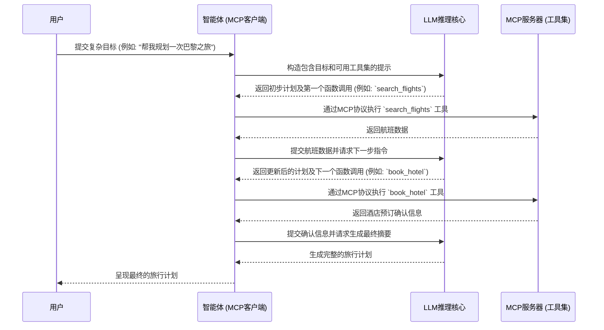
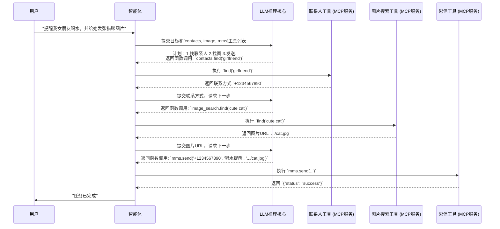

# 现代AI驱动应用的架构解析：Agent、Prompt、MCP与Function Calling

在现代人工智能领域，大型语言模型（LLM）已从单纯的文本生成器，演变为能够执行复杂推理的精密引擎。这一演进催生了一种全新的架构范式，其核心是**AI Agent（AI 智能体）**——一种能够自主执行复杂、多步骤任务的系统。本文将深入探讨构成此架构的核心组件：提示（Prompts）、函数调用（Function Calling）、智能体（Agents）以及多智能体通信协议（MCP）。

## 核心概念深度解析

### 1. 提示（Prompts）：人机交互的指令接口

提示是指导LLM执行任务的主要机制。它是一种结构化的文本输入，旨在引导模型产生特定且受约束的响应。提示的质量直接决定了输出的质量，这一领域被称为**提示工程（Prompt Engineering）**。

-   **系统提示（System Prompt）**: 此提示为AI模型设定了上下文、约束条件和“角色性格”。它通常由开发者定义，并在用户的整个会话周期内保持不变。它建立了操作的边界，例如：“你是一个专注于软件开发的得力助手”或“你必须仅以合法的JSON格式进行回应”。
-   **用户提示（User Prompt）**: 这是由最终用户在对话的每个回合中提供的动态输入，例如：“编写一个Python函数来计算斐波那契数列”。

**解决了什么问题**: 提示为引导一个非确定性系统提供了一种标准化且灵活的方法。它将一个原始的概率模型，转变为一个可控的、能够执行特定任务的工具。高质量的提示能够显著减少模型输出的随机性，使其行为更加符合预期。

**现存的挑战与技术深化**:
-   **敏感性（Sensitivity）**: LLM对提示的措辞、结构甚至标点符号都表现出高度敏感性。微小的变动可能导致输出结果的巨大差异。
-   **复杂性（Complexity）**: 针对复杂的推理链（Reasoning Chains）构建有效的提示是一项具有挑战性的工程任务。高级提示技术，如思维链（Chain-of-Thought, CoT）、零样本（Zero-shot）和少样本（Few-shot）提示，虽然能提升模型性能，但设计和调试成本高昂。
-   **安全性（Security）**: 约束不佳的系统容易受到“提示注入（Prompt Injection）”攻击。在这种攻击中，恶意的用户输入可以覆盖或绕过系统提示的原始指令，导致模型行为偏离预期，甚至造成安全漏洞。

### 2. 函数调用（Function Calling）：连接LLM与外部世界的桥梁

函数调用是一种使LLM能够以结构化方式请求调用外部工具或API的机制。模型不再生成自然语言回复，而是输出一个机器可读的JSON对象，其中明确指定了函数名称及其所需参数。

**解决了什么问题**: 它解决了LLM无法与外部世界直接交互的根本限制。函数调用提供了一座可靠的桥梁，允许模型查询数据库、调用Web API或与本地系统资源互动。这彻底改变了以往需要通过复杂的自然语言处理（NLP）技术来解析模型意图并触发程序化操作的模式，极大地提升了系统的稳定性和可靠性。

**现存的挑战与技术深化**:
-   **工具定义（Tool Definition）**: 开发者必须向模型提供清晰、准确且无歧义的函数定义（通常以JSON Schema的形式）。对于拥有复杂参数或多种行为的API，如何精确地描述其功能是一大挑战。
-   **幻觉（Hallucination）**: 模型有时会尝试调用不存在的函数，或为现有函数提供结构错误、类型不符的参数。因此，调用端应用必须具备强大的错误处理和参数校验机制。
-   **执行责任（Execution Responsibility）**: LLM仅*建议*调用哪个函数，实际的执行、状态管理以及将结果返回给模型的责任，完全由宿主应用程序承担。这意味着开发者需要设计一个健壮的执行循环来处理这个过程。

### 3. AI 智能体（AI Agents）：实现任务执行的自主系统

AI Agent是一个以LLM为核心推理引擎的自主系统。它通过一个循环（Loop）来运作，将一个高级别的目标分解为一系列可执行的任务。在每个任务中，它会选择并利用合适的工具（通过函数调用），观察执行结果，并基于结果规划下一步行动，直至最终目标达成。这个过程通常遵循**ReAct（Reason + Act）**框架，即在每一步都进行推理，然后行动。

**解决了什么问题**: Agent使得完成那些需要与外部数据和系统进行多次交互的复杂、长期任务成为可能。它引入了规划（Planning）、记忆（Memory）和工具使用（Tool Use）等高级能力，使AI系统超越了简单的“一问一答”模式。

**现存的challenge与技术深化**:
-   **上下文管理（Context Management）**: 在漫长而复杂的任务链中维持连贯的状态和记忆，对计算资源消耗巨大，且技术上极具挑战性。如何有效管理短期记忆（会话历史）和长期记忆（知识库）是Agent设计的核心问题。
-   **错误恢复（Error Recovery）**: Agent可能会陷入无效的循环中，或者在工具执行失败后无法有效恢复。设计具有鲁棒性的错误处理和自我修正能力的Agent是当前研究的热点。
-   **安全性与控制（Security and Control）**: 赋予一个自主Agent访问强大工具（如文件系统、数据库、API）的权限带来了巨大的安全风险。必须通过精细的沙箱环境、权限管理和操作审计来确保Agent的行为在可控范围内。

### 4. 多智能体通信协议（MCP）

随着基于Agent的系统规模不断扩大，对标准化通信层的需求变得至关重要。多智能体通信协议（MCP）旨在将Agent（智能体）与其使用的工具（Tools）进行解耦。在此模型下，工具被作为独立的服务（MCP Server）暴露出来，而Agent则扮演MCP Client的角色。

**解决了什么问题**: MCP促进了一种模块化、可扩展且具有互操作性的架构。它允许工具提供者独立开发和部署他们的服务，任何遵循MCP标准的Agent都可以动态地发现并使用这些工具。这与HTTP协议如何实现Web浏览器和Web服务器之间的通信有异曲同工之妙。通信可以基于多种渠道，包括标准输入/输出（stdio）或HTTP。

**现存的挑战与技术深化**:
-   **协议成熟度（Protocol Maturity）**: MCP的标准仍在发展初期，尚未形成一个被普遍接受的统一协议。
-   **网络开销（Network Overhead）**: 与紧密耦合的进程内函数调用相比，引入网络层会增加延迟和复杂性。
-   **分布式状态（Distributed State）**: 在多个独立的工具服务之间管理事务、确保数据一致性，是一个复杂的分布式系统问题。

## 系统工作流图

以下图表展示了在一个典型的Agent工作流中，这些组件之间是如何交互的。



## 场景分析：一个实际案例

让我们通过一个看似简单的用户请求，来解析这些技术之间复杂的协同工作：**“提醒我女朋友喝水，并给她发一张可爱的猫咪图片。”**



1.  **用户提示**: 用户在一个由AI Agent驱动的应用中输入此请求。
2.  **Agent与LLM推理**: Agent接收到提示后，将此目标连同其可访问的工具描述（如 `contacts.find(name)`、`mms.send(contact, text, attachment_url)` 和 `image_search.find(query)`）一起转发给其LLM核心。LLM推理出此任务需要多个步骤，并制定一个行动计划。
3.  **首次函数调用**: LLM确定首先需要获取女友的联系方式。它生成一个结构化的JSON输出：
    ```json
    {
      "tool_name": "contacts.find",
      "arguments": { "name": "girlfriend" }
    }
    ```
4.  **MCP通信与工具执行**: Agent（作为MCP客户端）将此请求发送到托管 `contacts` 工具的MCP服务器。服务器执行该函数，查询本地联系人数据库，并返回联系方式。
5.  **二次函数调用**: Agent用获取到的联系方式更新其内部状态，并将进展情况反馈给LLM。LLM的计划进入下一步：寻找图片。它输出：
    ```json
    {
      "tool_name": "image_search.find",
      "arguments": { "query": "cute cat" }
    }
    ```
6.  **工具执行**: Agent将此请求发送给相应的MCP服务器，该服务器调用一个外部的图像搜索API，并返回一张猫咪图片的URL。
7.  **最终函数调用**: Agent现在同时拥有了联系方式和图片URL，它将这些信息再次报告给LLM。LLM生成完成任务所需的最终函数调用：
    ```json
    {
      "tool_name": "mms.send",
      "arguments": {
        "contact": "+1234567890",
        "text": "你好呀！提醒你记得喝水哦。:)",
        "attachment_url": "https://.../cute_cat.jpg"
      }
    }
    ```
8.  **最终执行与响应**: Agent通过MCP服务器执行这最后一次调用，发送彩信。在收到成功回执后，Agent向用户报告任务已成功完成。
