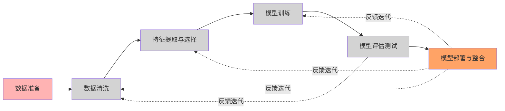
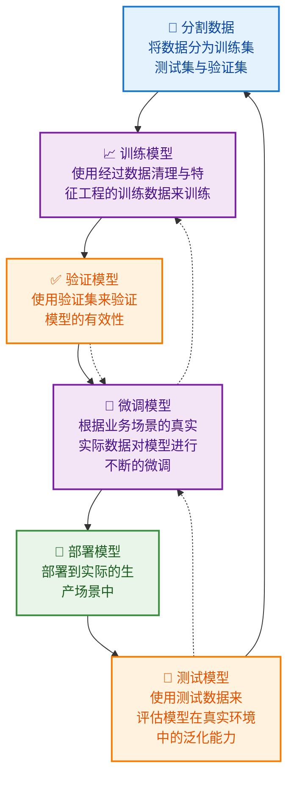

# 机器学习的整体流程

## 数据集

- 数据集:在机器学习任务中使用的一组数据，其中的每一个数据称为一个样本。反映样本在某方面的表现或性质的事项或属性称为特征。
  
- 训练集:训练过程中使用的数据集，其中每个样本称为训练样本。从数据中学得模型的过程称为学习(训练)。

- 测试集:学得模型后，使用其进行预测的过程称为测试，使用的数据集称为测试集，每个样本D称为测试样本。

## 数据处理

-  数据预处理

- 数据清洗

 - 数据转换

  - 数据归一化

  - 数据标准化

## 模型构建项目整体流程

### 模型构建综合流程说明

#### 1. 🔄 分割数据
- **目的**: 将原始数据科学地分割为不同用途的数据集
- **内容**:
  - 训练集 (Training Set): 用于训练模型，通常占总数据的60-70%
  - 验证集 (Validation Set): 用于调整超参数和模型选择，占15-20%
  - 测试集 (Test Set): 用于最终评估模型性能，占15-20%

#### 2. 📈 训练模型
- **目的**: 使用训练数据让模型学习数据中的模式和规律
- **内容**:
  - 选择合适的算法和模型架构
  - 设置初始参数和超参数
  - 进行前向传播和反向传播（如果是神经网络）
  - 优化损失函数

#### 3. ✅ 验证模型
- **目的**: 评估模型在未见过的数据上的表现
- **内容**:
  - 使用验证集测试模型性能
  - 计算各种评估指标（准确率、精确率、召回率等）
  - 检测过拟合或欠拟合问题
  - 为超参数调整提供依据

#### 4. 🔧 微调模型
- **目的**: 根据验证结果优化模型性能
- **内容**:
  - 调整超参数（学习率、批量大小等）
  - 修改模型架构或复杂度
  - 应用正则化技术
  - 根据业务需求进行特定优化

#### 5. 🚀 部署模型
- **目的**: 将训练好的模型投入实际生产环境
- **内容**:
  - 模型序列化和保存
  - 构建推理服务
  - 集成到现有业务系统
  - 设置监控和日志记录

#### 6. 🧪 测试模型
- **目的**: 在真实环境中全面评估模型性能
- **内容**:
  - 使用测试集进行最终性能评估
  - A/B测试对比新旧模型
  - 监控模型在生产中的表现
  - 评估模型的泛化能力和稳定性

### 🔄 迭代优化
整个流程是循环进行的：
- 根据测试结果决定是否需要重新训练
- 持续监控模型性能，及时发现问题
- 根据新的业务数据和需求调整模型
- 建立持续集成和持续部署(CI/CD)流程

