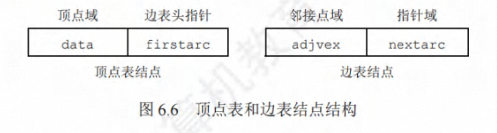

# 第 6 章 图

## 图的基本概念

#### 图的定义

图 G 由项点集和边集 E 组成，记为 G=(V,E)

线性表可以是空表，树可以是空树，但图不可以是空图。也就是说，图中不能一个顶点 也没有，图的顶点集 V 一定非空，但边集 E 可以为空，此时图中只有顶点而没有边。

1. **有向图**

2. **无向图**


3. **简单图、多重图**

一个图 G 若满足: 1️⃣ 不存在重复边; 2️⃣ 不存在顶点到自身的边，则称图 G 为简单图。图 6. 1 中 G1 和 G2
均内简单图

4. **完全图（简单完全图）**

对于无向图，|E|的取值范围为 0 到 n(n-1)/2，**有 n(n-1)/2 条边的无向图称完全图**，**在完全图中任意两个项点之间都存在边**。对于有向图，|E|的取值范围为 0 到 n(n-1)，**有 n(n-1)条弧的有向图称为有向完全图**，在有向完全图中任意两个顶点之间都存在方向相反的两条弧。图 6.1 中 G2 为无向完全图，而 G3 为有向完全图。

5. **子图**

   G3 为 G1 的子图

6. **连通、连通图和连通分量**

在**无向图**中，若从顶点 v 到顶点 w 有路径存在，则称 v 和 w 是连通的。若图 G 中任意两个顶点都是连通的 ， 则称图 G 连通图，否则称非连通图。无向图中的极大连通子图称连通分量，在图 6.2(a)中，图 G4 有 3 个连通分量如图 6.2(b)所示。假设一个图有 n 个顶点，若边数小于 n-1，则此图必是非连通图;思考，若图是非连通图，则最多可以有多少条边?


7. **强连通图、强连通分量**

在**有向图**中，若有一对顶点 w 和 w，从 v 到 w 和从 w 到 v 之间都有路径，则称这两个顶点是**强连通**的。**若图中任意一对项点都是强连通的，则称此图为强连通图**。**有向图中的极大强连通子图称为有向图的强连通分量**，图 G，的强连通分量如图 6.3 所示。思考，假设一个有向图有 n 个项点，若是强连通图，则最少需要有多少条边

8. **生成树、生成森林**

连通图的生成树是包含图中全部顶点的一个极小连通子图。若图中顶点数为 n，则它的生成树含有 n-1 条边。包含图中全部顶点的极小连通子图，只有生成树满足这个极小条件，对生成树而言，若砍去它的一条边，则会变成非连通图，若加上一条边则会形成一个回路。在非连通图中，连通分量的生成树构成了非连通图的生成森林。图 G 的一个生成树如图 6.4 所示。


> 区分极大连通子图和极小连通子图。极大连通子图要求子图必须连通，而且包含尽可能 多的顶点和边;极小连通子图是既要保持子图连通又要使得边数最少的子图

9. **顶点的度、入度和出度**

在**无向图**中，顶点 v 的度是**指依附于项点的边的条数**，记为 TD(v)。在图 6.1(b)中，每个项点的度均为 3。**无向图的全部顶点的度之和等于边数的 2 倍**，因为每条边和两个项点相关联。
在**有向图**中，顶点 v 的度分为入度和出度，**入度是以顶点终点的有向边的数目**，记为 ID(1):而**出度是以顶点，为起点的有向边的数目**，记为 OD(v)。在图 6.1(a)中，顶点 2 的出度为 2、入度为 1。顶点 v 的度等于其**入度与出度之和**，即 TD(v)=ID(v)+OD(v)。**有向图的全部顶点的入度之和与出度之和相等，并且等于边数，这是因为每条有向边都有一个起点和终点**。

10. **边的权和网**

在一个图中，每条边都可以标上具有某种含义的数值，**该数值称为该边的权值**。这种边上 带有权值的图称为**带权图，也称网**。

11. **稠密图、稀疏图**

边数很少的图称为稀疏图，反之称为稠密图。稀疏和稠密本身是模糊的概念，稀疏图和稠 密图常常是相对而言的。一般当图 G 满足 E<|7log|V 时，可以将 G 视为稀疏图。

12. **路径、路径长度和回路**

顶点 v，到顶点 1，之间的一条路径是指顶点序列 1pVV。，当然关联的边也可理解为路径的构成要素。路径上的边的数目称内**路径长度**。**第一个顶点和最后一个项点相同的路径称为回路或环**。若一个图有 n 个项点，且有大于 n-1 条边，则此图一定有环。

13. **简单路径、简单回路**

在路径序列中，顶点不重复出现的路径称为简单路径。除第一个顶点和最后一个顶点外， 其余顶点不重复出现的回路称为简单回路。

14. **距离**

从顶点 w 出发到顶点 v 的最短路径若存在，则此路径的长度称为从 u 到 v 的距离。若从 w 到 v 根本不存在路径，则记该距离为无穷(∞)

16. **有向树**

一个项点的入度为 0、其余顶点的入度均为 1 的有向图，称为有向树。

## 图的存储及基本操作

#### 邻接矩阵法

所谓邻接矩阵存储，是指用**一个一维数组存储图中顶点的信息**，**用一个二维数组存储图中边的信息(即各顶点之间的邻接关系)**，存储顶点之间邻接关系的二维数组称为邻接矩阵。

对带权图而言，若顶点 Vi 和 Vj 之间有边相连，则邻接矩阵中对应项存放着该边对应的权值，若顶点 Vi 和 Vj 不相连，则通常用 0 或 ∞ 来代表这两个项点之间不存在边。


```c
#deinfen MaxVertexNum 10;    //  顶点数目的最大值
typedef char VertexType;  // 顶点对应的数据类型
typedef int EdgeType;    // 边对应的数据类型
typedef struct {
   VertexType vex[MaxVertexNum];  // 顶点表
   EdgeType edge[MaxVertexNum][MaxVertexNum];  // 邻接矩阵、边表
   int vexnum,arcnum;   // 图的当前顶点数和边数
}MGraph;

```

> 1️⃣ 在简单应用中，可直接用二维数组作为图的邻接矩阵(顶点信息等均可省略)。
> 2️⃣ 当邻接矩阵的元素仅表示相应边是否存在时，EdgeType 可用值为 0 和 1 的枚举类型。
> 3️⃣ 无向图的邻接矩阵是对称矩阵，对规模特大的邻接矩阵可采用压缩存储。
> 4️⃣ 邻接矩阵表示法的空间复杂度为 O(n-)，其中 n 为图的顶点数|M。

> 邻接矩阵的遍历的时间复杂度

图的邻接矩阵存储表示法具有以下特点:

1️⃣ **无向图的邻接矩阵一定是一个对称矩阵(并且唯一)**。因此，在实际存储邻接矩阵时只需存储上(或下)三角矩阵的元素。
2️⃣ 对于无向图，邻接矩阵的第 i 行(或第 i 列)非零元素(或非 ∞ 元素)的个数正好是顶点 i 的度 TD(v)。
3️⃣ 对于有向图，邻接矩阵的第 i 行非零元素(或非 ∞ 元素)的个数正好是顶点 i 的出度 OD(v)；第 i 列非零元素(或非 ∞ 元素)的个数正好是顶点 i 的入度 ID(Vi)；
4️⃣ 用邻接矩阵存储图，很容易确定图中任意两个项点之间是否有边相连。但是，要确定图中有多少条边，则必须按行、按列对每个元素进行检测，所花费的时间代价很大。
5️⃣ 稠密图(即边数较多的图)适合采用邻接矩阵的存储表示。
6️⃣ 设图 G 的邻接矩阵为 A，**A^n 的元素 A^n[j][j] 等于由顶点 i 到顶点 j 的长度为 n 的路径的数目 **

#### 邻接表法

所谓邻接表，是指对图 G 中的每个顶点 Vi 建立一个单链表，第 i 个单链表中的结点表示依附于顶点 Vi 的边(对于有向图则是以顶点 Vi 为尾的弧)，这个单链表就称为顶点 Vi 的边表(对于有向图则称出边表)。边表的头指针和顶点的数据信息采用顺序存储，称为顶点表，所以在邻接表中存在两种结点:顶点表结点和边表结点，如图 6.6 所示。




```c
#define MaxVertexNum 100; //图中顶点数目的最大值

typedef struct ArcNode {.  // 边表结点
   int adjvex;             // 该弧指向的顶点的位置
   struct ArcNode *nextarc // 指向下一条的指针
   // InfoType info;       // 网的边权值
}ArcNode

typedef struct VNode{     // 顶点表结点
   VertexType data;       // 顶点信息
   ArcNode *firstarc;     // 指向第一条依附该顶点的弧的指针
}VNode, AdjList[MaxVertexNum]

typedef struct {
   AdjList vertices;  // 邻接表
   int vexnum , arcnum; // 图的顶点数和弧数
} ALGraph              //ALGr aph 是以邻接表存储的图类型
```

**特点：**

- 若 G 为无向图，则所需的存储空间为 **O(|V|+2|E|)**；若 G 为有向图，则所需的存储空间为 **O(|V|+|E|)**。前者的倍数 2 是因为在无向图中，每条边在邻接表中出现了两次。
- 对于**稀疏图(即边数较少的图)**，采用邻接表表示将极大地节省存储空间。
- 在邻接表中，给定一个顶点，**能很容易地找出它的所有邻边**，因为只需要读取它的邻接表。在邻接矩阵中，相同的操作则需要扫描一行，花费的时间为 O(n)。但是，若要确定给定的两个顶点间是否存在边，则在邻接矩阵中可以立刻查到，而在邻接表中则需要在 相应结点对应的边表中查找另一结点，效率较低。
- 在无向图的邻接表中，求某个项点的度只需计算其邻接表中的边表结点个数。在有向图的邻接表中，求某个顶点的出度只需计算其邻接表中的边表结点个数;但求某个顶点 x 的入度则需遍历全部的邻接表，统计邻接(adjvex )域为 × 的边表结点个数。
- 图的邻接表表示并不唯一，因为在每个顶点对应的边表中，各边结点的链接次序可以是任意的，它取决于建立邻接表的算法及边的输入次序。

#### 十字链表

为了解决有向图求入度需要遍历整个邻接表问题，引出了十字链表。十字链表是有向图的一种链式存储结构。在十字链表中，有向图的每条弧用一个结点(弧结点)来表示，每个顶点也用一个结点 (顶点结点)来表示。两种结点的结构如下所示。


弧结点中有 5 个域:
`tailvex`和`headvex`两个域分别指示**弧尾**和**弧头**这两个顶点的编号;
头链域 `hlink`指向**弧头相同**的下一个弧结点;
尾链域`tlink`指向**弧尾相同**的下一个弧结点;
`info` 域存放该弧的相关信息。
这样，**弧头相同的弧在同一个链表上**，**弧尾相同的弧也在同 一个链表上**。

顶点结点中有 3 个域：
`data `域存放该顶点的数据信息，如顶点名称;
`firstin`域指向以该顶点为弧头的第一个弧结点;
`firstout`域指向以该顶点为弧尾的第一个弧结点。


在十字链表中，既容易找到 Vi 为尾的弧，也容易找到 Vi 为头的弧，因而容易求得顶点的出度和入度。**图的十字链表表示是不唯一的，但一个十字链表表示唯一确定一个图**。
