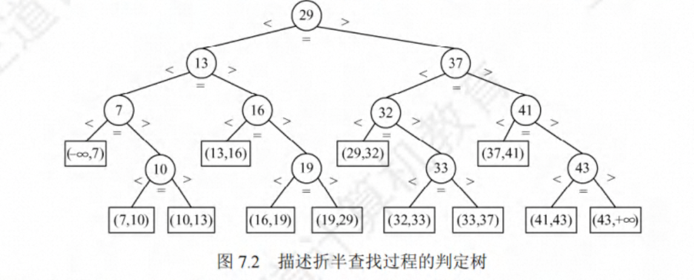
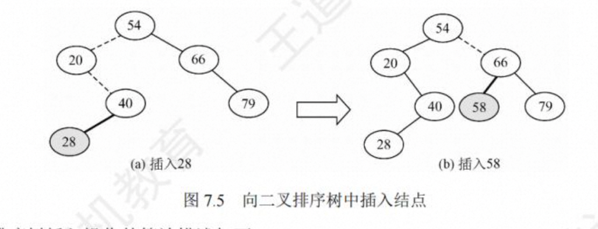
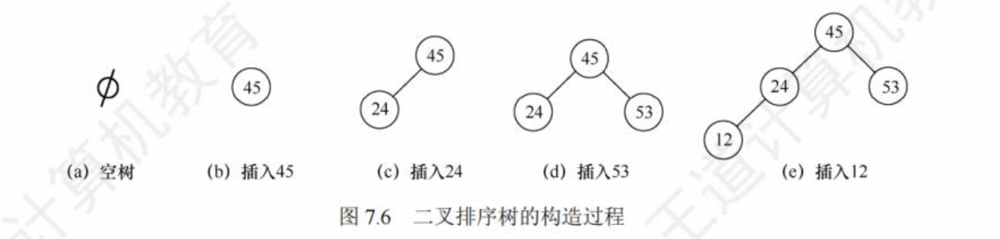
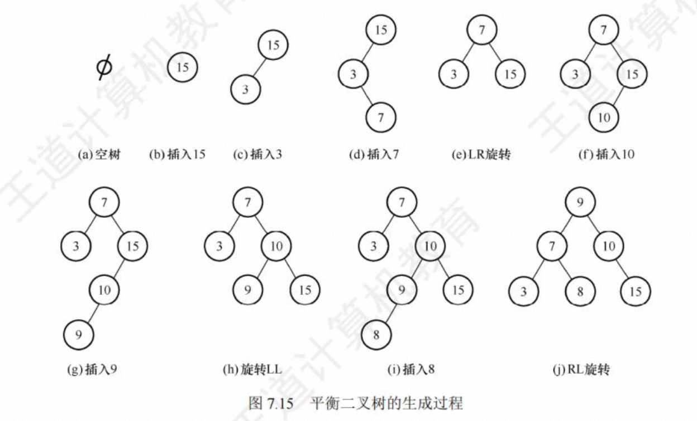
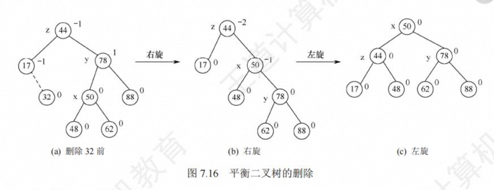

# 第 7 章 查找


## 查找的基本概念

（1）**查找**
（2）**查找表**
（3）**静态查找表&动态查找表**：若一个查找表的操作只涉及查找操作，则无须动态地修改查找表，此类查找表称为静态查找表。与此对应，需要动态地插入或删除的查找表称为动态查找表。适合静态查找表的查找方法有顺序查找、折半查找、散列查找等;适合动态查找表的查找方法有二叉排序树的查找、散列查找等
（4）**关键字**
（5）**平均查找长度**：一次查找的长度是指需要比较的关键字次数，而平均查找长度则是所有查找过程中进行关键字的比较次数的平均值

## 顺序查找和折半查找

#### 顺序查找

顺序查找又称线性查找，它对顺序表和链表都是适用的。对于顺序表，可通过数组下标递增 来顺序扫描每个元素:对于链表，可通过指针 next 来依次扫描每个元素。顺序查找通常分为对一般的无序线性表的顺序查找和对按关键字有序的线性表的顺序查找

1. **一般线性表的顺序查找**

2. **有序线性表的顺序查找**

#### 折半查找

**折半查找又称二分查找，它仅适用于有序的顺序表**

```c
int Binary(SSTable L , ElemType key){
  int low = 0, high = L.length - 1,mid;
  while(low < hight){
    mid = (low + hight) / 2;
    if(key == L.elem[mid]) return mid;
    else if(key < L.elem[mid]) hight = mid -1;
    else (key > L.elem[mid]) low = mid +1;
  }
  return -1;
}
```

当折半查找算法选取中间结点时，既可以采用向下取整，又可以采用向上取整。但每次查找 的取整方式必须相同.

**折半查找路径**


**折半查找判定树**
折半查找的过程可用图 7.2 所示的二叉树来描述，称为判定树。树中每个圆形结点表示一个记录，结点中的值为该记录的关键字值:树中最下面的叶结点都是方形的，它表示查找失败的区间。从判定树可以看出，查找成功时的查找长度为从根结点到目的结点的路径上的结点数，而查找失败时的查找长度为从根结点到对应失败结点的父结点的路径上的结点数;每个结点值均大于其左子结点值，且均小于其右子结点值。若有序序列有 n 个元素，则对应的判定树有 n 个圆形的非叶结点和 n+1 个方形的叶结点。显然，判定树是**一棵平衡二叉树**。



#### 分块查找

分块查找又称索**引顺序查找**，它吸取了顺序查找和折半查找各自的优点，既有动态结构，又适于快速查找。

**基本思想**：将查找表分为若干子块。块内的元素可以无序，但块间的元素是有序的，即第一个块中的最大关键字小于第二个块中的所有记录的关键字，第二个块中的最大关键小于第三个块中的所有记录的关键字，以此类推。再建立一个索引表，索引表中的每个元素含有各块的最大关键字和各块中的第 一个元素的地址，索引表按关键字有序排列。（块内无序，块间有序）

**分块查找的过程分为两步**:第一步是在索引表中确定待查记录所在的块，可以顺序查找或折 半查找索引表;第 二步是在块内顺序查找。（块间折半，块内顺序）


## 树的查找

#### 二叉排序树

构造一棵二叉排序树的目的并不是排序，而是提高查找、插入和删除关键字的速度，二叉排序树这种非线性结构也有利于插入和删除的实现。

1. **二叉排序树的定义**
   二叉排序树 (也称 二叉查找树)或者是 一棵空树，或者是具有下列特性的 二叉树:
   1️⃣ 若左子树非空，则左子树上所有结点的值均小于根结点的值。
   2️⃣ 若右子树非空，则右子树 上所有结点的值均大于根结点的值。
   3️⃣ 左、右子树也分别是一棵二叉排序树 。
   根据二叉排序树的定义，左子树结点值 <根结点值 <右子树结点值，因此对二叉排序树 进行中序遍历，可以得到一个递增的有序序列。例如，图 7. 4 所示 二叉排序树的中序遍历序列 为 123468。
   

2. **二叉排序树的查找**

二叉排序树的查找是从根结点开始，沿某个分支逐层向下比较的过程。若二叉排序树非空， 先将给定值与根结点的关键字比较，若相等，则查找成功;若不等，若小于根结点的关键字，则 在根结点的左子树上查找，否则在根结点的右子树上查找。这显然是一个递归的过程。

非递归：

```c
BSTNode *BST_Search(BiTree T , ElemType key){
  while(T != NULL && key != T->data){
    if(key < T->data) T = T->lchild;
    else T=T->rchild;
  }
  return T
}
```

3. **二叉排序树的插入**

二叉排序树作为一种动态树表，其特点是树的结构通常不是一次生成的，而是在查找过程中， 当树中不存在关键字值等于给定值的结点时再进行插入的。



```c
int BST_Insert(BiTree T , KeyType k){
  if(T ==NULL){
    T = (BiTree)malloc(sizeof(BSTNode));
    T->data = k;
    T->lchild = T->rchild = NULL;
    return 1
  }else if(K == T->data) return 0;
  else if(k < T->data) return BST_Insert(T->lchild,k)
  else return BST_Insert(T->rchild,k)
}
```

4. **二叉排序树的构造**



5. **二叉排序树的删除**
   

> 思考:若在 二叉排序树中删除并插入某结点，得到的 二叉排序树是否和原来的相同

6. **二叉排序树的查找效率分析**

二又排序树的查找效率，主要取决于树的高度。若二叉排序树的左、右子树的高度之差的绝对值不超过 1(平衡二叉树，下一节)，它的平均查找长度为 O(log2n)。若二叉排序树是一个只有右(左)孩子的单支树(类似于有序的单链表)，则其平均查找长度为 O(n)。


就维护表的有序性而言，二叉排序树无须移动结点，只需修改指针即可完成插入和删除操作，平均执行时间为 O(log2n)。二分查找的对象是有序顺序表，若有插入和删除结点的操作，所花的代价是 O(n)。**当有序表是静态查找表时，宜用顺序表作为其存储结构，而采用二分查找实现其找操作;若有序表是动态查找表，则应选择二叉排序树作为其逻辑结构**。

#### 平衡二叉树

1. **平衡二叉树的定义**
   为了避免树的高度增长过快，降低二叉排序树的性能，规定在插入和删除结点时，要保证任意结点的左、右子树高度差的绝对值不超过 1，将这样的二叉树称为**平衡二叉树(BalancedBinaryTree)**，也称**AVL 树**。定义结点左子树与右子树的高度差为该结点的平衡因子，则平衡二叉树结点的平衡因子的值只可能是 -1、0 或 1 。


2. **平衡二叉树的插入**

每当在二叉排序树中插入(或删除)一个结点时，首先检查其插入路径上的结点是否因为此次操作而导致了不平衡。若导致了不平衡，则**先找到插入路径上离插入结点最近的平衡因子的绝对值大于 1 的结点 A**，再对以 A 为根的子树，在保持二叉排序树特性的前提下，调整各结点的位置关系，使之重新达到平衡。


> 平 衡 二 叉 树 的 插 入 及 调 整 操 作 的 实 例


> 构造平衡叉树的过程(2013)



3. **平衡二叉树的删除**



4. **平衡二叉树的查找**
   在平衡二又树上进行查找的过程与二又排序树的相同。因此，在查找过程中，进行关键字的比较次数不超过树的深度。含有 n 个结点的平衡二又树的最大深度为`O(log2n)`，因此平均查找效率为`O(log2n)`。
