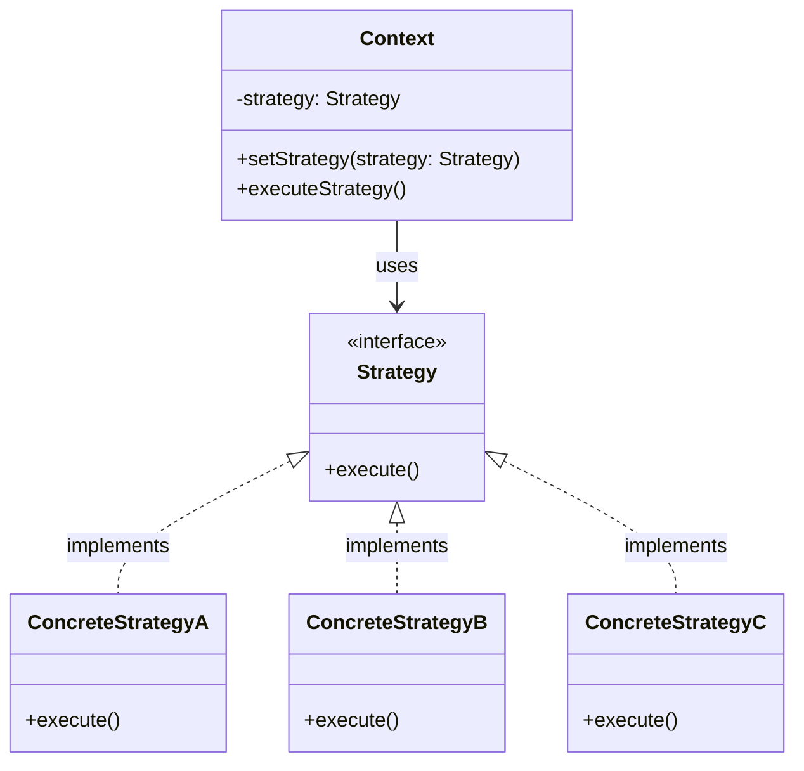
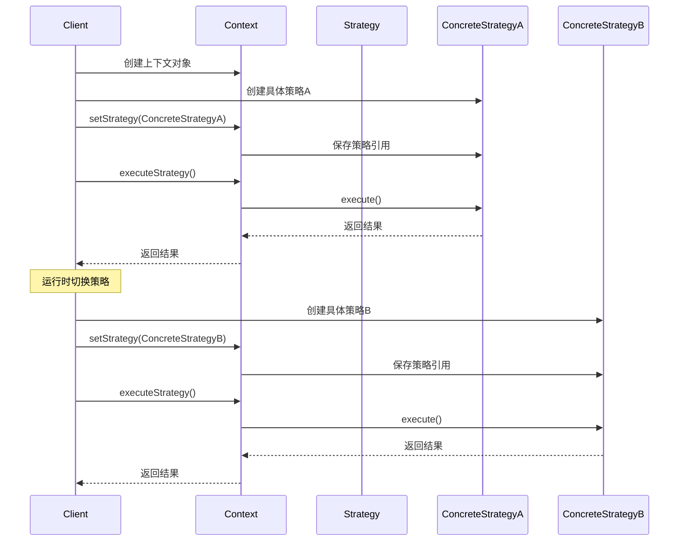
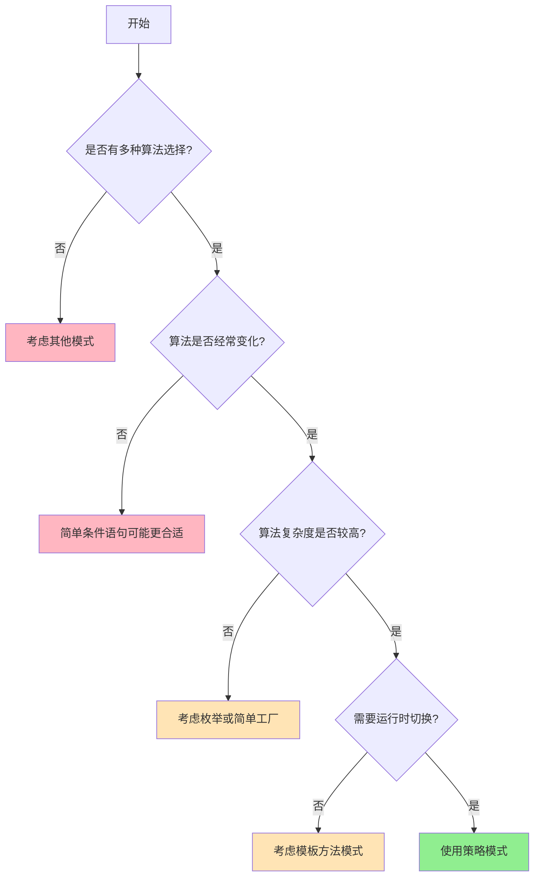
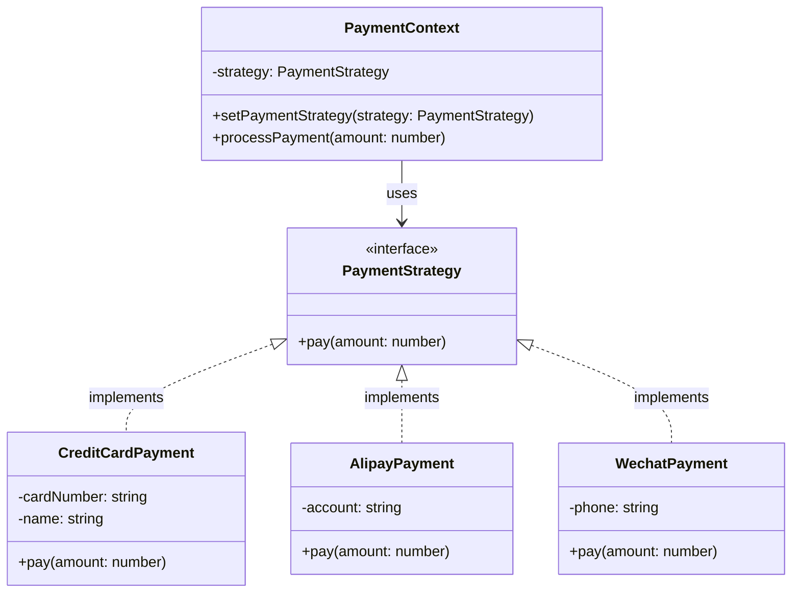
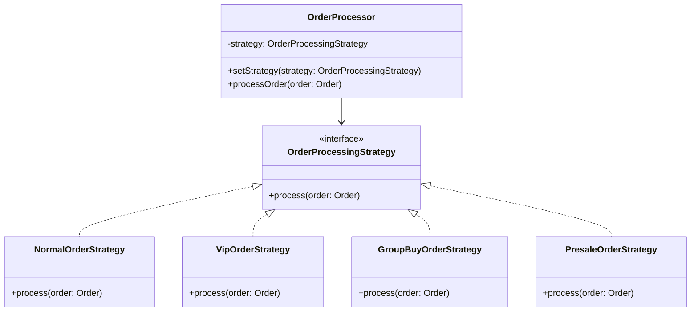
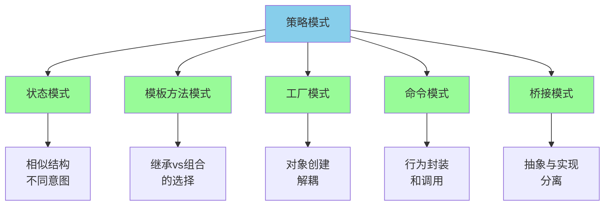
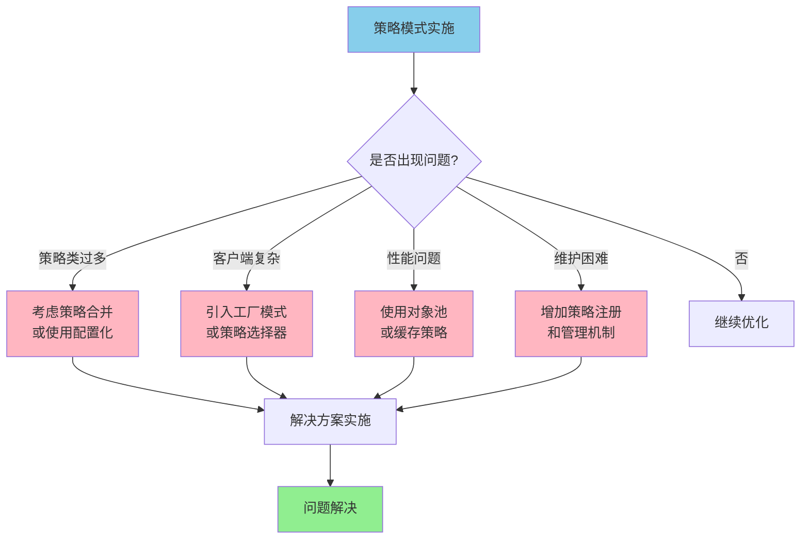
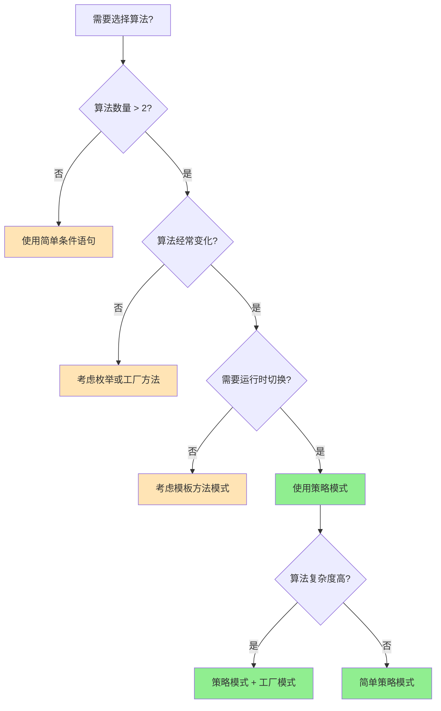

# 策略模式 (Strategy Pattern)

> [!NOTE]
> **策略模式** (Strategy Pattern) 定义了一系列算法，将它们各自封装，并使之可以相互替换。该模式让算法的变化独立于使用算法的客户。

## 📖 模式定义

**策略模式**是一种行为型设计模式，它定义了一系列算法，将每个算法封装起来，并使它们可以相互替换。策略模式让算法的变化独立于使用算法的客户端。

策略模式的核心思想是将算法的使用与算法的实现分离。当你有多种方式来执行某个任务时，策略模式提供了一种优雅的方式来组织这些算法，使得它们可以在运行时动态选择和切换。

### 模式起源与背景

策略模式最早在 1994 年由 Gang of Four（GoF）在《设计模式：可复用面向对象软件的基础》一书中提出。该模式的设计初衷是为了解决在面向对象编程中，当一个类需要在多种算法中选择一种时所面临的问题。

在传统的面向对象设计中，开发者经常使用继承来实现算法的变化，但这种方式存在以下问题：

- **类爆炸问题**：每种算法都需要一个子类，导致类的数量急剧增加
- **运行时切换困难**：继承关系在编译时确定，无法在运行时动态改变算法
- **代码重复**：不同算法可能共享相同的代码，但继承体系难以避免重复

策略模式通过组合关系替代继承关系，很好地解决了这些问题。

### 核心要素

**策略模式类图结构：**



- **Context (上下文)**：持有一个策略对象的引用，并将客户端的请求委托给该策略对象进行处理。Context 类通常包含一个设置策略的方法和一个执行策略的方法。它不知道具体使用的是哪种策略，只通过策略接口与策略对象交互。

- **Strategy (策略接口)**：定义了所有具体策略类所需的公共接口，是上下文与具体策略之间的通信桥梁。这个接口声明了策略算法所需的方法，通常只包含一个或几个方法。

- **ConcreteStrategy (具体策略)**：实现了策略接口，封装了具体的算法或行为。每个具体策略类都实现了策略接口中定义的方法，提供了算法的具体实现。

### 工作原理

策略模式的工作流程可以用以下时序图来描述：



**工作流程详解：**

1. **初始化阶段**：客户端创建上下文对象和具体策略对象
2. **策略设置**：通过上下文对象的 `setStrategy()` 方法设置具体的策略
3. **策略执行**：客户端调用上下文的方法，上下文将调用委托给当前策略对象
4. **动态切换**：在运行时，客户端可以随时更换策略对象，实现算法的动态切换

### 设计原则体现

策略模式体现了多个重要的面向对象设计原则：

- **开闭原则 (Open-Closed Principle)**：对扩展开放，对修改关闭。添加新的策略不需要修改现有代码。
- **依赖倒置原则 (Dependency Inversion Principle)**：高层模块不依赖低层模块，都依赖于抽象。Context 依赖于 Strategy 接口，而不是具体实现。
- **单一职责原则 (Single Responsibility Principle)**：每个策略类只负责一种算法的实现。
- **组合优于继承**：通过组合关系而非继承关系来实现算法的变化。

## 🎯 使用场景

### 适用情况

**1. 多种算法选择**：一个系统需要动态地在几种算法中选择一种。
   - *示例*：图像处理软件中的不同滤镜算法
   - *示例*：数据压缩软件中的不同压缩算法

**2. 避免多重条件判断**：当业务逻辑中存在大量 `if-else` 或 `switch-case` 语句时，可使用策略模式简化结构。
   ```typescript
   // 不使用策略模式的代码（不推荐）
   function calculatePrice(type: string, amount: number): number {
       if (type === 'regular') {
           return amount;
       } else if (type === 'vip') {
           return amount * 0.9;
       } else if (type === 'gold') {
           return amount * 0.8;
       } else if (type === 'promotion') {
           return amount * 0.7;
       }
       // 每次添加新类型都需要修改这个函数
       return amount;
   }
   ```

**3. 算法独立变化**：希望在不影响客户端的情况下独立改变、复用或扩展算法。
   - *示例*：支付系统中的不同支付方式
   - *示例*：日志系统中的不同输出格式

**4. 算法复杂度隐藏**：当算法的实现细节需要对客户端隐藏时。
   - *示例*：机器学习模型的不同训练算法
   - *示例*：路径规划中的不同寻路算法

### 策略选择决策流程



### 不适用情况

- **算法固定**：当算法集合很少改变或非常稳定时，没有必要使用策略模式。引入策略模式可能会增加不必要的复杂性。

- **逻辑简单**：对于仅有少量条件分支的简单逻辑，直接使用条件语句可能比引入策略模式更直观。
   ```typescript
   // 对于简单逻辑，直接使用条件语句更合适
   function getDiscount(isVip: boolean): number {
       return isVip ? 0.9 : 1.0;
   }
   ```

- **性能要求极高**：在对性能要求极为苛刻的场景中，策略模式引入的间接调用可能不被接受。

## 💡 实现方式

### 基本实现模板

策略模式的实现通常遵循以下模板：



### TypeScript 实现

```typescript
// 策略接口
interface PaymentStrategy {
    pay(amount: number): void;
}

// 具体策略：信用卡支付
class CreditCardPayment implements PaymentStrategy {
    constructor(
        private cardNumber: string,
        private name: string
    ) {}

    pay(amount: number): void {
        console.log(`使用信用卡 ${this.cardNumber} 支付 ¥${amount}`);
        console.log(`持卡人：${this.name}`);
    }
}

// 具体策略：支付宝支付
class AlipayPayment implements PaymentStrategy {
    constructor(private account: string) {}

    pay(amount: number): void {
        console.log(`使用支付宝账户 ${this.account} 支付 ¥${amount}`);
    }
}

// 具体策略：微信支付
class WechatPayment implements PaymentStrategy {
    constructor(private phone: string) {}

    pay(amount: number): void {
        console.log(`使用微信(${this.phone}) 支付 ¥${amount}`);
    }
}

// 上下文类
class ShoppingCart {
    private items: { name: string; price: number }[] = [];
    private paymentStrategy: PaymentStrategy | null = null;

    addItem(name: string, price: number): void {
        this.items.push({ name, price });
    }

    setPaymentStrategy(strategy: PaymentStrategy): void {
        this.paymentStrategy = strategy;
    }

    getTotalAmount(): number {
        return this.items.reduce((total, item) => total + item.price, 0);
    }

    checkout(): void {
        if (!this.paymentStrategy) {
            throw new Error('请选择支付方式');
        }

        const total = this.getTotalAmount();
        console.log('=== 购物车结算 ===');
        this.items.forEach(item => {
            console.log(`${item.name}: ¥${item.price}`);
        });
        console.log(`总计: ¥${total}`);
        console.log('---');
        
        this.paymentStrategy.pay(total);
    }
}

// 使用示例
const cart = new ShoppingCart();
cart.addItem('iPhone 15', 6999);
cart.addItem('AirPods', 1299);

// 使用不同的支付策略
const creditCard = new CreditCardPayment('**** **** **** 1234', '张三');
cart.setPaymentStrategy(creditCard);
cart.checkout();

console.log('\n--- 切换支付方式 ---\n');

const alipay = new AlipayPayment('zhangsan@example.com');
cart.setPaymentStrategy(alipay);
cart.checkout();
```

### 更复杂的策略模式示例

```typescript
// 排序策略接口
interface SortStrategy<T> {
    sort(data: T[]): T[];
}

// 冒泡排序策略
class BubbleSortStrategy<T> implements SortStrategy<T> {
    sort(data: T[]): T[] {
        const result = [...data];
        const n = result.length;
        
        for (let i = 0; i < n - 1; i++) {
            for (let j = 0; j < n - i - 1; j++) {
                if (result[j] > result[j + 1]) {
                    [result[j], result[j + 1]] = [result[j + 1], result[j]];
                }
            }
        }
        
        console.log('使用冒泡排序');
        return result;
    }
}

// 快速排序策略
class QuickSortStrategy<T> implements SortStrategy<T> {
    sort(data: T[]): T[] {
        if (data.length <= 1) return [...data];
        
        const pivot = data[Math.floor(data.length / 2)];
        const left = data.filter(x => x < pivot);
        const middle = data.filter(x => x === pivot);
        const right = data.filter(x => x > pivot);
        
        // 注意：为简化示例，此处的快速排序实现并非最优，在递归中也打印了日志
        console.log('使用快速排序');
        return [
            ...this.sort(left),
            ...middle,
            ...this.sort(right)
        ];
    }
}

// 原生排序策略
class NativeSortStrategy<T> implements SortStrategy<T> {
    sort(data: T[]): T[] {
        console.log('使用原生排序');
        return [...data].sort();
    }
}

// 排序上下文
class Sorter<T> {
    private strategy: SortStrategy<T>;

    constructor(strategy: SortStrategy<T>) {
        this.strategy = strategy;
    }

    setStrategy(strategy: SortStrategy<T>): void {
        this.strategy = strategy;
    }

    sort(data: T[]): T[] {
        return this.strategy.sort(data);
    }
}

// 使用示例
const numbers = [64, 34, 25, 12, 22, 11, 90];
const sorter = new Sorter(new BubbleSortStrategy<number>());

console.log('原始数据:', numbers);
console.log('排序结果:', sorter.sort(numbers));

// 切换策略
sorter.setStrategy(new QuickSortStrategy<number>());
console.log('排序结果:', sorter.sort(numbers));

sorter.setStrategy(new NativeSortStrategy<number>());
console.log('排序结果:', sorter.sort(numbers));
```

### 高级实现技巧

**1. 策略链模式**

当需要依次执行多个策略时，可以将策略模式与责任链模式结合：

```typescript
interface ValidationStrategy {
    validate(data: any): { isValid: boolean; message: string };
    setNext(strategy: ValidationStrategy): ValidationStrategy;
}

abstract class BaseValidationStrategy implements ValidationStrategy {
    private nextStrategy: ValidationStrategy | null = null;

    setNext(strategy: ValidationStrategy): ValidationStrategy {
        this.nextStrategy = strategy;
        return strategy;
    }

    validate(data: any): { isValid: boolean; message: string } {
        const result = this.doValidate(data);
        
        if (!result.isValid) {
            return result;
        }
        
        if (this.nextStrategy) {
            return this.nextStrategy.validate(data);
        }
        
        return { isValid: true, message: '' };
    }

    protected abstract doValidate(data: any): { isValid: boolean; message: string };
}

class LengthValidationStrategy extends BaseValidationStrategy {
    constructor(private minLength: number) {
        super();
    }

    protected doValidate(data: string): { isValid: boolean; message: string } {
        const isValid = data.length >= this.minLength;
        return {
            isValid,
            message: isValid ? '' : `长度至少为 ${this.minLength} 个字符`
        };
    }
}

class FormatValidationStrategy extends BaseValidationStrategy {
    constructor(private pattern: RegExp, private errorMsg: string) {
        super();
    }

    protected doValidate(data: string): { isValid: boolean; message: string } {
        const isValid = this.pattern.test(data);
        return {
            isValid,
            message: isValid ? '' : this.errorMsg
        };
    }
}

// 使用示例
const emailValidation = new LengthValidationStrategy(5);
const formatValidation = new FormatValidationStrategy(
    /^[^\s@]+@[^\s@]+\.[^\s@]+$/,
    '邮箱格式不正确'
);

emailValidation.setNext(formatValidation);

const result = emailValidation.validate('user@example.com');
console.log(result); // { isValid: true, message: '' }
```

**2. 策略注册模式**

对于大量策略的场景，可以使用注册模式来管理策略：

```typescript
class StrategyRegistry<T> {
    private strategies = new Map<string, T>();

    register(name: string, strategy: T): void {
        this.strategies.set(name, strategy);
    }

    get(name: string): T | undefined {
        return this.strategies.get(name);
    }

    getAllNames(): string[] {
        return Array.from(this.strategies.keys());
    }

    has(name: string): boolean {
        return this.strategies.has(name);
    }
}

// 使用示例
const paymentRegistry = new StrategyRegistry<PaymentStrategy>();
paymentRegistry.register('creditCard', new CreditCardPayment('1234', 'John'));
paymentRegistry.register('alipay', new AlipayPayment('john@example.com'));
paymentRegistry.register('wechat', new WechatPayment('13800138000'));

// 动态获取策略
const strategy = paymentRegistry.get('alipay');
if (strategy) {
    strategy.pay(100);
}
```

## ⚖️ 优缺点分析

### ✅ 优点

1. **算法动态切换**：通过封装算法族，使得算法可以在运行时根据需求动态切换，提高了系统的灵活性。
   ```typescript
   // 运行时动态切换策略的示例
   const context = new PaymentContext();
   
   // 白天使用在线支付
   if (isBusinessHours()) {
       context.setPaymentStrategy(new OnlinePaymentStrategy());
   } else {
       // 夜间使用离线支付
       context.setPaymentStrategy(new OfflinePaymentStrategy());
   }
   ```

2. **简化条件逻辑**：消除了大量的 `if-else` 或 `switch-case` 语句，使代码结构更清晰。

3. **高扩展性**：新增策略只需添加新的具体策略类，无需修改现有代码，符合开闭原则。

4. **代码复用**：每个算法被封装在独立的策略类中，便于在不同上下文中复用。

5. **易于测试**：每个策略都是独立的类，可以单独进行单元测试。

6. **职责分离**：将算法的选择和算法的实现分离，使得代码更加清晰。

### ❌ 缺点

1. **类数量膨胀**：每个具体策略都是一个独立的类，可能导致系统中类的数量增多。
   - *影响*：增加了代码库的复杂性和维护成本
   - *缓解方案*：使用内部类、lambda 表达式或函数式接口

2. **客户端认知成本**：客户端需要了解并区分所有策略的差异，以便在合适的时机选择合适的策略。
   - *影响*：增加了客户端代码的复杂性
   - *缓解方案*：提供策略选择的帮助类或配置化选择

3. **对象创建开销**：上下文与策略对象之间的交互增加了对象的创建和通信开销。
   - *影响*：在性能敏感的场景中可能成为瓶颈
   - *缓解方案*：使用对象池或单例模式

### 性能对比分析

```mermaid
graph TB
    subgraph "传统条件语句"
        A1[if-else 语句] --> A2[执行时间: O(1) - O(n)]
        A2 --> A3[内存占用: 低]
        A3 --> A4[维护性: 差]
    end
    
    subgraph "策略模式"
        B1[策略对象调用] --> B2[执行时间: O(1)]
        B2 --> B3[内存占用: 中等]
        B3 --> B4[维护性: 好]
    end
    
    subgraph "工厂+策略模式"
        C1[工厂创建+策略调用] --> C2[执行时间: O(1) - O(log n)]
        C2 --> C3[内存占用: 中等]
        C3 --> C4[维护性: 很好]
    end
```

## 🌟 实际应用案例

### 案例1：电商系统的订单处理策略

在电商系统中，订单处理可能因为不同的业务场景而有不同的流程：



```typescript
interface Order {
    id: string;
    items: any[];
    customer: Customer;
    type: 'normal' | 'vip' | 'groupbuy' | 'presale';
    amount: number;
}

interface Customer {
    id: string;
    level: 'normal' | 'vip' | 'gold';
}

interface OrderProcessingStrategy {
    process(order: Order): Promise<ProcessingResult>;
}

interface ProcessingResult {
    success: boolean;
    message: string;
    estimatedDelivery?: Date;
    discount?: number;
}

class NormalOrderStrategy implements OrderProcessingStrategy {
    async process(order: Order): Promise<ProcessingResult> {
        // 普通订单处理逻辑
        console.log(`处理普通订单 ${order.id}`);
        
        // 1. 库存检查
        await this.checkInventory(order.items);
        
        // 2. 支付验证
        await this.verifyPayment(order);
        
        // 3. 生成发货单
        await this.generateShippingOrder(order);
        
        return {
            success: true,
            message: '订单处理成功',
            estimatedDelivery: new Date(Date.now() + 3 * 24 * 60 * 60 * 1000) // 3天后
        };
    }
    
    private async checkInventory(items: any[]): Promise<void> {
        // 库存检查逻辑
    }
    
    private async verifyPayment(order: Order): Promise<void> {
        // 支付验证逻辑
    }
    
    private async generateShippingOrder(order: Order): Promise<void> {
        // 生成发货单逻辑
    }
}

class VipOrderStrategy implements OrderProcessingStrategy {
    async process(order: Order): Promise<ProcessingResult> {
        console.log(`处理VIP订单 ${order.id}`);
        
        // VIP订单享有优先处理权
        await this.priorityProcessing(order);
        
        // 额外的VIP服务
        await this.applyVipBenefits(order);
        
        return {
            success: true,
            message: 'VIP订单处理成功',
            estimatedDelivery: new Date(Date.now() + 1 * 24 * 60 * 60 * 1000), // 1天后
            discount: order.amount * 0.05 // 5% VIP折扣
        };
    }
    
    private async priorityProcessing(order: Order): Promise<void> {
        // VIP优先处理逻辑
    }
    
    private async applyVipBenefits(order: Order): Promise<void> {
        // 应用VIP权益
    }
}

class GroupBuyOrderStrategy implements OrderProcessingStrategy {
    async process(order: Order): Promise<ProcessingResult> {
        console.log(`处理团购订单 ${order.id}`);
        
        // 检查团购条件
        const groupBuyValid = await this.validateGroupBuy(order);
        if (!groupBuyValid) {
            return {
                success: false,
                message: '团购条件未满足'
            };
        }
        
        // 团购特殊处理
        await this.processGroupBuy(order);
        
        return {
            success: true,
            message: '团购订单处理成功',
            estimatedDelivery: new Date(Date.now() + 5 * 24 * 60 * 60 * 1000), // 5天后
            discount: order.amount * 0.15 // 15% 团购折扣
        };
    }
    
    private async validateGroupBuy(order: Order): Promise<boolean> {
        // 验证团购条件
        return true;
    }
    
    private async processGroupBuy(order: Order): Promise<void> {
        // 团购处理逻辑
    }
}

// 订单处理器
class OrderProcessor {
    private strategy: OrderProcessingStrategy;
    
    constructor(strategy: OrderProcessingStrategy) {
        this.strategy = strategy;
    }
    
    setStrategy(strategy: OrderProcessingStrategy): void {
        this.strategy = strategy;
    }
    
    async processOrder(order: Order): Promise<ProcessingResult> {
        console.log(`开始处理订单类型: ${order.type}`);
        return await this.strategy.process(order);
    }
}

// 策略工厂
class OrderStrategyFactory {
    static createStrategy(orderType: string, customer: Customer): OrderProcessingStrategy {
        switch (orderType) {
            case 'vip':
                return new VipOrderStrategy();
            case 'groupbuy':
                return new GroupBuyOrderStrategy();
            case 'presale':
                return new PresaleOrderStrategy();
            default:
                return customer.level === 'vip' ? 
                    new VipOrderStrategy() : 
                    new NormalOrderStrategy();
        }
    }
}

// 使用示例
async function processCustomerOrder(order: Order) {
    const strategy = OrderStrategyFactory.createStrategy(order.type, order.customer);
    const processor = new OrderProcessor(strategy);
    
    try {
        const result = await processor.processOrder(order);
        console.log('订单处理结果:', result);
        return result;
    } catch (error) {
        console.error('订单处理失败:', error);
        throw error;
    }
}
```

### 案例2：数据导出策略

```typescript
// 数据导出策略的实际应用
interface ExportStrategy {
    export(data: any[], filename: string): Promise<string>;
    getSupportedFormat(): string;
    getMaxRecords(): number;
}

class CSVExportStrategy implements ExportStrategy {
    getSupportedFormat(): string {
        return 'CSV';
    }
    
    getMaxRecords(): number {
        return 100000; // CSV支持大量数据
    }
    
    async export(data: any[], filename: string): Promise<string> {
        console.log(`导出 ${data.length} 条记录到 ${filename}.csv`);
        
        if (data.length === 0) {
            throw new Error('没有数据可导出');
        }
        
        // 生成CSV内容
        const headers = Object.keys(data[0]).join(',');
        const rows = data.map(item => 
            Object.values(item).map(value => 
                typeof value === 'string' && value.includes(',') 
                    ? `"${value}"` 
                    : value
            ).join(',')
        );
        
        const csvContent = [headers, ...rows].join('\n');
        
        // 模拟文件保存
        await this.saveFile(`${filename}.csv`, csvContent);
        
        return `${filename}.csv`;
    }
    
    private async saveFile(filename: string, content: string): Promise<void> {
        // 实际的文件保存逻辑
        console.log(`保存文件: ${filename}, 大小: ${content.length} 字符`);
    }
}

class ExcelExportStrategy implements ExportStrategy {
    getSupportedFormat(): string {
        return 'Excel';
    }
    
    getMaxRecords(): number {
        return 50000; // Excel有行数限制
    }
    
    async export(data: any[], filename: string): Promise<string> {
        console.log(`导出 ${data.length} 条记录到 ${filename}.xlsx`);
        
        if (data.length > this.getMaxRecords()) {
            throw new Error(`Excel格式最多支持 ${this.getMaxRecords()} 条记录`);
        }
        
        // 生成Excel内容（简化示例）
        const excelContent = this.generateExcelContent(data);
        
        await this.saveFile(`${filename}.xlsx`, excelContent);
        
        return `${filename}.xlsx`;
    }
    
    private generateExcelContent(data: any[]): string {
        // 实际Excel生成逻辑
        return `Excel内容，包含 ${data.length} 行数据`;
    }
    
    private async saveFile(filename: string, content: string): Promise<void> {
        console.log(`保存Excel文件: ${filename}`);
    }
}

class PDFExportStrategy implements ExportStrategy {
    getSupportedFormat(): string {
        return 'PDF';
    }
    
    getMaxRecords(): number {
        return 10000; // PDF适合报表，数据量不宜过大
    }
    
    async export(data: any[], filename: string): Promise<string> {
        console.log(`导出 ${data.length} 条记录到 ${filename}.pdf`);
        
        if (data.length > this.getMaxRecords()) {
            console.warn(`PDF格式建议不超过 ${this.getMaxRecords()} 条记录，可能影响性能`);
        }
        
        // 生成PDF内容
        const pdfContent = await this.generatePDFContent(data);
        
        await this.saveFile(`${filename}.pdf`, pdfContent);
        
        return `${filename}.pdf`;
    }
    
    private async generatePDFContent(data: any[]): Promise<string> {
        // 实际PDF生成逻辑
        return `PDF内容，包含 ${data.length} 行数据`;
    }
    
    private async saveFile(filename: string, content: string): Promise<void> {
        console.log(`保存PDF文件: ${filename}`);
    }
}

// 数据导出管理器
class DataExporter {
    private strategy: ExportStrategy;
    
    constructor(strategy: ExportStrategy) {
        this.strategy = strategy;
    }
    
    setExportStrategy(strategy: ExportStrategy): void {
        this.strategy = strategy;
    }
    
    async export(data: any[], filename: string): Promise<string> {
        // 数据验证
        if (!data || data.length === 0) {
            throw new Error('没有数据可导出');
        }
        
        // 检查数据量限制
        if (data.length > this.strategy.getMaxRecords()) {
            throw new Error(
                `${this.strategy.getSupportedFormat()} 格式最多支持 ${this.strategy.getMaxRecords()} 条记录，当前有 ${data.length} 条`
            );
        }
        
        console.log(`使用 ${this.strategy.getSupportedFormat()} 格式导出数据`);
        
        return await this.strategy.export(data, filename);
    }
    
    getSupportedFormat(): string {
        return this.strategy.getSupportedFormat();
    }
    
    getMaxRecords(): number {
        return this.strategy.getMaxRecords();
    }
}

// 导出策略选择器
class ExportStrategySelector {
    static selectStrategy(format: string, dataSize: number): ExportStrategy {
        const strategies = {
            'csv': new CSVExportStrategy(),
            'excel': new ExcelExportStrategy(),
            'pdf': new PDFExportStrategy()
        };
        
        const strategy = strategies[format.toLowerCase()];
        if (!strategy) {
            throw new Error(`不支持的导出格式: ${format}`);
        }
        
        // 根据数据量推荐格式
        if (dataSize > strategy.getMaxRecords()) {
            console.warn(
                `数据量 ${dataSize} 超出 ${format} 格式建议范围 ${strategy.getMaxRecords()}，建议使用 CSV 格式`
            );
        }
        
        return strategy;
    }
    
    static recommendFormat(dataSize: number): string {
        if (dataSize > 50000) {
            return 'CSV';
        } else if (dataSize > 10000) {
            return 'Excel';
        } else {
            return 'PDF';
        }
    }
}

// 使用示例
async function exportUserData(users: any[], format: string) {
    try {
        // 根据格式和数据量选择策略
        const strategy = ExportStrategySelector.selectStrategy(format, users.length);
        const exporter = new DataExporter(strategy);
        
        // 导出数据
        const filename = await exporter.export(users, `users_${Date.now()}`);
        console.log(`导出成功: ${filename}`);
        
        return filename;
    } catch (error) {
        console.error('导出失败:', error.message);
        
        // 如果格式不支持，尝试推荐格式
        const recommendedFormat = ExportStrategySelector.recommendFormat(users.length);
        console.log(`建议使用 ${recommendedFormat} 格式`);
        
        throw error;
    }
}

// 测试数据
const sampleUsers = [
    { id: 1, name: '张三', email: 'zhangsan@example.com', age: 25 },
    { id: 2, name: '李四', email: 'lisi@example.com', age: 30 },
    { id: 3, name: '王五', email: 'wangwu@example.com', age: 28 }
];

// 测试不同格式导出
async function testExport() {
    console.log('=== 数据导出测试 ===');
    
    await exportUserData(sampleUsers, 'CSV');
    await exportUserData(sampleUsers, 'Excel');
    await exportUserData(sampleUsers, 'PDF');
}
```

## 🔄 相关模式

### 模式关系图



- **状态模式 (State Pattern)**：与策略模式结构相似，但意图不同。策略模式侧重于让客户端选择并替换算法，而状态模式侧重于通过状态的变迁自动改变对象的行为。

  ```typescript
  // 策略模式：客户端主动选择
  context.setStrategy(new FastSortStrategy());
  
  // 状态模式：根据状态自动改变行为
  context.request(); // 内部根据当前状态选择行为
  ```

- **模板方法模式 (Template Method Pattern)**：模板方法模式在父类中定义算法骨架，将具体实现延迟到子类；策略模式则通过组合关系，将整个算法封装在独立的策略对象中，并可以动态替换。

  ```typescript
  // 模板方法模式：算法骨架固定，部分步骤可变
  abstract class DataProcessor {
      process() {
          this.loadData();
          this.processData(); // 抽象方法，子类实现
          this.saveData();
      }
  }
  
  // 策略模式：整个算法可替换
  interface ProcessingStrategy {
      process(): void; // 完整算法实现
  }
  ```

- **工厂模式 (Factory Pattern)**：常与策略模式结合使用。客户端可以使用工厂模式来创建具体的策略对象，从而将对象的创建与使用解耦。

## 🚀 最佳实践

### 实践准则

1. **合理使用工厂模式**：结合工厂模式来创建策略对象，避免客户端直接依赖具体策略类。

2. **策略枚举**：当策略较少且固定时，可以考虑使用枚举来管理和选择策略。

3. **缓存策略对象**：如果策略对象是无状态的（即不包含成员变量），可以将其设计为单例或使用缓存以减少对象创建的开销。

4. **提供默认策略**：为上下文提供一个默认策略，以避免在客户端未指定策略时出现空指针等问题，提高系统的健壮性。

### 高级实践模式

**1. 策略配置化**

```typescript
interface StrategyConfig {
    name: string;
    className: string;
    parameters?: Record<string, any>;
}

class ConfigurableStrategyFactory {
    private static strategies = new Map<string, () => any>();
    
    static register(name: string, factory: () => any): void {
        this.strategies.set(name, factory);
    }
    
    static createFromConfig(config: StrategyConfig): any {
        const factory = this.strategies.get(config.className);
        if (!factory) {
            throw new Error(`未找到策略: ${config.className}`);
        }
        
        const strategy = factory();
        
        // 如果有参数，设置参数
        if (config.parameters) {
            Object.assign(strategy, config.parameters);
        }
        
        return strategy;
    }
}

// 配置文件或数据库中的策略配置
const strategyConfigs: StrategyConfig[] = [
    {
        name: 'fastSort',
        className: 'QuickSortStrategy',
        parameters: { threshold: 1000 }
    },
    {
        name: 'stableSort',  
        className: 'MergeSortStrategy'
    }
];
```

**2. 策略性能监控**

```typescript
class PerformanceMonitoringStrategy<T> implements SortStrategy<T> {
    constructor(
        private wrappedStrategy: SortStrategy<T>,
        private strategyName: string
    ) {}
    
    sort(data: T[]): T[] {
        const startTime = performance.now();
        const startMemory = this.getMemoryUsage();
        
        try {
            const result = this.wrappedStrategy.sort(data);
            
            const endTime = performance.now();
            const endMemory = this.getMemoryUsage();
            
            this.logPerformance(
                this.strategyName,
                data.length,
                endTime - startTime,
                endMemory - startMemory
            );
            
            return result;
        } catch (error) {
            this.logError(this.strategyName, error);
            throw error;
        }
    }
    
    private getMemoryUsage(): number {
        return (performance as any).memory?.usedJSHeapSize || 0;
    }
    
    private logPerformance(
        strategyName: string,
        dataSize: number,
        duration: number,
        memoryDelta: number
    ): void {
        console.log(`策略性能报告:
            策略: ${strategyName}
            数据量: ${dataSize}
            耗时: ${duration.toFixed(2)}ms
            内存变化: ${memoryDelta} bytes
        `);
    }
    
    private logError(strategyName: string, error: any): void {
        console.error(`策略执行错误: ${strategyName}`, error);
    }
}

// 使用装饰器模式包装策略
const monitoredQuickSort = new PerformanceMonitoringStrategy(
    new QuickSortStrategy(),
    'QuickSort'
);
```

```typescript
// 策略工厂示例
enum PaymentType {
    CREDIT_CARD = 'creditCard',
    ALIPAY = 'alipay',
    WECHAT = 'wechat'
}

class PaymentStrategyFactory {
    private static strategies = new Map<PaymentType, () => PaymentStrategy>();

    static {
        PaymentStrategyFactory.strategies.set(
            PaymentType.CREDIT_CARD, 
            () => new CreditCardPayment('**** **** **** 1234', 'Default User')
        );
        PaymentStrategyFactory.strategies.set(
            PaymentType.ALIPAY, 
            () => new AlipayPayment('default@example.com')
        );
        PaymentStrategyFactory.strategies.set(
            PaymentType.WECHAT, 
            () => new WechatPayment('13800138000')
        );
    }

    static createStrategy(type: PaymentType): PaymentStrategy {
        const factory = PaymentStrategyFactory.strategies.get(type);
        if (!factory) {
            throw new Error(`不支持的支付方式: ${type}`);
        }
        return factory();
    }
}

// 使用工厂创建策略
const strategy = PaymentStrategyFactory.createStrategy(PaymentType.ALIPAY);
```

## ⚠️ 注意事项

1. **避免过度设计**：不要在简单的逻辑或算法不易变化的场景中滥用策略模式，以免增加不必要的复杂度。

2. **管理策略可见性**：客户端需要知道所有可用的策略，这可能暴露不应由客户端直接管理的实现细节。可以结合工厂模式来隐藏具体策略类。

3. **性能权衡**：在性能敏感的场景中，需要评估因创建和切换策略对象而带来的开销。

### 常见陷阱与解决方案



## 📚 总结

策略模式提供了一种有效的解决方案来处理算法族的问题，它将算法的定义、创建和使用分离，使得算法可以独立于客户端变化。

### 核心价值

**核心思想**：
- **封装变化**：将易于变化的算法封装在独立的策略类中。
- **组合优于继承**：通过对象组合的方式实现算法的动态切换。
- **面向接口编程**：上下文依赖于抽象的策略接口，而非具体的实现类。

**设计哲学**：
策略模式体现了"开闭原则"的精髓——对扩展开放，对修改关闭。它让我们能够在不修改现有代码的情况下引入新的算法，这在软件开发中具有重要的实践意义。

### 适用决策树



**使用建议**：
- 当一个系统需要在多种算法中动态选择一种时。
- 当需要将业务逻辑与具体的算法实现解耦时。
- 当希望在不修改现有代码的情况下扩展新算法时。

**应用领域**：
- **Web开发**：支付方式选择、数据验证、内容渲染策略
- **数据处理**：排序算法、压缩算法、加密算法
- **游戏开发**：AI行为策略、渲染策略、物理引擎策略
- **企业应用**：业务规则引擎、定价策略、工作流处理

总而言之，策略模式是实现开闭原则和依赖倒置原则的经典模式之一，在框架设计和业务开发中都有广泛的应用。它不仅提高了代码的可维护性和可扩展性，更重要的是体现了优秀的面向对象设计思想。

---

**相关链接**：
- [设计模式总览](../index.md)
- [状态模式](./state.md)
- [模板方法模式](./template-method.md)

