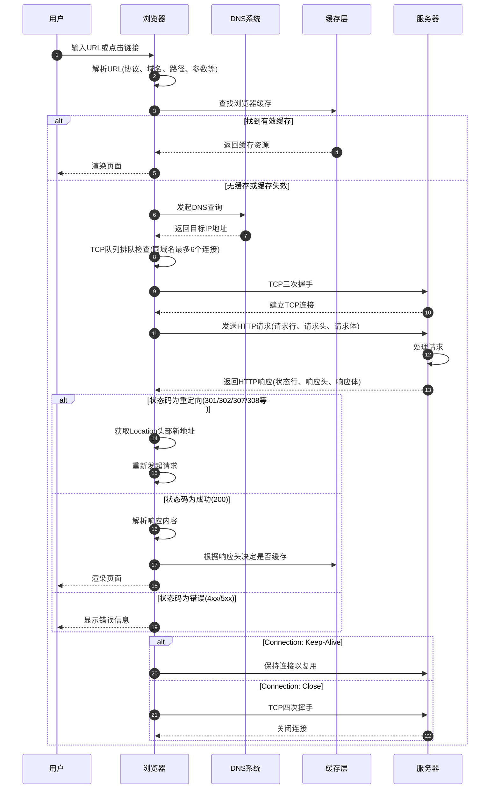
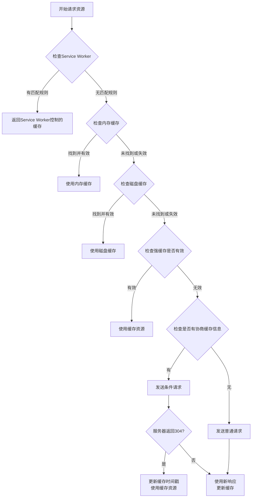
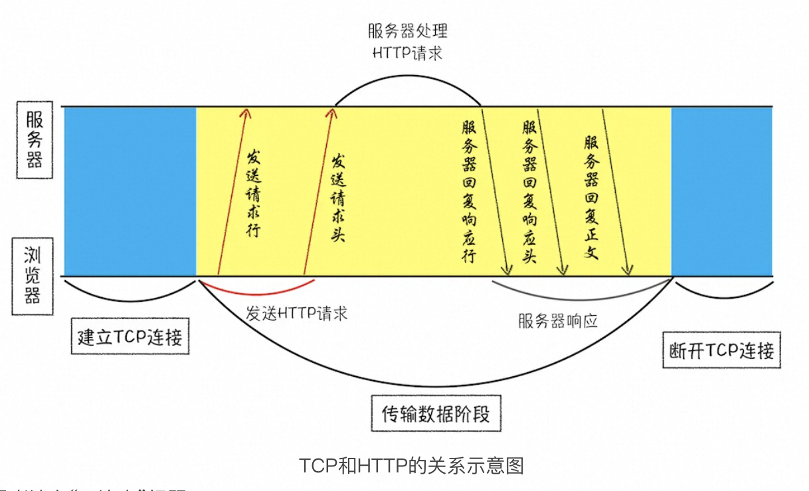
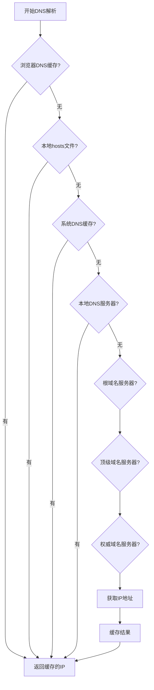
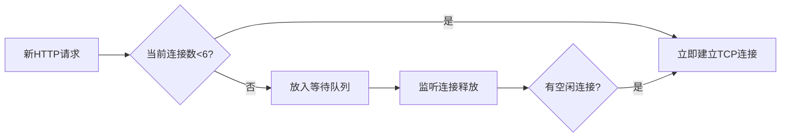
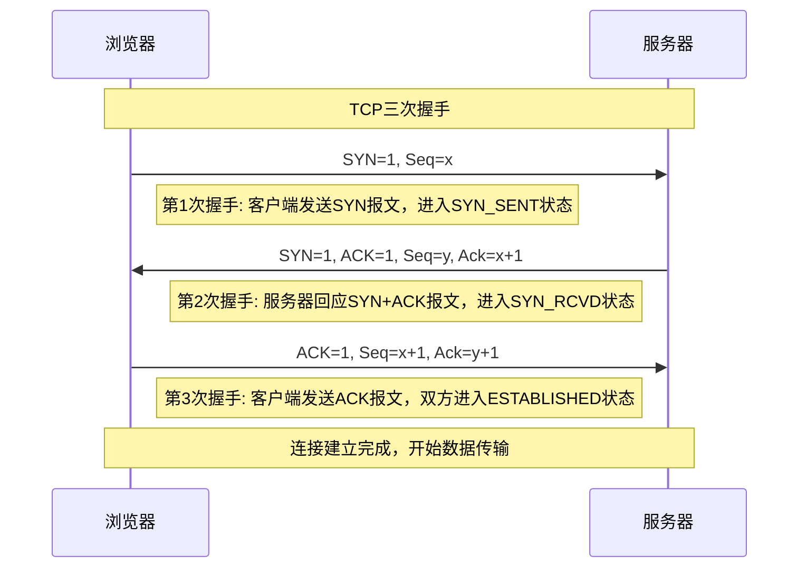
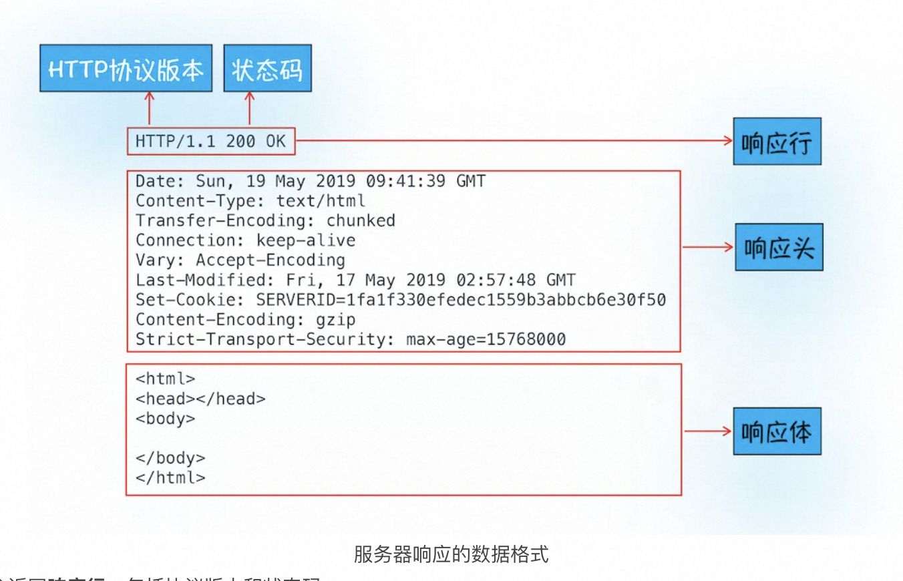
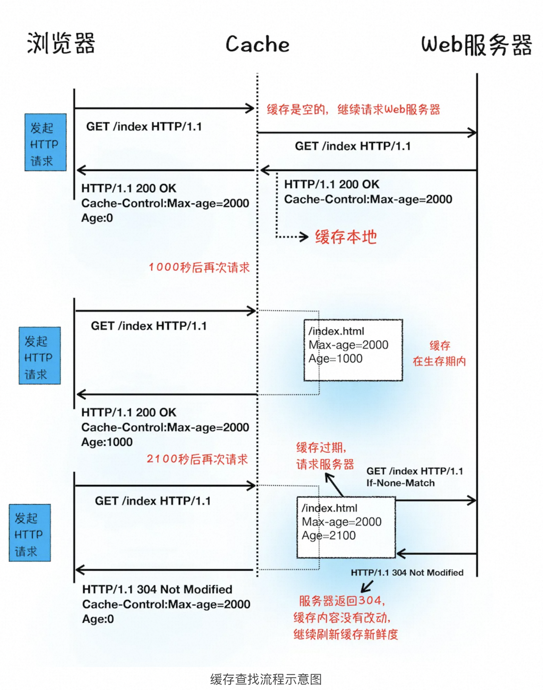
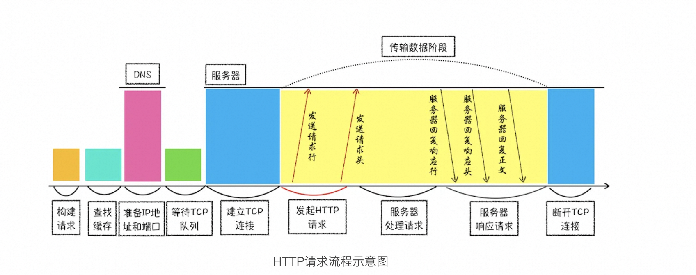

# HTTP 请求流程详解

HTTP（超文本传输协议）是Web应用程序的基础，理解其工作原理对于开发高效的Web应用至关重要。本文将详细解析HTTP请求的完整生命周期，从浏览器发起请求到服务器响应的全过程。


## 一、浏览器端发起 HTTP 请求流程

### 1.1 URL解析
在用户输入URL或点击链接后，浏览器首先需要解析URL的各个组成部分：

```text
https://www.example.com:443/path/resource.html?query=example#section
|      |        |       |   |                   |           |
协议    子域名    主域名   端口  路径              查询参数     片段标识符
```
- 协议：指定使用的通信协议，如HTTP或HTTPS
- 域名：标识资源所在的服务器
- 端口：指定服务器上的通信端口，HTTP默认80，HTTPS默认443
- 路径：指向服务器上的具体资源位置
- 查询参数：提供额外的请求信息
- 片段标识符：指向页面内的特定部分

### 1.2 请求构建

浏览器根据解析后的URL信息构建HTTP请求，这包括三个核心部分： 请求行、请求头、请求体.

**请求行：**
```js
GET /index.html HTTP1.1
```
- HTTP方法（如GET、POST、PUT、DELETE等）
- 请求URL路径
- HTTP协议版本

**请求头**
```json
Host: www.example.com
User-Agent: Mozilla/5.0 (Windows NT 10.0; Win64; x64) AppleWebKit/537.36
Accept: text/html,application/xhtml+xml,application/xml
Accept-Language: zh-CN,zh;q=0.9,en;q=0.8
Accept-Encoding: gzip, deflate, br
Connection: keep-alive
Cookie: session=abc123; user_id=456
Cache-Control: max-age=0
```
每个请求头字段都有特定的用途：

- Host: 指定请求的目标主机和端口
- User-Agent: 标识发起请求的客户端软件
- Accept: 表明客户端能够处理的内容类型
- Cookie: 携带之前服务器设置的状态信息
- Cache-Control: 指定缓存机制

**请求体：**

对于POST、PUT等方法，请求体包含发送到服务器的数据内容：
```text
// 表单提交示例 (application/x-www-form-urlencoded)
username=johndoe&password=secret

// JSON数据示例 (application/json)
{
  "username": "johndoe",
  "password": "secret"
}
```
### 1.3 查找缓存


在真正发起网络请求之前，浏览器会先在浏览器缓存中查询是否有要请求的文件。其中，**浏览器缓存是一种在本地保存资源副本，以供下次请求时直接使用的技术**。

缓存的层级结构包括：

1. 内存缓存（Memory Cache）

- 存储位置：RAM内存中
- 特点：读取速度最快，但容量有限，且页面关闭后失效
- 适用场景：频繁访问的小型资源，如页面内多次引用的图片、脚本等
- 优先级：最高

2. 磁盘缓存（Disk Cache）

- 存储位置：硬盘上
- 特点：容量大，持久化存储，但读取速度比内存慢
- 适用场景：大型资源和不太频繁访问的资源
- 优先级：次之

3. Service Worker 缓存

- 存储位置：由JavaScript控制的可编程缓存
- 特点：支持离线访问，可以精确控制缓存策略
- 适用场景：PWA应用，需要离线功能的网站
- 优先级：取决于Service Worker的具体实现

4. HTTP缓存（强缓存和协商缓存）

- 存储位置：通常在磁盘上
- 特点：由HTTP协议头部控制的标准缓存机制
- 适用场景：几乎所有Web资源

浏览器判断缓存是否可用的流程：



**强缓存(Strong Cache)：**强缓存是指在缓存有效期内，浏览器直接使用缓存而不与服务器进行任何交互。
特点：

- 完全不向服务器发送请求，直接从本地加载资源
- 响应状态码显示为200（但通常带有"from disk cache"或"from memory cache"标记）
- 网络面板中可能显示为"(disk cache)"或"(memory cache)"

控制方式：

1. Cache-Control（HTTP/1.1）
```text
Cache-Control: max-age=3600  // 缓存3600秒（1小时）
Cache-Control: public        // 可被任何缓存区缓存
Cache-Control: private       // 只能被浏览器缓存
Cache-Control: no-cache      // 每次使用前需要校验
Cache-Control: no-store      // 不缓存任何内容
```
2. Expires（HTTP/1.0）
```text
Expires: Wed, 21 Oct 2023 07:28:00 GMT  // 具体过期时间
```
优先级： Cache-Control 优先级高于 Expires


**协商缓存 (Negotiation Cache)：**协商缓存是指浏览器需要向服务器发送请求来确认缓存是否仍然有效。

特点：

- 需要发送请求到服务器进行校验
- 如果资源未变化，返回304状态码，浏览器继续使用缓存
- 如果资源已变化，返回200状态码和最新资源内容

控制方式：

1. ETag/If-None-Match（优先级更高）

```text
ETag: 资源的唯一标识符，类似指纹
If-None-Match: 客户端发送的ETag值
服务器响应头：ETag: "33a64df551425fcc55e4d42a148795d9f25f89d4"（资源的唯一标识符，类似指纹）
浏览器请求头：If-None-Match: "33a64df551425fcc55e4d42a148795d9f25f89d4"
```

2. Last-Modified/If-Modified-Since
```text
Last-Modified: 资源的最后修改时间
If-Modified-Since: 客户端发送的最后修改时间
服务器响应头：Last-Modified: Wed, 21 Oct 2023 07:28:00 GMT（资源最后修改时间）
浏览器请求头：If-Modified-Since: Wed, 21 Oct 2023 07:28:00 GMT
```

当浏览器发现请求的资源已经在浏览器缓存中存有副本，它会拦截请求，返回该资源的副本，并直接结束请求，而不会再去源服务器重新下载。这样做的好处有：

- 缓解服务器端压力，提升性能（获取资源的耗时更短了）
- 对于网站来说，缓存是实现快速资源加载的重要组成部分
  当然，如果缓存查找失败，就会进入网络请求过程了。

### 1.4  DNS解析

浏览器使用**HTTP 协议作为应用层协议**，用来封装请求的文本信息；并使用**TCP/IP 作传输层协议**将它发到网络上，所以在 HTTP 工作开始之前，浏览器需要通过 TCP 与服务器建立连接。也就是说**HTTP 的内容是通过 TCP 的传输数据阶段来实现的**，你可以结合下图更好地理解这二者的关系。



- HTTP 网络请求的第一步是做什么呢？结合上图看，**是和服务器建立 TCP 连接**。
- 获取建立连接的信息，**需要准备 IP 地址和端口号**。
- 利用**URL 地址来获取 IP 和端口信息**，URL 域名映射为 IP 的系统就叫做“**域名系统**”，简称**DNS**

**第一步浏览器会请求 DNS 返回域名对应的 IP**。当然浏览器还提供了 DNS 数据缓存服务，如果某个域名已经解析过了，那么浏览器会缓存解析的结果，以供下次查询时直接使用，这样也会减少一次网络请求。

拿到 IP 之后，接下来就需要获取端口号了。通常情况下，如果 URL 没有特别指明端口号，那么 HTTP 协议默认是 80 端口。

DNS查询遵循一个分层的解析过程：

DNS解析过程是递归和迭代相结合的：

1. 递归查询：本地DNS服务器代表客户端进行完整的域名解析
2. 迭代查询：DNS服务器返回下一级名称服务器的地址，客户端逐级查询

**DNS优化技术**

- DNS预解析：通过`<link rel="dns-prefetch" href="https://example.com">`提前解析域名
- DNS缓存：将解析结果缓存，减少重复查询
- 并行DNS查询：同时发起多个DNS请求
- 智能DNS决策：基于网络情况选择最佳DNS服务器


### 1.5 TCP连接建立

现在已经把端口和 IP 地址都准备好了，那么下一步是不是可以建立 TCP 连接了呢？

答案依然是“不行”。Chrome 有个机制，同一个域名同时最多只能建立 6 个 TCP 连接，如果在同一个域名下同时有 10 个请求发生，那么其中 4 个请求会进入排队等待状态，直至进行中的请求完成。


**TCP队列管理**

现代浏览器限制对同一域名的并发连接数（通常为6个），这是为了：
- 防止对服务器造成过大压力
- 避免网络拥塞
- 公平分配网络资源

当存在超过限制的请求时，浏览器将剩余请求放入队列中等待：




当然，如果当前请求数量少于 6，会直接进入下一步，建立 TCP 连接。

TCP建立连接的过程包括以下关键步骤([详情见TCP](./TCP协议.md))：



### 1.6 发送 HTTP 请求

一旦建立了 TCP 连接，浏览器就可以和服务器进行通信了。而 HTTP 中的数据正是在这个通信过程中传输的。


发送**请求行**，就是告诉服务器浏览器需要什么资源，最常用的请求方法是 Get。比如，直接在浏览器地址栏键入极客时间的域名（time.geekbang.org），这就是告诉服务器要 Get 它的首页资源。

另外一个常用的请求方法是 POST，它用于发送一些数据给服务器，比如登录一个网站，就需要通过 POST 方法把用户信息发送给服务器。如果使用 POST 方法，那么浏览器还要准备数据给服务器，这里准备的数据是通过请求体来发送。


在浏览器发送请求行命令之后，还要以请求头形式发送其他一些信息，把浏览器的一些基础信息告诉服务器。比如包含了浏览器所使用的操作系统、浏览器内核等信息，以及当前请求的域名信息、浏览器端的 Cookie 信息，等等。

常见HTTP方法及其用途：

- GET：获取资源，参数在URL中，幂等
- POST：创建资源，数据在请求体中
- PUT：更新资源，数据在请求体中，幂等
- DELETE：删除资源，幂等
- PATCH：部分更新资源
- HEAD：仅获取响应头，不返回响应体
- OPTIONS：询问服务器支持的方法和选项

除了基本请求头外，现代Web应用还会使用许多特殊用途的请求头：

安全相关：

- Authorization: 身份验证凭证
- Content-Security-Policy: 内容安全策略
- X-CSRF-Token: 跨站请求伪造保护令牌

内容协商：

- Accept-Language: 首选语言
- Accept-Encoding: 支持的压缩算法

跨域资源共享：

- Origin: 请求源
- Access-Control-Request-Method: 预检请求中声明的HTTP方法
- Access-Control-Request-Headers: 预检请求中声明的HTTP头

性能优化：

- Connection: keep-alive: 保持连接以复用
- Upgrade-Insecure-Requests: 告知服务器客户端支持HTTPS

## 二、服务器端处理 HTTP 请求流程

### 2.1 接收与解析请求

当服务器接收到来自客户端的HTTP请求后，首先需要进行请求的解析工作：

1. 解析请求行：提取HTTP方法、URL路径和协议版本
```text
GET /index.html HTTP/1.1
```
2. 解析请求头：将头部信息转换成键值对形式
```text
Host: example.com
User-Agent: Mozilla/5.0 ...
Cookie: sessionid=abc123
```

3. 解析请求体（如果存在）：根据Content-Type头部确定如何解析
  
- application/x-www-form-urlencoded: 表单数据
- application/json: JSON数据
- multipart/form-data: 文件上传
- 其他格式数据


### 2.2 返回请求



首先服务器会返回响应行，包括协议版本和状态码。

但并不是所有的请求都可以被服务器处理的，那么一些无法处理或者处理出错的信息，怎么办呢？服务器会通过请求行的状态码来告诉浏览器它的处理结果，比如：

- 最常用的状态码是 200，表示处理成功；
- 如果没有找到页面，则会返回 404。

随后，正如浏览器会随同请求发送请求头一样，服务器也会随同响应向浏览器发送**响应头**。响应头包含了服务器自身的一些信息，比如服务器生成返回数据的时间、返回的数据类型（JSON、HTML、流媒体等类型），以及服务器要在客户端保存的 Cookie 等信息。

发送完响应头后，服务器就可以继续发送响应体的数据，通常，响应体就包含了 HTML 的实际内容。

### 2.3 断开连接

通常情况下，一旦服务器向客户端返回了请求数据，它就要关闭 TCP 连接。不过如果浏览器或者服务器在其头信息中加入了：

```js
Connection: Keep - Alive
```

那么 TCP 连接在发送后将仍然保持打开状态，这样浏览器就可以继续通过同一个 TCP 连接发送请求。**保持 TCP 连接可以省去下次请求时需要建立连接的时间，提升资源加载速度**。比如，一个 Web 页面中内嵌的图片就都来自同一个 Web 站点，如果初始化了一个持久连接，你就可以复用该连接，以请求其他资源，而不需要重新再建立新的 TCP 连接。

### 2.4 重定向


响应行返回的状态码是 301，状态 301 就是告诉浏览器，我需要重定向到另外一个网址，而需要重定向的网址正是包含在响应头的 Location 字段中，接下来，浏览器获取 Location 字段中的地址，并使用该地址重新导航，这就是一个完整重定向的执行流程。

## 为什么很多站点第二次打开速度会很快？

如果第二次页面打开很快，主要原因是第一次加载页面过程中，缓存了一些耗时的数据。

**DNS 缓存**和**页面资源缓存**这两块数据是会被浏览器缓存的。



当服务器返回 HTTP 响应头给浏览器时，浏览器是**通过响应头中的 Cache-Control 字段来设置是否缓存该资源**。

通常，我们还需要为这个资源设置一个缓存过期时长，而这个时长是通过 Cache-Control 中的 Max-age 参数来设置的，比如上图设置的缓存过期时间是 2000 秒。`Cache-Control:Max-age=2000`

这也就意味着，在该缓存资源还未过期的情况下, 如果再次请求该资源，会直接返回缓存中的资源给浏览器。

但如果缓存过期了，浏览器则会继续发起网络请求，并且在 HTTP 请求头中带上：`If-None-Match:"4f80f-13c-3a1xb12a"`

服务器收到请求头后，会根据 If-None-Match 的值来判断请求的资源是否有更新。

- 如果没有更新，就返回 304 状态码，相当于服务器告诉浏览器：“这个缓存可以继续使用，这次就不重复发送数据给你了。”
- 如果资源有更新，服务器就直接返回最新资源给浏览器。

详细查看：https://developer.mozilla.org/zh-CN/docs/Web/HTTP/Caching

简要来说，很多网站第二次访问能够秒开，是因为这些网站把很多资源都缓存在了本地，浏览器缓存直接使用本地副本来回应请求，而不会产生真实的网络请求，从而节省了时间。同时，DNS 数据也被浏览器缓存了，这又省去了 DNS 查询环节。

## 登录状态是如何保持的？

- 用户打开登录页面，在登录框里填入用户名和密码，点击确定按钮。点击按钮会触发页面脚本生成用户登录信息，然后调用 POST 方法提交用户登录信息给服务器。

- 服务器接收到浏览器提交的信息之后，查询后台，验证用户登录信息是否正确，如果正确的话，会生成一段表示用户身份的字符串，并把该字符串写到响应头的 Set-Cookie 字段里，如下所示，然后把响应头发送给浏览器。`Set-Cookie: UID=3431uad;`

- 浏览器在接收到服务器的响应头后，开始解析响应头，如果遇到响应头里含有 Set-Cookie 字段的情况，浏览器就会把这个字段信息保存到本地。比如把`UID=3431uad`保持到本地。

- 当用户再次访问时，浏览器会发起 HTTP 请求，但在发起请求之前，浏览器会读取之前保存的 Cookie 数据，并把数据写进请求头里的 Cookie 字段里（如下所示），然后浏览器再将请求头发送给服务器。`Cookie: UID=3431uad;`

- 服务器在收到 HTTP 请求头数据之后，就会查找请求头里面的“Cookie”字段信息，当查找到包含 UID=3431uad 的信息时，服务器查询后台，并判断该用户是已登录状态，然后生成含有该用户信息的页面数据，并把生成的数据发送给浏览器。

- 浏览器在接收到该含有当前用户的页面数据后，就可以正确展示用户登录的状态信息了。

## 总结


