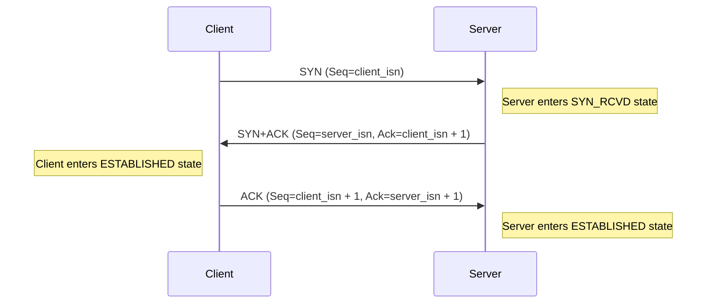
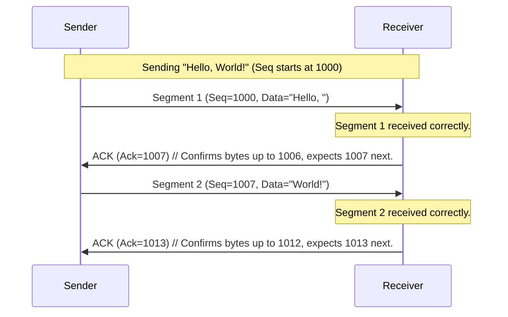
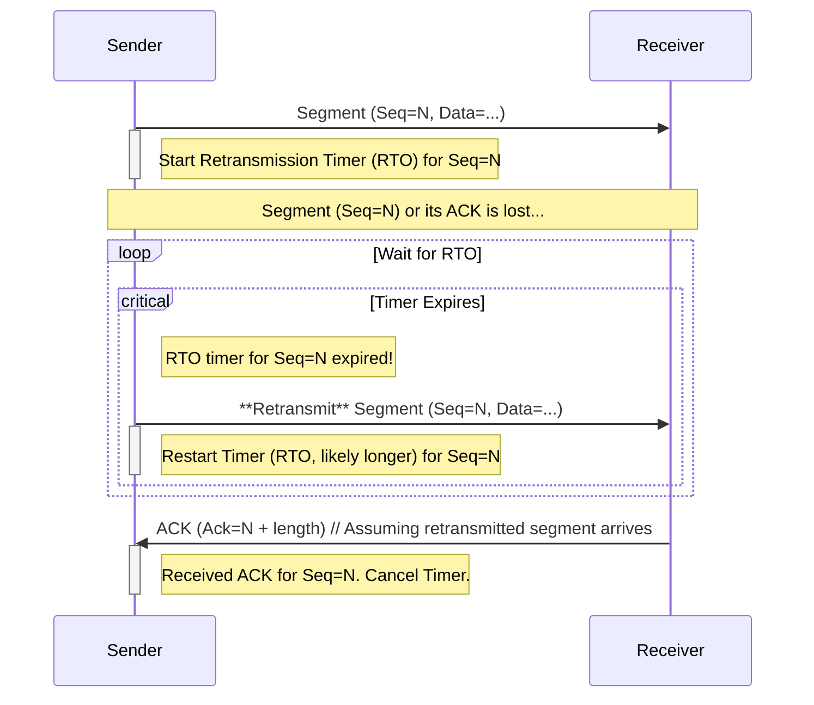
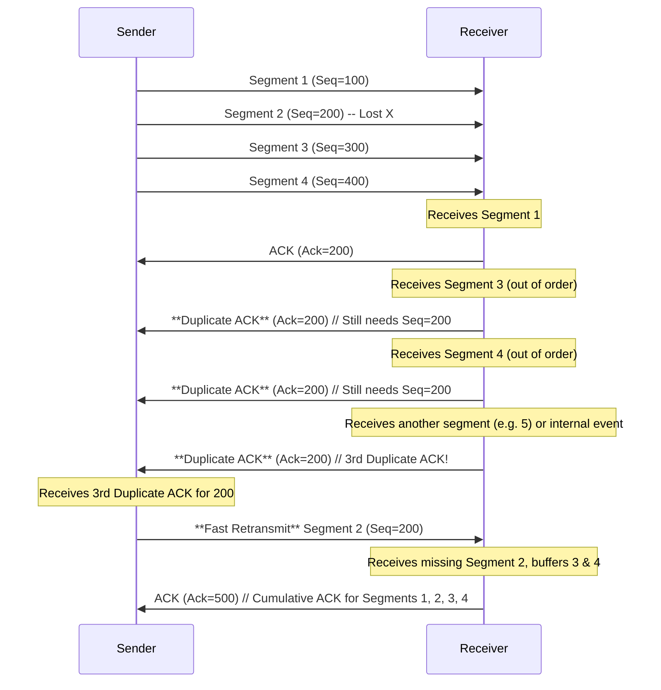
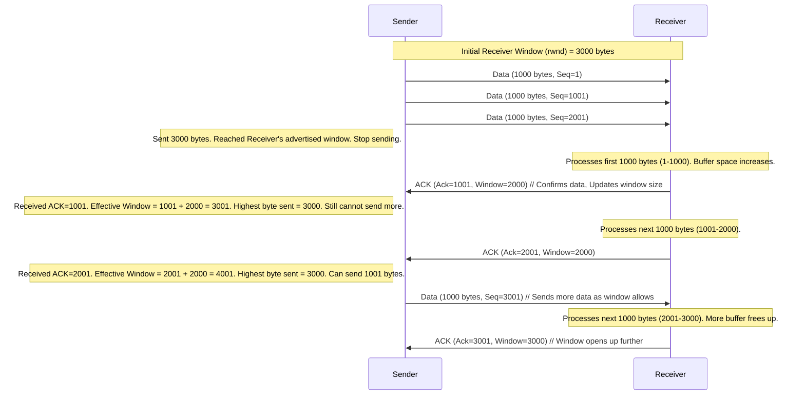
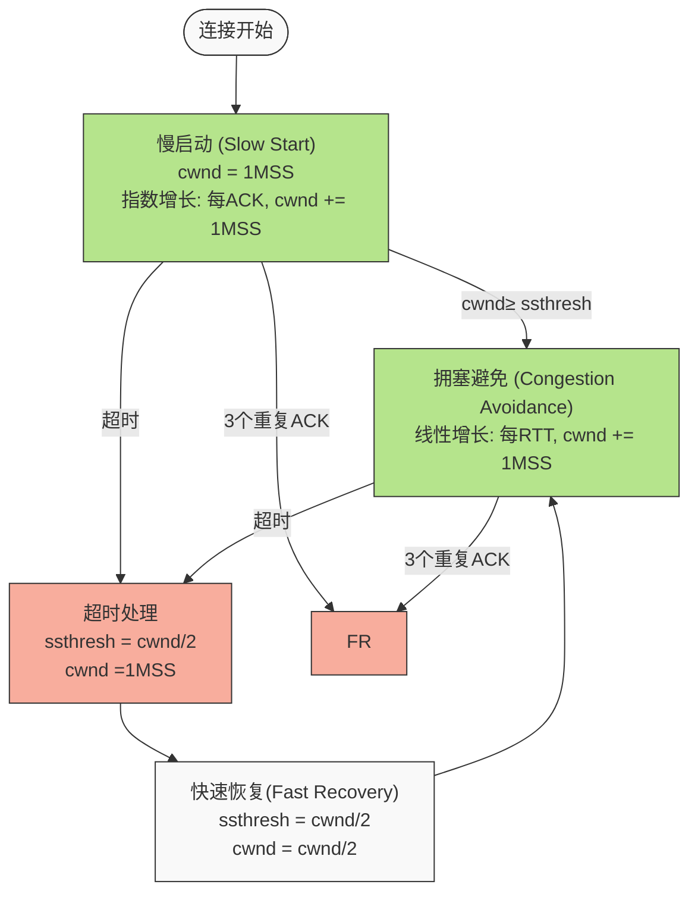
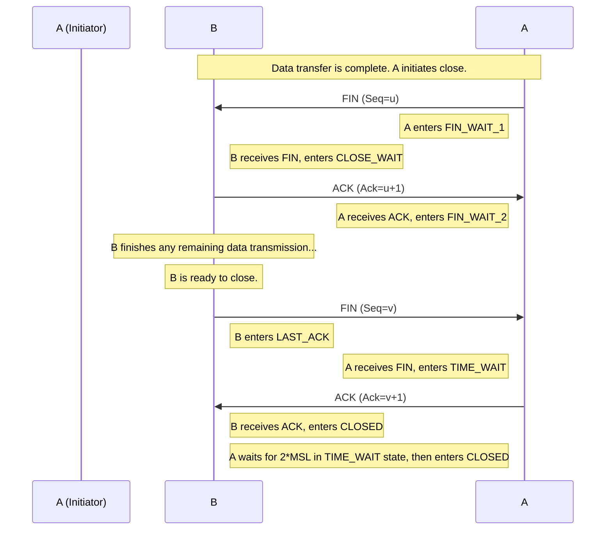

# 详解 TCP 协议 (Transmission Control Protocol) 🌐

在衡量 Web 页面性能的时候有一个重要的指标叫`“FP（First Paint）”`，是指从页面加载到首次开始绘制的时长。这个指标直接影响了用户的跳出率，更快的页面响应意味着更多的`PV`、更高的参与度，以及更高的转化率。那什么影响 FP 指标呢？其中一个重要的因素是网络加载速度。

要想优化 Web 页面的加载速度，你需要对网络有充分的了解。而理解网络的关键是要对网络协议有深刻的认识，不管你是使用 HTTP，还是使用 WebSocket，它们都是基于 TCP/IP 的，如果你对这些原理有足够了解，也就清楚如何去优化 Web 性能，或者能更轻松地定位 Web 问题了。此外，TCP/IP 的设计思想还有助于拓宽你的知识边界，从而在整体上提升你对项目的理解和解决问题的能力。

TCP (Transmission Control Protocol) 是互联网协议栈 (TCP/IP Suite) 中**传输层 (Transport Layer)** 的核心协议之一。它的主要目标是在不可靠的 IP 网络之上，为应用程序提供**可靠的、面向连接的、基于字节流**的通信服务。

想象一下，您在网上购物提交订单信息，或者下载一个大文件。您希望所有信息都完整无误、按顺序到达，TCP 就是保证这一点的关键协议。

下面我们分解 TCP 的关键机制：

---

## 1. 面向连接 (Connection-Oriented) 🤝

在实际数据传输之前，TCP 需要在通信双方（客户端和服务器）之间建立一个**逻辑连接**。这个过程被称为**三次握手 (Three-Way Handshake)**。

*   **🎯 目的:**
    *   确认双方都有发送和接收数据的能力。
    *   同步双方的初始序列号 (Initial Sequence Numbers, ISN)，这对后续的数据排序和确认至关重要。
    *   交换一些连接参数，如最大报文段长度 (Maximum Segment Size, MSS)。
*   **🔄 过程:**
    1.  **SYN (Synchronize):** 客户端选择一个初始序列号 `client_isn`，并向服务器发送一个 TCP 报文段 (Segment)，其中 `SYN` 标志位被设为 1，序列号字段 (Sequence Number) 为 `client_isn`。客户端状态变为 `SYN_SENT`。
    2.  **SYN-ACK (Synchronize-Acknowledgement):** 服务器收到 `SYN` 后，如果同意建立连接，会回复一个报文段。这个报文段的 `SYN` 标志位和 `ACK` (Acknowledgement) 标志位都设为 1。序列号字段是服务器选择的初始序列号 `server_isn`，确认号字段 (Acknowledgement Number) 是 `client_isn + 1` (表示期望收到客户端的下一个字节序号)。服务器状态变为 `SYN_RCVD`。
    3.  **ACK (Acknowledgement):** 客户端收到服务器的 `SYN-ACK` 后，发送一个确认报文段。该报文段 `ACK` 标志位设为 1，序列号是 `client_isn + 1`，确认号是 `server_isn + 1`。客户端状态变为 `ESTABLISHED`，服务器收到此 `ACK` 后也进入 `ESTABLISHED` 状态。
*   **💡 实际应用:** 当您在浏览器输入网址按回车，或者运行一个网络应用发起连接时，底层就会执行这个三次握手。如果握手失败（比如服务器不在线或端口未监听），您会收到连接错误。


---

## 2. 数据分段与封装 (Segmentation) 📦

应用程序（如 HTTP, FTP）产生的数据通常很大，而底层网络（如以太网）对能够传输的数据包大小有限制（MTU - Maximum Transmission Unit）。TCP 负责将应用程序的**字节流 (Byte Stream)** 数据分割成适合在 IP 网络中传输的、大小合理的**报文段 (Segment)**。

*   **⚙️ 过程:**
    *   TCP 从应用程序缓冲区读取数据流。
    *   根据路径 MTU 协商出的 MSS (Maximum Segment Size，通常是 MTU 减去 IP 和 TCP 头部大小)，将数据切割成块。
    *   为每个数据块添加 TCP 头部，形成 TCP 报文段。
    *   将 TCP 报文段交给 IP 层，IP 层再添加 IP 头部形成 IP 数据报 (Datagram) 进行发送。
*   **💡 实际应用:** 下载一个 10MB 的文件时，应用程序将整个文件数据交给 TCP。TCP 不会一次性发送 10MB，而是将其切分成数千个小的 TCP 报文段（每个通常约 1400 多字节），然后逐个交给 IP 层发送。

```text
         │TCP层分段处理   │ → 根据MSS(最大段大小)分割大数据└───────────────────┘
                          ↙↘
         ┌───────────────────┐┌───────────────────┐
         │  数据块1 + TCP头部 │  │  数据块2 + TCP头部 │ → 添加序号、确认号、控制位等
         │   (TCP段1/1460B)│  │   (TCP段2/1460B)  │
         └───────────────────┘  └───────────────────┘↓↓
         ┌───────────────────┐┌───────────────────┐
         │  TCP段1 + IP头部  │  │  TCP段2 + IP头部│ → 添加源IP、目标IP等
         │    (IP数据报1)    │  │    (IP数据报2)    │
         └───────────────────┘└───────────────────┘↓↓
         ┌───────────────────────────────────────────┐
         │数据链路层处理 (以太网、WiFi等)        │ → MTU约1500字节限制
         └───────────────────────────────────────────┘ ↓↓
         ┌───────────────────┐┌───────────────────┐
         │帧头+IP数据报1+帧尾│  │帧头+IP数据报2+帧尾│ → 添加MAC地址、校验和等
         │     (帧1)        │  │(帧2)        │
         └───────────────────┘  └───────────────────┘
                 ↓                       ↓┌───────────────────────────────────────────┐
         │              物理网络传输                 │ →电信号、光信号或无线电波
         └───────────────────────────────────────────┘

```
---

## 3. 序列号与确认号 (Sequencing and Acknowledgement) ✅ - 可靠性的基石

TCP 提供可靠传输的核心机制依赖于序列号和确认号。

*   **🔢 序列号 (Sequence Number):**
    *   TCP 将发送的数据看作一个连续的字节流。在建立连接时，双方会各自选择一个初始序列号 (ISN)。
    *   每个 TCP 报文段头部中的**序列号**字段，指的是该报文段所携带的**数据部分的第一个字节**在整个字节流中的编号。
    *   **作用:**
        *   接收方可以根据序列号对乱序到达的报文段进行**重新排序**。
        *   接收方可以检测到丢失的报文段（序号不连续）。
        *   用于处理重复的报文段（序列号相同）。
*   **👍 确认号 (Acknowledgement Number, ACK Number):**
    *   当接收方成功收到数据后，会向发送方发送一个确认 (ACK) 报文段（`ACK` 标志位设为 1）。
    *   头部中的**确认号**字段的值表示**期望收到的下一个字节的序列号**。这隐含地确认了该序号之前的所有字节都已经成功接收。这被称为**累积确认 (Cumulative ACK)**。
    *   **作用:** 告知发送方哪些数据已经安全到达，发送方可以据此清理其发送缓冲区中的已确认数据。
*   **💡 实际应用:** 您发送一条长消息 "Hello, World!"。TCP 可能将其分成两个段：Segment 1 (Seq=1000) 含 "Hello, "，Segment 2 (Seq=1007) 含 "World!"。接收方收到 Segment 1 后，可能回复一个 ACK 段，Ack Number=1007 (表示 1000 到 1006 都收到了，期待 1007)。收到 Segment 2 后，回复 ACK 段，Ack Number=1013 (表示 1007 到 1012 都收到了，期待 1013)。如果 Segment 1 丢失，接收方只会收到 Segment 2，它会持续发送 Ack Number=1000 的 ACK，提示发送方 Segment 1 (从 1000 开始的数据) 还没到。



---

## 4. 超时重传 (Timeout Retransmission) ⏱️ - 可靠性的保障

IP 网络本身是不可靠的，数据报可能会丢失、损坏或延迟。TCP 通过超时重传机制来处理数据丢失。

*   **🔄 过程:**
    1.  发送方每发送一个报文段，就启动一个**重传计时器 (Retransmission Timer)**。
    2.  如果在计时器超时之前收到了对该报文段的确认 (ACK)，则取消计时器。
    3.  如果在计时器超时后仍未收到确认，发送方就**假定**该报文段（或其 ACK）在网络中丢失了。
    4.  发送方**重新发送**该报文段，并设置一个新的、通常更长的超时时间（**指数退避 - Exponential Backoff**）。
*   **⏳ 超时时间计算 (RTO - Retransmission Timeout):** RTO 的设置至关重要。太短会导致不必要的重传，浪费带宽；太长会使连接在丢包时响应缓慢。TCP 动态地估算 RTO，它基于对**往返时间 (Round-Trip Time, RTT)** 的测量及其变化（抖动）。常用算法如 Jacobson/Karels 算法，考虑了 RTT 的平滑平均值 (SRTT) 和 RTT 的方差 (RTTVAR)。
*   **💡 实际应用:** 网络暂时拥堵导致您发送的一个数据段丢失。发送方等待了一小段时间（RTO）后没收到 ACK，就会重新发送这个数据段。如果网络持续不好，RTO 会逐渐变长，避免频繁重传加剧拥塞。


---

## 5. 快速重传 (Fast Retransmit) 🚀 - 可靠性的优化

超时重传机制在等待 RTO 时可能比较慢。快速重传是一种更快的丢包检测和恢复机制。

*   **🔄 过程:**
    1.  当发送方收到**三个或以上**的**重复确认 (Duplicate ACKs)** 时，即连续收到多个 ACK 号相同的确认报文段。
    2.  这通常意味着，接收方收到了该 ACK 号之后的一些乱序报文段，但 ACK 号指示的那个报文段尚未到达。
    3.  发送方不等 RTO 超时，**立即重传**那个被认为丢失的报文段 (ACK 号指示的那个段)。
*   **💡 实际应用:** 发送方连续发送了 Segment 1, 2, 3, 4, 5。如果 Segment 2 丢失，但 3, 4, 5 都到达了。接收方收到 1 后发 Ack=Seq(2)；收到 3 时，发现 2 没到，继续发 Ack=Seq(2) (重复 ACK 1)；收到 4 时，发现 2 没到，继续发 Ack=Seq(2) (重复 ACK 2)；收到 5 时，发现 2 没到，继续发 Ack=Seq(2) (重复 ACK 3)。当发送方收到第 3 个 Ack=Seq(2) 的重复 ACK 时，不等计时器到期，立刻重传 Segment 2。



---

## 6. 流量控制 (Flow Control) 🚰 - 防止淹没接收方

发送方的数据发送速率可能远超接收方的处理速率，导致接收方缓冲区溢出而丢弃数据。流量控制机制确保发送方不会发送超过接收方处理能力的数据量。

*   **🔧 机制:** **滑动窗口 (Sliding Window)**
    *   接收方在 TCP 头部中使用**窗口大小 (Window Size)** 字段，告知发送方自己当前还有多少可用的**接收缓冲区空间** (Receive Window, `rwnd`)。
    *   发送方维护一个**发送窗口**，其大小不能超过接收方通告的 `rwnd`。发送窗口定义了发送方可以发送但尚未收到确认的数据量上限。
    *   当接收方处理完数据，缓冲区释放空间后，它会在后续的 ACK 报文段中通告一个更大的 `rwnd`，允许发送方发送更多数据。窗口随数据的发送和确认而“滑动”。
*   **⚠️ 零窗口问题:** 如果接收方通告 `rwnd=0`，发送方会停止发送数据（除了特殊的“窗口探测”报文）。发送方会周期性发送小的探测报文，以查询接收方的窗口是否已经重新打开。
*   **💡 实际应用:** 您在用一个老旧电脑下载大文件，您的电脑处理数据的速度（如写入磁盘）跟不上网络下载速度。TCP 的流量控制会让服务器（发送方）根据您的电脑（接收方）通告的窗口大小放慢发送速度，避免您的电脑因缓冲区满而丢弃数据，从而减少不必要的重传。


---

## 7. 拥塞控制 (Congestion Control) 🚦 - 防止淹没网络

流量控制关心的是点对点的速率匹配，而拥塞控制关心的是整个**网络**的承载能力。当过多数据注入网络，超出路由器处理能力或链路容量时，就会发生**网络拥塞**，导致大量丢包和延迟增加。TCP 的拥塞控制旨在避免这种情况，并适应网络当前的拥塞状况。

*   **🔧 机制:** TCP 通过维护一个**拥塞窗口 (Congestion Window, `cwnd`)** 来实现拥塞控制。`cwnd` 是一个发送方内部的状态变量，代表了根据网络拥塞程度估计出的、可以向网络发送的数据量。
*   **实际发送窗口:** 发送方实际能发送的未确认数据量是 `min(cwnd, rwnd)`。
*   **拥塞控制算法 (以经典的 TCP Reno 为例):**
    1.  **慢启动 (Slow Start):** 连接建立初期或检测到严重拥塞（超时）后，`cwnd` 通常设为 1 个 MSS。每收到一个 ACK，`cwnd` 增加 1 个 MSS（指数增长，`cwnd` 大约每 RTT 翻倍）。目标是快速找到网络的可用带宽。
    2.  **拥塞避免 (Congestion Avoidance):** 当 `cwnd` 达到一个**慢启动阈值 (Slow Start Threshold, `ssthresh`)** 后，增长方式变为线性（加性增、AIMD 的 A 部分）。每经过一个 RTT（收到对一个窗口数据的确认），`cwnd` 增加 1 个 MSS。目标是温和地探测更多带宽，避免过快导致拥塞。
    3.  **拥塞检测:** TCP 主要通过两种方式推断网络拥塞：
        *   **RTO 超时:** 表明可能发生了较严重的拥塞。
        *   **收到 3 个重复 ACK:** 表明可能发生了轻微拥塞（个别丢包）。
    4.  **拥塞处理:**
        *   **检测到超时:** 将 `ssthresh` 设为当前 `cwnd` 的一半，并将 `cwnd` 重置为 1 MSS，重新进入**慢启动**阶段。这是非常激烈的反应。
        *   **检测到 3 个重复 ACK (触发快速重传):** 执行**快速恢复 (Fast Recovery)** 算法。将 `ssthresh` 设为当前 `cwnd` 的一半，并将 `cwnd` 也减半（乘性减、AIMD 的 MD 部分）。然后，不是进入慢启动，而是直接进入**拥塞避免**（或是在 Fast Recovery 阶段临时增加 cwnd 以便发送新数据，直到收到丢失段的 ACK 后再真正进入拥塞避免）。这种反应相对温和。
*   **✨ 现代拥塞控制算法:** TCP Reno 只是基础。现代操作系统使用更高级的算法，如 CUBIC (Linux 默认), BBR (Google 开发) 等，它们在高速、高延迟（长肥）网络等场景下表现更好。
*   **💡 实际应用:** 您开始下载文件时，下载速度可能很快（慢启动）。当网络接近饱和或出现丢包时，速度会降下来（进入拥塞避免或因拥塞处理而降低 `cwnd`），然后逐渐尝试恢复。这就是您在下载时看到速度波动的原因之一，TCP 在不断地调整发送速率以适应网络状况。


```text
cwnd
  ^
  |   /\                
  |/  \               /\
  |                 /    \             /\
  |                /      \           /    \
  |               /\         /      \___
  |              /\_______/
  |             /
  |            /
  |           /
  |         _/
  |       _/
  |     _/
  |   _/
  | _/
  +-----------------------------------------> 时间|    |       ||      |      |慢启动 拥塞避免  3DUP拥塞避免   超时    慢启动
                  ACK
```
---

## 8. 可靠性总结 ✅

TCP 通过以下机制协同工作，提供可靠的数据传输：

*   **数据分段与排序:** 使用序列号确保数据按正确顺序组装。
*   **确认机制:** ACK 告知发送方数据已收到。
*   **超时重传:** 处理数据段或 ACK 的丢失。
*   **快速重传:** 更快地处理个别数据段丢失。
*   **校验和 (Checksum):** TCP 和 IP 头部都有校验和字段，用于检测数据在传输过程中是否发生比特错误（损坏）。如果校验和不匹配，该报文段会被丢弃（然后可能触发重传）。
*   **流量控制:** 防止接收方被淹没。
*   **拥塞控制:** 防止网络被淹没。

---

## 9. 连接终止 (Connection Termination) 👋

当数据传输完成，需要关闭连接时，TCP 使用**四次挥手 (Four-Way Handshake)**。

*   **🔄 过程:** (假设 A 发起关闭)
    1.  **FIN (Finish):** A 发送一个 `FIN` 报文段，表示 A 没有更多数据要发送了。A 进入 `FIN_WAIT_1` 状态。
    2.  **ACK:** B 收到 `FIN` 后，发送一个 `ACK` 报文段确认收到 A 的 `FIN`。B 进入 `CLOSE_WAIT` 状态。A 收到 ACK 后进入 `FIN_WAIT_2` 状态。此时，连接处于**半关闭 (Half-Close)** 状态，A 不能再发送数据，但 B 可能还有数据要发送给 A。
    3.  **FIN:** 当 B 也没有数据要发送时，B 发送一个 `FIN` 报文段给 A。B 进入 `LAST_ACK` 状态。
    4.  **ACK:** A 收到 B 的 `FIN` 后，发送一个 `ACK` 确认。A 进入 `TIME_WAIT` 状态。B 收到这个 `ACK` 后，关闭连接，进入 `CLOSED` 状态。
*   **⏳ TIME_WAIT 状态:** A 在发送最后一个 `ACK` 后，会等待一段时间（通常是 2*MSL，Maximum Segment Lifetime，报文段最大生存时间），然后才进入 `CLOSED` 状态。目的是确保最后一个 `ACK` 能到达 B（如果 `ACK` 丢失，B 会重发 `FIN`，A 必须能响应），并防止本次连接中延迟的报文段干扰到后续可能使用相同端口号的新连接。



---

**总结:**

TCP 是一个复杂但极其重要的协议。它通过三次握手建立连接，使用序列号和确认号进行数据排序和确认，通过超时重传和快速重传处理丢包，利用滑动窗口进行流量控制，并通过慢启动、拥塞避免、快速恢复等机制进行拥塞控制，最后通过四次挥手断开连接。所有这些机制协同工作，使得应用程序开发者可以在不可靠的 IP 网络上构建可靠的应用，而不必亲自处理网络传输中的各种复杂问题。在实际应用中，TCP 的性能和行为（如速度波动、连接延迟）直接受到这些内部机制以及当前网络状况的影响。

