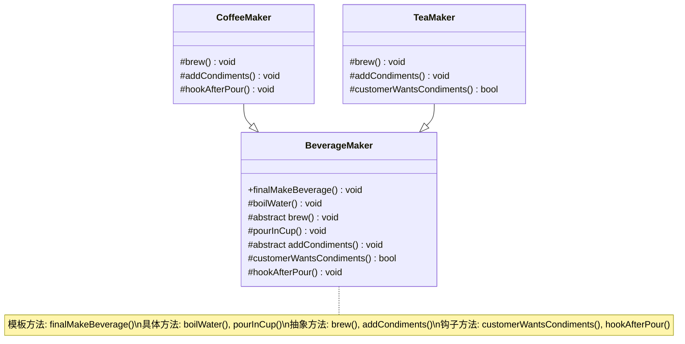

# 模版方法设计模式（Template Method Pattern）

模板方法模式在一个方法中定义一个算法的骨架，而将一些步骤延迟到子类中实现。这使得子类可以在不改变算法结构的情况下，重新定义算法中的某些特定步骤。

简单来说，想象一下你有一份制作饮品的说明书（比如咖啡或茶）。这份说明书规定了大致的步骤：烧水、冲泡、倒入杯中、加调料。其中，“烧水”和“倒入杯中”对于所有饮品都是一样的，但“冲泡”（用咖啡粉还是茶叶）和“加调料”（加糖奶还是柠檬）则会因具体饮品而异。模板方法模式就是把这份“说明书”抽象出来，通用步骤直接实现，变化步骤则留给具体的“饮品制作类”去实现。

## 核心概念

理解模板方法模式，需要掌握以下几个角色：

1. **抽象类 (AbstractClass)**：

- 包含一个**模板方法 (Template Method)**，该方法定义了算法的骨架。这个方法通常是 `public` 或 `protected` 且 final (在 TypeScript 中可以通过访问修饰符和约定来模拟 final 的效果，即不希望子类重写模板方法本身)。
- 包含一个或多个**抽象方法 (Abstract Operations)**，这些方法由子类来实现算法中的特定步骤。
- 可以包含**具体方法 (Concrete Operations)**，这些方法实现了算法中固定不变的部分，所有子类共享。
- 可以包含**钩子方法 (Hook Operations)**，这些方法提供了默认实现，子类可以选择性地覆盖它们，以控制算法的某些可选部分或流程。

2. **具体类 (ConcreteClass)**：

- 实现抽象类中的抽象方法，实现具体的算法步骤。
- 可以包含**具体方法 (Concrete Operations)**，这些方法实现了算法中固定不变的部分，所有子类共享。
- 可以包含**钩子方法 (Hook Operations)**，这些方法提供了默认实现，子类可以选择性地覆盖它们，以控制算法的某些可选部分或流程。

优点：

- 代码复用：将算法中公共的部分提取到父类中，避免了代码重复。
- 框架扩展：子类可以通过实现特定步骤来扩展算法的功能，而无需修改算法的整体结构。
- 控制反转：父类调用子类的操作，而不是子类调用父类，符合好莱坞原则 ("Don't call us, we'll call you")。父类定义了流程，子类负责实现细节。
- 封装不变部分，扩展可变部分：算法的结构是固定的（不变），但某些步骤是可变的。

## 案例（制作饮品）

让我们通过一个制作饮品的例子来理解模板方法模式。无论是制作咖啡还是茶，基本步骤是相似的，但具体冲泡内容和调料不同。

```ts
// 抽象类：BeverageMaker
abstract class BeverageMaker {
    // 模板方法：定义了制作饮品的完整流程
    // 我们不希望子类覆盖这个骨架流程，所以通常它不是抽象的
    public finalMakeBeverage(): void {
        this.boilWater();
        this.brew();
        this.pourInCup();
        if (this.customerWantsCondiments()) {
            this.addCondiments();
        }
        this.hookAfterPour(); // 另一个钩子方法
    }

    // 具体方法：所有饮品制作都需要烧水
    protected boilWater(): void {
        console.log("将水烧开");
    }

    // 抽象方法：冲泡过程，由子类实现
    protected abstract brew(): void;

    // 具体方法：所有饮品制作都需要倒入杯中
    protected pourInCup(): void {
        console.log("将饮品倒入杯中");
    }

    // 抽象方法：添加调料，由子类实现
    protected abstract addCondiments(): void;

    // 钩子方法：顾客是否需要调料？子类可以覆盖此方法
    protected customerWantsCondiments(): boolean {
        return true; // 默认需要调料
    }

    // 钩子方法：倒入杯子后的额外操作，子类可以覆盖
    protected hookAfterPour(): void {
        // 默认无操作
    }
}

// 具体类：CoffeeMaker
class CoffeeMaker extends BeverageMaker {
    protected brew(): void {
        console.log("用沸水冲泡咖啡粉");
    }

    protected addCondiments(): void {
        console.log("加入糖和牛奶");
    }

    // 覆盖钩子方法，假设这种咖啡默认不加额外的步骤
    protected hookAfterPour(): void {
        console.log("咖啡制作完成，搅拌均匀。");
    }
}

// 具体类：TeaMaker
class TeaMaker extends BeverageMaker {
    protected brew(): void {
        console.log("用沸水浸泡茶叶");
    }

    protected addCondiments(): void {
        console.log("加入柠檬片");
    }

    // 覆盖钩子方法，茶不需要调料
    protected customerWantsCondiments(): boolean {
        console.log("顾客说茶不需要额外调料。");
        return false;
    }
}

// 客户端代码
console.log("--- 制作咖啡 ---");
const coffee = new CoffeeMaker();
coffee.finalMakeBeverage();

console.log("\n--- 制作茶 ---");
const tea = new TeaMaker();
tea.finalMakeBeverage();
```

**代码解释：**

1. `BeverageMaker` 是抽象类，它定义了制作饮品的模板方法 `finalMakeBeverage()`。这个方法按照固定的顺序调用了其他基本操作。

- `boilWater()` 和 `pourInCup()` 是具体方法，因为它们对于所有饮品都是一样的。
- `brew()` 和 `addCondiments()` 是抽象方法，因为它们的具体实现会因饮品类型（咖啡、茶）而异，必须由子类提供。
- `customerWantsCondiments()` 是一个钩子方法。它提供了一个默认行为（返回 true），但子类可以覆盖它来改变算法的某个特定步骤（比如茶默认不加调料）。
- `hookAfterPour()` 也是一个钩子方法，允许子类在倒入杯中后执行一些可选操作。

2. `CoffeeMaker` 和 `TeaMaker` 是具体类。

- 它们都继承自 `BeverageMaker。`
- 它们各自实现了 `brew()` 和 `addCondiments()` 方法，以定义自己独特的冲泡方式和调料。
- `TeaMaker` 还覆盖了 `customerWantsCondiments()` 钩子方法，返回 false，表示茶通常不加调料（或者说，这个顾客不想要）。
- `CoffeeMaker` 覆盖了 `hookAfterPour()` 来添加一个咖啡特有的后续步骤。
- 当我们调用 `coffee.finalMakeBeverage()` 或 `tea.finalMakeBeverage()` 时，实际上是在执行 `BeverageMaker` 中定义的那个固定流程，但其中某些步骤会调用到具体子类 (`CoffeeMaker` 或 `TeaMaker`) 中实现的方法。

## UML 类图



**图例说明:**

- `BeverageMaker` 是抽象类 (通常用斜体表示，Mermaid 中可以通过 note 补充说明)。
- `CoffeeMaker` 和 `TeaMaker` 是具体类。
- 箭头 <|-- 表示继承关系 (`CoffeeMaker` 和 `TeaMaker` 继承自 `BeverageMaker`)。
- `+` 表示 `public` 方法。
- `#` 表示 `protected` 方法。
- `abstract` 关键字标记了抽象方法。

## 何时使用

- 当多个类有相似的算法，但具体步骤实现不同时。可以将算法的骨架提取到父类，具体步骤由子类实现。
- 当你想控制子类扩展的范围时。模板方法定义了算法的框架，子类只能在特定的扩展点（抽象方法、钩子方法）进行修改。
- 当需要复用大量代码，同时又允许特定行为的定制化。

## 总结 📝

模板方法模式是一种简单而强大的行为设计模式。它通过在抽象父类中定义算法的框架，并将一些可变步骤的实现延迟到子类，从而在保持算法结构不变的前提下，允许子类重新定义算法的某些特定步骤。这有助于代码复用和框架的搭建。对于前端开发来说，理解并运用它可以帮助我们构建更灵活、更易于维护的组件和逻辑模块。
