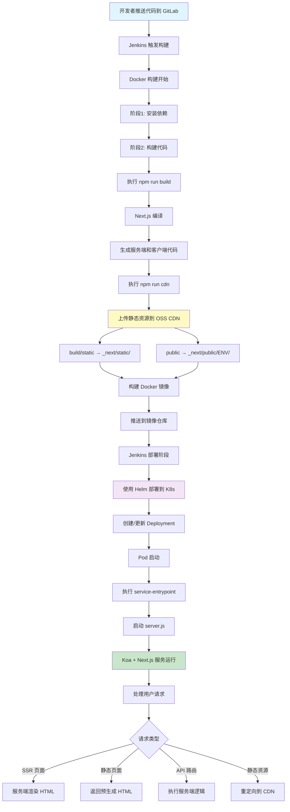
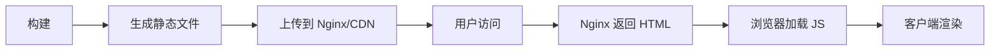
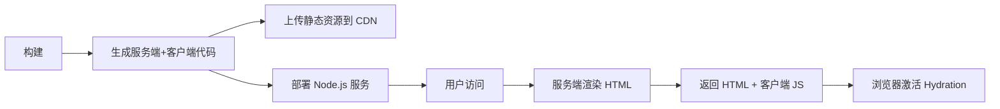

# Next.js 项目打包部署流程详解

## 📋 目录

1. [打包流程详解](#1-打包流程详解)
2. [部署上线流程](#2-部署上线流程)
3. [整体流程图](#3-整体流程图)
4. [与传统 CSR 项目的区别](#4-与传统-csr-项目的区别)

---

## 1. 打包流程详解

### 1.1 触发构建

构建通过 **Jenkins CI/CD** 触发，当代码推送到 GitLab 仓库时自动触发构建流程。

### 1.2 Docker 多阶段构建

项目使用 **Docker 多阶段构建**，分为三个阶段：

#### 阶段 1：依赖安装（deps）

```dockerfile
FROM registry.cn-hangzhou.aliyuncs.com/gaodingx/docker-base-images:node-20-onbuild-ubuntu AS deps
```

**执行步骤**：
1. 复制 `package.json`、`package-lock.json`、`patches` 等依赖相关文件
2. 安装 xprofiler（性能监控工具）
3. 执行 `npm install` 安装所有依赖（包括 devDependencies）
4. 删除 `.npmrc` 文件（安全考虑）

**目的**：利用 Docker 缓存机制，只有依赖文件变化时才重新安装依赖，提升构建速度。

#### 阶段 2：代码构建（builder）

```dockerfile
FROM registry.cn-hangzhou.aliyuncs.com/gaodingx/docker-base-images:node-20-onbuild-ubuntu AS builder
```

**执行步骤**：

1. **复制代码和依赖**
   ```dockerfile
   COPY . .
   COPY --from=deps /app/node_modules ./node_modules
   ```

2. **设置环境变量**
   ```dockerfile
   RUN echo "NEXT_PUBLIC_DEPLOY_ENV=$DEPLOY_ENV" >> .env
   RUN echo "NEXT_PUBLIC_VERSION=$(date '+%Y-%m-%d-%H')" >> .env
   ```
   - `DEPLOY_ENV`：部署环境（dev/fat/stage/prod）
   - `VERSION`：构建版本号（用于 CDN 缓存控制）

3. **执行 Next.js 构建**
   ```dockerfile
   RUN npm run build
   ```
   
   **Next.js 构建过程**：
   - **编译阶段**：
     - 编译 TypeScript/JavaScript 代码
     - 处理 Less/CSS 样式文件
     - 代码分割和优化
     - 生成服务端和客户端 bundle
   
   - **输出产物**（在 `build/` 目录）：
     ```
     build/
     ├── server/              # 服务端代码
     │   ├── chunks/          # 服务端代码块
     │   ├── pages/           # 页面服务端代码
     │   └── app.js           # Next.js 服务端入口
     ├── static/              # 静态资源
     │   ├── chunks/          # 客户端代码块
     │   ├── css/             # CSS 文件
     │   └── media/           # 图片等媒体文件
     ├── prerender-manifest.json  # 预渲染清单
     ├── routes-manifest.json     # 路由清单
     └── build-manifest.json      # 构建清单
     ```

4. **上传静态资源到 CDN**
   ```dockerfile
   RUN npm run env ... && npm run cdn
   ```
   
   **CDN 上传流程**（`cdn.js`）：
   - 上传 `build/static/` → `_next/static/`
   - 上传 `public/` → `_next/public/${DEPLOY_ENV}/`
   - 使用 OSS SDK 上传到阿里云 OSS
   - CDN 地址：`https://cdn.huaban.com`

#### 阶段 3：生产镜像（production）

```dockerfile
FROM registry.cn-hangzhou.aliyuncs.com/gaodingx/docker-base-images:node-20-onbuild-ubuntu
```

**执行步骤**：

1. **复制构建产物**
   ```dockerfile
   COPY --from=builder /app/build ./build
   COPY --from=builder /app/public ./public
   COPY --from=builder /app/server.js ./server.js
   COPY --from=builder /app/server ./server
   COPY --from=builder /app/node_modules ./node_modules
   ```

2. **设置生产环境变量**
   ```dockerfile
   ENV NODE_ENV production
   ENV NODE_OPTIONS --max-old-space-size=2048
   ```

3. **暴露端口**
   ```dockerfile
   EXPOSE 3000
   ENV PORT 3000
   ```

### 1.3 构建产物说明

#### Next.js 构建产物

1. **服务端代码**（`build/server/`）
   - 用于服务端渲染（SSR）
   - 包含页面组件、API 路由的服务端代码
   - 运行在 Node.js 环境中

2. **客户端代码**（`build/static/`）
   - 浏览器端运行的 JavaScript 和 CSS
   - 已上传到 CDN，通过 CDN 加速访问
   - 支持代码分割和懒加载

3. **静态文件**（`public/`）
   - 图标、字体、配置文件等
   - 已上传到 CDN：`_next/public/${DEPLOY_ENV}/`

#### 与传统项目的区别

- **传统 CSR**：只有客户端 bundle，所有代码都在浏览器执行
- **Next.js**：同时包含服务端和客户端代码，支持 SSR/SSG

---

## 2. 部署上线流程

### 2.1 Jenkins 构建阶段

```groovy
stage('Build') {
    sh '''
        dind-container-build \
            -a "OSS_ACCESS_KEY=${OSS_ACCESS_KEY}" \
            -a "DEPLOY_ENV=${DEPLOY_ENV}" \
            -a "GIT_BRANCH=${GIT_BRANCH}" \
            -i "${GIT_COMMIT}"
    '''
}
```

**执行内容**：
1. 使用 `dind-container-build` 命令构建 Docker 镜像
2. 传入环境变量（OSS 凭证、部署环境等）
3. 使用 Git Commit SHA 作为镜像标签
4. 推送到容器镜像仓库

### 2.2 Jenkins 部署阶段

```groovy
stage('Deploy') {
    when(whenHelper.checkRuntimeEnvNameIn(['dev', 'fat', 'stage', 'prod'])) {
        sh '''
            dind-helm-upgrade-v3 \
                -i "${GIT_COMMIT}" \
                -a "${HELM_APP_NAME_APP}" \
                -r "${HELM_RELEASE_NAME_APP}" \
                -c "${HELM_CHART_NAME}" \
                --kubectx "${K8S_CONTEXT}" \
                --kubens "${K8S_NAMESPACE}"
        '''
    }
}
```

**执行内容**：
1. 使用 Helm 部署到 Kubernetes 集群
2. 根据环境（dev/fat/stage/prod）选择不同的 K8s 上下文
3. 执行滚动更新，零停机部署

### 2.3 Kubernetes 部署

**部署配置**（通过 Helm Chart）：
- **副本数**：根据环境配置（生产环境通常 2+ 个 Pod）
- **资源限制**：CPU、内存限制
- **健康检查**：Liveness 和 Readiness 探针
- **服务发现**：通过 Service 暴露服务

**启动流程**：
1. 容器启动时执行 `service-entrypoint`
2. `service-entrypoint` 调用 `launch.js`
3. `launch.js` 复制环境变量文件并启动 `server.js`
4. `server.js` 启动 Koa 服务器，监听 3000 端口

### 2.4 服务运行

**Next.js 服务端架构**：

```javascript
// server.js
const next = require('next');
const app = next({ dev: false });
const handle = app.getRequestHandler();

app.prepare().then(() => {
    const serve = new Koa();
    // 添加中间件：认证、缓存、日志等
    serve.use(authTokenMiddleware);
    serve.use(pageCacheMiddleware);
    // ...
    
    serve.listen(3000);
});
```

**请求处理流程**：
1. 请求到达 Koa 服务器
2. 经过中间件处理（认证、缓存等）
3. 转发给 Next.js 处理
4. Next.js 根据路由决定：
   - **SSR 页面**：服务端渲染 HTML
   - **静态页面**：返回预生成的 HTML
   - **API 路由**：执行服务端逻辑
   - **静态资源**：返回文件或重定向到 CDN

---

## 3. 整体流程图



### 3.1 关键时间点

| 阶段 | 操作 | 输出 |
|------|------|------|
| **构建时** | `npm run build` | 生成 `build/` 目录 |
| **构建时** | `npm run cdn` | 上传到 CDN |
| **运行时** | `node server.js` | 启动服务端 |
| **运行时** | 用户请求 | SSR/SSG/API 响应 |

---

## 4. 与传统 CSR 项目的区别

### 4.1 构建产物对比

| 特性 | 传统 CSR 项目 | Next.js 项目 |
|------|--------------|--------------|
| **构建产物** | 只有客户端 bundle | 服务端 + 客户端代码 |
| **HTML 生成** | 静态 HTML 模板 | 服务端动态生成或预生成 |
| **代码分割** | 手动配置 | 自动按页面分割 |
| **静态资源** | 打包在 bundle 中 | 可上传到 CDN |

### 4.2 部署方式对比

#### 传统 CSR 项目



**特点**：
- 构建后生成纯静态文件（HTML、JS、CSS）
- 部署到 Nginx 或静态服务器
- 所有渲染在浏览器端完成
- 首次加载需要下载所有 JS 代码

#### Next.js 项目



**特点**：
- 构建后生成服务端和客户端代码
- 需要 Node.js 运行环境
- 支持服务端渲染（SSR）和静态生成（SSG）
- 首次加载即可看到内容，SEO 友好

### 4.3 详细对比表

| 对比项 | 传统 CSR | Next.js |
|--------|---------|---------|
| **服务器要求** | Nginx/静态服务器 | Node.js 服务器 |
| **首次加载** | 白屏 → 加载 JS → 渲染 | 直接显示 HTML |
| **SEO** | 需要预渲染或 SSR | 原生支持 SSR/SSG |
| **部署复杂度** | 简单（静态文件） | 复杂（需要 Node.js 环境） |
| **性能优化** | 手动优化 | 自动代码分割、预加载 |
| **API 路由** | 需要单独后端 | 内置 API Routes |
| **缓存策略** | 静态资源缓存 | 页面级缓存 + 静态资源缓存 |
| **开发体验** | 需要配置路由、构建工具 | 约定式路由，开箱即用 |

### 4.4 性能对比

#### 传统 CSR 项目

```
用户请求 → Nginx 返回 index.html
         → 浏览器解析 HTML
         → 下载并执行 JS（可能很大）
         → 发起 API 请求
         → 渲染页面内容
```

**问题**：
- 首次加载时间长（需要下载所有 JS）
- 白屏时间长
- SEO 不友好（搜索引擎无法抓取动态内容）

#### Next.js 项目

```
用户请求 → Node.js 服务端渲染
         → 返回完整 HTML（包含内容）
         → 浏览器显示内容
         → 下载并执行客户端 JS（Hydration）
         → 页面可交互
```

**优势**：
- 首次加载即可看到内容
- SEO 友好（搜索引擎可抓取 HTML）
- 自动代码分割，只加载需要的代码
- 支持预渲染，进一步提升性能

### 4.5 部署架构对比

#### 传统 CSR 架构

```
┌─────────┐
│  Nginx  │ ← 静态文件服务器
└─────────┘
     │
     ├─ index.html
     ├─ bundle.js (可能很大)
     └─ styles.css
```

#### Next.js 架构

```
┌─────────────┐      ┌──────────┐
│   K8s Pod   │      │   CDN    │
│             │      │          │
│  Node.js    │ ←─── │ 静态资源  │
│  + Next.js  │      │ (JS/CSS) │
└─────────────┘      └──────────┘
     │
     ├─ SSR 页面
     ├─ SSG 页面
     └─ API 路由
```

### 4.6 缓存策略对比

#### 传统 CSR

- **HTML**：通常不缓存或短缓存
- **JS/CSS**：通过文件名 hash 实现长期缓存
- **API 数据**：客户端缓存或 CDN 缓存

#### Next.js

- **SSR 页面**：服务端缓存（Redis/内存）
- **SSG 页面**：构建时生成，可长期缓存
- **静态资源**：CDN 缓存（长期）
- **API 路由**：可配置缓存策略

---

## 5. 总结

### Next.js 项目的优势

1. **更好的 SEO**：服务端渲染，搜索引擎可直接抓取内容
2. **更快的首屏**：服务端生成 HTML，用户立即看到内容
3. **自动优化**：代码分割、预加载、图片优化等开箱即用
4. **灵活的渲染策略**：SSR、SSG、ISR 可根据需求选择

### 部署复杂度

- **需要**：Node.js 运行环境、容器化部署、K8s 管理
- **成本**：服务器资源、运维复杂度增加
- **收益**：更好的用户体验、SEO、性能

### 适用场景

**适合使用 Next.js**：
- 需要 SEO 的网站（内容站、电商等）
- 需要快速首屏加载的应用
- 需要服务端渲染的复杂应用

**适合传统 CSR**：
- 纯后台管理系统（不需要 SEO）
- 简单的单页应用
- 对服务器资源有限制的场景

---

## 6. 参考资料

- [Next.js 官方文档](https://nextjs.org/docs)
- [Next.js 部署文档](https://nextjs.org/docs/deployment)
- [Docker 多阶段构建](https://docs.docker.com/build/building/multi-stage/)
- [Kubernetes 部署](https://kubernetes.io/docs/concepts/workloads/controllers/deployment/)


