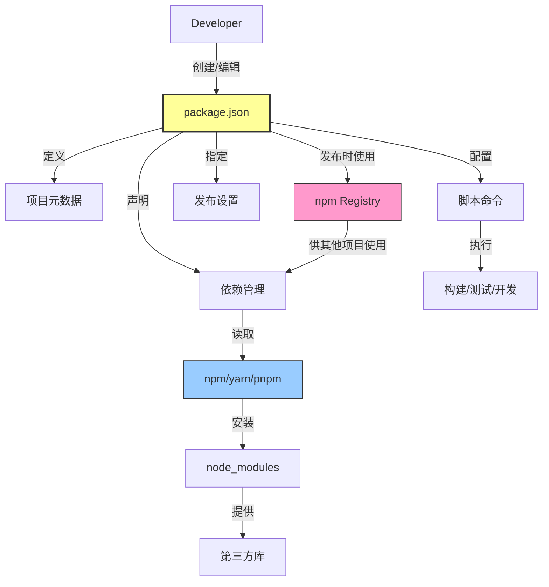
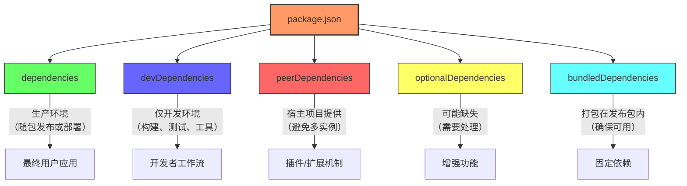
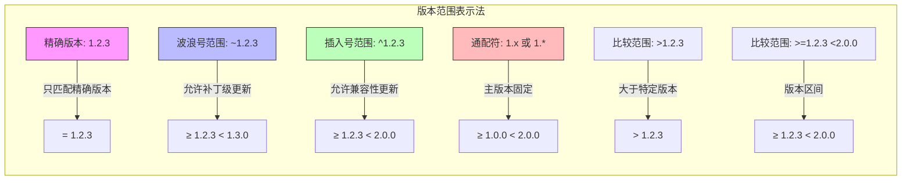
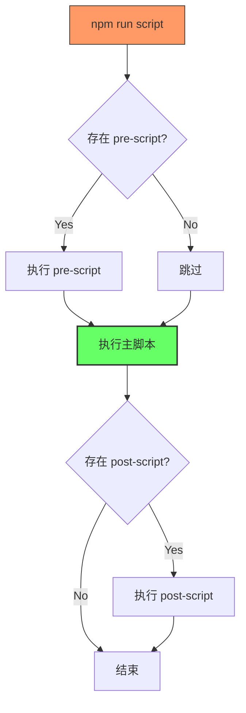
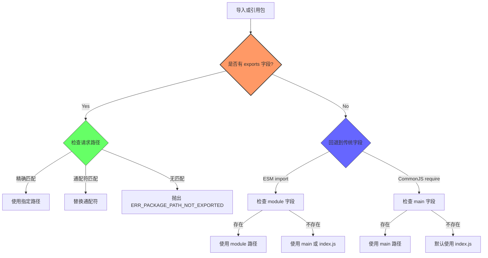
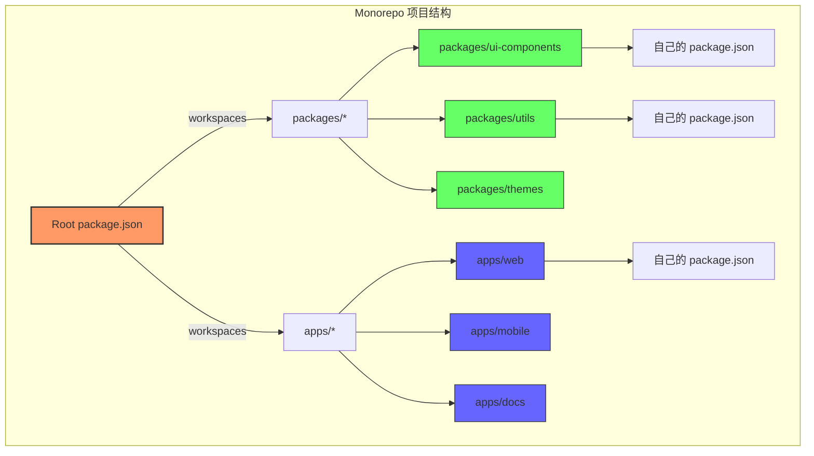
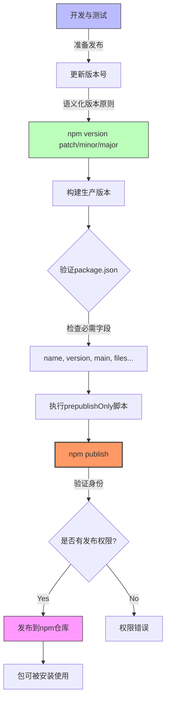
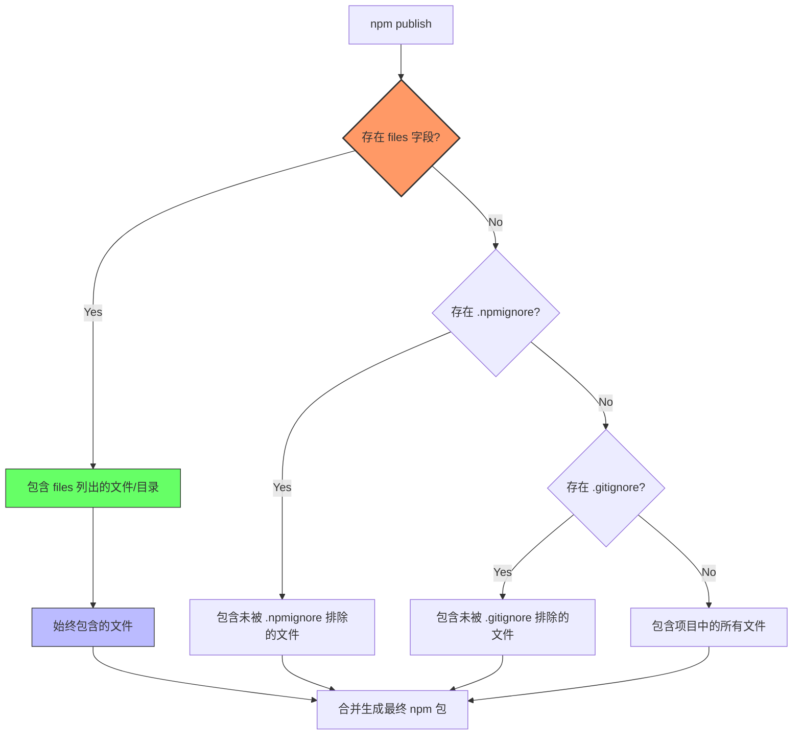
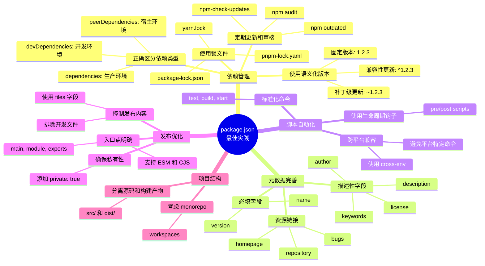

# 🚀 `package.json` 全方位深度解析：从入门到精通 掌握Node.js项目的核心

---

## ✨ 引言：`package.json` 是什么？为什么它如此重要？

在 Node.js 的世界里，无论是构建后端服务、开发前端应用（借助 Webpack、Vite 等工具），还是编写命令行工具，你几乎总会遇到一个名为 `package.json` 的文件。这个文件可以说是 **Node.js 项目的身份证和说明书**。

> `package.json` 是一个 JSON 格式的文件，它位于项目的根目录下，用于描述项目的元数据（名称、版本、作者等）、管理项目依赖、定义可执行脚本以及配置其他与项目相关的工具和环境信息。

**它的重要性体现在：**

1.  **依赖管理**：npm、yarn、pnpm 等包管理工具依赖此文件来识别、下载、安装和管理项目所需的第三方库。
2.  **项目描述**：提供了项目的基本信息，方便他人理解和协作。
3.  **脚本执行**：定义了常用的开发、构建、测试等命令，简化工作流程。
4.  **版本控制**：明确了项目的版本号，遵循语义化版本（SemVer）有助于依赖管理和发布。
5.  **发布规范**：对于要发布到 npm 公共或私有仓库的包，`package.json` 是必需的，它规定了包的入口、包含的文件等。
6.  **环境配置**：可以指定项目运行所需的 Node.js 版本、操作系统等。

### package.json 在 Node.js 生态系统中的位置



无论你是刚入门的初学者，还是有一定经验的开发者，深入理解 `package.json` 的各个字段都将极大地提升你对 Node.js 生态和项目管理的掌控力。

---

## 🛠️ 如何创建 `package.json` 文件？

通常有两种方式：

1.  **交互式创建**：在项目根目录下运行 `npm init` 或 `yarn init`。系统会提出一系列问题（如包名、版本、描述等），根据你的回答生成文件。
    ```bash
    npm init
    # 或者
    yarn init
    ```
2.  **快速创建（使用默认值）**：如果你想快速生成一个包含基本默认值的 `package.json`，可以使用 `-y` 标志。
    ```bash
    npm init -y
    # 或者
    yarn init -y
    ```

---

## 📖 `package.json` 核心字段详解

下面我们将逐一解析 `package.json` 中常见且重要的字段。

### 1. 基础元数据 (Metadata)

这些字段定义了项目的基本身份信息。

*   **`name`** (必需)
    *   **说明**：项目的名称。必须是小写字母，可以包含连字符 (`-`) 或下划线 (`_`)。对于要发布到 npm 的包，这个名称必须是唯一的。
    *   **命名规则**：
        *   长度通常小于 214 个字符。
        *   不能以点 (`.`) 或下划线 (`_`) 开头。
        *   不能包含大写字母（虽然某些包管理器可能容忍，但 npm 强制小写）。
        *   不能包含任何 URL 不安全的字符。
    *   **应用场景**：
        *   包发布到 npm 时的唯一标识符。
        *   在 `node_modules` 目录下的文件夹名称。
        *   如果使用了 npm scope (`@scope/package-name`)，则 `name` 字段会包含 scope。
    *   **示例**：`"my-awesome-app"`, `"@my-org/utils"`

*   **`version`** (必需)
    *   **说明**：项目的当前版本号。强烈建议遵循 **语义化版本控制（SemVer）** 规范 (`MAJOR.MINOR.PATCH`)。
        *   `MAJOR`：当你做了不兼容的 API 修改。
        *   `MINOR`：当你做了向下兼容的功能性新增。
        *   `PATCH`：当你做了向下兼容的问题修正。
    *   **应用场景**：
        *   标识包的不同发布版本。
        *   依赖管理工具根据版本号解析和安装依赖。
        *   帮助开发者了解更新的影响范围。
    *   **示例**：`"1.0.0"`, `"0.2.1-beta.3"` (预发布版本)

*   **`description`**
    *   **说明**：项目的简短描述。这个字符串有助于人们在 `npm search` 或 npm 网站上发现你的包。
    *   **应用场景**：
        *   提供项目概述，方便他人理解项目用途。
        *   在 npm 搜索结果中展示。
    *   **示例**：`"A utility library for handling dates and times."`

*   **`keywords`**
    *   **说明**：一个字符串数组，包含与项目相关的关键字。
    *   **应用场景**：
        *   提高项目在 `npm search` 中的可发现性。
    *   **示例**：`["date", "time", "moment", "formatting"]`

*   **`license`**
    *   **说明**：项目的开源许可证标识符（例如 "MIT", "ISC", "Apache-2.0"）或 указывающий "UNLICENSED" (对于私有、不发布的项目)。
    *   **应用场景**：
        *   明确代码的使用、修改和分发权限，保护作者和用户。
        *   符合开源社区规范。
    *   **示例**：`"MIT"`

*   **`author`**, **`contributors`**
    *   **说明**：
        *   `author`：项目的主要作者（一个人）。通常是包含姓名、邮箱和网址的对象或字符串。
        *   `contributors`：项目的贡献者列表（多个人），格式与 `author` 类似，是一个对象数组。
    *   **应用场景**：
        *   署名，明确项目的开发者和贡献者。
    *   **示例**：
        ```json
        "author": "Your Name <your.email@example.com> (https://yourwebsite.com)",
        "contributors": [
          { "name": "Contributor One", "email": "one@example.com" },
          { "name": "Contributor Two", "url": "https://two.example.com" }
        ]
        ```

*   **`homepage`**
    *   **说明**：项目的官方网站或文档页面的 URL。
    *   **应用场景**：
        *   在 npm 页面上提供项目主页链接。
        *   方便用户查找更多信息或文档。
    *   **示例**：`"https://github.com/yourusername/my-awesome-app#readme"`

*   **`repository`**
    *   **说明**：项目源代码仓库的位置。通常包含 `type` (如 "git") 和 `url`。
    *   **应用场景**：
        *   在 npm 页面提供源码链接。
        *   某些自动化工具可能使用此信息。
    *   **示例**：
        ```json
        "repository": {
          "type": "git",
          "url": "git+https://github.com/yourusername/my-awesome-app.git"
        }
        ```

*   **`bugs`**
    *   **说明**：指向项目问题跟踪系统的 URL 或邮箱地址。
    *   **应用场景**：
        *   方便用户报告 Bug。
        *   在 npm 页面提供 "Report a Bug" 链接。
    *   **示例**：
        ```json
        "bugs": {
          "url": "https://github.com/yourusername/my-awesome-app/issues",
          "email": "bugs@example.com"
        }
        ```

### 2. 依赖管理 (Dependencies)

这是 `package.json` 最核心的功能之一，用于声明项目所需的外部库。

#### 依赖类型可视化



#### 不同包管理器的依赖处理差异

| 特性 | npm | yarn | pnpm |
|-----|-----|------|------|
| **依赖安装机制** | 嵌套 + 扁平化 | 扁平化 | 内容寻址存储 |
| **node_modules 结构** | 扁平化目录 | 扁平化目录 | 符号链接结构 |
| **避免重复安装** | 部分支持 | 支持 | 完全支持 |
| **幽灵依赖问题** | 存在 | 存在 | 基本避免 |
| **安装速度** | 较慢 | 中等 | 最快 |
| **磁盘空间使用** | 高 | 高 | 低 |
| **锁文件** | package-lock.json | yarn.lock | pnpm-lock.yaml |

**幽灵依赖 (Phantom Dependencies)**: 指项目中使用但未在 package.json 中声明的依赖。由于 npm/yarn 的扁平化 node_modules 结构，项目可能访问到其他依赖包的依赖，这是一种隐患。

*   **`dependencies`**
    *   **说明**：项目**生产环境**运行时必需的依赖包。这些包会被一起打包或部署到最终运行环境中。
    *   **应用场景**：
        *   例如 Web 框架 (`express`, `koa`)、数据库 ORM (`sequelize`, `mongoose`)、前端框架 (`react`, `vue`)、工具库 (`lodash`, `axios`) 等。
        *   当别人安装你的包时（如果你的项目是一个库），这些依赖也会被自动安装（除非它们是 `peerDependencies`）。
        *   运行 `npm install <package-name>` 或 `yarn add <package-name>` 时，默认会将包添加到此列表。
    *   **技术细节**：
        * 在 `npm install --production` 或 `NODE_ENV=production` 环境下，只会安装这类依赖
        * 包含在这里的依赖会影响你的应用在生产环境的大小和加载性能
        * 对于前端应用，构建工具通常只会将这些依赖（或其一部分）打包到最终代码中
    *   **示例**：
        ```json
        "dependencies": {
          "axios": "^1.4.0",
          "lodash": "~4.17.21",
          "react": "18.x"
        }
        ```
    *   **版本号说明**：
        *   `^1.4.0`: 允许安装 `1.x.x` 系列的最新版本（不低于 `1.4.0`，但不包括 `2.0.0`）。
        *   `~4.17.21`: 允许安装 `4.17.x` 系列的最新版本（不低于 `4.17.21`，但不包括 `4.18.0`）。
        *   `18.x`: 允许安装 `18.*.*` 系列的最新版本。
        *   `*` 或 `latest`: 安装最新版本（不推荐，可能引入破坏性更新）。
        *   固定版本 `1.2.3`: 只安装 `1.2.3` 版本。

### 语义化版本控制 (SemVer) 详解

语义化版本控制 (Semantic Versioning) 是软件版本号的事实标准，采用 `主版本号.次版本号.修订号` 格式（如 `1.2.3`）。深入理解 SemVer 对于管理依赖至关重要。

- **主版本号 (MAJOR)**：当你做了不兼容的 API 修改（可能会破坏依赖此包的应用）
- **次版本号 (MINOR)**：当你添加了向下兼容的新功能
- **修订号 (PATCH)**：当你做了向下兼容的问题修正（bug fixes）

#### 依赖版本范围可视化



#### SemVer 版本选择策略

对于不同类型的项目，应选择不同的版本控制策略：

| 类型 | 推荐版本范围 | 原因 |
|-----|------------|-----|
| 应用程序 | 确切版本 (`1.2.3`) | 最大程度确保稳定性和一致性 |
| 库/框架 | 插入号 (`^1.2.3`) | 允许兼容更新，提供bug修复和新功能 |
| 开发工具 | 波浪号 (`~1.2.3`) | 获取补丁更新，避免工具变化过大 |
| 实验性项目 | 通配符 (`*`) | 始终使用最新版本，快速迭代 |

**最佳实践**：

- 在开发初期可以使用较宽松的版本范围（`^`）以获取更新
- 发布生产环境前，使用 `npm shrinkwrap` 或利用 lock 文件确保版本一致性
- 定期更新依赖，但更新后要进行充分测试

*   **`devDependencies`**
    *   **说明**：项目**开发环境**所需的依赖包。这些包只在开发、测试、构建过程中使用，**不会**被打包到生产环境或随库一起发布。
    *   **应用场景**：
        *   例如测试框架 (`jest`, `mocha`)、构建工具 (`webpack`, `vite`, `babel`, `typescript`)、代码检查和格式化工具 (`eslint`, `prettier`)、本地开发服务器 (`nodemon`, `webpack-dev-server`) 等。
        *   运行 `npm install <package-name> --save-dev` (或 `-D`) 或 `yarn add <package-name> --dev` (或 `-D`) 时，会将包添加到此列表。
        *   在生产环境执行 `npm install --production` 时，`devDependencies` 不会被安装。
    *   **示例**：
        ```json
        "devDependencies": {
          "eslint": "^8.0.0",
          "jest": "^29.0.0",
          "typescript": "^5.0.0",
          "webpack": "^5.70.0"
        }
        ```

*   **`peerDependencies`**
    *   **说明**：**宿主环境**依赖。声明你的包需要依赖的宿主包及其版本。这通常用于插件或库，它们需要与使用它的项目共享同一个依赖实例（例如，一个 React 组件库需要 React 作为 peer dependency）。
    *   **目的**：避免同一个库（如 React）在最终项目中被安装多个不兼容的版本，导致奇怪的错误。包管理器会检查宿主项目是否安装了符合版本要求的 peer dependency，并可能发出警告或错误。
    *   **应用场景**：
        *   React/Vue 组件库需要对应的框架。
        *   Babel/ESLint 插件需要对应的核心库。
        *   一个基于 Express 的中间件可能将 Express 列为 peer dependency。
    *   **示例**：(一个 React 组件库)
        ```json
        "peerDependencies": {
          "react": ">=17.0.0",
          "react-dom": ">=17.0.0"
        }
        ```
    *   **`peerDependenciesMeta`** (可选)：可以用来标记某些 `peerDependencies` 是可选的。
        ```json
        "peerDependencies": {
          "moment": ">=2.0.0"
        },
        "peerDependenciesMeta": {
          "moment": {
            "optional": true
          }
        }
        ```

*   **`optionalDependencies`**
    *   **说明**：可选依赖。即使这些依赖安装失败，npm/yarn 也不会中断整个安装过程。你的代码需要有相应的逻辑来处理这些依赖不存在的情况。
    *   **应用场景**：
        *   某些功能依赖于可能在特定平台或环境下才可用或编译成功的包（如性能分析工具、平台特定的通知库）。
        *   提供"锦上添花"的功能，如果依赖安装成功则启用。
    *   **示例**：
        ```json
        "optionalDependencies": {
          "fsevents": "^2.3.2" // macOS specific file system events
        }
        ```
    *   **注意**：`optionalDependencies` 会覆盖 `dependencies` 中的同名包，所以一个包要么是 `optional`，要么是 `required`。

*   **`bundledDependencies`** (或 `bundleDependencies`)
    *   **说明**：一个包名数组。这些包会在你执行 `npm pack` 打包或 `npm publish` 发布时，被**包含**在最终的 `.tgz` 包文件中。
    *   **应用场景**：
        *   当你希望某个依赖与你的包捆绑在一起分发，而不是让用户单独下载时。
        *   **现在较少使用**，因为现代构建工具（如 Webpack, Rollup）通常会处理依赖打包。
        *   确保某些关键依赖的版本固定，或在离线环境中也能安装。
    *   **示例**：
        ```json
        "bundledDependencies": [
          "some-critical-utility"
        ]
        ```
        > **注意**: 这里的包名必须同时存在于 `dependencies` 或 `devDependencies` 中。

*   **`overrides`** (npm v8.3+ / yarn) / **`resolutions`** (yarn classic)
    *   **说明**：允许你强制指定项目依赖树中**某个（可能是间接的）依赖**使用特定版本。这对于解决依赖冲突或修复深层依赖中的安全漏洞非常有用。
    *   **应用场景**：
        *   项目依赖 A 和 B，A 依赖 C v1.0，B 依赖 C v2.0，导致冲突或不期望的行为，可以用 `overrides` 强制所有地方都用 C v2.0。
        *   某个间接依赖有安全漏洞，但其直接依赖者尚未更新，可以强制使用已修复的间接依赖版本。
    *   **使用需谨慎**：可能破坏依赖关系，需要充分测试。
    *   **示例 (npm `overrides`)**：
        ```json
        "overrides": {
          "some-deep-dependency": "^1.2.0", // Force specific version for this deep dependency
          "package-using-old-dep": { // Override dependency only for a specific package
            "old-dependency": "^2.0.0"
          }
        }
        ```
    *   **示例 (yarn `resolutions`)**：
        ```json
        "resolutions": {
          "**/some-deep-dependency": "^1.2.0" // Force specific version using glob pattern
        }
        ```

### 3. 脚本 (Scripts)

*   **`scripts`**
    *   **说明**：一个包含脚本命令的对象。这些命令可以通过 `npm run <script-name>` 或 `yarn <script-name>` 来执行。
    *   **应用场景**：
        *   自动化常见的开发任务，如启动开发服务器、运行测试、构建项目、代码检查、部署等。
        *   定义项目的标准工作流程。
    *   **常用脚本**：
        *   `start`: 启动应用的命令（通常用于生产或开发服务器）。`npm start` 是 `npm run start` 的简写。
        *   `test`: 运行测试套件的命令。`npm test` 是 `npm run test` 的简写。
        *   `build`: 构建项目（如编译 TypeScript、打包资源）。
        *   `lint`: 运行代码检查。
        *   `format`: 格式化代码。
        *   `dev`: 启动开发模式（可能带热更新）。
    *   **生命周期脚本**：npm 内置了一些特殊的脚本名称，会在特定时机自动触发，例如：
        *   `preinstall`, `postinstall`: 在包安装前后执行。
        *   `prepublish`, `prepare`, `prepublishOnly`, `postpublish`: 在包发布的不同阶段执行 (`prepare` 是目前推荐的用于发布前准备的脚本）。
        *   `pre<script>`, `post<script>`: 在执行 `<script>` 前后自动执行（例如 `prestart` 会在 `start` 前执行）。
    *   **示例**：
        ```json
        "scripts": {
          "start": "node server.js",
          "dev": "nodemon server.js",
          "build": "webpack --mode production",
          "test": "jest",
          "lint": "eslint .",
          "format": "prettier --write .",
          "prepare": "husky install" // 例如，安装 Git 钩子
        }
        ```

#### 脚本执行流程

脚本执行时会遵循特定的顺序，特别是生命周期脚本：



例如运行 `npm run build` 时，实际执行顺序是：
1. 检查是否存在 `prebuild` 脚本并执行
2. 执行 `build` 脚本
3. 检查是否存在 `postbuild` 脚本并执行

#### 脚本执行技术详情

**环境变量**:
- 在脚本执行过程中，npm 会设置多种环境变量：
  - `npm_package_*`: package.json 中的所有字段（例如 `process.env.npm_package_name` 可访问包名）
  - `npm_config_*`: npm 配置变量
  - `npm_lifecycle_event`: 当前正在执行的脚本名称

**npm 脚本的 PATH**:
- 执行 npm 脚本时，`node_modules/.bin` 会被临时添加到 PATH 环境变量中
- 这使得你可以直接使用依赖中的可执行文件，而不需要全局安装或使用全路径

**脚本参数传递**:
- 可以通过 `--` 向脚本传递参数：`npm run test -- --watch`
- 在脚本中可以通过 `process.argv` 访问这些参数

**脚本组合**:
- 可以组合多个脚本：`"build:all": "npm run build:css && npm run build:js"`
- `&&`: 前一个命令成功才执行下一个
- `&`: 并行执行命令
- `||`: 前一个命令失败才执行下一个

**脚本钩子与自动化工作流**:
```json
"scripts": {
  "clean": "rimraf dist",
  "prebuild": "npm run clean",
  "build": "webpack",
  "postbuild": "node scripts/notify-deploy.js",
  "precommit": "lint-staged",
  "prepare": "husky install"
}
```

使用这样的配置，当运行 `npm run build` 时，会自动先清理 dist 目录，然后执行构建，最后运行部署通知脚本。

### 4. 配置与环境 (Configuration & Environment)

*   **`main`**
    *   **说明**：指定当别人 `require('your-package-name')` 时，模块系统应该加载哪个文件作为入口点。
    *   **应用场景**：
        *   主要用于创建可被其他项目引用的**库**。
        *   如果你的项目只是一个应用程序而不是库，`main` 字段可能不那么重要，因为你通常通过 `scripts` 中的命令来启动应用。
    *   **默认值**：`index.js`
    *   **示例**：`"main": "lib/index.js"`

*   **`module`**
    *   **说明**：类似于 `main`，但指向一个 ES Module (ESM) 入口文件。构建工具（如 Webpack, Rollup）会优先使用此字段，以利用 Tree Shaking 等优化。
    *   **应用场景**：
        *   为支持 ES 模块的环境提供一个更优化的入口点。
    *   **示例**：`"module": "dist/esm/index.js"`

*   **`exports`** (Node.js 12.7+ )
    *   **说明**：更现代、更强大的方式来定义包的入口点，可以精确控制哪些文件可以被外部访问，并为不同的环境（如 `require`, `import`, `node`, `browser`）提供不同的入口。它会覆盖 `main` 和 `module` 字段。
    *   **应用场景**：
        *   创建同时支持 CommonJS 和 ES Module 的包（双模块包）。
        *   限制包内部文件的直接访问，形成清晰的公共 API。
        *   为不同条件（如 Node.js 版本、环境）提供不同的实现。
    *   **示例**：
        ```json
        "exports": {
          ".": { // Default entry point for `require/import('your-package')`
            "import": "./dist/esm/index.js", // For `import`
            "require": "./dist/cjs/index.js"  // For `require`
          },
          "./feature": "./dist/feature.js", // Expose a specific feature: `import('your-package/feature')`
          "./package.json": "./package.json" // Allow access to package.json
        },
        ```

#### 模块解析策略与 `exports` 字段详解

`exports` 字段允许精确控制包的公共 API 和模块解析策略，是现代 Node.js 包的推荐配置方式。



**条件导出详解**：

`exports` 字段支持以下条件关键字：

| 条件 | 描述 |
|-----|------|
| `import` | 当使用 `import` 或 `import()` 导入时 |
| `require` | 当使用 `require()` 导入时 |
| `node` | Node.js 环境（可指定版本如 `node-14`） |
| `browser` | 浏览器环境 |
| `default` | 当没有条件匹配时的默认值 |
| `types` 或 `typings` | TypeScript 类型定义文件位置 |
| `development` | 开发环境 |
| `production` | 生产环境 |

**复杂示例**：

```json
"exports": {
  ".": {
    "types": "./types/index.d.ts",
    "node": {
      "import": {
        "production": "./dist/node/production/esm/index.js",
        "development": "./dist/node/development/esm/index.js",
        "default": "./dist/node/esm/index.js"
      },
      "require": {
        "production": "./dist/node/production/cjs/index.js",
        "development": "./dist/node/development/cjs/index.js",
        "default": "./dist/node/cjs/index.js"
      }
    },
    "browser": {
      "production": "./dist/browser/production/index.js",
      "development": "./dist/browser/development/index.js",
      "default": "./dist/browser/index.js"
    }
  },
  "./utils": {
    "import": "./dist/esm/utils.js",
    "require": "./dist/cjs/utils.js"
  }
}
```

**注意事项**：
1. 条件解析顺序是从左到右
2. 一旦引入 `exports`，不在其中声明的文件就无法被外部导入
3. 为了向后兼容，可以同时保留 `main` 和 `module` 字段
4. 如果要公开目录下的所有文件，可以使用 `"./directory/*": "./dist/directory/*"`

**`exports` vs 传统字段对比**：

| 特性 | 传统方式 | exports 方式 |
|------|----------|-------------|
| 公开的 API | 所有文件默认可访问 | 只有显式声明的路径可访问 |
| 模块系统区分 | 依赖 `main`/`module` | 内置条件导出支持 |
| 子路径模式 | 不支持 | 支持通配符和子路径映射 |
| 环境感知 | 不支持 | 支持不同环境的不同实现 |
| TypeScript 整合 | 分离的 `types` 字段 | 可在 `exports` 中集成 |

*   **`type`**
    *   **说明**：指定项目中的 `.js` 文件默认应被视为哪种模块类型。
        *   `"commonjs"` (默认)：`.js` 文件被视为 CommonJS 模块 (使用 `require`/`module.exports`)。
        *   `"module"`：`.js` 文件被视为 ES Module (使用 `import`/`export`)。如果设为 `"module"`，则 CommonJS 文件需要使用 `.cjs` 扩展名。
    *   **应用场景**：
        *   在新项目中使用 ES Module 语法作为主要模块系统。
    *   **示例**：`"type": "module"`

*   **`engines`**
    *   **说明**：指定项目运行所依赖的 Node.js 版本（以及可选的 npm/yarn 版本）。如果用户环境不满足要求，包管理器在安装时会发出警告。
    *   **应用场景**：
        *   确保项目在兼容的环境中运行，避免因版本不匹配导致的问题。
    *   **示例**：
        ```json
        "engines": {
          "node": ">=16.0.0",
          "npm": ">=8.0.0"
        }
        ```

*   **`os`**
    *   **说明**：指定项目只能在某些操作系统上安装。可以指定允许的 (`["darwin", "linux"]`) 或禁止的 (`["win32"]`)。
    *   **应用场景**：
        *   项目依赖了特定于操作系统的功能或二进制文件。
        *   **较少使用**。
    *   **示例**：`"os": ["!win32"]` (不在 Windows 上安装)

*   **`cpu`**
    *   **说明**：指定项目只能在某些 CPU 架构上安装。
    *   **应用场景**：
        *   项目包含特定 CPU 架构的编译代码。
        *   **极少使用**。
    *   **示例**：`"cpu": ["x64", "arm64"]`

*   **`private`**
    *   **说明**：如果设置为 `true`，npm 会拒绝发布这个包。
    *   **应用场景**：
        *   防止私有项目/应用程序被意外发布到公共 npm 仓库。
        *   对于不打算作为独立包发布的 monorepo 根目录或内部包，应设为 `true`。
    *   **示例**：`"private": true`

*   **`workspaces`**
    *   **说明**：用于管理 **Monorepo**（在一个代码仓库中管理多个相关联的包）。它定义了各个子包（工作区）的路径。npm/yarn/pnpm 会识别这些工作区，并能优化依赖安装（hoisting）、跨包链接和批量执行脚本。
    *   **应用场景**：
        *   大型项目、组件库、包含多个服务的系统，方便统一管理和版本控制。
    *   **示例**：(通常在 Monorepo 的根 `package.json` 中)
        ```json
        "workspaces": [
          "packages/*", // All folders under 'packages' are workspaces
          "apps/my-app"   // A specific app folder is also a workspace
        ]
        ```

#### Monorepo 结构与工作区管理

Monorepo（单体仓库）是一种将多个相关项目代码存储在同一个仓库中的开发策略。`workspaces` 字段使包管理器能够智能处理这种结构。



**工作区技术优势**：

1. **依赖共享与优化**：
   - 所有项目共享一个 `node_modules` 目录（npm/yarn），减少磁盘空间和安装时间
   - 依赖提升（hoisting）：重复依赖会被移至根目录，减少冗余
   - pnpm 通过硬链接和符号链接实现更高效的存储结构

2. **本地依赖解析**：
   - 工作区内的包可以相互引用，无需发布即可测试
   - 包管理器会自动创建符号链接，使得本地开发体验与使用发布包相同
   - 修改共享库立即反映在使用它的应用中

3. **统一的版本控制与发布**：
   - 可以使用工具如 Lerna、Nx、Turborepo 协调版本控制
   - 支持独立版本（每个包单独版本）或固定版本（所有包版本同步）

**工作区命令示例**：

| 命令 | npm | yarn | pnpm |
|-----|-----|------|------|
| 安装所有依赖 | `npm install` | `yarn` | `pnpm install` |
| 向特定工作区添加依赖 | `npm install lodash -w package-name` | `yarn workspace package-name add lodash` | `pnpm --filter package-name add lodash` |
| 在所有工作区运行命令 | `npm run test -ws` | `yarn workspaces run test` | `pnpm -r run test` |
| 在特定工作区运行命令 | `npm run build -w package-name` | `yarn workspace package-name build` | `pnpm --filter package-name build` |

**工作区配置示例**：

```json
// 根目录 package.json
{
  "name": "my-monorepo",
  "private": true,
  "workspaces": ["packages/*", "apps/*"],
  "scripts": {
    "build": "npm run build -ws",
    "test": "npm run test -ws",
    "dev": "npm run dev -w web-app"
  },
  "devDependencies": {
    "typescript": "^5.0.0",
    "eslint": "^8.0.0"
  }
}

// packages/ui-lib/package.json
{
  "name": "@my-org/ui-lib",
  "version": "1.0.0",
  "main": "dist/index.js",
  "scripts": {
    "build": "tsc"
  },
  "devDependencies": {
    "typescript": "^5.0.0" // 会使用根目录的版本
  }
}

// apps/web-app/package.json
{
  "name": "web-app",
  "version": "0.1.0",
  "private": true,
  "dependencies": {
    "@my-org/ui-lib": "*" // 指向本地工作区的包
  }
}
```

**性能优化策略**：
- 使用构建缓存工具（如 Turborepo）加速增量构建
- 为大型 monorepo 实施任务编排，只构建受影响的包
- 针对 CI/CD 优化构建策略，仅测试和构建变更影响的包

### 5. 发布与分发 (Publishing & Distribution)

这些字段主要影响当你把包发布到 npm 时，哪些文件会被包含，以及如何被使用。

#### npm 包发布工作流

以下流程图展示了 npm 包从开发到发布的完整流程：



**npm 发布前核对清单**：

1. 确保 `package.json` 包含正确的元数据：
   - 唯一的包名称 (`name`)
   - 符合 SemVer 的版本号 (`version`)
   - 准确的入口点 (`main`, `module`, `exports`)
   - 完善的描述和关键字

2. 配置正确的访问级别：
   - 公开包：`"private": false` 或不设置 `private` 字段
   - 限制访问：对于 scoped 包 (如 `@your-org/package`)，可设置 `"access": "restricted"`

3. 指定要包含的文件：
   - 使用 `files` 字段（推荐）
   - 或使用 `.npmignore` 文件（不推荐）

4. 确保库正确构建并测试通过：
   - 验证构建产物是否正确
   - 运行测试确保功能正常

**npm 发布命令**：

```bash
# 登录到 npm (如果尚未登录)
npm login

# 更新版本号
npm version patch  # 1.0.0 -> 1.0.1
npm version minor  # 1.0.0 -> 1.1.0
npm version major  # 1.0.0 -> 2.0.0

# 发布包
npm publish  # 公开包
npm publish --access=public  # 确保 scoped 包公开访问
```

**特殊场景**：

- **测试版本**：使用 `npm publish --tag beta` 发布预发布版本，不会影响默认的 `latest` 标签
- **私有仓库**：使用 `npm publish --registry=https://your-private-registry` 发布到私有仓库
- **仅限特定网络**：添加 `"publishConfig": { "registry": "https://your-registry" }` 到 package.json

*   **`files`**
    *   **说明**：一个文件或目录名的数组，指定**只有**这些文件/目录才会被包含在你发布到 npm 的包里。这是一个**白名单**机制。
    *   **作用**：
        *   减小发布包的体积，只包含必要的文件（如编译后的代码、类型定义、README、LICENSE）。
        *   避免包含源代码、测试文件、配置文件、临时文件等。
    *   **默认包含**：`package.json`, `README*`, `LICENSE*`, `main` 字段指定的文件。
    *   **`.npmignore` 文件**：行为类似 `.gitignore`，用于**排除**文件（黑名单）。如果 `.npmignore` 存在，则 `files` 字段不生效。如果两者都不存在，但 `.gitignore` 存在，则 npm 会使用 `.gitignore` 的规则来排除文件。**最佳实践是明确使用 `files` 字段（白名单）。**
    *   **示例**：
        ```json
        "files": [
          "dist/",      // Include the entire 'dist' directory
          "lib/",
          "index.js",
          "README.md",
          "LICENSE"
        ]
        ```

#### 文件包含机制详解

文件包含逻辑可以这样理解：



**始终包含的文件**（无论 `files` 字段如何设置）：
- `package.json`
- `README.*` (任何扩展名的README文件)
- `LICENSE.*` (任何扩展名的LICENSE文件)
- `CHANGELOG.*` (任何扩展名的CHANGELOG文件)
- `main` 字段指定的文件

**始终排除的文件**（无论设置如何）：
- `.git` 目录
- `node_modules` 目录
- `CVS` 目录
- `.*.swp`, `.DS_Store` 等系统和编辑器临时文件
- 以 `.` 开头的文件/目录（除了 `.npmignore` 和显式指定的）

**文件包含策略最佳实践**：

1. **始终使用 `files` 字段**：白名单比黑名单更安全、更清晰
2. **为包源码与发布内容分离**：
   - `src/` - 源代码（不包含在发布包中）
   - `dist/` 或 `lib/` - 构建产物（包含在发布包中）
3. **明确指定类型定义**：如果提供TypeScript类型，确保包含相关`.d.ts`文件
4. **验证发布内容**：在正式发布前使用 `npm pack` 创建 tarball 并检查内容
5. **考虑包体积**：减小包体积可以加快安装速度并减少用户的磁盘占用

**npm 包内容验证命令**：
```bash
# 创建模拟发布包但不实际发布
npm pack

# 查看将被发布的文件列表
npm publish --dry-run
```

*   **`bin`**
    *   **说明**：用于创建**命令行可执行文件**。指定一个或多个命令名称到本地文件路径的映射。当你的包被全局安装 (`npm install -g`) 或作为依赖安装后，npm 会在系统的 PATH 或 `node_modules/.bin/` 目录下创建相应的符号链接，使得这些命令可以直接在终端运行。
    *   **应用场景**：
        *   开发 CLI 工具（如 `eslint`, `webpack-cli`, `create-react-app`）。
    *   **示例**：
        ```json
        "bin": {
          "my-cli-tool": "./bin/cli.js"
        }
        // 安装后，可以直接运行 `my-cli-tool`
        ```
        或者，如果命令名称和包名相同：
        ```json
        "bin": "./bin/cli.js"
        // 安装后，可以直接运行 `<package-name>`
        ```

*   **`man`**
    *   **说明**：指定一个或多个文件的路径，这些文件是 Unix 系统中的 `man` 手册页。
    *   **应用场景**：
        *   为 CLI 工具提供标准的 `man` 文档。
        *   **较少使用**。
    *   **示例**：`"man": ["./man/my-cli-tool.1"]`

*   **`directories`**
    *   **说明**：用于指示包内各种类型文件的存放目录结构，如 `lib`, `bin`, `man`, `doc`, `example` 等。
    *   **作用**：主要是**信息性**的，对 npm 的功能影响不大，但可能被其他工具利用。
    *   **示例**：
        ```json
        "directories": {
          "lib": "lib",
          "bin": "bin",
          "doc": "docs",
          "example": "examples"
        }
        ```

### 6. 其他字段

*   **`config`**
    *   **说明**：用于设置可以在包脚本中使用的配置参数，作为环境变量暴露。脚本可以通过 `process.env.npm_package_config_<key>` 来访问。
    *   **应用场景**：
        *   为脚本提供一些默认配置，用户可以通过 `npm config set <package-name>:<key> <value>` 来覆盖。
    *   **示例**：
        ```json
        "config": {
          "port": "8080"
        },
        "scripts": {
          "start": "node server.js --port=$npm_package_config_port"
        }
        ```

*   **`funding`**
    *   **说明**：提供项目资金支持的信息，可以是 URL 或包含 `type` 和 `url` 的对象数组。
    *   **应用场景**：
        *   引导用户到 GitHub Sponsors, Open Collective, Patreon 等平台支持项目维护。
        *   `npm fund` 命令可以显示这些信息。
    *   **示例**：
        ```json
        "funding": {
          "type": "github",
          "url": "https://github.com/sponsors/yourusername"
        }
        // 或者
        "funding": [
          {
            "type": "patreon",
            "url": "https://www.patreon.com/yourusername"
          },
          "https://opencollective.com/yourproject"
        ]
        ```

---

## ✅ 最佳实践与建议

### 完整 package.json 最佳实践总结



1.  **保持 `package.json` 清洁和最新**：定期移除不再使用的依赖 (`npm prune` 可以帮助清理 `node_modules`，但需要手动更新 `package.json`)。

2.  **理解依赖类型**：正确区分 `dependencies` 和 `devDependencies`，避免将开发工具放入生产依赖。谨慎使用 `optionalDependencies` 和 `bundledDependencies`。

3.  **使用语义化版本控制 (SemVer)**：不仅为自己的包遵循 SemVer，也要理解依赖版本号 (`^`, `~`) 的含义，以避免意外的破坏性更新。
    - 为应用程序考虑使用更严格的版本锁定
    - 为库考虑使用更灵活的版本范围

4.  **锁定依赖版本**：使用 `package-lock.json` (npm) 或 `yarn.lock` (yarn) 或 `pnpm-lock.yaml` (pnpm) 文件来确保团队成员和部署环境安装完全相同的依赖版本，保证环境一致性。**务必将 lock 文件提交到版本控制 (Git)。**

5.  **使用 `private: true`**：对于不打算发布的应用程序或私有包，明确设置此项，防止意外发布。

6.  **优化发布内容**：使用 `files` 字段精确控制发布内容，减小包体积。
    - 只发布**构建后**的代码，不发布源代码（除非有特殊需求）
    - 确保包含必要的类型声明（`.d.ts`）和许可证文件

7.  **利用 `scripts` 自动化流程**：将常用命令标准化，提高开发效率和一致性。
    - 使用 `pre` 和 `post` 钩子创建工作流
    - 使用 `npm-run-all` 或 `concurrently` 组合和并行执行命令
    - 考虑使用 `cross-env` 实现跨平台兼容性

8.  **善用 `engines`**：指定支持的 Node.js 版本，减少环境兼容性问题。
    ```json
    "engines": {
      "node": ">=16.0.0"
    }
    ```

9.  **了解 `exports` 字段**：对于开发库，尤其是需要支持 CJS 和 ESM 的现代库，`exports` 是管理入口点的推荐方式。
    - 使用条件导出支持不同环境
    - 限制公开的文件和路径，形成清晰的 API 边界

10. **考虑多环境支持**：
    - 使用条件导出为浏览器和 Node.js 提供不同实现
    - 考虑支持服务器端渲染和静态生成等特殊场景

11. **安全实践**：
    - 定期运行 `npm audit` 检查安全漏洞
    - 避免过度使用或强制使用 `--force` 安装依赖
    - 考虑依赖的生态系统健康状况（维护频率、开源社区活跃度）

12. **CI/CD 集成**：
    - 在 CI 环境中使用 `CI=true npm ci` 代替 `npm install`，确保使用锁文件
    - 配置自动化测试、构建和发布流程
    - 使用 `prepublishOnly` 确保发布前运行测试和构建

13. **文档化**：
    - 保持 README 和 package.json 的描述字段同步
    - 为异常情况提供清晰的错误信息和排障指南
    - 记录和遵循 Git 提交规范，以便自动生成 CHANGELOG

---

## 💡 结语

`package.json` 文件远不止是一个简单的配置文件，它是 Node.js 项目的基石。深入理解其各个字段的含义和用法，不仅能让你更高效地管理项目和依赖，还能帮助你更好地理解 Node.js 生态系统的工作方式，写出更健壮、更规范、更易于协作和维护的代码。

希望这篇详细的解析能帮助你无论在初学阶段还是进阶路上，都能更好地驾驭 `package.json` 这个强大的工具！

**不断实践，不断探索，`package.json` 的奥秘尽在掌握！**