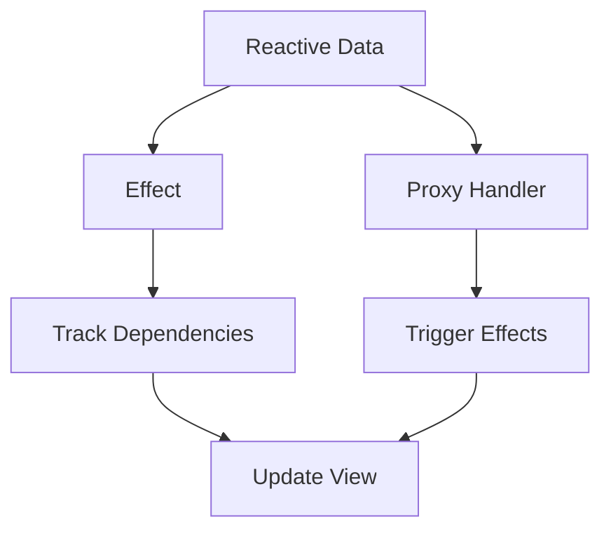

# Vue响应式系统深度解析

## 一、概述

Vue 3的响应式系统是Vue框架的核心，基于ES6的Proxy实现，相比Vue 2的Object.defineProperty具有更好的性能和更完整的拦截能力。响应式系统能够自动跟踪依赖关系，当数据发生变化时，自动更新相关的视图和计算属性。它允许开发者以一种声明式的方式来处理数据和UI的同步问题。当你的数据发生变化时，视图会自动更新，无需手动操作DOM。这大大简化了状态管理的复杂性，使得开发者可以更专注于业务逻辑。本篇将深入探讨Vue响应式系统的方方面面，从基础API到高级应用和性能优化，为你提供一份全面的参考指南。

## 二、核心概念

### 2.1 响应式系统架构



Vue 3的响应式系统由几个核心部分组成，它们协同工作，实现了数据变化到视图更新的自动流程。其核心是利用了JavaScript的Proxy对象，它允许我们拦截并自定义对象的基本操作（如属性查找、赋值、枚举、函数调用等）。

Vue 3响应式系统工作流程：

1.  **Reactive (响应式转换)**: 当我们使用`reactive()`或`ref()`等API时，Vue会将一个普通的JavaScript对象或值包装成一个Proxy对象。这个Proxy对象看起来和原始数据一样，但它的所有属性访问和修改都会被Vue拦截。
2.  **Track (依赖收集)**: 当模板或计算属性等"副作用(Effect)"在执行过程中访问了响应式对象的属性时，Vue会记录下这个依赖关系。这个过程称为"依赖收集"。简单来说，Vue会知道"谁"用到了"哪个数据"。
3.  **Trigger (触发更新)**: 当我们修改响应式对象的属性时，Vue会找到所有依赖这个属性的"副作用"，并通知它们重新执行。这个过程称为"触发更新"。
4.  **Effect (副作用)**: 副作用是指任何会依赖响应式数据的代码块。最常见的副作用就是组件的渲染函数，但`computed`、`watch`和`watchEffect`也都是副作用。当依赖的数据变化时，这些副作用会重新执行，从而实现UI更新、重新计算或执行其他逻辑。

### 2.2 Vue 2 vs Vue 3 响应式对比

Vue 3的响应式系统是对Vue 2的一次重大重构。从`Object.defineProperty`迁移到`Proxy`不仅带来了性能上的提升，还解决了一些在Vue 2中长期存在的限制。

| 特性 | Vue 2 (Object.defineProperty) | Vue 3 (Proxy) | 优势 |
|------|-------------------------------|----------------|------|
| 对象属性 | 需要预先定义 | 动态属性支持 | 更灵活 |
| 数组变化 | 需要特殊处理 | 原生支持 | 更直观 |
| 嵌套对象 | 递归劫持 | 懒代理 | 性能更好 |
| 新增属性 | 需要$set | 自动响应 | 使用简单 |
| 删除属性 | 需要$delete | 自动响应 | 使用简单 |
| Map/Set | 不支持 | 原生支持 | 功能完整 |

---

## 三、ref响应式引用

`ref`是Vue 3中最基础的响应式API之一。它用于创建一个包含任意值的响应式引用，通常用于处理基本数据类型（如字符串、数字、布尔值），但也可以用于对象和数组。

### 3.1 ref基础用法

```vue
<script setup>
import { ref, isRef, unref, toRef } from 'vue'

// 基础ref
const count = ref(0)
const message = ref('Hello Vue!')
const user = ref({ name: 'John', age: 25 })

// 访问和修改
console.log(count.value) // 0
count.value++
console.log(count.value) // 1

// 在模板中自动解包
</script>

<template>
  <!-- 模板中自动解包，不需要.value -->
  <div>{{ count }}</div>
  <div>{{ message }}</div>
  <div>{{ user.name }}</div>
</template>
```

`ref()`接收一个内部值，并返回一个响应式的、可变的ref对象。这个对象只包含一个`.value`属性，指向其内部值。

**为什么需要`.value`?**

在JavaScript中，基本数据类型（如`number`）是按值传递的，而不是按引用传递。如果我们直接传递一个变量，Vue无法追踪它的变化。通过将基本类型包装在一个对象中，我们可以通过`.value`属性来追踪其读写操作，从而实现响应性。在Vue模板中使用ref时，Vue会自动进行"解包"，所以我们不需要写`.value`，这使得模板代码更简洁。但在JavaScript代码中，访问和修改ref的值必须通过`.value`属性。

```vue
<template>
  <!-- 模板中自动解包，不需要.value -->
  <div>{{ count }}</div>
  <div>{{ message }}</div>
  <div>{{ user.name }}</div>
</template>
```

### 3.2 ref高级应用

`ref`的强大之处在于它可以与Vue的其他部分（如计算属性和侦听器）无缝集成，并且可以容纳任何类型的数据，包括复杂的对象和数组。

```vue
<script setup>
import { ref, computed, watch } from 'vue'

// 复杂数据类型的ref
const todos = ref([
  { id: 1, text: 'Learn Vue', done: false },
  { id: 2, text: 'Build app', done: false }
])

// ref作为函数参数
function updateTodo(id, updates) {
  const todo = todos.value.find(t => t.id === id)
  if (todo) {
    Object.assign(todo, updates)
  }
}

// ref与computed结合
const completedCount = computed(() => {
  return todos.value.filter(todo => todo.done).length
})

// ref与watch结合
watch(count, (newVal, oldVal) => {
  console.log(`count changed from ${oldVal} to ${newVal}`)
})
</script>
```

### 3.3 ref工具函数

Vue提供了一系列工具函数来辅助处理`ref`，使得在不同场景下的使用更加灵活和便捷。

```vue
<script setup>
import { ref, isRef, unref, toRef, toRefs } from 'vue'

const count = ref(0)
const user = reactive({ name: 'John', age: 25 })

// isRef: 检查一个值是否为ref对象。
// 判断是否为ref
console.log(isRef(count)) // true
console.log(isRef(user)) // false

// unref: 如果参数是ref，则返回其内部值，否则返回值本身。这是 `val = isRef(val) ? val.value : val` 的语法糖。
// 获取ref的值，如果不是ref直接返回
console.log(unref(count)) // 0
console.log(unref(100)) // 100

// toRef: 为一个响应式对象的属性创建一个ref。这个ref会与源对象的属性保持同步，修改任何一个都会更新另一个。
// 将reactive对象的属性转为ref
const nameRef = toRef(user, 'name')
console.log(nameRef.value) // 'John'

// toRefs: 将一个响应式对象转换为一个普通对象，其中每个属性都是指向源对象相应属性的ref。这在解构响应式对象时非常有用，可以避免失去响应性。
// 将reactive对象转为ref对象
const userRefs = toRefs(user)
console.log(userRefs.name.value) // 'John'
</script>
```

---

## 四、reactive响应式对象

`reactive`是另一个核心的响应式API，专门用于将JavaScript对象（包括数组和Map、Set等集合类型）转换为响应式对象。与`ref`不同，`reactive`会深度地使其所有嵌套属性都变为响应式。

### 4.1 reactive基础概念

```vue
<script setup>
import { reactive, readonly, isReactive, isReadonly } from 'vue'

// 基础reactive
const state = reactive({
  count: 0,
  user: {
    name: 'John',
    profile: {
      email: 'john@example.com'
    }
  },
  todos: []
})

// 深度响应式
state.user.profile.email = 'new@example.com' // 会触发响应
state.todos.push({ text: 'New todo' }) // 会触发响应

// 只读对象
const readonlyState = readonly(state)
// readonlyState.count++ // 警告：无法修改只读对象

// 检查对象类型
console.log(isReactive(state)) // true
console.log(isReadonly(readonlyState)) // true
</script>
```

`reactive()`返回一个对象的响应式代理。这个代理在行为上与原始对象完全相同，但Vue能够拦截对其属性的访问和修改，从而实现依赖收集和触发更新。
`reactive`的转换是"深度"的：当你访问嵌套对象时，它们也会被`reactive`包装。

### 4.2 reactive vs ref 选择策略

在选择`ref`还是`reactive`时，社区形成了一些约定俗成的最佳实践：
-   **`ref`**: 推荐用于基本数据类型。它提供了简单明了的`.value`接口。当你想将一个对象或数组作为一个整体进行替换时，`ref`也很有用，因为你只需要对`.value`进行一次赋值。
-   **`reactive`**: 推荐用于需要深度响应性的复杂对象，例如表单状态或UI状态集合。使用`reactive`可以让你像操作普通对象一样操作数据，而无需到处使用`.value`。

关键区别在于`ref`处理的是值的"引用"，而`reactive`处理的是对象本身。`ref`通过`.value`进行赋值，而`reactive`则直接修改属性。

```vue
<script setup>
import { ref, reactive } from 'vue'

// ✅ 使用ref的场景
const count = ref(0)           // 基本类型
const message = ref('')        // 字符串
const isLoading = ref(false)   // 布尔值
const userList = ref([])       // 需要整体替换的数组

// ✅ 使用reactive的场景
const form = reactive({        // 表单数据
  username: '',
  password: '',
  remember: false
})

const uiState = reactive({     // UI状态
  sidebar: {
    collapsed: false,
    width: 240
  },
  theme: 'light'
})

// ❌ 避免的用法
const badRef = ref({           // 对象用reactive更好
  name: '',
  age: 0
})
</script>
```

### 4.3 reactive注意事项

`reactive`虽然强大，但也存在一些使用时需要注意的"陷阱"，主要与JavaScript的语言特性有关。

1.  **解构丢失响应性**: 当你使用ES6的解构语法从`reactive`对象中提取属性时，这些提取出来的变量会失去与源对象的响应式链接。因为它们只是普通的局部变量，持有的是那一刻的值。要解决这个问题，应该使用`toRefs`。
2.  **赋值丢失响应性**: 如果你尝试用一个新对象直接替换一个`reactive`对象，那么原始的响应式代理会丢失。因为响应性是绑定在初始对象上的。如果你需要一个可以被完全替换的响应式对象，应该使用`ref`。

```vue
<script setup>
import { reactive, ref, toRefs } from 'vue'

const state = reactive({ count: 0 })

// ❌ 解构会失去响应性
const { count } = state
count++ // 不会触发更新

// ✅ 正确的解构方式
const { count: countRef } = toRefs(state)
countRef.value++ // 会触发更新

// ❌ 直接赋值会失去响应性
let obj = reactive({ name: 'John' })
obj = { name: 'Jane' } // 失去响应性

// ✅ 正确的替换方式
const objRef = ref({ name: 'John' })
objRef.value = { name: 'Jane' } // 保持响应性
</script>
```

---

## 五、computed计算属性

`computed`用于声明一个依赖其他响应式状态的派生状态。它会缓存计算结果，只有在它的依赖项发生变化时才会重新计算。这是一种非常重要且常用的性能优化手段。

### 5.1 计算属性基础

计算属性可以是一个只读的getter函数，也可以是一个包含`get`和`set`方法的可写对象。
-   **只读计算属性**: 这是最常见的用法。你提供一个函数，它的返回值就是计算属性的值。
-   **可写计算属性**: 在少数情况下，你可能需要一个"可写"的计算属性。当你尝试修改它时，`set`方法会被调用，你可以在其中执行更新相关依赖状态的逻辑。

```vue
<script setup>
import { ref, computed } from 'vue'

const firstName = ref('John')
const lastName = ref('Doe')

// 只读计算属性
const fullName = computed(() => {
  return `${firstName.value} ${lastName.value}`
})

// 可写计算属性
const editableFullName = computed({
  get() {
    return `${firstName.value} ${lastName.value}`
  },
  set(value) {
    [firstName.value, lastName.value] = value.split(' ')
  }
})

// 使用
console.log(fullName.value) // "John Doe"
editableFullName.value = "Jane Smith"
console.log(firstName.value) // "Jane"
</script>
```

### 5.2 计算属性vs方法vs侦听器

- **Computed Properties**: 核心优势是**缓存**。只要依赖没有变化，多次访问计算属性会立即返回之前缓存的结果，而不会重新执行计算。适用于基于现有数据进行计算的场景，如过滤列表、求和等。
- **Methods**: 每次调用都会**重新执行**。适用于不需要缓存的场景，或者每次调用都需要执行的动作。
- **Watchers**: 用于观察一个数据源的变化，并执行**副作用**（Side Effects），例如发起异步请求、操作DOM等。它不返回值，而是用于执行操作。

```vue
<script setup>
import { ref, computed, watch } from 'vue'

const numbers = ref([1, 2, 3, 4, 5])

// 计算属性：有缓存，依赖不变时不重新计算
const sum = computed(() => {
  console.log('计算属性执行') // 只在依赖变化时执行
  return numbers.value.reduce((a, b) => a + b, 0)
})

// 方法：每次调用都执行
const getSumMethod = () => {
  console.log('方法执行') // 每次调用都执行
  return numbers.value.reduce((a, b) => a + b, 0)
}

// 侦听器：用于副作用
watch(numbers, (newVal) => {
  console.log('数组发生变化:', newVal)
}, { deep: true })
</script>

<template>
  <div>
    <!-- 计算属性，有缓存 -->
    <p>Sum (computed): {{ sum }}</p>
    <p>Sum (computed again): {{ sum }}</p>
    
    <!-- 方法，每次都执行 -->
    <p>Sum (method): {{ getSumMethod() }}</p>
    <p>Sum (method again): {{ getSumMethod() }}</p>
  </div>
</template>
```

### 5.3 计算属性最佳实践

```vue
<script setup>
import { ref, computed } from 'vue'

const users = ref([
  { id: 1, name: 'John', age: 25, active: true },
  { id: 2, name: 'Jane', age: 30, active: false },
  { id: 3, name: 'Bob', age: 35, active: true }
])

const searchQuery = ref('')
const sortBy = ref('name')
const filterActive = ref(false)

// ✅ 链式计算属性，清晰易读
const filteredUsers = computed(() => {
  let result = users.value
  
  if (filterActive.value) {
    result = result.filter(user => user.active)
  }
  
  if (searchQuery.value) {
    result = result.filter(user => 
      user.name.toLowerCase().includes(searchQuery.value.toLowerCase())
    )
  }
  
  return result
})

const sortedUsers = computed(() => {
  return [...filteredUsers.value].sort((a, b) => {
    return a[sortBy.value] > b[sortBy.value] ? 1 : -1
  })
})

// ✅ 缓存昂贵的计算
const expensiveData = computed(() => {
  // 模拟昂贵的计算
  return users.value
    .map(user => ({ ...user, score: Math.random() * 100 }))
    .sort((a, b) => b.score - a.score)
})
</script>
```

---

## 六、watch侦听器

`watch` API用于"侦听"一个或多个响应式数据源的变化，并在数据变化时执行一个回调函数。它非常适合执行异步操作或需要在状态变化时执行开销较大的操作的场景。

### 6.1 watch基础用法

`watch`非常灵活，它可以侦听不同类型的数据源：
-   **侦听ref**: 直接传入ref对象。
-   **侦听reactive对象的属性**: 需要使用一个getter函数 `() => user.name`来指定要侦听的属性。这可以确保只有在返回值变化时才触发侦听器。
-   **侦听多个源**: 传入一个包含多个源的数组。回调函数会接收到包含新旧值的数组。
-   **侦听整个reactive对象**: 直接传入`reactive`对象。需要注意的是，默认情况下，这只会浅层侦听。如果要深度侦听对象内部的变化，需要添加`{ deep: true }`选项。

```vue
<script setup>
import { ref, reactive, watch } from 'vue'

const count = ref(0)
const user = reactive({ name: 'John', age: 25 })

// 侦听ref
watch(count, (newVal, oldVal) => {
  console.log(`count: ${oldVal} -> ${newVal}`)
})

// 侦听reactive对象的属性
watch(() => user.name, (newVal, oldVal) => {
  console.log(`name: ${oldVal} -> ${newVal}`)
})

// 侦听多个源
watch([count, () => user.name], ([newCount, newName], [oldCount, oldName]) => {
  console.log(`count: ${oldCount} -> ${newCount}`)
  console.log(`name: ${oldName} -> ${newName}`)
})

// 侦听整个reactive对象
watch(user, (newVal, oldVal) => {
  console.log('user changed:', newVal)
}, { deep: true })
</script>
```

### 6.2 watch选项详解

`watch`接受一个可选的配置对象，以更精细地控制其行为：
-   **`immediate: true`**: 使侦听器在创建时立即执行一次回调。
-   **`deep: true`**: 强制对源进行深度遍历。这在侦听嵌套对象或数组时非常有用。
-   **`flush`**: 控制回调的执行时机。`'pre'`（默认）在组件更新前执行，`'post'`在组件更新后执行，`'sync'`则强制同步执行（应谨慎使用）。
-   **`once: true`**: 使侦听器在第一次触发后自动停止。

```vue
<script setup>
import { ref, watch } from 'vue'

const count = ref(0)
const data = ref({ nested: { value: 0 } })

// immediate: 立即执行
watch(count, (newVal) => {
  console.log('count:', newVal)
}, { immediate: true })

// deep: 深度侦听
watch(data, (newVal) => {
  console.log('data changed:', newVal)
}, { deep: true })

// flush: 控制回调时机
watch(count, (newVal) => {
  // 'pre': 组件更新前（默认）
  // 'post': 组件更新后
  // 'sync': 同步执行
  console.log('count:', newVal)
}, { flush: 'post' })

// once: 只执行一次 (Vue 3.4+)
watch(count, (newVal) => {
  console.log('只执行一次:', newVal)
}, { once: true })
</script>
```

### 6.3 停止侦听器

`watch`会返回一个`unwatch`函数，调用它可以手动停止侦听。在组件卸载时，Vue会自动停止组件内创建的侦听器，所以通常不需要手动停止。但在某些特殊情况下，例如需要临时创建一个侦听器或在组件外部管理其生命周期时，手动停止就变得非常有用。

```vue
<script setup>
import { ref, watch, onUnmounted } from 'vue'

const count = ref(0)

// 手动停止侦听器
const stopWatcher = watch(count, (newVal) => {
  console.log('count:', newVal)
})

// 条件停止
if (someCondition) {
  stopWatcher()
}

// 在组件卸载时自动停止
onUnmounted(() => {
  stopWatcher()
})

// 临时侦听器
function setupTempWatcher() {
  const tempWatcher = watch(count, (newVal) => {
    if (newVal > 10) {
      console.log('达到阈值，停止侦听')
      tempWatcher() // 停止自己
    }
  })
}
</script>
```

---

## 七、watchEffect副作用侦听

`watchEffect`是另一个侦听副作用的API，它与`watch`类似，但使用方式更简洁。它会立即执行一个函数，并响应式地追踪其所有依赖，在依赖变化时重新运行该函数。

### 7.1 watchEffect基础

`watchEffect`的核心特点是**自动依赖追踪**。你不需要像`watch`那样显式指定要侦听的数据源。Vue会自动分析传入函数中访问了哪些响应式数据，并将它们作为依赖。这使得代码在处理多个依赖时更加简洁。

```vue
<script setup>
import { ref, watchEffect } from 'vue'

const count = ref(0)
const name = ref('John')

// 自动追踪依赖
watchEffect(() => {
  // 自动侦听count和name的变化
  console.log(`${name.value}: ${count.value}`)
})

// 等价于watch，但更简洁
watch([count, name], ([newCount, newName]) => {
  console.log(`${newName}: ${newCount}`)
})
</script>
```

### 7.2 watchEffect vs watch

选择`watch`还是`watchEffect`取决于你的具体需求：
-   当你需要精确控制要侦听的数据源，或者需要访问变化前后的旧值时，应该使用`watch`。
-   当你的副作用依赖于多个数据源，且你不需要旧值时，`watchEffect`可以写出更简洁的代码。

| 特性 | watch | watchEffect | 适用场景 |
|------|-------|-------------|----------|
| 依赖追踪 | 手动指定 | 自动追踪 | 依赖明确 vs 依赖动态 |
| 惰性执行 | 默认惰性 | 立即执行 | 需要旧值 vs 不需要旧值 |
| 访问旧值 | 支持 | 不支持 | 需要对比 vs 只关心当前值 |
| 精确控制 | 更精确 | 更简洁 | 复杂逻辑 vs 简单副作用 |

```vue
<script setup>
import { ref, watch, watchEffect } from 'vue'

const url = ref('https://api.example.com/users')
const data = ref(null)
const loading = ref(false)

// ✅ 使用watchEffect - 自动追踪依赖
watchEffect(async () => {
  loading.value = true
  try {
    const response = await fetch(url.value)
    data.value = await response.json()
  } finally {
    loading.value = false
  }
})

// ✅ 使用watch - 需要对比新旧值
const searchQuery = ref('')
const searchHistory = ref([])

watch(searchQuery, (newQuery, oldQuery) => {
  if (newQuery && newQuery !== oldQuery) {
    searchHistory.value.push({
      query: newQuery,
      timestamp: Date.now()
    })
  }
})
</script>
```

### 7.3 副作用清理

在某些副作用中，我们可能会创建一些需要清理的资源，例如定时器或网络请求。`watchEffect`接收的函数可以接收一个`onCleanup`回调函数作为参数。这个`onCleanup`函数会在副作用即将重新执行前或者侦听器被停止时调用，非常适合用于清理工作，以防止内存泄漏或不必要的计算。

```vue
<script setup>
import { ref, watchEffect } from 'vue'

const id = ref(1)

watchEffect((onCleanup) => {
  // 异步操作
  const timer = setTimeout(() => {
    console.log(`加载用户 ${id.value}`)
  }, 1000)
  
  // 清理副作用
  onCleanup(() => {
    clearTimeout(timer)
    console.log('清理定时器')
  })
})

// 网络请求示例
watchEffect(async (onCleanup) => {
  const controller = new AbortController()
  
  onCleanup(() => {
    controller.abort()
  })
  
  try {
    const response = await fetch(`/api/users/${id.value}`, {
      signal: controller.signal
    })
    const userData = await response.json()
    console.log(userData)
  } catch (error) {
    if (error.name !== 'AbortError') {
      console.error('请求失败:', error)
    }
  }
})
</script>
```

---

## 八、浅层响应式API

默认情况下，Vue的`ref`和`reactive`都是"深度"响应式的，这意味着它们会递归地将所有嵌套的对象和数组都转换为响应式代理。虽然这在大多数情况下很方便，但有时可能会带来不必要的性能开销。为此，Vue提供了浅层响应式API。

### 8.1 shallowRef与shallowReactive

-   **`shallowRef`**: 只对`.value`的访问是响应式的。`shallowRef`内部的值不会被深度转换，其嵌套属性的变化不会触发更新。只有当整个`.value`被替换时才会触发更新。
-   **`shallowReactive`**: 只对对象的根级别属性是响应式的。嵌套对象的属性不是响应式的。

使用浅层API可以显著提升处理大型、不可变数据结构时的性能，因为Vue会跳过对深层属性的代理。

```vue
<script setup>
import { ref, shallowRef, reactive, shallowReactive } from 'vue'

// 普通ref - 深度响应
const deepRef = ref({ 
  user: { name: 'John' } 
})
deepRef.value.user.name = 'Jane' // 触发响应

// 浅层ref - 只有.value的变化才触发响应
const shallowUser = shallowRef({ 
  name: 'John',
  profile: { email: 'john@example.com' }
})

shallowUser.value.name = 'Jane'              // 不触发响应
shallowUser.value.profile.email = 'new@email' // 不触发响应
shallowUser.value = { name: 'Bob' }          // 触发响应

// 普通reactive - 深度响应
const deepState = reactive({
  user: { name: 'John' }
})
deepState.user.name = 'Jane' // 触发响应

// 浅层reactive - 只有根级属性触发响应
const shallowState = shallowReactive({
  count: 0,
  user: { name: 'John' }
})

shallowState.count++              // 触发响应
shallowState.user.name = 'Jane'   // 不触发响应
shallowState.user = { name: 'Bob' } // 触发响应
</script>
```

### 8.2 性能优化应用

浅层响应式API在以下场景中特别有用：
-   **大型数据结构**: 当你有一个非常大的数据结构（如一个长列表），并且你只会修改它的顶层属性时，使用浅层API可以避免不必要的性能开销。
-   **与外部状态集成**: 当你将Vue与外部的状态管理库（如Pinia、Vuex）或第三方UI库集成时，使用`shallowRef`和`markRaw`可以防止Vue对这些外部对象进行不必要的深度响应式转换。
-   **批量更新**: 配合`triggerRef`可以实现对`shallowRef`的手动、批量更新控制。

```vue
<script setup>
import { shallowRef, triggerRef } from 'vue'

// 大型数据结构优化
const largeDataSet = shallowRef({
  items: new Array(10000).fill(0).map((_, i) => ({
    id: i,
    value: Math.random()
  }))
})

// 批量更新优化
function batchUpdate() {
  // 修改大量数据
  largeDataSet.value.items.forEach((item, index) => {
    item.value = Math.random()
  })
  
  // 手动触发更新
  triggerRef(largeDataSet)
}

// 第三方库集成
const chartInstance = shallowRef(null)

onMounted(() => {
  chartInstance.value = new Chart(canvas, config)
})

// 更新图表数据
function updateChart(newData) {
  chartInstance.value.updateData(newData)
  // 不需要触发Vue的响应式更新
}
</script>
```

---

## 九、只读响应式

有时，我们需要将响应式状态传递给其他组件，但又不希望它们能够修改这个状态。`readonly` API系列就为此而生，它可以创建一个原始对象的只读代理，防止数据被意外篡改。

### 9.1 readonly深度只读

`readonly`接收一个对象（响应式或普通对象）或`ref`，并返回一个原始对象的只读代理。这个代理是深度的：任何被访问的嵌套属性也都是只读的。任何尝试修改只读代理的操作都会失败，并在开发模式下发出警告。

```vue
<script setup>
import { reactive, readonly, isReadonly } from 'vue'

const state = reactive({
  count: 0,
  user: {
    name: 'John',
    settings: {
      theme: 'dark'
    }
  }
})

// 创建只读版本
const readonlyState = readonly(state)

// 检查只读状态
console.log(isReadonly(readonlyState)) // true
console.log(isReadonly(readonlyState.user)) // true
console.log(isReadonly(readonlyState.user.settings)) // true

// 尝试修改会发出警告
readonlyState.count++ // Warning: Set operation failed
readonlyState.user.name = 'Jane' // Warning: Set operation failed
</script>
```

### 9.2 shallowReadonly浅层只读

`shallowReadonly`是`readonly`的浅层版本。只有对象的根级别属性是只读的，而嵌套对象内部的属性仍然是可修改的。

```vue
<script setup>
import { reactive, shallowReadonly } from 'vue'

const state = reactive({
  count: 0,
  user: {
    name: 'John',
    settings: {
      theme: 'dark'
    }
  }
})

// 浅层只读
const shallowReadonlyState = shallowReadonly(state)

// 根级属性只读
shallowReadonlyState.count++ // Warning: Set operation failed

// 深层属性可修改
shallowReadonlyState.user.name = 'Jane' // 可以修改
shallowReadonlyState.user.settings.theme = 'light' // 可以修改
</script>
```

### 9.3 只读应用场景

-   **状态保护**: 在`provide`/`inject`或Props中，向子组件传递一个只读的状态对象，可以确保数据流的单向性，防止子组件意外修改父组件的状态。
-   **全局配置**: 将应用的全局配置（如API端点、功能开关等）包装为只读对象，可以防止在运行时被意外修改。
-   **公共API**: 在创建一个组合式函数时，可以向外暴露一个只读的计算属性或状态，保护内部状态不被外部直接修改。

```vue
<script setup>
import { reactive, readonly, computed } from 'vue'

// 配置管理
const appConfig = readonly({
  api: {
    baseURL: 'https://api.example.com',
    timeout: 5000
  },
  ui: {
    theme: 'light',
    language: 'en'
  }
})

// 状态保护
const internalState = reactive({
  user: null,
  permissions: []
})

// 对外暴露只读版本
export const userState = readonly(internalState)

// 只读的计算属性
const publicAPI = computed(() => readonly({
  isLoggedIn: !!internalState.user,
  userName: internalState.user?.name,
  canEdit: internalState.permissions.includes('edit')
}))
</script>
```

---

## 十、高级响应式工具

### 10.1 customRef自定义响应式

```vue
<script setup>
import { customRef } from 'vue'

// 防抖ref
function useDebouncedRef(value, delay = 200) {
  let timeout
  return customRef((track, trigger) => {
    return {
      get() {
        track() // 追踪依赖
        return value
      },
      set(newValue) {
        clearTimeout(timeout)
        timeout = setTimeout(() => {
          value = newValue
          trigger() // 触发更新
        }, delay)
      }
    }
  })
}

// 使用防抖ref
const searchQuery = useDebouncedRef('', 300)

// 带验证的ref
function useValidatedRef(initialValue, validator) {
  return customRef((track, trigger) => {
    let value = initialValue
    return {
      get() {
        track()
        return value
      },
      set(newValue) {
        if (validator(newValue)) {
          value = newValue
          trigger()
        } else {
          console.warn('验证失败:', newValue)
        }
      }
    }
  })
}

// 使用验证ref
const email = useValidatedRef('', (value) => {
  return /^[^\s@]+@[^\s@]+\.[^\s@]+$/.test(value)
})
</script>
```

### 10.2 effectScope作用域管理

```vue
<script setup>
import { effectScope, ref, watch, computed } from 'vue'

// 创建独立的响应式作用域
const scope = effectScope()

scope.run(() => {
  const count = ref(0)
  const doubled = computed(() => count.value * 2)
  
  watch(count, (val) => {
    console.log('count changed:', val)
  })
  
  // 这些响应式绑定都在scope作用域内
})

// 停止整个作用域的所有响应式绑定
scope.stop()

// 分离的作用域
function createFeatureScope() {
  const scope = effectScope(true) // 分离作用域
  
  return scope.run(() => {
    const data = ref([])
    const loading = ref(false)
    
    const fetchData = async () => {
      loading.value = true
      // 异步操作
      loading.value = false
    }
    
    return { data, loading, fetchData }
  })
}
</script>
```

### 10.3 响应式转换工具

```vue
<script setup>
import { 
  ref, reactive, toRef, toRefs, toValue,
  isRef, isReactive, isReadonly, isProxy
} from 'vue'

const user = reactive({
  name: 'John',
  age: 25,
  profile: {
    email: 'john@example.com'
  }
})

// toRef: 将reactive对象的属性转为ref
const nameRef = toRef(user, 'name')
nameRef.value = 'Jane' // 会同步到user.name

// toRefs: 将reactive对象转为ref对象
const userRefs = toRefs(user)
userRefs.age.value = 26 // 会同步到user.age

// toValue: 获取值（Vue 3.3+）
const count = ref(42)
const staticValue = 100

console.log(toValue(count)) // 42
console.log(toValue(staticValue)) // 100
console.log(toValue(() => count.value * 2)) // 84

// 类型检查工具
console.log(isRef(nameRef)) // true
console.log(isReactive(user)) // true
console.log(isReadonly(readonly(user))) // true
console.log(isProxy(user)) // true
</script>
```

---

## 十一、响应式最佳实践

### 11.1 API选择指南

```vue
<script setup>
import { ref, reactive, computed, watch, watchEffect } from 'vue'

// ✅ 基本类型使用ref
const count = ref(0)
const message = ref('')
const isVisible = ref(true)

// ✅ 对象类型使用reactive
const form = reactive({
  username: '',
  password: '',
  remember: false
})

const uiState = reactive({
  sidebar: { collapsed: false },
  modal: { visible: false }
})

// ✅ 计算属性用于派生状态
const formValid = computed(() => {
  return form.username.length > 0 && form.password.length >= 6
})

// ✅ watch用于副作用
watch(() => form.username, async (newUsername) => {
  if (newUsername) {
    await checkUsernameAvailability(newUsername)
  }
})

// ✅ watchEffect用于自动依赖追踪
watchEffect(() => {
  if (isVisible.value) {
    document.title = `Count: ${count.value}`
  }
})
</script>
```

### 11.2 性能优化策略

```vue
<script setup>
import { 
  ref, shallowRef, readonly, markRaw,
  computed, watchEffect, nextTick
} from 'vue'

// ✅ 大型数据使用shallowRef
const largeDataSet = shallowRef({
  items: new Array(10000).fill(null)
})

// ✅ 静态配置使用readonly
const config = readonly({
  apiUrl: 'https://api.example.com',
  version: '1.0.0'
})

// ✅ 第三方实例使用markRaw
const chartInstance = ref(markRaw(new Chart()))

// ✅ 缓存昂贵的计算
const expensiveComputed = computed(() => {
  return largeDataSet.value.items
    .filter(item => item.active)
    .map(item => heavyCalculation(item))
})

// ✅ 批量更新优化
async function batchUpdate() {
  // 多个同步更新
  count.value++
  message.value = 'updated'
  isVisible.value = false
  
  // 等待DOM更新完成
  await nextTick()
  console.log('DOM已更新')
}
</script>
```

### 11.3 常见陷阱与解决方案

```vue
<script setup>
import { reactive, ref, toRefs, watch } from 'vue'

// ❌ 解构reactive会失去响应性
const state = reactive({ count: 0, name: 'John' })
const { count, name } = state // 失去响应性

// ✅ 使用toRefs保持响应性
const { count: countRef, name: nameRef } = toRefs(state)

// ❌ 直接替换reactive对象
let data = reactive({ items: [] })
data = { items: [1, 2, 3] } // 失去响应性

// ✅ 使用ref包装可替换的数据
const dataRef = ref({ items: [] })
dataRef.value = { items: [1, 2, 3] } // 保持响应性

// ❌ 在watch中修改被监听的数据
const searchQuery = ref('')
watch(searchQuery, (newVal) => {
  searchQuery.value = newVal.trim() // 可能导致无限循环
})

// ✅ 正确的数据清理方式
watch(searchQuery, (newVal) => {
  if (newVal !== newVal.trim()) {
    nextTick(() => {
      searchQuery.value = newVal.trim()
    })
  }
})
</script>
```

---

## 十二、实际应用场景

### 12.1 表单管理

```vue
<script setup>
import { reactive, computed, watch } from 'vue'

// 表单状态管理
const form = reactive({
  data: {
    username: '',
    email: '',
    password: '',
    confirmPassword: ''
  },
  errors: {},
  touched: {},
  isSubmitting: false
})

// 表单验证
const validators = {
  username: (value) => value.length >= 3 ? '' : '用户名至少3位',
  email: (value) => /\S+@\S+\.\S+/.test(value) ? '' : '邮箱格式不正确',
  password: (value) => value.length >= 6 ? '' : '密码至少6位',
  confirmPassword: (value) => 
    value === form.data.password ? '' : '密码确认不匹配'
}

// 实时验证
watch(() => form.data, (newData) => {
  Object.keys(newData).forEach(key => {
    if (form.touched[key] && validators[key]) {
      form.errors[key] = validators[key](newData[key])
    }
  })
}, { deep: true })

// 表单状态
const isValid = computed(() => {
  return Object.values(form.errors).every(error => !error) &&
         Object.keys(form.data).length > 0
})

// 字段操作
const touchField = (field) => {
  form.touched[field] = true
  if (validators[field]) {
    form.errors[field] = validators[field](form.data[field])
  }
}

const submitForm = async () => {
  if (!isValid.value) return
  
  form.isSubmitting = true
  try {
    await api.submitForm(form.data)
  } finally {
    form.isSubmitting = false
  }
}
</script>
```

### 12.2 状态管理

```vue
<script setup>
import { reactive, readonly, computed } from 'vue'

// 应用状态
const state = reactive({
  user: null,
  theme: 'light',
  notifications: [],
  loading: {
    user: false,
    notifications: false
  }
})

// 只读状态（对外暴露）
export const appState = readonly(state)

// Getters
export const getters = {
  isLoggedIn: computed(() => !!state.user),
  unreadCount: computed(() => 
    state.notifications.filter(n => !n.read).length
  ),
  isLoading: computed(() => 
    Object.values(state.loading).some(Boolean)
  )
}

// Actions
export const actions = {
  async login(credentials) {
    state.loading.user = true
    try {
      const user = await api.login(credentials)
      state.user = user
    } finally {
      state.loading.user = false
    }
  },
  
  logout() {
    state.user = null
    state.notifications = []
  },
  
  async fetchNotifications() {
    state.loading.notifications = true
    try {
      const notifications = await api.getNotifications()
      state.notifications = notifications
    } finally {
      state.loading.notifications = false
    }
  },
  
  markAsRead(id) {
    const notification = state.notifications.find(n => n.id === id)
    if (notification) {
      notification.read = true
    }
  }
}
</script>
```

### 12.3 数据缓存

```vue
<script setup>
import { ref, reactive, computed, watch } from 'vue'

// 缓存管理
const cache = reactive(new Map())
const loading = reactive(new Set())

// 数据获取hook
function useApiData(url) {
  const data = ref(null)
  const error = ref(null)
  const isLoading = computed(() => loading.has(url))
  
  const fetchData = async (force = false) => {
    // 检查缓存
    if (!force && cache.has(url)) {
      data.value = cache.get(url)
      return
    }
    
    // 避免重复请求
    if (loading.has(url)) return
    
    loading.add(url)
    error.value = null
    
    try {
      const response = await fetch(url)
      const result = await response.json()
      
      // 更新缓存
      cache.set(url, result)
      data.value = result
    } catch (err) {
      error.value = err
    } finally {
      loading.delete(url)
    }
  }
  
  // 自动获取数据
  fetchData()
  
  // 监听URL变化
  watch(() => url, () => fetchData(), { immediate: false })
  
  return {
    data: readonly(data),
    error: readonly(error),
    isLoading,
    refresh: () => fetchData(true)
  }
}

// 使用示例
const userUrl = computed(() => `/api/users/${userId.value}`)
const { data: userData, isLoading, refresh } = useApiData(userUrl)
</script>
```

---

## 十三、调试与开发工具

### 13.1 响应式调试

```vue
<script setup>
import { ref, reactive, watch, watchEffect } from 'vue'

const count = ref(0)
const state = reactive({ name: 'John' })

// 调试watch
watch(count, (newVal, oldVal) => {
  console.log(`count: ${oldVal} → ${newVal}`)
}, { 
  onTrack(e) {
    console.log('追踪:', e)
  },
  onTrigger(e) {
    console.log('触发:', e)
  }
})

// 调试watchEffect
watchEffect((onInvalidate) => {
  console.log('watchEffect运行:', count.value)
  
  onInvalidate(() => {
    console.log('watchEffect失效')
  })
}, {
  onTrack(e) {
    console.log('watchEffect追踪:', e.key)
  },
  onTrigger(e) {
    console.log('watchEffect触发:', e.key)
  }
})
</script>
```

### 13.2 Vue DevTools集成

```javascript
// 在开发环境中启用更详细的警告
if (process.env.NODE_ENV === 'development') {
  // 启用响应式调试
  import { createApp } from 'vue'
  
  const app = createApp(App)
  
  // 配置devtools
  app.config.devtools = true
  app.config.debug = true
  
  // 全局错误处理
  app.config.errorHandler = (err, vm, info) => {
    console.error('Vue Error:', err)
    console.error('Component:', vm)
    console.error('Info:', info)
  }
  
  app.mount('#app')
}
```

---

## 十四、性能优化总结

### 14.1 ✅ 推荐做法

1. **合理选择API**
   - 基本类型用`ref`，对象用`reactive`
   - 大型数据用`shallowRef`/`shallowReactive`
   - 静态数据用`readonly`

2. **优化计算属性**
   - 使用`computed`缓存昂贵计算
   - 避免在模板中使用复杂表达式
   - 将计算逻辑提取到`computed`

3. **合理使用侦听器**
   - 简单副作用用`watchEffect`
   - 需要对比新旧值用`watch`
   - 及时清理侦听器

4. **避免响应式陷阱**
   - 不要解构`reactive`对象
   - 使用`toRefs`保持响应性
   - 注意`ref`的`.value`访问

### 14.2 ❌ 避免做法

1. **过度使用深度响应式**
2. **在模板中进行复杂计算**
3. **忘记清理副作用**
4. **不必要的深度侦听**
5. **在侦听器中修改被侦听的数据**

---

## 十五、相关资源

- [Vue 3 响应式API官方文档](https://cn.vuejs.org/api/reactivity-core.html)
- [Vue 3 响应式原理深度解析](https://cn.vuejs.org/guide/extras/reactivity-in-depth.html)
- [Vue 3 性能优化指南](https://cn.vuejs.org/guide/best-practices/performance.html)
- [Vue DevTools](https://devtools.vuejs.org/)

---

**下一章**: [Vue响应式原理深度解析](../principle/reactivity.md)
