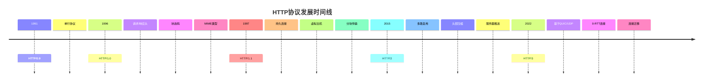
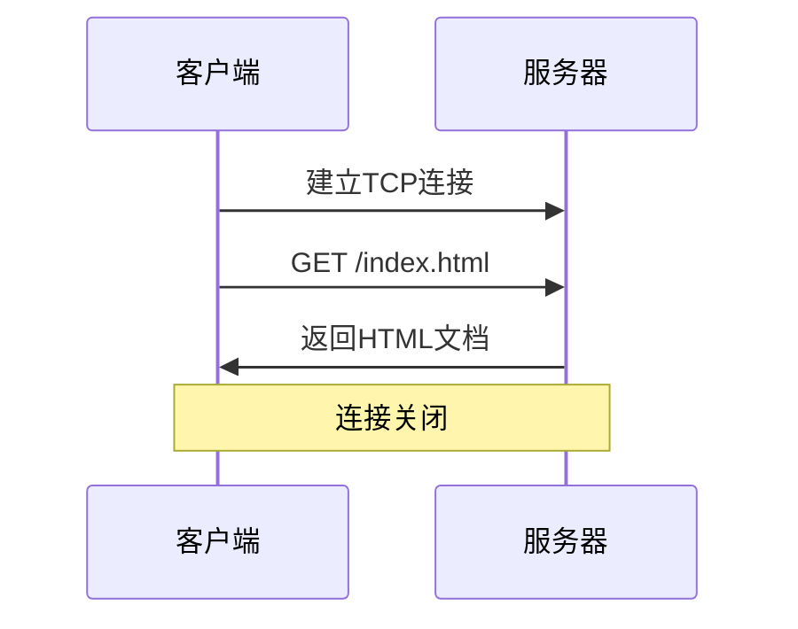
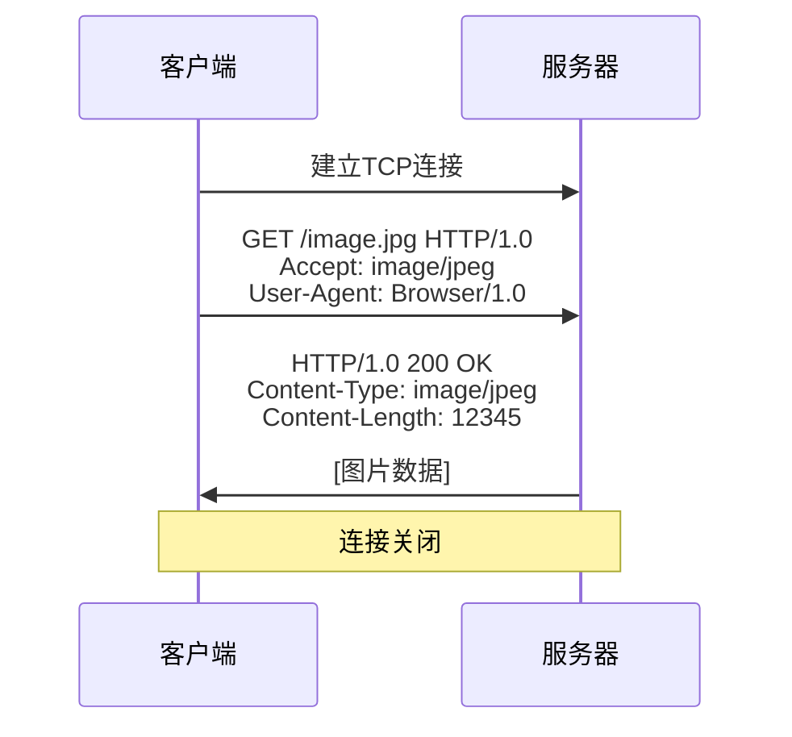
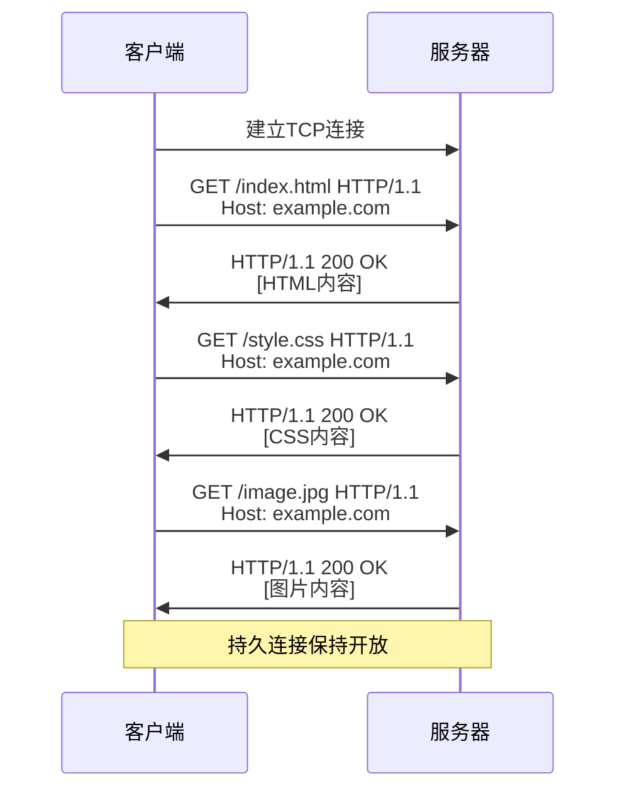
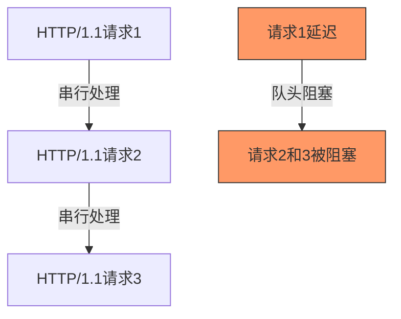
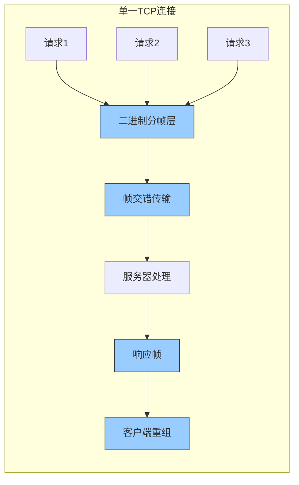
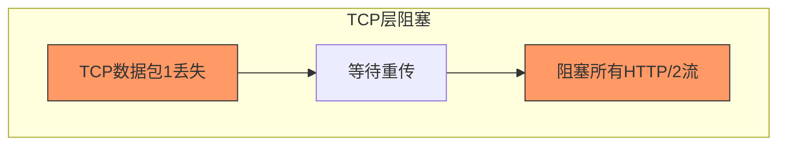
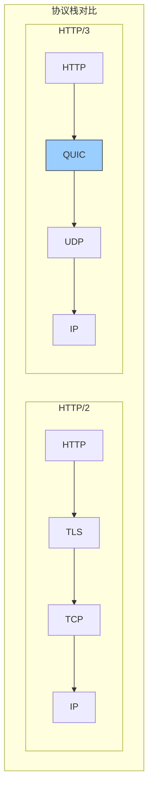
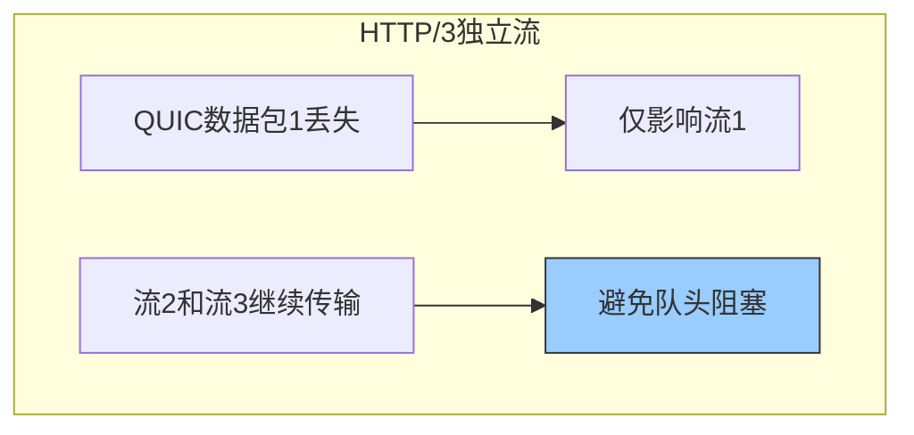
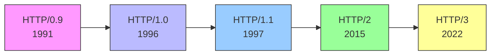

# HTTP 详解

## HTTP 的发展历史

HTTP（超文本传输协议）是万维网的基础协议，自其诞生以来，经历了多次演变和升级，从简单的文本传输协议发展成为支持复杂多媒体应用的现代协议。

## HTTP/0.9 - 单行协议

HTTP/0.9 是 HTTP 协议的最早版本，发布于 1991 年。

### 特点
- **极其简单的请求-响应模型**：客户端发送一个简单的单行ASCII命令，服务器响应一个ASCII文档后立即关闭连接。典型请求格式为：`GET /index.html`。
- **只支持 GET 方法**：HTTP/0.9只实现了GET方法，没有其他操作选项。
- **只能获取 HTML 文档**：服务器只返回HTML文档，不支持图片、视频等其他媒体类型。
- **无请求头或响应头**：不支持HTTP头部信息，无法传递元数据。
- **一次请求-响应后连接即关闭**：每次通信都需要重新建立TCP连接，完成后立即断开。
- **无状态连接**：服务器不会记住之前的请求信息，每次请求都是独立的。
- **无错误码**：服务器无法传达错误状态，只能返回HTML文档或失败。

### 存在问题
- **功能极其有限**：只能处理最基本的超文本传输。
- **元数据传输能力缺失**：无法指定内容类型、编码方式等元信息。
- **网络资源利用率低**：频繁的TCP连接建立和断开带来大量开销。
- **应用场景受限**：无法支持复杂的Web应用需求。

## HTTP/1.0 - 扩展与改进

HTTP/1.0 在 1996 年正式发布，带来了许多基础性的改进。

### 特点
- **HTTP 头部机制**：
  - **请求头**：允许客户端发送更多请求信息，如Accept（接受的内容类型）、User-Agent（浏览器标识）和Authorization（认证信息）等。
  - **响应头**：服务器可以返回内容类型、服务器信息、内容长度等元数据。
  
- **多种请求方法**：
  - **GET**：请求获取资源，不应有副作用。
  - **POST**：向服务器提交数据，可能会改变服务器状态。
  - **HEAD**：类似GET但只返回头信息，用于检查资源是否存在。
  
- **状态码系统**：引入三位数字状态码，如：
  - **1xx**：信息性响应
  - **2xx**：成功响应（如200 OK）
  - **3xx**：重定向
  - **4xx**：客户端错误（如404 Not Found）
  - **5xx**：服务器错误
  
- **Content-Type机制**：通过MIME类型指定返回内容的类型，使浏览器能正确解析和渲染非HTML内容（如图片、视频、PDF等）。

### 存在问题
- **非持久连接**：每个HTTP请求仍需单独建立TCP连接，导致页面加载缓慢。
- **连接复用能力差**：无法在同一连接上处理多个请求，每个资源都需要新连接。
- **虚拟主机问题**：缺乏Host头，使得同一IP地址上无法轻松托管多个网站。
- **带宽利用率低**：由于每个资源都需要单独的TCP连接，带宽利用率不佳。

## HTTP/1.1 - 标准化与优化

HTTP/1.1 于 1997 年发布，是对 HTTP/1.0 的重大改进，至今仍被广泛使用。

### 特点
- **持久连接**：默认启用keep-alive，允许在单个TCP连接上发送多个HTTP请求和响应。
- **Host头**：`Host: example.com`，指定请求的目标主机，支持虚拟主机。
- **分块传输编码**：使用`Transfer-Encoding: chunked`，将响应分成多个块传输。
- **HTTP管道化**：客户端可在收到前一个响应之前发送多个请求（但实际应用有限）。
- **增强的缓存控制**：Cache-Control指令、ETag机制和条件请求。
- **新增HTTP方法**：OPTIONS、PUT、DELETE、TRACE等。
- **内容协商**：客户端通过Accept系列头表明偏好，服务器返回最合适的资源。
- **范围请求**：通过Range头指定资源的部分范围，支持断点续传。

### 存在问题
- **队头阻塞**：请求必须按顺序处理，一个请求阻塞会导致后续请求延迟。
- **管道化兼容性**：理论上支持，但实际部署中存在问题，多数浏览器默认禁用。
- **头部冗余**：每个请求都包含大量相似或相同的头部字段，浪费带宽。
- **Cookie开销**：随每个请求自动发送，增加请求大小。
- **安全问题**：默认明文传输，易受中间人攻击。

## HTTP/2 - 性能与效率

HTTP/2 于 2015 年正式发布，主要关注性能优化。

### 特点
- **二进制分帧层**：将HTTP消息分解为更小的帧，并进行二进制编码。
- **多路复用**：在单一TCP连接上并行发送多个请求/响应，解决队头阻塞。
- **头部压缩(HPACK)**：减少80%-90%头部数据大小，提高小请求效率。
- **服务器推送**：服务器可主动推送关联资源，减少请求往返时间。
- **流优先级**：客户端可为请求分配优先级，优化资源加载顺序。
- **流量控制**：防止快速发送者压垮慢速接收者。

### 存在问题
- **TCP层队头阻塞**：TCP包丢失会阻塞所有HTTP流，在高丢包环境下性能受限。
- **TLS开销**：握手延迟和计算开销增加。
- **实现复杂性**：比HTTP/1.1复杂得多，维护和调试难度增加。

## HTTP/3 - QUIC 与 UDP

HTTP/3 于 2022 年标准化，基于 QUIC 协议，使用 UDP 而非 TCP 作为传输层协议。

### 特点
- **QUIC协议基础**：基于UDP的传输层协议，集成可靠性和安全性。
- **传输与加密整合**：强制加密，减少握手往返次数。
- **独立数据流多路复用**：一个流的包丢失不影响其他流，彻底解决队头阻塞。
- **0-RTT连接建立**：重复连接可立即发送数据，无需等待握手完成。
- **连接迁移**：通过连接ID标识，支持网络切换（如WiFi切换到4G）而保持连接。
- **前向纠错**：发送冗余数据，接收方可恢复丢失的包而无需重传。

### 面临的挑战
- **UDP流量处理**：许多企业防火墙和NAT设备默认限制UDP流量。
- **资源消耗**：将传输层功能移至用户空间增加CPU和内存使用。
- **兼容性与稳定性**：实现差异和标准持续演进带来挑战。
- **调试复杂性**：工具支持有限，全程加密增加调试难度。

## 总结

HTTP 协议从简单的文本协议发展成为现代网络应用的基础设施，每个版本都针对前一个版本的问题进行改进：

- **HTTP/0.9**：极简设计，满足早期Web基本需求
- **HTTP/1.0**：引入元数据传输机制，扩展Web能力
- **HTTP/1.1**：持久连接和缓存优化提高效率
- **HTTP/2**：多路复用和二进制格式大幅提升性能
- **HTTP/3**：基于UDP的QUIC彻底改变传输模型，优化移动互联网体验

随着Web应用变得越来越复杂，HTTP协议将继续演进，未来可能进一步优化安全性、隐私保护和低延迟交互，以支持实时通信和物联网应用需求。

