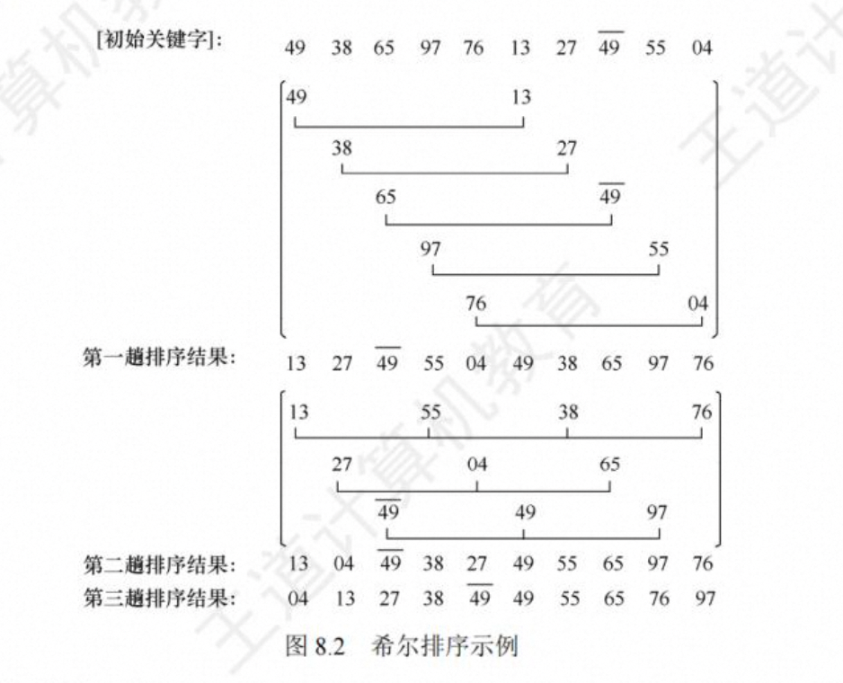
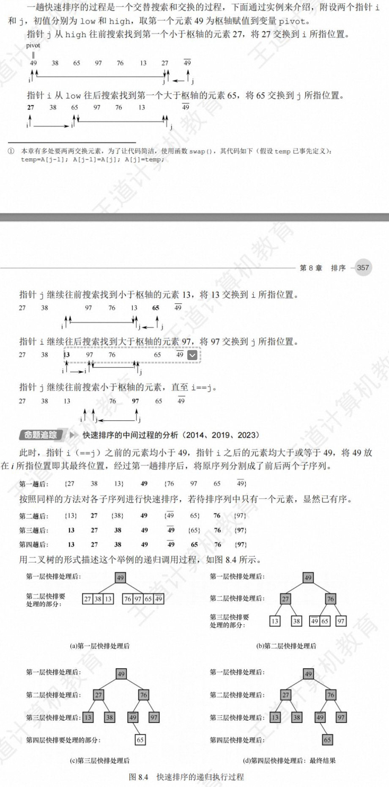
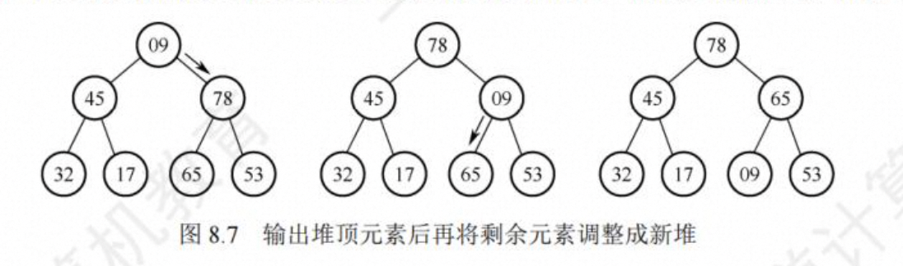
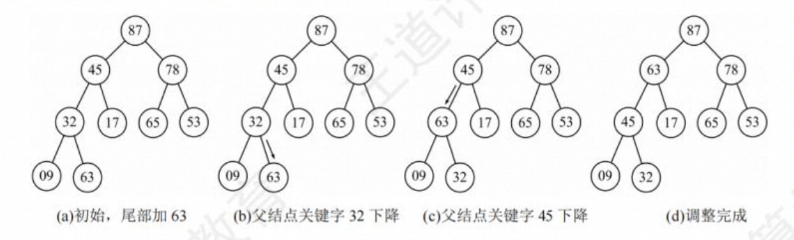
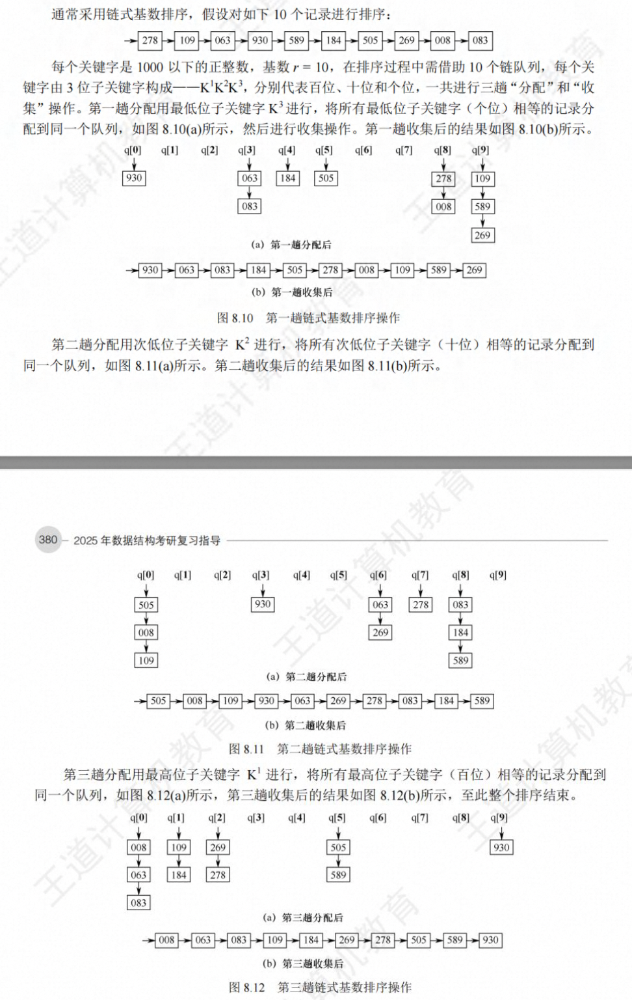
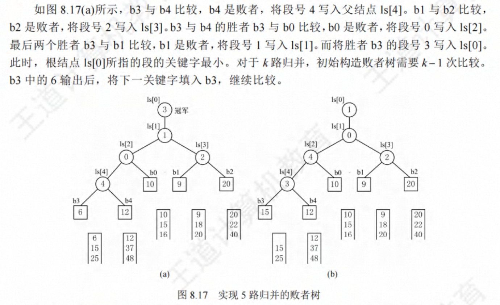
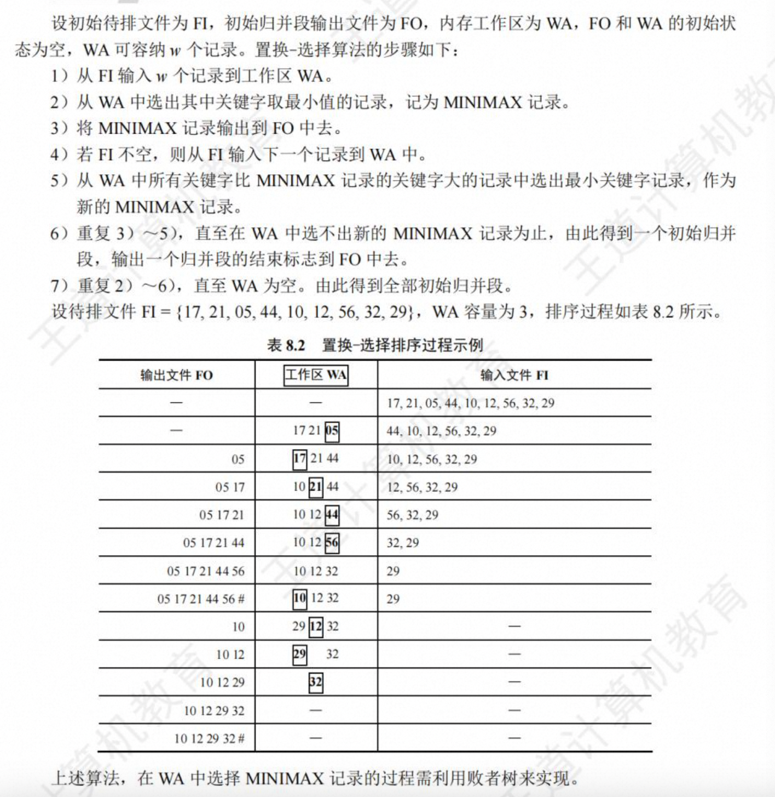

# 第 8 章 排序

## 排序的基本概念

排序，就是重新排列表中的元素，使表中的元素满足按关键字有序的过程。为了查找方便，通常希望计算机中的表是按关键字有序的。

算法的稳定性。排序前后关键字相同的位置不变，即算法稳定，否则不稳定。

在排序过程中，根据数据元素是否完全存放在内存中，可将排序算法分为两类:1 内部排序， 是指在排序期间元素全部存放在内存中的排序;2 外部排序，是指在排序期间元素无法全部同时 存放在内存中，必须在排序的过程中根据要求不断地在内、外存之间移动的排序。

一般情况下，内部排序算法在执行过程中都要进行两种操作:比较和移动。通过比较两个关键字的大小，确定对应元素的前后关系，然后通过移动元素以达到有序。当然，并非所有的内部排序算法都要基于比较操作，事实上，基数排序就不基于比较操作

## 插入排序

插入排序是一种简单直观的排序算法，其基本思想是每次将一个待排序的记录按其关键字大小插入前面已排好序的子序列，直到全部记录插入完成。由插入排序的思想可以引中出三个重要的排序算法:直接插入排序、折半插入排序和希尔排序。

#### 直接插入排序


```c
void InsertSort(Elemtype A[],int n){
  int i,j;
  for(i=2 ;i<=n;i++){             // 依 次 将 A [ 2 ] ~A [ n ] 插 入 前 面 已 排 序 序 列
    if(A[i] < A[i-1]){            // 若 A [i ]关键 码 小 于其 前 驱 ， 将 A [i ]插 入有 序 表
      A[0] = A[i];                // 复制为哨兵，A[0]不存放元素
      for(j=i-1;A[0]<A[j];j--){   // 从后往前査 待插入位置
        A[j+1] = A[j]             //  向后挪位
      }
      A[j+1] = A[0]               // 复制到插入位置
    }
  }
}
```

**空间复杂度：O(1)**
**时间复杂度：O(n^2)**
**稳定性： 稳定**

#### 折半插入排序

**先用折半查找来实现。确定待插入位置后，就可统一地向后移动元素**

```c
void InsertSort(ElemType A[] , int n ){
  int i,j,low,high,mid;
  for(i=2;i<-n;i++){
    A[0] = A[i];
    low = 1;
    high = i-1;
    while(low<high){
      mid = (low + high) / 2;
      if(A[mid] > A[0]) high = mid -1;
      else low = mid+1
    }
    for(j=i-1; j>=high+1;--j){
      A[j+1] = A[j];
    }
    A[high+1] = A[0];
  }
}
```

> 直接插入排序和折半插入排序的比较

折半插入排序仅减少了比较元素的次数,时间复杂度约为 O(nlog2n)，该比较次数与待排序表的初始状态无关，仅取决于表中的元素个数 n，而元素的移动次数并未改变，它依赖于待排序表的初始状态，因此，折半插入排序的时间复杂度仍为 O(n^2)

**空间复杂度：O(1)**
**时间复杂度：O(n^2)**
**稳定性： 稳定**

**每趟可确定一个元素的最终位置**

#### 希尔排序(缩小增量排序)

将带排序序列根据增量划分为子表，对各个子表分别直接插入排序，然后缩小增量，当整个表中数据基本有序，对全体进行一次直接插入排序。




**空间复杂度：O(1)**
**时间复杂度：O(n^2)**
**稳定性： 不稳定**

每趟不可确定一个元素的最终位置


## 交换排序

#### 冒泡排序

基本思想： 从后往前两两比较相邻元素，若为逆序（即`A[i]<A[i-1]`），则交换他们，直到序列比较完毕，称为第一趟排序，结果就是将最小的元素交换到序列的第一个位置。


```c
void BubbleSort(Elemtype A[],int n){
  for(int i=0;i<n-1;i++){
    bool flag = false;
    for(int j=n-1 ; j>i;j--){
      if(A[j-1]>A[j]){
        swap(A[j-1] , A[j]);
        flag = true;
      }
    }
    if(flag == false) return;
  }
}
```

**空间复杂度：O(1)**
**时间复杂度：O(n^2)**
**稳定性： 稳定**

#### 快速排序

基本思想：基于分治法，从待排序序列中选择一个元素 pivot 作为枢轴（通常取首元素），通过一趟排序将待排序序列分为前后两部分，前面的比 pivot 小，后面的比 pivot 大，pivot 放在最终位置上，这个过程称为一次划分。然后对两个子表分别重复上述操作，直到每部分只有一个元素或为空。



```c
void QuickSort(Elemtype A[] , int low high){
  if(low < high){
    int pivotpos = Partition(A,low,high);
    QuickSort(A,low,pivotpos-1);
    QuickSort(A,pivotpos+1,high);
  }

}
int Partition(Elemtype A[] , int low high){
  Elemtype pivot = A[low];

  while(low<high){
    while(low<high && A[high] >= pivot) --high;
    A[low] = A[high];
    while(low<high && A[low] <= pivot) ++low;
    A[high] = A[low];
  }

  A[low] = pivot;
  return low;
}
```

**空间复杂度：O(log2n)**
**时间复杂度：O(nlog2n)**
**稳定性： 不稳定**

## 选择排序

从每一趟从后面待排序元素中选取关键字最小的元素。

#### 简单选择排序

第 i 趟从后续的待排序元素中选择最小的元素与 L[i]交换，每趟排序可以确定一个元素的最终位置。


```c
void Selectsort(ElemType A[] , int n ){
  for(int i = 0 ;i<n-1;i++){
    int min = i;
    for(int j=i+1;j<n;j++){
      if(A[j]<A[min])ming =j;
    }
    if(min !=i) swap(A[i,A[min]])
  }
}


```

**空间复杂度：O(1)**
**时间复杂度：O(n^2)**
**稳定性： 不稳定**

#### 堆排序

建堆：

调整堆：

堆插入：


> 堆在海量数据中选出最小 k 个数的应用及效率分析
> 堆排序适合关键字较多的情况。例如，在 1 亿个数中选出前 100 个最大值。首先使用一个大小为 100 的数组，读入前 100 个数，建立小顶堆，而后依次读入余下的数，若小于堆顶则舍弃，否则用该数取代堆顶并重新调整堆，待数据读取完毕，堆中 100 个数为所求。

**空间复杂度：O(1)**
**时间复杂度：O(nlog2n)**
**稳定性： 不稳定**

## 归并排序、基数排序和计数排序

#### 归并排序

归并的含义是将两个或两个以上的有虚表合并为一个新的有序表


**空间复杂度：O(n)**

**时间复杂度：O(nlog2n)**

**稳定性： 稳定**

#### 基数排序



**空间效率**:一趟排序需要的辅助存储空间为，(r 个队列:r 个队头指针和个队尾指针)，但以后的排序中会重复使用这些队列，所以基数排序的空间复杂度为 O(r)。
**时间效率**:基数排序需要进行 d 趟“分配”和”收集”操作。一趟分配需要遍历所有关键字，时间复杂度为 O(n);一趟收集需要合并 7 个队列，时间复杂度为 O(r)。因此基数排序的时间复杂度为 O(d(n+r))，它与序列的初始状态无关。
**稳定性**:每一趟分配和收集都是从前往后进行的，不会交换相同关键字的相对位置，因此基数排序是一种稳定的排序算法。

#### 计数排序

## 各种内部排序的比较


## 外部排序

在许多应用中，经常需要对大文件进行排序，因为文件中的记录很多，无法将整个文件复制进内存中进行排序。因此，需要将待排序的记录存储在外存上，排序时再把数据一部分一部分地调入内存进行排序，在排序过程中需要多次进行内存和外存之间的交换。这种排序算法就称为外部排序

#### 外部排序的方法

> 对大文件排序算法

通常才用归并排序，分两阶段进行：
第一阶段：根据内存缓冲区的大小，将外存上的文件分为若干长度的子文件，依次将子文件读入内存并利用内部排序进行排序，随后将有序的子文件（归并段）重新写会外存。
第二阶段：对这些有序子文件（归并段）进行逐趟归并，使用有序子文件逐渐又小到大，直至整个文件有序为止。

**外部排序的总时间 = 内部排序时间 + 外存读写的时间 + 内部归并的时间**

外存读写的时间远远大于内部排序和内部归并的时间

#### 多路平衡归并和败者树

增加归并的路数能减少归并趟数，进而减少 I/O 次数。然后增加归并路数时，内部归并的时间将增加。

为了内部归并不受归并路数的影响，引入了败者树。

k 路归并的败者树的深度为 `log2k向上取整 + 1`

使用败者树之后，内部归并的比较次数与 k 无关了，只要内存空间允许，增大归并路数 k 将有效的减少归并树的高度，从而减少 I/O 次数，提高外部排序的速度。



#### 置换-选择排序（生成初始归并段）

才用内部排序算法得到的各个初始归并段长度都相同（除最后一段外），它依赖于内部排序时可用内存工作区的大小，所以必须探索新的方法用来产生更长的初始归并段，这就是置换-选择算法。

置换选择排序


#### 最佳归并树
