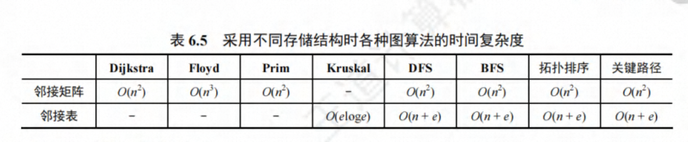
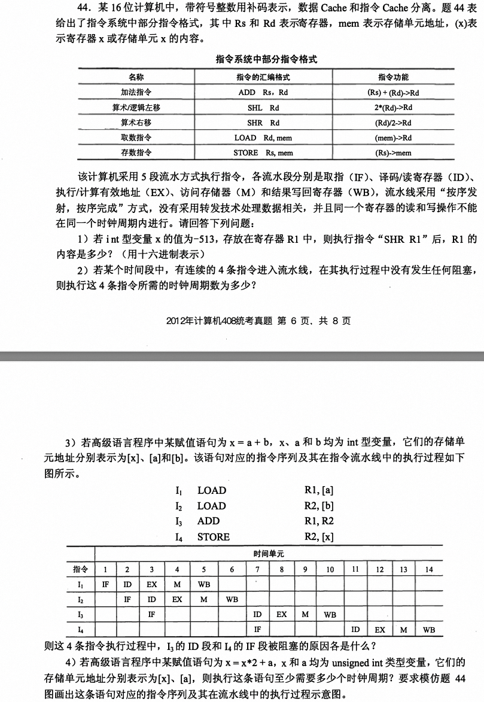
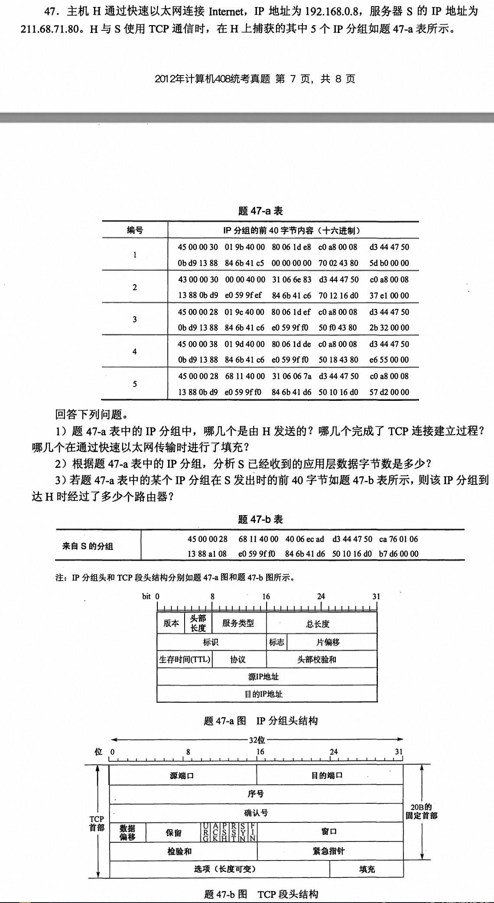

# 2012 

## 1. 中缀和后缀转换

栈在括号匹配中的应用

栈在表达式求值中的应用（计算栈的深度和栈中元素）区分操作符和操作数

中缀转后缀：

`(A+B)*C-D/E` 转换为后缀表达式：

初始化：栈为空，结果列表为空。

扫描过程：

遇到左括号“(`”：压入栈。

遇到操作数“A”：加入结果列表。

遇到操作数“B”：加入结果列表。

遇到操作符“+”：栈顶为左括号，故直接压入栈。

遇到右括号“)`”：弹出栈顶“+”加入结果列表，移除左括号。

遇到操作符“*”：栈为空，直接压入栈。

遇到操作数“C”：加入结果列表。

遇到操作符“-”：弹出栈顶“*”加入结果列表，再将“-”压入栈。

遇到操作数“D”：加入结果列表。

遇到操作符“/”：弹出栈顶“-”加入结果列表，再将“/”压入栈。

遇到操作数“E”：加入结果列表。

最终栈中只剩余操作符“/”，弹出并加入结果列表。


后缀表达式求值：操作数入栈，操作符


## 2. 平衡二叉树结点总数计算

>平衡二叉树平衡因子为1，结点总数的计算：

对于一棵平衡二叉树，其中所有非叶子节点的平衡因子均为1，这意味着每个非叶子节点的左子树高度比右子树高1。这种情况下，整棵树可以看作是一棵**完全倾斜的AVL树**，即每一层都尽可能多地向一侧扩展。

假设平衡二叉树的高度为 ( h )，那么在这种特定的情况下，我们可以通过递推公式来计算节点总数。设 ( N(h) ) 表示高度为 ( h ) 的平衡二叉树的节点总数。

由于每个非叶子节点的平衡因子都是1，所以高度为 ( h ) 的树可以分解为：

左子树的高度为 ( h-1 )
右子树的高度为 ( h-2 )
因此，节点总数满足以下递推关系：
[ N(h) = N(h-1) + N(h-2) + 1 ]

初始条件为：
[ N(0) = 0 ]
[ N(1) = 1 ]

现在我们手动计算一下高度为6的情况：
```c
[
\begin{align*}
N(0) & = 0 \
N(1) & = 1 \
N(2) & = N(1) + N(0) + 1 = 1 + 0 + 1 = 2 \
N(3) & = N(2) + N(1) + 1 = 2 + 1 + 1 = 4 \
N(4) & = N(3) + N(2) + 1 = 4 + 2 + 1 = 7 \
N(5) & = N(4) + N(3) + 1 = 7 + 4 + 1 = 12 \
N(6) & = N(5) + N(4) + 1 = 12 + 7 + 1 = 20 \
\end{align*}
]
```
因此，高度为6的平衡二叉树，所有非叶子节点的平衡因子均为1时，该平衡二叉树的节点总数为20。

## 3. 图的相关复杂度分析



## 4. 拓扑排序唯一性问题

AOV网（有向无环图）


是对**有向无环图**的一种排序，可用于判断是否存在回路

每次选择入度为0的结点，并消去与之相连的边，直到当前图中不存在无前驱的结点为止。

可利用DFS实现拓扑排序，利用结束时间从大到小排列（父结点的结束时间大于孩子结点的结束时间）

> 存在性和唯一性的判断：

各个点仅有唯一的前驱或后继，拓扑排序唯一，否则不唯一

邻接矩阵存储 若为三角矩阵(上三角或狭三角)，则存在拓扑排序，反之不一定

如果图中不存在两个顶点同时满足入度为 0 的条件，则拓扑排序是唯一的。

    A -> B
    |     |
    v     v
    C -> D

    A -> B
         |
         v
    C <- D
邻接矩阵：
```text
  A B C D
A 0 1 1 0
B 0 0 0 1
C 0 0 0 1
D 0 0 0 0

  A B D C
A 0 1 0 0
B 0 0 1 0
D 0 0 0 1
C 0 0 0 0
```

拓扑排序的唯一性取决于图的结构。如果在任一步骤中存在多个入度为 0 的顶点，则拓扑排序就不是唯一的。反之，如果每一步只有一个入度为 0 的顶点，则拓扑排序是唯一的。

判断一个图中是否存在回路：

DFS、BFS、并查集、拓扑排序

## 5. 最小生成树

针对于带权无向图

> 最小生成树唯一性问题

图中所有边的权重都不同，那么最小生成树是唯一的。

Prim算法：

取相邻不重复的最小权值的边加入

时间复杂度：O(V^2) 不依赖于E 适合边稠密图

Kruskal算法：

按照权值递增次序选择合适的边来构造

时间复杂度O(ElogE)，不依赖于V，适合边稀疏而顶点多的图

总的来说，不论采取何种策略，最小生成树的代价是唯一的。

## 6. 每一趟可确定一个元素的最终位置的排序

不可确定：插入排序中的希尔排序、基数排序、归并排序

其余均可确定

## 7. IEEE754单精度浮点数

单精度浮点数格式（32位）：1一位符号位，8位阶码，23位尾数（最高位隐含1所以拓展到24位）

双精度浮点数格式（64位）：一位符号位，11位阶码，52位尾数

阶码使用移码e表示（真值+偏置值127） 1～254，真值范围-126 ～ 127

> 单精度最小值和最大值(2012 14)

最小值 1.0 x 2^-126    

最大正整数  1.111111... x 2^127 = (2-2^-23) x 2^127  = 2^128 - 2^104 (2012)

阶码全0全1的含义（正零、负零、正无穷、负无穷）

0.23个11如何表示？ 2-2^-23

非规格化数的满足条件：阶码全0 尾数不为0 

非规格化正数和负数：尾数 x 2^-126

## 8. [微程序控制](/fundamentals/computer-organization/chapter5#微程序控制器)

- 直接编码方式：每一位代表一个控制信息
- 字段直接编码方式：各个互斥类采用2^n编码方式
- 字段间接编码方式：通过微指令中的字段来决定下一条微指令的地址，从而实现灵活多变的控制流程

微指令中的操作控制字段采用字段直接编码法，共有33个微命令，构成5个互斥类，分别包含7、3、12、5 和6个微命令

共需要：3+ 2 + 4 + 3 +3 = 15位

## 9. [IO总线的传输内容](/fundamentals/exam-408/2011#_10-系统总线-总线)

1/0接口与CPU之间的1/0总线有数据线、控制线和地址线。 控制线和地址线都是单向传
输的，从CPU传送给1/0接口， 而1/0接口中的命令字、 状态字以及中断类型号均是由1/0接 口发往CPU的，故只能通过1/0总线的数据线传输。

## 10. [中断隐指令](/fundamentals/computer-organization/chapter7#i-o-方式)

关中断、保存断点（PC和PSW）、引出中断服务程序

## 11. 中断处理和子程序调用的区别

子程序调用只需保存程序断点， 即该指令的下一条指令的地址;中断调用子程序不仅要保护断点(PC 的内容)，而且要保护程序状态字寄存器的内容PSW。在中断处理中，最重要的两个寄存器是PC 和PSWR。

区分条件转移指令，条件转移指令需要用到PSW中的标志位信息

## 12. 虚拟存储器的分配技术

**[内存分配方式](/fundamentals/operating-systems/chapter3#连续分配存储管理方式)**

在程序装入时，可以只将程序的一部分装入内存，而将其余部分留在外存，就可以启动程 序执行。 采用连续分配方式时，会使相当 一 部分内存空间都处于暂时或 “ 永久 ” 的空闲状态， 造成内存资源的严重浪费， 也无法从逻辑上扩大内存容量， 因此虚拟内存的实现只能建立在离 散分配的内存管理的基础上。 有以下三种实现方式: CD请求分页存储管理;@请求分段存储管 理;@请求段页式存储管理。 虚拟存储器容量既不受外存容量限制， 也不受内存容量限制， 而是由CPU的寻址范围决定的。

## 13. IO子系统层次

- 用户层软件：产生IO请求
- 设备独立性软件：映射、保护、分块、缓冲、分配
- 设备驱动程序：设置设备寄存器、检查状态
- 中断处理程序：保护现场、恢复现场
- 硬件

## 14. read系统调用的过程

要读一个文件首先要用open系统调用打开该文件。open中的参数包含文件的路径名与文件名， 而read只需要使用open返回 的文件描述符 ， 并不使用文件名作为参数。read要求用 户提供三个输入参数:@文件描述符fd; @buf缓冲区首址;@传送的字节数n。read的功能是试图 从fd所指示的文件中读入n个字节 的数据， 并将它们送至由指针buf所指示的缓冲区中。

## 15. [ICMP协议](/fundamentals/exam-408/2010#_15-icmp报文的类型)

使用ip协议

**注意关联IGMP协议：**

IGMP（Internet Group Management Protocol）是互联网组管理协议，主要用于多播环境中主机和路由器之间的通信。IGMP允许主机加入或离开一个多播组，并使路由器能够了解哪些主机属于哪个多播组，进而转发多播流量给正确的接收者

## 16. GBN协议

为使信道利用率到达最高，即发送的时间t要尽可能的小，故发送数据的大小要小，128B～512B使用128B数据帧的长度，**发送时延=128x8 / 10x10^3 = 64ms**,**RTT = 270ms x 2**,**一个传输周期 = 64ms + RTT + 确认帧发送时延 = 668ms**，**在一个发送周期内能发送的帧数 = 668ms / 64 = 10.4**，需要4位序号对滑动窗口编号

GBN协议窗口大小：发送窗口 = 1 ~ 2^n -1 ，接受窗口 = 1

GBN协议使用**累计确定**，对某个数据帧的确认表示它之前所有的帧都以正确接受，

GBN超时重传会重新发送超时帧并且丢弃超时帧之后已发送的帧

选择重传协议：发送窗口 + 接受窗口 <= 2^n 正常情况下 发送窗口 = 接受窗口 = 2^(n-1)

选择重传会对每个发送的帧逐个确认，故重传的时候只重传指定的帧。

**信道利用率分析：**

信道利用率 = 在一个发送周期内可发送的帧数 = nx发送时延Td / (发送时延 + RTT + 确认时延)

不同的协议n的取值不同，停等协议发送窗口为1，故n=1，GBN和SQ需要根据窗口大小来定，如果同样大小为n，GBN能发送的帧数大于SQ，因2^n -1 >= 2^(n-1)

## 17. IP分组校验

IP头部校验和只校验头部，不对数据进行校验

- 校验头部和数据部分：TCP、UDP（可选）。
- 仅校验头部：IP（IPv4）、ICMP、DHCP。
- 无校验：ARP。


**IP分组的格式：**

1.	版本：占4位；IP的版本，目前广泛使用的版本号为4。
2.	首部长度：占4位；4B的倍数，因为首部长度为4的倍数，所有数据部分的长度也是4的倍数。以32位为单位，最大值为60B（15X4B）。最常用的首部长度是20B，此时不使用任何选项（即可选字段）。
3.	总长度：16位；指首部和数据之和的长度，单位为字节，因此数据报的最大长度为216−1=65535B。
4.	标识：16位；它是一个计数器，每产生一个数据报就加1，并赋值给标识字段。并不是“序号”，因为IP是无连接服务。
5.	标志：3位；只有后两位有意义，标志字段的最低位为MF，MF=1表示后面还有分片，MF=0表示最后一个分片。标志字段中间的一位是DF，只有当DF=0时才允许分片。
6.	片偏移：13位；他指出较长的分组在分片后，某片在原分组中的相对位置。8个字节为偏移单位，即每个分片的长度一定是8B（64位）的整数倍。
7.	首部校验和：16位；IP数据报的首部校验和只校验分组的首部，而不校验数据部分。
8.	生存时间（TTL）：8位；数据报在网络中可通过路由器数的最大值。路由器在分组转发前，先把TTL减1。若TTL被减为0，则该分组必须丢弃。
9.	协议：8位；指出此分组携带的数据使用何种协议。如6代表TCP，17代表UDP。
10.	源地址字段：32位；标识发送方的IP地址。
11.	目的地址字段：32位；标识接收方的IP地址。


## 18. ARP

1. ARP是解决**同一局域网**上的IP地址与硬件地址映射的问题。全世界存在各种各样的网络，他们使用不同的硬件地址，要使这些异构网络能够通信必须进行非常复杂的硬件地址转换工作，而IP编址把这个复杂问题解决了。
2. ARP木马原理：利用ARP协议漏洞，把虚假的网关MAC地址发给受害主机，造成局域网大量的ARP信息从而造成网络拥塞。没有破坏网络的连通性。

## 19. 电子邮件协议

SMTP(TCP)采用“推” 的通信方式， 在用户代理向邮件服务器及邮件服务器之间发送邮件时，
SMTP客户主动将邮件 “推” 送到SMTP服务器。 

而POP3(TCP)采用“拉” 的通信方式， 当用户读 取邮件时， 用户代理向邮件服务器 发出请求， “ 拉 ” 取用户邮箱中的邮件 。

## 20. 合并多个有序序列

**设有6个有序表A、 B、C、D、E、F,分别含有10、35、40、50、60和120个数据元素， 各表中元素按升序排列。 要求通过5次两 两合并， 将6个表最终合并成1个升序表， 并在最坏情况下比较的总次数达到最小。 请回答下列问题。**

**1 给出完整的合并过程， 并求出最坏情况下比较的总次数。**

元素最少的两两先开始合并

- 10 + 35 = 45 加入到序列中构成`{40,45,50,60,120}`
- 40 + 45 = 85 加入到序列中构成`{50,60,85,120}`
- 50 + 60 = 110 加入到序列中   `{85,110,120}`
- 85 + 110 = 195              `{120,205}`
- 120 + 205 = 315

总次数 = 45 + 85 + 110 + 195 + 315 = 829

**2 根据你的合并过程， 描述N(N>=2)个不等长升序表的合并策略， 并说明理由。**

每次都合并两个最小的表，总比较次数最少

## 21. 使用链表存储两个字符串的序列，求相同后缀的起始位置

例如loading和being

```c
// 空间换时间
int findcommonSuffix(list *str1,list *str2){
  int A[];
  int B[];
  int lengthA=0;
  int lengthB=0;
  list *p = str1 - >next;
  list *q = str2 - >next;
  while(p || q){
    if(p)  A[lengthA] = p->data,lengthA++,p=p->nex;
    if(q)  B[lengthB] = q->data,lengthB++,q=q->nex;
  }
int i = max(lengthA,lengthB);
  for(i;i>0;i--){
    if(A[lenghtA] == B[lengthB]) lenghtA--,lengthB--;
    return ;
  }

}
```

## 22. [计算机性能指标 （‼️）](/fundamentals/computer-organization/强化#第一章)

**假定某计算机的CPU主频为80MHz,CPI为4, 平均每条指令访存1.5次，主存与Cache之间交换的块大小为 16B,Cache的命中率为99%, 存储器总线宽度为32位。请回答下列问题。**

（1）该计算机的MIPS数是多少?平均每秒Cache缺失的次数是多少?在不考虑DMA传送的情况下， 主存带宽至少达到多少才能满足CPU的访存要求?

<div><span  class='text-[red]'>平均每秒CPU执行的指令数：</span><span class='text-[]'>主频 / CPI</span></div>

（平均每秒CPU执行的指令数）MIPS = 主频 / CPI x 10^6 = 80MHz / 4 x 10^6 = 20

每秒钟访存次数 =每秒钟CPU执行的指令数 x 每条指令访存次数 =  80M x 1.5 / 4  = 30M

每秒cache平均缺失次数 = 每秒钟访存次数 x cache缺失率 = 300k

主存带宽= 每秒cache平均缺失次数 x 一次访问所需要的数据 = 300k x 16B = 4.8MB/s

（2）假定在Cache缺失的情况下访问主存时， 存在0.0005%的缺页率 ， 则CPU平均每秒产生多少次缺页异常?若页面大小为4KB, 每次缺页都需要访问磁盘， 访问磁盘时DMA传送采用周期挪用方式， 磁盘1/0接口的数据缓冲寄存器为32位， 则磁盘1/0接口平均每秒发出的DMA请求次数至少是多少?

每秒钟产生的缺页次数 = 每秒cache平均缺失次数 x 缺页率  = 300k x 0.0005% = 1.5次

[周期性挪用](/fundamentals/computer-organization/chapter7#dma-方式)

DMA挪用CPU一个存储周期传送32位数据（注意区分传送一个块）

一个页面4KB，数据缓冲寄存器32位，故需要DMA占用的挪用周期数 = 4KB/ 4B = 1K
DMA每秒钟发出的请求次数 = 每秒产生缺页次数 x DMA占用的挪用周期数  =  1.5次 x 1K = 1536

（3）CPU和DMA控制器同时要求使用存储器总线时， 哪个优先级更高?为什么?

DMA优先级更高，因为DMA不能及时占用总线会导致数据丢失

（4）为了提高性能，主存采用四体低位交叉存储模式，工作时每1/4个存储周期启动 一个体。
若每个体的存储周期为50ns, 则该主存能提供的最大带宽是多少?

4 x 4B / 50ns = 320MB/s

## 23. 指令流水线



（1）int型变量x=-513 化为带符号二进制 =-10 0000 0001 =  FFFFFDFE

算数右移1位 FFFF FEFFH

（2）5 + 3 = 8个时钟周期数

（3）I3执行ADD指令，在ID段译码读R1和R2寄存器，但R2寄存器在6时刻才被写入R2寄存器中，故被阻塞，<span class='text-rose-400'>I4的IF被阻塞?</span>


(4)

I1 LOAD      `R1,[x]`

I2 LOAD      `R2,[a]`

I3 SHL       `R1`

I4 ADD       `R1, R2`

I5 STORE     `R2,[x]`

需要17个时钟周期


## 24. 页面置换

**某请求分页系统的局部页面置换策略如下:系统从0 时刻开始扫描， 每隔5个时间单位扫描一轮驻留集(扫描时间忽略不计)，本轮没有被访问过的页框将被系统回收， 并放入到空闲页框链尾， 其中内容在下一 次分配之前不被清空。 当发生缺页时， 如果该页曾被使用 过且还在空闲页链表中， 那么重新放回进程的驻留集中;否则， 从空闲页框链表头部取出一个页框。**

假设不考虑其他进程的影响和系统开销。 初始时进程驻留集为空。 目前系统空闲页框链表
中页框号依次为32、 15、 21、 41。进程P依次访问的<虚拟页号，访问时刻>是`<1,1>,<3,2>,<O, 4>,<O,6>,<1,11>,<O,13>,<2,14>`。 请回答下列问题。

**绘制甘特图**

1)访问<0,4>时， 对应的页框号是什么?说明理由。

2)访问<I,11>时， 对应的页框号是什么?说明理由。

3)访问<2,14>时， 对应的页框号是什么?说明理由。 

4)该策略是否适合于时间局部性好的程序?说明理由。

适用

## 25. 文件系统

**某文件系统空间的最大容量为4TB (1TB =2^40B), 以磁盘块为基本分配单位。磁盘块大小为1KB。 文件控制块(FCB)包含一个 512B 的索引表区。 请回答下列问题。**

（1）假设索引表区仅采用直接索引结构， 索引表区存放文件占用的磁盘块号， 索引表项中块号最少占多少字节?可支持的单个文件最大长度是多少字节?

最大容量4TB，每个磁盘块1KB，可容纳 4TB / 1KB  = 4GB个磁盘块，故块号占32位4字节，FCB可容纳 512B / 4B = 128个，故可支持的单个最大文件长度 = 128 x 1KB = 128KB

（2）假设索引表区采用如下结构:第0-7字节采用<起始块号，块数>格式表示文件创建时预分配的连续存储空间，其中起始块号占6B , 块数占2B; 剩余504字节采用直接索引结构， 一个索引项占6B, 那么可支持的单个文件最大长度是多少字节?为了使单个文件的长度达到最大，请指出起始块号和块数分别所占字节数的合理值并说明理由。

连续存储：起始块号6B，块数占2B = 16位，故可存储2^16 x 1KB  = 64MB

直接索引：一个索引项占6B，504B/6B = 84个索引项，84x1KB = 84KB

最大文件长度：64MB + 84KB 

单个文件长度达到最大，所需块数需要达到最大，故块号占4B，块数占4B

## 26. IP&TCP



（1）主机IP地址192.168.0.8 = c0 a8 00 08 服务器S的IP地址 211.68.71.80 = d3 44 47 50

由图可知，编号1、3、4的源IP地址为c0 a8 00 08，目地IP地址为d3 44 47 50，故这三个由H发送

TCP连接的建立首次：SYN=1 ACK=0，第二次：SYN=1，ACK=1，第三次：SYN=1，ACK=1

首次：20 = 0010 0000，SYN=1，ACK=0，发起握手

第二次：12 = 0001 0010，SYN=1，ACK=1，确认握手

第三次：f0 = 1111 0000，SYN = 0，ACK = 1，发送数据

TCP建立链接：1、2、3

<div class='text-[red]'>IP需要填充的情况，以太网最小有效载荷46B，可通过总长度判断</div>

编号3、5的总长度为28 = 0010 1000 = 40B < 46B 故需要在mac层填充

（2）编号5的确认号 = 84 6b 41 d6  编号3主机开始发送数据 序号为= 84 6b 41 c6 ，故已发送d6  - c6 = 10H = 16B

（3）根据标识 = 68 11 H，确定是编号5的IP数据报，编号5的TTL = 31 ，发出时TTL = 40H，故经过15个路由器。

