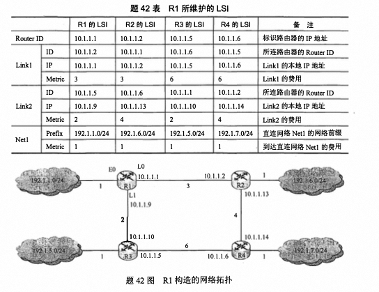
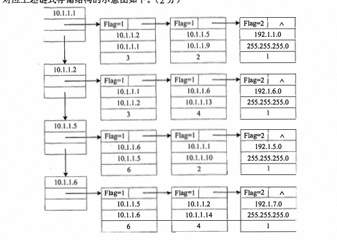

# 2014

## 1. [中缀转后缀](/408/2012#_1-中缀和后缀转换)

**[栈的相关应用](/dataStructure/chapter3#栈在表达式求值中的应用)**

## 2. 循环队列判空和判满

**[2011](/408/2011#_1-循环队列)**

最多容纳M-1个元素，故mod(M-1)

判定队满，end1 == (end2 + 1) mod (M-1)

判定队空：end1 == end2

## 3. 森林转二叉树，二叉树叶子结点个数

森林转二叉树：左孩子右兄弟原则；

**二叉树中叶结点的个数就等于森林中左孩子指针为空的结点个数**


## 4. B树

- [2013](/408/2013#_4-b树和b-树结点数和根结点的区别)
- [2009](/408/2009#_3-m阶b树和b-树的区别)

**区分关键字数和结点数**

在一棵具有15个关键字的4阶B树中， 含关键字的结点个数最多是：

关键字数量不变，要求结点数量 最多，那么即每个结点中含关键字的数最最少。根据4 阶 B树的定义，根 结点最少含l个关键字，非根结点中最少含`ceil((4/2))-1=1`个关键字 ，所以每个结点中，关键字数量最少都为1个，即每个结点都有2个分支，类似于排序二叉树，而15个结点 正好可以构造一个4层的4阶B树，使得叶结点全在第四层。

## 5. 希尔排序的间隔（增量）

- [希尔排序](/dataStructure/chapter8#希尔排序-缩小增量排序)
- [2009](/408/2009#_4-插入排序)

间隔（增量）的判定：
`9,1,4,13, 7, 8,20,23,15` ，9-13-20为有序，增量为3

## 6. CPU执行时间

- [计算机性能指标](/组成原理/chapter1#计算机性能指标)
- [2012](/408/2012#_22-计算机性能指标-%EF%B8%8F)
- [性能指标](/组成原理/强化#_3-性能指标)

**CPU执行时间 = 指令条数 * CPI * 时钟周期**

## 7. IEEE754浮点数比较大小

- [2013](/408/2013#_6-ieee浮点数格式-补码的表示范围-%EF%B8%8F)
- [2012](/408/2012#_7-ieee754单精度浮点数)
- [浮点数](/组成原理/chapter2#浮点数的表示格式)

**如果为负数，阶码越大值越小。**

## 8. DSRAM引脚数

- [SRAM 芯片和 DRAM 芯片](/组成原理/chapter3#sram-芯片和-dram-芯片)

 **某容量为`256MB`的存储器由若干`4Mx8位`的DRAM芯片构成， 该DRAM芯片的地址引脚和数据引脚总数是**

256MB容量需要将4Mx8位进行字拓展，需要64块DRAM芯片，片选信号需要6位，4M需要地址线22位，数据线需要8位。

DSRAM采用地址线复用技术，地址线是原来的一半为11根，故DRAM芯片的地址引脚和数据引脚总数 = 11 + 8 = 19

## 9. 指令寻址偏移量

**某计算机有16个通用寄存器，采用32位定长指令字，操作码字段(含寻址方式位) 为8位，Store指令的源操作数和目的操作数分别采用寄存器直接寻址和基址寻址方式。若基址寄存器可使用任一通用寄存器，且偏移量用补码表示， 则Store 指令中偏移量的取值范围为：**

32为定长指令字，操作码占8位，16个通用寄存器需要4位，源操作数使用寄存器直接寻址4位，目的操作数使用基址寻址4位+偏移量16位，所以16位补码可表示的范围为：**-32768-+32767（2^16 = 65536，2^15 = 32768）**

| 操作码8位   | 源操作4位   | 目的操作数4位    | OFFSET |

## 10. 微指令下地址（断定法）

- [断定法](/组成原理/chapter5#微程序控制器)
- [微指令编码](/408/2012#_8-微程序控制)

断定法：由微指令的后继地址字段（也称下地址字段）指出。在微指令格式中设置一个后继地址字段，由微指令的后继地址字段直接指出后继微指令的地址，这种方式也称**断定方式**。

**某计算机采用微程序控制器，共有32条指令， 公共的取指令微程序包含2条微指令各指令对应的微程序平均由4条微指令组成， 采用断定法(下地址字段法)确定下条微指令地址， 则微指令中下地址字段的位数至少**

计算机共有 32 条指令，各个指令对应的微程序平均为 4 条，则指令对应的微指令为 32x4= 128 条， 而公共微指令还有 2 条， 整个系统中微指令的条数一共为 128 + 2=130 条， 所以需要 log2 130=8 位才能寻址到 130 条微指令

## 11. 突发传送

猝发(突发)传输是在一个总线周期中， 可以传输多个存储地址连续的数据， **即一次传输一个地址和一批地址连续的数据**

并行传输是在传输中有多个数据位同时在设备之间进行的传输

串行传输是指数据的二进制代码在一条物理信道上以位为单位按时间顺序逐位传输的方式

同步传输是指传输过程由统一的时钟控制

## 12. IO接口和IO端口

- [IO接口](/组成原理/chapter7#i-o-接口)
- [I/O 接口的数据线上传输的内容](/408/2012#_9-io总线的传输内容)
- [总线](/408/2011#_10-系统总线-总线)

I/O 端口是指 I/0 接口电路中可被 CPU 直接访问的寄存器，主要有数据端口、状态端口和控 制端口。

I/O 端口要想能够被 CPU 访问，就必须要对各个端口进行编址，每个端口对应一个端口地址。而对 I/O 端口的编址方式有与存储器独立编址和统一编址两种。

1. **独立编址**

独立编址也称 I/O 映射方式，是指对所有的 I/O 端口单独进行编址。I/O 端口的地址空间与主存地址空间是两个独立的地址空间，它们的范围可以重叠，相同地址可能属于不同的地址空间。因此需设置专门的 I/O 指令来表明访问的是 I/O 地址空间，I/O 指令的地址码给出 1/O 端口号。

2. **统一编址**

统一编址也称存储器映射方式，是指把主存地址空间分出一部分给 I/O 端口进行编址，I/0 端口和主存单元在同一地址空间的不同分段中，根据地址范围就能区分访问的是 I/O 端口还是主存单元，因此无须设置专门的 I/O 指令，用统一的访存指令就可访问 I/O 端口。

## 13. IO方式占用CPU时间

**若某设备中断请求的响应和处理时间为1OOns , 每400ns发出一次中断请求， 中断响应所允许的最长延迟时间为50sn , 则在该设备持续工作过程中，CPU用于该设备的 I/0时间占 整个CPU时间的百分比至少是**


每 400ns发出一次中断请求，而响应和处理时间为1OOns, 其中允许的延迟为干扰信息， 因为在50ns 内， 无论怎么延迟， 每400ns还是要花费1OOns处理中断的， 

**CPU用于该设备的 I/0时间占 整个CPU时间 = 100ns / 400ns = 25%**

## 14. 用户态执行指令

- [操作系统运行环境](/os/chapter1#操作系统的运行环境)
  
trap指令、跳转指令、压栈指令能在用户态执行

关中断指令只能在核心态

## 15. 位示图容量计算

**现有一个容量为10GB的磁盘分区， 磁盘空间以簇(Cluster)为单位进行分配， 簇的大小为4KB, 若采用位图法管理该分区的空闲空间， 即用一位(bit)标识一个簇是否被分配， 则存放该位图所需簇的个数为**

蔟的个数 = 10GB / 4KB 

1bit存放一个蔟，所以位示图所占蔟数 = 蔟的个数 / 4KB * 8 = 10GB / 4KB * 4KB * 8 = 80个蔟

## 16. 加快虚实地址转换

交换区：交换区用于内存管理（存放临时不活跃的内存页面）、文件区用于文件数据的长期访问和存储，交换区的io速度大于文件区的io速度

虚实地址转换是指逻辑地址和物理地址的转换。

增大快表容量能把更多的表项装入快表中，会加快虚实地址转换的平均速率;

让页表常驻内存可以省去一些不在内存中的页表从磁盘上调入的过程，也能加快虚实地址转换;

## 17. 文件的打开

**[文件的打开和关闭](/os/chapter4#文件的基本操作)**

注意区分打开文件表和文件控制块的区别：
- 打开文件表主要关注于进程级别的文件管理，记录了进程内部的所有打开文件信息。文件控制块则更侧重于文件本身的元数据管理，不受限于特定进程。
- 打开文件表更多地记录了文件描述符、文件读写位置等动态信息。文件控制块则保存了文件的静态属性，如文件名、大小、权限等。
- 打开文件表随着进程的启动而创建，随进程的终止而销毁。文件控制块则与文件的存在周期一致，在文件被创建时产生，在文件被删除后消失。

## 18. Belady异常

- [抖动&工作集&Belady](/408/2011#_13-抖动-工作集-belady)
**只有FIFO才会出现belady异常**

## 19. 进程通信-管道

- [进程通信](/os/chapter2#进程通信)

管道实际上是一种**固定大小的缓冲区**， 管道对于管道两端的进程而言， 就是一个文件， 但它不是普通的文件， 它不属于某种文件系统， 而是自立门户， 单独构成一种文件系统， 并且**只存在于内存中**。

它类似于通信中**半双工信道**的进程通信机制， 一个管道可以实现双向的数据传输， 而同一个时刻只能最多有一个方向的传输， 不能两个方向同时进行。

管道的容量大小通常为内存上的一页， 它的大小并不是受磁盘容量大小的限制。 

当管道满时，进程在写管道会被阻塞， 而当管道空时， 进程在读管道会被阻塞。

## 20. 交换机自学习

- 接收帧：交换机接收到一个以太网帧。
- 检查源MAC地址：交换机会查看该帧的源MAC地址，并将其与当前的MAC地址表进行比较。
- 更新MAC地址表：如果源MAC地址不在MAC地址表中，则交换机会将这个MAC地址添加到其MAC地址表中，并记录该MAC地址所连接的端口号。
- 转发帧：接下来，交换机会查找目的MAC地址是否存在于MAC地址表中。如果找到匹配项，则通过相应的端口转发该帧；如果没有找到匹配项，则采用广播方式发送该帧至所有端口（除了接收该帧的端口外）。
- 老化机制：为了防止MAC地址表无限增长，交换机会定期清理不再使用的条目。通常情况下，如果某个MAC地址一段时间内没有被访问，则会被移除。

## 21. 信道数据传输速率

- [2009](/408/2009#_8-数据传输速率)

奈奎斯特定理：

极限码元传输速率为 2W（波特率） W为信道频率带宽 V表示码元的离散点平数

理想情况极限数据传输速率 = 2W log2V （b/s）

香农定理：

信道极限数据传输速率 = Wlog2(1 + S/N)

信噪比 = 10 log10(S/N)

最大速率需要对比是否为理想信道 算出奈式准则下的速率和香农速率 综合对比

## 22. GBN协议最大平均数据传输率

**主机甲与主机乙之间使用后退N帧协议（GBN）传输数据，甲的发送窗口尺寸为1000，数据帧长为1000字节，信道带宽为100Mbps，乙每收到一个数据帧立即利用一个短帧（忽略其传输延迟）进行确认，若甲、乙之间的单向传播延迟是50ms，则甲可以达到的最大平均数据传输速率约为**

**数据传输速率 = 传输的数据量 / 传输时间** 

GBN协议传输数据量 = 窗口尺寸1000 * 数据帧长1000B = 1MB

传输时间 = 第一个帧发送时间 + RTT + 确认时间 = 1000B / 100Mbps + 100ms = ❌
> 为什么不加第一个发送帧的时间
传输时间 = 发送第一个帧到接收到它的确认的时间是一个往返时延 = RTT

最大数据平均传输速率 = 1MB / 0.1s = 80Mb/s

## 23. 码分复用（码分多址‼️）

**站点 A、B、C通过CDMA共享链路，A、B、C的码片序列(chipping sequence) 分别是(1,1,1,1)、(1,-1,1,-1)和(1,1,-1,-1)。若C从链路上收到的序列是(2,0,2,0,0,-2,0,-2,0, 2,0,2), 则C收到 A 发送的数据是**

不同站的码片序列相互正交，即内积为0。

把收到的序列分成每 4 个数字一组， 即为(2, 0, 2, 0)、 (0, -2, 0, -2)、 (0, 2, 0, 2), 因为题目求 的是 A 发送的数据，因此把这三组数据与 A 站的码片序列(1, 1, 1, 1)做内积运算，结果分别是(2, 0, 2, 0) * (1, 1, 1, 1)/4 = 1、 (0, -2, 0, -2)• (1, 1, 1, 1)/4 = -1、 (0, 2, 0, 2)• (1, 1, 1, 1)/4 = 1, 所以C 接收到的A发送的数据是101,

## 24. 带权路径长度WPL（‼️）

**二叉树的带权路径长度（WPL）是二叉树中所有叶结点的带权路径长度之和。给定一棵二叉树T，采用二叉链表存储，结点结构如下：**

| left | weight | right |

**其中叶结点的weight域保存该结点的非负权值。设root为指向T的根结点的指针，请设计求T的WPL的算法，要求：**

**1）给出算法的基本设计思想。**

WPL = 各叶子结点的权值*深度之和

利用先序遍历遍历二叉链表树，使用一个静态变量记录WPL，递归函数的第二个参数记录深度

判断当前结点是否为叶子结点，如果是，则累加WPL = WPL + weight*deep

如果为非叶子结点，如果左孩子存在，则递归调用，deep++，如果为右孩子，则递归调用，deep++。

**2）使用C或C++语言，给出二叉树结点的数据类型定义。**

```c
typedef struct BiTNode {
  int weight;
  struct BiTNode *left,*right;
}
```

**3）根据设计思想，采用C或C++语言描述算法，关键之处给出注释。**

```c

int wpl_PreOrder(BiTree *root, int deep) {
  // 这个静态变量用来存储带权路径长度的累积值。由于它是静态变量，所以会在整个函数的作用域内保持其值不变。
    static int wpl = 0; // 静态变量存储wpl

    if (root == NULL) {
        return wpl;
    }

    if (root->lchild == NULL && root->rchild == NULL) { // 若为叶子结点，累积wpl
        wpl += deep * root->weight;
    }

    if (root->lchild != NULL) { // 若左子树不空，对左子树递归遍历
        wpl_PreOrder(root->lchild, deep + 1);
    }

    if (root->rchild != NULL) { // 若右子树不空，对右子树递归遍历
        wpl_PreOrder(root->rchild, deep + 1);
    }

    return wpl;
}
```

## 25. 图的链式存储&ip

**某网络中的路由器运行OSPF路由协议，题42表是路由器Rl维护的主要链 路状态信息(LSI),题42图是根据题42表及Rl的接口名构造出来的网络拓扑。**



请回答下列问题。

**1）本题中的网络可抽象为数据结构中的哪种逻辑结构？**

图结构、无向图

**2）针对题42表中的内容，设计合理的链式存储结构，以保存题42表中的链路状态信息（LSI）。要求给出链式存储结构的数据类型定义，并画出对应题 42 表的链式存储结构示意图（示意图中可仅以 ID 标识结点）。**

[图的链式存储？邻接表](/dataStructure/chapter6#邻接表法)

顶点通过链式存储，边表通过链式存储,
```c
// 
typedef struct NetNode {
#define MaxVertexNum 100; //图中顶点数目的最大值

typedef struct ArcNode {.  // 边表结点
   int adjvex;             // 该弧指向的顶点的位置
   struct ArcNode *nextarc // 指向下一条的指针
   // InfoType info;       // 网的边权值
}ArcNode

typedef struct VNode{     // 顶点表结点
   VertexType data;       // 顶点信息
   ArcNode *firstarc;     // 指向第一条依附该顶点的弧的指针
}VNode, AdjList[MaxVertexNum]

typedef struct {
   AdjList vertices;  // 邻接表
   int vexnum , arcnum; // 图的顶点数和弧数
} ALGraph              //ALGr aph 是以邻接表存储的图类型


//Link的结构 
typedef struct {
  unsigned int ID, IP;
}LinkNode

//Net的结构 
typedef struct{
unsigned int Prefix, Mask: 
}NetNode;


typedef struct Node{
int Flag;//Flag=1为Link;Flag=2为Net 

union{
LinkNode Lnode; 
NetNode Nnode 
}LinkORNet:

unsigned int Metric;
struct Node *next; 

}ArcNode;

//弧结点 
typedef struct HNode{
unsigned int RouterID;
 ArcNode *IN link; 
 struct HNode *next; 
 }HNODE;

//表头结点 
```


**3）按照迪杰斯特拉（Dijkstra）算法的策略，依次给出 R1 到达题42图中子网192.1.x.x 的最短路径及费用**


| 目的网络  | 路径  | 代价  | 
| --- | --- | --- | 
| 192.1.1.0/24   | 直接到达  | 1   | 
| 192.1.5.0/24   | R1->R3  | 3  | 
| 192.1.6.0/24   | R1->R2  | 4  | 
| 192.1.7.0/24   | R1->R2->R3  | 8  | 


**4）假设路由表结构如下表所示，请给出题42图中R1的路由表，要求包括到达题42图中子网192.1.x.x的路由，且路由表中的路由项尽可能少。**

| 目的网络  | 下一跳  | 接口  | 
| --- | --- | --- | 
| 192.1.1.0/24   | -  | E0   | 
| 192.1.5.0/24   | 10.1.1.10  | L1   | 
| 192.1.6.0/23   | 10.1.1.2  |L0  | 

**5）当主机192.1.1.130向主机192.1.7.211发送一个TTL=64的IP分组时，R1通过哪个接口转发该IP分组？主机192.1.7.211收到的IP分组TTL是多少？**

R1通过L0转发

TTL每经过一个路由器减1，经过三个路由器64-3 = 61

**6）若R1增加一条Metric为10的链路连接Internet，则题42表中R1的LSI需要增加哪些信息？**

需要增加Internet，前缀为0.0.0.0/0，Metric为10。

## 26. 指令系统&存储管理&CPU

**（12分）某程序中有如下循环代码段P： `“for（inti=0；i<N；i++） sum+=A[i]；”`.假设编译时变量 sum 和i分别分配在寄存器 R1 和 R2中。常量 N在寄存器 R6 中，数组 A的首地址在寄存器 R3 中。程序段 P 起始地址为 0804 8100H，对应的汇编代码和机器代码如下表所示。**


**OP为操作码： Rs和Rd为寄存器编号： OFFSET为偏移量，用补码表示。请回答下列问题，并说明理由。**

**1）M的存储器编址单位是什么？**

一条指令的长度32位，程序段P起始地址为0804 8100H，第二条指令的地址为0804 8104H，可知M的存储器编址为按字节编址。

**2）已知sll指令实现左移功能，数组A中每个元素占多少位？**

在二进制中某数左移两位相当于乘以4, 由该条件可知，数组间的数据间隔为4个地址单位，而计算机按字节编址， 所以数组A中每个元素占4B 。

**3）表中bne指令的OFFSET字段的值是多少？已知bne指令采用相对寻址方式，当前PC内容为bne指令地址，通过分析表中指令地址和bne指令内容，推断出bne指令的转移目标地址计算公式。**

bne的机器代码为1446 FFFAH可知，OFFSET字段的值为FAH，二进制为1111 1010，OFFSET采用补码，故真值为 1000 0110 = -6。

08048114H(PC) + 4 + 偏移量 = 0804 8100H

偏移量 = 00 - 18H  = -24  = OFFSET * 4

转移地址目标地址 = (PC) + 4 + 4 * OFFSET

**4）若M采用如下“按序发射、按序完成”的 5 级指令流水线：IF（取值）、ID（译码及取数）、EXE （执行）、MEM （访存）、WB （写回寄存器），且硬件不采取任何转发措施，分支指令的执行均引起 3 个时钟周期的阻塞，则P 中哪些指令的执行会由于数据相关而发生流水线阻塞？哪条指令的执行会发生控制冒险？为什么指令 1 的执行不会因为与指令 5 的数据相关而发生阻塞？**


数据冒险：2、3、4、6，因为它们都与各自向前的一条指令发生数据相关

控制冒险：第6条，

当前循环的第五条指令与下次循环的第一 条指令虽然有数据相关， 但由于第6条指令后有 3个时钟周期的阻塞， 因而消除了该数据相关。

**假设对于44题中的计算机M和程序P的机器代码，M采用页式虚拟存储管理；P开始执行时，（R1）=（R2）=0，（R6）=1000，其机器代码已调入主存但不在Cache中；数组A未调入主存，且所有数组元素在同一页，并存储在磁盘同一个扇区。请回答下列问题并说明理由。**

**1）P执行结束时，R2的内容是多少？**

R2为i的内容，R6为N的内容，即执行`i<N`，所以i = 1000。R2的内容为1000；

**2）M的指令Cache和数据Cache分离。若指令Cache共有16行，Cache和主存交换的块大小为32字节，则其数据区的容量是多少？若仅考虑程序段P的执行，则指令Cache的命中率为多少？**

数据区容量 = 16 * 32B = 512B

P共有6条指令，占24字节，小于主存块大小32B, 其起始地址为08048100H, 对应一 块的开始位置，由此可知所有指令都在一个主 存块内。读取第一条指令时会发生Cache缺失，故
将P 所在的主存块调入Cache某一块， 以后每次读取指令时，都能在指令Cache中命中。 因此在 1000次循环中， 只会发生1次指令访问缺失， 所以指令Cache的命中率为(lOOOx6-1 /) (1OOOx6) = 99.98% 。 

**3）P在执行过程中，哪条指令的执行可能发生溢出异常？哪条指令的执行可能产生缺页异常？对于数组A的访问，需要读磁盘和TLB至少各多少次？**

指令4为加法指令 `sum += A[i]`可能发生溢出，当数组A中元素的值过大时，则会导致这条加 法指令发生溢出异常;而指令2、5虽然都是加法指令，但它们分别为数组地址的 计算指令和存 储变量i的寄存器进行自增的指令，而i最大到达1000,所以它们 都不会产生溢出异常。

只有访存指令存在缺页异常，故指令3 可能产生缺页异常

因为数组A在磁盘的一页上，而一开始数组并不在主存中，第一次访问数组时会导致访盘，把A调入内存，而以后数组A的元素都在内存中，则不会导致访盘，所以该程序一共访盘一次。

每问一次内存数据就会查TLB 一次，共访问数组1000次，所以此时又访问TLBlOOO次，还要考虑到第一次访问数组A,即访问`A[0]`时， 会多访问一次TLB (第一次访问`A[0]` 会先查一次TLB,然后产生缺页，处理完缺页中断后，会重新访问`A[0]`,此时又查TLB),所以访问TLB的次数一共是1001次。

## 27. 文件系统

**文件F由200条记录组成，记录从1开始编号。用户打开文件后，欲将内存中的一条记录插入到文件F中，作为其第30条记录。请回答下列问题，并说明理由。**

**1）若文件系统采用连续分配方式，每个磁盘块存放一条记录，文件F存储区域前后均有足够的空闲磁盘空间，则完成上述插入操作最少需要访问多少次磁盘块？F的文件控制块内容会发生哪些改变？**

前29块磁盘块前移一个位置，读写各一次需要58次，第30条记录写入第30块，故最少一共需要 59次

文件控制块的内容有哪些？

起始块地址和文件长度的内容会发生改变

**2）若文件系统采用链接分配方式，每个磁盘块存放一条记录和一个链接指针，则完成上述插入操作需要访问多少次磁盘块？若每个存储块大小为1KB，其中4字节存放链接指针，则该文件系统支持的文件最大长度是多少？**

读入29块的内容，并修改next链接指针，故需要30次，写入第30块的内容，共需要31次。

4B链接指针可表示 2^32个磁盘块，每块的大小1KB，最大文件长度为 = 2^32 * 1020B = 4080GB(1020B因为每块需要4B存储链接指针)

## 28. PV

**系统中有多个生产者进程和多个消费者进程，共享一个能存放 1000 件产品的环形缓冲 区(初始为空)。 当缓冲区未满时，生产者进程可以放入其生产的一件产品，否则等待;当缓冲 区未空时，消费者进程可以从缓冲区取走一件产品，否则等待。 要求一个消费者进程从缓冲区 连续取出 10 件产品后，其他消费者进程才可以取产品。请使用信号量 P, V C或 wait(), signal()) 操作实现进程间的互斥与同步， 要求写出完整的过程， 并说明所用信号量的含义和初值。**

```c
semaphore mutex = 1;//缓冲区的互斥
semaphore product = 0;// 当前的产品数
semaphore buffer = 1000; // 缓冲区容量
semaphore mutex2 = 1 ;//连续取10个的互斥
producer(){
  while(true){
    
    生产产品
    P(buffer);// 判断是否有空位
    P(mutex) // 访问缓冲区
    V(product);
    放入缓冲区
    V(mutex)
  }

}

consumer(){
  while(true){
    P(mutex2) // 互斥连续取10次
       连续取10个产品
    for(int i=0;i<10;i++){
      P(product); // 判断是否有产品
      P(mutex); // 互斥访问缓冲区
      取走一个产品
      V(mutex)
      V(buffer)
    }
    V(mutex2)
  }

}
```
