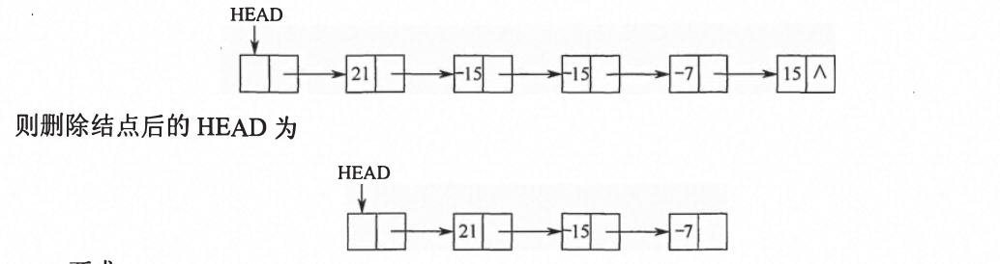
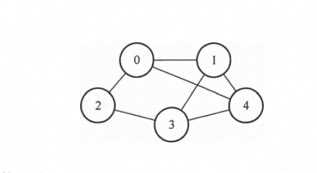
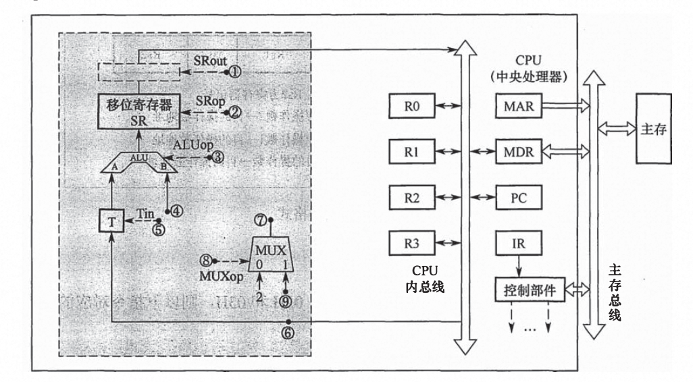
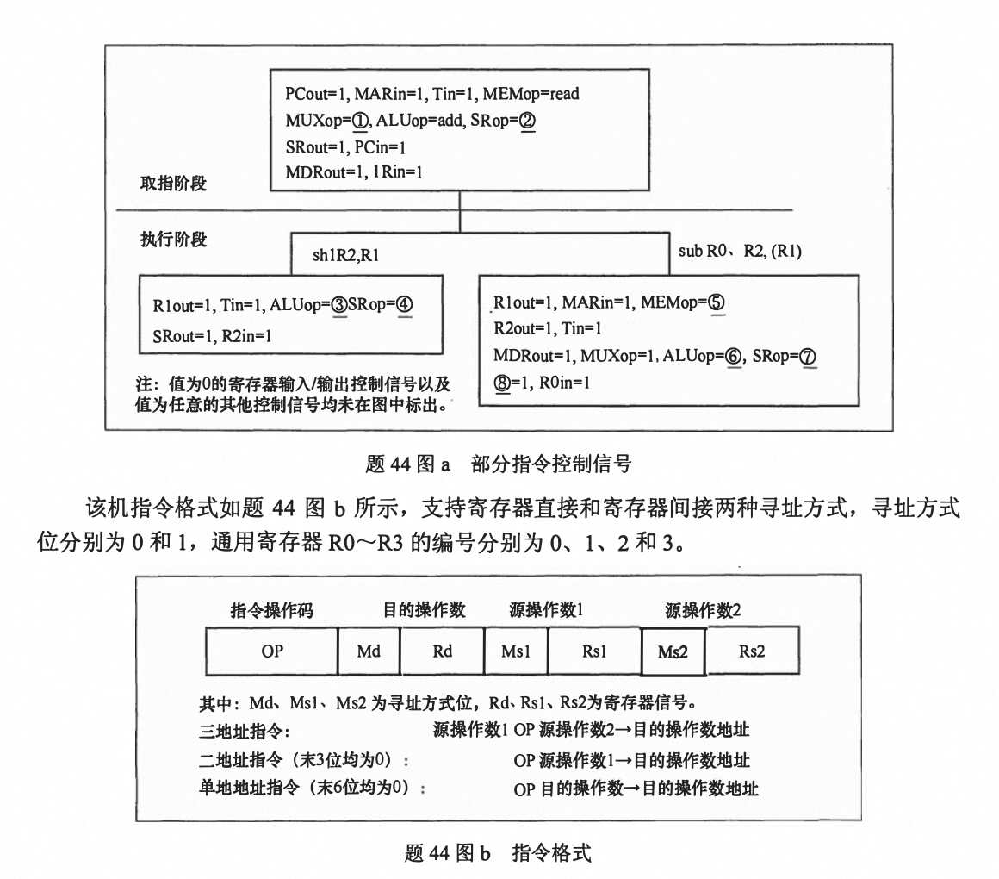

# 2015

## 1. 先序遍历得到二叉树的个数

枚举法：从左子树开始列举，然后再枚举右子树，得到14

根据二叉树前序遍历和中序遍历的递归算法中递归工作栈的状态变化得出:前序序列和中 序序列的关系相当于以前序序列为入栈次序，以中序序列为出栈次序。因为前序序列和中序序 列可以唯一地确定一棵二叉树，所以题意相当千“以序列 a, b, c, d 为入栈次序，则出栈序列的
个数为多少“

对于 n 个不同元素进栈，出栈序列的个数 (1 / (n+1))C(2n,n)  = 1/5 * (8!/4!*4!) 
 = 14 

排列组合C(n,m) = n! / (m! * (n-m)!)

## 2. 平衡二叉树中序遍历得到降序

- 只有两个结点的平衡二叉树的根结点的度为 1
- 中序遍历后可以得到一个降序序列，树中最大元素一定无左子树(可能有右子树)
- 最后插入的 结点可能会导致平衡调整，而不一定是叶结点

## 3. 折半查找判定序列

- [2010](/fundamentals/exam-408/2010#_4-折半查找查找失败的最多比较次数)
  
折半查找的判定树是一棵二叉排序树


## 4. 比较次数与初始排列无关的排序算法

- [每趟不可确定一个元素的最终位置../data-structures/强化#第八章-排序)


基数排序


## 5. 希尔排序

- [2014-增量](/fundamentals/exam-408/2014#_5-希尔排序的间隔-增量)
- [2009-插入排序](/fundamentals/exam-408/2009#_4-插入排序)

组内选择直接插入排序

## 6. 浮点数对阶溢出判断（左归&右归）

- 对阶过程不会引起阶码上溢或者下溢，小阶向大阶看齐
- 右归和尾数舍入都可能引起阶码上溢（右归：尾数右移，阶码+1，尾数舍入可能会导致阶码+1）
- 左归时可能会导致阶码下溢（尾数左移，阶码-1）
- 尾数溢出时，仅代表精度表示不准确，不代表溢出

## 7. cache容量计算

**假定主存地址为32位，按字节编址，主存和 Cache 之间采用直接映射方式，主存块大小为4个字，每字32位，采用回写（Write Back）方式，则能存放4K 字数据的Cache 的总容量的位数至少是**

块的大小为4*32位 = 16B ，因为按字节编址，故需要4位为字块内地址

主存块4字，需要存放4K字数据，故需要4K字/4字 = 1K行，行号为10位

主存地址32位，故标记位 = 32-10-4 = 18位

直接映射地址结构：
| 标记18位   | 行号10   | 块内地址4位    | 
| -------| ---- | ------- |

**cache容量 = 1K行（18位标记 + 有效位1位 + 回写位1位 + 块4*32位）=148K**

## 8. 指令访存次数

**假定编译器将赋值语句`“x=x+3：”`转換为指令 `“add xaddr, 3”`，其中 xaddr是x 对应的存储单元地址。若执行该指令的计算机采用页式虚拟存储管理方式，并配有相应的TLB，且Cache 使用直写（Write Through）方式，则完成该指令功能需要访问主存的次数至少是**

题中说的是访问主存次数至少是多少

假定取指时该指令已经在cache中，虚拟地址转换时，对应存储单元在TLB中，所以无需访问内存。

执行写操作时，由于cache采用直写法，写cache的同时需要写入内存中保证一致性，故至少需要访存内存1次。

## 9. 存储器交叉模块访问冲突

**某计算机使用4体交叉编址存储器，假定在存储器总线上出现的主存地址（十进制）序列为8005,8006,8007,8008,8001,8002,8003,8004,8000，则可能发生访存冲突的地址对是_**

| 访存地址 | 模块序号 |
| -------- | -------- |
| 8005     | 1        |
| 8006     | 2        |
| 8007     | 3        |
| 8008     | 0        |
| 8001     | 1        |
| 8002     | 2        |
| 8003     | 3        |
| 8004     | 0        |
| 8000     | 0        |

模块序号=访存地址%存储器交叉模块数。

判断可能发生访存冲突的规则是:给定的访存地址在相邻的四次访问中出现在同一个存储模块内。据此，根据上表可知8004和8000对应的模块号都为0, 即表明这两次的访问出现在同一模块内且在相邻的访问请求中，满足发生冲突的条件

## 10. 总线定时

- [总线定时](/fundamentals/computer-organization/chapter6#总线定时)

同步定时方式：指**系统**采用一个统一的时钟信号来协调发送和接收双方的传送定时关系。时钟产生相等的时间间隔，每个间隔构成一个总线周期

异布通信方式中，全互锁协议最慢，因为需要双方采用握手信号，但可靠性高，非互锁协议的可靠性最差

半同步定时方式保留了同步定时的特点，如所有地址、命令、数据信号的发出时间都严格参照系统时钟的某个前沿开始，而接收方都采用系统时钟后沿时刻来进行判断识别:同时，又像异步定时那样，允许不同速度的设备和谐地工作。为此增设一条Wait 响应信号线。

## 11. 扇区存取时间（‼️）

-  [2010-磁盘](/fundamentals/exam-408/2010#_22-磁盘)
-  [2013-磁盘读取时间](/fundamentals/exam-408/2013#_11-磁盘读取时间-转速-%EF%B8%8F)
  

**若磁盘转速为7200rpm，平均寻道时间为8ms，每个磁道包含1000个扇区，则访问一个扇区的平均存取时间大约是_**

**存取时间 = 寻道时间 + 延迟时间 + 传输时间**

寻道时间 = 8ms

延迟时间 = 60 * 1000 / 2*7200rpm = 4.17ms


传输时间如何确定？
- 传输时间 = 所需要读写的字节数 / 每秒转数 * 每扇区的字节数
- 如果题目中给出的是读取一个扇区所需要的时间 = 磁盘转一圈的时间 / 一圈的扇区数

传输时间 = 转一圈时间 / 一圈的扇区数 = (60 * 1000 / 7200 )/ 1000 = 0.01ms

**平均存取时间 = 8ms + 4.17ms + 0.01ms = 12.18ms**


## 12. CPU与IO端口传送的信息

- [2013-IO接口](/fundamentals/exam-408/2013#_8-设备和控制器-io接口-之间互连的接口标准)
- [2014-IO接口](/fundamentals/exam-408/2014#_12-io接口和io端口)

在采用中断 I/O方式控制打印输出的情况下，CPU 和打印控制接口中的I/O 端口之间交换的信息不可能是

主存地址

在程序中断I/0方式中，CPU和打印机直接交换，打印字符直接传输到打印机的 I/0端口，不会涉及主存地址，而 CPU和打印机通过I/0端口中状态口和控制口来实现交互。


## 13. 内部异常和外部中断

- [异常和中断的分类](/fundamentals/computer-organization/chapter5#异常和中断的分类)

内中断是指来自CUP和内存内部产生的中断，包括程序运算引起的各种错误，如地址非法、校验错、 页面失效、 非法指令、 用户程序执行特权指令自行中断(INT)和除数为零等，以上中断都在指令的执行过程中产生的，

这种检测 异常的工作肯定是由CUP (包括控制 器和运算器)实现的。

内中断不能被屏蔽，一旦出现应立即处理

对于D, 考虑到特殊情况， 如除数为零和自行中断(INT) 都会自动跳过中断指令， 所以不会返回到发生异常的指令继续执行，故错误

## 14. 外部中断操作系统保存的寄存器

- [2010-中断](/fundamentals/exam-408/2010#_11-中断的过程)

外部中断处理过程，PC值由中断隐指令自动保存，而通用寄存器 内容由操作系统保存。

中断隐指令保存PC和PSW的值（断点）

保存现场由OS中断服务程序完成

## 15. 死锁避免和死锁检测

- [2013-银行家算法](/fundamentals/exam-408/2013#_17-死锁-银行家算法)
- [死锁](/fundamentals/operating-systems/chapter2#死锁)

**26.若系统S1采用死锁避免方法，S2采用死锁检测方法。下列叙述中，正确的是**

- **S1 会限制用户申请资源的顺序，而S2 不会**
- **S1 需要进程运行所需资源总量信息，而S2 不需要**
- **S1 不会给可能导致死锁的进程分配资源，而S2会**

死锁的处理采用三种策略：**死锁预防、死锁避免、死锁检测和解除。**

**死锁预防**，采用破坏产生死锁的四个必要条件中的一个或几个，以防止发生死锁。其中之一的“破坏循环等待条件”，一般采用顺序资源分配法，首先给系统的资源编号，规定每个进程必须按编号递增的顺序请求资源，也就是限制了用户申请资源的顺序，故1的前半句属于死锁预防的范畴（）。

**银行家算法是最著名的死锁避免算法**，其中的最大需求矩阵 MAX定义了每一个进程对m类资源的最大需求量，系统在执行安全性算法中都会检查此次资源试分配后，系统是否处于安全状态，若不安全则将本次的试探分配作废。

在死锁的检测和解除中，在系统为进程分配资源时不采取任何措施，但提供死锁的检测和解除的手段。

II III 正确

## 16. 页面分配和页面置换

- [请求分页中的内存分配](/fundamentals/operating-systems/chapter3#请求分页中的内存分配)

驻留集表示内存分配给该进程页框号的集合，当所分配的集合已满，则需要使用页面替换算法，换出一页，将请求页换入

页框集合分配和替换策略：

固定分配局部置换

可变分配局部置换

可变分配全局置换

为什么没有固定分配全局置换？思考这么一个场景，固定分配3个页框，每次页面替换仅换入1页 其余均空闲

## 17. 位示图（409612 ❓）

**文件系统用位图法表示磁盘空间的分配情况，位图存于磁盘的 32~127号块中，每个盘块占 1024 字节，盘块和块内字节均从0开始编号。假设要释放的盘块号为 409612，则位图中要修改的位所在的盘块号和块内字节序号分别是**

盘块号 = 起始盘块号 + 409612 / 1024 * 8 = 32 + 50 = 82 

块内字节序号 = 盘块号 % 1024B ❓❓

## 18. SCAN算法

- [2010-磁盘](/fundamentals/exam-408/2010#_22-磁盘)

**某硬盘有200个磁道（最外侧磁道号为 0），磁道访问请求序列为 130,42,180, 15, 199，当前磁头位于第58号磁道并从外侧向内侧移动。按照SCAN调度方法处理完上述请求后，磁头移过的磁道数是。**

SCAN算法就是电梯调度算法。顾名思义， 如果开始时磁头向外移动就一直要到**最外侧（磁道最外层而不是磁道请求）**，然后再返回向内侧移动， 就像电梯若往下则一直要下到最底层需求才会再上升一样。当期磁头 位于58号并从外侧向内侧移动，先依次访问130和199, 然后再返回向外侧移动，依次访问42 和15, 故磁头移过的磁道数是:(199-58)+(199-15)= 325

## 19. 归零编码和曼彻斯特

- [2013-曼彻斯特编码](/fundamentals/exam-408/2013#_19-曼彻斯特编码)

非归零（NRZ）：高1 低0 不跳变

曼彻斯特：高低为1 低高为0 重点‼️

差分曼彻斯特：为1 延用前面信号后半个码元 为0 与前面信号后半个码元相反 重点‼️

## 20. 滑动窗口序号比特数

**主机甲通过128kbps 卫星链路，采用滑动窗口协议向主机乙发送数据，链路单向传播延迟为250ms，帧长为 1000字节。不考虑确认帧的开销，为使链路利用率不小于80%，帧序号的比特数至少是**

信道利用率 = 发送时延 / 总时延 

发送时延 = k个数据帧 * 1000B * 8/ 128kbps = 0.0625k

总时延 = 0.0625s + 0.5s = 0.5625s

0.0625k / 0.5625 = 0.8 得出k >= 7.2

帧序号的比特数K需要满足2^n >= k + 1 n为4位

## 21. 交换机

**网桥和以太网交换机区别：**

- 以太网交换机实质上是多端口网桥，通常有十几个端口；而网桥一般只有两个端口；
- 网桥端口一般连到局域网的网段，而以太网交换机的每个端口一般都直接与主机或集线器相连。
- 交换机允许多对计算机同时通信，而网桥最多允许每个网段上的一对就按季同时通信
- 网桥采用存储转发方式转发，而以太网交换机还可以采用直通方式转发，以太网转发速度比网桥快。


从本质上说，交换机就是一个**多端口的网桥**， 工作在数据链路层(因此不能实现 不同网络层协议的网络互联)， 交换机能经济地将网络分成小的冲突域。广播域属千网络层概念， 只有网络层设备(如路由器)才能分割广播域

## 22. 单链表去重

**41.（15分）用单链表保存 m 个整数，结点的结构为`［data］[link］`，且|data| ≤n（n 为正整数）。现要求设计一个时间复杂度尽可能高效的算法，对于链表中 data 的绝对值相等的结点，仅保留第一次出现的结点而删除其余绝对值相等的结点。例如，若给定的单链表HEAD 如下：**



要求：

**1）给出算法的基本设计思想。**

新定义一个数组`A[n]`，初始值为0，用于标记链表中每个结点的出现次数，遍历链表，若当前结点的data的绝对值，即`A[abs(data)]` = 0代表首次出现，并将`A[abs(data)]` = 1, 若当前结点的data的绝对值，即`A[abs(data)]` = 1代表出现过，则需要释放该结点

**2）使用C或C++语言，给出单链表结点的数据类型定义。**

```c
typedef struct ListNode {
  int data;
  struct ListNode *link;
} ListNode;
```

**3）根据设计思想，采用C或C++语言描述算法，关键之处给出注释。**

```c
void func(ListNode *head,int n){
  int A[n];
  ListNode *p *r *temp;
  for(int i=0;i<n;i++){
    A[i] = 0;
  };

  for(ListNode *p = head;p!=NULL;p=temp->link){
    if(A[abs(p->data)] == 0){  //首次出现
      A[abs(p->data)] = 1;
      r = p;
      temp = p;
    }else{ //出现过
      temp = p->link;
      r->link = p->link; 
      free(p);  //释放
    }
  } 
}
```
**4）说明你所设计算法的时间复杂度和空间复杂度。**

时间复杂度O(n)、空间复杂度O(n)

## 23. 邻接矩阵



**1）写出图 G的邻接矩阵A（行、列下标从0开始）。**

|     | 0   | 1   | 2   | 3   | 4   |
| --- | --- | --- | --- | --- | --- |
| 0   | 0   | 1   | 1   | 0   | 1   |
| 1   | 1   | 0   | 0   | 1   |  1  |
| 2   | 1   | 0   | 0   | 1   | 0   |
| 3   | 0   | 1   | 1   | 0   | 1   |
| 4   | 1   | 1   | 0   | 1   | 0   |

**2） 求A^2，矩阵A^2中位于0行3列元素值的含义是什么？**

|     | 0   | 1   | 2   | 3   | 4   |
| --- | --- | --- | --- | --- | --- |
| 0   | 3   | 1   | 0   | 3   | 1   |
| 1   | 1   | 3   | 2   | 1   | 2   |
| 2   | 0   | 2   | 2   | 0   | 2   |
| 3   | 3   | 1   | 0   | 3   | 1   |
| 4   | 1   | 2   | 2   | 1   | 3   |

0 行 3 列的元素值 3 表示从顶点 0 到顶点 3 之间长度为 2 的路径共有 3 条。

**3）若已知具有n（n≥2）个顶点的图的邻接矩阵为B，则B^m（2≤m≤n）中非零元素的含义是什么？**

图中从顶点i到顶点j长度为m的路径条数。

## 24. 指令&数据通路（‼️）

**某16位计算机的主存按字节编码，存取单位为16位：采用16位定长指令字格式：CPU采用单总线结构，主要部分如下图所示。图中RO~R3 为通用寄存器；T为暂存器；SR 为移位寄存器，可实现直送（mov）、左移一位 （left）和右移一位（right）3 种操作，控制信号为 SRop,SR 的输出由信号 SRout控制；ALU 可实现直送A（mova）、A加B（add）、A减B （sub）、A与B（and）、A或B（or）、非A （not）和A加1 （inc）7 种操作，控制信号为ALUop。**



请回答下列问题。

**1）图中哪些寄存器是程序员可见的？为何要设置暂存器T？**

程序员可见：通用寄存器、PC

因为CPU采用单总线结构，一个时钟周期内不能传送两个有效数到CPU的输入两端，所以需要设置暂存器T将操作数缓存下来。

**2） 控制信号 ALUop 和 SRop 的位数至少各是多少？**

因为CPU需要实现7中操作，故需要控制信号 ALUop的位数为3位

SR移位寄存器需要实现3种操作，故需要SRop的位数为2位

**3） 控制信号 SRout所控制部件的名称或作用是什么？**

三态门，用于控制移位器与总线之间数据通路的连接与断开。

**4）端点①～⑨中，哪些端点须连接到控制部件的输出端？**

1、2、3、5、8

**5）为完善单总线数据通路，需要在端点①~⑨中相应的端点之间添加必要的连线。写出连线的起点和终点，以正确表示数据的流动方向。**

6->9、7->4

**6） 为什么二路选择器 MUX 的一个输入端是2？**

因为每条指令的长度为 16 位，按字节编址，所以每条指令占用 2个内存单元， 顺序执行时，下条指令地址为(PC)+2。 MUX的一个输入端为2, 可便于执行(PC)+2操作。

## 25. 指令格式



请回答下列问题。

**1）该机的指令系统最多可定义多少条指令？**

指令字长为16位，寻址方式需要1位，通用寄存器4个需要2位。故op = 16 - 3*3 = 7位

指令系统最多可容纳2^7 = 128条指令

**2） 若inc、shl和 sub 指令的操作码分别为 01H、02H 和 03H，则以下指令对应的机器代码各是什么？**

```bash
inc R1  ; R1 + 1-> R1
shl R2 , R1 ; (R1) << 1 → R2
sub R3, (R1) , R2 ; ((R1)) - (R2) → R3
```
`inc`的机器代码 = 0000 0010 0100 0000 =  0240H
|   操作码  | 目的操作数  | 源操作数1   | 源操作数2  | 
| ---      | ---       | ---        | ---      | 
| 00000 001 |   0 01   | 000       | 000       |  

`shl`的机器代码 = 0000 0100 1000 1000 =  0488H
| 操作码    | 目的操作数 | 源操作数1 | 源操作数2 |
| --------- | ---------- | --------- | --------- |
| 00000 010 | 0 10       |    0 01    | 000       |

`sub`的机器代码 = 0000 0110 1110 1010 =  06EAH
| 操作码    | 目的操作数 | 源操作数1 | 源操作数2 |
| --------- | ---------- | --------- | --------- |
| 00000 011 |  0 11     | 1 01      | 0 10        |


**3）假设寄存器X的输入和输出控制信号分别为 Xin 和 Xout，其值为1表示有效，为0表示无效（如PCout=1表示PC 内容送总线）：存储器控制信号为 MEMop，用于控制存储器的读（read）和写（write） 操作。写出题图a中标号①～⑧处的控制信号或控制信号的取值。**

1️⃣ = 0 

2️⃣ = mov

3️⃣ = mova

4️⃣ = left

5️⃣ = read

6️⃣ = sub

7️⃣ = mov

8️⃣ = SRout

**4） 指令 “sub R1, R3，（R2）”和“inc R1”的执行阶段至少各需要多少个时钟周期？**

`sub R1, R3，（R2）`需要4个时钟周期

`inc R1`需要2个时钟周期


## 26. PV

**45.（9分）有A、B两人通过信箱进行辩论，每个人都从自己的信箱中取得对方的问题。将答案和向对方提出的新问题组成一个邮件放入对方的邮箱中。假设A 的信箱最多放M个邮件，B的信箱最多放个N邮件。初始时A的信箱中有x个邮件（0＜ x ＜M），B 箱中有y个（0<y N）辩论者每取出一个邮件，邮件数减1。A 和B两人的操作过程描述如下：**

```c

A{
  while(true){
    从A的信箱中取出一个邮件；
    回答问题并提出一个新问题；
    将新邮件放入B的信箱；
  }
}

B{
   while(true){
    从B的信箱中取出一个邮件；
    回答问题并提出一个新问题；
    将新邮件放入A的信箱；
  }
}
```

**当信箱不为空时，瓣论者才能从信箱中取邮件，否则需要等待。当信箱不满时，辩论者才能将新邮件放入信箱，否则需要等待。请添加必要的信号量和 P、V（或 wait、signal）操作，以实现上述过程的同步。要求写出完整过程，并说明信号量的含义和初值。**

```c
semaphore bufferA = x; // 信箱A的邮件数
semaphore bufferB = y; // 信箱B的邮件数
semaphore mutexA = 1; // 信箱A的互斥信号量
semaphore mutexB = 1; // 信箱B的互斥信号量
semaphore fullA = M - x; // 信箱A还能放的邮件数
semaphore fullB = N -y; // 信箱B还能放的邮件数
A{
  while(true){
    P(bufferA); // 信箱A中还能取邮件
    P(mutexA); // 互斥从A中取出邮件
    从A的信箱中取出一个邮件；
    V(mutexA);
    V(fullA);

    回答问题并提出一个新问题；
    P(fullB) // 判断信箱B是否能放

    P(mutexB)
    将新邮件放入B的信箱；
    V(bufferB) // 放入邮箱A
    P(mutexB)
  }
}

B{
   while(true){
    P(bufferB); // 信箱B中还能取邮件
    P(mutexB); // 互斥从B中取出邮件
    从B的信箱中取出一个邮件；
    V(mutexB);
    V(fullB);

    回答问题并提出一个新问题；
    P(fullA) // 判断信箱A是否能放

    P(mutexA)
    将新邮件放入A的信箱；
    V(mutexA)
    V(bufferA) // 放入邮箱A
  }
}
```

## 27. 虚拟分页存储管理

**46.（6分）某计算机系统按字节编址，采用二级页表的分页存储管理方式，虚拟地址格式如下所示：**

| 10位页目录号    | 10位页表索引 | 12位页内偏移量 | 
| --------- | ---------- | --------- | 

请回答下列问题。

**1）页和页框的大小各为多少字节？进程的虚拟地址空间大小为多少页？**

12位页内偏移量可得，页的大小为4KB，页的大小等于页框的大小 = 4KB

进程的虚拟地址空间大小 = 2^32 / 2^12 = 2^20 页

**2）假定页目录项和页表项均占4字节，则进程的页目录和页表共占多少页？要求写出计算过程。**

页目录的大小为 = 2^10 * 4B = 4KB 4KB/4KB = 1占一页

页表的大小为 = 2^20 * 4B = 4MB 4MB/4KB = 1K

一共占1K+1 = 1025页

**3）若某指令周期内访问的虚拟地址为0100 0000H 和01112048H，则进行地址转换时共访问多少个二级页表？要求说明理由。**

0100 0000H = 0000 0001 0000 0000 0000 （页内）=>页目录号004H，页表索引000H

0111 2048H = 0000 0001 0001 0001 0010 （页内）=>页目录号004H 页表索引112H

对应的页目录号都为004H，因此访问同一个二级页表，访问二级页表的次数为1.


## 28. IP网络

**47.（9分）某网络拓扑如下图所示，其中路由器内网接口、DHCP 服务器、WWW服务器与主机1均采用静态 IP 地址配置，相关地址信息见图中标注：主机2～主机N通过DHCP服务器动态获取 IP 地址等配置信息。**


请回答下列问题。

**1） DHCP 服务器可为主机2~主机N动态分配IP地址的最大范围是什么？主机2使用DHCP 协议获取 IP地址的过程中，发送的封装 DHCP Discover 报文的IP 分组的源IP地址和目的IP地址分别是什么？**

8位最大可分配地址为 = 2^8 - 2 = 254。

主机2~主机N动态分配IP地址的最大范围是：111.123.15.5/24~111.123.15.254/24

源IP地址：0.0.0.0，目的IP地址255.255.255.255

**2）若主机2的 ARP表为空，则该主机访问 Internet 时，发出的第一个以太网帧的目的MAC地址是什么？封装主机 2发往Internet 的IP 分组的以太网帧的目的MAC地址是什么？**

ff-ff-ff-ff-ff-ff

00-a1-a1-a1-a1-a1

**3）若主机1的子网掩码和默认网关分别配置为 255.255.255.0 和 111.123.15.2，则该主机是否能访问 WWW服务器？是否能访问 Internet？请说明理由。**

由子网掩码配置知道主机1和www服务器同处于一个局域网，故可以访问www服务器

该主机的默认网关为111.123.15.2，会导致无法访问Internet。