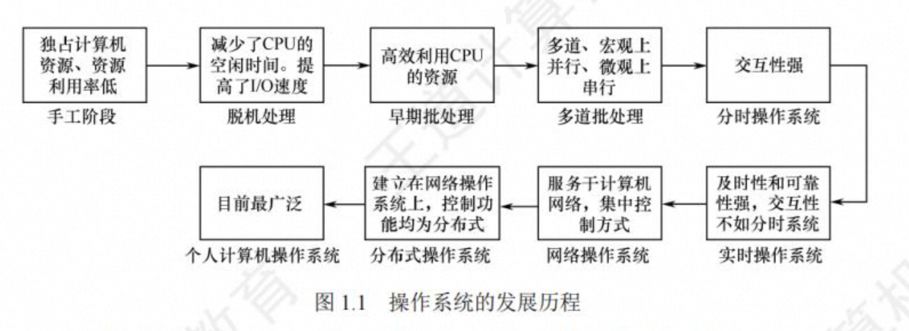

## 第一章 计算机系统概述

## 操作系统的基本概念

### 操作系统的概念

*操作系统 (Operating System, OS)*是指控制和管理整个计算机系统的硬件与软 件资源，合理地组织、调度计算机的工作与资源的分配，进而 用户和其他软件提供方便接又与环境的程序集合。操作系统是计算机系统中最基本的系统软件。

### 操作系统的特征

操作系统是一种系统软件，但与其他系统软件和应用软件有很大的不同，它有自己的特殊性 即基本特征。操作系统的基本特征包括并发、共享、虚拟和异步。

#### 并发

1. 并发和并行

   并行：指两个或多个事件在同一时刻发生。
   并行：指在一段时间内宏观上有多个程序同时进行，微观上这些程序只能是分时地交替执行

2. 引入进程

   进程：指系统中能独立运行并作为资源分配的基本单位，它是由一组机器指令、数据和堆栈等组成的，是一个能独立运行的活动实体

#### 共享

1. 互斥共享方式

   规定在一段时间内，只允许一个进程访问该资源。若其他进程请求访问该资源，必须等待正在访问的进程访问完毕并释放资源之后，才允许另一个进程对该资源进行访问。这种资源共享方式称为互斥式共享。

   临界资源（独占资源）：这段时间内只允许一个进程访问的资源。例如大多数的物理设备，以及栈、变量和表格。

2. 同时访问方式

   系统中还有另外一类资源，允许在一段时间内由多个进程“同时”对它们进行访问。”同时“指的是宏观意义上的，在微观上，对该资源的访问是交替进行的。例如磁盘设备。

#### 虚拟

1. 时分复用技术

   （1）虚拟处理机技术

   利用多道程序设计技术，为每道程序建立至少一个进程，让多道程序并发执行。

   （2）虚拟设备技术

   通过时分复用技术，将一台物理 I/O 设备虚拟为多台逻辑上的 I/O 设备，并允许每个用户占用一个逻辑上的 I/O 设备。

2. 空分复用技术

   利用存储器的空闲空间分区域存放和运行其他的多道程序

#### 异步

以不可预知的速度向前推进，进程的异步性

## 操作系统的目标和作用

### 操作系统的目标

在计算机系统上配置操作系统，其主要的目标是：方便性，有效性，可扩展性和开放性。

### 操作系统的使用

1. OS 作为用户与计算机硬件系统之间的接口

   OS 处于用户与计算机硬件系统之间，用户通过 OS 来使用计算机系统。
   

2. OS 作为计算机系统资源管理的管理者

3. OS 实现了对计算机资源的抽象

## 操作系统的发展过程

### 单道批处理系统

缺点 系统中的资源得不到充分的利用。因为内存中仅有一道程序，每逢该程序在运行中发出的 I/O 请求之后，CPU 便处于等待状态，必须在其 I/O 完成之后才继续进行，又因 I/O 设备的低速性，更使 CPU 的利用率显著降低

### 多道批处理系统

优缺点：

(1) 资源利用率高。多道程序交替运行，以保持 CPU 处于忙碌状态。在内存中装入多道程序可提高内存的利用率；此外还可以提高 I/O 设备的利用率

(2)系统吞吐量大。第一 CPU 和其他资源保持"忙碌"状态 第二 仅当作业完成时或运行不下去时才进行切换，系统开销小

(3)平均周转时间长。由于作业要排队依次进行处理，因而作业的周转时间较长。

(4)无交互能力

### 分时操作系统

(1)多路性
(2)独立性
(3)及时性
(4)交互性

### 实时操作系统

为了能在某个时间限制内完成某些紧急任务而不需要时间片排队，诞生了实时操作系统。这 里的时间限制可以分为两种情况:若某个动作必须绝对地在规定的时刻 (或规定的时间范围)发生，则称为**硬实时系统**，如飞行器的飞行自动控制系统，这类系统必须提供绝对保证，让某个特定的动作在规定的时间内完成。若能够接受偶尔违反时间规定且不会引起任何永久性的损害，则称为**软实时系统**，如飞机订票系统、银行管理系统。

### 网络操作系统和分布式计算机系统

网络操作系统将计算机网络中的各台计算机有机地结合起来，提供一种统一、经济而有效的使用各台计算机的方法，实现各台计算机之间数据的互相传送。网络操作系统最主要的特点是网络中各种资源的共享及各台计算机之间的通信。

分布式计算机系统是由多台计算机组成并满足下列条件的系统:系统中任意两台计算机通过通信方式交换信息; 系统中的每台计算机都具有同等的地位，即没有主机也没有从机;每台计算机上的资源为所有用户共享;系统中的任意台计算机都可以构成 一个子系统，并且还能重构:任何工作都可以分布在几台计算机上，由它们并行工作、协同完成。用于管理分布式计 算机系统的操作系统称为分布式计算机系统。该系统的主要特点是:分布性和并行性。分布式操作系统与网络操作系统的本质不同是，分布式操作系统中的若干计算机相互协同完成同 一任务。

## 操作系统的基本特性

### 操作系统的主要功能

#### 处理机管理功能

在传统的多道程序系统中，处理机的分配和运行都是以进程为基本单位的，因而对处理机的管理可归结为对进程的管理。例如，创建和撤销进程，对进程进行协调，实现进程之间信息交换，以及按照一定的算法把处理机分配给其他进程。

1. 进程控制

   为作业创建进程、撤销已结束的进程，以及控制进程在运行过程中的状态转换。

2. 进程同步

   为多个进程的运行进行协调。常见的方式有两种：第一种，进程互斥方式，指进程在对临界资源进行访问时，应采用互斥方式。第二，进程同步方式，指在相互合作区完成共同任务的诸进程间，由同步机构对他们的执行次序加以协调。PV 操作。

3. 进程通信

   实现相互合作进程之间的信息交换

4. 调度

   （1）作业调度 。作业调度的基本任务时从后备队列中按照一定的算法选择出若干作业，为它们分配运行所需的资源，在将这些作业调入内存后，分别为它们建立进程，使它们都成为可能获得处理机的就绪就绪进程，并将它们插入到就绪队列中。

   （2）进程调度。进程调度的任务是从进程的就绪队列中按照一定的算法选出一个进程，将处理机分配给它，并为它设置运行现场。

#### 存储器管理功能

主要是任务就是为多道程序的运行提供良好的环境，提高存储器的利用率，方便用户使用，并能从逻辑上扩充内存。为此，存储器管理应具有内存分配和回收、内存保护、地址映射和内存扩充等。

1. 内存分配

   （1）为每道程序分配内存空间，使它们“各得其所”

   （2）提高存储器的利用率，尽量减少不可用的内存空间（碎片）

   （3）允许正在运行的程序申请附加的内存空间，以适当程序和数据动态增长的需要

OS 在实现内存分配时，可采用静态和动态两种方式

（1）静态分配方式。每个作业的内存空间是在作业装入时确定的，在作业装入后的整个运行期间不允许该作业再申请新的内存空间，也不允许作业在内存中’移动‘

（2）动态分配方式。 每个作业所要求的基本内存空间虽然也是在装入时确定的，但允许作业在运行过程中继续申请新的附加内存空间，以适应程序和数据的动态增长，页允许作业在内存中“移动

2. 内存保护

（1）独立运行，互不干扰

（2）不允许访问 OS 的程序和数据
在各自的内存去运行，设置两个界限寄存器，用于存放执行程序的上界和下界，防止越界。

3. 地址映射

逻辑地址->物理地址

4. 内存扩充

虚拟技术，从逻辑上扩充内存容量
（1）请求调入功能
（2）置换功能

#### 设备管理功能

主要任务：
（1）完成用户进程提出的 I/O 请求，为用户进程分配所需要的的 I/O 设备，并完成指定的 I/O 操作

（2）提高 CPU 和 I/O 设备的利用率，提高 I/O 速度

1. 缓冲管理

在 I/O 设备和 CPU 之间引入缓冲，有效的解决 CPU 和 I/O 设备速度不匹配矛盾

2. 设备分配管理

根据现有资源的情况按照某种算法分配 I/O 设备

3. 设备处理

设备驱动程序。实现 CPU 和设备控制器之间的通信。

#### 文件管理功能

1. 文件存储空间的管理

2. 目录管理

3. 文件的读/写管理和保护

#### 操作系统与用户之间的接口

1. 用户接口

   操作系统向用户提供了命令接口，用户可通过该接口向作业发出命令以控制作业的运行。
   （1） 联机用户接口。
   （2） 脱机用户接口。
   （3） 图形用户接口。

2. 程序接口

   程序接口是为用户程序在执行中访问系统资源设置的，是用户程序去的操作系统服务的唯一途径。系统调用

#### 现代操作系统的新功能

1. 系统安全

   （1）认证技术。
   （2）密码技术。
   （3）访问技术控制，可通过两种途径来保证系统中的资源的安全：1 对用户存取权限的设置。 2 对文件属性控制保证文件的安全
   （4）反病毒技术。

2. 网络的功能和服务

   （1）网络通信
   （2）资源管理
   （3）应用互操作

3. 支持多媒体

   （1）接纳控制功能
   （2）实时调度
   （3）多媒体文件的存储

### OS 结构设计

#### 传统操作系统结构

1. 无结构操作系统
2. 模块化结构 OS
   （1）模块化程序设计的基本概念
3. 分层式结构 OS

#### 客户/服务器模式简介

1. 客户/服务器模式的由来、组成和类型
2. 客户/服务器之间的交互
3. 客户/服务器模式的优点

#### 面向对象程序技术

1. 对象
2. 对象类
3. 继承

面向对象技术的优点

#### 微内核 OS 结构

1. 微内核操作系统的基本概念

   （1）足够小的内核
   （2）基于客户/服务器模式
   （3）应用“机制与策略分离”原理
   （4）采用面向对象技术

2. 微内核的基本功能

   （1）进程（线程）管理
   （2）低级存储器管理
   （3）中断和陷入处理

3. 微内核操作系统的优点

   可拓展性 可靠性 可移植性 对分布式系统的支持 面向对象技术

4. 微内核存在问题

## 操作系统的运行环境

### 处理器运行模式

在计算机系统中，通常 CPU 执行两种不同性质的程序:一种是操作系统内核程序;另一种是用户自编程序(系统外层的应用程序，简称应用程序)。对操作系统而言，这两种程序的作用不同，前者是后者的管理者，因此“管理程序”(内核程序)要执行一些特权指令，而“被管理程序”(用户自编程序)出于安全考虑不能执行这些特权指令

> 特权指令和非特权指令的特点(2022)

1. 特权指令，是指不允许用户直接使用的指令，如 1/O 指令、关中断指令、内存清零指令， 存取用于内存保护的寄存器、送 PSW 到程序状态字寄存器等的指令。

2. 非特权指令，是指允许用户直接使用的指令，它不能直接访问系统中的软硬件资源，仅限于访问用户的地址空间，这也是为了防止用户程序对系统造成破坏

> 内核态执行的指令分析(2021) 用户态发生或执行的事件分析 (2011、2012、2014)

在具体实现上，将 CPU 的运行模式划分为用户态(目态)和核心态(又称管态、内核态)。

应用程序运行在用户态，操作系统内核程序运行在核心态。应用程序向操作系统请求服务时通过使用访管指令，访管指令是在用户态执行的，因此是非特权指令。

操作系统内核包括 4 个方面：

1. 时钟管理

时钟的第一功能是计时，操作系统需要通过时钟管理，向用户提供标准的 系统时间。另外，通过时钟中断的管理，可以实现进程的切换。

2. 中断机制

引入中断技术的初衷是提高多道程序运行时的 CPU 利用率，使 CPU 可以在 I/ O 操作期间执 行其他指令。后来逐步得到发展，形成了多种类型，成为操作系统各项操作的基础。

中断机制中，只有一小部分功能属于内核，它们负责保护和恢复中断现场的信息，转移控制 权到相关的处理程序。这样可以减少中断的处理时间，提高系统的并行处理能力

3. 原语

按层次结构设计的操作系统，底层必然是一些可被调用的公用小程序，它们各自完成一个规定的操作，通常将具有这些特点的程序称为*原语(AtomicOperation)*

1)处于操作系统的底层，是最接近硬件的部分。 2)这些程序的运行具有原子性，其操作只能一气呵成(出于系统安全性和便于管理考虑)。 3)这些程序的运行时间都较短，而且调用频繁。

定义原语的直接方法是关中断，让其所有动作不可分割地完成后再打开中断。系统中的设备驱动、CPU 切换、进程通信等功能中的部分操作都可定义为原语，使它们成为内核的组成部分。

4. 系统控制的数据结构及处理

系统中用来登记状态信息的数据结构很多，如作业控制块、进程控制块(PCB)、设备控制 块、各类链表、消息队列、缓冲区、空闲区登记表、内存分配表等。
