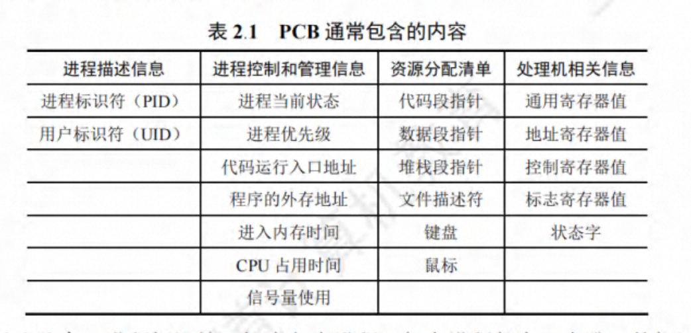

# 第 2 章 进程与线程

## 进程与线程

### 进程的概念和特征

1. 进程的定义

   进程控制块（PCB）：一种数据结构，用来描述进程的基本情况和活动过程，进而控制和管理进程。

   进程实体-进程（进程映像）：由程序段、相关的数据段和 PCB 组成。

   定义：
   （1）进程是程序的一次执行。
   （2）进程是一个程序及其数据在处理机上顺序执行时所发生的活动。
   （3）进程是具有独立功能的程序在一个数据集合上运行的过程，它是系统进行资源分配和调度的一个独立单位。
   总结：进程是进程实体的运行过程，是系统进行资源分配和调度的一个独立单位

2. 进程的特征

   （1）动态性。
   （2）并发性。
   （3）独立性。
   （4）异步性。

### 进程的组成

1. 进程控制块

（1）进程描述信息
（2）进程控制和管理信息
（3）资源分配清单
（4）处理机相关信息（CPU 上下文）

2. 程序段

3. 数据段（原始数据）

经过处理和加工后变成程序段



**进程管理中的数据结构**

1. 操作系统中用于管理控制的数据结构

   资源信息表（进程信息表）：对每个资源和每个进程都设置了一个数据结构，用于表征其实体，其中包含了资源或进程的标识、描述、状态等信息以及一批指针。

   

2. 进程控制块 PCB 的作用

（1）作为独立运行基本单位的标志。PCB 是进程存在与系统中的唯一标志。
（2）能实现间断性运行方式。
（3）提供进程管理所需要的信息。
（4）提供进程调度所需要的信息。
（5）实现与其他进程的同步与通信。

3. 进程控制块中的信息

   1）进程标识符

   用于唯一地标识一个进程。
   （1）外部标识
   （2）内部标识

   2）处理机状态

   处理机信息也称为处理的上下文，主要是由处理机的各种寄存器中的内容组成。
   通用寄存器（用户可见寄存器）、指令计数器、程序状态字 PSW、用户栈指针、

   3）进程调度信息

   进程状态、进程优先级、进程调度所需其他信息、事件

   4）进程控制信息

   程序和数据的地址、进程同步和通信机制、资源清单、链接指针

4. 进程控制块的组织方式

   （1）线性方式
   （2）链接方式
   （3）索引方式
   


### 前驱图

作用：用于描述程序执行先后顺序

定义：一个有向无循环图（DAG），用于描述进程之间执行的先后顺序。

每个结点可用来表示一个进程或程序段，乃至一条语句，结点之间的有向边表示两个节点之间存在的偏序或前驱关系。
初始结点：没有前驱的结点

终止结点：没有后继的结点。

重量（weight）：每个结点含有一个重量，用于表示该结点所含的程序量或程序的执行时间。

#### 程序顺序执行

1. 程序的顺序执行

2. 程序顺序执行时的特征

   顺序性：

   封闭性：程序在封闭的环境下运行，运行时独占全机资源，资源的状态只有本程序才能改变它，程序一旦开始执行，其执行结果不受外界因素影响

   可再现性：只要程序执行时的环境和初始条件相同，当程序重复执行时，不论它时从头到尾不停顿地执行，还是走走停停，都可获得相同的结果。

#### 程序并发执行

只有在不存在前驱关系的程序之间才可能并发执行，否则无法并发执行。

1. 程序的并发执行

2. 程序并发执行时的特征

   （1）间断性。程序在并发执行时，由于它们共享系统资源，以及完成同一项任务而相互合作，致使在这些并发执行的程序之间形成了相互制约的关系。“执行-暂停-执行”

   （2）失去封闭性。当系统中存在着多个可以并发执行的程序时，系统中的各种资源将为它们所共享，而这些资源的状态也由这些程序来改变，致使其中任一程序在运行时，其环境都必然会收到其他程序的影响。

   （3）不可再现性。程序在并发执行时，由于失去了封闭性，也将导致其又失去了可再现性。

### 进程的状态与转换

1. 进程的三种基本状态

   （1）就绪态。指进程已处于准备好运行的状态，即进程已分配到除 CPU 以外的所有必要资源后，只要再获得 CPU，便可立即执行。

   （2）执行态。已获得 CPU，其程序正在执行的状态。

   （3）阻塞态。指正在执行的进程由于发生某事件（I/O，申请缓冲区失败）等暂时无法继续执行时的状态，亦即进程的执行收到阻塞。

   区别就绪态和阻塞态:就绪态是指进程仅缺少 CPU，只要获得 CPU 就立即运行;而阻塞 态是指进程需要其他资源 (除了 CPU)或等待某一事件

2. 三种基本状态的转换

- 就绪态一运行态:处于就绪态的进程被调度后，获得 CPU 资源(分派 CPU 的时间片)，于是进程由就绪态转换为运行态。

- 运行态一就绪态:处于运行态的进程在时间片用完后，不得不让出 CPU，从而进程由运行态转换为就绪态。此外，在可剥夺的操作系统中，当有更高优先级的进程就绪时，调度程序将正在执行的进程转换为就绪态，让更高优先级的进程执行。

- 运行态一阻塞态:进程请求某一资源(如外设)的使用和分配或等待某一事件的发生(如 1/O 操作的完成)时，它就从运行态转换为阻塞态。进程以系统调用的形式请求操作系统提供服务，这是一种特殊的、由运行用户态程序调用操作系统内核过程的形式。

- 阻塞态一就绪态:进程等待的事件到来时，如 I/O 操作完成或中断结束时，中断处理程序必须将相应进程的状态由阻塞态转换为就绪态。


3. 创建状态和终止状态

(1）创建状态

进程正在被创建，尚未转到就绪态。创建进程需要多个步骤:首先申请一个空白 PCB，并向 PCB 中填写用于控制和管理进程的信息;然后为该进程分配运行时所必须的资源:最后将该进程转入就绪态并插入就绪队列。但是，如果进程所需的资源尚不能得到满足，如内存不足，则创建工作尚未完成，进程此时所处的状态称为创建态。

(2）终止状态

等待 OS 进行善后处理，最后将其 PCB 清空，并将 PCB 空间返回给系统。


4. 挂起操作和进程状态的转换

挂起操作的引入:

（1）终端用户的需要。
（2）父进程请求。
（3）负荷调节的需要
（4）操作系统的需要

引入挂起原语操作后三个进程状态的转换

（1）活动就绪->静止就绪。
（2）活动阻塞->静止阻塞。
（3）静止就绪->活动就绪。
（4）静止阻塞->活动阻塞


5. 引入挂起操作后五个进程状态的转换


### 进程控制

进程控制的主要功能是对系统中的所有进程实施有效的管理，它具有创建新进程、撤销已有进程、实现进程状态转换等功能。在操作系统中，一般将进程控制用的程序段称原语，原语的特点是执行期间不允许中断，它是一个不可分割的基本单位。

#### 操作系统内核

系统态 ： 又称为**管态**，也称为内核态，它具有较高的特权，能执行一切指令，访问所有寄存器和存储区，传统的 OS 都在系统态运行。

用户态：又称为目态，具有较低特权的执行状态，仅能执行规定的指令，访问特定的寄存器和存储区，一般情况下，应用程序只能在用户态运行，不能取执行 OS 指令及访问 OS 区域，以防止应用程序对 OS 的破坏。

1. 支撑功能

   （1）中断处理。

   （2）时钟管理

   （3）原语操作。由若干条指令组成的，用于完成一定功能的一个过程。它与一般过程的区别在于，它们是“原子操作”，指一个操作中的所有动作要么全不做，要么全做。它是一个不可分割的基本单位，因此原语在执行过程中不允许被中断，原子操作在系统态下执行，常驻内存。

2. 资源管理功能

   （1）进程管理

   （2）存储器管理

   （3）设备管理

#### 进程的创建

> 父进程与子进程的关系和特点(2020)

允许一个进程创建另一个进程，此时创建者称为父进程，被创建的进程称为子进程。子进程 可以继承父进程所拥有的资源。当子进程被撤销时，应将其从父进程那里获得的资源还给父进程。 此外，在撤销父进程时，通常也会同时撤销其所有的 子进程。

1. 进程的层次结构

2. 进程图
   描述进程家族关系的有向树

   > 导致创建进程的操作 (2010)

3. 引起创建进程的事件

   （1）用户登陆

   （2）作业调度

   （3）提供服务

   （4）应用请求

4. 进程的创建

   （1）申请空白的 PCB，为新进程申请获得唯一的数字标识符，并从 PCB 集合中索取一个空白 PCB

   （2）为新进程分配其运行所需的资源，包括各种物理和逻辑资源，如内存、文件、I/O 设备和 CPU 时间等。

   （3）初始化进程控制块（PCB）

   （4）如果进程就绪队列能够接纳新进程，便将新进程插入就绪队列。

#### 进程的终止

1. 引起进程终止的事件

   （1）正常结束

   （2）异常结束。

   常见的异常事件：

   越界错：指程序所访问的存储区，已越出该进程的区域

   保护错：指进程试图取访问一个不允许访问的资源或文件，或者以不适当的方式进程访问，例如，去写一个只读文件。

   非法指令：指程序试图去执行一条不存在的指令

   特权指令错：指用户进程试图去执行一条只允许 OS 执行的指令

   运行超时：指进程的执行时间超过了指定的最大值

   等待超时：指进程等待某事件的时间超过了规定的最大值

   算术运算错：指进程试图去执行一个被禁止的运算

   I/O 故障：指 I/O 过程中发生了错误

   （3）外界干预

   指进程应外界的请求而终止运行，如操作员或操作系统干预、父进程请求和父进程终止。

2. 进程的终止过程

操作系统终止进程的过程如下(终止原语):

1)根据被终止进程的标识符，检索出该进程的 PCB，从中读出该进程的状态。

2)若被终止进程处于运行状态，立即终止该进程的执行，将 CPU 资源分配给其他进程。

3)若该进程还有子孙进程，则通常需将其所有子孙进程终止 (有些系统无此要求)。

4)将该进程所拥有的全部资源，或归还给其父进程，或归还给操作系统。

5)将该 PCB 从所在队列(链表)中删除。

#### 进程的阻塞与唤醒

1. 引起进程阻塞和唤醒的事件

   （1）向系统请求共享资源失败。

   （2）等待某种操作的完成。

   （3）新数据尚未到达。

   （4）等待新任务的到达

2. 进程阻塞过程

   通过调用阻塞原语 block 将自己阻塞。

3. 进程唤醒过程

   调用 wakeup 原语唤醒：首先将被阻塞的进程从等待该事件的阻塞队列中移出，将其 PCB 中的现行状态由阻塞态改为就绪，然后再将 PCB 插入到就绪队列中。

#### 进程的挂起与激活

1. 进程的挂起

   使用 suspend 挂起原语将指定进程或处于阻塞状态的进程挂起。活动就绪 -> 静止就绪 。

   活动阻塞 -> 静止阻塞

2. 进程的激活过程

   使用 active 原语激活进程。

### 进程通信

#### 进程通信的类型

1. 共享存储器系统

   （1）基于共享数据结构的通信方式

   （2）基于共享存储区的通信方式

2. 管道(pipe)通信系统

   所谓”管道“，是指用于连接一个读进程和一个写进程以实现它们之间通信的一个共享文件，又称为 **_pipe 文件_**。向管道(共享文件)提供输入的发送进程（即写进程）以字符流形式将大量的数据送入管道；而接受管道输出的接受进程（即读进程）则从管道中接受数据。由于发送进程和接受进程时利用管道进行通信的，故成为了管道通信。

   为了协调双方的通信，管道机制必须提供以下三方面的协调功能：

   （1）互斥

   （2）同步

   （3）确定对方是否存在，只有确定了对方已存在时才能进行通信。

3. 消息传递系统

   在该机制中，进程不必借助任何共享存储区或数据结构，而是以格式化的消息为单位，将通信的数据封装在消息中，并利用操作系统提供的一组通信命令（原语），在进程间进行消息传递，完成进程间的数据交换。

   （1）直接通信方式：指发送进程利用 OS 所提供的发送原语，直接把消息发送给目标进程；

   （2）间接通信方式：指发送和接受进程，都通过共享中间实体（邮箱）的方式进行消息的发送和接受，完成进程间的通信。

4. 客户机-服务器系统

1）套接字

2）远程过程调用和远程方法调用

#### 消息传递通信的实现方式

1. 直接消息传递系统

   1）直接通信原语

   （1）对称寻址方式

   send（receiver，message）
   receive（sender，message）

   （2）非对称寻址方式

   send（P，message）
   seceive（id，message）

   （2）消息的格式

   （3）进程的同步方式

   （4）通信链路

2. 信箱通信

   1）信箱的结构

   （1）信箱头
   （2）信箱体

   2）信箱通信原语

   （1）信箱的创建和撤销
   （2）消息的发送和接受。

   3）信箱的类型

   （1）私用邮箱
   （2）公用邮箱
   （3）共享邮箱

#### 直接消息传递系统实例

1. 消息缓冲队列通信机制中的数据结构

   （1）消息缓冲区
   （2）PCB 中有关通信的数据项

2. 发送原语

3. 接受原语

### 线程的基本概念

#### 线程的引入

1. 进程的两个基本属性

（1）进程是一个可拥有资源的独立单位。

（2）进程是一个可独立调度和分配的基本单位。

2. 程序并发执行所需付出的时空开销

3. 线程--作为调度和分配的基本单位

#### 线程与进程的比较

1. 调度的基本单位

   引入线程的 OS 中，线程作为调度和分配的基本单位，因而线程是能够独立运行的基本单位当线程切换时，仅需保存和设置少量寄存器内容，切换代价远低于进程。在同一进程中，线程的切换不会引起进程的切换，但从一个进程中的线程切换到另一个进程中的线程时，必然就会引起进程的切换。

2. 并发性

   在引入线程的 OS 中，不仅进程之间可以并发执行，而且在一个进程中的多个线程之间亦可并发执行，甚至还允许在一个进程中的所有线程都能并发执行。同样，不同进程中的线程也能并发执行。

3. 拥有资源

   进程可以拥有资源，并作为你系统中拥有资源的一个基本单位。然后，线程本身并不拥有系统资源，而是仅有一点必不可少的、能够保证独立运行的资源。允许多个线程共享该进程所拥有的所有的资源：属于同一进程的所有线程都具有相同的地址空间，意味着，线程可以访问该地址空间中的每一个虚拟地址；还可以访问进程所拥有的资源。

4. 独立性

   同一进程的不同线程的之间的独立性要比不同进程之间的独立性低得多。因为线程会共享同一进程的资源，访问所属进程地址空间中的所有地址。

5. 系统开销

   OS 创建或撤销进程所付出的开销要比线程所付出的开销大的多

6. 支持多处理机系统

#### 线程的状态和线程控制块

1. 线程运行的三个状态

   （1）执行状态
   （2）就绪状态
   （3）阻塞状态

2. 线程控制块 TCB

   （1）线程标识符
   （2）一组寄存器，程序计数器 PC、状态寄存器和通用寄存器
   （3）线程运行的状态
   （4）优先级
   （5）线程专有存储区
   （6）信号屏蔽
   （7）堆栈指针

3. 多线程 OS 中的进程属性

   （1）进程是一个可拥有资源的基本单位。
   （2）多个线程可并发执行。
   （3）进程已不是可执行的实体。在多线程中，把线程作为独立运行（或称为调度）的基本单位。

## CPU 调度

### 调度的概念

#### 调度的基本概念

在多道程序系统中，进程的数量往往多于 CPU 的个数，因此进程争用 CPU 的情况在所难免。 CPU 调度是对 CPU 进行分配，即从就绪队列中按照 一定的算法 (公平、高效的原则)选择 一个 进程并将 CP U 分配给它运行，以实现进程并发地执行。

CPU 调度是多道程序操作系统的基础，是操作系统设计的核心问题。

#### 处理机调度的层次

1. 高级调度(作业调度)

   高级调度又称为长程调度或作业调度，其所调度的对象是作业。其重要功能是根据某种算法，决定将外存上的处于后备队列中的哪几个作业调入内存，为它们创建进程、分配必要的资源，并将它们放入就绪队列。

   作业调度就是内存与辅存之间的调度。每个作业只调入一次、调出一次。

2. 低级调度（进程调度）

   又称为进程调度或短程调度，其调度的对象是进程（或内核级线程）。

   功能：根据某种算法，决定就绪队列中的哪个进程应获得处理机，并由分派程序将处理机分配给被酸中的进程

3. 中级调度

   又称为内存调度，为了提高内存利用率和系统吞吐量。把那些暂时不用运行的进程，调至外存等待，此时进程状态为挂起态。把具备运行条件且内存又稍有空闲时，由中级调度来决定，把外存上那些已具备运行条件的就绪进程再重新调入内存，并修改其状态为就绪态。

   中级调度实际上就是存储器管理中的对换功能

### 调度的实现

1. 调度程序

1)排队器。将系统中的所有就绪进程按照一定的策略排成一个或多个队列，以便于调度程 序选择。每当有一个进程转变为就绪态时，排队器便将它插入相应的就绪队列。

2)分派器。依据调度程序所选的进程，将其从就绪队列中取出，将 CPU 分配给新进程。

3)上下文切换器。在对 CPU 进行切换时，会发生两对上下文的切换操作:第一对，将当前进程的上下文保存到其 PCB 中，再装入分派程序的上下文，以便分派程序运行;第二对，移出分派程序的上下文，将新选进程的 CPU 现场信息装入 CPU 的各个相应寄存器。

为了减少开销，上下文切换时，只需改变指针，让其指向当前寄存器组。

2. 调度的时机、切换与过程

1)创建新进程后，由于父进程和子进程都处于就绪态，因此需要决定是运行父进程还是运行子进程，调度程序可以合法地决定其中一个进程先运行。

2)进程正常结束后或者异常终止后，必须从就绪队列中选择某个进程运行。若没有就绪进程，则通常运行一个系统提供的闲逛进程。

3)当进程因 1/O 请求、信号量操作或其他原因而被阻塞时，必须调度其他进程运行。

4)当 1/0 设备完成后，发出 1/0 中断，原先等待 1/O 的进程从阻塞态变为就绪态，此时需要决定是让新的就绪进程投入运行，还是让中断发生时运行的进程继续执行。

不能进行进程调度和切换的情况：

1)在处理中断的过程中。中断处理过程复杂，在实现上很难做到进程切换，而且中断处理是系统工作的一部分，逻辑上不属于某一进程，不应被剥夺 CPU 资源。

2)需要完全屏蔽中断的原子操作过程中。如加锁、解锁、中断现场保护、恢复等原子操作。在原子过程中，连中断都要屏蔽，更不应该进行进程调度与切换。

3. 进程调度的方式

1)非抢占调度方式，又称非剥夺方式。

2)抢占调度方式，又称剥夺方式

4. 闲逛进程

在进程切换时，如果系统中没有就绪进程，就会调度闲逛进程(IdleProcess)运行，它的 PID 为 0。如果没有其他进程就绪，该进程就一直运行，并在指令周期后测试中断。闲逛进程的优先级最低，没有就绪进程时才会运行闲逛进程，只要有进程就绪，就会立即让出 CPU。

5. 两种线程的调度

1)用户级线程调度。由于内核并不知道线程的存在，所以内核还是和以前一样，选择一个进程，并给予时间控制。由进程中的调度程序决定哪个线程运行。

2)内核级线程调度。内核选择一个特定线程运行，通常不用考虑该线程属于哪个进程。对被选择的线程赋予一个时间片，如果超过了时间片，就会强制挂起该线程。

### 处理机调度算法的目标

1. 处理机调度算法的共同目标

   （1）资源利用率

   CPU 利用率 = CPU 有效工作时间 / CPU 有效工作时间 + CPU 空闲等待时间

   （2）公平性

   应使所有进程都获得合理的 CPU 时间，不会发生进程饥饿现象。

   （3）平衡性

   保持系统资源使用的平衡性

   （4）策略强制执行。

2. 批处理系统的目标

   （1）平均周转时间短

   周转时间：指从作业被提交给系统开始，到作业完成为之的这段时间间隔称为作业周转时间。

   包括四个时间：作业在外存后备队列上等待调度的时间，进程在就绪队列上等待进程调度的时间，进程在 CPU 上执行的时间，以及进程等待 I/O 操作完成的时间。

   带权周转时间：作业的周转时间 T 与系统为它提供服务的时间 Ts 之比。

   （2）系统吞吐量高。

   吞吐量：指单位时间内系统所完成的作业数

   （3）处理机利用率高

3. 分时系统的目标

   （1）响应时间快

   响应时间：从用户通过键盘提交一个请求开始，知道屏幕上显示处理结果为之的一段时间间隔。分为三部分时间：一是请求信息从键盘输入开始，直至将其传送到处理机的时间；二是处理机对请求信息进行处理的时间；三是将所形成的响应信息回送到终端显示器的时间。

   （2）均衡性

   指系统响应时间的快慢应与用户所请求服务的复杂性相适应。

4. 实时系统的目标

   （1）截止时间的保证

   截止时间：指某任务必须开始执行的最迟时间，或必须完成的最迟时间

   （2）可预测性

### 作业与作业调度

#### 批处理系统中的作业

1. 作业与作业步

   （1）作业：在批处理系统中，以作业为基本单位从外存调入内存的

   （2）作业步：

2. 作业控制块（JCB）

   它是作业在系统中存在的标志，其中保存了系统对作业进行管理和调度所需的全部信息。

3. 作业运行的三个阶段和三种状态

   （1）收容阶段

   操作人员把用户提交的作业通过某种输入方式或 SPOOling 系统输入到硬盘上，再为该作业建立 JCB 并把它放入作业后备队列中。

   （2）运行阶段

   为它分配必要的资源和建立进程，并将它放入就绪队列。

   （3）完成阶段

#### 作业调度的主要任务

1. 接纳多少个作业

2. 接纳哪些作业

#### 先来先服务（FCFS）和短作业优先（SJF）调度算法

1. 先来先服务调度算法（FCFS）

   每次调度就是从就绪的进程队列中选择一个最先进入该队列的作业，将它们调入内存，为它们分配资源和创建进程。然后把它放入就绪队列

2. 短作业优先的调度算法（SJF）

   以作业的长短（以所要求运行时间来衡量）来计算优先级，作业越短，优先级越高，

   缺点：
   （1）必须预知作业的运行时间。很难估计
   （2）对长作业非常不利。会出现饥饿现象
   （3）无法实现人机交互
   （4）不能保证紧迫作业的得到及时处理

#### 优先级调度算法和高响应比优先调度算法

1. 优先级调度算法（PSA）

   对于先来先服务算法，作业的等待时间就是作业的优先级，等待时间越长，其优先级越高

   对于短作业优先调度算法，作业的长短就是作业的优先级，所需运行时间越短，优先级越高。

   优先级调度算法中，基于作业的**紧迫程度**，由外部赋予作业相应的优先级

2. 高响应比优先调度算法

   既考虑作业的等待时间，又考虑作业的运行时间

   优先权 = （等待时间 + 要求服务时间） / 要求服务时间

   Rp = 响应时间 / 要求服务时间

如果作业的等待时间相同，则要求服务的时间越短，其优先权越高，类似于短作业优先，有利于短作业。要求服务时间相等，等待时间越长，优先级越高-> 先来先服务 。对于长作业的优先级，等待时间越长，即可获得处理机。

#### 时间片轮转调度算法

分时操作系统

#### 多级队列调度算法

根据进程的性质分成不同的队列 各个队列采用不同的调度算法

#### 多级反馈队列调度算法

### 进程调度

#### 进程调度的任务、机制和方式

1. 进程调度的任务

   （1）保存处理机的现场信息

   （2）按某种算法选取进程。

   （3）把处理机分配给进程

2. 进程调度机制

   （1）排队器。

   将系统中的所有就绪进程按一定的策略排成一个或多个队列。

   （2）分派器

   分派器依据调度程序所选定的进程，将其从就绪队列中取出，然后进行从分派器到新选出进程间的上下文切换，将处理机分配给新选的进程。

   （3）上下文切换器

   第一对上下文切换时，OS 将保存当前进程的上下文，把处理机寄存器内容保存到该进程的进程控制块内的相应单元再转入分派程序的上下文，以便分派程序运行。

   第二对上下文切换是移出分派程序的上下文，而是把新选进程的 CPU 现场信息装入到处理机的各个相应寄存器中，以便新选取进程运行。

   需要执行大量的 load 和 store 等操作指令，以保存寄存器的内容
   

3. 进程调度方式

   （1）非抢占方式

   一旦把处理机分配给某进程后，就一直让它运行下去，绝不会因为时钟中断或任何其它原因去抢占当前正在运行进程的处理机，直至该进程完成，或发生某事件而被阻塞时，才把处理机分配给其它进程。

   （2）抢占式

   允许调度程序根据某种原则，去暂停某个正在运行的进程，将已分配给该进程的处理机重新分配给另一个进程。
   “抢占”不是一种任意性行为，必须遵循一定的原则，主要原则有：
   优先权原则
   短进程优先原则
   时间片原则

#### 轮转调度算法

1. 轮转法的基本原理

   所有就绪进程按 FCFS 策略排成一个就绪队列。

2. 进程切换时机

   一个时间片尚未用完，正在运行的进程便已经完成，就立即激活调度程序，将它从就绪队列中删除，再调度就绪队列中队首的进程运行，并启动一个新的时间片。

   一个时间片用完时，计时器中断处理程序被激活，如果进程尚未运行完毕，调度程序将它送往就绪队列的末尾。

3. 时间片大小的确定

   时间片很小，有利于短作业，进行进程调度和上下文切换增加系统的开销。

   时间片太长，且每个进程能在一个时间片内完成，RR 算法便退化 FCFS。

   

#### 优先级调度算法

1. 优先级调度算法的类型

   （1）非抢占式优先级调度算法

   （2）抢占式优先级调度算法

2. 优先级的类型

   1）静态优先级

   再创建进程时确定的，在进程的整个运行期间保持不变
   （1）进程类型。
   （2）进程对资源的需求。
   （3）用户要求

   2）动态优先级

   创建进程之初，先赋予其一个优先级，然后其值进程的推进或等待时间的增长，使其优先级相应提高。

#### 多队列调度算法

将系统中的进程就绪队列从一个拆分为若干个，将不同类型或性质的进程固定分配在不同的就绪队列，不同的就绪队列采用不同的调度算法。

#### 多级反馈队列调度算法

1. 调度机制

   （1）设置多个就绪队列 。

   第一队列优先级最高，其余依次降低
   （2）每个队列都采用 FCFS 算法

   （3）按队列优先级调度

   仅当第一队列空闲时才调度第二队列中的进程运行

   

2. 调度算法的性能

#### 基于公平原则的调度算法

1. 保证调度算法

2. 公平分享调度算法

### 实时调度

#### 实现实时调度的基本条件

1. 提供必要的信息

   （1）就绪时间
   （2）开始截止时间和完成截止时间
   （3）处理时间
   （4）资源要求
   （5）优先级

2. 系统处理能力强

   （处理时间 / 周期时间 ）<= 1

   进程处理时间 要小于或等于 周时期时间

3. 采用抢占式调度机制

4. 具有快速切换机制

   （1）对中断的快速响应能力
   （2）快速的任务分派能力

#### 实时调度算法的分类

#### 资源问题

根据实时任务性质分类，硬实时调度算法和软实时调度算法
按调度方式分类：非抢占式调度算法和抢占式调度算法

1. 非抢占式调度算法

   （1）非抢占式**轮转**调度算法。轮转队列（循环队列）
   （2）非抢占式**优先**调度算法。将优先级高的任务放在队首。

2. 抢占式调度算法

   （1）基于时钟中断的抢占式优先级调度算法。

   如果它的优先级高于当前任务的优先级，这时并不立即抢占当前任务的处理机，而是等到**时钟中断**发生时，调度程序才剥夺当前任务的执行，将处理机分配给新的高优先级任务。

   （2）立即抢占的优先级调度算法

   一旦出现外部中断，只要当前任务未处于临界区，便能立即剥夺的当前任务的执行，把处理机分配给请求中断的紧迫任务。
   

#### 最早截止时间优先 EDF 算法

根据任务的截止时间确定任务的优先级，任务的截止时间越早，其优先级越高，

1. 非抢占式调度方式用于非周期实时任务

   

2. 抢占式调度方式用于周期实时任务

#### 最低松弛度（紧急）有限 LLF 算法

根据任务的紧急（松弛）程度。任务紧急度越高，优先级就越高。

#### 优先级倒置

1. 优先级倒置的形成

   存在是三个进程 P1、P2、P3,优先级依次升高，P1 和 P3 共享临界区

   

2. 优先级倒置的解决方法

   

## 进程同步与互斥

### 同步与互斥的基本概念

同步机制的主要任务：对多个相关进程在执行次序上进行协调，使并发执行的诸进程之间能按照一定的规则（或时序）共享系统资源

1. 两种形式的制约关系

   1）间接相互制约关系(互斥)

   访问共享系统资源（同一时间只允许一个进程访问），所以形成了间接相互制约关系。

   2）直接相互制约关系（同步）

   完成同一项任务的两个进程而相互合作。例如 A 输入进程，B 计算进程，共享一个缓冲区，进程 A 向 B 提供数据，B 从缓冲区中取出数据。

2. 临界资源

   对临界资源（打印机、磁带机）的访问，诸进程之间应采用互斥方式。

   生产者-消费者

3. 临界区

   临界区：把每个进程中访问临界资源的那段代码称为临界区。

4. 同步机制应遵循的规则

   （1）空闲让进：当无进程进入自己的临界区，表明临界资源处于空闲状态，应允许一个请求进入临界区的进程立即进入自己的临界区，以有效地利用临界资源。

   （2）忙则等待：当已有进程进入临界区时，表明临界资源正在被访问，因而其它试图进入临界区的进程必须等待，以保证对临界资源的护持访问。

   （3）有限等待：对要求访问临界资源的进程，应保证在有限时间内能进入自己的临界区，以免陷入“死等”状态。

   （4）让权等待：当进程不能进入自己的临界区时，应立即释放处理机，以免进程陷入“忙等”状态

   

### 实现临界区互斥的基本方法

<br/>

#### 软件实现方法

1. **单标志法**

```c
// 进程P0:                   // 进程P1:
while(turn != 0);           while(turn != 1);      // 进入区
critical section;           critical section ;     // 临界区
turn = 1;                   turn = 0;              // 退出区
remainder section ;         remainder section ;    // 剩余区
```

该算法设置 一个公用整型变量 turn，指示允许进入临界区的进程编号，当 turn = 0 时，表示 允许 P0 进入临界区;当 turn = 1 时，表示允许 P1，进入临界区。

缺点：违反**空闲让进**（若某个进程不再进入临界区，则另一个进程也无法进入临界区）

2. **双标志先检查法**

该算法设置 一个布尔型数组 flag[2]，用来标记各个进程想进入临界区的意愿，`flag[i] =true`表示 Pi，想要进入临界区(i=0 或 1)。P0 进入临界区前，先检查对方是否想进入临界区，若想，则等待;否则，将 flag 回置为 true 后，再进入临界区;当 Pi 退出临界区时，将 flagli 置为 false

```c
// 进程P0:                   // 进程P1:
while(flag[1]);          while(flag[0]);           // 进入区
flag[0] = true;          flag[1] = true;           // 进入区
critical section;        critical section;         // 临界区
flag[0] = false;         flag[1] = false;          // 退出区
remainder section ;      remainder section ;    // 剩余区
```

优点：不用交替进入，可连续使用

缺点：P0 和 P1 可能同时进入临界区，违反**忙则等待**

3. **双标志后检查**

先设置自己的标志，再检查对方的标志，若对方的标志为 true，则等待;否则，进入临界区

```c
// 进程P0:                // 进程P1:
flag[0] = true;          flag[1] = true;         // 进入区
while(flag[1]);          while(flag[0]);         // 进入区
critical section;        critical section;       // 临界区
flag[0] = false;         flag[1] = false;        // 退出区
remainder section ;      remainder section ;    // 剩余区
```

缺点：违背**空闲让进**，存在饥饿现象，违背有限等待

4. **Peterson**

Peterson 算法结合了算法一和算法三的思想，利用 flag 解决互斥访问问题，而利用 turn 解决“饥饿”问题。

若双方试图同时进入，则 turn 几乎同时被置为 i 和 j，但只有一个赋值语句的结果会保持，另一个也会执行，但会被立即重写。变量 turn 的最终值决定了哪个进程被允许先进入临界区

```c
// 进程P0:                // 进程P1:
flag[0] = true;          flag[1] = true;         // 进入区
turn = 1;                turn = 0;               // 进入区
while(flag[1]&&turn==1); while(flag[0]&&turn==0);         // 进入区
critical section;        critical section;       // 临界区
flag[0] = false;         flag[1] = false;        // 退出区
remainder section ;      remainder section ;    // 剩余区
```

优点：遵循“空闲让进”“忙则等待”“有限等待”三个准则
缺点：未遵循**让权等待**

#### 硬件同步机制

1. **中断屏蔽方法**

当一个进程正在执行它的临界区代码时，防止其他进程进入其临界区的最简单方法是关中断。因为 CPU 只在发生中断时引起进程切换，因此屏蔽中断能够保证当前运行的进程让临界区代码顺利地执行完，进而保证互斥的正确实现，然后执行开中断。

```text
   .
   .
   .
   关中断
   临界区
   开中断
   .
   .
   .
```

缺点：

1️⃣ 限制了 CPU 交替执行程序的能力，因此系统效率会明显降低（关中断后 CPU 不能响应其他请求） 。

2️⃣ 对内核来说，在它执行更新变量的几条指令期间，关中断是很方便的，但将关中断的权限交给用户则很不明智，若一个进程关中断后不再开中断，则系统可能会因此终止。

3️⃣ 不适用于多处理器系统，因为在一个 CPU 上关中断并不能防止进程在其他 CPU 上执行相同的临界区代码。

2. **利用 Test-and-Set 指令实现互斥**

借助一条硬件指令 -TestAndSet 指令(简称 TS 指令)实现互斥，这条指令是**原子操作**。 其功能是读出指定标志后将该标志设置为真。

当用 TS 指令管理临界区时，为每个临界资源设置一个共享布尔变量 lock，表示该资源的两种状态:true 表示正被占用(已加锁);false 表示空闲(未加锁)，初值为 false，所以可将 lock 视为一把锁。

```c
boolean TestAndSet(boolean *lock){
   boolean old;
   old = *lock;   // old用来存放lock的旧值
   *lock = true;  // 无论之前是否已加锁，都将lock置为true
   return old;    // 返回lock的旧值
}

while(TestAndSet(&lock));   // 加锁并检查
进程临界区代码段;
lock = false;              // 解锁
```

相比于软件实现方法，TS 指令将“ 加锁” 和“ 检查” 操作用硬件的方式变成了一气呵成的原子操作。相比于关中断方法，由于“锁” 是共享的，这种方法适用于多处理器系统。

缺点：暂时无法进入临界区的进程会占用 CPU 循环执行 TS 指令，因此不能实现 “让权等待”。

3. **利用 Swap 指令实现进程互斥**

```c
Swap(boolean *a, boolean *b){
   boolean temp = *a;
   *a=*b;
   *b = temp;
}

boolean key = true;
while(!=false)
   Swap(&lock,&key);
进程临界区代码段
lock=false;
进程其他代码
```

优点：

1️⃣ 简单、容易验证其正确性:

2️⃣ 适用于任意数目的进程，支持多处理器系统:

3️⃣ 支持系统中有多个临界区，只需为每个临界区设立一个布尔变量。

缺点:

1️⃣ 等待进入临界区的进程会占用 CPU 执行 while 循环，不能实现“让权等待”;

2️⃣ 从等待进程中随机选择一个进程进入临界区，有的进程可能一直选不上，从而导致“饥饿”现象

#### 互斥锁

解决临界区最简单的工具就是互斥锁(mutex lock)。一个进程在进入临界区时调用`acquire()`函数，以获得锁;在退出临界区时调用`release()`函数，以释放锁。每个互斥锁有一个布尔变量 available，表示锁是否可用。

`acquire()`或`release()`的执行必须是原子操作，因此互斥锁通常采用硬件机制来实现。

```c
  acquire(){
   while(!available);      // 忙等待
   available = false;     // 获得锁
  }
  release(){
   available = true;      // 释放锁
  }
```

#### 信号量机制

信号量机制是一种功能较强的机制，可用来解决互斥与同步问题，它只能被两个标准的原语 `wait()`和`signal()`访问，也可简写为 P()和 V()，或者简称 P 操作和 V 操作。

1. **整型信号量**

   S：表示资源数目的整型量 S

   wait（S）和 signal（S） -> P、V 操作

   
   缺点：未遵循让权等待

2. **记录型信号量**

记录型信号量机制是一种不存在“忙等”现象的进程同步机制。除了需要一个用于代表资源数目的整型变量 value 外，再增加一个进程链表 L，用于链接所有等待该资源的进程。


**该机制遵循了“让权等待” 准则**

3. **AND 型信号量**

   基本思想：将进程在整个运行过程中需要的所有资源，一次性全部地分配给进程，待进程使用完后再一起释放。只要尚有一个资源分配给进程，其它所有可能其它所有可能为之分配的资源也不分配给它。要么把它所请求的资源全部分配到进程，要么一个也不分配
   

4. **信号量集**

#### 信号量的应用

1. **利用信号量实现进程互斥**

   设置 mutex 为互斥信号量，初始值为 1，取值范围为（-1，0，1）。当 mutex=1 时，表示两个进程皆未进入需要互斥的临界区；当 mutex=0 时，表示有一个进程进入临界区运行，另一个必须等待，挂入阻塞队列；当 mutex = -1 时，表示有一个进程正在临界区运行，另一个进程因等待而阻塞在信号量队列中，需要被当前已在临界区运行的进程退出时唤醒。

   

   PV 必须成对的出现。缺失 P 将会导致系统混乱，不能保证对临界区资源的互斥访问；缺少 V 操作将会使临界资源永远不被释放，从而使等待该资源而阻塞的进程不能被唤醒。

2. **利用信号量实现前趋关系(同步)**

   设置信号量 S，初始值为 0，欲使 P1 进程的 S1 语句要在 P2 进程中的 S2 语句之前执行。

   在进程 P1 中，执行 S1；signal(s)；

   在进程 P2 中，wait(s);执行 S2；
   

#### 管程机制

1. 管程的定义

   代表共享资源的数据结构以及由对该共享数据实施操作的一组过程所组成的资源管理程共同构成了一个操作系统的资源管理模块，称为管程
   组成：

   （1）管程的名称

   （2）局部于管程的共享数据结构说明

   （3）对该数据结构进行操作的一组过程

   （4）对局部于管程的共享数据设置初始值

   管程包含了面向对象的思想，它将表征共享资源的数据结构及其数据结构操作的一组过程，包括同步机制，都集中并封装在一个对象内部，隐藏了实现细节
   

2. 条件变量

   conditionx,y

   (1)x.wait:正在调用管程的进程因 x 条件被阻塞或挂起，则调用 x.wait 将自己插入到 x 条件的等待队列上，并释放管程，直到 x 条件变化。

   （2）x.signal:正在调用管程的进程发现 x 条件发生了变化，则调用 x.signal，重新启动一个因 x 条件而阻塞或挂起的进程，如果存在多个这样的进程，则选择其中的一个，如果没有，则继续执行原进程

条件变量和信号量的比较:

相似点:条件变量的 wait signal 操作类似于信号量的 P/V 操作，可以实现进程的阻塞/唤醒。

不同点:条件变量是“没有值” 的，仅实现了“排队等待” 功能:而信号量是“ 有值” 的， 信号量的值反映 了剩余资源数，而在管程中，剩余资源数用共享数据结构记录

### 经典进程的同步问题

<br/>

#### 生产者-消费者

1. **利用记录型信号量解决生产者-消费者问题**

假定在生产者和消费者之间的公用缓冲池中具有 n 个缓冲区，这时可利用 mutex 互斥信号量实现进程对缓冲池的互斥使用。利用信号量 empty 和 full 分别表示缓冲池中空缓冲区和满缓冲区的数量。只要缓冲池未满，生产者便可将消息送入缓冲池；只要缓冲池未空，消费者便可从缓冲池中取走一个消息。

**注意：** 每个程序用于实现互斥的 wait 和 signal 必须成对地出现；其次，对资源信号量 empty 和 full 的 PV 操作，同样也需要成对出现，但它们分别处于不同的程序中。


2. **利用 AND 信号量解决生产者-消费者问题**

   用 Swati(empty,mutex)来代替 wait(empty)和 wait(mutex)


3. **利用管程解决生产者-消费者问题**

   PC 管程描述：

   

   管程解决描述：

   

#### 哲学家进餐问题

一个圆桌，五把椅子，五个碗，五只筷子。只有拿到两只筷子才能进餐。

1. **利用记录型信号量解决哲学家进餐问题**

   筷子是临界资源，在一段时间内只允许一位哲学家使用。
   

当哲学家饥饿时，总是先去拿他左边的筷子，再去拿他右边的筷子。

问题：可能发生死锁，如果五位哲学家同时拿起左边的筷子，再去拿右边的筷子时，都会因为无筷子可拿而导致无限期等待。

解决办法：

（1）至多只允许有四位哲学家同时取拿左边的筷子，最终能保证至少有一位哲学家能够进餐，并在用完时，能释放出他用过的两只筷子，从而使更多的哲学家能够进餐。

（2）仅当哲学家的左右两只筷子均可用时，才允许他拿起筷子进餐（推荐）。

（3）规定奇数号哲学家先拿他左边的筷子，然后再去拿右边的筷子；而偶数号哲学家则相反。那么，1，2 号哲学家竞争 1 号筷子；3，4 号哲学家竞争 3 号筷子。即五位哲学家都先去竞争奇数筷子，获得后再去竞争偶数号筷子，最后总会有一位哲学家能获得两只筷子而进餐。

2. **利用 AND 信号量机制解决哲学家进餐问题**

   

#### 读者-写者问题

一个数据文件可被多个进程共享，读该文件的进程称为“Reader 进程”，其它进程称为“Writer 进程”。允许多个进程同时读一个共享对象，因为读操作不会使数据文件混乱。但不允许一个 Writer 进程和其它 Reader 进程或 Writer 进程同时访问共享对象。-> Writer 进程必须和其它进程互斥的访问共享对象。

1. 利用记录型信号量解决读者-写者问题
   Wmutex：Reader 进程与 Writer 进程的互斥信号量
   Readcount：正在读的进程数
   Rmutex：Readcount：正在读的进程数是一个可被多个 Reader 进程访问的临界资源，所以为它设置一个互斥信号量 rmutex。

   

2. 利用信号量集解决读者-写者问题

#### 线程的实现方式

1. 内核支持线程

   （1）在多处理器系统中，内核能够同时调度同一进程中的多个线程并执行；

   （2）如果在进程中的一个线程被阻塞了，内核可以调度该进程中的其它线程占有处理器运行，也可以运行其它进程中的线程。

   （3）内核支持线程具有很小的数据结构和堆栈，线程的切换比较快，切换开销小；

   （4）内核本身可以采用多线程技术，可以提高系统的执行速度和效率。

   缺点：同一进程中，从一个线程切换到另一个线程，需要从用户态转到核心态，这是因为用户进程的线程在用户态运行，而线程调度和管理是在内核实现的，系统开销较大。

2. 用户级线程 ULT

   用户级线程是在用户空间中实现的。对线程的创建、撤销、同步与通信等功能，都无需内核的支持，即用户及线程是与内核无关的。

   （1）线程的切换不需要轮换到内核空间。

   （2）调度算法可以是进程专用的。

   （3）用户及线程的实现与 OS 平台无关，因为对于线程管理的代码属于用户程序的一部分，所有的应用程序都可以对之共享。

   缺点：

   （1）系统调用的阻塞问题。当一个线程执行系统调用，那么所属进程将被阻塞，该进程下的所有线程也会被阻塞。

   （2）在单纯的用户及线程实现方式中，多线程应用不能利用多处理机进程多重处理的优点，内核每次分配给一个进程的仅有一个 CPU，因此，进程中仅有一个线程能执行，其它线程只能等待。

3. 组合方式

   将用户及线程和内核支持线程两种方式进行组合。

   （1）多对一模型，即将用户及线程映射到一个内核控制线程。

   多个线程同属于一个进程，运行在该进程的空间。仅当用户线程需要访问内核时，才将其映射到一个内核控制线程上，但每次只允许一个线程进程映射。

   优点：线程管理的开销小，效率高。

   缺点：如果一个线程阻塞，那么整个进程都会阻塞，任何时刻，只有线程能够访问内核。

   （2）一对一模，即将每个用户及线程映射到一个内核支持线程。

   优点：每个用户及线程都设置一个内核控制线程与之连接，当一个线程阻塞时，允许调度另一个线程运行，提供更好的并发功能

   缺点：每创建一个用户及线程，响应地需要创建一个内核线程，开销较大，因此需要限制整个系统的线程数。

   （3）多对多模型，即将许多用户线程映射到同样的数量或更少数量的内核线程上。结合了上述两个模型的优点。

   
