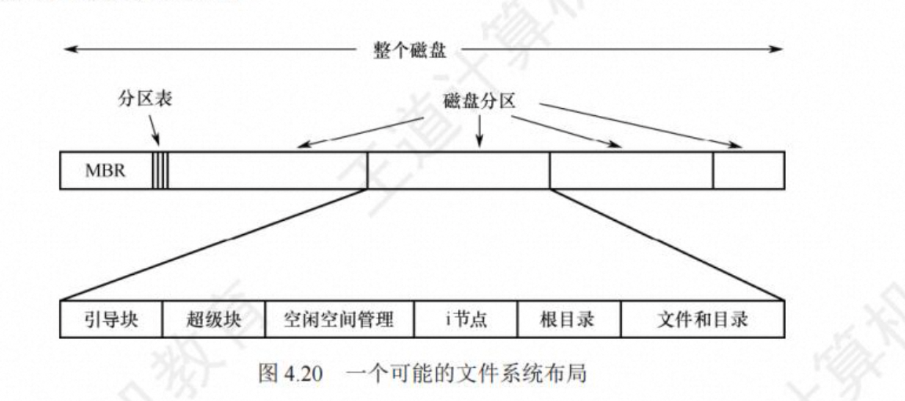

# 第五章 磁盘和固态硬盘

## 新磁盘安装操作系统的过程

### 1.磁盘初始化

> 物理格式化的内容(2017、2021)

一个新的磁盘只是一个磁性记录材料的空白盘。在磁盘可以存储数据之前，必须将它分成扇区，以便磁盘控制器能够进行读/写操作，这个过程称为**低级格式化(或称物理格式化)**。每个扇区通常由头部、数据区域和尾部组成。每个扇头部和尾部包含了一些磁盘控制器的使用信息，其中利用磁道号、磁头号和扇区号来标志一个扇区，利用CRC字段对扇区进行校验。

### 2.分区

>逻辑格式化的内容(2017、2021)

在可以使用磁盘存储文件之前，还要完成两个步骤。

第一步是，将磁盘分区(我们熟悉的C盘、D盘等形式的分区)，每个分区由一个或多个柱面组成，每个分区的起始扇区和大小都记录在磁盘主引导记录的分区表中。

第二步是，对物理分区进行逻辑格式化(也称高级格式化)，将初始文件系统数据结构存储到磁盘上，这些数据结构包括空闲空间和已分配空间，以及一个初始为空的目录，建立根目录、对保存空闲磁盘块信息的数据结构进行初始化。

因扇区的单位太小，为了提高效率，操作系统将多个相邻的扇区组合在一起，形成一簇(在Linux中称为块)。为了更高效地管理磁盘，一簇只能存放一个文件的内容，文件所占用的空间只能是簇的整数倍:如果文件大小小于一簇(甚至是0字节)，也要占用一簇的空间。

### 3. 引导块

计算机启动时需要运行一个初始化程序 (自举程序)，它初始化CPU、寄存器、设备控制器 和内存等，接着启动操作 系统 。此，自举程序找到磁盘上的操作系统内核，将它加载到内存，并转到起始地址，从而开始操作系统的运行

**自举程序**通常存放在**ROM**中，为了避免改变自举代码而需要改变ROM硬件的问题，通常只在ROM 中保留很小的自举装入程序，而将完整功能的引导程序保存在磁盘的启动块上，启动块位于磁盘的固定位置。具有启动分区的磁盘称內启动磁盘或系统磁盘。**操作系统最终被加载到RAM（内存）**

引导ROM中的代码指示磁盘控制器将引导块读入内存，然后开始执行，它可以从非固定的磁盘位置加载整个操作系统，并且开始运行操作系统。

下面以Windows为例来分析引导过程。

Windows允许将磁盘分为多个分区，有一个分区引导分区，它包含操作系统和设备驱动程序。Windows系统将引导代码存储在磁盘的第0号扇区，它称为主引导记录(MBR)。引导首先运行ROM中的代码，这个代码指示系统从MBR中读取引导代码。除了包含引导代码，MBR还包含一个磁盘分区表和一个标志(以指示从哪个分区引导系统)，如图5.17所示。当系统找到引导分区时，读取分区的第一个扇区，称为引导扇区，并继续余下的引导过程，包括加载各种系统服务。

### 4. 文件系统在磁盘的结构

文件系统存放在磁盘上，多数磁盘划分为一个或多个分区，每个分区中有一个独立的文件系统。文件系统可能包括如下信息:启动存储在那里的操作系统的方式、总的块数、空闲块的数量和位置、目录结构以及各个具体文件等。图4.20所示为一个可能的文件系统布局。

1) 主引导记录(MasterBootRecord,MBR)，位于磁盘的0号扇区，用来引导计算机，MBR的后面是分区表，该表给出每个分区的起始和结束地址。表中的一个分区被标记为活动分区。当计算机启动时，BIOS读入并执行MBR。MBR做的第一件事是确定活动分区，读入它的第一块，即引导块。

2) 引导块(bootblock)，MBR执行引导块中的程序后，**该程序负责启动该分区中的操作系统**。每个分区都是统一从一个引导块开始，即使它不含有一个可启动的操作系统，也不排除以后会在该分区安装一个操作系统。Windows系统称之为分区引导扇区。除了从引导块开始，磁盘分区的布局是随着文件系统的不同而变化的。文件系统经常包含有如图4.20所列的一些项目。

3) 超级块(superblock)，包含文件系统的所有关键信息，在计算机启动时，或者在该文件系统首次使用时，超级块会被读入内存。超级块中的典型信息包括分区的块的数量、块的大小、空闲块的数量和指针、空闲的FCB数量和FCB指针等。

4) 文件系统中空闲块的信息，可以用位示图或指针链接的形式给出。后面也许跟的是一组i节点，每个文件对应一个节点，i节点说明了文件的方方面面。接着可能是根目录，它存放文件系统目录树的根部。最后，磁盘的其他部分存放了其他所有的目录和文件。

