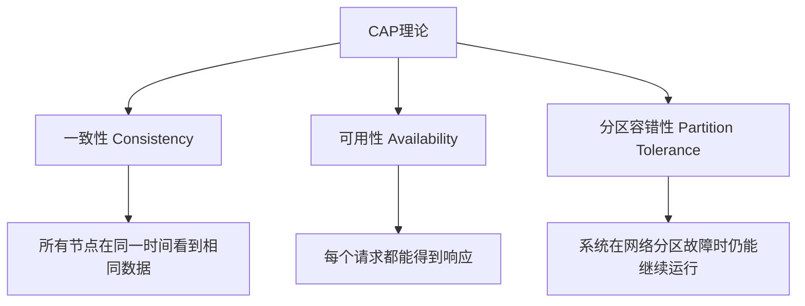
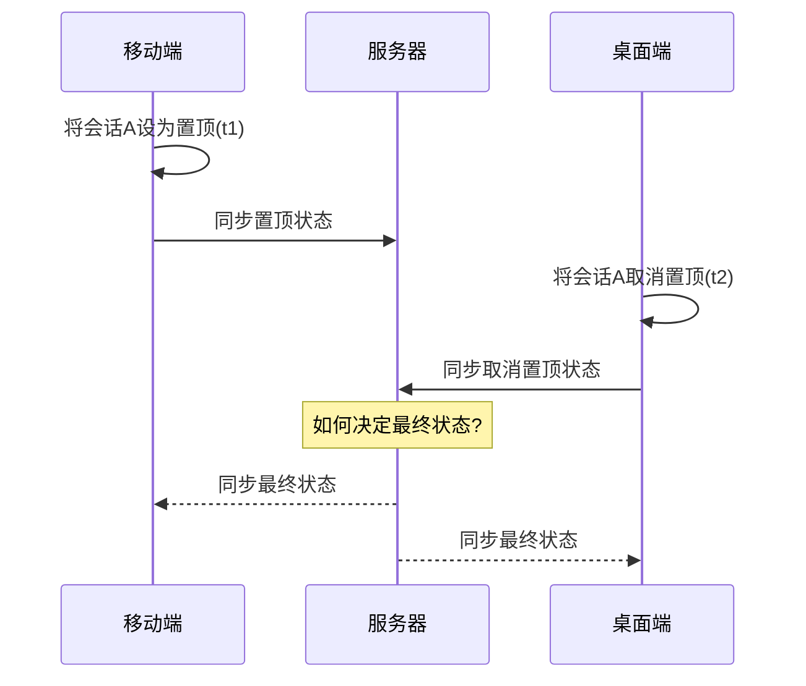

# IM多端状态一致性解决方案

在即时通讯（IM）系统中，用户通常会在多个终端（手机、平板、电脑）同时登录，这就带来了会话状态（如置顶、静音、未读计数等）如何在多端保持一致的问题。本文将从分布式系统的CAP理论出发，探讨IM场景下的多端一致性解决方案，并提供基于TypeScript和IndexedDB的实现代码。

## 一、CAP理论与IM系统

### 1.1 CAP理论基础

CAP理论是分布式系统设计中的基础理论，由Eric Brewer在2000年提出。该理论指出，在一个分布式系统中，以下三个特性最多只能同时满足其中两个：

- 一致性(Consistency): 所有节点在同一时间看到相同的数据
- 可用性(Availability): 每个请求都能收到一个（不保证正确）响应
- 分区容错性(Partition Tolerance): 系统在网络分区（节点之间通信中断）的情况下仍能继续运行

### 1.2 IM系统中的CAP选择

在IM系统中，对于会话状态（如置顶、静音）的处理，通常需要在以下两种模式中选择：

- AP模式（优先可用性）：允许用户随时操作，即使可能导致短暂的数据不一致
- CP模式（优先一致性）：确保操作只有在能够同步到服务器时才成功

多数IM系统采用的是混合策略：

- 本地操作采用AP模式，保证用户体验流畅
- 重要数据（如敏感信息）采用CP模式，保证强一致性
- 通过合理的冲突解决策略，最终达成多端一致

## 二、IM多端一致性面临的挑战

### 2.1 典型场景与问题

1. 会话置顶冲突：用户在手机将会话A置顶，同时在电脑将会话B置顶
2. 离线操作同步：用户在离线环境下修改多个会话状态，上线后需要与服务器同步
3. 多端操作顺序不一致：不同设备的操作到达服务器的顺序与用户的实际操作顺序不一致
4. 数据覆盖风险：后到达的操作可能错误地覆盖先到达的更重要操作

### 2.2 状态一致性的技术挑战

