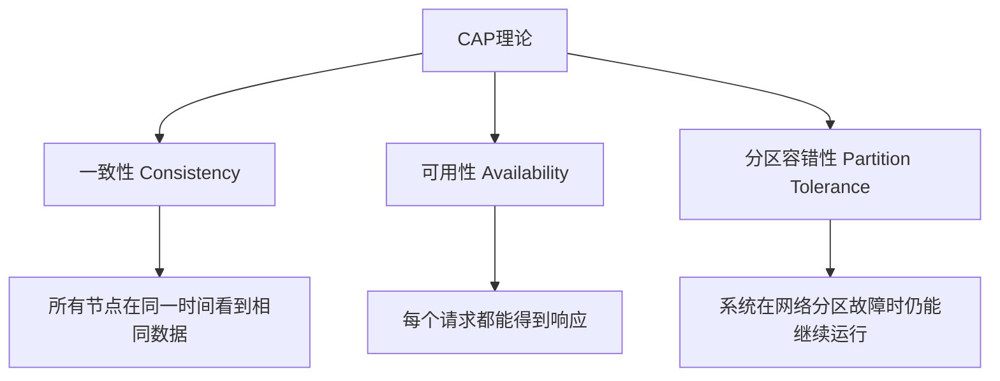
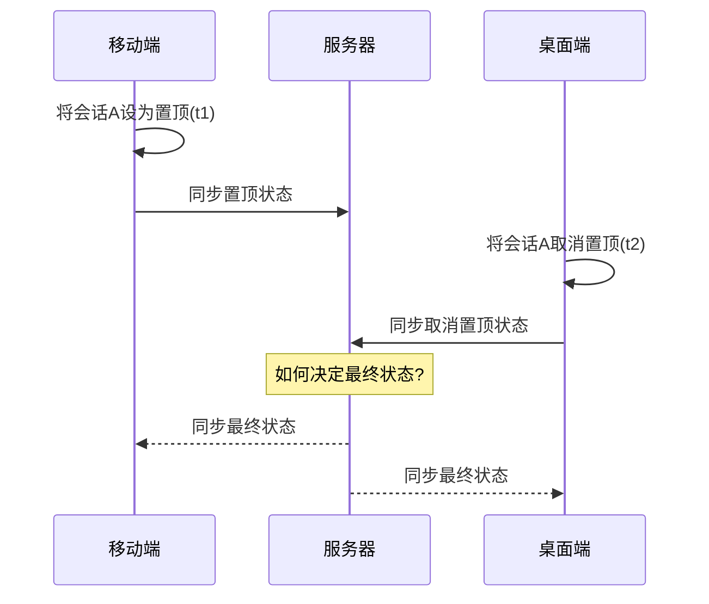
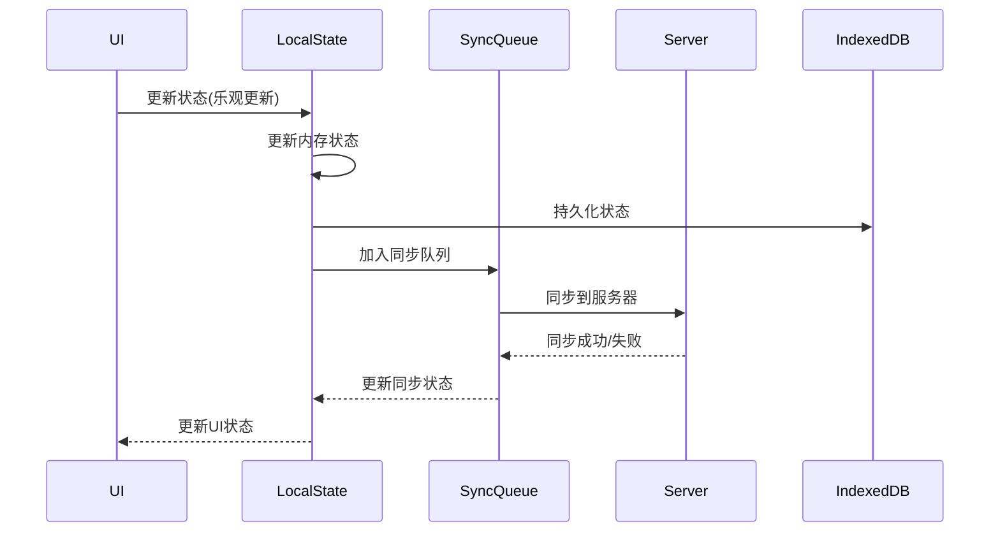
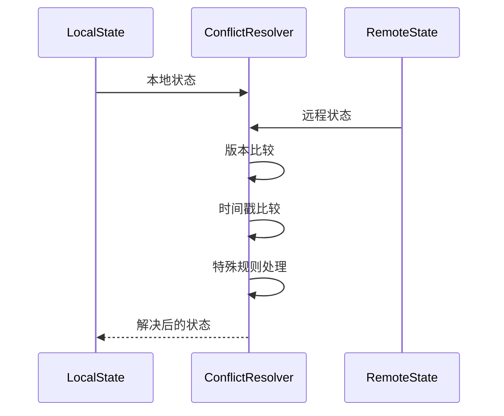

# IM多端状态一致性解决方案

在即时通讯（IM）系统中，用户通常会在多个终端（手机、平板、电脑）同时登录，这就带来了会话状态（如置顶、静音、未读计数等）如何在多端保持一致的问题。本文将从分布式系统的CAP理论出发，探讨IM场景下的多端一致性解决方案，并提供基于TypeScript和IndexedDB的实现代码。

## 一、CAP理论与IM系统

### 1.1 CAP理论基础

CAP理论是分布式系统设计中的基础理论，由Eric Brewer在2000年提出。该理论指出，在一个分布式系统中，以下三个特性最多只能同时满足其中两个：



- 一致性(Consistency): 所有节点在同一时间看到相同的数据
- 可用性(Availability): 每个请求都能收到一个（不保证正确）响应
- 分区容错性(Partition Tolerance): 系统在网络分区（节点之间通信中断）的情况下仍能继续运行

### 1.2 IM系统中的CAP选择

在IM系统中，对于会话状态（如置顶、静音）的处理，通常需要在以下两种模式中选择：

- AP模式（优先可用性）：允许用户随时操作，即使可能导致短暂的数据不一致
- CP模式（优先一致性）：确保操作只有在能够同步到服务器时才成功

多数IM系统采用的是混合策略：

- 本地操作采用AP模式，保证用户体验流畅
- 重要数据（如敏感信息）采用CP模式，保证强一致性
- 通过合理的冲突解决策略，最终达成多端一致

## 二、IM多端一致性面临的挑战

### 2.1 典型场景与问题

1. 会话置顶冲突：用户在手机将会话A置顶，同时在电脑将会话B置顶
2. 离线操作同步：用户在离线环境下修改多个会话状态，上线后需要与服务器同步
3. 多端操作顺序不一致：不同设备的操作到达服务器的顺序与用户的实际操作顺序不一致
4. 数据覆盖风险：后到达的操作可能错误地覆盖先到达的更重要操作

### 2.2 状态一致性的技术挑战




## 三、解决方案设计

### 3.1 分层架构

1. 本地状态层
 - 状态管理：管理内存中的会话状态
 - 状态持久化：将状态保存到 IndexedDB
 - 版本控制：维护状态版本，用于冲突检测

2. 同步层
 - 实时同步：通过 WebSocket 进行状态同步
 - 离线队列：管理离线状态更新
 - 冲突解决：处理多端状态冲突

3. 存储层
 - 内存缓存：使用 LRU 缓存热点会话
 - 持久化存储：使用 IndexedDB 存储状态
 - 队列管理：管理待同步的状态更新

### 3.2 核心流程


### 3.3 解决冲突



## 四、具体代码

### 4.1 本地状态层实现

1. **响应式状态管理**

本地状态层采用MobX实现响应式状态管理，通过`makeAutoObservable`将会话集合标记为可观察对象。这使得UI组件能够自动响应状态变化，无需手动触发渲染更新。

当会话状态发生变化时，所有依赖该状态的UI组件会自动重新渲染，大大简化了状态同步与UI更新的复杂度。

2. **向量时钟冲突检测**

实现采用向量时钟(Vector Clock)算法跟踪多端操作的因果关系。每个设备维护一个计数器映射表，记录所有设备的操作版本号：
```ts
  // 更新向量时钟
    if (!updatedConversation.vectorClock) {
      updatedConversation.vectorClock = {};
    }
    
    const deviceId = localStorage.getItem('device_id') || 'unknown';
    updatedConversation.vectorClock[deviceId] = 
      (updatedConversation.vectorClock[deviceId] || 0) + 1;
```
向量时钟机制具有以下优势：
- 确定操作的偏序关系：通过比较两个向量时钟，可以判断操作之间的因果关系
- 精确检测并发冲突：当两个向量时钟互不包含时，表示存在并发操作
- 支持多设备协作：每个设备独立维护自己的计数器，无需中央协调器

3. **事件驱动架构**

状态层采用事件驱动架构，通过事件总线(EventBus)实现各模块之间的松耦合通信：
```ts
private subscribeToEvents(): void {
  // 订阅会话更新事件
  this.eventBus.on(EventTypes.CONVERSATION_UPDATED, event => {
    const conversation = event.data as Conversation;
    this.updateConversation(conversation);
  });
  
  // 订阅同步完成事件
  this.eventBus.on(EventTypes.SYNC_COMPLETED, () => {
    this.initialize();
  });
}
```
这种设计带来以下技术优势：

- 解耦模块依赖：状态层与同步层通过事件通信，无需直接依赖对方的实现
- 简化异步操作链：事件机制天然支持异步操作流程
- 增强可观察性：所有状态变更都通过事件广播，便于监控和调试
- 提高可扩展性：新功能可以通过订阅现有事件快速集成

4. **乐观更新策略**

状态层实现了乐观更新(Optimistic Updates)模式，提升用户操作的响应速度：
```ts
async pinConversation(conversationId: string, isPinned: boolean): Promise<void> {
  // ...
  // 更新本地状态（立即执行，不等待网络响应）
  this.updateConversation(updatedConversation);
  
  // 持久化到IndexedDB
  await db.conversations.put(updatedConversation);
  
  // 发布事件，通知同步层
  this.eventBus.emit(EventTypes.CONVERSATION_CHANGED, {
    type: 'pin',
    data: updatedConversation
  });
}
```
乐观更新模式具有以下技术特点：

- 即时反馈：用户操作立即反映在UI上，不等待服务器确认
- 本地优先：先更新本地状态和持久化存储，再异步同步到服务器
- 异步同步：通过事件通知同步层进行后台同步，不阻塞用户操作
- 增强体验：即使在弱网环境下，用户也能感受到流畅的交互体验

5. **本地持久化存储**

状态层利用IndexedDB实现本地持久化存储，确保数据在页面刷新或应用重启后仍然可用：
```ts
async initialize(): Promise<void> {
  this.loading = true;
  try {
    const conversations = await db.conversations.toArray();
    conversations.forEach(conversation => {
      this.conversations.set(conversation.id, conversation);
    });
  } catch (error) {
    console.error('Failed to load conversations:', error);
  } finally {
    this.loading = false;
  }
}
```
IndexedDB相比其他存储方案的优势：

- 大容量存储：支持存储大量结构化数据，远超LocalStorage的限制
- 异步API设计：所有操作均为非阻塞，不影响主线程性能
- 支持复杂查询：提供索引和范围查询能力
- 事务支持：提供原子性操作，确保数据一致性

**完整代码：**
```ts
// src/core/state/ConversationState.ts

import { makeAutoObservable } from 'mobx';
import { db } from '../db';
import { EventBus, EventTypes } from '../event';

// 会话状态定义
export interface Conversation {
  id: string;
  title: string;
  lastMessage?: string;
  lastMessageTime?: number;
  unreadCount: number;
  isPinned: boolean;
  isMuted: boolean;
  vectorClock: {[deviceId: string]: number};  // 向量时钟
  lastModified: number;
}

/**
 * 会话状态管理类
 * 负责本地状态管理与响应式更新
 */
export class ConversationStore {
  // 所有会话映射
  conversations = new Map<string, Conversation>();
  // 当前选中的会话ID
  currentConversationId: string | null = null;
  // 加载状态
  loading = false;
  
  constructor(private eventBus: EventBus) {
    // 使用MobX实现响应式
    makeAutoObservable(this);
    
    // 订阅数据变更事件
    this.subscribeToEvents();
  }
  
  /**
   * 初始化，从IndexedDB加载会话数据
   */
  async initialize(): Promise<void> {
    this.loading = true;
    try {
      const conversations = await db.conversations.toArray();
      conversations.forEach(conversation => {
        this.conversations.set(conversation.id, conversation);
      });
    } catch (error) {
      console.error('Failed to load conversations:', error);
    } finally {
      this.loading = false;
    }
  }
  
  /**
   * 订阅事件总线消息
   */
  private subscribeToEvents(): void {
    // 订阅会话更新事件
    this.eventBus.on(EventTypes.CONVERSATION_UPDATED, event => {
      const conversation = event.data as Conversation;
      this.updateConversation(conversation);
    });
    
    // 订阅同步完成事件
    this.eventBus.on(EventTypes.SYNC_COMPLETED, () => {
      this.initialize();
    });
  }
  
  /**
   * 更新会话状态
   * @param conversation 会话对象
   */
  updateConversation(conversation: Conversation): void {
    this.conversations.set(conversation.id, { 
      ...conversation,
      lastModified: Date.now()
    });
  }
  
  /**
   * 获取所有会话列表（排序后）
   */
  get conversationList(): Conversation[] {
    return Array.from(this.conversations.values())
      .sort((a, b) => {
        // 置顶的会话排在前面
        if (a.isPinned && !b.isPinned) return -1;
        if (!a.isPinned && b.isPinned) return 1;
        
        // 按最后消息时间倒序
        return (b.lastMessageTime || 0) - (a.lastMessageTime || 0);
      });
  }
  
  /**
   * 修改会话置顶状态
   * @param conversationId 会话ID
   * @param isPinned 是否置顶
   */
  async pinConversation(conversationId: string, isPinned: boolean): Promise<void> {
    const conversation = this.conversations.get(conversationId);
    if (!conversation) return;
    
    // 生成更新后的会话对象
    const updatedConversation = {
      ...conversation,
      isPinned,
      lastModified: Date.now()
    };
    
    // 更新向量时钟
    if (!updatedConversation.vectorClock) {
      updatedConversation.vectorClock = {};
    }
    
    const deviceId = localStorage.getItem('device_id') || 'unknown';
    updatedConversation.vectorClock[deviceId] = 
      (updatedConversation.vectorClock[deviceId] || 0) + 1;
    
    // 更新本地状态
    this.updateConversation(updatedConversation);
    
    // 持久化到IndexedDB
    await db.conversations.put(updatedConversation);
    
    // 发布事件，通知同步层
    this.eventBus.emit(EventTypes.CONVERSATION_CHANGED, {
      type: 'pin',
      data: updatedConversation
    });
  }
  
  /**
   * 修改会话静音状态
   * @param conversationId 会话ID
   * @param isMuted 是否静音
   */
  async muteConversation(conversationId: string, isMuted: boolean): Promise<void> {
    const conversation = this.conversations.get(conversationId);
    if (!conversation) return;
    
    // 类似pinConversation的实现...
    const updatedConversation = {
      ...conversation,
      isMuted,
      lastModified: Date.now()
    };
    
    // 更新向量时钟
    if (!updatedConversation.vectorClock) {
      updatedConversation.vectorClock = {};
    }
    
    const deviceId = localStorage.getItem('device_id') || 'unknown';
    updatedConversation.vectorClock[deviceId] = 
      (updatedConversation.vectorClock[deviceId] || 0) + 1;
    
    // 更新本地状态
    this.updateConversation(updatedConversation);
    
    // 持久化到IndexedDB
    await db.conversations.put(updatedConversation);
    
    // 发布事件，通知同步层
    this.eventBus.emit(EventTypes.CONVERSATION_CHANGED, {
      type: 'mute',
      data: updatedConversation
    });
  }
}
```

### 4.2 同步层实现

```ts
// src/core/sync/SyncManager.ts

import { db } from '../db';
import { EventBus, EventTypes } from '../event';
import { Conversation } from '../state/ConversationState';
import { ConflictResolver } from './ConflictResolver';
import { ExponentialBackoff } from '../utils/ExponentialBackoff';

// 网络请求服务接口
interface ApiService {
  fetchConversations(): Promise<Conversation[]>;
  syncConversation(conversation: Conversation): Promise<Conversation>;
}

/**
 * 同步管理器
 * 负责本地状态与服务器的同步
 */
export class SyncManager {
  private isInitialized = false;
  private isSyncing = false;
  private syncQueue: Conversation[] = [];
  private retryTimeout: any = null;
  private conflictResolver: ConflictResolver;
  private backoff: ExponentialBackoff;
  
  constructor(
    private eventBus: EventBus,
    private apiService: ApiService
  ) {
    this.conflictResolver = new ConflictResolver();
    this.backoff = new ExponentialBackoff({
      baseInterval: 1000,   // 1秒基础间隔
      maxInterval: 60000,   // 最大60秒
      maxRetries: 10,
      jitter: 0.2           // 20%的随机抖动
    });
    this.subscribeToEvents();
  }
  
  /**
   * 初始化同步管理器
   */
  async initialize(): Promise<void> {
    if (this.isInitialized) return;
    
    // 加载同步队列
    await this.loadSyncQueue();
    
    // 首次同步
    if (navigator.onLine) {
      await this.syncWithServer();
    }
    
    // 监听在线状态变化
    window.addEventListener('online', this.handleOnline);
    window.addEventListener('offline', this.handleOffline);
    
    // 设置定期同步（每30秒）
    setInterval(() => {
      if (navigator.onLine && !this.isSyncing && this.syncQueue.length > 0) {
        this.syncWithServer();
      }
    }, 30000);
    
    this.isInitialized = true;
    console.log('SyncManager initialized');
  }
  
  /**
   * 订阅事件
   */
  private subscribeToEvents(): void {
    // 监听会话变更事件
    this.eventBus.on(EventTypes.CONVERSATION_CHANGED, event => {
      const conversation = event.data as Conversation;
      this.queueForSync(conversation);
    });
  }
  
  /**
   * 处理上线事件
   */
  private handleOnline = (): void => {
    console.log('Network connected, starting sync');
    this.backoff.reset(); // 重置退避状态
    this.syncWithServer();
  }
  
  /**
   * 处理离线事件
   */
  private handleOffline = (): void => {
    console.log('Network disconnected, sync paused');
    // 清除重试定时器
    if (this.retryTimeout) {
      clearTimeout(this.retryTimeout);
      this.retryTimeout = null;
    }
  }
  
  /**
   * 将会话添加到同步队列
   */
  async queueForSync(conversation: Conversation): Promise<void> {
    // 防止重复添加相同ID的会话
    const existingIndex = this.syncQueue.findIndex(item => item.id === conversation.id);
    if (existingIndex !== -1) {
      // 如果存在相同ID的会话，则替换为最新版本
      this.syncQueue[existingIndex] = conversation;
    } else {
      // 添加到队列
      this.syncQueue.push(conversation);
    }
    
    // 持久化同步队列
    await this.saveSyncQueue();
    
    // 如果在线且未同步中，立即开始同步
    if (navigator.onLine && !this.isSyncing) {
      this.syncWithServer();
    }
  }
  
  /**
   * 与服务器同步
   */
  async syncWithServer(): Promise<void> {
    if (this.isSyncing || !navigator.onLine) return;
    
    this.isSyncing = true;
    
    try {
      // 1. 先获取服务器数据
      const serverConversations = await this.apiService.fetchConversations();
      
      // 2. 将服务器数据与本地数据合并
      await this.mergeServerData(serverConversations);
      
      // 3. 处理本地待同步队列
      await this.processSyncQueue();
      
      // 4. 发布同步完成事件
      this.eventBus.emit(EventTypes.SYNC_COMPLETED, { success: true });
      
      // 重置退避策略
      this.backoff.reset();
      
    } catch (error) {
      console.error('Sync failed:', error);
      
      // 使用指数退避重试
      try {
        const delay = this.backoff.getNextDelay();
        console.log(`Retrying sync in ${delay}ms...`);
        
        this.retryTimeout = setTimeout(() => {
          this.isSyncing = false;
          this.syncWithServer();
        }, delay);
      } catch (backoffError) {
        // 达到最大重试次数
        console.error('Max retries exceeded, giving up sync attempt');
        this.eventBus.emit(EventTypes.SYNC_FAILED, { 
          error: error,
          retryExhausted: true
        });
      }
      
    } finally {
      this.isSyncing = false;
    }
  }
  
  /**
   * 处理同步队列
   */
  private async processSyncQueue(): Promise<void> {
    if (this.syncQueue.length === 0) return;
    
    // 复制一份同步队列，防止处理过程中有新的项被添加
    const queueToProcess = [...this.syncQueue];
    const failedItems: Conversation[] = [];
    
    for (const conversation of queueToProcess) {
      try {
        // 同步到服务器
        const serverResponse = await this.apiService.syncConversation(conversation);
        
        // 根据最新服务器响应更新本地数据
        await db.conversations.put(serverResponse);
        
        // 发布更新事件
        this.eventBus.emit(EventTypes.CONVERSATION_UPDATED, {
          type: 'update',
          data: serverResponse
        });
        
        // 从队列中移除已成功同步的项
        this.syncQueue = this.syncQueue.filter(item => item.id !== conversation.id);
        
      } catch (error) {
        console.error(`Failed to sync conversation ${conversation.id}:`, error);
        failedItems.push(conversation);
        
        // 如果是网络错误，中断处理
        if (error.name === 'NetworkError' || !navigator.onLine) {
          break;
        }
      }
    }
    
    // 更新同步队列状态（移除成功项，保留失败项）
    if (failedItems.length > 0) {
      this.eventBus.emit(EventTypes.SYNC_PARTIALLY_COMPLETED, {
        success: this.syncQueue.length - failedItems.length,
        failed: failedItems.length
      });
    }
    
    // 保存更新后的同步队列
    await this.saveSyncQueue();
  }
  
  /**
   * 合并服务器数据与本地数据
   */
  private async mergeServerData(serverConversations: Conversation[]): Promise<void> {
    // 获取本地所有会话
    const localConversations = await db.conversations.toArray();
    const localById = new Map(localConversations.map(c => [c.id, c]));
    
    const updates: Conversation[] = [];
    
    // 处理每个服务器会话
    for (const serverConv of serverConversations) {
      const localConv = localById.get(serverConv.id);
      
      if (!localConv) {
        // 本地没有，直接添加服务器版本
        updates.push(serverConv);
      } else {
        // 本地存在，需要解决冲突
        const mergedConv = this.conflictResolver.resolveConflict(localConv, serverConv);
        
        // 如果合并后的结果与本地不同，则更新本地
        if (JSON.stringify(mergedConv) !== JSON.stringify(localConv)) {
          updates.push(mergedConv);
        }
      }
    }
    
    // 批量更新本地数据库
    if (updates.length > 0) {
      await db.conversations.bulkPut(updates);
      
      // 发布批量更新事件
      this.eventBus.emit(EventTypes.CONVERSATIONS_UPDATED, {
        type: 'bulkUpdate',
        data: updates
      });
    }
  }
  
  /**
   * 加载同步队列
   */
  private async loadSyncQueue(): Promise<void> {
    try {
      const storedQueue = await db.syncQueue.get('conversations');
      if (storedQueue && Array.isArray(storedQueue.items)) {
        this.syncQueue = storedQueue.items;
        console.log(`Loaded ${this.syncQueue.length} items from sync queue`);
      }
    } catch (error) {
      console.error('Failed to load sync queue:', error);
      this.syncQueue = [];
    }
  }
  
  /**
   * 保存同步队列
   */
  private async saveSyncQueue(): Promise<void> {
    try {
      await db.syncQueue.put({
        id: 'conversations',
        items: this.syncQueue,
        lastUpdated: Date.now()
      });
    } catch (error) {
      console.error('Failed to save sync queue:', error);
    }
  }
  
  /**
   * 手动触发同步
   * 可用于用户手动刷新操作
   */
  async manualSync(): Promise<boolean> {
    if (this.isSyncing) return false;
    
    try {
      await this.syncWithServer();
      return true;
    } catch (error) {
      console.error('Manual sync failed:', error);
      return false;
    }
  }
  
  /**
   * 获取同步状态
   */
  getSyncStatus(): {isSyncing: boolean, queueSize: number} {
    return {
      isSyncing: this.isSyncing,
      queueSize: this.syncQueue.length
    };
  }
  
  /**
   * 清空同步队列
   * 用于紧急情况下放弃所有未同步更改
   */
  async clearSyncQueue(): Promise<void> {
    this.syncQueue = [];
    await this.saveSyncQueue();
  }
}


```

### 4.3 冲突解决器

```ts

/**
 * 冲突解决器
 * 负责解决本地数据与服务器数据的冲突
 */
export class ConflictResolver {
  /**
   * 解决两个版本的会话状态冲突
   * @param localState 本地状态
   * @param remoteState 远程状态
   * @returns 合并后的状态
   */
  resolveConflict(localState: Conversation, remoteState: Conversation): Conversation {
    // 1. 基于向量时钟比较版本
    if (this.isVectorClockGreater(remoteState.vectorClock, localState.vectorClock)) {
      return remoteState;
    } else if (this.isVectorClockGreater(localState.vectorClock, remoteState.vectorClock)) {
      return localState;
    } else {
      // 2. 无法通过向量时钟确定先后，需要自定义合并策略
      return this.mergeStates(localState, remoteState);
    }
  }
  
  /**
   * 比较两个向量时钟，判断vc1是否大于vc2
   */
  private isVectorClockGreater(vc1: {[deviceId: string]: number}, 
                              vc2: {[deviceId: string]: number}): boolean {
    let isGreater = false;
    
    // 检查vc1是否大于vc2
    for (const deviceId in vc1) {
      if (!(deviceId in vc2) || vc1[deviceId] > vc2[deviceId]) {
        isGreater = true;
      } else if (vc1[deviceId] < vc2[deviceId]) {
        // 如果任一维度小于vc2，则不可能大于
        return false;
      }
    }
    
    // 检查vc2是否有vc1没有的设备ID
    for (const deviceId in vc2) {
      if (!(deviceId in vc1)) {
        return false;
      }
    }
    
    return isGreater;
  }
  
  /**
   * 合并两个状态
   * 根据业务规则实现自定义合并策略
   */
  private mergeStates(state1: Conversation, state2: Conversation): Conversation {
    // 合并向量时钟
    const mergedVectorClock = this.mergeVectorClocks(state1.vectorClock, state2.vectorClock);
    
    // 根据业务规则合并状态
    // 例如：置顶优先于非置顶，静音优先于非静音
    return {
      ...state1,
      isPinned: state1.isPinned || state2.isPinned,       // 任一端置顶则置顶
      isMuted: state1.isMuted || state2.isMuted,          // 任一端静音则静音
      unreadCount: Math.max(state1.unreadCount, state2.unreadCount),
      lastModified: Math.max(state1.lastModified, state2.lastModified),
      vectorClock: mergedVectorClock
    };
  }
  
  /**
   * 合并两个向量时钟
   */
  private mergeVectorClocks(vc1: {[deviceId: string]: number}, 
                          vc2: {[deviceId: string]: number}): {[deviceId: string]: number} {
    const mergedVC: {[deviceId: string]: number} = {...vc1};
    
    for (const deviceId in vc2) {
      if (vc2[deviceId] > (mergedVC[deviceId] || 0)) {
        mergedVC[deviceId] = vc2[deviceId];
      }
    }
    
    return mergedVC;
  }
}

```

### 4.4 存储层


```ts
// src/core/storage/StorageManager.ts

import Dexie from 'dexie';
import { EventBus, EventTypes } from '../event';
import { LRUCache } from './LRUCache';
import { ExponentialBackoff } from '../utils/ExponentialBackoff';

/**
 * 存储管理器
 * 集成本地缓存、持久化存储和队列管理
 */
export class StorageManager {
  // 内存中的LRU缓存，用于存储热点会话数据
  private conversationCache: LRUCache<Conversation>;
  // 消息缓存
  private messageCache: LRUCache<Message[]>;
  // 退避算法实例，用于失败重试
  private backoff: ExponentialBackoff;
  // 缓存命中率统计
  private metrics = {
    cacheHits: 0,
    cacheMisses: 0,
    writeOperations: 0,
    readOperations: 0,
  };

  constructor(
    private db: IMDatabase,
    private eventBus: EventBus,
    private options = {
      conversationCacheSize: 50, // 默认缓存50个会话
      messageCacheSize: 20,      // 默认缓存20个会话的消息
    }
  ) {
    // 初始化LRU缓存
    this.conversationCache = new LRUCache<Conversation>(options.conversationCacheSize);
    this.messageCache = new LRUCache<Message[]>(options.messageCacheSize);
    
    // 初始化退避算法
    this.backoff = new ExponentialBackoff({
      baseInterval: 500,   // 500ms基础间隔
      maxInterval: 30000,  // 最大30秒
      maxRetries: 5,
      jitter: 0.2          // 20%随机抖动
    });
    
    // 订阅事件
    this.subscribeToEvents();
  }

  /**
   * 订阅存储相关事件
   */
  private subscribeToEvents(): void {
    // 监听会话更新事件，更新缓存
    this.eventBus.on(EventTypes.CONVERSATION_UPDATED, event => {
      const conversation = event.data as Conversation;
      this.conversationCache.put(conversation.id, conversation);
    });
    
    // 监听消息更新事件，更新缓存
    this.eventBus.on(EventTypes.MESSAGE_UPDATED, event => {
      const message = event.data as Message;
      // 更新消息缓存
      const cachedMessages = this.messageCache.get(message.conversationId);
      if (cachedMessages) {
        // 找到并更新对应消息
        const index = cachedMessages.findIndex(m => m.id === message.id);
        if (index !== -1) {
          cachedMessages[index] = message;
        } else {
          cachedMessages.push(message);
        }
        this.messageCache.put(message.conversationId, cachedMessages);
      }
    });
  }

  /**
   * 获取会话
   * 优先从缓存获取，缓存未命中则从数据库加载
   * 
   * @param conversationId 会话ID
   */
  async getConversation(conversationId: string): Promise<Conversation | undefined> {
    this.metrics.readOperations++;
    
    // 1. 优先从缓存获取
    const cachedConversation = this.conversationCache.get(conversationId);
    if (cachedConversation) {
      this.metrics.cacheHits++;
      return cachedConversation;
    }
    
    this.metrics.cacheMisses++;
    
    // 2. 缓存未命中，从数据库读取
    try {
      const conversation = await this.db.conversations.get(conversationId);
      
      // 3. 将数据加入缓存
      if (conversation) {
        this.conversationCache.put(conversationId, conversation);
      }
      
      return conversation;
    } catch (error) {
      console.error(`Failed to get conversation ${conversationId}:`, error);
      throw new Error(`存储层读取会话失败: ${error.message}`);
    }
  }

  /**
   * 保存会话
   * 同时更新缓存和数据库
   * 
   * @param conversation 会话对象
   */
  async saveConversation(conversation: Conversation): Promise<void> {
    this.metrics.writeOperations++;
    
    try {
      // 1. 更新缓存
      this.conversationCache.put(conversation.id, conversation);
      
      // 2. 持久化到数据库
      await this.db.conversations.put(conversation);
      
      // 3. 发布事件通知其他模块
      this.eventBus.emit(EventTypes.CONVERSATION_SAVED, {
        type: 'save',
        data: conversation
      });
    } catch (error) {
      console.error(`Failed to save conversation ${conversation.id}:`, error);
      throw new Error(`存储层保存会话失败: ${error.message}`);
    }
  }

  /**
   * 获取会话消息
   * 优先从缓存获取，缓存未命中则从数据库分页加载
   * 
   * @param conversationId 会话ID
   * @param options 查询选项（分页、排序等）
   */
  async getMessages(
    conversationId: string, 
    options: {
      limit?: number,
      offset?: number,
      beforeTime?: number,
      afterTime?: number
    } = {}
  ): Promise<Message[]> {
    this.metrics.readOperations++;
    
    // 设置默认值
    const limit = options.limit || 20;
    const offset = options.offset || 0;
    
    // 如果有时间范围筛选，直接从数据库查询（缓存数据可能不完整）
    if (options.beforeTime || options.afterTime) {
      this.metrics.cacheMisses++;
      return this.queryMessagesFromDB(conversationId, options);
    }
    
    // 尝试从缓存获取
    const cachedMessages = this.messageCache.get(conversationId);
    if (cachedMessages) {
      this.metrics.cacheHits++;
      
      // 根据分页参数截取缓存中的消息
      if (offset < cachedMessages.length) {
        return cachedMessages.slice(offset, offset + limit);
      }
    }
    
    this.metrics.cacheMisses++;
    
    // 缓存未命中或分页超出缓存范围，从数据库查询
    const messages = await this.queryMessagesFromDB(conversationId, options);
    
    // 更新缓存（简单处理：仅当获取首页数据时更新缓存）
    if (offset === 0) {
      this.messageCache.put(conversationId, messages);
    }
    
    return messages;
  }
  
  /**
   * 从数据库查询消息
   * 实现分页和时间范围筛选
   */
  private async queryMessagesFromDB(
    conversationId: string,
    options: {
      limit?: number,
      offset?: number,
      beforeTime?: number,
      afterTime?: number
    }
  ): Promise<Message[]> {
    const { limit = 20, offset = 0, beforeTime, afterTime } = options;
    
    try {
      let query = this.db.messages
        .where('conversationId')
        .equals(conversationId);
        
      // 添加时间范围筛选
      if (beforeTime) {
        query = query.and(msg => msg.timestamp < beforeTime);
      }
      
      if (afterTime) {
        query = query.and(msg => msg.timestamp > afterTime);
      }
      
      // 按时间降序排序，获取分页数据
      const messages = await query
        .reverse() // 降序排序
        .offset(offset)
        .limit(limit)
        .toArray();
        
      return messages;
    } catch (error) {
      console.error(`Failed to query messages for conversation ${conversationId}:`, error);
      // 使用退避算法重试
      return this.retryOperation(() => this.queryMessagesFromDB(conversationId, options));
    }
  }
  
  /**
   * 保存消息
   * 更新缓存和数据库
   * 
   * @param message 消息对象
   */
  async saveMessage(message: Message): Promise<void> {
    this.metrics.writeOperations++;
    
    try {
      // 1. 更新本地数据库
      await this.db.messages.put(message);
      
      // 2. 更新缓存
      const cachedMessages = this.messageCache.get(message.conversationId);
      if (cachedMessages) {
        // 查找是否已存在该消息
        const index = cachedMessages.findIndex(m => m.id === message.id);
        if (index !== -1) {
          // 更新现有消息
          cachedMessages[index] = message;
        } else {
          // 添加新消息并按时间排序
          cachedMessages.push(message);
          cachedMessages.sort((a, b) => b.timestamp - a.timestamp);
        }
        this.messageCache.put(message.conversationId, cachedMessages);
      }
      
      // 3. 更新会话最后消息
      const conversation = await this.getConversation(message.conversationId);
      if (conversation) {
        // 只有当新消息比会话最后消息更新时才更新会话
        if (!conversation.lastMessageTime || message.timestamp > conversation.lastMessageTime) {
          await this.saveConversation({
            ...conversation,
            lastMessage: message.content,
            lastMessageTime: message.timestamp
          });
        }
      }
      
      // 4. 发布消息保存事件
      this.eventBus.emit(EventTypes.MESSAGE_SAVED, {
        type: 'save',
        data: message
      });
    } catch (error) {
      console.error(`Failed to save message ${message.id}:`, error);
      // 添加到重试队列
      await this.addToRetryQueue('message', message);
    }
  }
  
  /**
   * 添加操作到重试队列
   * 用于处理失败的写操作
   */
  private async addToRetryQueue(type: 'conversation' | 'message', data: any): Promise<void> {
    try {
      await this.db.retryQueue.put({
        id: `${type}_${Date.now()}_${Math.random().toString(36).substring(2, 9)}`,
        type,
        data,
        retries: 0,
        timestamp: Date.now()
      });
    } catch (error) {
      console.error('Failed to add operation to retry queue:', error);
    }
  }
  
  /**
   * 处理重试队列
   * 尝试重新执行失败的操作
   */
  async processRetryQueue(): Promise<void> {
    try {
      // 获取所有待重试的操作
      const retryItems = await this.db.retryQueue.toArray();
      
      for (const item of retryItems) {
        try {
          // 根据操作类型执行对应的重试
          if (item.type === 'conversation') {
            await this.saveConversation(item.data);
          } else if (item.type === 'message') {
            await this.saveMessage(item.data);
          }
          
          // 操作成功，从队列中删除
          await this.db.retryQueue.delete(item.id);
        } catch (error) {
          // 更新重试次数
          item.retries += 1;
          
          if (item.retries >= 5) {
            // 达到最大重试次数，从队列中删除
            await this.db.retryQueue.delete(item.id);
            // 发布重试失败事件
            this.eventBus.emit(EventTypes.RETRY_FAILED, {
              type: item.type,
              data: item.data,
              error
            });
          } else {
            // 更新重试次数
            await this.db.retryQueue.update(item.id, { retries: item.retries });
          }
        }
      }
    } catch (error) {
      console.error('Failed to process retry queue:', error);
    }
  }
  
  /**
   * 带重试的操作执行函数
   * 使用指数退避算法自动重试失败的操作
   */
  private async retryOperation<T>(operation: () => Promise<T>): Promise<T> {
    this.backoff.reset();
    
    while (true) {
      try {
        return await operation();
      } catch (error) {
        try {
          // 计算下一次重试延迟
          const delay = this.backoff.getNextDelay();
          console.log(`操作失败，将在 ${delay}ms 后重试...`);
          
          // 等待指定时间后重试
          await new Promise(resolve => setTimeout(resolve, delay));
        } catch (backoffError) {
          // 达到最大重试次数，抛出原始错误
          console.error('达到最大重试次数，操作失败:', error);
          throw error;
        }
      }
    }
  }
  
  /**
   * 批量保存消息
   * 用于处理历史消息同步
   */
  async saveMessages(messages: Message[]): Promise<void> {
    if (!messages.length) return;
    
    try {
      // 按会话ID分组消息
      const messagesByConversation = new Map<string, Message[]>();
      
      for (const message of messages) {
        const conversationId = message.conversationId;
        if (!messagesByConversation.has(conversationId)) {
          messagesByConversation.set(conversationId, []);
        }
        messagesByConversation.get(conversationId)!.push(message);
      }
      
      // 并发保存每个会话的消息
      const promises = Array.from(messagesByConversation.entries()).map(([conversationId, msgs]) => 
        this.saveMessagesInConversation(conversationId, msgs)
      );
      
      await Promise.all(promises);
      
      // 发布批量消息保存事件
      this.eventBus.emit(EventTypes.MESSAGES_SAVED, {
        type: 'batchSave',
        data: messages
      });
    } catch (error) {
      console.error('Failed to save messages:', error);
      // 添加到重试队列
      await this.addToRetryQueue('messages', messages);
    }
  }
  
  /**
   * 在特定会话中保存一组消息
   * @param conversationId 会话ID
   * @param messages 消息数组
   */
  private async saveMessagesInConversation(conversationId: string, messages: Message[]): Promise<void> {
    // 更新本地数据库
    await this.db.messages.bulkPut(messages);
    
    // 更新缓存
    const cachedMessages = this.messageCache.get(conversationId);
    if (cachedMessages) {
      // 合并新消息并按时间排序
      const updatedMessages = [...cachedMessages, ...messages].sort((a, b) => b.timestamp - a.timestamp);
      this.messageCache.put(conversationId, updatedMessages);
    }
    
    // 更新会话最后消息
    const conversation = await this.getConversation(conversationId);
    if (conversation) {
      const latestMessage = messages.reduce((latest, msg) => 
        msg.timestamp > latest.timestamp ? msg : latest
      );
      if (latestMessage.timestamp > (conversation.lastMessageTime || 0)) {
        await this.saveConversation({
          ...conversation,
          lastMessage: latestMessage.content,
          lastMessageTime: latestMessage.timestamp
        });
      }
    }
  }
}
```