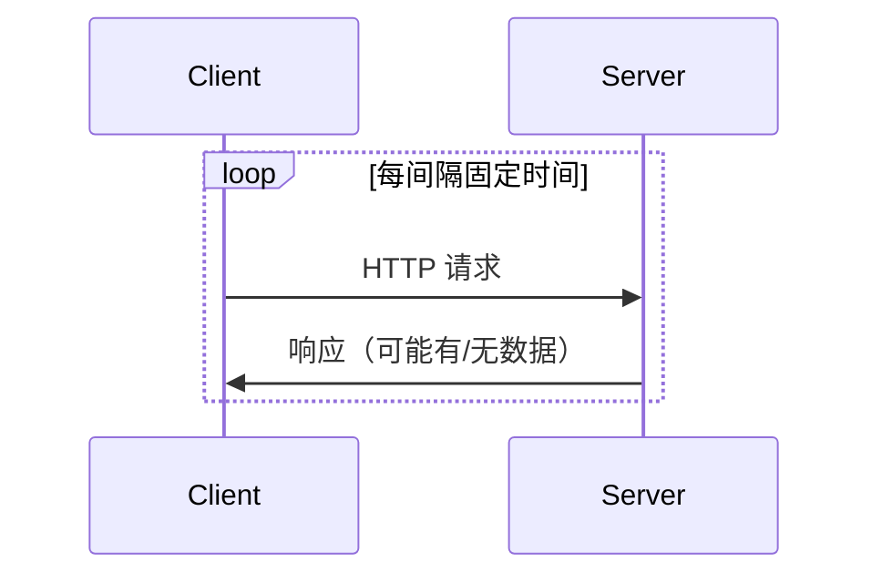
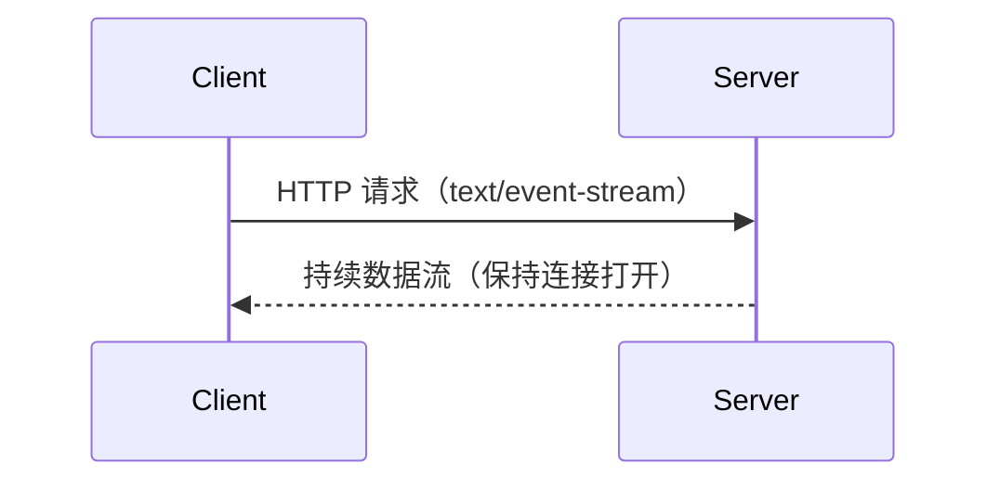

# 现代Web实时通信技术全景对比：HTTP、WebSocket、SSE、长短轮询

### 1. 轮询（Polling）

```mermaid
sequenceDiagram
    participant Client
    participant Server
    loop 每间隔固定时间
        Client->>Server: HTTP 请求
        Server->>Client: 响应（可能有/无数据）
    end
```
特点：

 - 实现简单但效率低下
 - 典型延迟 = 轮询间隔时间
 - 高并发场景下服务器压力大

### 2. SSE（Server-Sent Events）

```mermaid
sequenceDiagram
    participant Client
    participant Server
    Client->>Server: HTTP 请求（text/event-stream）
    Server-->>Client: 持续数据流（保持连接打开）
```