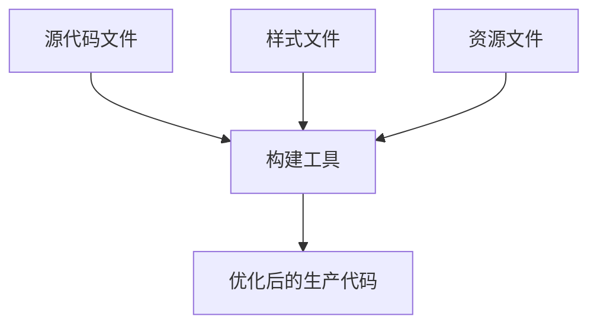
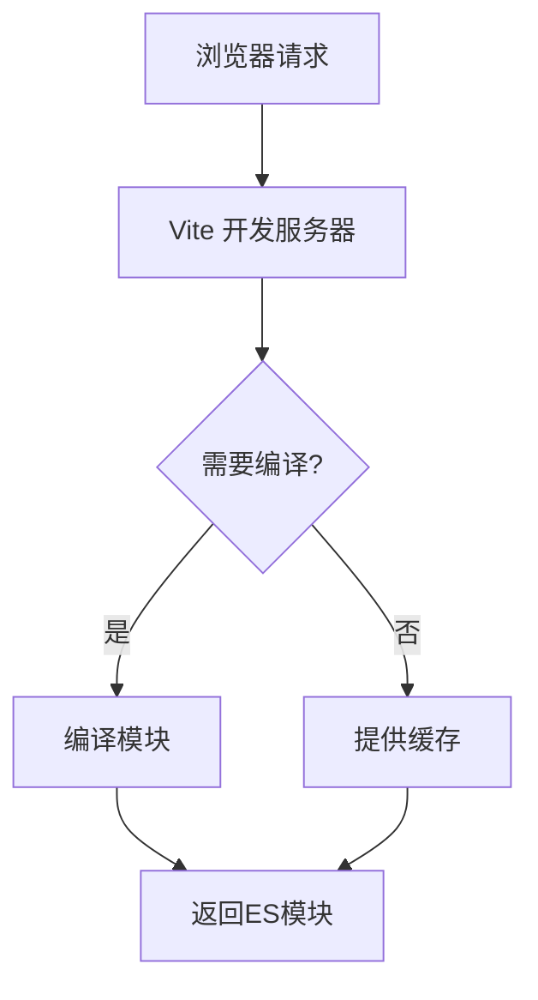
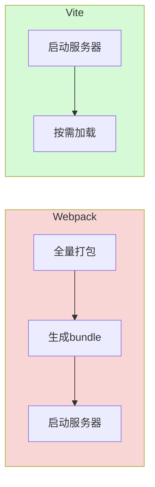
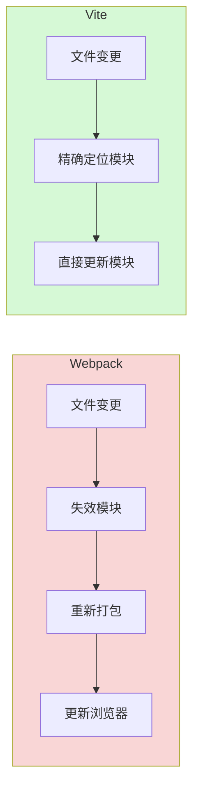
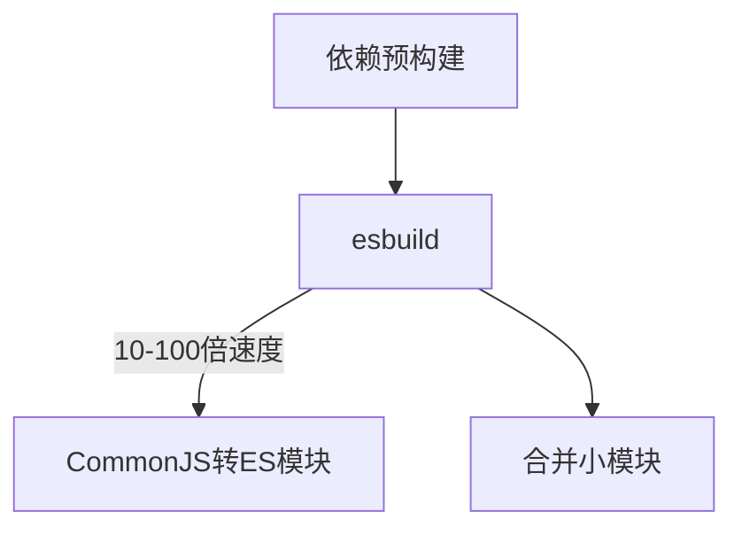

# Vite 为什么比 Webpack 快：深度对比分析

在现代前端开发中，构建工具的选择对开发效率和项目性能有着决定性影响。虽然"新"并不总是意味着"更好"，但当谈到 Vite 和 Webpack 这两个流行的构建工具时，Vite 确实展现出了令人印象深刻的性能优势。本文将深入剖析 Vite 为何比 Webpack 快，并帮助您为项目选择最合适的构建工具。

## 什么是 JavaScript 构建工具？



JavaScript 构建工具是前端开发中不可或缺的一部分，它们负责将开发者编写的模块化代码转换成浏览器可以高效运行的格式。构建工具的主要功能包括：

- **依赖管理**：解析和处理模块间的依赖关系
- **代码转换**：将现代 JavaScript（ES6+）转换为兼容性更好的版本
- **资源优化**：压缩代码、优化图片等资源
- **开发服务器**：提供热更新等提升开发体验的功能

尽管现代浏览器已经支持 ES 模块和 HTTP/2 等技术，构建工具仍然是前端开发流程中的关键环节，它们确保代码在生产环境中的最佳性能和兼容性。

## Webpack：模块打包的经典之选

Webpack 作为前端构建工具的老牌霸主，自 2012 年问世以来持续进化，已经成为许多企业级项目的标准选择。

### Webpack 核心概念

Webpack 将一切视为模块，不仅仅是 JavaScript 文件，还包括 CSS、图片、字体等资源。它的核心概念包括：

- **Entry（入口）**：打包过程的起点
- **Output（输出）**：打包结果的存放位置
- **Loaders（加载器）**：处理非 JavaScript 文件的转换器
- **Plugins（插件）**：扩展 Webpack 功能的工具
- **Chunks（代码块）**：将代码分割为可单独加载的单元

### Webpack 工作流程


1. **读取配置**：解析 webpack.config.js 文件
2. **确定入口**：从配置文件中找到入口点
3. **递归解析**：从入口开始，递归解析所有依赖，构建完整依赖图
4. **模块转换**：使用适当的 loader 转换每个模块
5. **合并打包**：将转换后的模块组合成一个或多个 bundle 文件
6. **输出文件**：将最终的 bundle 写入配置中指定的输出目录

### Webpack 示例配置

```js
// webpack.config.js
module.exports = {
  entry: './src/index.js',
  output: {
    path: path.resolve(__dirname, 'dist'),
    filename: 'bundle.js'
  },
  module: {
    rules: [
      {
        test: /\.js$/,
        exclude: /node_modules/,
        use: {
          loader: 'babel-loader'
        }
      },
      {
        test: /\.css$/,
        use: ['style-loader', 'css-loader']
      }
    ]
  },
  plugins: [
    new HtmlWebpackPlugin({
      template: './src/index.html'
    })
  ]
};
```

## Vite：下一代前端构建工具

Vite（法语中"快速"的意思，发音为 /vit/）由 Vue.js 的创建者尤雨溪开发，旨在提供更快的开发体验。它的设计理念是利用现代浏览器已经支持的功能，避免不必要的工作。

### Vite 核心理念

- **按需编译**：只编译当前页面需要的模块
- **利用浏览器能力**：充分利用现代浏览器对 ES 模块的原生支持
- **极速热更新**：只更新修改的模块，无需重新打包整个应用
- **优化的构建**：在生产环境使用 Rollup 进行高效打包

### Vite 开发服务器原理



Vite 的开发服务器不会在启动时打包整个应用，而是采用基于原生 ES 模块的开发服务器。当浏览器请求一个模块时，Vite 才会按需编译该模块。这种按需编译的方式大大减少了启动时间和热更新的延迟。

### Vite 示例配置

```js
// vite.config.js
import { defineConfig } from 'vite'
import vue from '@vitejs/plugin-vue'

export default defineConfig({
  plugins: [vue()],
  server: {
    port: 3000,
    open: true
  },
  build: {
    outDir: 'dist',
    rollupOptions: {
      output: {
        manualChunks: {
          vendor: ['vue', 'vue-router']
        }
      }
    }
  }
})
```

## Vite vs Webpack：性能对比

下面我们将从多个角度对比 Vite 和 Webpack 的性能表现。

### 冷启动时间



**Webpack**: 在开发服务器启动前需要打包整个应用
**Vite**: 立即启动服务器，按需编译模块

在一个有数百个模块的中型项目中：
- Webpack 启动时间：约 20-30 秒
- Vite 启动时间：约 1-2 秒

### 热更新速度



**Webpack**: 需要重新构建受影响的 bundle
**Vite**: 只需重新编译修改的模块，基于精确的 HMR

在开发一个典型的单页应用时：
- Webpack 热更新时间：约 1-2 秒
- Vite 热更新时间：约 100 毫秒以内

### 内存占用

由于 Webpack 需要在内存中保存完整的依赖图和打包结果，而 Vite 只需处理当前请求的模块，因此在大型项目中，Vite 的内存占用往往显著低于 Webpack。

### 构建速度对比表

| 构建工具 | 冷启动时间 | 热更新速度 | 内存占用 | 开发体验 |
|---------|-----------|-----------|---------|---------|
| Webpack | ★★☆☆☆ | ★★★☆☆ | ★★☆☆☆ | ★★★☆☆ |
| Vite | ★★★★★ | ★★★★★ | ★★★★☆ | ★★★★★ |

## Vite 为什么比 Webpack 快？

通过对比分析，我们可以总结出 Vite 比 Webpack 快的主要原因：

### 1. 按需加载，避免全量打包

**Webpack 的问题**：在开发模式下，Webpack 需要预先打包整个应用，随着应用规模增长，打包时间呈指数级增长。

**Vite 的解决方案**：利用浏览器原生 ES 模块能力，实现真正的按需加载。只有当浏览器请求某个模块时，Vite 才会编译该模块。这种按需编译的方式大大减少了启动时间。

### 2. 高效的热模块替换（HMR）

**Webpack 的问题**：当一个文件被修改时，Webpack 需要重新构建受影响的 bundle，这在大型应用中可能涉及数百个模块。

**Vite 的解决方案**：Vite 的 HMR 直接在浏览器中替换修改的模块，无需重新打包。这使得无论应用规模多大，HMR 速度都保持极快。

### 3. esbuild 预构建依赖

**Webpack 的问题**：Webpack 使用基于 JavaScript 的转换器和压缩器，处理速度相对较慢。

**Vite 的解决方案**：Vite 使用 esbuild 预构建依赖，esbuild 是用 Go 语言编写的，比传统的 JavaScript 打包器快 10-100 倍。



### 4. 基于 Rollup 的优化生产构建

**Webpack 的问题**：Webpack 在生产构建中对大型应用的处理效率不够理想。

**Vite 的解决方案**：Vite 在生产环境使用经过优化的 Rollup 配置，针对静态资源部署进行了特别优化，生成更小、更高效的生产包。

### 5. 更少的配置复杂度

**Webpack 的问题**：Webpack 配置复杂，学习曲线陡峭，容易造成配置不当导致的性能问题。

**Vite 的解决方案**：Vite 采用约定优于配置的理念，提供合理的默认设置，大多数项目无需复杂配置即可获得出色性能。

## Vite 和 Webpack 各自的优势

### Vite 的优势

1. **极速的开发服务器启动**：无需等待打包完成即可开始开发
2. **快速的热更新**：即使在大型应用中也能保持毫秒级的更新速度
3. **对现代浏览器优化**：充分利用现代浏览器的能力
4. **内置功能丰富**：TypeScript、JSX、CSS 预处理器等开箱即用
5. **优化的构建输出**：基于 Rollup 的构建默认启用代码分割和树摇

### Webpack 的优势

1. **成熟的生态系统**：丰富的 loader 和插件满足各种需求
2. **灵活的配置**：几乎可以配置构建过程的每个方面
3. **更好的浏览器兼容性**：可以轻松支持旧版浏览器
4. **成熟的社区支持**：大量的文档、教程和问题解决方案
5. **更适合复杂应用**：对于有特殊需求的大型企业应用可能更适合

## 如何选择：Vite 还是 Webpack？

选择构建工具应基于项目的具体需求和团队的熟悉程度：

| 选择 Vite，如果... | 选择 Webpack，如果... |
|------------------|---------------------|
| 你正在开发一个新项目 | 你需要维护一个现有的 Webpack 项目 |
| 你的目标是现代浏览器 | 你需要支持 IE11 等旧版浏览器 |
| 你重视开发速度和体验 | 你需要高度定制化的构建流程 |
| 你的团队愿意尝试新技术 | 你的团队更熟悉 Webpack 配置 |
| 你使用 Vue、React、Svelte 等现代框架 | 你有特殊的构建需求 |

## 实用代码示例

### Vite 创建项目

```bash
# 使用 npm
npm create vite@latest my-vite-app --template vue-ts

# 使用 yarn
yarn create vite my-vite-app --template react-ts

# 使用 pnpm
pnpm create vite my-vite-app --template svelte-ts
```

### Webpack 创建项目

```bash
# 安装 webpack
npm install webpack webpack-cli webpack-dev-server --save-dev

# 创建配置文件
touch webpack.config.js

# 添加脚本到 package.json
"scripts": {
  "dev": "webpack serve --mode development",
  "build": "webpack --mode production"
}
```

## 总结与展望

Vite 通过创新的架构和现代化的方法，在开发速度方面显著超越了 Webpack。但这并不意味着 Webpack 已经过时——它仍然是一个成熟、灵活的解决方案，适合有特殊需求的复杂项目。

随着 Web 技术的不断发展，我们可以期待构建工具也会继续演进。未来的趋势可能包括：

- 更智能的代码分割和预加载策略
- 更好的构建缓存机制
- 与 WebAssembly 的深度集成
- 对边缘计算的优化支持

无论您选择 Vite 还是 Webpack，重要的是根据项目的具体需求做出明智的选择，并持续关注这一领域的最新发展。

## 参考资料

- [Vite 官方文档](https://vitejs.dev/)
- [Webpack 官方文档](https://webpack.js.org/)
- [JavaScript 模块化的历史](https://medium.com/webpack/the-state-of-javascript-modules-4636d1774358)
- [ES 模块浏览器兼容性](https://caniuse.com/es6-module)