# 前端SSR项目SEO优化策略深度解析

> [!TIP]
> 本文深入探讨服务器端渲染（SSR）项目中的SEO优化策略，助力开发者构建对搜索引擎更友好的高性能应用。

## 📋 目录

- [1. 引言：SSR与SEO的天然联系](#1-引言ssr与seo的天然联系)
- [2. SSR项目中核心的页面SEO策略](#2-ssr项目中核心的页面seo策略)
- [3. SSR环境下的技术SEO要点](#3-ssr环境下的技术seo要点)
- [4. 性能：SSR SEO的支柱](#4-性能ssr-seo的支柱)
- [5. 为SEO选择合适的渲染策略](#5-为seo选择合适的渲染策略)
- [6. SSR项目必备的SEO审计与监控工具](#6-ssr项目必备的seo审计与监控工具)
- [7. 结论：整合SSR与SEO以实现最大化影响](#7-结论整合ssr与seo以实现最大化影响)

---

## 1. 引言：SSR与SEO的天然联系

在现代Web开发中，**服务器端渲染（Server-Side Rendering, SSR）**作为一种重要的渲染模式，对**搜索引擎优化（Search Engine Optimization, SEO）**具有显著的积极影响。

与客户端渲染（Client-Side Rendering, CSR）主要依赖浏览器执行JavaScript来动态生成页面内容不同，SSR在服务器端预先生成完整的HTML页面，然后将其发送给浏览器。这种机制使得搜索引擎爬虫能够更轻松、更高效地抓取和索引网站内容，从而提升网站在搜索结果中的可见性和排名。

### 1.1. SSR基础及其对SEO的核心优势

SSR的核心工作流程如下图所示：

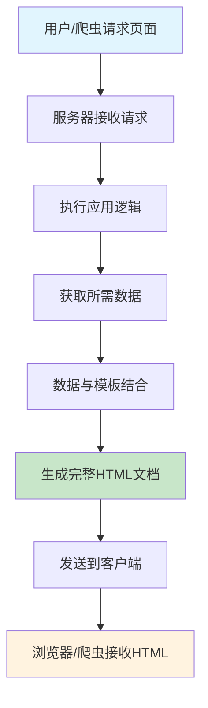

**SSR为SEO带来的核心优势包括：**

#### 🔍 更佳的可抓取性和索引效率

由于SSR直接提供完整的HTML内容，搜索引擎爬虫无需执行JavaScript即可获取页面文本、链接和元数据。这大大降低了爬虫理解页面内容的难度，提高了索引的准确性和完整性。

相比之下，CSR页面初始加载时可能只包含一个空的HTML骨架和大量的JavaScript引用，爬虫需要执行这些脚本才能看到实际内容，这一过程可能耗时且并非所有爬虫都能完美执行。

#### ⚡ 更快的初始页面加载速度（FCP/LCP）

用户和搜索引擎都能更快地看到页面的主要内容，因为浏览器接收到的是已经渲染好的HTML，可以直接进行解析和显示。这显著改善了：

- **首次内容绘制（First Contentful Paint, FCP）**
- **最大内容绘制（Largest Contentful Paint, LCP）**

这些核心Web指标是Google等搜索引擎排名算法的重要考量因素。

#### 👥 改善用户体验

更快的加载速度不仅有利于SEO，也直接提升了用户体验，降低了跳出率，增加了用户停留时间和互动，这些积极的用户行为信号也可能间接促进SEO表现。

> [!NOTE]
> 尽管Google等现代搜索引擎在执行JavaScript方面的能力已显著增强，能够处理部分CSR内容，但SSR依然是确保内容被可靠、即时抓取和索引的首选方案。

SSR与CSR的对比如下：

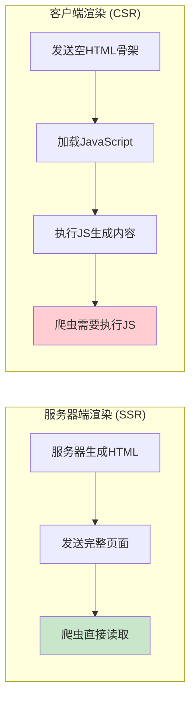

---

## 2. SSR项目中核心的页面SEO策略

在SSR项目中，除了SSR本身带来的SEO优势外，还需要细致地实施各项页面SEO策略，以确保每个页面都能最大限度地发挥其SEO潜力。

### 2.1. 动态元数据管理

元数据，如页面标题（title）、描述（description）和Open Graph标签（用于社交媒体分享），对于搜索引擎理解页面内容和吸引用户点击至关重要。在SSR应用中，为每个页面动态生成独特且相关的元数据是一项核心SEO任务。

#### 📝 关键元数据类型

| 元数据类型 | 作用 | 重要性 |
|-----------|------|--------|
| `<title>` 标签 | 准确概括页面核心内容，包含目标关键词 | ⭐⭐⭐⭐⭐ |
| `<meta name="description">` | 提供页面简明摘要，影响点击率 | ⭐⭐⭐⭐ |
| Open Graph 标签 | 社交媒体分享时的展示格式 | ⭐⭐⭐ |
| Canonical URL | 避免重复内容，指定规范URL | ⭐⭐⭐⭐ |

#### 💻 在Next.js中实现动态元数据

Next.js 提供了强大的元数据API，允许开发者为每个页面动态生成元数据。通过在 `layout.js` 或 `page.js` 文件中导出 `generateMetadata` 函数，可以异步获取数据并返回包含标题、描述等信息的 Metadata 对象。

**示例：为动态博客文章页面生成元数据**

```typescript
// app/blog/[slug]/page.tsx
import type { Metadata, ResolvingMetadata } from 'next';

type Props = {
  params: { slug: string };
  searchParams: { [key: string]: string | string[] | undefined };
};

export async function generateMetadata(
  { params, searchParams }: Props,
  parent: ResolvingMetadata
): Promise<Metadata> {
  const slug = params.slug;
  // 假设有一个获取文章数据的函数 getPostBySlug
  const post = await getPostBySlug(slug);

  if (!post) {
    return {
      title: 'Post Not Found',
    };
  }

  return {
    title: post.title,
    description: post.summary,
    alternates: { // 动态设置canonical URL
      canonical: `/blog/${post.slug}`,
    },
    openGraph: {
      title: post.title,
      description: post.summary,
      images: [post.imageUrl || '/default-og-image.jpg'],
    },
  };
}

export default async function Page({ params }: Props) {
  const post = await getPostBySlug(params.slug);
  //... 页面组件渲染
  return <div>{post.content}</div>;
}
```

> [!TIP]
> 这段代码展示了如何根据动态路由参数 `slug` 获取特定文章的数据，并用这些数据填充标题、描述、规范链接以及Open Graph标签。Next.js的元数据API还支持模板化标题和默认值，提供了灵活的元数据管理方案。

### 2.2. 结构化数据 (JSON-LD) 的实现与验证

**结构化数据（Structured Data）**是一种标准化的格式，用于向搜索引擎提供关于页面内容的明确信息，帮助搜索引擎更好地理解页面主题，并可能以富媒体搜索结果（Rich Results）的形式展示。

#### 🎯 结构化数据的优势

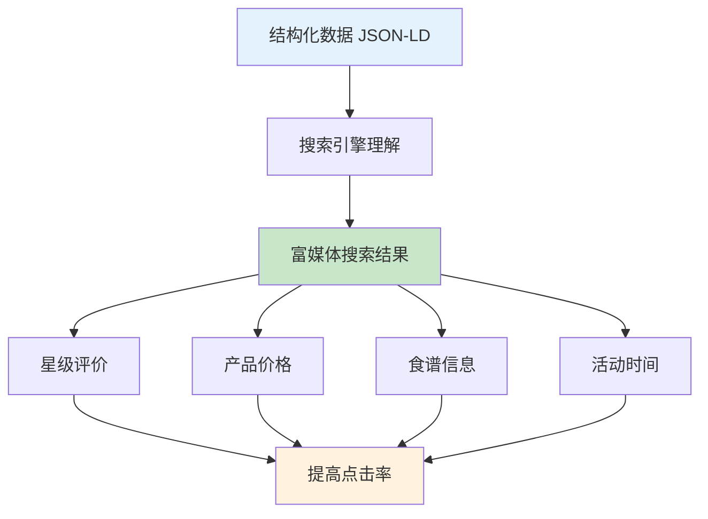

#### 💻 Next.js中实现动态JSON-LD

JSON-LD是Google推荐的实现结构化数据的方式。在SSR应用中，JSON-LD数据应该在服务器端生成并嵌入到HTML的 `<script type="application/ld+json">` 标签中。

**示例：为产品页面添加产品结构化数据**

```typescript
// app/products/[id]/page.tsx
import { getProductById } from '@/app/lib/data'; // 假设的获取产品数据的函数

export default async function ProductPage({ params }: { params: { id: string } }) {
  const product = await getProductById(params.id);

  if (!product) return <div>Product not found</div>;

  const jsonLd = {
    '@context': 'https://schema.org',
    '@type': 'Product',
    name: product.name,
    image: product.imageUrl,
    description: product.description,
    sku: product.sku,
    offers: {
      '@type': 'Offer',
      priceCurrency: product.currency,
      price: product.price,
      availability: product.inStock ? 'https://schema.org/InStock' : 'https://schema.org/OutOfStock',
      url: `https://yourdomain.com/products/${product.id}`,
    },
  };

  return (
    <section>
      <h1>{product.name}</h1>
      {/* 其他产品信息 */}
      <script
        type="application/ld+json"
        dangerouslySetInnerHTML={{ __html: JSON.stringify(jsonLd).replace(/</g, '\\u003c') }}
      />
    </section>
  );
}
```

> [!WARNING]
> 注意 `JSON.stringify(jsonLd).replace(/</g, '\\u003c')` 的使用是为了防止XSS注入，通过将 `<` 替换为其Unicode等效项 `\u003c` 来确保安全。

### 2.3. SEO友好的URL结构与slug设计

清晰、语义化且一致的URL结构对用户和搜索引擎都非常重要。

#### 🎯 URL设计原则

| 原则 | 说明 | 示例 |
|------|------|------|
| **语义化** | 使用描述性词语，而不是无意义的ID | ✅ `/blog/my-awesome-post` <br> ❌ `/blog?id=123` |
| **一致性** | 遵循逻辑和一致的模式 | `/products/product-name` |
| **关键词** | 合理使用关键词帮助搜索引擎理解 | `/seo-optimization-guide` |
| **简洁性** | 避免过多参数和冗长URL | ❌ `/blog?category=tech&tag=seo&sort=date` |

#### 💻 Next.js中的动态路由与slug

Next.js通过文件系统路由支持动态路由，允许创建SEO友好的slug：

```
pages/blog/[slug].js  (Pages Router)
app/blog/[slug]/page.js  (App Router)
```

**生成slug时的最佳实践：**

```typescript
// 示例：将标题转换为SEO友好的slug
function generateSlug(title: string): string {
  return title
    .toLowerCase()
    .replace(/[^a-z0-9 -]/g, '') // 移除特殊字符
    .replace(/\s+/g, '-')        // 空格替换为连字符
    .replace(/-+/g, '-')         // 多个连字符合并为一个
    .trim();
}

// "My Awesome Blog Post!" → "my-awesome-blog-post"
```

### 2.4. 使用 next/image 组件优化图片SEO

图片是网页内容的重要组成部分，但未经优化的图片会严重影响页面加载速度和用户体验，进而损害SEO。

#### 🖼️ next/image 的SEO优势

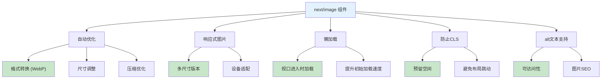

#### 💻 使用示例

```javascript
import Image from 'next/image';

function MyPage() {
  return (
    <div>
      <Image
        src="/images/my-image.jpg" // 本地图片路径 (public目录下)
        alt="一张描述性的图片替代文本"
        width={800}
        height={600}
        priority // 对于LCP图片，添加priority属性以优先加载
      />
    </div>
  );
}
```

> [!TIP]
> `next/image` 组件不仅仅是一个简单的图片标签替代品，它是一个全面的图片优化解决方案，直接解决了多个与图片相关的SEO痛点。开发者仍需承担提供高质量、描述性alt文本的责任。

---

## 3. SSR环境下的技术SEO要点

除了核心的页面SEO元素，SSR项目还需要关注一些技术层面的SEO配置，以确保搜索引擎能够高效、全面地抓取和理解网站。

### 3.1. 动态 sitemap.xml 生成与提交

**站点地图（sitemap.xml）**是一个XML文件，列出了网站上希望搜索引擎抓取的所有重要URL。对于内容频繁更新或包含大量页面的SSR应用，动态生成站点地图至关重要。

#### 🎯 为何需要动态站点地图

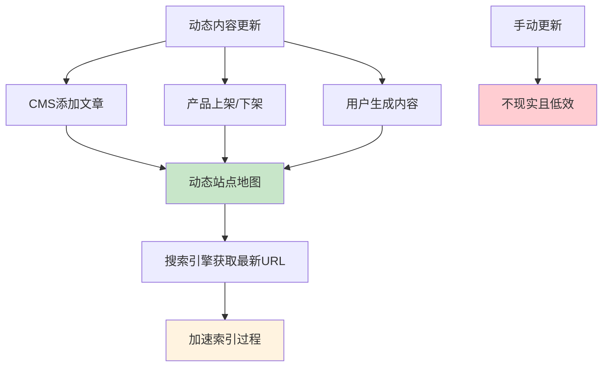

#### 💻 Next.js App Router 中动态生成 sitemap.xml

```typescript
// app/sitemap.ts
import { MetadataRoute } from 'next';
import { getAllPublishedPosts, getAllProducts } from '@/app/lib/api'; // 假设的API函数

export default async function sitemap(): Promise<MetadataRoute.Sitemap> {
  const baseUrl = process.env.NEXT_PUBLIC_BASE_URL || 'https://yourdomain.com';

  const posts = await getAllPublishedPosts();
  const products = await getAllProducts();

  const postUrls = posts.map((post) => ({
    url: `${baseUrl}/blog/${post.slug}`,
    lastModified: new Date(post.updatedAt),
    changeFrequency: 'weekly' as const,
    priority: 0.8,
  }));

  const productUrls = products.map((product) => ({
    url: `${baseUrl}/products/${product.id}`,
    lastModified: new Date(product.updatedAt),
    changeFrequency: 'daily' as const,
    priority: 0.9,
  }));

  return [
    {
      url: baseUrl,
      lastModified: new Date(),
      changeFrequency: 'yearly',
      priority: 1,
    },
    {
      url: `${baseUrl}/about`,
      lastModified: new Date(),
      changeFrequency: 'monthly',
      priority: 0.8,
    },
    ...postUrls,
    ...productUrls,
  ];
}
```

### 3.2. robots.txt 最佳实践

**robots.txt** 文件位于网站根目录，用于告知搜索引擎爬虫哪些URL路径可以抓取，哪些不应抓取。正确配置 robots.txt 对于管理抓取预算和防止索引不必要的内容至关重要。

#### 📝 基本语法

| 指令 | 作用 | 示例 |
|------|------|------|
| `User-agent` | 指定针对哪个爬虫的规则 | `User-agent: *` (所有爬虫) |
| `Disallow` | 禁止抓取的路径 | `Disallow: /admin/` |
| `Allow` | 允许抓取的路径 | `Allow: /api/public-data/` |
| `Sitemap` | 指向站点地图文件的URL | `Sitemap: https://example.com/sitemap.xml` |

#### 💻 SSR项目 robots.txt 示例

```txt
User-agent: *
Disallow: /admin/
Disallow: /api/ # 示例：如果内部API是基于路径的
Disallow: /private/
Disallow: /tmp/
Allow: / # 默认允许所有其他内容 (通常是隐式的)
Allow: /api/public-data/ # 示例：允许抓取某个公共API端点

User-agent: Googlebot
Disallow: /google-specific-temp-dir/ # 示例：针对Googlebot的特定规则

Sitemap: https://www.your-domain.com/sitemap.xml
```

> [!WARNING]
> robots.txt 文件是给"友好"爬虫的指令，它并不能阻止恶意爬虫访问被禁止的URL。对于处理敏感数据或拥有私有区域的SSR应用，robots.txt 应与服务器端的适当身份验证和授权机制相结合。

---

## 4. 性能：SSR SEO的支柱

网站性能，特别是**核心Web指标（Core Web Vitals）**，是Google排名的重要因素，也是用户体验的关键。SSR本身有助于提升某些性能指标，但仍需进一步优化。

### 4.1. 优化核心Web指标 (LCP, INP, CLS)

核心Web指标是Google用于衡量用户体验的一组特定指标：

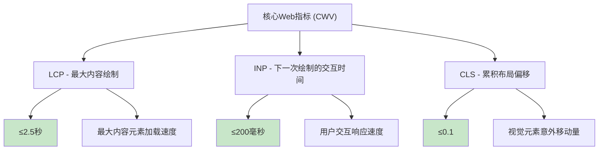

#### 📊 SSR项目的核心Web指标优化

| 核心Web指标 (CWV) | Google建议基准 | SSR的典型影响 | SSR特定优化技术 |
|-------------------|----------------|---------------|----------------|
| **最大内容绘制 (LCP)** | ≤2.5s | 通常积极（预渲染内容） | 使用 `next/image` 并为LCP元素设置 `priority`；服务器端缓存；CDN；优化关键资源加载；减少服务器响应时间 |
| **下一次绘制的交互时间 (INP)** | ≤200ms | 可能面临挑战（取决于注水效率和JS负载） | 高效的注水策略；代码分割关键JS；延迟加载非关键JS；优化事件处理程序；减少第三方脚本；平衡客户端与服务器逻辑 |
| **累积布局偏移 (CLS)** | ≤0.1 | 通常积极（若正确处理占位符和图片尺寸） | 使用 `next/image` 并明确定义 `width` 和 `height`；为动态内容或广告预留空间；避免在加载期间插入内容导致布局移动 |

#### 🎯 SSR环境下的CWV优化策略

**LCP优化：**
- ✅ 优化图片：使用 `next/image` 并为LCP元素添加 `priority` 属性
- ✅ 优先加载关键资源：使用 `fetchpriority="high"`
- ✅ 减少服务器响应时间：实施有效的缓存策略，使用CDN
- ✅ 消除渲染阻塞资源：压缩JavaScript，异步加载非必要脚本

**INP优化：**
- ✅ 优化JavaScript执行：代码分割（如使用 `React.lazy` 和 `Suspense`），摇树优化（tree shaking）
- ✅ 减少第三方脚本影响：评估并移除不必要的第三方脚本，或延迟加载它们
- ✅ 确保事件处理程序轻量级且非阻塞
- ✅ 对非必要组件使用懒加载

**CLS优化：**
- ✅ 为图片和视频设置明确的 `width` 和 `height` 属性
- ✅ 为广告或动态插入的内容预留空间
- ✅ 避免使用非合成动画导致布局变化

### 4.2. SSR的高效缓存策略

由于SSR可能对服务器造成较大压力（每个请求都需要在服务器端渲染），因此高效的缓存策略对于提升性能、降低服务器负载和增强可伸缩性至关重要。

#### 🎯 缓存策略架构

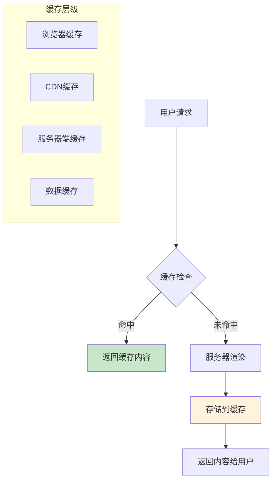

#### 📋 缓存类型与策略

| 缓存类型 | 作用 | 适用场景 | TTL建议 |
|----------|------|----------|---------|
| **服务器端缓存/全页缓存** | 存储完整的HTML输出 | 静态内容页面 | 1-24小时 |
| **数据缓存** | 缓存数据库查询或API调用结果 | 频繁查询的数据 | 5-60分钟 |
| **CDN缓存** | 从边缘节点提供缓存页面 | 全球用户访问 | 1-7天 |
| **浏览器缓存** | 客户端静态资源缓存 | CSS、JS、图片 | 30天-1年 |

---

## 5. 为SEO选择合适的渲染策略

虽然本文聚焦于SSR，但理解SSR、静态站点生成（SSG）和增量静态再生（ISR）之间的差异及其对SEO的各自影响，对于制定全面的优化策略至关重要。

### 5.1. SSR vs. SSG vs. ISR: SEO对比分析

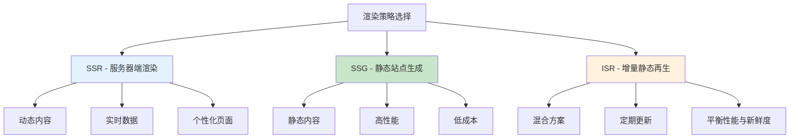

#### 📊 渲染策略对比表

| 渲染策略 | 主要SEO优势 | 主要SEO考量/挑战 | SEO理想用例 |
|----------|-------------|------------------|-------------|
| **服务器端渲染 (SSR)** | 对动态、频繁变化的内容SEO极佳；每次请求提供最新内容；利于索引 | 服务器负载较高；若客户端JS过重，TTI可能较长 | 动态定价/库存的电商网站；用户定制的仪表盘；更新非常频繁且需绝对新鲜度的新闻网站 |
| **静态站点生成 (SSG)** | 加载速度极快（利于LCP和用户体验）；高度SEO友好（预渲染HTML）；服务器成本低 | 不适用于实时或频繁更新的数据（内容静态直至下次构建）；大型网站构建时间可能较长 | 博客；作品集；文档站点；内容不常变化的市场营销网站 |
| **增量静态再生 (ISR)** | 结合SSG的优势（速度、SEO）与定期更新内容的能力（无需完全重建）；适用于需兼顾速度和相对新鲜度的网站 | 在两次重新验证之间仍可能提供短暂的过时数据；基础设施比SSG复杂 | 电商产品列表页；更新频率中等的新闻网站；希望比完整SSG更快构建的小幅更新博客 |

> [!TIP]
> 现代框架如Next.js允许按页面配置渲染策略。最佳SEO策略并非为整个站点选择单一渲染方法，而是为应用中每种类型的内容或部分策略性地应用最佳方法。

---

## 6. SSR项目必备的SEO审计与监控工具

实施了上述策略后，持续的审计和监控对于维持和提升SEO效果至关重要。

### 6.1. Google Search Console (GSC)

#### 🎯 核心功能

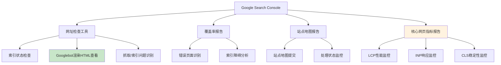

#### 📋 SSR关键功能

| 功能 | 作用 | 对SSR的重要性 |
|------|------|---------------|
| **网址检查工具** | 检查特定URL是否已编入索引，查看Googlebot渲染的HTML | ⭐⭐⭐⭐⭐ 验证SSR输出的关键工具 |
| **覆盖率报告** | 识别存在错误或警告并妨碍索引的网页 | ⭐⭐⭐⭐ 发现SSR页面的索引问题 |
| **站点地图报告** | 提交站点地图并检查其处理状态 | ⭐⭐⭐⭐ 确保动态生成的站点地图正常工作 |
| **核心网页指标报告** | 监控网站在LCP、INP、CLS方面的表现 | ⭐⭐⭐⭐⭐ 跟踪SSR性能优化效果 |

### 6.2. Lighthouse

#### 🎯 审计类别

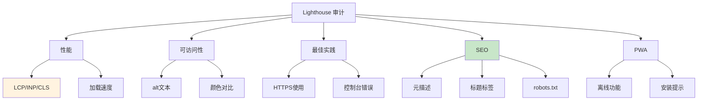

#### 💻 运行方式

- **Chrome DevTools**：F12 → Lighthouse 标签
- **命令行**：`npm install -g lighthouse`
- **Node模块**：集成到CI/CD流程
- **PageSpeed Insights**：在线版本

### 6.3. 其他实用工具

#### 🛠️ 工具清单

| 工具 | 主要功能 | 适用场景 |
|------|----------|----------|
| **Screaming Frog SEO Spider** | 网站抓取、链接分析、元数据检查 | 技术SEO审计 |
| **浏览器开发者工具** | 网络分析、源代码查看 | SSR验证 |
| **Schema Markup Validator** | 结构化数据验证 | JSON-LD验证 |
| **Rich Results Test** | 富媒体搜索结果测试 | 结构化数据效果验证 |

---

## 7. 结论：整合SSR与SEO以实现最大化影响

服务器端渲染为前端项目实现卓越的SEO表现奠定了坚实的技术基础。通过确保搜索引擎能够轻松抓取和索引内容、提升页面加载速度和改善用户体验，SSR本身就是一项强大的SEO策略。

### 🎯 关键策略回顾

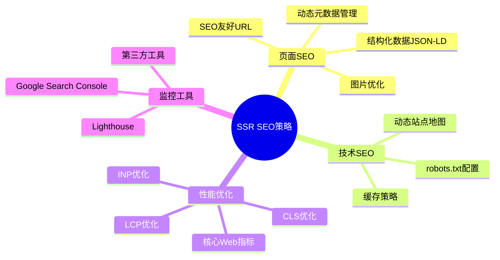

### ✅ 核心要点总结

1. **动态且全面的元数据管理**是基础
2. **准确的结构化数据 (JSON-LD)**能显著提升搜索结果的丰富度
3. **SEO友好的URL和图片优化**不可或缺
4. **动态站点地图和精心配置的 robots.txt**指导爬虫高效工作
5. **持续优化核心Web指标**和实施高效缓存策略是性能的保证
6. **根据内容特性选择最合适的渲染组合** (SSR, SSG, ISR)

### 🚀 未来展望与持续优化

> [!NOTE]
> 数字环境、搜索引擎算法和Web技术（包括SSR框架本身）都在不断发展。因此，SSR项目的SEO并非一次性设置完成即可。

**持续优化要求：**

- **持续学习与适应**：紧跟搜索引擎算法更新和新兴的最佳实践
- **不间断的监控**：利用GSC、Lighthouse等工具持续追踪性能和SEO指标
- **用户体验优先**：始终将用户体验与技术SEO并重

### 🤝 跨职能团队协作

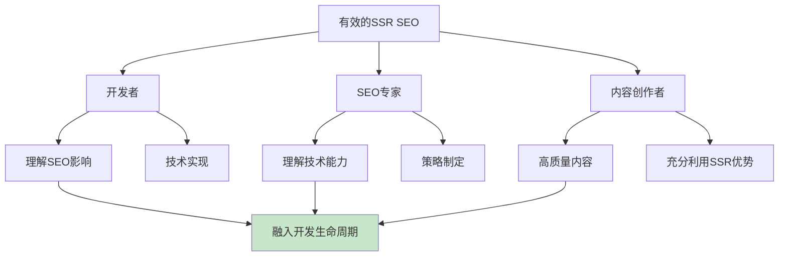

最终，将SSR与全面的SEO策略相结合，能够赋能开发者和营销人员创建出不仅快速、动态，而且在搜索引擎中具有高度可见性和商业成功的Web应用。这是一个持续投入、不断优化的过程，但其回报——更高的自然流量、更强的品牌影响力和更好的用户参与度——无疑是值得的。

---

> [!TIP]
> **最后提醒**：SSR与SEO之间存在一种共生关系：SSR提供了技术可能性，而持续的SEO最佳实践则在此基础上构建，将可能性转化为实际的搜索排名和流量。

**开始你的SSR SEO优化之旅吧！** 🚀