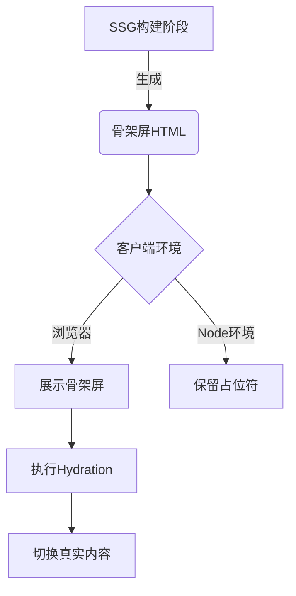

# SSG骨架屏

流程：首屏加载骨架屏，等待接口请求完成后展示真实DOM

## 构建时渲染 SSG

构建时渲染，简称 **SSG (Static Site Generation)**，是指在构建时提前生成内容 HTML 的渲染模式，每次访问直接把html返回给客户端，相当于一个静态资源。


## 骨架屏

> 开启ssg时，在服务端执行时会生成带骨架屏的html，所以html解析完毕就会展示骨架屏，避免了首屏白屏现象，执行副作用时说明已经到了客户端，故可通过 `setLoading`来关闭骨架屏，展示真实DOM 。

### 如何将骨架屏和真实DOM隔离开？



<div class="tip">
⚠️ 注意：环境判断逻辑需要在SSG构建阶段和客户端运行时保持一致性
</div>

可通过`isClient`或着` import.meta.renderer === 'server'`判断所处环境，从而区分出真实DOM和骨架屏


```tsx
// 核心高阶组件实现
import React, { 
  useState, 
  ComponentType, 
  ReactNode, 
  useEffect 
} from 'react';
import { windVaneBase, isTaobaoJP } from '@ali/odin-jp-api';
import Skeleton from './base-skeleton.js';

interface WithSkeletonProps {
  setLoading: React.Dispatch<React.SetStateAction<boolean>>;
  loading?: boolean;
}

type ComponentOrFunctionType = ComponentType<WithSkeletonProps>;

interface HOCProps {
  skeletonComp?: ReactNode;
}

// ======================
// 默认骨架屏配置
// ======================
const normalSkeleton: ReactNode = <Skeleton />;

// 骨架屏包装器
const SkeletonWrap = (
  ComponentOrFunction: ComponentOrFunctionType & HOCProps
) => {
  // 老版本的
  return () => {
    const [loading, setLoading] = useState<boolean>(true);
    const [isClient, setIsClient] = useState<boolean>(false);

    // 子组件
    const Component = ComponentOrFunction as ComponentType<WithSkeletonProps>;
    // 自定义骨架图
    const customSkeleton: ReactNode = ComponentOrFunction?.skeletonComp;
    const childComp: ReactNode = (
      <Component
        setLoading={(v: boolean) => {
          try {
            if (!v && isTaobaoJP) {
              windVaneBase('WVNative', 'closeWebLoading');
            }
            setLoading(v);
          } catch (error) { }
        }} />
    );

    // hide real content
    const skelonStyle = { display: loading ? 'inline' : 'none' };
    const childStyle = { display: loading ? 'none' : 'inline' };

    useEffect(() => {
      setIsClient(true);
    }, []);

    return (
      <>
        <span style={skelonStyle}>
          { customSkeleton || normalSkeleton }
        </span>
        {
          isClient &&
          (
            // @ts-ignore
            import.meta.renderer === 'server'
            ? null
            : <span style={childStyle}>{ childComp }</span>
          )
        }
      </>
    );
  };
};
export default SkeletonWrap;
```

### node环境下如何访问客户端环境变量(ssgShimPlugin)

本质上ssg和ssr是同一种模式，在node环境下执行，生成html，再到客户端进行水合。

故业务代码中在node环境访问window&document等客户端环境变量时，会导致编译失败。

解决方案有两种：

1. 在node环境下，通过`import.meta.renderer`判断所处环境，从而避免直接访问客户端环境变量，等待在客户端二次执行时再访问
2. 既然node环境没有window&document等客户端环境变量，那么可通过配置插件的形式，在global中注入window&document等客户端环境变量

基于方案2生成`ssgShimPlugin`

```ts
// @ts-nocheck
import { fileURLToPath } from 'url';
import path from 'path';

// 获得当前文件的路径和目录
const __filename = fileURLToPath(import.meta.url);
const __dirname = path.dirname(__filename);

export default () => ({
  name: 'ssg-shim',
  // 构建阶段空操作
  setup: ({ onHook }) => {},
  // 运行时注入Shim配置
  runtime: path.resolve(`${__dirname}/ssg_shim_config.js`),
});
```

```ts
// @ts-nocheck

if (import.meta.renderer === 'server') {
  // 模拟浏览器全局对象
  global.lib = {
    mtop: {
      request: () => Promise.resolve(),
      config: {},
    },
  };
  global.AESPluginAPI = () => {},
  global.AESPluginPV = () => {},
  global.AESPluginPerf = () => {},
  global.AESPluginJSError = () => {},
  global.AESPluginAutolog = () => {},
  global.AESPluginEvent = () => {},
  global.goldlog_queue = [],
  global.AES = function () {
    return { use: function () {
      return {
        hookMtopRequest: () => { return Promise.resolve(); },
      };
    } };
  },
  global.URL = class {
    constructor(input) {
      this.href = input;
    }
    searchParams = {
      get: () => {},
    };
  },
  global.location = {
    href: 'https://foo.bar',
    search: '?foo=bar',
    host: 'localhost',
    hostname: 'localhost',
    pathname: '/',
  };
  global.document = {
    referrer: '',
    cookie: '',
    getElementsByName: function () {
      return [{ appendChild: function () {} }];
    },
    getElementsByTagName: function () {
      return [{ appendChild: function () {} }];
    },
    createElement: function () {
        return {};
    },
    querySelector: () => {
      return {
        getAttribute: () => {},
      };
    },
    addEventListener: () => {},
    documentElement: {
      style: {},
    },
    body: {
      style: {},
      appendChild: () => {},
      getAttribute: () => {},
    },
  };
  global.navigator = {
    userAgent: 'nodejs',
  };
  global.IntersectionObserver = function () {
    return {
      observe: () => {},
      unobserve: () => {},
    };
  };
  global.screen = {
    width: 1920,
    height: 1080,
    availHeight: 0,
    availWidth: 0,
    colorDepth: 0,
    pixelDepth: 0,
  };
  global.window = {
    addEventListener: () => {},
    screen,
    location,
    document,
    navigator,
    localStorage: {
      setItem: () => { },
      removeItem: () => { },
      getItem: () => { return null; },
    },
    ...global,
  };
  global.self = global.window;
}

export default () => {

};

```

## 最佳实践

### 配置SSG构建

<div class="warn">
❗ 确保Node版本 > 14.0 且 ice.js版本 > 3.0
</div>

```ts
// ....ssgShimPlugin为ssg渲染页面的垫片
import ssgShimPlugin from '@ali/jp-plugins/ssg-shim';
// ...

export default defineConfig(() => ({
  // ...
  ssg: process.env.NODE_ENV === 'production',
  plugins: [
    // ...
    ssgShimPlugin(),
    // ...
  ],
  // ...
}));
```

### 2. 修改页面入口文件

```tsx
// 一般是src/pages/**/index.tsx
// ...
const Container = () => {
  return <div />;
};
export default Container;

// 👇👇👇【普通页面】修改为👇👇👇
import SkelonWrap from '@ali/jp-plugins/skeleton-wrap';
const Container = () => {
  return <div />;
};
export default SkelonWrap(Container);
```


### 3. 如何控制骨架图的展示

```ts
 // 被SkelonWrap包裹的组件，会通过props获得 setLoading: (p: boolean) => void 函数
 // ...
 const Container = ({ setLoading }) => {
    return (<div />)
  }
 useEffect(() => {
  // 关闭骨架图
  setLoading(false)
 }, [])
 // ...
```
### 4. 如何自定义骨架

```ts
// 在你的入口组件中 追加属性skeletonComp: ReactNode
// ...
const Container = ({ setLoading }) => {
  // ...
}
Container.skeletonComp = <div>我是自定义的骨架图</div>;
// ...
```