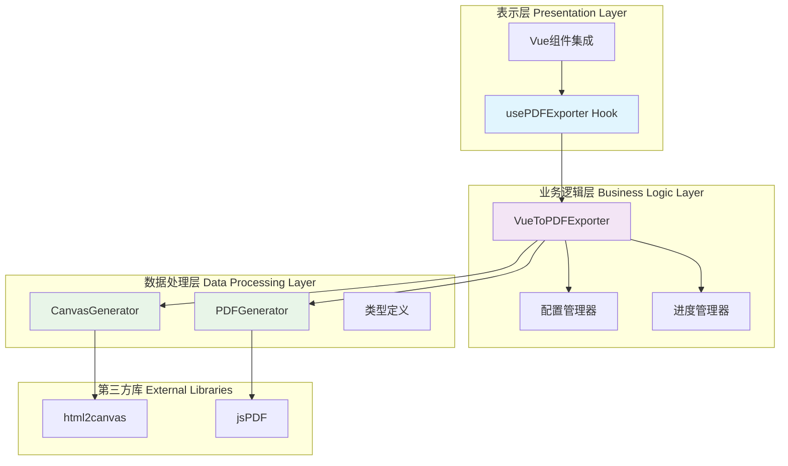
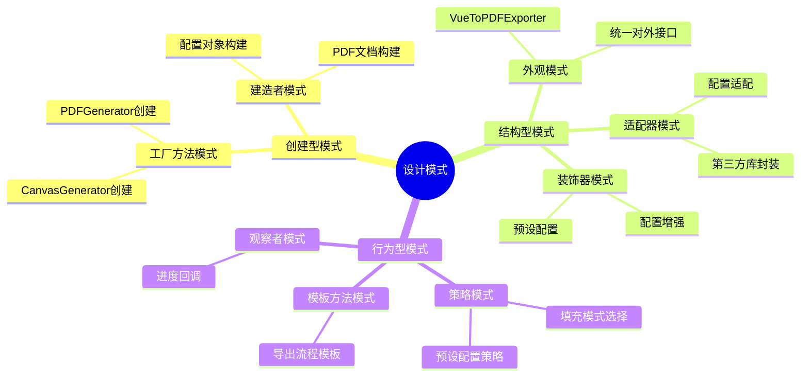
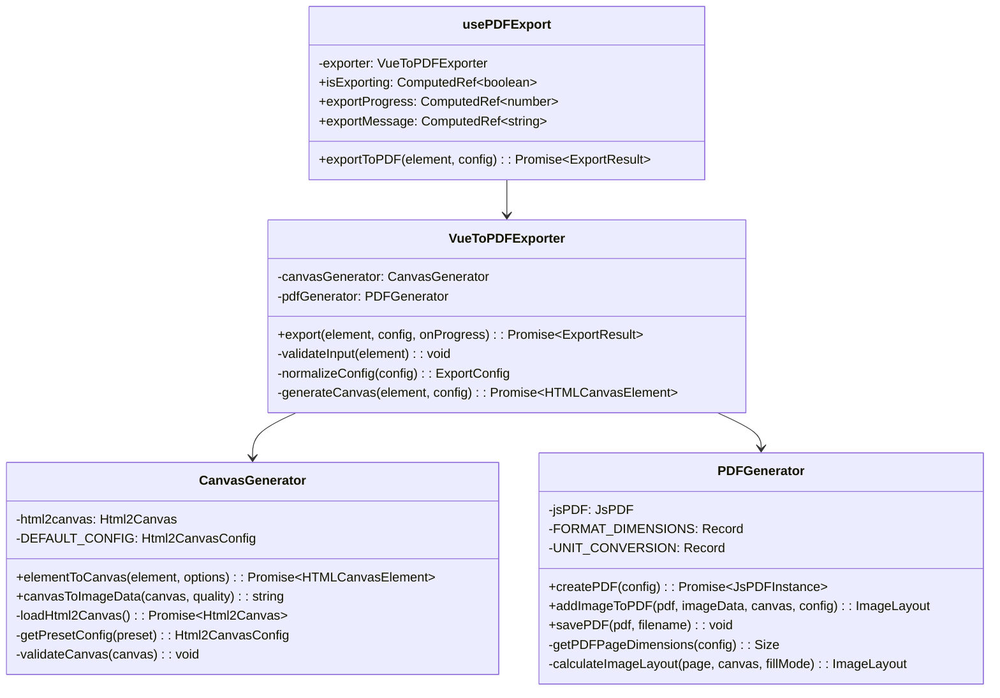
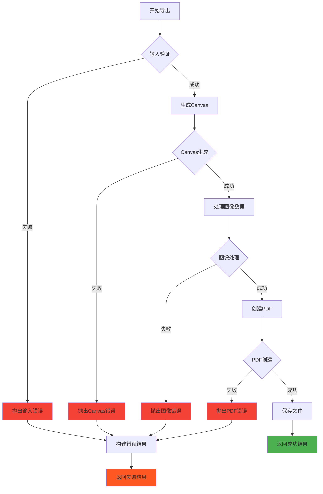
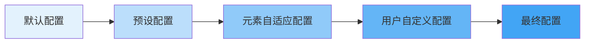
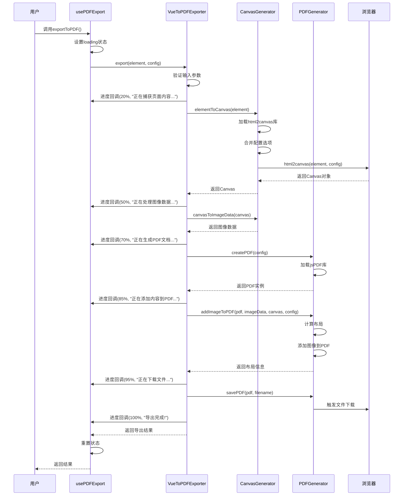
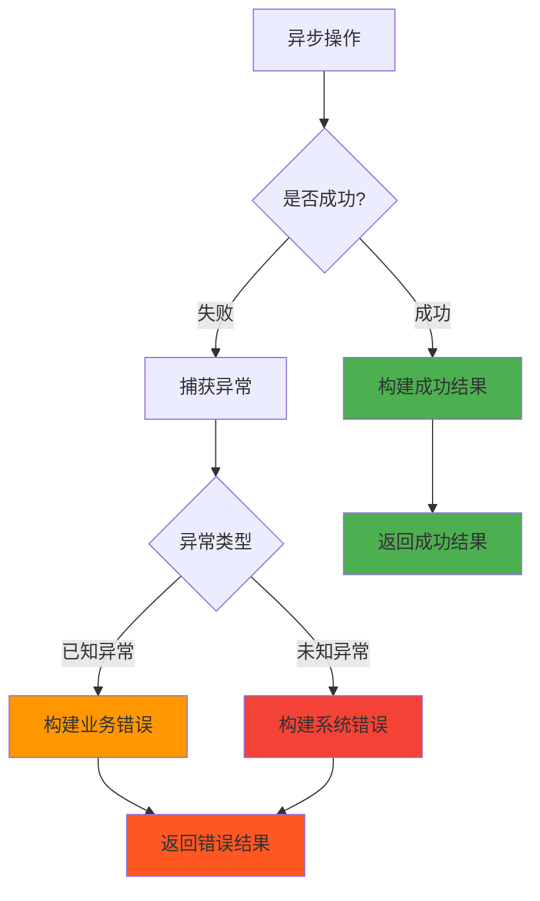
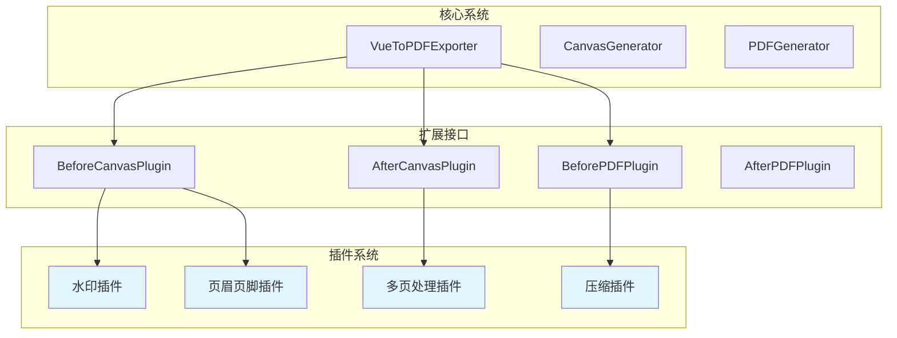
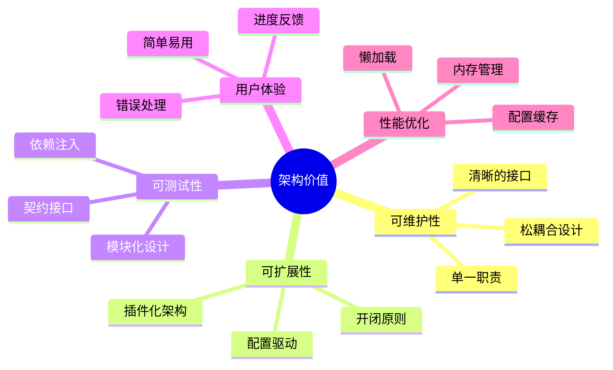

# Vue组件PDF导出工具封装实践

> 记录在业务开发中封装PDF导出工具的完整过程，从需求分析到架构设计，再到具体实现的软件工程实践

## 📋 目录

- [项目背景与需求分析](#项目背景与需求分析)
- [架构设计思路](#架构设计思路)
- [设计模式应用](#设计模式应用)
- [封装实现过程](#封装实现过程)
- [具体实现](#具体实现)
- [使用示例](#使用示例)
- [性能优化](#性能优化)
- [总结与反思](#总结与反思)

## 🎯 项目背景与需求分析

在业务开发过程中，我遇到了一个常见但复杂的需求：将Vue组件渲染的内容导出为PDF文件。经过需求分析，我总结出以下核心要求：

### 功能需求

- ✅ 支持任意Vue组件或DOM元素导出为PDF
- ✅ 支持多种页面格式（A4、A3、Letter、自定义）
- ✅ 支持横向和纵向布局
- ✅ 支持多种图片填充模式（适应、覆盖、拉伸）
- ✅ 支持自定义边距和质量设置
- ✅ 提供导出进度反馈
- ✅ 支持TypeScript类型安全

### 非功能需求

- 🔧 易于使用和集成
- 🚀 良好的性能表现
- 🛡️ 错误处理和异常恢复
- 📦 模块化和可扩展性
- 🎨 支持自定义配置

## 🏗️ 架构设计思路

基于软件工程的**分层架构**和**单一职责原则**，我设计了一个三层架构：



### 设计原则

1. **单一职责原则**：每个类只负责一个特定功能
2. **开闭原则**：对扩展开放，对修改封闭
3. **依赖倒置原则**：依赖抽象而非具体实现
4. **接口隔离原则**：使用最小化接口
5. **组合优于继承**：通过组合实现功能复用

## 🎨 设计模式应用

在封装过程中，我应用了多种设计模式来解决不同的设计问题：



### 1. 外观模式 (Facade Pattern)

`VueToPDFExporter`作为外观类，隐藏了复杂的内部实现：

```typescript
// 外观模式 - 提供简化的统一接口
export class VueToPDFExporter {
    private readonly canvasGenerator = new CanvasGenerator();
    private readonly pdfGenerator = new PDFGenerator();
    
    async export(element, config, onProgress) {
        // 隐藏复杂的内部协调逻辑
        // 用户只需要调用一个方法
    }
}
```

### 2. 策略模式 (Strategy Pattern)

通过枚举定义不同的填充策略：

```typescript
export enum FillMode {
    FIT = 'fit',        // 适应策略
    COVER = 'cover',    // 覆盖策略  
    STRETCH = 'stretch' // 拉伸策略
}
```

### 3. 工厂方法模式 (Factory Method Pattern)

`CanvasGenerator`中的预设配置工厂：

```typescript
private getPresetConfig(preset: CanvasPreset): Html2CanvasConfig {
    switch (preset) {
        case CanvasPreset.HIGH_QUALITY:
            return { ...CanvasGenerator.HIGH_QUALITY_CONFIG };
        case CanvasPreset.PERFORMANCE:
            return { ...CanvasGenerator.PERFORMANCE_CONFIG };
        default:
            return { ...CanvasGenerator.DEFAULT_CONFIG };
    }
}
```

## 🔧 封装实现过程

### 第一步：需求分析与接口设计

我首先思考的是如何抽象这个复杂的导出过程。通过分析，我发现PDF导出本质上是一个**数据转换管道**：


基于这个理解，我设计了类型系统来约束整个流程：

```ts
import type html2canvas from 'html2canvas';
import type { jsPDF, jsPDFOptions } from 'jspdf';

export type PageOrientation = 'portrait' | 'landscape';
export type PageFormat = 'a4' | 'a3' | 'letter' | 'custom';
export type SizeUnit = 'pt' | 'mm' | 'px';

export enum FillMode {
    FIT = 'fit', // 适应模式：保持比例，完全显示，可能有空白
    COVER = 'cover', // 覆盖模式：保持比例，铺满页面，可能裁剪
    STRETCH = 'stretch', // 拉伸模式：完全铺满，可能变形
}

export enum CanvasPreset {
    DEFAULT = 'default',
    HIGH_QUALITY = 'high-quality',
    PERFORMANCE = 'performance',
}

export interface Size {
    readonly width: number;
    readonly height: number;
}

export interface Position {
    readonly x: number;
    readonly y: number;
}

export interface Rect extends Size, Position {}

export interface Margins {
    top?: number;
    right?: number;
    bottom?: number;
    left?: number;
}

export interface SizeWithUnit extends Size {
    unit?: SizeUnit;
}

//  第三方库类型
export type Html2Canvas = typeof html2canvas;
export type JsPDF = typeof jsPDF;
export type JsPDFInstance = InstanceType<JsPDF>;
export type JsPDFOptions = jsPDFOptions;
export type Html2CanvasConfig = Parameters<typeof html2canvas>[1];
export type CanvasConfig = Html2CanvasConfig & { preset?: CanvasPreset };

//  主要配置接口
export interface ExportConfig {
    filename?: string;
    quality?: number;
    orientation?: PageOrientation;
    format?: PageFormat;
    customSize?: SizeWithUnit;
    fillMode?: FillMode;
    margins?: Margins;
    html2canvasOptions?: CanvasConfig;
    jsPDFOptions?: Partial<JsPDFOptions>;
}

//  图片布局计算结果
export interface ImageLayout extends Rect {
    readonly pageWidth: number;
    readonly pageHeight: number;
    readonly canvasWidth: number;
    readonly canvasHeight: number;
    readonly finalWidth: number;
    readonly finalHeight: number;
    readonly fillMode: FillMode;
    readonly scaleRatio: number;
}

//  PDF尺寸配置
export interface PDFDimensions extends Size {
    readonly unit: SizeUnit;
}

//  导出进度
export interface ExportProgress {
    percentage: number;
    message: string;
}

//  导出进度回调
export type ProgressCallback = (progress: ExportProgress) => void;

//  导出结果
export interface ExportResult {
    success: boolean;
    error?: string;
    fileSize?: number;
    processingTime?: number;
    layout?: ImageLayout;
}

```

这些接口的设计遵循了**契约式设计**思想，每个接口都明确定义了输入输出契约。

### 第二步：分层架构设计

根据**分离关注点**原则，我将整个系统分为三个核心组件：



### 第三步：错误处理与异常设计

在软件工程中，**防御性编程**是重要原则。我在每个关键节点都加入了错误处理：



### 第四步：配置系统设计

我采用了**装饰器模式**来处理配置的层层增强：



这种设计让配置既有合理的默认值，又保持高度的可定制性。

### 第五步：Vue集成层设计

为了更好地集成到Vue生态系统中，我设计了响应式的Hook：

```ts
import { ref, computed } from 'vue';
import type { ExportConfig, ExportResult } from '~/utils/pdf/type';
import { VueToPDFExporter } from '~/utils/pdf';

export function usePDFExport() {
    const isExporting = ref(false);
    const exportProgress = ref(0);
    const exportMessage = ref('');
    const lastResult = ref<ExportResult | null>(null);

    const exporter = new VueToPDFExporter();

    const exportToPDF = async (
        element: HTMLElement | (() => HTMLElement),
        config: ExportConfig = {},
    ): Promise<ExportResult> => {
        try {
            isExporting.value = true;

            // 获取目标元素
            const targetElement = typeof element === 'function' ? element() : element;
            if (!targetElement) {
                throw new Error('未找到目标元素');
            }

            // 执行导出
            const result = await exporter.export(targetElement, config, (progress) => {
                exportProgress.value = progress.percentage;
                exportMessage.value = progress.message;
            });

            lastResult.value = result;
            return result;
        } catch (error) {
            const errorResult: ExportResult = {
                success: false,
                error: error.message,
            };
            lastResult.value = errorResult;
            return errorResult;
        } finally {
            isExporting.value = false;
            // 延迟重置进度
            setTimeout(() => {
                exportProgress.value = 0;
                exportMessage.value = '';
            }, 1000);
        }
    };

    return {
        // 状态
        isExporting: computed(() => isExporting.value),
        exportProgress: computed(() => exportProgress.value),
        exportMessage: computed(() => exportMessage.value),
        lastResult: computed(() => lastResult.value),

        // 方法
        exportToPDF,
    };
}

```

## 📊 系统流程图

整个PDF导出的完整流程如下：



## 💡 关键技术决策

### 1. 为什么选择组合而非继承？

在面向对象设计中，我遵循了**组合优于继承**的原则：

```typescript
// ✅ 使用组合
export class VueToPDFExporter {
    private readonly canvasGenerator = new CanvasGenerator();
    private readonly pdfGenerator = new PDFGenerator();
}

// ❌ 避免复杂的继承层次
// class VueToPDFExporter extends BaseExporter extends EventEmitter { ... }
```

**优势分析：**
- 🔸 **灵活性**：可以独立替换或升级组件
- 🔸 **可测试性**：每个组件可以独立测试
- 🔸 **可维护性**：减少类间耦合
- 🔸 **可扩展性**：容易添加新功能

### 2. 异步操作的错误处理策略

我采用了**统一错误处理**模式：



### 3. 配置管理的最佳实践

我使用了**配置合并策略**来处理复杂的配置需求：

```typescript
private mergeConfigs(...configs: Html2CanvasConfig[]): Html2CanvasConfig {
    return configs.reduce((merged, config) => ({ ...merged, ...config }), {});
}
```

这种方式具有以下优势：
- 🎯 **默认值保底**：确保所有配置都有合理默认值
- 🎨 **用户可定制**：允许用户覆盖任何配置
- 🔧 **预设支持**：提供常用场景的预设配置
- 🛡️ **类型安全**：TypeScript确保配置的类型正确性

## 🚀 使用示例

基于以上架构设计，用户可以非常简单地使用这个工具：

### 基础用法

```vue
<template>
  <div>
    <!-- 要导出的内容 -->
    <div ref="contentRef" class="export-content">
      <h1>我的报告</h1>
      <p>这是要导出到PDF的内容...</p>
      <chart-component :data="chartData" />
    </div>
    
    <!-- 导出按钮 -->
    <button 
      @click="handleExport" 
      :disabled="isExporting"
      class="export-btn"
    >
      {{ isExporting ? `导出中 ${exportProgress}%` : '导出PDF' }}
    </button>
    
    <!-- 进度提示 -->
    <div v-if="isExporting" class="progress-info">
      {{ exportMessage }}
    </div>
  </div>
</template>

<script setup>
import { ref } from 'vue'
import { usePDFExport } from '@/composables/usePDFExport'

const contentRef = ref()
const { exportToPDF, isExporting, exportProgress, exportMessage } = usePDFExport()

const handleExport = async () => {
  const result = await exportToPDF(contentRef.value, {
    filename: '我的报告.pdf',
    format: 'a4',
    orientation: 'portrait',
    quality: 0.95,
    margins: { top: 20, right: 20, bottom: 20, left: 20 }
  })
  
  if (result.success) {
    console.log('导出成功！', result)
  } else {
    console.error('导出失败：', result.error)
  }
}
</script>
```

### 高级用法

```vue
<script setup>
const handleAdvancedExport = async () => {
  const result = await exportToPDF(
    () => document.querySelector('.complex-content'),
    {
      filename: '高级报告.pdf',
      format: 'custom',
      customSize: { width: 800, height: 1200, unit: 'px' },
      fillMode: FillMode.COVER,
      html2canvasOptions: {
        preset: CanvasPreset.HIGH_QUALITY,
        scale: 4,
        useCORS: true,
        backgroundColor: '#ffffff'
      },
      jsPDFOptions: {
        compress: true,
        precision: 16
      }
    }
  )
}
</script>
```

## ⚡ 性能优化

### 1. 懒加载第三方库

```typescript
// 动态导入，减少初始包大小
private async loadHtml2Canvas(): Promise<Html2Canvas> {
    if (!this.html2canvas) {
        const module = await import('html2canvas');
        this.html2canvas = module.default;
    }
    return this.html2canvas;
}
```

### 2. 内存管理


### 3. 配置缓存

```typescript
// 缓存预设配置，避免重复计算
private static readonly DEFAULT_CONFIG: Html2CanvasConfig = {
    scale: 3,
    useCORS: true,
    // ...
} as const;
```

## 🧪 测试策略

```mermaid
pyramid
    title 测试金字塔
    
    E2E测试
    集成测试
    单元测试
```

### 单元测试示例

```typescript
describe('PDFGenerator', () => {
  let generator: PDFGenerator;
  
  beforeEach(() => {
    generator = new PDFGenerator();
  });
  
  describe('calculateImageLayout', () => {
    it('should calculate correct layout for FIT mode', () => {
      const pageDimensions = { width: 595, height: 842 };
      const canvasDimensions = { width: 800, height: 600 };
      
      const layout = generator['calculateImageLayout'](
        pageDimensions,
        canvasDimensions,
        FillMode.FIT
      );
      
      expect(layout.scaleRatio).toBeCloseTo(0.744);
      expect(layout.finalWidth).toBeCloseTo(595);
    });
  });
});
```

## 📈 监控与日志

```typescript
private logLayoutInfo(layout: ImageLayout): void {
    console.group('📄 PDF布局信息');
    console.table({
        页面尺寸: `${layout.pageWidth.toFixed(2)} × ${layout.pageHeight.toFixed(2)} pt`,
        Canvas尺寸: `${layout.canvasWidth} × ${layout.canvasHeight} px`,
        最终图片尺寸: `${layout.finalWidth.toFixed(2)} × ${layout.finalHeight.toFixed(2)} pt`,
        位置偏移: `(${layout.x.toFixed(2)}, ${layout.y.toFixed(2)})`,
        缩放比例: layout.scaleRatio.toFixed(3),
        填充模式: layout.fillMode,
    });
    console.groupEnd();
}
```

## 🔄 扩展性设计

### 插件系统架构



## 📚 总结与反思

### 成功经验

1. **分层架构**：清晰的职责划分让代码易于理解和维护
2. **设计模式**：合理运用设计模式解决了复杂性问题
3. **类型安全**：TypeScript确保了代码的健壮性
4. **错误处理**：完善的异常处理提高了用户体验
5. **Vue集成**：响应式Hook让工具更符合Vue生态

### 改进空间

1. **插件系统**：可以设计插件架构支持更多定制需求
2. **批量处理**：支持多个组件批量导出
3. **预览功能**：导出前提供PDF预览
4. **模板系统**：支持PDF模板和样式定制
5. **云端处理**：大文件可以考虑服务端渲染

### 架构价值



通过这次PDF导出工具的封装实践，我深刻体会到**软件工程思想**在实际开发中的重要性。合理的架构设计不仅让代码更加健壮，也为后续的功能扩展和维护奠定了良好基础。

---

**技术栈**：`Vue 3` + `TypeScript` + `html2canvas` + `jsPDF` + `软件工程实践`
