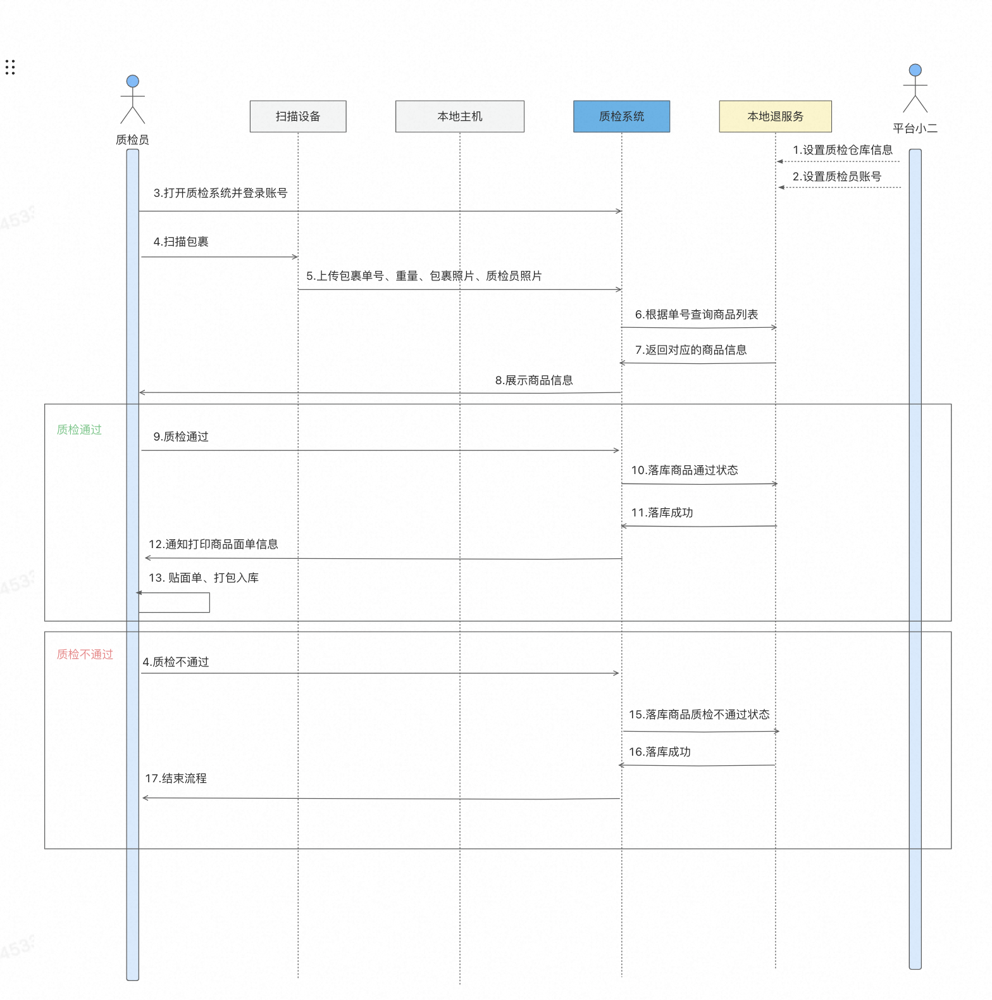

# 本地退

## 质检平台

> 背景：退货仓由第三方公司直接质检和运营。 目前现状退货仓为菜鸟仓，菜鸟仓的工作人员并非专业从事质检和验货的，导致验货标准不统一，难落地，增加理赔。且菜鸟的收费相对偏贵，不符合市场定价，故业务需设立专门的第三方仓，负责整体退货商品的质检和分拣，控制成本



安装配置流程：

- 组装台式windows
- 接入扫描仪，安装驱动程序和厂商应用程序
- 配置访问链接和通信脚本`getScanData`
- 扫描仪扫描调用将信息发送给客户端，客户端调用接口
- 安装和配置打印机
- 质检通过，客户端打印质检面单


获取扫描仪信息：

在扫描设备中输入以下代码:
```js
window.ExecBarcode = function(mailNo,mailWeight,picPackage,picPerson) {
 //你的代码
  window.getScanData(mailNo,mailWeight,picPackage,picPerson);
 var params = "单号：" + mailNo + "，\n重量：" + mailWeight + "Kg，\n底单照片：" + picPackage + "，\n人像照片：" + picPerson;
}
```

如上，在自己的代码中提供window.getScanData全局方法，在扫描设备扫描到信息后会调用此方法进行参数传递，以获取单号、重量、照片等信息

接收到base64的照片信息，由于图片过大，需要进行压缩

> Base64 编码将 3 个字节（24 位）分成 4 个 6 位的组。然后，每个 6 位的组对应一个字符，从 Base64 字符表中查找对应字符（通常包括大写字母、数字和其他符号）。这样可以将任意二进制数据表示为只包含 ASCII 字符的文本数据。
> data:image/png;base64,iVBORw0KGgoAAAANSUhEUgAA...
> data:image/png;base64, 是前缀，表示该数据是一个图片，格式是 PNG。
> 后面的部分（如 iVBORw0KGgoAAAANSUhEUgAA...）是实际的 Base64 编码后的图片数据。
> Base64 编码后的输出是文本形式，可以通过标准的文本协议（例如 HTTP）进行传输

```ts
// 此函数通过利用 HTML  和 <canvas> 元素实现了对 Base64 图像数据的压缩功能。首先，它将输入的 Base64 数据加载到一个  元素上，然后将其绘制到一个尺寸已调整好的 <canvas> 上，最后将 <canvas> 中的内容导出为新的 Base64 数据。这种方式可以有效地减少图像文件大小，同时保持一定的视觉质量。
export const compressImageBase64 = (
  base64: string,
  targetWidth: number,
  targetHeight: number,
  outputFormat = "image/jpeg"
): Promise<string> => {
  return new Promise((resolve, reject) => {
    // 创建 Image 对象
    const img = new Image();
    img.onload = function () {
      // 创建 canvas
      const canvas = document.createElement("canvas");
      const ctx = canvas.getContext("2d");

      // 设置 canvas 的宽高为目标宽高
      canvas.width = targetWidth;
      canvas.height = targetHeight;

      // 缩放并绘制图像到 canvas
      ctx!.drawImage(img, 0, 0, targetWidth, targetHeight);

      // 将 canvas 内容转换为 base64
      const newDataUrl = canvas.toDataURL(outputFormat);

      // 返回压缩后的 base64 字符串
      resolve(newDataUrl);
    };

    // 错误处理
    img.onerror = function (err) {
      reject(err);
    };

    // 设置原图的 base64 字符串
    img.src = base64;
  });
};
```
拿到信息之后调用上传接口，展示商品信息以及质检情况。


质检通过后打印：

构建以下面单信息的dom结构并隐藏，当质检员质检通过后调用打印机进行打印，打印某个dom结构由react-to-print库实现。