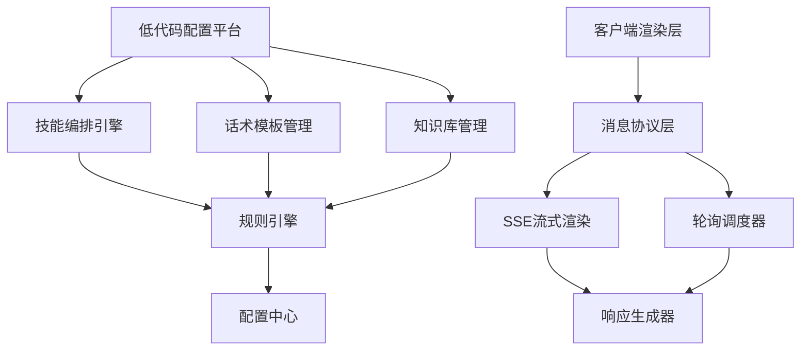
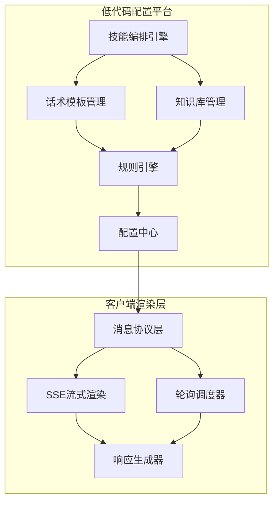

# AI智能客服系统设计

## 系统架构



## AI智能客服
### 架构设计图



 **低代码配置平台**

1. 技能编排引擎

- AI能力编排
- 流程设计
- 参数配置
- 版本管理

2. 话术模板管理

- 模板设计
- 条件配置
- 变量管理
- A/B测试

3. 知识库管理

- 文档管理
- 向量存储
- 检索配置
- 自动更新

4. 规则引擎

- 业务规则配置
- 决策树管理
- 触发条件设置
- 动作定义

 **客户端渲染层**

1. 消息协议层

- 消息格式化
- 类型处理
- 状态追踪

2. SSE流式渲染

- 实时推送
- 断线重连
- 渲染优化

3. 轮询调度器

- 请求管理
- 重试策略
- 资源控制

### 1. 消息类型 MessageProtocol.ts

- 支持多种消息类型
- 确保消息格式统一
- 提供类型安全
- 支持消息状态追踪
```ts
// types/messages.ts

/**
 * 消息状态枚举
 */
export enum MessageStatus {
  PENDING = 'pending',   // 等待发送
  SENDING = 'sending',   // 发送中
  SENT = 'sent',        // 已发送
  FAILED = 'failed',    // 发送失败
  RECEIVED = 'received' // 已接收
}

/**
 * AI消息类型枚举
 */
export enum AIMessageType {
  CHAT = 'chat',      // 闲聊消息
  DOC = 'doc',        // 文档解析
  SUMMARY = 'summary' // 会话总结
}

/**
 * 基础消息接口
 */
export interface BaseAIMessage {
  id: string;         // 消息唯一ID
  type: AIMessageType;// 消息类型
  timestamp: number;  // 时间戳
  status: MessageStatus; // 消息状态
  sessionId: string;  // 会话ID
  userId: string;     // 用户ID
}

/**
 * 闲聊消息
 */
export interface ChatAIMessage extends BaseAIMessage {
  type: AIMessageType.CHAT;
  content: string;    // 聊天内容
  emotion?: string;   // 情感标签
  intent?: string;    // 意图标签
  context?: Record<string, any>; // 上下文信息
}

/**
 * 文档解析消息
 */
export interface DocAIMessage extends BaseAIMessage {
  type: AIMessageType.DOC;
  content: string;    // 解析内容
  docType: string;    // 文档类型
  docUrl: string;     // 文档链接
  confidence: number; // 解析置信度
  metadata?: Record<string, any>; // 文档元数据
}

/**
 * 会话总结消息
 */
export interface SummaryAIMessage extends BaseAIMessage {
  type: AIMessageType.SUMMARY;
  content: string;    // 总结内容
  keywords: string[]; // 关键词
  sentiment: string;  // 整体情感
  topics: string[];   // 主题列表
  duration: number;   // 会话时长
}

/**
 * 消息工厂类
 */
export class MessageFactory {
  /**
   * 创建闲聊消息
   */
  static createChatMessage(params: Omit<ChatAIMessage, 'id' | 'timestamp' | 'status'>): ChatAIMessage {
    return {
      id: this.generateId(),
      timestamp: Date.now(),
      status: MessageStatus.PENDING,
      ...params,
    };
  }

  /**
   * 创建文档解析消息
   */
  static createDocMessage(params: Omit<DocAIMessage, 'id' | 'timestamp' | 'status'>): DocAIMessage {
    return {
      id: this.generateId(),
      timestamp: Date.now(),
      status: MessageStatus.PENDING,
      ...params,
    };
  }

  /**
   * 创建会话总结消息
   */
  static createSummaryMessage(params: Omit<SummaryAIMessage, 'id' | 'timestamp' | 'status'>): SummaryAIMessage {
    return {
      id: this.generateId(),
      timestamp: Date.now(),
      status: MessageStatus.PENDING,
      ...params,
    };
  }

  private static generateId(): string {
    return `msg_${Date.now()}_${Math.random().toString(36).slice(2)}`;
  }
}

```

使用实例：
```ts
// 创建消息实例
const chatMessage = MessageFactory.createChatMessage({
  type: AIMessageType.CHAT,
  content: "你好，请问有什么可以帮您？",
  emotion: "neutral",
  intent: "greeting",
  sessionId: "session_123",
  userId: "user_456"
});

// 创建文档解析消息
const docMessage = MessageFactory.createDocMessage({
  type: AIMessageType.DOC,
  content: "根据文档分析...",
  docType: "pdf",
  docUrl: "https://example.com/doc.pdf",
  confidence: 0.95,
  sessionId: "session_123",
  userId: "user_456"
});
```

### 2. SSE流式渲染系统

目标：

- 实现实时消息推送
- 支持逐字渲染
- 处理连接异常
- 管理消息缓存

```ts
// services/SSEMessageManager.ts

/**
 * SSE连接状态
 */
export enum SSEConnectionStatus {
  CONNECTING = 'connecting',
  CONNECTED = 'connected',
  DISCONNECTED = 'disconnected',
  ERROR = 'error'
}

/**
 * SSE配置接口
 */
export interface SSEConfig {
  url: string;
  reconnectAttempts?: number;
  reconnectInterval?: number;
  onStatusChange?: (status: SSEConnectionStatus) => void;
}

/**
 * SSE消息管理器
 */
export class SSEMessageManager {
  private eventSource?: EventSource;
  private messageBuffer: string = '';
  private status: SSEConnectionStatus = SSEConnectionStatus.DISCONNECTED;
  private reconnectCount: number = 0;
  private readonly config: Required<SSEConfig>;

  constructor(config: SSEConfig) {
    this.config = {
      reconnectAttempts: 3,
      reconnectInterval: 1000,
      onStatusChange: () => {},
      ...config
    };
    this.initEventSource();
  }

  /**
   * 初始化SSE连接
   */
  private initEventSource() {
    this.updateStatus(SSEConnectionStatus.CONNECTING);
    
    this.eventSource = new EventSource(this.config.url);
    this.eventSource.onopen = this.handleOpen;
    this.eventSource.onmessage = this.handleMessage;
    this.eventSource.onerror = this.handleError;
  }

  /**
   * 处理连接建立
   */
  private handleOpen = () => {
    this.updateStatus(SSEConnectionStatus.CONNECTED);
    this.reconnectCount = 0;
  }

  /**
   * 处理收到的消息
   */
  private handleMessage = (event: MessageEvent) => {
    this.messageBuffer += event.data;
    this.renderMessage();
  }

  /**
   * 处理错误
   */
  private handleError = (error: Event) => {
    this.updateStatus(SSEConnectionStatus.ERROR);
    
    if (this.reconnectCount < this.config.reconnectAttempts) {
      setTimeout(() => {
        this.reconnectCount++;
        this.initEventSource();
      }, this.config.reconnectInterval);
    }
  }

  /**
   * 逐字渲染消息
   */
  private renderMessage() {
    // 实现逐字渲染逻辑，可以使用requestAnimationFrame优化
    const chars = this.messageBuffer.split('');
    let index = 0;

    const render = () => {
      if (index < chars.length) {
        // 输出单个字符
        console.log(chars[index]);
        index++;
        requestAnimationFrame(render);
      }
    };

    requestAnimationFrame(render);
  }

  /**
   * 更新连接状态
   */
  private updateStatus(status: SSEConnectionStatus) {
    this.status = status;
    this.config.onStatusChange(status);
  }

  /**
   * 关闭连接
   */
  close() {
    if (this.eventSource) {
      this.eventSource.close();
      this.updateStatus(SSEConnectionStatus.DISCONNECTED);
    }
  }

  /**
   * 获取当前状态
   */
  getStatus(): SSEConnectionStatus {
    return this.status;
  }

  /**
   * 清除消息缓冲
   */
  clearBuffer() {
    this.messageBuffer = '';
  }
}

// React Hook封装
export function useSSE(config: SSEConfig) {
  const [status, setStatus] = useState<SSEConnectionStatus>(SSEConnectionStatus.DISCONNECTED);
  const sseRef = useRef<SSEMessageManager>();

  useEffect(() => {
    sseRef.current = new SSEMessageManager({
      ...config,
      onStatusChange: setStatus
    });

    return () => {
      sseRef.current?.close();
    };
  }, [config.url]);

  return { status, messageManager: sseRef.current };
}

```


使用实例：
```ts
// 在React组件中使用
function ChatComponent() {
  const { status, messageManager } = useSSE({
    url: 'https://api.example.com/chat/stream',
  });

  useEffect(() => {
    console.log('SSE连接状态:', status);
  }, [status]);

  return (
    <div>
      <div>连接状态: {status}</div>
      {/* 其他UI组件 */}
    </div>
  );
}
```

### 3. 轮询调度器

**目标**
- 实现智能轮询机制
- 支持[指数退避](/algorithm/退避算法.md)
- 控制请求频率
- 处理异常情况

```ts
// hooks/usePolling.ts

/**
 * 轮询配置接口
 */
export interface PollingConfig {
  initialInterval: number;     // 初始轮询间隔
  maxInterval: number;        // 最大轮询间隔
  backoffMultiplier: number;  // 退避系数
  maxAttempts: number;        // 最大尝试次数
  timeout?: number;           // 请求超时时间
  immediate?: boolean;        // 是否立即执行
  retryOnError?: boolean;     // 错误时是否重试
  resetAttemptsOnSuccess?: boolean; // 成功时是否重置重试次数
  onSuccess?: (data: any) => void;  // 成功回调
  onError?: (error: Error) => void; // 错误回调
  onTimeout?: () => void;     // 超时回调
}

/**
 * 轮询状态
 */
export interface PollingStatus {
  isPolling: boolean;
  attempts: number;
  currentInterval: number;
  lastExecuteTime?: number;
  lastSuccessTime?: number;
  error?: Error;
  data?: any;
}

/**
 * 轮询Hook
 */
export function usePolling(
  callback: () => Promise<any>,
  config: PollingConfig
) {
  const [status, setStatus] = useState<PollingStatus>({
    isPolling: false,
    attempts: 0,
    currentInterval: config.initialInterval
  });

  const timeoutRef = useRef<NodeJS.Timeout>();
  const abortControllerRef = useRef<AbortController>();
  const mountedRef = useRef(true);
  const executingRef = useRef(false);

  // 清理函数
  const cleanup = useCallback(() => {
    if (timeoutRef.current) {
      clearTimeout(timeoutRef.current);
      timeoutRef.current = undefined;
    }
    if (abortControllerRef.current) {
      abortControllerRef.current.abort();
      abortControllerRef.current = undefined;
    }
  }, []);

  // 计算下一次轮询间隔
  const getNextInterval = useCallback(() => {
    const baseInterval = Math.min(
      config.initialInterval * Math.pow(config.backoffMultiplier, status.attempts),
      config.maxInterval
    );
    // 添加随机抖动
    const jitter = baseInterval * 0.1;
    return baseInterval + (Math.random() * jitter * 2 - jitter);
  }, [config.initialInterval, config.backoffMultiplier, config.maxInterval, status.attempts]);

  // 执行带超时的请求
  const executeWithTimeout = useCallback(async () => {
    abortControllerRef.current = new AbortController();
    
    const timeoutPromise = config.timeout
      ? new Promise((_, reject) => {
          setTimeout(() => {
            reject(new Error('Request timeout'));
            config.onTimeout?.();
          }, config.timeout);
        })
      : null;

    try {
      const result = await Promise.race([
        callback(),
        timeoutPromise
      ].filter(Boolean));

      return result;
    } finally {
      abortControllerRef.current = undefined;
    }
  }, [callback, config]);

  // 执行轮询
  const poll = useCallback(async () => {
    if (!mountedRef.current || status.attempts >= config.maxAttempts || executingRef.current) {
      return;
    }

    executingRef.current = true;

    try {
      const result = await executeWithTimeout();
      
      if (mountedRef.current) {
        setStatus(prev => ({
          isPolling: true,
          attempts: config.resetAttemptsOnSuccess ? 0 : prev.attempts,
          currentInterval: config.initialInterval,
          lastSuccessTime: Date.now(),
          lastExecuteTime: Date.now(),
          data: result,
          error: undefined
        }));

        config.onSuccess?.(result);

        // 安排下一次轮询
        timeoutRef.current = setTimeout(poll, config.initialInterval);
      }
    } catch (error) {
      if (mountedRef.current) {
        const newAttempts = status.attempts + 1;
        const shouldContinue = config.retryOnError && newAttempts < config.maxAttempts;

        setStatus(prev => ({
          ...prev,
          isPolling: shouldContinue,
          attempts: newAttempts,
          currentInterval: shouldContinue ? getNextInterval() : 0,
          lastExecuteTime: Date.now(),
          error: error as Error
        }));

        config.onError?.(error as Error);

        if (shouldContinue) {
          timeoutRef.current = setTimeout(poll, getNextInterval());
        }
      }
    } finally {
      executingRef.current = false;
    }
  }, [callback, config, status.attempts, getNextInterval, executeWithTimeout]);

  // 开始轮询
  const start = useCallback(() => {
    cleanup();
    setStatus({
      isPolling: true,
      attempts: 0,
      currentInterval: config.initialInterval
    });
    poll();
  }, [poll, config.initialInterval, cleanup]);

  // 停止轮询
  const stop = useCallback(() => {
    cleanup();
    setStatus(prev => ({
      ...prev,
      isPolling: false
    }));
  }, [cleanup]);

  // 重置状态
  const reset = useCallback(() => {
    cleanup();
    setStatus({
      isPolling: false,
      attempts: 0,
      currentInterval: config.initialInterval
    });
  }, [cleanup, config.initialInterval]);

  // 组件挂载时自动开始轮询（如果配置了immediate）
  useEffect(() => {
    mountedRef.current = true;
    if (config.immediate) {
      start();
    }
    return () => {
      mountedRef.current = false;
      cleanup();
    };
  }, [config.immediate, start, cleanup]);

  return {
    status,
    start,
    stop,
    reset,
    isPolling: status.isPolling
  };
}


```

**使用实例：**

```ts
// 示例1：基础使用
function DataFetchComponent() {
  const { status, start, stop } = usePolling(
    async () => {
      const response = await fetch('https://api.example.com/data');
      return response.json();
    },
    {
      initialInterval: 1000,    // 初始间隔1秒
      maxInterval: 30000,       // 最大间隔30秒
      backoffMultiplier: 2,     // 退避系数2
      maxAttempts: 5,          // 最大重试5次
      immediate: true,          // 立即开始
      timeout: 5000,           // 5秒超时
      retryOnError: true,      // 错误时重试
      resetAttemptsOnSuccess: true, // 成功时重置重试次数
      onSuccess: (data) => console.log('数据获取成功:', data),
      onError: (error) => console.error('发生错误:', error),
      onTimeout: () => console.warn('请求超时')
    }
  );

  return (
    <div>
      <div>状态: {status.isPolling ? '轮询中' : '已停止'}</div>
      <div>重试次数: {status.attempts}</div>
      <div>当前间隔: {status.currentInterval}ms</div>
      {status.error && <div>错误: {status.error.message}</div>}
      <button onClick={start}>开始轮询</button>
      <button onClick={stop}>停止轮询</button>
    </div>
  );
}

// 示例2：与其他状态管理结合
function UserStatusComponent() {
  const [userData, setUserData] = useState(null);
  
  const { status, start, stop } = usePolling(
    async () => {
      const response = await fetch('/api/user/status');
      const data = await response.json();
      setUserData(data);
      
      // 如果用户状态为"完成"，则停止轮询
      if (data.status === 'completed') {
        stop();
      }
      
      return data;
    },
    {
      initialInterval: 2000,
      maxInterval: 10000,
      backoffMultiplier: 1.5,
      maxAttempts: 10,
      immediate: true
    }
  );

  return (
    <div>
      <div>用户状态: {userData?.status}</div>
      <div>轮询状态: {status.isPolling ? '活跃' : '停止'}</div>
    </div>
  );
}

// 示例3：条件轮询
function ConditionalPollingComponent() {
  const [shouldPoll, setShouldPoll] = useState(false);
  
  const { status, start, stop } = usePolling(
    async () => {
      if (!shouldPoll) {
        stop();
        return;
      }
      // 执行轮询逻辑
    },
    {
      initialInterval: 1000,
      maxInterval: 5000,
      backoffMultiplier: 2,
      maxAttempts: 3
    }
  );

  useEffect(() => {
    if (shouldPoll) {
      start();
    } else {
      stop();
    }
  }, [shouldPoll]);

  return (
    <div>
      <button onClick={() => setShouldPoll(!shouldPoll)}>
        {shouldPoll ? '停止轮询' : '开始轮询'}
      </button>
    </div>
  );
}

```
