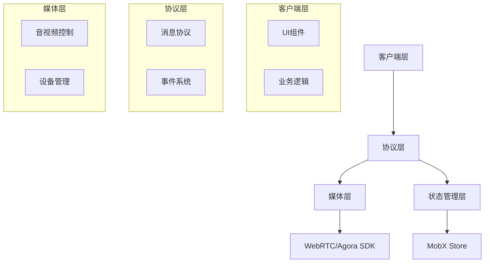

# 实时视频通信系统架构设计

## 系统架构概览


## 视频通信系统架构设计

## 1. 多模态消息协议：
**目标：**
- 构建完整的TypeScript类型系统，为整个视频通信应用提供类型安全保障
- 设计清晰的接口规范，便于团队协作和代码维护
- 实现状态和事件的标准化定义
```ts
// 基础类型定义
/**
 * 定义通话状态枚举
 * NULL: 初始状态
 * CALLING: 呼叫中
 * IN_CALL: 通话中
 * FAILED: 呼叫失败
 */
export enum CallingStatus {
  NULL,
  CALLING,
  IN_CALL,
  FAILED
}

export enum VideoChatPageStatus {
  Null,
  Minimized,
  FullScreen,
  PictureInPicture
}
/**
 * 网络质量等级定义
 * 从1-6分别代表从优到差的网络状态
 */
export enum NetworkQualityLevel {
  Excellent = 1,
  Good = 2,
  Poor = 3,
  Bad = 4,
  VeryBad = 5,
  Down = 6
}

export interface DeviceHealthStatus {
  audio: boolean;
  video: boolean;
  network: NetworkQualityScore;
}

export interface NetworkQuality {
  rtt: number;
  packetLoss: number;
  score: NetworkQualityLevel;
}

export type NetworkQualityScore = 'excellent' | 'good' | 'poor';

// 用户相关类型
export interface LocalUser {
  localAudioTrack?: ILocalAudioTrack;
  localVideoTrack?: ILocalVideoTrack;
  localUplinkNetworkQuality: number;
  enabledVideoTrack: boolean;
  enabledAudioTrack: boolean;
}

export interface RemoteUser {
  remoteUsersState: boolean;
  remoteUsersVolume: boolean;
  remoteUsersVideoEnabled: boolean;
  remoteUsersAudioEnabled: boolean;
  remoteUsers: IAgoraRTCRemoteUser[];
  remoteUplinkNetworkQuality: number;
  name: string;
  avatar: string;
}
```

## 2. 状态管理 `CallStateManager.ts`

**采用分层状态管理策略：**

- 核心状态层：管理通话状态、设备状态等基础状态
- 业务状态层：处理业务逻辑相关的状态
- UI状态层：管理界面展示相关的状态
- 使用MobX实现响应式状态管理，确保状态更新的高效性
```ts
import { makeAutoObservable, action, observable } from 'mobx';

export class CallStateManager {
  @observable callStatus: CallingStatus = CallingStatus.NULL;
  @observable deviceStatus: DeviceHealthStatus = {
    audio: false,
    video: false,
    network: 'poor'
  };
  @observable networkQuality: NetworkQuality = {
    rtt: 0,
    packetLoss: 0,
    score: NetworkQualityLevel.Good
  };

  constructor() {
    makeAutoObservable(this);
  }

  @action
  updateCallStatus(status: CallingStatus) {
    this.callStatus = status;
  }

  @action
  updateDeviceStatus(status: Partial<DeviceHealthStatus>) {
    this.deviceStatus = { ...this.deviceStatus, ...status };
  }

  @action
  updateNetworkQuality(quality: Partial<NetworkQuality>) {
    this.networkQuality = { ...this.networkQuality, ...quality };
  }
}
```

## 3. 重连管理 `ReconnectionManager.ts`

**设计目标：**
- 实现可靠的断线重连机制
- 优化弱网环境下的用户体验
- 提供清晰的重连状态反馈

**实现思路，采用多层级重连策略：**

- 即时重连：网络波动5秒内的快速重连
- 延迟重连：较长时间断线的重试机制
- [退避算法](/algorithm/退避算法)：控制重连频率和次数
- 状态同步：确保重连后的状态一致性

```ts
/**
 * 重连管理器
 * 实现指数退避算法的断线重连机制
 */
export class ReconnectionManager {
  private reconnectAttempts = 0;
  private readonly MAX_ATTEMPTS = 3;
  private readonly INITIAL_INTERVAL = 1000; // 初始重连间隔1秒
  private readonly MAX_INTERVAL = 30000;    // 最大重连间隔30秒
  private readonly BACKOFF_MULTIPLIER = 2;  // 退避指数
  private readonly JITTER_FACTOR = 0.1;     // 抖动因子
  private reconnectTimer?: NodeJS.Timeout;

  constructor(private stateManager: CallStateManager) {}

  /**
   * 计算下一次重连间隔
   * 使用指数退避算法并添加随机抖动
   */
  private getNextInterval(): number {
    // 基础间隔时间（指数增长）
    const baseInterval = Math.min(
      this.INITIAL_INTERVAL * Math.pow(this.BACKOFF_MULTIPLIER, this.reconnectAttempts),
      this.MAX_INTERVAL
    );

    // 添加随机抖动，避免多个客户端同时重连
    const jitter = baseInterval * this.JITTER_FACTOR;
    const randomJitter = Math.random() * jitter * 2 - jitter;

    return Math.min(baseInterval + randomJitter, this.MAX_INTERVAL);
  }

  /**
   * 处理断线重连
   * @param client Agora客户端实例
   * @param channelParams 频道连接参数
   */
  async handleDisconnection(client: IAgoraRTCClient, channelParams: {
    appid: string;
    channel: string;
    token: string;
    uid?: UID;
  }) {
    if (this.reconnectAttempts >= this.MAX_ATTEMPTS) {
      this.stateManager.updateCallStatus(CallingStatus.FAILED);
      throw new Error('Maximum reconnection attempts reached');
    }

    try {
      // 更新状态为重连中
      this.stateManager.updateCallStatus(CallingStatus.RECONNECTING);
      
      // 尝试重连
      await this.reconnect(client, channelParams);
      
      // 重连成功，重置计数器
      this.reconnectAttempts = 0;
      this.stateManager.updateCallStatus(CallingStatus.IN_CALL);
      
      // 触发重连成功事件
      this.onReconnectSuccess();
    } catch (error) {
      this.reconnectAttempts++;
      
      // 计算下一次重连间隔
      const nextInterval = this.getNextInterval();
      
      // 更新重连状态
      this.updateReconnectionStatus();
      
      // 设置下一次重连定时器
      this.reconnectTimer = setTimeout(
        () => this.handleDisconnection(client, channelParams),
        nextInterval
      );
    }
  }

  /**
   * 执行重连
   * @param client Agora客户端实例
   * @param params 连接参数
   */
  private async reconnect(client: IAgoraRTCClient, params: {
    appid: string;
    channel: string;
    token: string;
    uid?: UID;
  }): Promise<void> {
    try {
      // 确保之前的连接已经断开
      if (client.connectionState !== 'DISCONNECTED') {
        await client.leave();
      }

      // 重新加入频道
      await client.join(params.appid, params.channel, params.token, params.uid);
    } catch (error) {
      console.error('Reconnection failed:', error);
      throw error;
    }
  }

  /**
   * 更新重连状态
   */
  private updateReconnectionStatus(): void {
    const remainingAttempts = this.MAX_ATTEMPTS - this.reconnectAttempts;
    this.stateManager.updateReconnectionStatus({
      attempts: this.reconnectAttempts,
      remaining: remainingAttempts,
      nextInterval: this.getNextInterval()
    });
  }

  /**
   * 重连成功后的处理
   */
  private onReconnectSuccess(): void {
    // 可以添加重连成功后的逻辑，比如恢复之前的状态
    this.stateManager.updateReconnectionStatus({
      attempts: 0,
      remaining: this.MAX_ATTEMPTS,
      nextInterval: this.INITIAL_INTERVAL
    });
  }

  /**
   * 清理重连状态
   */
  clearReconnection() {
    if (this.reconnectTimer) {
      clearTimeout(this.reconnectTimer);
      this.reconnectTimer = undefined;
    }
    this.reconnectAttempts = 0;
    this.updateReconnectionStatus();
  }

  /**
   * 获取当前重连状态
   */
  getReconnectionStatus() {
    return {
      attempts: this.reconnectAttempts,
      remaining: this.MAX_ATTEMPTS - this.reconnectAttempts,
      isReconnecting: this.reconnectTimer !== undefined
    };
  }
}
```

```ts
// 在连接状态变化时调用
client.on('connection-state-change', (curState, prevState) => {
  if (curState === 'DISCONNECTED') {
    reconnectionManager.handleDisconnection(client, channelParams);
  }
});
```

## 4. 设备健康检测 DeviceHealthCheck.ts

**设计目标：**
- 实现设备状态的全面检测
- 提供网络质量评估
- 预防可能的设备问题

**实现思路，构建完整的设备健康检测体系：**
- 权限检测：检查摄像头和麦克风权限
- 设备测试：验证设备是否正常工作
- 网络诊断：评估网络质量和稳定性
- 实时监控：持续监测设备状态变化
```ts
export class DeviceHealthCheck {
  constructor(private stateManager: CallStateManager) {}

  async checkDevices(): Promise<DeviceHealthStatus> {
    const [audioPermission, videoPermission, networkQuality] = await Promise.all([
      this.checkAudioPermission(),
      this.checkVideoPermission(),
      this.checkNetworkQuality()
    ]);

    const status = {
      audio: audioPermission,
      video: videoPermission,
      network: networkQuality
    };

    this.stateManager.updateDeviceStatus(status);
    return status;
  }

  private async checkAudioPermission(): Promise<boolean> {
    try {
      const stream = await navigator.mediaDevices.getUserMedia({ audio: true });
      stream.getTracks().forEach(track => track.stop());
      return true;
    } catch {
      return false;
    }
  }

  private async checkVideoPermission(): Promise<boolean> {
    try {
      const stream = await navigator.mediaDevices.getUserMedia({ video: true });
      stream.getTracks().forEach(track => track.stop());
      return true;
    } catch {
      return false;
    }
  }

  private async checkNetworkQuality(): Promise<NetworkQualityScore> {
    const rtt = await this.measureRTT();
    const packetLoss = await this.measurePacketLoss();
    return this.calculateNetworkScore(rtt, packetLoss);
  }

  private async measureRTT(): Promise<number> {
    // 实现RTT测量
    return 100; // 示例值
  }

  private async measurePacketLoss(): Promise<number> {
    // 实现丢包率测量
    return 0.01; // 示例值
  }

  private calculateNetworkScore(rtt: number, packetLoss: number): NetworkQualityScore {
    if (rtt < 100 && packetLoss < 0.01) return 'excellent';
    if (rtt < 300 && packetLoss < 0.05) return 'good';
    return 'poor';
  }
}

```

## 5. 通话超时管理 `CallTimeoutManager.ts`

**设计目标**

- 控制异常状态下的资源占用
- 提供及时的用户反馈
- 确保系统稳定性

**实现思路，建立多层级的超时控制机制：**

- 呼叫超时：控制呼叫等待时间
- 响应超时：监控信令交互超时
- 连接超时：管理媒体连接建立超时
- 自动清理：处理超时后的资源释放
```ts
export class CallTimeoutManager {
  private timeoutId: NodeJS.Timeout | null = null;
  private readonly CALL_TIMEOUT = 30000; // 30秒

  constructor(private stateManager: CallStateManager) {}

  startCallTimeout(onTimeout: () => void) {
    this.timeoutId = setTimeout(() => {
      this.stateManager.updateCallStatus(CallingStatus.FAILED);
      onTimeout();
      this.clearTimeout();
    }, this.CALL_TIMEOUT);
  }

  clearTimeout() {
    if (this.timeoutId) {
      clearTimeout(this.timeoutId);
      this.timeoutId = null;
    }
  }
}

```

## 6. 视频通信主类 AgoraRtc.ts

**设计目标：**
- 整合所有功能模块
- 提供统一的接口
- 管理整个通话生命周期

**实现思路采用模块化的设计架构：**

- 核心模块：处理基础的WebRTC功能
- 状态管理：集成MobX状态管理
- 设备控制：管理媒体设备
- 事件系统：处理各类通信事件
- 错误处理：统一的错误处理机制
```ts
export class AgoraRtc {
  public client!: IAgoraRTCClient;
  public AgoraRTC!: IAgoraRTC;
  private stateManager: CallStateManager;
  private reconnectionManager: ReconnectionManager;
  private deviceHealthCheck: DeviceHealthCheck;
  private timeoutManager: CallTimeoutManager;
  private localUser: LocalUser;
  private remoteUser: RemoteUser;

  constructor() {
    this.stateManager = new CallStateManager();
    this.reconnectionManager = new ReconnectionManager(this.stateManager);
    this.deviceHealthCheck = new DeviceHealthCheck(this.stateManager);
    this.timeoutManager = new CallTimeoutManager(this.stateManager);
    
    this.localUser = this.initializeLocalUser();
    this.remoteUser = this.initializeRemoteUser();
    
    makeAutoObservable(this);
  }

  private initializeLocalUser(): LocalUser {
    return {
      localAudioTrack: undefined,
      localVideoTrack: undefined,
      localUplinkNetworkQuality: 0,
      enabledVideoTrack: true,
      enabledAudioTrack: true
    };
  }

  private initializeRemoteUser(): RemoteUser {
    return {
      remoteUsersState: false,
      remoteUsersVolume: false,
      remoteUsersVideoEnabled: false,
      remoteUsersAudioEnabled: true,
      remoteUsers: [],
      remoteUplinkNetworkQuality: 0,
      name: "",
      avatar: ""
    };
  }

  public async init() {
    this.client = this.AgoraRTC.createClient({
      codec: "vp8",
      mode: "rtc"
    });

    this.initializeEventListeners();
    await this.deviceHealthCheck.checkDevices();
  }

  private initializeEventListeners() {
    this.client.on("connection-state-change", this.handleConnectionStateChange);
    this.client.on("user-published", this.handleUserPublished);
    this.client.on("user-unpublished", this.handleUserUnpublished);
    this.client.on("user-joined", this.handleUserJoined);
    this.client.on("user-left", this.handleUserLeft);
  }

  private handleConnectionStateChange = (curState: string, prevState: string) => {
    if (curState === "DISCONNECTED") {
      this.reconnectionManager.handleDisconnection(this.client, this.currentChannelParams);
    }
  }

  public async join(appid: string, channel: string, token: string, uid?: UID): Promise<UID | boolean> {
    const healthStatus = await this.deviceHealthCheck.checkDevices();
    if (!this.isHealthStatusOK(healthStatus)) {
      throw new Error('Device health check failed');
    }

    this.timeoutManager.startCallTimeout(() => this.leave());

    try {
      const clientUid = await this.client.join(appid, channel, token, uid);
      await this.createLocalTracks();
      this.timeoutManager.clearTimeout();
      this.stateManager.updateCallStatus(CallingStatus.IN_CALL);
      return clientUid;
    } catch (error) {
      this.timeoutManager.clearTimeout();
      this.stateManager.updateCallStatus(CallingStatus.FAILED);
      throw error;
    }
  }

  private async createLocalTracks() {
    const [audioTrack, videoTrack] = await Promise.all([
      this.AgoraRTC.createMicrophoneAudioTrack(),
      this.AgoraRTC.createCameraVideoTrack()
    ]);

    this.localUser.localAudioTrack = audioTrack;
    this.localUser.localVideoTrack = videoTrack;

    await this.client.publish([audioTrack, videoTrack]);
  }

  public async leave() {
    this.timeoutManager.clearTimeout();
    this.reconnectionManager.clearReconnection();
    
    if (this.localUser.localAudioTrack) {
      this.localUser.localAudioTrack.stop();
      this.localUser.localAudioTrack.close();
    }
    
    if (this.localUser.localVideoTrack) {
      this.localUser.localVideoTrack.stop();
      this.localUser.localVideoTrack.close();
    }

    await this.client.leave();
    this.stateManager.updateCallStatus(CallingStatus.NULL);
    this.resetState();
  }

  private resetState() {
    this.localUser = this.initializeLocalUser();
    this.remoteUser = this.initializeRemoteUser();
  }

  // 其他方法实现...
}

```

