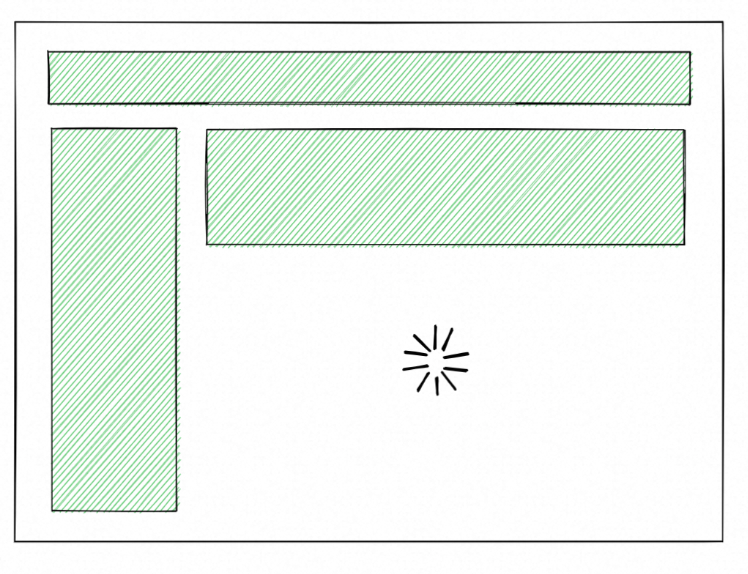

# SSR改造实践


## 基于Wormhole的流式SSR改造

利用大淘宝CI/CD平台自动集成SSR能力，通过指定脚手架来完成项目初始化。

### 配置ice.config.mts

```ts
import { defineConfig } from '@ice/app';
import { PegasusPlugin } from '@ali/build-plugin-pegasus-project';
import spm from "@ali/ice-plugin-spm";
// The project config, see https://ice3.alibaba-inc.com/v3/docs/guide/basic/config
export default defineConfig({
  // Set your configs here.
  plugins: [
    PegasusPlugin({
      previewMode: 'local',
      documentOnly: false,
      npm: false,
      runInWormholeContainer: true
    }),
    spm(),
  ],
  sourceMap: true,
  server: {
    // Wormhole only support server bundle with cjs format.
    format: 'cjs',
    bundle: true,
  },
  // 这里是 ssr 的开关，默认使用 ssr 渲染
  // 该参数需要配合 documentOnly 一起使用！
  ssr: true,
  codeSplitting: 'page',
  ssg: false,
  routes: {
    ignoreFiles: [
      "**/api.tsx",
      "**/api/**",
      "**/type.d.ts",
      "**/store.ts",
      "**/utils.ts",
      "**/layout/**",
      "**/models/**",
      "**/View/**",
      "**/mock.ts",
      "**/mock/**",
      "**/api.ts",
      "**/interface.d.ts",
      "**/interface.ts",
      "**/components/**",
      "announcement-list/**",
      "logistics-mode/**",
    ],
  },
});
```

### 迁移业务代码


### 基础物料

确定基础物料版本号，需要支持ssr

### 接入hsf

HSF：
```ts

import { getContext } from "@ali/wormhole-context";
import { isMock } from "@ali/odin-api";
import { WormholeContext } from "@ali/wormhole-context/dist/types";

type Context = Required<WormholeContext>;


const commonError = {
  error: {
    data: {
      resultMessage: "hsf_error",
      resultCode: "hsf_error",
    },
  },
  isError: true,
};
export const queryPackageProviderHsf = async (): Promise<any> => {
  const { hsfClient, mtopEvent, logger, eagleeye } =
    getContext() as Context;
  const warehouseId = mtopEvent?.httpInfo?.params?.warehouseId || "";
  const orderId = mtopEvent?.httpInfo?.params?.orderId || "";
  const userId = mtopEvent?.sessionInfo?.userId;
  const appI18n = mtopEvent?.httpInfo?.headers["x-app-i18n"] || "CN.zh_CN.480";

  let data;
  const query = async () => {
    data = await hsfClient!.invoke<any>({
      id: "com.alibaba.ovs.delivery.remote.front.pkg.PendingPackageFrontService:1.0.0",
      group: "HSF",
      method: "getProviderSimple",
      args: [
        warehouseId,
        userId,
        orderId
      ],
      parameterTypes: ["java.lang.Integer", "java.lang.Long", 'java.lang.Long'],
    });
  };
  // mock逻辑
  if (isMock) {
    await query();
  } else {
    await eagleeye?.putUserData("tbi18n", appI18n, query);
    logger?.debug(JSON.stringify(mtopEvent));
    logger?.debug(JSON.stringify(data));
  }

  return data ? { data: { ...data }, isError: false } : commonError;
};

```

**mock数据：**


## 编码规范

### 环境判断

可以使用 `import.meta.renderer === 'server'`判断当前是否 Server 环境

### 不直接消费浏览器环境变量

通常 SSR 的执行环境是 Node 环境，如果直接消费 window、document 等浏览器侧的环境变量，会导致 Server 端的运行时报错。
编码时，应当做好容错判断或将这部分代码放到首次渲染之后。示例：

```tsx
import { ClientOnly } from 'ice';

const MyComponent = () => {
  return (
    <ClientOnly>
      {() => <span>page url = {window.location.href}</span>}
    </ClientOnly>
  );
};
```

### 不用异步的方式渲染首屏内容

Server 端的渲染过程是一个同步的操作，其本质是将 JSX 组件渲染为 HTML 字符串。因此，`setState` 这类异步更新状态的方法，以及组件的 生命周期 方法，在 Server 端不会被执行。

开发过程中，应尽量避免使用异步的方式，来渲染预期的首屏内容。

以 `useState`为例，下面的代码，在 Server 端渲染时，Count 展示的是初始化的值 0，而 `setCount` 不会被执行。

```tsx
function Counter() {
  let [count, setCount] = useState(0);

  if (count < 3) {
    setCount(count + 1);
  }

  return <span>Count: {count}</span>;
}
```

在 CSR 应用中，通常的做法是在首次 useEffect 后，发起数据请求，异步更新页面内容。在 SSR 应用中，这种首屏内容依赖数据的异步更新方式是不可行的。

### 保持 SSR 和 CSR 的首次渲染结果一致

当 SSR 的渲染结果被下发到浏览器侧，并开始通过 JS 进行 [Hydrate](https://react.dev/reference/react-dom/client/hydrateRoot) 时，React 会比对浏览器侧的渲染结果和 Server 渲染结果。

理想的状况是：浏览器的渲染结果和 Server 端的渲染结果一致，可以直接复用 SSR 生成好的 DOM 节点，并为这些节点绑定上事件。而如果两端的渲染结果不一致，则会重新进行所有 DOM 节点的创建，性能上是有一定损耗的。

对于不可避免的差异化渲染，推荐的做法是将差异化的内容，放到 useEffect 后更新（即完成 Hydrate 后）。

一段会因为渲染不一致，而导致 Hydrate 失败的示例：
```tsx
function MyComponent() {
  const color = import.meta.renderer === 'server' ? 'red' : 'blue';
  return <h1 className={`title ${color}`}>Hello World!</h1>
}
```

推荐的做法：

```tsx
import { useEffect, useState } from 'react';

function MyComponent() {
  const [color, setColor] = useState('blue');
  useEffect(() => setColor('red'), []);

  return <h1 className={`title ${color}`}>Hello World!</h1>
}
```


### 流式组件嵌套

流式组件相互嵌套，对于接口返回会有前后依赖关系，并不是推荐业务上有这种形态。

如果多个组件间数据相互依赖，可以将逻辑合并在一个流式组件内部，并行发起多个 hsf 请求，并通过 Promise.allSettled组织返回的数据。

由于流式组件返回时间并不确定，禁止流式组件上层组件，有包含组件渲染结束后的状态操作，比如：

```tsx
function Component() {
  const [_, setState] = useState(false);
  useEffect(() => {
    // 禁止在 StreamComponent 未完成的情况下，执行组件状态变化
    setState(true);
  }, []);

  return (
    <div>
      <StreamComponent id="component" />
    </div>
  );
}
```

如果执行了上述操作，将会导致错误 `This Suspense boundary received an update before it finished hydrating`，从而引起组件的多次渲染。


## 流式数据

ice.js 结合 **[React 18 的Suspense](https://github.com/reactwg/react-18/discussions/37)** SSR 提供了流式渲染的能力，页面中部分区块如果数据请求耗时过久，可以通过标记为流式组件，来实现这些区块的流式返回




### 流式组件声明

流式渲染的组件开发需遵循以下两点，以便框架识别:
- 使用 useSuspenseData 方法包裹组件的数据请求方法
- 使用 withSuspense 包裹组件

```tsx
import { withSuspense, useSuspenseData } from 'ice';

function Comments() {
  // 注意：如果需要按环境区分接口，可以结合 import.meta.renderer === 'server' 进行判断
  const comments = useSuspenseData(import.meta.renderer === 'server' ? getServerData : getData);

  console.log('Render: Comments');

  return (
    <div>
      {comments.map((comment, i) => (
        <p className="comment" key={i}>
          {comment}
        </p>
      ))}
    </div>
  );
}

// 调用 HSF 请求
async function getServerData() {
  console.log('load comments data');
  return fakeData;
}

// 调用 MTOP 请求，作为 CSR 兜底
async function getData() {
  console.log('load comments data');
  return fakeData;
}

export default withSuspense(Comments);
```


### 流式组件调用

流式渲染组件在调用时，需要额外传入两个参数

- id  唯一标记流式渲染组件，同一个页面不要重复
- fallback 组件加载过程中的 loading 状态


```tsx
import { Suspense } from 'react';
import Comments from './Comments';

export default function App() {
  return (
      <Comments id="xxx" fallback={<Loading />} />
  );
}
```


### 调整资源加载模式

框架默认的资源加载是阻塞渲染的，流式渲染模式下，推荐将资源顺序调整为 `defer` 或 `async` 模式，使页面的资源加载不阻塞流式内容的上屏。


对于内置资源，可在 src/document.tsx 中修改 Scripts 组件的 props 完成：
```html

function Document() {
  return (
    <html>
      <head></head>
      <body>
        <Main />
        <Scripts async />
      </body>
    </html>
  );
}
```

两种模式的差别是：

- defer：等待所有流式内容加载完成后，再执行 JS。适用于流式内容能较快返回的页面。
- async： JS 加载过程中，流式内容先上屏，一旦 JS 加载完成后，先执行 JS。适用于流式内容返回耗时较长，希望页面中其他区块尽快可交互的页面