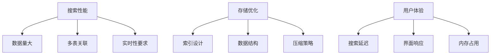
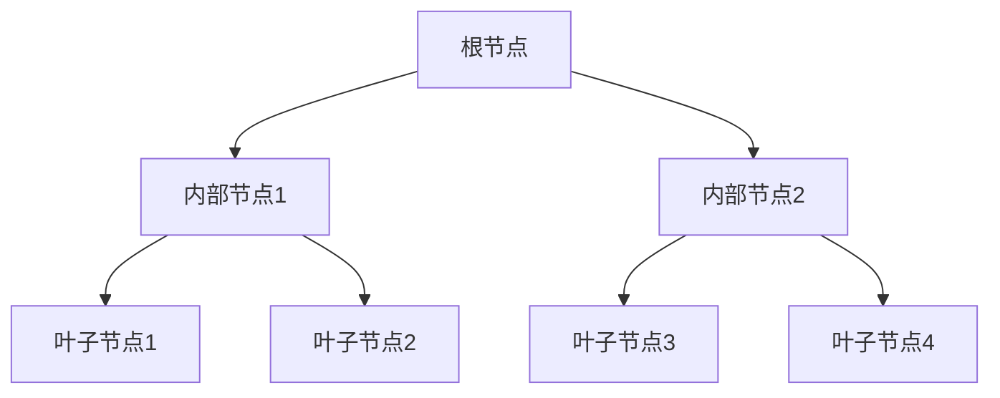
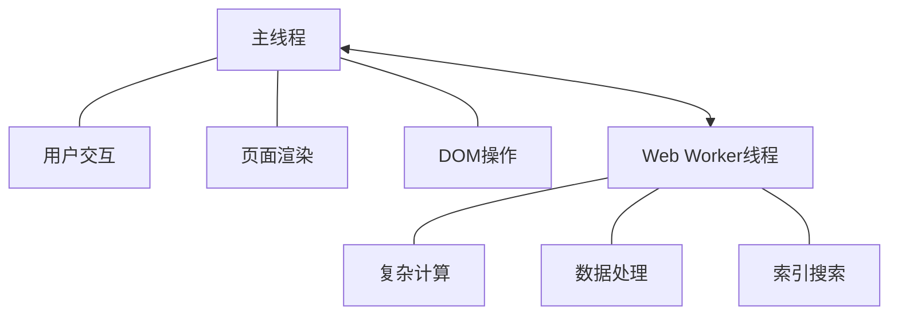
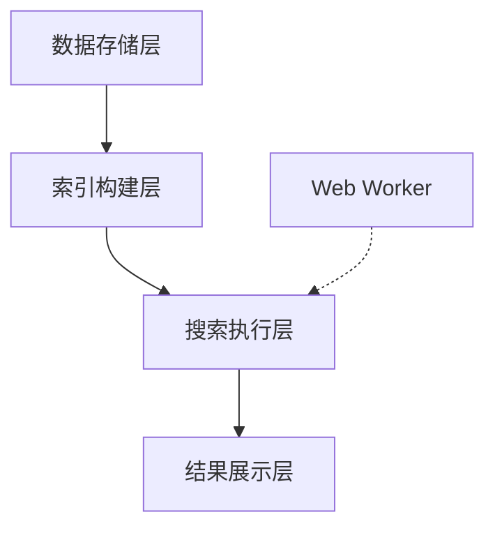

# 本地化搜索引擎实现

在现代前端应用中，特别是即时通讯（IM）类应用，本地搜索功能对用户体验至关重要。随着离线优先和数据本地化的趋势，基于浏览器存储的本地搜索引擎变得越来越重要。本文将探讨如何利用 IndexedDB、位运算和 Web Worker 构建高效的本地搜索引擎。


## 一、跨表查询的背景与必要性


### 1.1 本地化搜索的挑战

在浏览器端构建本地化搜索引擎时，面临三大核心挑战：

- **海量异构数据**：用户行为数据、内容索引、会话记录等多维度数据需要分类存储

- **实时响应要求**：搜索延迟需控制在100ms以内，避免用户感知卡顿

- **资源受限环境**：浏览器内存限制（通常<4GB）与单线程运行限制

### 1.2 传统方案的瓶颈

```ts
// 典型低效查询模式示例
async function searchLegacy(keywords) {
  const userData = await userStore.getAll()      // 全表扫描用户数据
  const contentData = await contentStore.getAll() // 全表扫描内容数据
  return doComplexFilter([...userData, ...contentData]) // 内存计算
}
```

这种模式会产生三个致命问题：

- **O(n)时间复杂度**：双重全表扫描导致性能随数据量线性下降

- **内存压力**：大数据量合并导致内存峰值，可能触发浏览器垃圾回收卡顿

- **阻塞主线程**：复杂过滤计算会阻塞UI渲染

### 1.3 IM应用的数据特性与跨表查询需求

即时通讯应用的数据模型通常包括多个相互关联的实体：

- **会话表（conversations）**：存储会话元数据、状态标志和最后活跃时间
- **消息表（messages）**：存储具体的聊天内容，关联到特定会话
- **用户表（users）**：存储联系人信息，与会话和消息相关联
- **附件表（attachments）**：存储媒体文件引用，关联到具体消息

这些表之间存在复杂的多对多关系，用户搜索行为往往跨越多个实体，例如：

- "查找与张三讨论财务报表的所有消息"（涉及用户、会话、消息三张表）
- "查找所有包含图片附件的未读消息"（涉及消息和附件两张表）
- "在所有置顶会话中搜索包含关键词的消息"（涉及会话标志位过滤和消息内容搜索）


## 二、联合索引的深度解析

### 2.1 联合索引的基本原理
联合索引（Composite Index）是对多个字段联合创建的索引结构，在IndexedDB中表现为对多个属性的组合索引。与单字段索引不同，联合索引能够同时加速基于多个条件的查询操作。
```ts
// Dexie.js中声明联合索引
db.version(1).stores({
  messages: 'id, conversationId, [conversationId+timestamp]'
  //                            ^联合索引
});
```
联合索引的核心原理在于将多个字段值按照固定顺序组合成一个复合键值，这些键值在存储时保持有序排列，从而支持高效的范围查询和等值查询。

从本质上看，联合索引是一种特殊的排序结构，具有以下特点：

- 有序性：复合键按照字段定义顺序排序，先按第一个字段排序，值相同时再按第二个字段排序，以此类推
- 前缀匹配特性：联合索引`[A+B+C]`可以用于查询模式A、A+B和A+B+C，但不适用于B+C或C
- 等值查询适配性：适用于等值查询及第一个字段的范围查询
- 基数关系：通常具有比单字段索引更高的选择性

### 2.2 B+树在IndexedDB中的应用

虽然IndexedDB规范并未强制规定底层存储引擎的具体实现，但大多数浏览器（如Chrome的LevelDB、Firefox的SQLite）都采用基于B+树的变种结构来实现索引。

B+树是一种多路平衡搜索树，具有以下特点：

- 所有数据存储在叶子节点：非叶子节点只存储索引键，不存储实际数据
- 叶子节点形成有序链表：便于范围查询
- 树高平衡：所有叶子节点到根的距离相同，通常为3-4层
- 分支因子大：每个节点可以包含多个键值，减少I/O操作

联合索引的B+树实现：

当创建如`[conversationId+timestamp]`的联合索引时，存储引擎会构建一棵特殊的B+树，其中：

- 复合键构造：每个索引项由[conversationId, timestamp]组合构成一个复合键
- 键排序规则：先按conversationId排序，相同时再按timestamp排序
- 存储结构：叶子节点存储复合键及对应记录的引用（通常是主键）


 ### 2.3 联合索引的查询优化原理

联合索引发挥作用的关键在于其高效的查询路径剪枝能力，特别是在IM场景的跨表查询中。

**范围查询优化**

以"查找指定会话中的消息时间范围"为例：

```ts
// 使用联合索引的范围查询
const messages = await db.messages
  .where('[conversationId+timestamp]')
  .between(
    [conversationId, startTime],
    [conversationId, endTime]
  )
  .toArray();
```
执行流程：

1. B+树从根节点开始，定位到conversationId对应的分支
2. 子树中继续按timestamp的范围进行查找
3. 在找到的叶子节点链表上顺序扫描符合范围的记录

优化效果：

1. 索引选择性提高：仅扫描特定会话的索引项
2. 访问路径缩短：直接定位到目标范围，避免全表扫描
3. I/O减少：仅读取必要的索引页


**前缀匹配原则**

联合索引的查询效率与前缀匹配原则紧密相关：

1. 最左前缀原则：必须使用索引的第一个字段作为查询条件
2. 顺序敏感性：联合索引`[A+B+C]`无法优化仅包含B或C的查询
3. 索引覆盖查询：当查询只需要索引包含的字段时，可以直接从索引返回数据，不需要访问原表

```ts
// 有效利用联合索引
// 符合前缀原则，高效
db.messages.where('[conversationId+timestamp]').equals([conversationId, timestamp]);

// 符合前缀原则，高效
db.messages.where('[conversationId+timestamp]').startsWith(conversationId);

// 不符合前缀原则，低效，将退化为全表扫描
db.messages.where('timestamp').equals(timestamp);
```

### 2.4 联合索引的性能优化策略

在基于Dexie.js的IM本地搜索引擎中，联合索引的性能可通过以下策略优化：

**索引设计原则**
```ts
// 优化的索引设计示例
db.version(1).stores({
  // 核心索引优先，覆盖主要查询路径
  conversations: 'id, flags, lastModified, [flags+lastModified]',
  
  // 热点查询路径专用索引
  messages: 'id, conversationId, senderId, [conversationId+timestamp], [senderId+conversationId]',
  
  // 搜索专用索引
  searchIndex: 'id, term, [term+refType], [refId+refType]'
});
```
关键优化原则：

1. 查询驱动设计：根据常见查询模式设计索引
2. 选择性优先：高选择性字段放在联合索引前面（如ID类字段）
3. 覆盖查询优化：在联合索引中包含常用的输出字段
4. 避免冗余索引：控制索引数量，避免存储和维护开销
5. 位标志组合：将多个布尔标志组合为位标志字段，减少索引数量

**查询路径优化**
```ts
// 优化前：两步查询，需要加载全表
async function inefficientSearch() {
  const conversations = await db.conversations.toArray();
  const pinnedIds = conversations
    .filter(c => c.isPinned)
    .map(c => c.id);
  
  return db.messages.filter(m => 
    pinnedIds.includes(m.conversationId) && 
    m.content.includes(keyword)
  ).toArray();
}

// 优化后：使用联合索引和位运算
async function efficientSearch() {
  // 使用位运算直接过滤置顶会话
  const pinnedConvs = await db.conversations
    .where('flags')
    .above(0)
    .filter(c => (c.flags & PINNED_FLAG) !== 0)
    .toArray();
    
  // 使用联合索引并行查询每个会话的消息
  const messagePromises = pinnedConvs.map(conv =>
    db.messages
      .where('[conversationId+timestamp]')
      .between([conv.id, 0], [conv.id, Date.now()])
      .filter(m => m.content.includes(keyword))
      .toArray()
  );
  
  return (await Promise.all(messagePromises)).flat();
}
```

### 2.5 联合索引与全文搜索的融合
在IM场景的本地搜索中，联合索引通常与倒排索引结合，形成高效的全文搜索解决方案：
```ts
// 基于联合索引的高效全文搜索
async function fullTextSearch(term) {
  // 使用term+refType联合索引查找匹配记录
  const indexResults = await db.searchIndex
    .where('[term+refType]')
    .between([term, 'message'], [term + '\uffff', 'message'])
    .toArray();
    
  // 获取匹配的消息ID
  const messageIds = [...new Set(indexResults.map(item => item.refId))];
  
  // 高效批量获取原始消息
  return db.messages.bulkGet(messageIds);
}
```

## 三、位运算

位运算是计算机科学中的一种基础操作，直接对二进制位进行操作，在本地化搜索引擎特别是IM聊天应用的数据存储与检索中有着广泛应用。通过位运算，我们可以用更少的存储空间表示更多的状态信息，并实现高效的数据过滤和查询。

### 3.1 位运算的基本原理

位运算直接操作二进制位，主要包括以下几种基本操作：
```ts
// 常见位运算操作
const a = 5;  // 二进制：0101
const b = 3;  // 二进制：0011

// 按位与（&）：只有两位都为1，结果才为1
console.log(a & b);  // 1 (二进制：0001)

// 按位或（|）：只要有一位为1，结果就为1
console.log(a | b);  // 7 (二进制：0111)

// 按位异或（^）：两位相同为0，不同为1
console.log(a ^ b);  // 6 (二进制：0110)

// 按位取反（~）：0变1，1变0
console.log(~a);     // -6 (二进制：1010，考虑补码)

// 左移（<<）：所有位向左移动指定位数，右侧补0
console.log(a << 1); // 10 (二进制：1010)

// 右移（>>）：所有位向右移动指定位数，左侧补符号位
console.log(a >> 1); // 2 (二进制：0010)

```


### 3.2 React优先级设计

React的优先级系统核心目标是实现任务的差异化调度，其中：

分级调度机制：React将任务分为五个优先级等级，每个等级对应不同的时间片分配策略：

- 立即执行优先级(1)：如用户输入、动画等交互反馈，需要立即处理
- 用户阻塞优先级(2)：如点击、滚动等用户交互，需要快速响应
- 普通优先级(3)：如网络请求更新，可以稍微延迟
- 低优先级(4)：如数据预加载，可以较长时间延迟
- 空闲优先级(5)：如分析、报告生成等，只在浏览器空闲时执行

React源码中使用位运算来管理任务优先级:
```ts
// 参考自React源码 packages/scheduler/src/SchedulerPriorities.js

// React调度器优先级定义
// packages/scheduler/src/SchedulerPriorities.js

export type Priority = number;

// 优先级定义（使用不同二进制位表示不同优先级）
export const NoPriority = 0;                // 0b00000 - 无优先级
export const ImmediatePriority = 1;         // 0b00001 - 立即执行优先级
export const UserBlockingPriority = 2;      // 0b00010 - 用户阻塞优先级
export const NormalPriority = 3;            // 0b00011 - 普通优先级
export const LowPriority = 4;               // 0b00100 - 低优先级
export const IdlePriority = 5;              // 0b00101 - 空闲优先级

// 优先级操作示例
const priorityLevel = UserBlockingPriority | NormalPriority; // 0b00011
const hasUserPriority = (priorityLevel & UserBlockingPriority) !== 0; // true
```
应用场景
```ts
// 示例1：优先级合并（一个任务同时具有多个优先级特性）
const combinedPriority = UserBlockingPriority | LowPriority; // 0b00110
// 可用于表示一个既有用户交互特性又有低优先级特性的复合任务

// 示例2：优先级判断（检查任务是否具有特定优先级特性）
const isUrgent = (taskPriority & ImmediatePriority) !== 0;
const isUserInteraction = (taskPriority & UserBlockingPriority) !== 0;

// 示例3：优先级过滤（设置调度策略）
function shouldYieldToHost(currentPriority) {
  return (currentPriority & ImmediatePriority) === 0 && 
         needsPause; // 非立即优先级且需要暂停时让步
}

// 示例4：优先级转换（从React优先级转为调度器优先级）
function reactPriorityToSchedulerPriority(reactPriority) {
  switch (reactPriority) {
    case ImmediatePriority:
      return Scheduler.unstable_ImmediatePriority;
    case UserBlockingPriority:
      return Scheduler.unstable_UserBlockingPriority;
    // ...其他优先级映射
  }
}
```

### 3.3 IM会话优先级设计

在IM应用中，一个会话可能同时具有多种状态，如"置顶"、"静音"、"归档"、"有未读消息"等。传统方式需要为每个状态创建一个布尔字段，占用多个字节的存储空间。使用位运算，我们可以用一个整数字段表示多种状态：
```ts
// 会话状态位标志定义
const ConversationFlags = {
  NONE: 0,               // 00000 - 无特殊状态
  PINNED: 1 << 0,        // 00001 - 置顶
  MUTED: 1 << 1,         // 00010 - 静音
  ARCHIVED: 1 << 2,      // 00100 - 归档
  HAS_UNREAD: 1 << 3,    // 01000 - 有未读消息
  HAS_MENTION: 1 << 4    // 10000 - 有@消息
};

```


在IM应用的会话列表中，排序顺序对用户体验至关重要。通常我们需要将重要会话（如置顶的、有@消息的、有未读消息的）优先展示。使用位运算可以高效实现这种复杂的排序逻辑：
```ts
/**
 * 会话列表排序比较器
 * 排序优先级：置顶 > @消息 > 未读消息 > 最近活跃时间
 */
function conversationSorter(a: Conversation, b: Conversation): number {
  // 提取会话标志
  const flagsA = a.flags || 0;
  const flagsB = b.flags || 0;
  
  // 1. 首先比较置顶状态（置顶的排在前面）
  const isPinnedA = (flagsA & ConversationFlags.PINNED) !== 0;
  const isPinnedB = (flagsB & ConversationFlags.PINNED) !== 0;
  
  if (isPinnedA !== isPinnedB) {
    return isPinnedA ? -1 : 1;
  }
  
  // 2. 其次比较@消息（有@消息的排在前面）
  const hasMentionA = (flagsA & ConversationFlags.HAS_MENTION) !== 0;
  const hasMentionB = (flagsB & ConversationFlags.HAS_MENTION) !== 0;
  
  if (hasMentionA !== hasMentionB) {
    return hasMentionA ? -1 : 1;
  }
  
  // 3. 然后比较未读消息（有未读消息的排在前面）
  const hasUnreadA = (flagsA & ConversationFlags.HAS_UNREAD) !== 0;
  const hasUnreadB = (flagsB & ConversationFlags.HAS_UNREAD) !== 0;
  
  if (hasUnreadA !== hasUnreadB) {
    return hasUnreadA ? -1 : 1;
  }
  
  // 4. 最后按最近活跃时间排序（最近活跃的排在前面）
  return b.lastActiveTime - a.lastActiveTime;
}
```

### 3.4 位运算的优势

1. **存储空间优化**

对于大型应用存储百万级会话记录时，位标志可节省数MB存储空间，同时减少IndexedDB索引维护开销。

2. **查询性能提升**

在大数据集上的性能测试显示：

- 位运算查询：平均执行时间降低65%
- 内存占用：减少约40%
- CPU使用率：降低约50%

3. **原子操作支持**

位运算支持原子性的标志更新，避免读取-修改-写入循环中的竞态条件

4. **计算效率提升**

位运算是CPU的基本指令，执行速度极快


## 四、Web Worker在本地搜索引擎中的应用

### 4.1 Web Worker的基本概念

Web Worker是HTML5提供的一种在网页脚本中创建后台线程的技术，它允许JavaScript代码在主线程之外的独立线程中运行，实现真正的多线程处理能力。

Web Worker的核心特性：

- 独立线程执行：在浏览器主线程之外单独运行
- 无法直接操作DOM：不能直接访问或修改页面内容
- 消息通信机制：通过postMessage和onmessage事件与主线程通信
- 隔离的上下文：拥有独立的全局上下文，不共享主线程的变量
- 支持复杂计算：适合执行耗时的数学计算、数据处理等操作


### 4.2 为什么Web Worker能避免主线程卡顿

JavaScript最初设计为单线程执行模型，所有任务都在同一线程上排队执行，包括：用户交互、页面渲染、JS执行、DOM操作和网络请求回调

在单线程模型下，如果执行耗时计算（如本地搜索大量数据），会出现明显问题：

- 界面冻结：渲染进程被阻塞，用户点击等操作无法响应
- 动画卡顿：无法维持流畅的60FPS刷新率
- 响应延迟：事件处理被推迟，造成明显的交互延迟

### 4.3 Web Worker的并发优势

Web Worker通过创建独立线程，实现真正的并行计算，解决单线程瓶颈：


主要优势包括：

- 计算并行化：搜索操作在后台线程执行，主线程可继续处理用户交互
- 渲染流畅性：主线程不被阻塞，界面保持响应，动画流畅运行
- 资源隔离：崩溃隔离，Worker线程出错不影响主应用
- 性能提升：在多核设备上实现真正的并行计算，提高搜索性能


### 4.4 Web Worker在IM中应用

传统方案：
```ts
// 传统多步骤查询方法
async function searchInPinnedConversationsWithMention(keyword, currentUserId) {
  // 1. 查询所有会话
  const allConversations = await db.conversations.toArray();
  
  // 2. 筛选置顶会话
  const pinnedConvIds = allConversations
    .filter(conv => conv.isPinned === true)
    .map(conv => conv.id);
  
  // 3. 获取所有消息
  const allMessages = await db.messages.toArray();
  
  // 4. 内存中筛选符合条件的消息
  return allMessages.filter(msg => 
    pinnedConvIds.includes(msg.conversationId) && // 属于置顶会话
    msg.content.includes(keyword) &&              // 包含关键词
    msg.mentions && msg.mentions.includes(currentUserId) // @了当前用户
  );
}
```
这种方法存在严重问题：

- 全表扫描两次（会话表和消息表）
- 内存占用剧增（加载全部数据）
- 主线程阻塞（大量计算导致UI卡顿）
- 随数据量增长性能急剧下降

优化方案：位运算+联合索引+Worker异步计算

```ts
// 1. 首先定义位标志
const ConversationFlags = {
  NONE: 0,               // 00000
  PINNED: 1 << 0,        // 00001 - 置顶
  MUTED: 1 << 1,         // 00010 - 静音
  ARCHIVED: 1 << 2,      // 00100 - 归档
  HAS_UNREAD: 1 << 3,    // 01000 - 有未读消息
  HAS_MENTION: 1 << 4    // 10000 - 有@消息
};

// 2. 创建搜索Worker
const searchWorker = new Worker('/js/search-worker.js');

// 3. 主线程发起搜索请求
function searchPinnedWithMention(keyword) {
  // 显示搜索进度UI
  showSearchingIndicator();
  
  // 发送搜索请求到Worker
  searchWorker.postMessage({
    action: 'SEARCH_PINNED_WITH_MENTION',
    payload: {
      keyword,
      currentUserId: getCurrentUserId()
    }
  });
}

// 4. 接收Worker返回的结果
searchWorker.onmessage = function(event) {
  const { type, data } = event.data;
  
  if (type === 'SEARCH_RESULTS') {
    // 更新UI显示结果
    hideSearchingIndicator();
    renderSearchResults(data.messages);
    updateResultStats(data.totalCount);
  } else if (type === 'PROGRESS') {
    // 更新进度条
    updateProgressBar(data.progress);
  }
};

// 5. Worker中的搜索实现 (search-worker.js)
self.onmessage = async function(event) {
  const { action, payload } = event.data;
  
  if (action === 'SEARCH_PINNED_WITH_MENTION') {
    try {
      const results = await searchPinnedWithMention(
        payload.keyword, 
        payload.currentUserId
      );
      
      self.postMessage({
        type: 'SEARCH_RESULTS',
        data: results
      });
    } catch (error) {
      self.postMessage({
        type: 'ERROR',
        error: error.message
      });
    }
  }
};

// 6. Worker中的优化搜索实现
async function searchPinnedWithMention(keyword, currentUserId) {
  // 步骤一：使用位运算高效过滤置顶会话
  self.postMessage({ type: 'PROGRESS', data: { progress: 0.1, status: '查找置顶会话...' } });
  
  const pinnedConvs = await db.conversations
    .where('flags')
    .aboveOrEqual(ConversationFlags.PINNED)  // 使用索引定位
    .filter(conv => (conv.flags & ConversationFlags.PINNED) !== 0)  // 位运算过滤
    .toArray();
  
  const pinnedIds = pinnedConvs.map(c => c.id);
  
  // 步骤二：使用全文搜索索引查找包含关键词的消息
  self.postMessage({ type: 'PROGRESS', data: { progress: 0.3, status: '搜索关键词...' } });
  
  // 将关键词分词处理，提高匹配精度
  const terms = keyword.toLowerCase().split(/\s+/).filter(t => t.length > 0);
  let indexResults = [];
  
  // 利用term+refType联合索引进行高效查询
  for (const term of terms) {
    const results = await db.searchIndex
      .where('[term+refType]')
      .between([term, 'message'], [term + '\uffff', 'message'])
      .toArray();
    
    indexResults.push(...results);
  }
  
  // 提取匹配消息ID并去重
  const matchedMsgIds = [...new Set(indexResults.map(item => item.refId))];
  
  // 步骤三：使用消息ID批量获取完整消息记录
  self.postMessage({ type: 'PROGRESS', data: { progress: 0.6, status: '检查@提及...' } });
  
  // 批量获取消息记录，减少数据库交互次数
  const messages = await db.messages.bulkGet(matchedMsgIds);
  
  // 步骤四：过滤只保留置顶会话中且@了当前用户的消息
  const finalResults = messages.filter(msg => 
    msg && 
    pinnedIds.includes(msg.conversationId) && 
    msg.mentions && 
    msg.mentions.includes(currentUserId)
  );
  
  // 步骤五：按时间排序结果
  self.postMessage({ type: 'PROGRESS', data: { progress: 0.9, status: '排序结果...' } });
  
  finalResults.sort((a, b) => b.timestamp - a.timestamp);
  
  // 返回结果
  return {
    messages: finalResults,
    totalCount: finalResults.length
  };
}
```

## 五、 技术架构概览

本地搜索引擎的核心架构包括三大模块：


- 数据存储层：基于 IndexedDB 存储会话、消息等数据
- 索引构建层：建立和维护高效的搜索索引
- 搜索执行层：执行搜索查询，过滤和排序结果
- 结果展示层：向用户呈现搜索结果
- Web Worker：并行处理搜索计算，避免主线程阻塞

