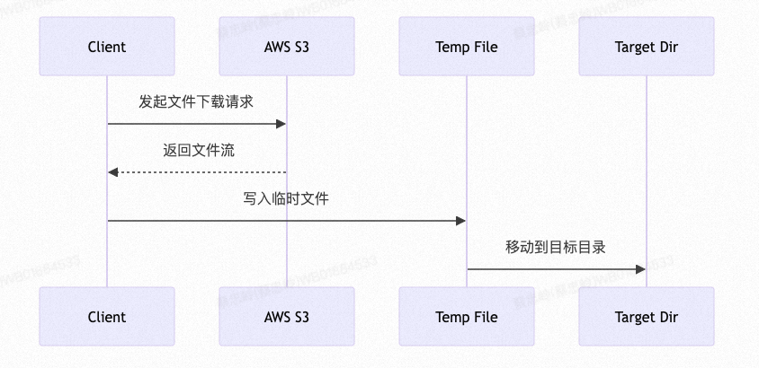
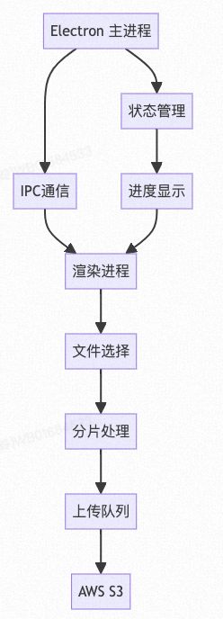

# 前端大文件传输与资源管理技术详解

## 一、AWS流式文件下载与本地文件流写入实现

### 1.1 基本概念

**流式传输定义：将数据分成小块连续传输的过程，无需等待整个文件加载完成。**

优势：
1. 减少内存占用
2. 提供实时数据处理
3. 支持大文件传输

```ts
// Web Streams API示例
interface StreamExample {
  // 可读流：用于从数据源读取数据
  readable: ReadableStream;
  // 可写流：用于写入数据到目标
  writable: WritableStream;
  // 转换流：用于数据处理和转换
  transform: TransformStream;
}
```
### 1.2 实现架构

**架构图**


**实现流程图**


### 1.3 背压控制

> node中pipe自带背压控制机制

---
**什么是背压？**

背压是在数据流传输过程中，当下游消费数据的速度慢于上游生产数据的速度时，为了防止内存溢出而采取的一种流量控制机制。

**为什么要背压控制**

1. 防止内存溢出

 - 没有背压控制时，数据会不断累积在内存中
 - 最终可能导致程序崩溃

2. 保证数据处理质量

 - 确保下游有足够时间处理数据
 - 避免数据丢失或处理错误

3. 系统稳定性

 - 合理利用系统资源
 - 防止系统过载

### 1.3 实现步骤

---

#### 下载器S3StreamDownloader

```ts
/**
 * AWS文件流式下载管理器
 * 实现文件从S3流式下载到本地的完整流程
 * 
 * 功能:
 * 1. 从AWS S3下载文件
 * 2. 支持流式传输
 * 3. 临时文件管理
 * 4. 错误处理和清理
 */
import { S3 } from 'aws-sdk';
import { createWriteStream } from 'fs'
import { mkdir, rename,unlink } from 'fs/promises';
import { join } from 'path';
import { pipeline } from 'stream/promises';

class S3StreamDownloader extends EventEmitter {
  /** AWS S3客户端实例 */
  private readonly s3: S3;
  /** 临时文件存储目录 */
  private readonly tempDir: string;
  /** 目标文件存储目录 */
  private readonly targetDir: string;

  private downloadedBytes: number = 0;
  /**
   * 初始化下载管理器
   * @param config 配置对象
   * @param config.accessKeyId AWS访问密钥ID
   * @param config.secretAccessKey AWS秘密访问密钥
   * @param config.region AWS区域
   * @param config.tempDir 临时文件目录路径
   * @param config.targetDir 目标文件目录路径
   */
  constructor(config: {
    accessKeyId: string;
    secretAccessKey: string;
    region: string;
    tempDir: string;
    targetDir: string;
  }) {
    super(); // 初始化EventEmitter
    // 初始化AWS S3客户端
    this.s3 = new S3({
      accessKeyId: config.accessKeyId,
      secretAccessKey: config.secretAccessKey,  
      region: config.region
    });

    this.tempDir = config.tempDir;
    this.targetDir = config.targetDir;
  }

  /**
   * 流式下载文件
   * 从S3下载文件并保存到本地
   * 
   * @param bucket S3桶名
   * @param key 文件键值(S3中的文件路径)
   * @param filename 下载后的目标文件名
   * @returns 成功时返回目标文件路径,失败时抛出错误
   * 
   * 执行流程:
   * 1. 创建临时目录
   * 2. 建立S3读取流
   * 3. 创建本地写入流
   * 4. 通过管道传输数据
   * 5. 移动文件到最终位置
   */
  async downloadFile(bucket: string, key: string, filename: string): Promise<void> {
      // 确保临时目录存在
      await mkdir(this.tempDir, { recursive: true });
      
      // 生成临时文件路径
      const tempFilePath = join(this.tempDir, `${filename}.temp`);
      // 生成最终文件路径 
      const targetFilePath = join(this.targetDir, filename);
    try {
      // 重置下载计数
      this.downloadedBytes = 0;

      // 获取文件大小用于进度计算
      const { ContentLength } = await this.s3.headObject({
        Bucket: bucket,
        Key: key
      }).promise();

      // 触发开始事件
      this.emit('start', { 
        filename,
        totalBytes: ContentLength 
      });

      // 获取S3文件流
      const s3Stream = this.s3.getObject({
        Bucket: bucket,
        Key: key
      }).createReadStream();

      // 创建写入流
      const writeStream = createWriteStream(tempFilePath);

      // 使用pipeline处理流传输
      await pipeline(
        s3Stream,
        this.createTransformStream(), // 可选的转换流
        writeStream
      );

      // 文件下载完成后，移动到目标位置
      await rename(tempFilePath, targetFilePath);

      // 下载完成事件
      this.emit('complete', {
        filename,
        totalBytes: this.downloadedBytes
      });
    } catch (error) {
      // 清理临时文件
      await this.cleanup(tempFilePath);
      // 触发错误事件
      this.emit('error', error);
      throw new Error(`Download failed: ${error.message}`);
    }
  }

  /**
   * 创建转换流
   * 用于处理下载进度、速率限制等
   * 
   * 功能:
   * 1. 统计下载字节数
   * 2. 触发进度事件
   * 3. 可扩展实现速率限制
   * 
   * @returns Transform流实例
   */
  private createTransformStream() {
    const { Transform } = require('stream');
    const self = this; // 保存外层this引用
    return new Transform({
      transform(chunk: Buffer, encoding: string, callback: Function) {
        // 更新已下载字节数
        self.downloadedBytes += chunk.length;
        
        // 通过外层实例触发事件
        self.emit('progress', {
          downloadedBytes: self.downloadedBytes,
          chunk: chunk.length
        });

        callback(null, chunk);
      }
    });
  }

  /**
   * 清理临时文件
   * 用于错误发生时清理未完成的临时文件
   * 
   * @param tempFilePath 临时文件路径
   */
  private async cleanup(tempFilePath: string): Promise<void> {
    try {
      await unlink(tempFilePath);
    } catch (error) {
      console.error(`Cleanup failed: ${error.message}`);
    }
  }

  /**
   * 可扩展的其他方法:
   * 
   * 1. pauseDownload(): 暂停下载
   *    - 暂停流传输
   *    - 保存下载状态
   * 
   * 2. resumeDownload(): 恢复下载
   *    - 读取暂停状态
   *    - 继续流传输
   * 
   * 3. cancelDownload(): 取消下载
   *    - 终止流传输
   *    - 清理临时文件
   * 
   * 4. getProgress(): 获取下载进度
   *    - 返回下载百分比
   *    - 返回传输速率
   * 
   * 5. validateFile(): 验证文件完整性
   *    - 校验文件大小
   *    - 验证文件哈希
   */
}

/**
 * 使用示例:
 * 
 * const downloader = new S3StreamDownloader({
 *   accessKeyId: 'your-access-key',
 *   secretAccessKey: 'your-secret-key',
 *   region: 'us-east-1',
 *   tempDir: '/tmp/downloads',
 *   targetDir: '/data/files'
 * });
 * 
 * try {
 *   await downloader.downloadFile(
 *     'my-bucket',
 *     'path/to/file.zip',
 *     'downloaded-file.zip'
 *   );
 *   console.log('Download completed successfully');
 * } catch (error) {
 *   console.error('Download failed:', error);
 * }
 */


```

#### 背压控制转换流createTransformStream

```ts
/**
 * 创建转换流
 * 用于处理下载进度、速率限制等
 * 
 * 功能:
 * 1. 统计下载字节数
 * 2. 触发进度事件
 * 3. 背压控制
 * 4. 速率限制
 * 
 * @returns Transform流实例
 */
private createTransformStream() {
  const { Transform } = require('stream');
  const self = this;

  // 配置参数
  const CHUNK_SIZE = 64 * 1024; // 64KB 块大小
  const HIGH_WATER_MARK = 1024 * 1024; // 1MB 高水位线
  const RATE_LIMIT = 10 * 1024 * 1024; // 10MB/s 速率限制
  
  let lastTime = Date.now();
  let bytesThisSecond = 0;

  return new Transform({
    // 设置高水位线，用于背压控制
    highWaterMark: HIGH_WATER_MARK,

    transform(chunk: Buffer, encoding: string, callback: Function) {
      try {
        // 速率限制检查
        const now = Date.now();
        const timeDiff = now - lastTime;
        
        if (timeDiff >= 1000) {
          // 重置计数器
          bytesThisSecond = 0;
          lastTime = now;
        }

        bytesThisSecond += chunk.length;
        const currentRate = bytesThisSecond * (1000 / timeDiff);

        if (currentRate > RATE_LIMIT) {
          // 如果超过速率限制，延迟处理
          const delay = Math.ceil((bytesThisSecond / RATE_LIMIT) * 1000 - timeDiff);
          setTimeout(() => {
            this.processChunk(chunk, callback);
          }, delay);
          return;
        }

        this.processChunk(chunk, callback);
      } catch (error) {
        callback(error);
      }
    },

    // 自定义方法处理数据块
    processChunk(chunk: Buffer, callback: Function) {
      // 更新下载进度
      self.downloadedBytes += chunk.length;

      // 计算下载速度
      const now = Date.now();
      const speed = self.downloadedBytes / ((now - self.startTime) / 1000);

      // 触发进度事件
      self.emit('progress', {
        downloadedBytes: self.downloadedBytes,
        chunk: chunk.length,
        speed,
        timestamp: now
      });

      // 检查写入流的背压状态
      const canContinue = this.push(chunk);

      if (!canContinue) {
        // 如果下游背压已经触发，等待 drain 事件
        this.once('drain', () => {
          callback(null);
        });
      } else {
        // 否则直接继续处理
        callback(null);
      }
    },

    // 可选: 实现 flush 方法处理剩余数据
    flush(callback: Function) {
      // 处理任何剩余的数据
      callback();
    },

    // 可选: 实现 destroy 方法清理资源
    destroy(error: Error | null, callback: Function) {
      // 清理任何资源
      callback(error);
    }
  });
}

```

#### 批量下载管理器BatchDownloader

```ts
/**
 * 批量下载管理器
 * 处理多文件并行下载
 */
class BatchDownloader {
  private readonly downloader: S3StreamDownloader;
  private readonly concurrency: number;

  constructor(config: {
    s3Config: S3Config;
    concurrency: number;
  }) {
    this.downloader = new S3StreamDownloader(config.s3Config);
    this.concurrency = config.concurrency;
  }
  /**
   * 批量下载文件
   * @param files 待下载文件列表
   */
  async downloadFiles(files: Array<{
    bucket: string;
    key: string;
    filename: string;
  }>): Promise<void> {
    // 创建下载任务
    const tasks = files.map(file => async () => {
      try {
        await this.downloader.downloadFile(
          file.bucket,
          file.key,
          file.filename
        );
      } catch (error) {
        console.error(`Failed to download ${file.filename}: ${error.message}`);
        throw error;
      }
    });

    // 并行执行下载任务
    await this.runConcurrent(tasks, this.concurrency);
  }

  /**
   * 并行执行任务
   */
  private async runConcurrent(
    tasks: Array<() => Promise<void>>,
    concurrency: number
  ): Promise<void> {
    const running = new Set<Promise<void>>();
    const results: Promise<void>[] = [];

    for (const task of tasks) {
      const promise = task();
      results.push(promise);
      running.add(promise);
      
      promise.finally(() => running.delete(promise));

      if (running.size >= concurrency) {
        await Promise.race(running);
      }
    }

    await Promise.all(results);
  }
}
```

#### 进度条管理

```ts

/**
 * 进度监控示例
 */
/**
 * 下载进度监控类
 * 用于实时监控和显示文件下载的进度、速度等信息
 */
class DownloadProgress {
  /** 文件总大小(字节) */
  private totalBytes: number = 0;
  
  /** 已下载字节数 */
  private downloadedBytes: number = 0;
  
  /** 下载开始时间戳 */
  private startTime: number = Date.now();

  /**
   * 处理下载进度更新
   * @param progress 进度信息对象
   * @param progress.downloadedBytes 已下载的总字节数
   * @param progress.chunk 本次新增的字节数
   */
  onProgress(progress: { downloadedBytes: number, chunk: number }) {
    // 累加已下载字节数
    this.downloadedBytes += progress.chunk;
    
    // 计算已经过的时间(秒)
    const elapsed = (Date.now() - this.startTime) / 1000;
    
    // 计算下载速度(字节/秒)
    const speed = this.downloadedBytes / elapsed;
    
    // 计算下载进度百分比
    const percentage = (this.downloadedBytes / this.totalBytes) * 100;

    // 输出格式化的下载信息
    console.log(`
      Downloaded: ${this.formatBytes(this.downloadedBytes)}
      Speed: ${this.formatBytes(speed)}/s  
      Progress: ${percentage.toFixed(2)}%
    `);
  }

  /**
   * 将字节数转换为可读的格式
   * @param bytes 字节数
   * @returns 格式化后的字符串，如 "1.23 MB"
   */
  private formatBytes(bytes: number): string {
    // 定义单位数组
    const units = ['B', 'KB', 'MB', 'GB'];
    
    // 初始大小为输入字节数
    let size = bytes;
    
    // 当前单位索引
    let unitIndex = 0;

    // 当数字大于1024且还有更大的单位可用时，进行单位转换
    while (size >= 1024 && unitIndex < units.length - 1) {
      size /= 1024; // 除以1024进行单位转换
      unitIndex++; // 移动到下一个单位
    }

    // 返回格式化后的字符串，保留2位小数
    return `${size.toFixed(2)} ${units[unitIndex]}`;
  }
}

```

### 1.4 使用示例

1. 基本用法
```ts
// 创建下载器实例
const downloader = new S3StreamDownloader({
  accessKeyId: 'YOUR_ACCESS_KEY',
  secretAccessKey: 'YOUR_SECRET_KEY',
  region: 'us-east-1',
  tempDir: '/tmp/downloads',
  targetDir: '/data/files'
});

// 下载单个文件
await downloader.downloadFile(
  'my-bucket',
  'path/to/large-file.zip',
  'large-file.zip'
);

```

2. 批量下载

```ts
// 创建批量下载器
const batchDownloader = new BatchDownloader({
  s3Config: {
    // S3配置...
  },
  concurrency: 3
});

// 批量下载文件
await batchDownloader.downloadFiles([
  {
    bucket: 'my-bucket',
    key: 'file1.pdf',
    filename: 'file1.pdf'
  },
  {
    bucket: 'my-bucket',
    key: 'file2.pdf',
    filename: 'file2.pdf'
  }
]);

```

3. 进度监控
```ts
const progress = new DownloadProgress();
const downloader = new S3StreamDownloader({
  // 配置...
});

// 监听各类事件
downloader.on('start', (info) => {
  console.log(`Starting download: ${info.filename}`);
  console.log(`Total size: ${info.totalBytes} bytes`);
});

downloader.on('progress', (progress) => {
   progress.onProgress(progress);
  console.log(`Downloaded: ${progress.downloadedBytes} bytes`);
  console.log(`Current chunk: ${progress.chunk} bytes`);
});

downloader.on('complete', (info) => {
  console.log(`Download complete: ${info.filename}`);
  console.log(`Total downloaded: ${info.totalBytes} bytes`);
});

downloader.on('error', (error) => {
  console.error('Download failed:', error);
});


```

## 二、ELectron大文件分片上传、断点续传、并行上传


### 2.1 基础系统架构




### 2.2 文件夹结构
```markdown
src/
  ├── main/
  │   ├── s3/
  │   │   ├── S3Client.ts       // S3 操作封装
  │   │   └── types.ts          // 类型定义
  │   ├── upload/
  │   │   ├── FileHandler.ts    // 文件处理
  │   │   ├── UploadManager.ts  // 上传管理
  │   │   ├── UploadTask.ts     // 上传任务
  │   │   └── utils.ts          // 工具函数
  │   └── index.ts              // 主进程入口
  └── renderer/
      ├── components/
      │   └── Upload.tsx        // 上传组件
      └── index.tsx             // 渲染进程入口
```

### 2.3 基本数据结构

**基本配置项**
```ts
/**
 * AWS S3 配置接口
 * 定义连接 AWS S3 所需的基本配置项
 */
export interface S3Config {
  /** AWS访问密钥ID */
  accessKeyId: string;
  
  /** AWS秘密访问密钥 */
  secretAccessKey: string;
  
  /** AWS区域标识符(如 us-east-1) */
  region: string;
  
  /** S3存储桶名称 */
  bucket: string;
}

/**
 * 文件分片信息接口
 * 定义单个分片的详细信息
 */
export interface UploadChunk {
  /** 分片序号(从0开始) */
  index: number;
  
  /** 分片在文件中的起始位置(字节) */
  start: number;
  
  /** 分片在文件中的结束位置(字节) */
  end: number;
  
  /** 分片大小(字节) */
  size: number;
  
  /** 分片上传状态(pending|uploading|completed|failed) */
  status: ChunkStatus;
  
  /** 
   * 分片上传后的ETag标识
   * AWS S3返回的用于验证分片完整性的标识符
   */
  etag?: string;
}

/**
 * 断点续传检查点数据接口
 * 用于保存上传进度,支持断点续传
 */
export interface CheckpointData {
  /** 文件唯一标识符 */
  fileId: string;
  
  /** 文件名称 */
  fileName: string;
  
  /** 
   * 分片上传ID
   * AWS S3的multipart upload ID
   */
  uploadId: string;
  
  /** 所有分片信息数组 */
  chunks: UploadChunk[];
  
  /** 
   * 上传进度百分比
   * 范围0-100
   */
  progress: number;
}


```

**状态管理**
```ts
/**
 * 上传任务状态枚举
 * 定义整体上传任务的所有可能状态
 */
export enum UploadStatus {
  /** 等待上传 - 初始状态 */
  PENDING = 'pending',
  
  /** 正在上传 - 数据传输中 */
  UPLOADING = 'uploading',
  
  /** 已暂停 - 用户手动暂停或系统自动暂停 */
  PAUSED = 'paused',
  
  /** 已完成 - 所有分片上传成功并合并 */
  COMPLETED = 'completed',
  
  /** 错误 - 上传过程中发生错误 */
  ERROR = 'error'
}

/**
 * 分片状态枚举
 * 定义单个分片的所有可能状态
 */
export enum ChunkStatus {
  /** 等待上传 - 分片初始状态 */
  PENDING = 'pending',
  
  /** 正在上传 - 分片数据传输中 */
  UPLOADING = 'uploading',
  
  /** 上传成功 - 分片完成上传并验证 */
  SUCCESS = 'success',
  
  /** 上传失败 - 分片上传过程出错 */
  ERROR = 'error'
}

/**
 * 上传进度接口
 * 用于跟踪和报告上传进度
 */
export interface UploadProgress {
  /** 上传任务唯一标识符 */
  taskId: string;
  
  /** 已上传的字节数 */
  loaded: number;
  
  /** 文件总字节数 */
  total: number;
  
  /** 
   * 上传进度百分比 
   * 计算公式: (loaded / total) * 100
   */
  progress: number;
}

```

### 2.4 核心模块功能

```markdown
- FileHandler - 文件处理模块
  - 文件分片
  - 计算MD5
  - 读取文件流

- UploadManager - 上传管理模块  
  - 任务队列管理
  - 并发控制
  - 断点续传管理
  - 进度跟踪

- S3Client - S3操作模块
  - 初始化上传
  - 上传分片
  - 合并分片
  - 中止上传

```

### 2.5 主要流程

```ts
1. 初始化上传
- 检查是否存在断点记录
- 计算文件MD5作为唯一标识
- 调用 S3 createMultipartUpload
- 保存 uploadId

2. 分片处理  
- 根据文件大小和分片大小计算分片
- 生成每个分片的信息(序号、偏移量、大小)
- 存储分片信息用于断点续传

3. 并行上传
- 维护上传队列
- 控制并发数量
- 处理超时和重试
- 记录已上传分片

4. 断点续传
- 定期保存上传状态
- 启动时检查断点记录
- 仅上传未完成的分片
- 超时/错误时保存进度

5. 完成上传
- 验证所有分片上传成功
- 调用 completeMultipartUpload
- 清理断点记录

```

### 2.6 核心技术

 --- 

#### 分片上传
实现：
```markdown
- 使用 File API 的 slice 方法将文件切分成固定大小的块
- 每个分片包含: 序号、起始位置、结束位置、大小等信息
- 使用 createReadStream 读取分片内容
- 利用 S3 的 multipart upload API 上传每个分片

主要代码逻辑:
file.slice(start, end) -> 生成分片
createReadStream(file, {start, end}) -> 读取分片内容 
s3.uploadPart() -> 上传分片到S3
```
**分片处理：**
```ts
/**
 * 将文件分割成固定大小的分片
 * 用于大文件分片上传
 * 
 * @param file 要上传的文件对象
 * @param chunkSize 分片大小(单位:字节)
 * @returns 分片信息数组
 * 
 * @example
 * const file = new File(['content'], 'test.txt');
 * const chunks = createChunks(file, 1024 * 1024); // 1MB分片
 */
function createChunks(file: File, chunkSize: number) {
  // 存储所有分片信息
  const chunks = [];
  
  // 循环生成分片
  // start: 当前分片的起始位置
  // file.size: 文件总大小
  // chunkSize: 每次增加一个分片大小
  for(let start = 0; start < file.size; start += chunkSize) {
    chunks.push({
      // 分片起始位置
      start,
      
      // 分片结束位置
      // Math.min确保最后一个分片不会超出文件大小
      end: Math.min(start + chunkSize, file.size)
    });
  }
  
  return chunks;
}

/**
 * 使用示例:
 */
interface Chunk {
  start: number;  // 分片起始字节
  end: number;    // 分片结束字节
}

// 优化版本
function createChunksOptimized(file: File, options: {
  chunkSize?: number;      // 分片大小
  maxChunks?: number;      // 最大分片数
  minChunkSize?: number;   // 最小分片大小
}) {
  const {
    chunkSize = 5 * 1024 * 1024,  // 默认5MB
    maxChunks = 10000,            // 最大分片数
    minChunkSize = 1024 * 1024    // 最小1MB
  } = options;

  // 计算最优分片大小
  const optimalChunkSize = Math.max(
    minChunkSize,
    Math.ceil(file.size / maxChunks)
  );

  // 使用优化后的分片大小
  return createChunks(file, optimalChunkSize);
}

// 使用方法
const file = new File(['content'], 'test.txt');

// 基础用法
const chunks = createChunks(file, 1024 * 1024);

// 优化用法
const optimizedChunks = createChunksOptimized(file, {
  chunkSize: 2 * 1024 * 1024,  // 2MB分片
  maxChunks: 1000,             // 最多1000个分片
  minChunkSize: 1024 * 1024    // 最小1MB
});

/**
 * 注意事项:
 * 1. 分片大小建议:
 *    - 最小 1MB (过小会增加请求次数)
 *    - 最大 5GB (S3单片上传限制)
 *    - 推荐 5MB (AWS官方建议)
 * 
 * 2. 分片数量建议:
 *    - 最大 10000 (S3 multipart限制)
 *    - 建议控制在1000以内
 * 
 * 3. 性能考虑:
 *    - 分片太小: 请求次数多,效率低
 *    - 分片太大: 单片失败影响大,重试代价高
 *    - 需要根据网络状况和文件大小调整
 * 
 * 4. 内存使用:
 *    - 分片信息数组占用空间小
 *    - 实际分片数据使用流式处理
 *    - 不会一次性加载整个文件
 */

```
**分片上传：**
```ts
/**
 * 上传单个分片到 AWS S3
 * 使用 multipart upload API 上传文件分片
 * 
 * @param params 上传参数
 * @param params.key 文件在S3中的唯一标识符(文件路径)
 * @param params.uploadId 分片上传任务的ID
 * @param params.partNumber 分片序号(1-10000)
 * @param params.body 分片数据Buffer
 * 
 * @returns 上传成功的分片信息
 * @returns {number} PartNumber - 分片序号
 * @returns {string} ETag - 分片的MD5校验值
 * 
 * @throws 上传失败时抛出错误
 * 
 * @example
 * const result = await uploadPart({
 *   key: 'path/to/file.txt',
 *   uploadId: 'xxx',
 *   partNumber: 1,
 *   body: Buffer.from('data')
 * });
 */
async uploadPart(params: {
    /** 文件在S3中的键值 */
    key: string,
    /** Multipart Upload ID */
    uploadId: string,
    /** 分片序号(1-10000) */
    partNumber: number,
    /** 分片数据 */
    body: Buffer
  }) {
    try {
      // 调用S3 API上传分片
      const response = await this.s3.uploadPart({
        // S3存储桶名称
        Bucket: this.config.bucket,
        // 文件键值(路径)
        Key: params.key,
        // 分片上传ID
        UploadId: params.uploadId,
        // 分片序号
        PartNumber: params.partNumber,
        // 分片数据
        Body: params.body
      }).promise();

      // 返回上传成功的分片信息
      return {
        PartNumber: params.partNumber,
        ETag: response.ETag // 用于后续完成上传时的分片验证
      };
    } catch (error) {
      // 包装错误信息
      throw new Error(`Failed to upload part: ${error.message}`);
    }
  }

/**
 * 使用说明:
 * 
 * 1. 分片大小限制:
 *    - 最小: 5MB
 *    - 最大: 5GB
 *    - 最后一片可以小于5MB
 * 
 * 2. 分片序号范围:
 *    - 最小: 1
 *    - 最大: 10000
 * 
 * 3. 注意事项:
 *    - ETag需要保存用于完成上传
 *    - 分片必须按顺序上传
 *    - 建议实现重试机制
 * 
 * 4. 错误处理:
 *    - 网络错误
 *    - 超时错误
 *    - 权限错误
 *    - 存储桶不存在
 * 
 * 5. 优化建议:
 *    - 实现并发控制
 *    - 添加进度回调
 *    - 支持取消上传
 *    - 实现断点续传
 */
```
--- 

#### 断点续传

**实现思路：**
```markdown
- 使用 electron-store 持久化存储上传状态
- 记录: uploadId、已上传分片信息、文件标识等
- 启动时检查是否存在未完成的上传任务
- 只上传未完成的分片

核心数据结构:
{
  fileId: string,      // 文件唯一标识
  uploadId: string,    // S3上传ID 
  chunks: [            // 分片信息
    {
      index: number,   // 分片序号
      status: string,  // 上传状态
      etag: string     // S3返回的标识
    }
  ]
}
```

--- 

#### 并行上传


**实现思路：**
```ts
- 维护上传队列和并发计数
- 使用 Promise.all 控制并发数
- 任务池模式管理上传任务
- 错误重试机制

实现思路:
1. 初始化任务队列
2. 取出 N 个任务并行执行
3. 某个任务完成后,立即开始下一个
4. 控制最大并发数

```

```ts
// 并发控制
async function uploadChunks(chunks: Chunk[], maxConcurrent: number) {
  const queue = [...chunks];
  const executing = new Set();
  
  while(queue.length > 0) {
    if(executing.size >= maxConcurrent) {
      await Promise.race(executing);
      continue;
    }
    
    const chunk = queue.shift();
    const promise = uploadChunk(chunk)
      .finally(() => executing.delete(promise));
      
    executing.add(promise);
  }
  
  await Promise.all(executing);
}
```


### 2.7 核心代码
---

#### S3Client

```ts
import AWS from 'aws-sdk';
import { S3Config } from './types';

export class S3Client {
  private s3: AWS.S3;

  constructor(config: S3Config) {
    this.s3 = new AWS.S3({
      accessKeyId: config.accessKeyId,
      secretAccessKey: config.secretAccessKey,
      region: config.region
    });
  }

  async initializeMultipartUpload(key: string) {
    try {
      const response = await this.s3.createMultipartUpload({
        Bucket: this.config.bucket,
        Key: key
      }).promise();
      
      return response.UploadId;
    } catch (error) {
      throw new Error(`Failed to initialize multipart upload: ${error.message}`);
    }
  }

  async uploadPart(params: {
    key: string,
    uploadId: string,
    partNumber: number,
    body: Buffer
  }) {
    try {
      const response = await this.s3.uploadPart({
        Bucket: this.config.bucket,
        Key: params.key,
        UploadId: params.uploadId,
        PartNumber: params.partNumber,
        Body: params.body
      }).promise();

      return {
        PartNumber: params.partNumber,
        ETag: response.ETag
      };
    } catch (error) {
      throw new Error(`Failed to upload part: ${error.message}`);
    }
  }

  async completeMultipartUpload(params: {
    key: string,
    uploadId: string,
    parts: AWS.S3.CompletedPart[]
  }) {
    try {
      await this.s3.completeMultipartUpload({
        Bucket: this.config.bucket,
        Key: params.key,
        UploadId: params.uploadId,
        MultipartUpload: { Parts: params.parts }
      }).promise();
    } catch (error) {
      throw new Error(`Failed to complete multipart upload: ${error.message}`);
    }
  }

  async abortMultipartUpload(key: string, uploadId: string) {
    try {
      await this.s3.abortMultipartUpload({
        Bucket: this.config.bucket,
        Key: key,
        UploadId: uploadId
      }).promise();
    } catch (error) {
      throw new Error(`Failed to abort multipart upload: ${error.message}`);
    }
  }
}

```

#### 文件处理器 (FileHandler.ts)

```ts
import { createHash } from 'crypto';
import { createReadStream } from 'fs';
import { UploadChunk } from './types';

export class FileHandler {
  static async calculateMD5(filePath: string): Promise<string> {
    return new Promise((resolve, reject) => {
      const hash = createHash('md5');
      const stream = createReadStream(filePath);

      stream.on('data', data => hash.update(data));
      stream.on('end', () => resolve(hash.digest('hex')));
      stream.on('error', reject);
    });
  }

  static createChunks(fileSize: number, partSize: number): UploadChunk[] {
    const chunks: UploadChunk[] = [];
    let index = 0;
    
    for (let start = 0; start < fileSize; start += partSize) {
      const end = Math.min(start + partSize, fileSize);
      chunks.push({
        index,
        start,
        end,
        size: end - start,
        status: ChunkStatus.PENDING
      });
      index++;
    }

    return chunks;
  }

  static async readChunk(filePath: string, start: number, end: number): Promise<Buffer> {
    return new Promise((resolve, reject) => {
      const chunks: Buffer[] = [];
      const stream = createReadStream(filePath, { start, end: end - 1 });

      stream.on('data', chunk => chunks.push(chunk));
      stream.on('end', () => resolve(Buffer.concat(chunks)));
      stream.on('error', reject);
    });
  }
}

```

#### 上传任务类 (UploadTask.ts)

```ts
import { EventEmitter } from 'events';
import { S3Client } from '../s3/S3Client';
import { FileHandler } from './FileHandler';
import { CheckpointData, UploadStatus, ChunkStatus } from './types';

export class UploadTask extends EventEmitter {
  private status: UploadStatus = UploadStatus.PENDING;
  private checkpoint: CheckpointData;
  private uploadingChunks: Set<number> = new Set();

  constructor(
    public readonly taskId: string,
    private filePath: string,
    private fileName: string,
    private s3Client: S3Client,
    private config: {
      partSize: number;
      maxConcurrent: number;
      retryTimes: number;
    }
  ) {
    super();
  }

  async start() {
    try {
      this.status = UploadStatus.UPLOADING;
      
      // 初始化或恢复检查点
      await this.initializeCheckpoint();
      
      // 开始上传
      await this.uploadChunks();
      
      // 完成上传
      if (this.allChunksUploaded()) {
        await this.completeUpload();
      }
    } catch (error) {
      this.status = UploadStatus.ERROR;
      this.emit('error', error);
    }
  }

  pause() {
    this.status = UploadStatus.PAUSED;
    this.emit('pause');
  }

  resume() {
    if (this.status === UploadStatus.PAUSED) {
      this.status = UploadStatus.UPLOADING;
      this.uploadChunks();
      this.emit('resume');
    }
  }

  private async initializeCheckpoint() {
    if (!this.checkpoint) {
      const fileId = await FileHandler.calculateMD5(this.filePath);
      const uploadId = await this.s3Client.initializeMultipartUpload(this.fileName);
      
      this.checkpoint = {
        fileId,
        fileName: this.fileName,
        uploadId,
        chunks: FileHandler.createChunks(this.fileSize, this.config.partSize),
        progress: 0
      };
    }
  }

  private async uploadChunks() {
    while (this.status === UploadStatus.UPLOADING) {
      if (this.uploadingChunks.size >= this.config.maxConcurrent) {
        await new Promise(resolve => setTimeout(resolve, 100));
        continue;
      }

      const chunk = this.getNextChunk();
      if (!chunk) break;

      this.uploadChunk(chunk);
    }
  }

  private async uploadChunk(chunk: UploadChunk) {
    this.uploadingChunks.add(chunk.index);
    chunk.status = ChunkStatus.UPLOADING;

    try {
      const data = await FileHandler.readChunk(
        this.filePath,
        chunk.start,
        chunk.end
      );

      const result = await this.s3Client.uploadPart({
        key: this.fileName,
        uploadId: this.checkpoint.uploadId,
        partNumber: chunk.index + 1,
        body: data
      });

      chunk.status = ChunkStatus.SUCCESS;
      chunk.etag = result.ETag;
      
      this.updateProgress();
    } catch (error) {
      chunk.status = ChunkStatus.ERROR;
      this.emit('error', error);
    } finally {
      this.uploadingChunks.delete(chunk.index);
    }
  }

  private getNextChunk(): UploadChunk | null {
    return this.checkpoint.chunks.find(
      chunk => chunk.status === ChunkStatus.PENDING
    );
  }

  private updateProgress() {
    const uploaded = this.checkpoint.chunks.reduce(
      (sum, chunk) => sum + (chunk.status === ChunkStatus.SUCCESS ? chunk.size : 0),
      0
    );

    this.checkpoint.progress = uploaded / this.fileSize;
    this.emit('progress', {
      taskId: this.taskId,
      loaded: uploaded,
      total: this.fileSize,
      progress: this.checkpoint.progress
    });
  }

  private async completeUpload() {
    const parts = this.checkpoint.chunks
      .map(chunk => ({
        PartNumber: chunk.index + 1,
        ETag: chunk.etag
      }))
      .sort((a, b) => a.PartNumber - b.PartNumber);

    await this.s3Client.completeMultipartUpload({
      key: this.fileName,
      uploadId: this.checkpoint.uploadId,
      parts
    });

    this.status = UploadStatus.COMPLETED;
    this.emit('complete');
  }
}

```

#### 上传管理器 (UploadManager.ts)

```ts
import { EventEmitter } from 'events';
import Store from 'electron-store';
import { S3Client } from '../s3/S3Client';
import { UploadTask } from './UploadTask';
import { S3Config, CheckpointData } from './types';

export class UploadManager extends EventEmitter {
  private tasks: Map<string, UploadTask> = new Map();
  private store: Store;
  private s3Client: S3Client;

  constructor(
    s3Config: S3Config,
    private config = {
      partSize: 5 * 1024 * 1024,
      maxConcurrent: 3,
      retryTimes: 3
    }
  ) {
    super();
    this.s3Client = new S3Client(s3Config);
    this.store = new Store({ name: 'upload-checkpoint' });
    this.loadCheckpoints();
  }

  addTask(filePath: string, fileName: string): string {
    const taskId = Date.now().toString();
    const task = new UploadTask(
      taskId,
      filePath,
      fileName,
      this.s3Client,
      this.config
    );

    this.tasks.set(taskId, task);
    
    task.on('progress', this.handleProgress.bind(this));
    task.on('error', this.handleError.bind(this));
    task.on('complete', () => this.handleComplete(taskId));

    return taskId;
  }

  startUpload(taskId: string) {
    const task = this.tasks.get(taskId);
    if (task) {
      task.start();
    }
  }

  pauseUpload(taskId: string) {
    const task = this.tasks.get(taskId);
    if (task) {
      task.pause();
    }
  }

  resumeUpload(taskId: string) {
    const task = this.tasks.get(taskId);
    if (task) {
      task.resume();
    }
  }

  private handleProgress(progress: UploadProgress) {
    this.emit('progress', progress);
    this.saveCheckpoint(progress.taskId);
  }

  private handleError(taskId: string, error: Error) {
    this.emit('error', taskId, error);
  }

  private handleComplete(taskId: string) {
    this.emit('complete', taskId);
    this.clearCheckpoint(taskId);
    this.tasks.delete(taskId);
  }

  private saveCheckpoint(taskId: string) {
    const task = this.tasks.get(taskId);
    if (task) {
      this.store.set(`checkpoints.${taskId}`, task.checkpoint);
    }
  }

  private loadCheckpoints() {
    const checkpoints = this.store.get('checkpoints') as Record<string, CheckpointData>;
    if (checkpoints) {
      Object.entries(checkpoints).forEach(([taskId, checkpoint]) => {
        // 恢复上传任务
        const task = new UploadTask(
          taskId,
          checkpoint.fileName,
          this.s3Client,
          this.config
        );
        task.checkpoint = checkpoint;
        this.tasks.set(taskId, task);
      });
    }
  }

  private clearCheckpoint(taskId: string) {
    this.store.delete(`checkpoints.${taskId}`);
  }
}

```

#### 渲染进程上传组件 (Upload.tsx)

```ts
import React, { useState, useCallback, useEffect } from 'react';
import { ipcRenderer } from 'electron';

// 上传文件的状态类型
interface UploadFile {
  id: string;          // 文件唯一标识
  file: File;          // 原始文件对象
  progress: number;    // 上传进度(0-100)
  status: 'pending' | 'uploading' | 'paused' | 'completed' | 'error';
  error?: string;      // 错误信息
}

// 上传进度事件数据类型
interface ProgressEvent {
  taskId: string;
  loaded: number;
  total: number;
  progress: number;
}

export const Upload: React.FC = () => {
  // 上传文件列表状态
  const [uploadFiles, setUploadFiles] = useState<UploadFile[]>([]);
  
  // 是否正在上传标志
  const [isUploading, setIsUploading] = useState(false);

  /**
   * 组件卸载时清理事件监听
   */
  useEffect(() => {
    return () => {
      // 清理所有上传相关的事件监听
      uploadFiles.forEach(file => {
        ipcRenderer.removeAllListeners(`upload:progress:${file.id}`);
        ipcRenderer.removeAllListeners(`upload:error:${file.id}`);
        ipcRenderer.removeAllListeners(`upload:complete:${file.id}`);
      });
    };
  }, [uploadFiles]);

  /**
   * 处理文件选择
   */
  const handleFileSelect = useCallback((event: React.ChangeEvent<HTMLInputElement>) => {
    if (event.target.files) {
      // 将选择的文件转换为上传文件对象
      const newFiles: UploadFile[] = Array.from(event.target.files).map(file => ({
        id: `file_${Date.now()}_${file.name}`, // 生成唯一ID
        file,
        progress: 0,
        status: 'pending'
      }));

      setUploadFiles(prev => [...prev, ...newFiles]);
    }
  }, []);

  /**
   * 开始上传所有文件
   */
  const handleUploadAll = useCallback(async () => {
    setIsUploading(true);

    // 遍历待上传文件列表
    for (const uploadFile of uploadFiles.filter(f => f.status === 'pending')) {
      try {
        // 调用主进程的上传方法
        const taskId = await ipcRenderer.invoke('upload:start', {
          filePath: uploadFile.file.path,
          fileName: uploadFile.file.name
        });

        // 更新文件状态为上传中
        setUploadFiles(prev => 
          prev.map(f => 
            f.id === uploadFile.id 
              ? { ...f, status: 'uploading' }
              : f
          )
        );

        // 监听上传进度
        ipcRenderer.on(`upload:progress:${taskId}`, (_, data: ProgressEvent) => {
          setUploadFiles(prev =>
            prev.map(f =>
              f.id === uploadFile.id
                ? { ...f, progress: Math.round(data.progress * 100) }
                : f
            )
          );
        });

        // 监听上传完成
        ipcRenderer.once(`upload:complete:${taskId}`, () => {
          setUploadFiles(prev =>
            prev.map(f =>
              f.id === uploadFile.id
                ? { ...f, status: 'completed', progress: 100 }
                : f
            )
          );
        });

        // 监听上传错误
        ipcRenderer.once(`upload:error:${taskId}`, (_, error: string) => {
          setUploadFiles(prev =>
            prev.map(f =>
              f.id === uploadFile.id
                ? { ...f, status: 'error', error }
                : f
            )
          );
        });

      } catch (error) {
        // 处理启动上传失败的情况
        setUploadFiles(prev =>
          prev.map(f =>
            f.id === uploadFile.id
              ? { ...f, status: 'error', error: error.message }
              : f
          )
        );
      }
    }

    setIsUploading(false);
  }, [uploadFiles]);

  /**
   * 暂停指定文件的上传
   */
  const handlePause = useCallback((fileId: string) => {
    ipcRenderer.invoke('upload:pause', fileId);
    setUploadFiles(prev =>
      prev.map(f =>
        f.id === fileId
          ? { ...f, status: 'paused' }
          : f
      )
    );
  }, []);

  /**
   * 恢复指定文件的上传
   */
  const handleResume = useCallback((fileId: string) => {
    ipcRenderer.invoke('upload:resume', fileId);
    setUploadFiles(prev =>
      prev.map(f =>
        f.id === fileId
          ? { ...f, status: 'uploading' }
          : f
      )
    );
  }, []);

  /**
   * 移除指定文件
   */
  const handleRemove = useCallback((fileId: string) => {
    ipcRenderer.invoke('upload:cancel', fileId);
    setUploadFiles(prev => prev.filter(f => f.id !== fileId));
  }, []);

  /**
   * 重试上传失败的文件
   */
  const handleRetry = useCallback((fileId: string) => {
    setUploadFiles(prev =>
      prev.map(f =>
        f.id === fileId
          ? { ...f, status: 'pending', progress: 0, error: undefined }
          : f
      )
    );
  }, []);

  return (
    <div className="upload-container">
      {/* 文件选择区域 */}
      <div className="upload-input">
        <input
          type="file"
          multiple
          onChange={handleFileSelect}
          disabled={isUploading}
        />
        <button 
          onClick={handleUploadAll}
          disabled={isUploading || !uploadFiles.some(f => f.status === 'pending')}
        >
          Upload All
        </button>
      </div>

      {/* 文件列表 */}
      <div className="upload-list">
        {uploadFiles.map(file => (
          <div key={file.id} className="upload-item">
            {/* 文件信息 */}
            <div className="file-info">
              <span className="file-name">{file.file.name}</span>
              <span className="file-size">
                {(file.file.size / 1024 / 1024).toFixed(2)} MB
              </span>
            </div>

            {/* 进度条 */}
            <div className="progress-bar">
              <div 
                className="progress" 
                style={{ width: `${file.progress}%` }}
              />
            </div>

            {/* 状态和操作按钮 */}
            <div className="actions">
              <span className="status">{file.status}</span>
              
              {file.status === 'uploading' && (
                <button onClick={() => handlePause(file.id)}>
                  Pause
                </button>
              )}

              {file.status === 'paused' && (
                <button onClick={() => handleResume(file.id)}>
                  Resume
                </button>
              )}

              {file.status === 'error' && (
                <>
                  <span className="error">{file.error}</span>
                  <button onClick={() => handleRetry(file.id)}>
                    Retry
                  </button>
                </>
              )}

              {file.status !== 'uploading' && (
                <button onClick={() => handleRemove(file.id)}>
                  Remove
                </button>
              )}
            </div>
          </div>
        ))}
      </div>
    </div>
  );
};

```

