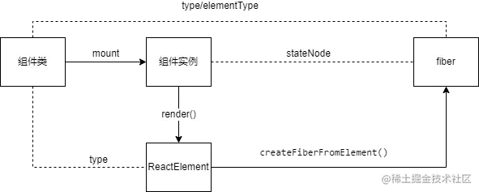

# 基本数据结构

## JSX & ReactElement

`jsx` 并不是什么模板语言，而是语法糖，react 会使用 `React.createElement` 将 `jsx` 转换为 `ReactElement` 对象。

React.createElement()接收3个参数：`type(原生DOM类型)`、`config(配置属性)`、`children(子项内容)`

例如:

```js
<div className="banner">
    <p> 
        hello world
    </p>
</div>

React.createElement('div', {'className': 'banner'}, React.createElement('p', null, 'hello world'))
```

`ReactElement`对象的数据结构如下:
```js
export type ReactElement = {|
  // 用于辨别ReactElement对象
  $typeof: any,

  // 内部属性
  type: any, // 表明其种类 type属性决定了节点的种类 它的值可以是字符串(代表div,span等 dom 节点), 函数(代表function, class等节点), 或者 react 内部定义的节点类型(portal,context,fragment等)
//   在reconciler阶段, 会根据 type 执行不同的逻辑(在 fiber 构建阶段详细解读).
// 如 type 是一个字符串类型, 则直接使用.
// 如 type 是一个ReactComponent类型, 则会调用其 render 方法获取子节点.
// 如 type 是一个function类型,则会调用该方法获取子节点
  key: any, // key属性在reconciler阶段会用到, 目前只需要知道所有的ReactElement对象都有 key 属性
  ref: any,
  props: any,

  // ReactFiber 记录创建本对象的Fiber节点, 还未与Fiber树关联之前, 该属性为null
  _owner: any,

  // __DEV__ dev环境下的一些额外信息, 如文件路径, 文件名, 行列信息等
  _store: {validated: boolean, ...},
  _self: React$Element<any>,
  _shadowChildren: any,
  _source: Source,
|};

```
内存结构图：


## Fiber

Fiber 对象是 Fiber 架构中的基础。Fiber 对象在内存中描述了用户编写的界面，react 会使用 fiber 对象进行 diff 并将 diff 结果应用到真实 dom 上。因此 fiber 对象在 react 中其着虚拟 DOM的作用。

```ts
// 一个Fiber对象代表一个即将渲染或者已经渲染的组件(ReactElement), 一个组件可能对应两个fiber(current和WorkInProgress)
export type Fiber = {

  tag: WorkTag, // 表示 fiber 的类型

  key: null | string, // 从 ReactElement 获取的 key


  elementType: any, // 从 ReactElement 获取的 type

  type: any, // 从 ReactElement 获取的 type
 
  stateNode: any, 

  return: Fiber | null, // 该 fiber 的父节点

  child: Fiber | null, // 该 fiber 的第一个子节点
  sibling: Fiber | null, // 该 fiber 的第一个兄弟节点
  index: number, // 


  ref:
    | null
    | (((handle: mixed) => void) & {_stringRef: ?string, ...})
    | RefObject, // fiber 关联的 ref

  pendingProps: any, // // 从`ReactElement`对象传入的 props. 用于和`fiber.memoizedProps`比较可以得出属性是否变动
  memoizedProps: any, // 上一次生成子节点时用到的属性, 生成子节点之后保持在内存中

  // A queue of state updates and callbacks.
  updateQueue: mixed, // 存储state更新的队列, 当前节点的state改动之后, 都会创建一个update对象添加到这个队列中.

  // The state used to create the output
  memoizedState: any, // 用于输出的state, 最终渲染所使用的state

  // Dependencies (contexts, events) for this fiber, if it has any
  dependencies: Dependencies | null, // // 该fiber节点所依赖的(contexts, events)等

  mode: TypeOfMode, // // 二进制位Bitfield,继承至父节点,影响本fiber节点及其子树中所有节点. 与react应用的运行模式有关(有ConcurrentMode, BlockingMode, NoMode等选项).

//  // Effect 副作用相关
  flags: Flags, // 标志位
  subtreeFlags: Flags,  //替代16.x版本中的 firstEffect, nextEffect. 当设置了 enableNewReconciler=true才会启用
  deletions: Array<Fiber> | null,  // 存储将要被删除的子节点. 当设置了 enableNewReconciler=true才会启用


  nextEffect: Fiber | null,  // 单向链表, 指向下一个有副作用的fiber节点
  firstEffect: Fiber | null,// 指向副作用链表中的第一个fiber节点
  lastEffect: Fiber | null, // 指向副作用链表中的最后一个fiber节点

  // 优先级相关
  lanes: Lanes,// 本fiber节点的优先级 车道模型
  childLanes: Lanes, // 子节点的优先级

  // This is a pooled version of a Fiber. Every fiber that gets updated will
  // eventually have a pair. There are cases when we can clean up pairs to save
  // memory if we need to.
  alternate: Fiber | null, // 指向内存中的另一个fiber, 每个被更新过fiber节点在内存中都是成对出现(current和workInProgress)


  // 性能统计相关(开启enableProfilerTimer后才会统计)
  // react-dev-tool会根据这些时间统计来评估性能
  // Time spent rendering this Fiber and its descendants for the current update.
  // This tells us how well the tree makes use of sCU for memoization.
  // It is reset to 0 each time we render and only updated when we don't bailout.
  // This field is only set when the enableProfilerTimer flag is enabled.
  actualDuration?: number,  // 本次更新过程, 本节点以及子树所消耗的总时间

  // If the Fiber is currently active in the "render" phase,
  // This marks the time at which the work began.
  // This field is only set when the enableProfilerTimer flag is enabled.
  actualStartTime?: number, // 标记本fiber节点开始构建的时间

  // Duration of the most recent render time for this Fiber.
  // This value is not updated when we bailout for memoization purposes.
  // This field is only set when the enableProfilerTimer flag is enabled.
  selfBaseDuration?: number,// 用于最近一次生成本fiber节点所消耗的时间

  // Sum of base times for all descendants of this Fiber.
  // This value bubbles up during the "complete" phase.
  // This field is only set when the enableProfilerTimer flag is enabled.
  treeBaseDuration?: number,// 生成子树所消耗的时间的总和

};
```

内存关系：


## Fiber和ReactElement的关系


```ts
jsx ---- creatElement ----> ReactElement ---- createFiberFromElement ----> Fiber
```




## UpdateQueue

在fiber对象中有一个属性`fiber.updateQueue`, 是一个链式队列(即使用链表实现的队列存储结构)。

```ts
export type Update<State> = {|
  eventTime: number, // 发起update事件的时间(17.0.2中作为临时字段, 即将移出)
  lane: Lane, // update所属的优先级

  tag: 0 | 1 | 2 | 3, //
  payload: any, // 载荷, 根据场景可以设置成一个回调函数或者对象
  callback: (() => mixed) | null, // 回调函数

  next: Update<State> | null, // 指向链表中的下一个, 由于UpdateQueue是一个环形链表, 最后一个update.next指向第一个update对象
|};

// =============== UpdateQueue ==============
type SharedQueue<State> = {| // 共享队列
  pending: Update<State> | null, // 指向即将输入的update队列，在class组件中调用setState（）之后，会将新的update对象添加到这个队列中来
|};

export type UpdateQueue<State> = {|
  baseState: State, // 队列的基础State
  firstBaseUpdate: Update<State> | null, // 指向基础队列的队首
  lastBaseUpdate: Update<State> | null, // 指向基础队列的队尾
  shared: SharedQueue<State>, // 共享队列
  effects: Array<Update<State>> | null, // 用于保存有callback回调函数update对象，在commit之后，会一次调用这里的回调函数
|};
```


## Hook 对象

