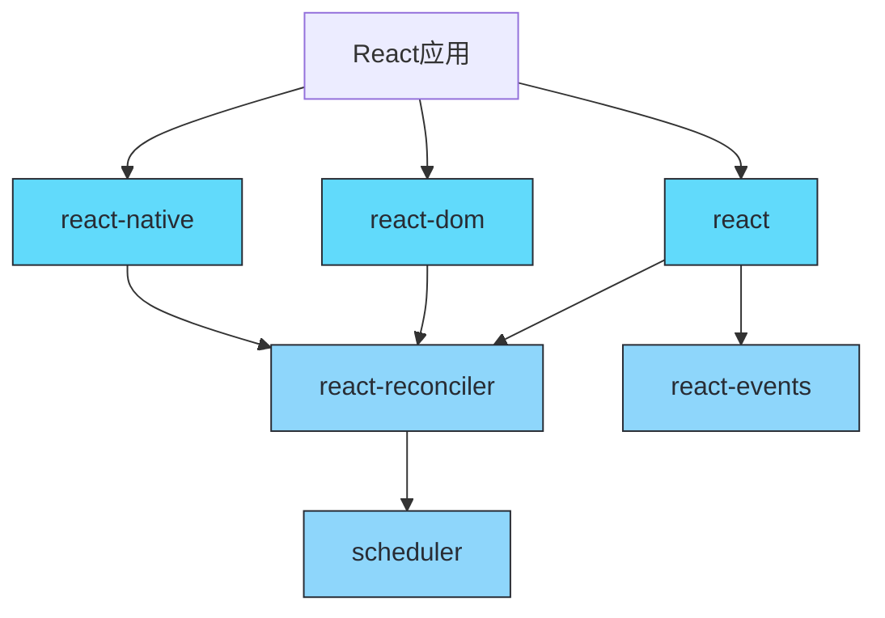
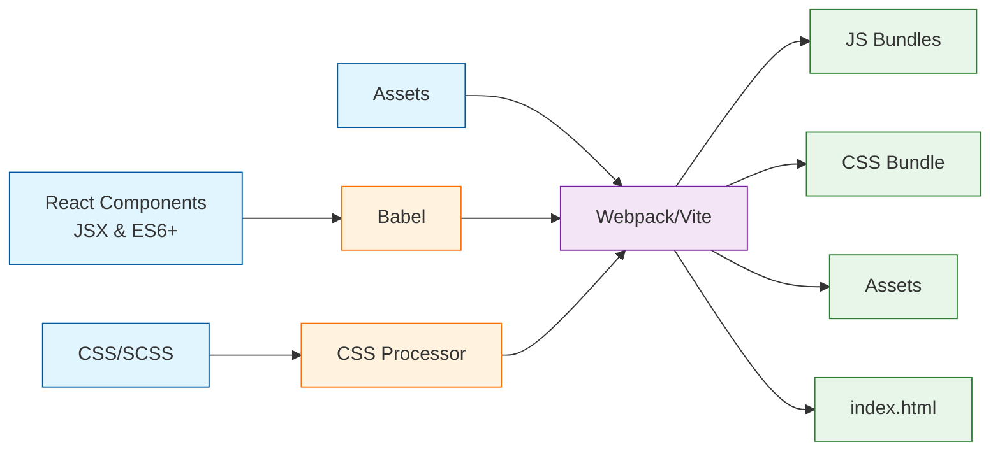
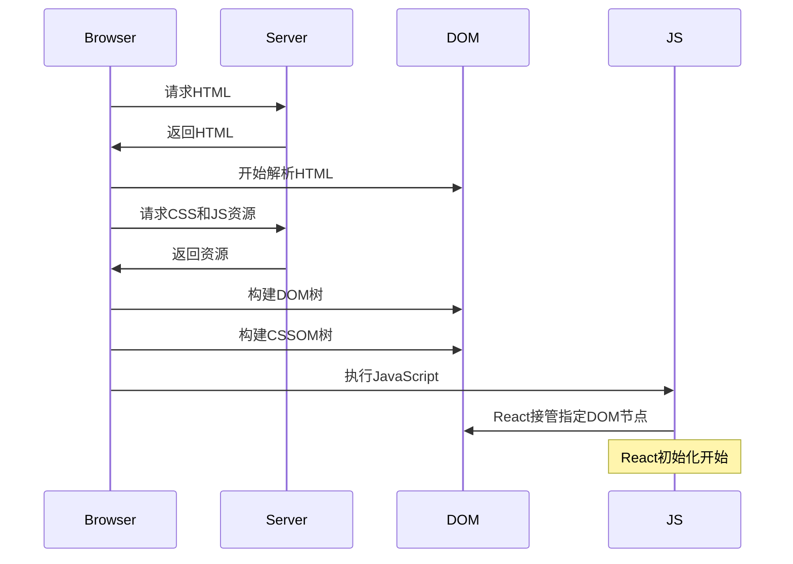
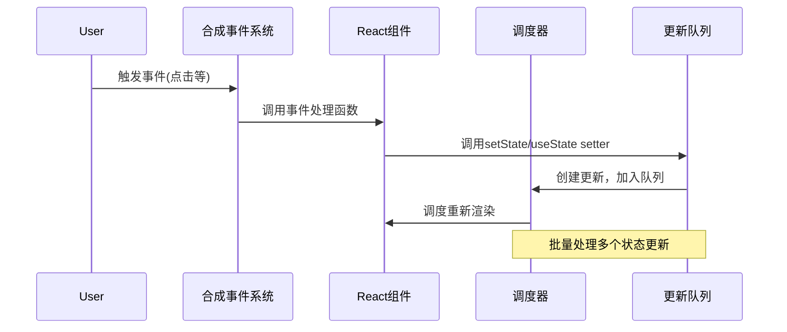
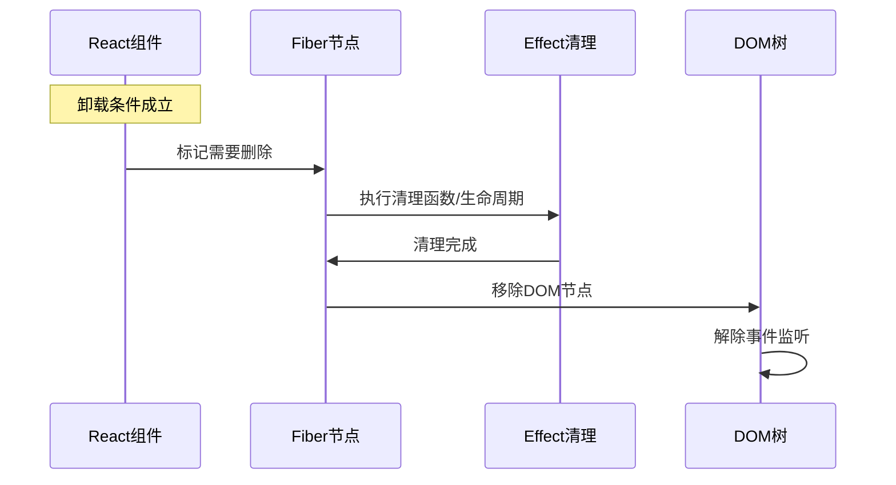
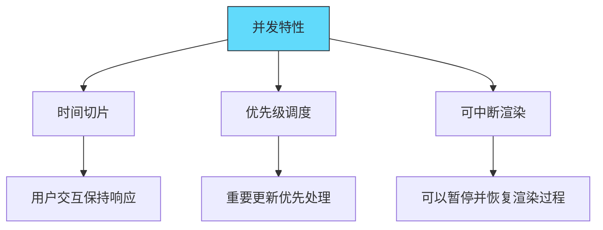
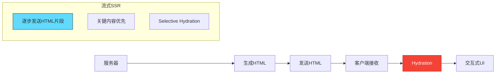
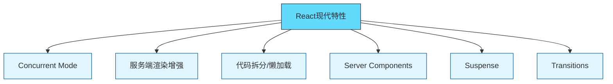
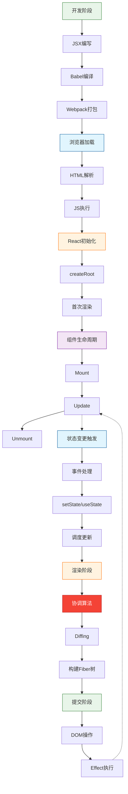

#  ⚛️ React 全流程深度解析

React 以其声明式编程、组件化和高效的 DOM 更新机制，彻底改变了现代前端开发。但你是否曾好奇，从你写下 `<MyComponent />` 到用户在屏幕上与之交互，这背后究竟发生了一场怎样精密而高效的"演出"？

本文旨在为你揭开 React 的神秘面纱，完整地梳理一个 React 应用从源代码到最终在浏览器中呈现并响应用户交互的**全流程**。无论你是希望巩固基础的 React 新手，还是寻求更深层次理解的资深开发者，这篇文章都将带你领略 React 工作流的每个关键环节。

**我们将一起探索：**

1.  **开发与构建阶段：** JSX 如何变成浏览器能理解的代码？
2.  **浏览器加载阶段：** HTML 和 JavaScript 如何被加载和执行？
3.  **首次渲染（Mount）阶段：** React 如何将组件"绘制"到屏幕上？
4.  **状态更新与触发：** `setState` 或 `useState` 如何启动更新流程？
5.  **重新渲染与协调（Reconciliation）阶段：** React 如何高效地更新变化的部分？
6.  **卸载（Unmount）阶段：** 组件消失时会发生什么？
7.  **现代特性概览：** 并发模式、SSR/Streaming 等如何融入流程？

## React 生态系统与包结构

在深入流程之前，让我们先了解 React 的核心包结构。React 采用模块化设计，由多个专注于特定功能的包组成。



**核心包及其职责：**

- **react**: 定义核心API，如React.createElement、Hooks等，但不含具体平台渲染逻辑
- **react-dom**: 针对浏览器环境的渲染器，将React组件渲染为DOM
- **react-native**: 针对移动平台的渲染器，将React组件渲染为原生视图
- **react-reconciler**: 实现协调算法，构建和比较Fiber树
- **scheduler**: 调度系统，根据优先级调度不同的工作
- **react-events**: 管理合成事件系统

---

## 阶段一：编写代码与构建打包

一切始于开发者编写的代码。

1.  **编写组件与 JSX:**
    *   开发者使用 JavaScript (或 TypeScript) 编写 React 组件（函数组件或类组件）。
    *   使用 JSX 这种类似 HTML 的语法糖来声明式地描述 UI 结构。

```jsx
    // src/MyComponent.js
    import React, { useState } from 'react';

    function MyComponent({ message }) {
      const [count, setCount] = useState(0);

      return (
        <div className="my-component">
          <h1>{message}</h1>
          <p>Count: {count}</p>
          <button onClick={() => setCount(c => c + 1)}>
            Increment
          </button>
        </div>
      );
    }
export default MyComponent;
```

2.  **编译转换 (Transpilation):**
    *   由于浏览器不认识 JSX 和可能使用的现代 JavaScript 语法（如 ES6+），我们需要**编译器**（通常是 **Babel**）介入。
    *   Babel 将 JSX 转换为 `React.createElement()` 函数调用。
    *   同时，它也会将 ES6+ 语法转换为浏览器兼容性更好的 ES5 语法（根据配置）。

```javascript
    // JSX 转换示例 (概念性)
    // <h1 className="greeting">Hello</h1>
    // 编译为 ->
    React.createElement('h1', { className: 'greeting' }, 'Hello');
```

3.  **模块打包 (Bundling):**
    *   现代前端项目通常由许多模块（JS 文件、CSS 文件、图片等）组成。
    *   **打包工具**（如 **Webpack**, **Vite**, **Parcel**, **Rollup**）会分析项目依赖关系，将所有需要的模块打包成一个或多个优化过的静态资源文件（通常称为 Bundles），主要是 JavaScript 和 CSS 文件。
    *   打包过程还可能包括代码压缩、混淆、代码分割（Code Splitting）、Tree Shaking（移除未使用的代码）等优化步骤。


产出： 最终生成 index.html 文件以及一个或多个 JavaScript 和 CSS 文件（Bundles），准备部署到服务器。




## 阶段二：浏览器加载与执行

用户访问应用时，浏览器开始工作。

1. **请求 HTML**: 浏览器向服务器请求入口 index.html 文件。
2. **解析 HTML**: 浏览器接收并开始解析 HTML。遇到 `<link rel="stylesheet" href="..."> `时，会异步下载 CSS 文件。遇到 `<script src="..."> `时（如果不是 defer 或 async），会暂停 HTML 解析，下载并执行 JavaScript。现代实践通常将 `<script> `标签放在 `<body> `底部或使用 defer 属性，以避免阻塞页面渲染。
3. **下载资源**: 浏览器下载 HTML 中引用的 CSS 和 JavaScript Bundles。
4. **构建 DOM 和 CSSOM**: 浏览器解析 HTML 构建 DOM (Document Object Model) 树，解析 CSS 构建 CSSOM (CSS Object Model) 树。两者结合形成 Render Tree（渲染树）。
5. **执行 JavaScript**: 下载完成后，浏览器执行 JavaScript Bundles。React 的代码开始运行！



## 阶段三：首次渲染（Mount）- React接管UI

这是 React 展示其魔法的第一个关键阶段。通常由入口文件（如 src/index.js）中的代码启动。

1. 调用 `createRoot().render()`：

- React 18+ 的标准入口方式。`ReactDOM.createRoot(container)` 选择一个 DOM 容器节点，并创建一个 React 根。
- `root.render(<App />) `指示 React 将 `<App /> `组件渲染到这个根中

```javascript
// src/index.js (或类似入口文件)
import React from 'react';
import ReactDOM from 'react-dom/client';
import App from './App'; // 根组件

const container = document.getElementById('root');
const root = ReactDOM.createRoot(container);
root.render(<App />);
```

2. **创建 React Element 树 (Virtual DOM):**

- `render()` 函数接收到 `<App />` 这个 `React Element`。
- React 开始调用组件（如 App 函数）并执行其代码。
- 组件返回 JSX，通过 `React.createElement()`（或编译器优化后的 jsx() 函数）创建描述 UI 结构的 React Element 对象树。这就是我们常说的 **Virtual DOM** 的一种内存表示。它只是普通的 JavaScript 对象，非常轻量。

3. **进入协调阶段 (Reconciliation) - 构建 Fiber 树:**

- **Fiber 架构:** React 使用称为 Fiber 的内部架构来管理渲染工作。Fiber 节点不仅包含了组件类型、props、state 等信息，还维护了组件之间的关系（child, sibling, return 指针），并作为可中断、可恢复的工作单元。
- **首次挂载:** React 从根节点开始，遍历 React Element 树，为每个 Element 创建一个对应的 Fiber 节点，构建起**第一个 Fiber 树 (Work-in-Progress Tree)**。这个过程发生在 Render 阶段。
- 在此过程中，如果是类组件，会创建实例；如果是函数组件，会执行函数。

4. **提交阶段 (Commit):**

- 当整个 Fiber 树构建（或更新）完成后，React 进入 **Commit 阶段**。这个阶段是**同步且不可中断**的。
- **DOM 操作:** React 根据 Fiber 树的信息，计算出需要执行的所有 DOM 操作（因为是首次渲染，主要是创建节点、设置属性）。
- **真实 DOM 构建:** React 调用浏览器 DOM API (如 document.createElement, appendChild, setAttribute 等) 将 Fiber 节点映射为**真实的 DOM 节点**，并将它们插入到 createRoot 指定的容器中。
- **生命周期/Effect 执行:**
  - componentDidMount (类组件) 被调用。
  - useLayoutEffect 的回调函数同步执行。
  - useEffect 的回调函数被调度在稍后（浏览器绘制之后）异步执行。
  - ref 被附加到对应的 DOM 节点或类组件实例上。

```mermaid
flowchart TD
    A[createRoot().render()] --> B[创建React Element树]
    B --> C[React协调过程]
    C --> D[构建Fiber树]
    D --> E[commit阶段 - DOM更新]
    E --> F[生命周期/Effect执行]
    F --> G[浏览器绘制]
    
    C -.-> H[Fiber树缓存]
    
    style A fill:#e8f5e9,stroke:#2e7d32
    style B fill:#e8f5e9,stroke:#2e7d32
    style C fill:#fff3e0,stroke:#ff6f00
    style D fill:#fff3e0,stroke:#ff6f00
    style E fill:#e1f5fe,stroke:#01579b
    style F fill:#e1f5fe,stroke:#01579b
    style G fill:#f3e5f5,stroke:#7b1fa2
    style H fill:#fff3e0,stroke:#ff6f00,stroke-dasharray: 5 5
```

## 阶段四：状态更新与触发

React 应用是动态的，需要响应用户交互或其他事件。当状态发生变化时，React 需要高效地更新 UI。

1. **更新触发方式:**
   * 类组件: `this.setState()`
   * 函数组件: `useState` 的 setter 函数、`useReducer` 的 dispatch
   * Context: `Context.Provider` 的 value 变化
   * 强制更新: `forceUpdate()` 或 reducer 返回完全相同的状态

2. **事件处理系统:**
   * React 实现了合成事件（Synthetic Events）系统，它是原生 DOM 事件系统的跨浏览器包装器
   * 事件委托: React 会把几乎所有事件都委托到 document 级别（React 17+改为 root 容器级别）
   * 事件处理程序中调用的状态更新会触发重新渲染



## 阶段五：重新渲染与协调 - 高效更新

当状态更新后，React 会启动重新渲染流程。这一流程与首次渲染类似，但包含一个关键差异：React 会比较新旧两棵树，只更新必要的部分。

1. **启动更新:**
   * 状态更新会被加入队列，并触发调度器进行调度
   * 根据更新的优先级决定何时处理（并发特性）

2. **Render 阶段:**
   * 重新执行对应组件的渲染函数，生成新的 React Elements 树
   * 创建一棵新的 "work-in-progress" Fiber 树
   * 执行 **协调算法 (Reconciliation)** 来比较当前Fiber树与新的Elements树

3. **Diffing 算法:**
   * 基于两个假设:
     1. 不同类型的元素会产生不同的树
     2. 开发者可以通过 `key` 属性暗示哪些子元素在不同渲染中保持稳定
   * 逐层比较:
     * 不同类型的元素: 拆除旧树，建立新树
     * 相同类型的DOM元素: 只更新改变的属性
     * 相同类型的组件元素: 更新props，并递归继续比较
   * 列表diffing: 使用key高效识别移动、添加或删除的项

4. **Commit 阶段:**
   * 与首次渲染类似，但只对需要更新的部分执行DOM操作
   * 可能涉及的操作:
     * 更新现有DOM节点属性
     * 插入新DOM节点
     * 移动或删除现有DOM节点
   * 执行更新相关的生命周期/Effect:
     * componentDidUpdate
     * useLayoutEffect (同步执行)
     * useEffect (稍后异步执行)

```mermaid
flowchart TD
    A[状态更新] --> B[调度更新]
    B --> C[Render阶段]
    C --> D[执行组件渲染\n生成新Elements]
    D --> E[构建新的WIP Fiber树]
    E --> F[Diffing算法\n比较新旧Fiber]
    F --> G[收集需要执行的DOM操作]
    G --> H[Commit阶段]
    H --> I[执行DOM更新]
    I --> J[调用生命周期/Effect]
    
    subgraph "Diffing策略"
        K[比较元素类型]
        L[比较属性]
        M[处理子元素(key)]
    end
    
    F -.-> K
    
    style A fill:#e8f5e9,stroke:#2e7d32
    style B fill:#e8f5e9,stroke:#2e7d32
    style C fill:#fff3e0,stroke:#ff6f00
    style F fill:#f44336,stroke:#b71c1c,color:white
    style H fill:#e1f5fe,stroke:#01579b
    style K fill:#fff3e0,stroke:#ff6f00,stroke-dasharray: 5 5
    style L fill:#fff3e0,stroke:#ff6f00,stroke-dasharray: 5 5
    style M fill:#fff3e0,stroke:#ff6f00,stroke-dasharray: 5 5
```

## 阶段六：卸载（Unmount）阶段

在某些情况下，组件需要从UI中移除。例如：
- 条件渲染的条件改变
- 组件被从列表中移除
- 用户导航到另一个页面
- 整个应用程序关闭

卸载过程：

1. **触发卸载:**
   * 父组件决定不再渲染某个子组件
   * 在Diffing过程中，React发现某个元素不再存在

2. **清理工作:**
   * 递归处理组件树，对每个需要卸载的组件：
     * 类组件: 调用 `componentWillUnmount` 生命周期
     * 函数组件: 执行 `useEffect` 返回的清理函数
   * 解除引用，避免内存泄漏
   * 移除事件监听器和订阅

3. **DOM移除:**
   * 在commit阶段，从DOM中移除对应的节点
   * 移除与该节点相关的所有事件处理程序



## 阶段七：现代特性概览

React 不断发展，引入了许多现代特性以提升性能和开发体验。

### 并发模式 (Concurrent Mode)

React 18 引入的最重要特性，使 React 能够准备多个版本的 UI，而不阻塞主线程。



核心机制：
* **时间切片：** 将长任务分割成小片段执行，每执行一小段就检查是否有高优先级工作
* **优先级系统：** 不同的更新有不同的优先级
  * Urgent: 需要同步处理（如用户输入）
  * High: 用户交互（如点击）
  * Normal: 普通更新
  * Low: 可以延迟的工作（如屏幕外数据）
* **启用方式：** 使用 `createRoot` (React 18 默认)

### 服务端渲染（SSR）与流式渲染



* **传统SSR：** 服务器生成完整HTML，客户端加载React后进行hydration
* **流式SSR (React 18)：**
  * `renderToPipeableStream`: 服务器生成HTML流，可以逐步发送
  * 与Suspense集成，允许部分UI先加载，部分等待数据
  * Selective Hydration: 用户交互的部分优先激活

### 其他关键特性

* **Automatic Batching:** 自动批处理多个状态更新，减少渲染次数
* **Transitions:** 将UI更新标记为非紧急，允许保持当前UI响应
* **Suspense for Data Fetching:** 声明式地指定加载状态
* **Server Components:** 只在服务器运行、不增加客户端bundle大小的组件



## 总结: React工作流全景图

以下是React从代码到屏幕的完整流程总览：



本文提供了React工作流程的高层次理解。在后续文章中，我们将深入探讨各个关键环节的实现细节，包括：
- Fiber架构深度解析
- 协调算法的实现机制
- Hook原理与内部实现
- 并发模式的技术细节
- 服务端渲染的全流程
- 性能优化技巧与最佳实践

通过理解React的工作原理，你将能够更有效地使用它，编写更高效、更可维护的代码，并更好地解决实际开发中遇到的问题。


