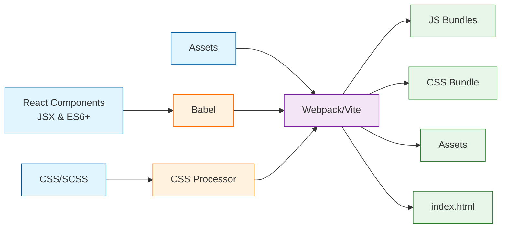

#  ⚛️ React 全流程深度解析

React 以其声明式编程、组件化和高效的 DOM 更新机制，彻底改变了现代前端开发。但你是否曾好奇，从你写下 `<MyComponent />` 到用户在屏幕上与之交互，这背后究竟发生了一场怎样精密而高效的“演出”？

本文旨在为你揭开 React 的神秘面纱，完整地梳理一个 React 应用从源代码到最终在浏览器中呈现并响应用户交互的**全流程**。无论你是希望巩固基础的 React 新手，还是寻求更深层次理解的资深开发者，这篇文章都将带你领略 React 工作流的每个关键环节。

**我们将一起探索：**

1.  **开发与构建阶段：** JSX 如何变成浏览器能理解的代码？
2.  **浏览器加载阶段：** HTML 和 JavaScript 如何被加载和执行？
3.  **首次渲染（Mount）阶段：** React 如何将组件“绘制”到屏幕上？
4.  **状态更新与触发：** `setState` 或 `useState` 如何启动更新流程？
5.  **重新渲染与协调（Reconciliation）阶段：** React 如何高效地更新变化的部分？
6.  **卸载（Unmount）阶段：** 组件消失时会发生什么？
7.  **现代特性概览：** 并发模式、SSR/Streaming 等如何融入流程？

---

## 阶段一：编写代码与构建打包

一切始于开发者编写的代码。

1.  **编写组件与 JSX:**
    *   开发者使用 JavaScript (或 TypeScript) 编写 React 组件（函数组件或类组件）。
    *   使用 JSX 这种类似 HTML 的语法糖来声明式地描述 UI 结构。

```jsx
    // src/MyComponent.js
    import React, { useState } from 'react';

    function MyComponent({ message }) {
      const [count, setCount] = useState(0);

      return (
        <div className="my-component">
          <h1>{message}</h1>
          <p>Count: {count}</p>
          <button onClick={() => setCount(c => c + 1)}>
            Increment
          </button>
        </div>
      );
    }
export default MyComponent;
```

2.  **编译转换 (Transpilation):**
    *   由于浏览器不认识 JSX 和可能使用的现代 JavaScript 语法（如 ES6+），我们需要**编译器**（通常是 **Babel**）介入。
    *   Babel 将 JSX 转换为 `React.createElement()` 函数调用。
    *   同时，它也会将 ES6+ 语法转换为浏览器兼容性更好的 ES5 语法（根据配置）。

```javascript
    // JSX 转换示例 (概念性)
    // <h1 className="greeting">Hello</h1>
    // 编译为 ->
    React.createElement('h1', { className: 'greeting' }, 'Hello');
```

3.  **模块打包 (Bundling):**
    *   现代前端项目通常由许多模块（JS 文件、CSS 文件、图片等）组成。
    *   **打包工具**（如 **Webpack**, **Vite**, **Parcel**, **Rollup**）会分析项目依赖关系，将所有需要的模块打包成一个或多个优化过的静态资源文件（通常称为 Bundles），主要是 JavaScript 和 CSS 文件。
    *   打包过程还可能包括代码压缩、混淆、代码分割（Code Splitting）、Tree Shaking（移除未使用的代码）等优化步骤。


产出： 最终生成 index.html 文件以及一个或多个 JavaScript 和 CSS 文件（Bundles），准备部署到服务器。




## 阶段二：浏览器加载与执行

用户访问应用时，浏览器开始工作。

1. **请求 HTML**: 浏览器向服务器请求入口 index.html 文件。
2. **解析 HTML**: 浏览器接收并开始解析 HTML。遇到 <link rel="stylesheet" href="..."> 时，会异步下载 CSS 文件。遇到 <script src="..."> 时（如果不是 defer 或 async），会暂停 HTML 解析，下载并执行 JavaScript。现代实践通常将 <script> 标签放在 <body> 底部或使用 defer 属性，以避免阻塞页面渲染。
3. **下载资源**: 浏览器下载 HTML 中引用的 CSS 和 JavaScript Bundles。
4. **构建 DOM 和 CSSOM**: 浏览器解析 HTML 构建 DOM (Document Object Model) 树，解析 CSS 构建 CSSOM (CSS Object Model) 树。两者结合形成 Render Tree（渲染树）。
5. **执行 JavaScript**: 下载完成后，浏览器执行 JavaScript Bundles。React 的代码开始运行！

## 阶段三：首次渲染（Mount）- React接管UI

这是 React 展示其魔法的第一个关键阶段。通常由入口文件（如 src/index.js）中的代码启动。

1. 调用 `createRoot().render()`：

- React 18+ 的标准入口方式。`ReactDOM.createRoot(container)` 选择一个 DOM 容器节点，并创建一个 React 根。
- `root.render(<App />) `指示 React 将 `<App /> `组件渲染到这个根中

```javascript
// src/index.js (或类似入口文件)
import React from 'react';
import ReactDOM from 'react-dom/client';
import App from './App'; // 根组件

const container = document.getElementById('root');
const root = ReactDOM.createRoot(container);
root.render(<App />);
```

2. **创建 React Element 树 (Virtual DOM):**

- `render()` 函数接收到 `<App />` 这个 `React Element`。
- React 开始调用组件（如 App 函数）并执行其代码。
- 组件返回 JSX，通过 `React.createElement()`（或编译器优化后的 jsx() 函数）创建描述 UI 结构的 React Element 对象树。这就是我们常说的 **Virtual DOM** 的一种内存表示。它只是普通的 JavaScript 对象，非常轻量。

3. **进入协调阶段 (Reconciliation) - 构建 Fiber 树:**

- **Fiber 架构:** React 使用称为 Fiber 的内部架构来管理渲染工作。Fiber 节点不仅包含了组件类型、props、state 等信息，还维护了组件之间的关系（child, sibling, return 指针），并作为可中断、可恢复的工作单元。
- **首次挂载:** React 从根节点开始，遍历 React Element 树，为每个 Element 创建一个对应的 Fiber 节点，构建起**第一个 Fiber 树 (Work-in-Progress Tree)**。这个过程发生在 Render 阶段。
- 在此过程中，如果是类组件，会创建实例；如果是函数组件，会执行函数。

4. **提交阶段 (Commit):**

- 当整个 Fiber 树构建（或更新）完成后，React 进入 **Commit 阶段**。这个阶段是**同步且不可中断**的。
- **DOM 操作:** React 根据 Fiber 树的信息，计算出需要执行的所有 DOM 操作（因为是首次渲染，主要是创建节点、设置属性）。
- **真实 DOM 构建:** React 调用浏览器 DOM API (如 document.createElement, appendChild, setAttribute 等) 将 Fiber 节点映射为**真实的 DOM 节点**，并将它们插入到 createRoot 指定的容器中。
- **生命周期/Effect 执行:**
  - componentDidMount (类组件) 被调用。
  - useLayoutEffect 的回调函数同步执行。
  - useEffect 的回调函数被调度在稍后（浏览器绘制之后）异步执行。
  - ref 被附加到对应的 DOM 节点或类组件实例上。


