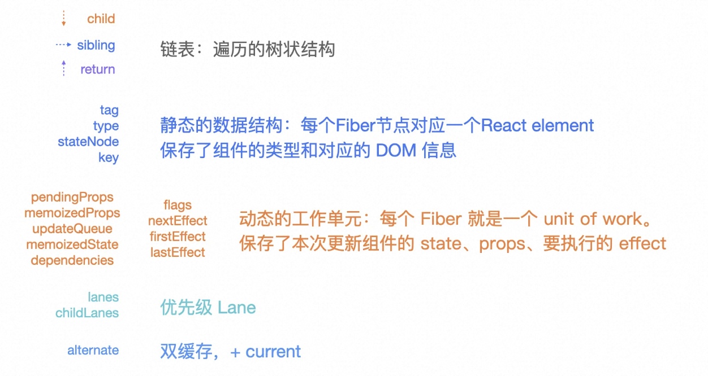
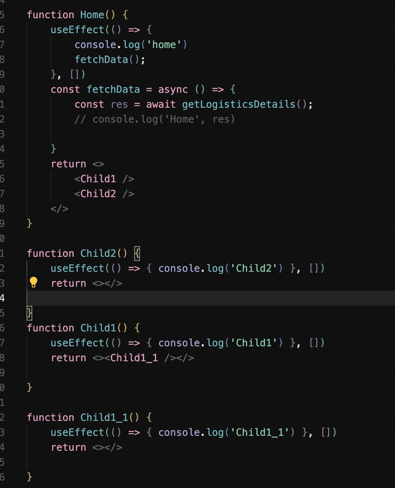
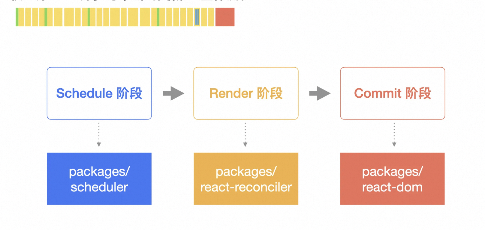

# 核心原理

## 异步可中断更新

### 同步更新和异步更新的区别

如下图

输入框内输入的文字较多时，同步模式下就会出现明显的卡顿

### 对比同步与异步工作模式

**同步工作模式**

在该模式下，一旦开启，则不可中断，后续的浏览器事件(IO)都会被阻塞，需要等待整个 render 结束后才会处理

**异步可中断模式**

一个 fiber 就是一个最小的工作单元

render 阶段，为了避免出现浏览器事件(IO)长期得不到相应而出现的饥饿现象，故把整个 render 做时间切片 time-slicing，在每个时间片的末尾根据优先级查询当前是否有 IO 操作需要响应，如果有则转去处理 IO，当前 render 可暂停、继续、丢弃等，然后进行增量渲染。（关于饥饿现象、时间切片和可中断性可参考 OS）

Commit 阶段始终是同步的，目的就是为了将变化的部分一次性更新到 DOM 上

### Fiber 数据结构

### Fiber 树

type 表示组件的类型
tag 表示组件的类型

节点间的连接关系 child（孩子）、sibling（兄弟）、return（父亲）

并不是一个标准的树状结构，而是一个链表的结构，用一个链表来表示一棵树，他的好处就是能够做到单向遍历，每一步都可以做到暂停和恢复。

遍历顺序是深度优先（DFS）：先遍历所有的 child 节点、没有 child 节点就会去找兄弟节点 sibling、然后再是 child 节点，没有 child 节点就去找兄弟节点，没有兄弟节点就回去找 return（表示上一级的节点，并不是 parent）

从遍历顺序上看，Fiber 树实际上是用链表来表示的树

根据遍历顺序，以下的打印顺序是什么

### Fiber 双缓冲

初始 render 阶段，fiber 的 alternate 会绘制成完整的一个 Fiber 树，在 commit 阶段，Fiber 会把 current 节点指向 alternate 节点，做一次性的替换。

React 默认会创建 rootFiberNode，下面挂在 rootFiber，初次时，rootFiber 下面的 current 是空的（current 任何时候都是指向浏览器实际渲染的内容）。render 阶段，会在 alternate 节点开始计算生成完整的一个 Fiber 树，在 React 内部叫做 workInProgress 树，到了 commit 阶段，表示 workInProgress 树已经计算完成，它会把 alternate 节点浅 copy 到 rootFiber 的 current 节点，由于是浅 copy，整个速度是非常快的。

### Scheduler

React 调度包含两层工作循环 workloop：Scheduler 层和 Fiber(Reconciler) 层

workloop 为了避免对浏览器造成一个阻塞，使用 Scheduler shouldYeld 方法用来判断当前事件执行的时间是否超过阀值，默认阀值为 5 毫秒 ，如果一个计算任务的计算时长超过这个阀值，react 就是出让浏览器的执行权，让更高优先级的任务插入，保证页面的流畅性。

### Reconciler

### 整体流程

