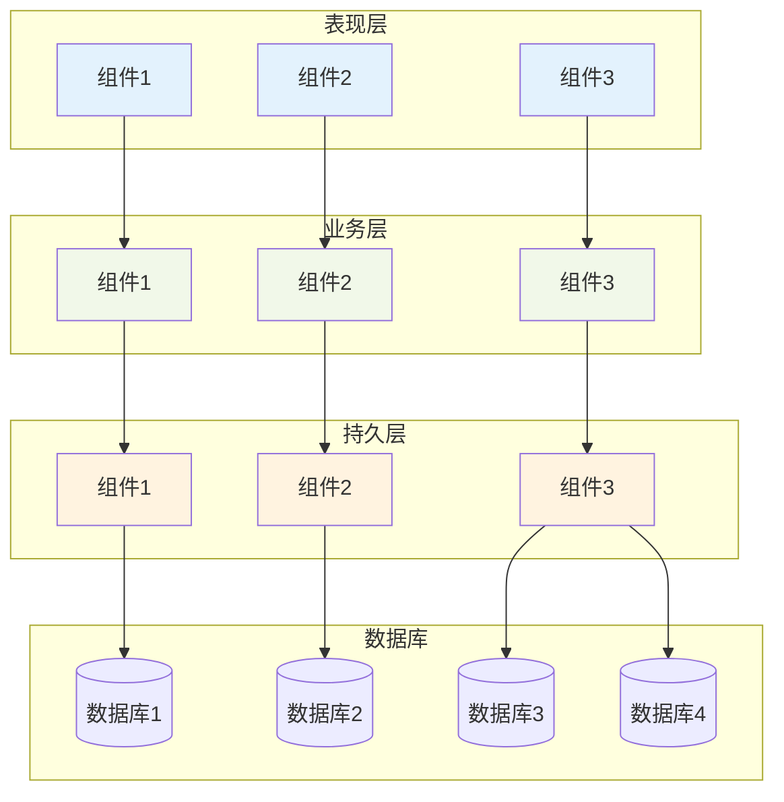
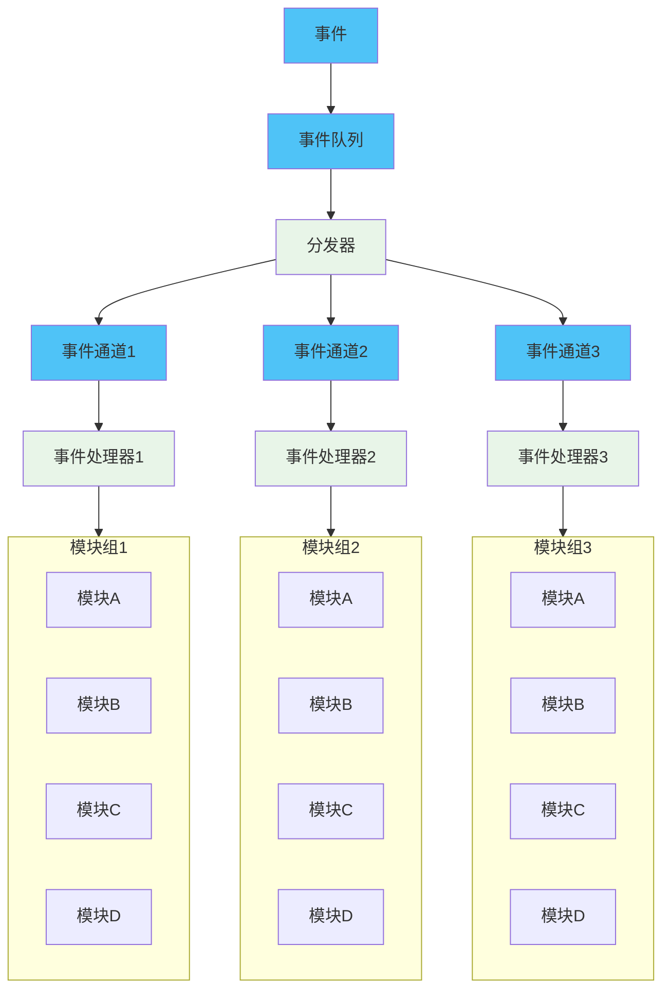
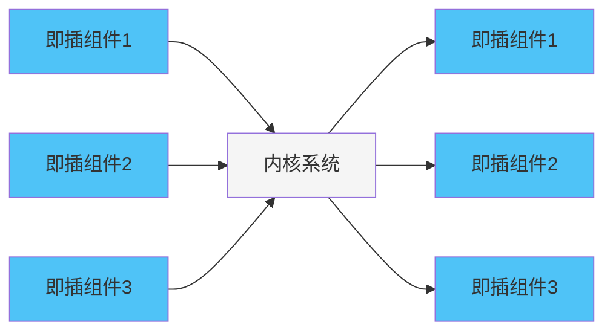
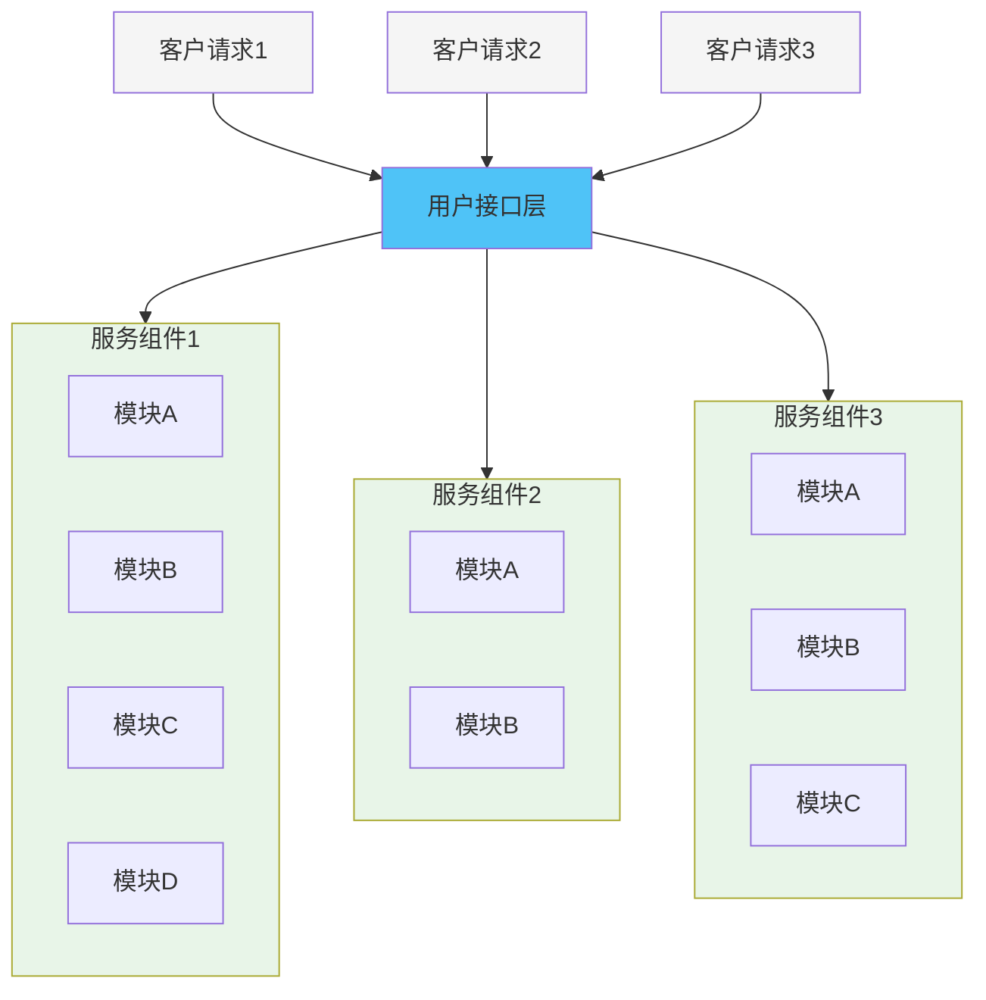
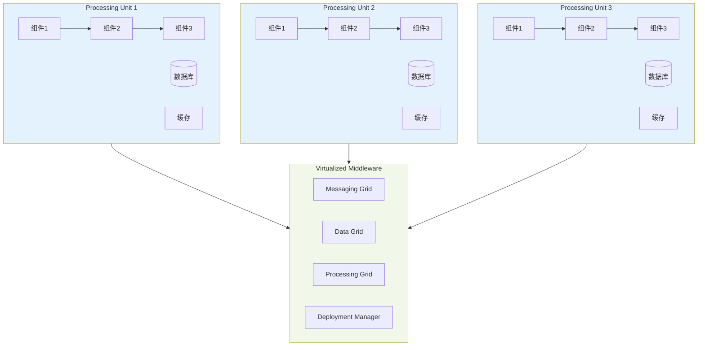

# 绪论

> 目的：本章首先从架构定义、发展历程、典型架构和未来发展等方面概要说明，给读者建立一个架构的整体概念；然后对系统架构设计师的定义、职责、范围和工作内容等进行讲解，并说明了对于一名合格的系统架构设计师的要求。

## 1.1 系统架构概述

发展历史：冯诺依曼计算机

系统架构是什么：**系统架构(System Architecture)**是系统的一种整体的高层次的结构表示，是系统的骨架和根基，也决定了系统的健壮性和生命周期的长短。

系统架构设计师是什么：
- 系统架构设计师是承担系统架构设计的核心角色，他不仅是连接用户需求和系统进一步设计与实现的桥梁，也是系统开发早期阶段质量保证的关键角色。
- 他要确认和评估系统需求，给出开发规范，搭建系统实现的核心构架，并澄清技术细节、扫清主要难点的技术人员；他要掌握技术团队的能力需要，给出项目管理方法，采用合适生命周期模型，具备以自身为核心形成团队的能力，并在项目进度计划和经费分配等方面开展评估，以预防项目风险。

### 1.1.1 系统架构的定义及发展历程

#### 1. 系统架构的定义

定义：系统架构 (System Architecture) 是系统的一种整体的高层次的结构表示，是系统的骨架和根基，支撑和链接各个部分，包括组件、连接件、约束规范以及指导这些内容设计与演化的原理，它是刻画系统整体抽象结构的一种手段。

#### 2. 发展历程

1. **基础研究阶段**

模块化开发方法原则：

(1) 最高模块内聚。也就是在一个模块内部的元素最大限度地关联，只实现一种功能的模块是高内聚的，具有三种以上功能的模块则是低内聚的。

(2) 最低耦合。也就是不同模块之间的关系尽可能弱，以利于软件的升级和扩展。

(3) 模块大小适度。颗粒过大会造成模块内部维护困难，而颗粒过小又会导致模块间的耦合增加。

(4) 模块调用链的深度(嵌套层次)不可过多。

(5) 接口简单、精炼(扇入扇出数不宜太大),具有信息隐蔽能力。

(6) 尽可能地复用已有模块。

2. **概念体系和核心技术形成阶段(1999—2000年)**

逐步形成软件架构的形式化标准、软件组件化

3. **理论体系完善与发展阶段(1996年至今)**

深入研究组件软件架构：软件架构描述与表示、软件架构分析、设计与测试、软件架构发现、演化与重用、给予软件架构开发方法、软件架构风格、动态软件架构；

4. **普及应用阶段（2000年至今）**

### 1.1.2 软件架构的常用分类及建模方法

#### 1.软件架构的常用分类

典型的架构：分层架构、事件驱动架构、微核架构、微服务架构和云架构（还存在C/S架构、B/S架构、管道-过滤器架构和PAC架构）

1. **分层架构**

分层架构 (Layered Architecture) 是最常见的软件架构，也是事实上的标准架构。这种架构将软件分成若干个水平层，每一层都有清晰的角色和分工，不需要知道其他层的细节。层与层之间通过接口进行通信。分层架构通常明确约定软件一定要分成多少层，但是，最常见的是四层结构，

- 表现层：用户页面、负责视觉和用户互动
- 业务层：实现业务逻辑
- 持久层：提供数据，SQL语句就在这一层
- 数据层：保存数据

2. **事件驱动架构**

事件 (Event) 是状态发生变化时软件发出的通知。事件驱动架构 (Event-driven Architecture)是通过事件进行通信的软件架构，它分成四个部分。

● 事件队列 (Event Queue): 接收事件的入口；
● 分发器 (Event Mediator): 将不同的事件分发到不同的业务逻辑单元；
● 事件通道 (Event Channel): 分发器与处理器之间的联系渠道；
● 事件处理器 (Event Processor): 实现业务逻辑，处理完成后会发出事件，触发下一步操作。

3. **微核架构**

微核架构 (Microkernel Architecture) 又称为插件架构(Plug-in Architecture), 是指软件的内核相对较小，主要功能和业务逻辑都通过插件实现。

内核 (Core) 通常只包含系统运行的最小功能。插件则是互相独立的，插件之间的通信应该减少到最低，避免出现互相依赖的问题。

4. **微服务架构**

微服务架构 (Microservices Architecture) 是服务导向架构(Service-Oriented Architecture,SOA)的升级。每一个服务就是一个独立的部署单元 (Separately Deployed Unit)。 这些单元都是分布式的，互相解耦，通过远程通信协议(比如 REST、SOAP)联系.

微服务架构分成三种实现模式：

● RESTfulAPI模式：服务通过API提供，云服务就属于这一类；

● RESTful应用模式：服务通过传统的网络协议或者应用协议提供，背后通常是一个多功能的应用程序，常见于企业内部；

● 集中消息模式：采用消息代理 (Message Broker) 可以实现消息队列、负载均衡、统一日志和异常处理，缺点是会出现单点失败，消息代理可能要做成集群。

4. **云架构**

云架构 (Cloud Architecture) 主要解决扩展性和并发的问题，是最容易扩展的架构。

它的高扩展性体现在将数据都复制到内存中，变成可复制的内存数据单元，然后将业务处理能力封装成一个个处理单元 (Processing Unit)。 若访问量增加，就新建处理单元；若访问量减少，就关闭处理单元。由于没有中央数据库，所以扩展性的最大瓶颈消失了。由于每个处理单元的数据都在内存里，需要进行数据持久化。

云架构主要分成两部分：处理单元 (ProcessingUnit) 和虚拟中间件(Virtualized Middleware)。

处理单元：实现业务逻辑。

虚拟中间件：负责通信、保持会话控制、数据复制、分布式处理和处理单元的部署

